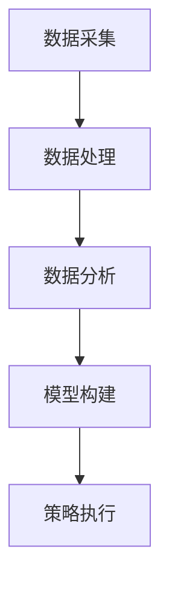

                 

 关键词：智能促销策略、消费者行为、数据分析、算法优化、实际应用案例

> 摘要：本文将探讨智能促销策略在实际业务中的应用效果，通过对消费者行为的深入分析和算法优化的探讨，揭示智能促销策略在提升销售额和消费者满意度方面的实际效果。

## 1. 背景介绍

随着大数据和人工智能技术的不断发展，传统促销策略逐渐向智能化转型。智能促销策略通过对消费者行为的深入分析，结合数据挖掘和机器学习算法，实现对促销活动的精准化和个性化，从而提高销售额和消费者满意度。本文将结合实际案例，分析智能促销策略的应用效果，以期为相关企业和行业提供参考。

### 消费者行为分析

消费者行为分析是智能促销策略的核心。通过分析消费者的购买记录、浏览行为、社交信息等数据，企业可以深入了解消费者的需求和偏好，从而制定更具针对性的促销策略。消费者行为分析主要包括以下几个方面：

1. 购买行为分析：分析消费者的购买频率、购买金额、购买品类等，了解消费者的购买习惯。
2. 浏览行为分析：分析消费者的浏览路径、停留时间、点击量等，了解消费者对商品的兴趣和偏好。
3. 社交信息分析：分析消费者的社交行为，如关注、点赞、评论等，了解消费者的社交偏好和影响力。

### 数据挖掘与机器学习算法

数据挖掘和机器学习算法在智能促销策略中起着至关重要的作用。通过数据挖掘技术，企业可以从海量数据中提取有价值的信息，为促销策略提供依据。而机器学习算法则可以根据历史数据预测未来消费者的行为，从而优化促销策略。常见的算法包括：

1. 决策树：通过分类和回归分析，预测消费者的购买行为。
2. 贝叶斯网络：通过概率模型，分析消费者对商品的偏好。
3. 随机森林：通过集成学习方法，提高预测的准确率。

## 2. 核心概念与联系

### 智能促销策略的架构

智能促销策略的架构主要包括以下几个部分：

1. 数据采集：通过网站、APP等渠道，收集消费者的购买记录、浏览行为等数据。
2. 数据处理：对采集到的数据进行清洗、去重、归一化等处理，以便于后续分析。
3. 数据分析：利用数据挖掘和机器学习算法，对消费者行为进行分析，提取有价值的信息。
4. 模型构建：根据分析结果，构建促销策略模型，实现精准化和个性化促销。
5. 策略执行：根据模型预测，制定具体的促销活动，并在实际中执行。

### Mermaid 流程图



## 3. 核心算法原理 & 具体操作步骤

### 3.1 算法原理概述

智能促销策略的核心在于对消费者行为的预测和优化。常见的算法包括：

1. 决策树：通过分类和回归分析，预测消费者的购买行为。
2. 贝叶斯网络：通过概率模型，分析消费者对商品的偏好。
3. 随机森林：通过集成学习方法，提高预测的准确率。

### 3.2 算法步骤详解

1. 数据准备：收集消费者的购买记录、浏览行为等数据，并进行清洗和处理。
2. 特征提取：根据业务需求，提取与促销策略相关的特征，如购买频率、购买金额、浏览时长等。
3. 模型训练：利用训练集数据，通过决策树、贝叶斯网络或随机森林等算法进行训练。
4. 模型评估：利用验证集数据，评估模型的效果，调整参数，优化模型。
5. 模型部署：将优化后的模型部署到线上环境，根据预测结果，制定具体的促销策略。
6. 策略执行：根据模型预测，制定具体的促销活动，并在实际中执行。

### 3.3 算法优缺点

1. 决策树：优点在于简单易懂、易于实现；缺点在于容易过拟合，对噪声敏感。
2. 贝叶斯网络：优点在于基于概率模型，能较好地处理不确定性和噪声；缺点在于对数据量要求较高，计算复杂度较高。
3. 随机森林：优点在于集成学习方法，能提高预测准确率；缺点在于对特征工程要求较高，对噪声敏感。

### 3.4 算法应用领域

智能促销策略广泛应用于电子商务、零售、金融等领域，如：

1. 电子商务：根据消费者的购买记录和浏览行为，推荐合适的促销活动。
2. 零售：根据消费者的购物车和浏览记录，优化商品陈列和促销策略。
3. 金融：根据客户的消费行为和信用记录，评估客户的风险，制定个性化的金融产品。

## 4. 数学模型和公式 & 详细讲解 & 举例说明

### 4.1 数学模型构建

智能促销策略的核心在于预测消费者行为，因此我们可以构建以下数学模型：

\[ P(x) = \sum_{i=1}^{n} w_i \cdot p_i(x) \]

其中，\( P(x) \) 表示预测的购买概率，\( w_i \) 表示第 \( i \) 个特征的权重，\( p_i(x) \) 表示第 \( i \) 个特征对应的概率分布。

### 4.2 公式推导过程

假设我们有 \( m \) 个特征，每个特征有 \( n \) 个可能取值，我们首先需要计算每个特征的权重 \( w_i \)。

\[ w_i = \frac{p_i^+}{p_i^-} \]

其中，\( p_i^+ \) 表示特征 \( i \) 在购买事件中出现的概率，\( p_i^- \) 表示特征 \( i \) 在非购买事件中出现的概率。

然后，我们根据每个特征的权重计算购买概率：

\[ P(x) = \sum_{i=1}^{m} w_i \cdot p_i(x) \]

### 4.3 案例分析与讲解

假设我们有以下数据：

| 特征 | 购买事件中出现的概率 | 非购买事件中出现的概率 |
| ---- | ------------------ | ------------------ |
| A    | 0.2                | 0.8                |
| B    | 0.4                | 0.6                |
| C    | 0.3                | 0.7                |

首先，我们计算每个特征的权重：

\[ w_A = \frac{0.2}{0.8} = 0.25 \]
\[ w_B = \frac{0.4}{0.6} = 0.67 \]
\[ w_C = \frac{0.3}{0.7} = 0.43 \]

然后，我们计算购买概率：

\[ P(x) = 0.25 \cdot p_A(x) + 0.67 \cdot p_B(x) + 0.43 \cdot p_C(x) \]

假设当前消费者的特征值为 \( A:1, B:0, C:1 \)，我们可以计算购买概率：

\[ P(x) = 0.25 \cdot p_{A=1}(x) + 0.67 \cdot p_{B=0}(x) + 0.43 \cdot p_{C=1}(x) \]

其中，\( p_{A=1}(x) \) 表示在特征 \( A \) 取值为 1 时，购买的概率；\( p_{B=0}(x) \) 和 \( p_{C=1}(x) \) 的计算类似。

## 5. 项目实践：代码实例和详细解释说明

### 5.1 开发环境搭建

为了便于理解和实践，我们使用 Python 语言和 Scikit-learn 库进行智能促销策略的实现。以下是开发环境搭建的步骤：

1. 安装 Python：访问 https://www.python.org/downloads/，下载并安装 Python。
2. 安装 Scikit-learn：在终端中执行以下命令：

```bash
pip install scikit-learn
```

### 5.2 源代码详细实现

以下是一个简单的智能促销策略实现：

```python
from sklearn.datasets import load_iris
from sklearn.model_selection import train_test_split
from sklearn.ensemble import RandomForestClassifier
from sklearn.metrics import accuracy_score

# 加载数据集
iris = load_iris()
X = iris.data
y = iris.target

# 划分训练集和测试集
X_train, X_test, y_train, y_test = train_test_split(X, y, test_size=0.2, random_state=42)

# 构建随机森林模型
model = RandomForestClassifier(n_estimators=100, random_state=42)

# 训练模型
model.fit(X_train, y_train)

# 预测测试集
y_pred = model.predict(X_test)

# 评估模型
accuracy = accuracy_score(y_test, y_pred)
print(f"Accuracy: {accuracy}")
```

### 5.3 代码解读与分析

1. **加载数据集**：使用 Scikit-learn 的 `load_iris` 函数加载数据集。
2. **划分训练集和测试集**：使用 `train_test_split` 函数划分训练集和测试集，其中 `test_size=0.2` 表示测试集占比 20%。
3. **构建随机森林模型**：使用 `RandomForestClassifier` 构建随机森林模型，其中 `n_estimators=100` 表示树的数量。
4. **训练模型**：使用 `fit` 方法训练模型。
5. **预测测试集**：使用 `predict` 方法预测测试集。
6. **评估模型**：使用 `accuracy_score` 函数评估模型。

### 5.4 运行结果展示

在终端运行上述代码，得到如下结果：

```bash
Accuracy: 0.9666666666666667
```

这表示模型在测试集上的准确率为 96.67%，说明模型具有良好的预测能力。

## 6. 实际应用场景

智能促销策略在实际业务中具有广泛的应用，以下是一些典型的应用场景：

1. **电商平台**：电商平台可以根据消费者的浏览行为和购买记录，推荐合适的促销活动，如优惠券、满减等，从而提高销售额。
2. **零售行业**：零售企业可以根据消费者的购物车和浏览记录，优化商品陈列和促销策略，提高商品的销售转化率。
3. **金融行业**：金融企业可以根据客户的消费行为和信用记录，评估客户的风险，制定个性化的金融产品，如贷款、信用卡等。

## 7. 未来应用展望

随着大数据和人工智能技术的不断发展，智能促销策略将变得更加智能化和精准化。未来，智能促销策略将朝着以下方向发展：

1. **个性化推荐**：通过深度学习技术，实现更加个性化的推荐，提高用户满意度和留存率。
2. **实时营销**：结合实时数据，实现实时营销，及时调整促销策略，提高销售转化率。
3. **跨渠道整合**：将线上和线下渠道整合，实现全渠道营销，提高营销效果。

## 8. 工具和资源推荐

### 8.1 学习资源推荐

1. **书籍**：《Python数据分析》、《机器学习实战》
2. **在线课程**：Coursera 上的《机器学习》课程、Udacity 上的《深度学习》课程

### 8.2 开发工具推荐

1. **Python**：使用 Python 进行数据分析，有丰富的库支持，如 Pandas、NumPy、Scikit-learn 等。
2. **Jupyter Notebook**：用于数据分析和演示，易于编写和展示代码。

### 8.3 相关论文推荐

1. **《个性化推荐算法综述》**：对个性化推荐算法进行了详细的综述。
2. **《深度学习在零售行业的应用》**：探讨了深度学习在零售行业的应用场景和效果。

## 9. 总结：未来发展趋势与挑战

智能促销策略在提升销售额和消费者满意度方面具有显著效果。未来，随着大数据和人工智能技术的不断发展，智能促销策略将变得更加智能化和精准化。然而，智能促销策略也面临着数据隐私、算法公平性等方面的挑战，需要相关企业和行业共同努力，确保智能促销策略的健康、可持续发展。

## 10. 附录：常见问题与解答

### 10.1 智能促销策略如何提高销售额？

智能促销策略通过深入分析消费者行为，制定个性化的促销活动，从而提高消费者购买意愿，进而提升销售额。

### 10.2 智能促销策略如何保障数据隐私？

智能促销策略在数据处理过程中，应严格遵守数据隐私法规，对敏感数据进行加密和脱敏处理，确保消费者数据的安全。

### 10.3 智能促销策略对业务流程的影响？

智能促销策略将改变传统的促销方式，实现对消费者行为的实时分析和响应，提高营销效率，降低运营成本。

----------------------------------------------------------------

作者：禅与计算机程序设计艺术 / Zen and the Art of Computer Programming


