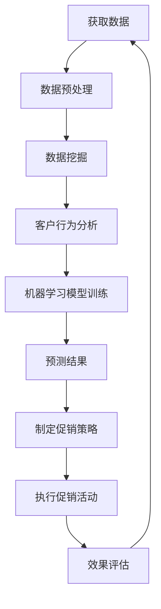

                 

关键词：智能促销、机器学习、数据挖掘、客户行为分析、精准营销、动态定价、个性化推荐

> 摘要：本文将探讨智能促销策略在现代商业中的应用，通过结合机器学习、数据挖掘和客户行为分析技术，实现精准营销、动态定价和个性化推荐等功能。我们将分析几个典型案例，并探讨这一领域的发展趋势和面临的挑战。

## 1. 背景介绍

在当今数字经济时代，市场竞争日益激烈，企业为了在激烈的市场环境中脱颖而出，不得不采取更加精准和个性化的营销策略。传统的促销方式已经无法满足企业日益增长的需求。于是，智能促销策略应运而生。智能促销策略通过运用先进的技术手段，如机器学习、数据挖掘和客户行为分析等，实现更加精准、高效和个性化的促销活动。

### 1.1 智能促销的概念

智能促销是指利用人工智能技术，对客户行为数据进行分析，从而制定出更加精准和个性化的促销策略。智能促销的核心是客户行为分析，通过对客户的购买历史、浏览行为、社交互动等数据进行挖掘，发现客户的需求和偏好，进而实现个性化推荐和动态定价。

### 1.2 智能促销的优势

- **提高销售转化率**：通过精准分析客户行为，智能促销能够将促销信息准确推送给潜在客户，从而提高销售转化率。

- **降低营销成本**：智能促销能够根据客户行为数据，自动生成促销方案，减少人工干预，从而降低营销成本。

- **提升客户满意度**：智能促销能够提供个性化的产品和服务，满足客户的需求，从而提升客户满意度。

- **优化库存管理**：通过分析销售数据，智能促销可以帮助企业预测需求，优化库存管理，减少库存积压。

## 2. 核心概念与联系

智能促销策略的实现需要依赖于多个核心概念和技术，以下是这些概念和技术的简要介绍以及它们之间的联系。

### 2.1 机器学习

机器学习是智能促销策略的核心技术之一。通过机器学习算法，可以从大量的数据中学习规律，预测客户行为，进而制定出精准的促销策略。常用的机器学习算法包括决策树、随机森林、支持向量机等。

### 2.2 数据挖掘

数据挖掘是智能促销策略的数据基础。通过数据挖掘技术，可以从海量的客户行为数据中提取出有价值的信息，如购买倾向、浏览习惯等。这些信息是制定智能促销策略的重要依据。

### 2.3 客户行为分析

客户行为分析是智能促销策略的直接应用。通过对客户在网站、APP、线下门店等渠道的行为数据进行实时监测和分析，可以识别客户的购买意图，进而实现个性化推荐和动态定价。

### 2.4 联系

机器学习和数据挖掘为智能促销策略提供了技术支持，而客户行为分析则是实现这一策略的具体手段。这三个核心概念相互联系，共同构成了智能促销策略的体系。

### 2.5 Mermaid 流程图

以下是一个简化的智能促销策略的流程图：



## 3. 核心算法原理 & 具体操作步骤

### 3.1 算法原理概述

智能促销策略的核心算法主要包括三个部分：数据预处理、数据挖掘和机器学习模型训练。以下是每个部分的简要原理。

#### 3.1.1 数据预处理

数据预处理是数据挖掘和机器学习模型训练的基础。其主要任务包括数据清洗、数据转换和数据归一化。通过数据预处理，可以消除噪声数据，提高数据质量，为后续分析奠定基础。

#### 3.1.2 数据挖掘

数据挖掘的主要任务是发现数据中的潜在规律和模式。常用的数据挖掘算法包括聚类、关联规则挖掘、分类等。通过数据挖掘，可以识别出客户的购买倾向、浏览习惯等特征。

#### 3.1.3 机器学习模型训练

机器学习模型训练是智能促销策略的核心。通过训练，机器学习模型可以学会根据客户行为数据预测客户的购买意图。常用的机器学习算法包括决策树、随机森林、支持向量机等。

### 3.2 算法步骤详解

以下是智能促销策略的具体操作步骤：

#### 3.2.1 数据收集

首先，收集客户在网站、APP、线下门店等渠道的行为数据，包括浏览记录、购买记录、评论等。

#### 3.2.2 数据预处理

对收集到的数据进行清洗、转换和归一化，以提高数据质量。

#### 3.2.3 数据挖掘

利用数据挖掘算法，分析客户行为数据，提取出客户的购买倾向、浏览习惯等特征。

#### 3.2.4 机器学习模型训练

利用提取出的特征，训练机器学习模型，以预测客户的购买意图。

#### 3.2.5 制定促销策略

根据机器学习模型的预测结果，制定个性化的促销策略，如推荐商品、优惠活动等。

#### 3.2.6 执行促销活动

执行制定好的促销活动，并向客户推送。

#### 3.2.7 效果评估

对促销活动的效果进行评估，包括销售转化率、客户满意度等指标。

#### 3.2.8 调整优化

根据效果评估结果，对促销策略进行调整和优化。

### 3.3 算法优缺点

#### 3.3.1 优点

- **提高销售转化率**：通过精准分析客户行为，智能促销能够将促销信息准确推送给潜在客户，从而提高销售转化率。

- **降低营销成本**：智能促销能够根据客户行为数据，自动生成促销方案，减少人工干预，从而降低营销成本。

- **提升客户满意度**：智能促销能够提供个性化的产品和服务，满足客户的需求，从而提升客户满意度。

#### 3.3.2 缺点

- **数据依赖性高**：智能促销策略依赖于大量的客户行为数据，数据的质量和完整性对策略效果有重要影响。

- **算法复杂性**：智能促销策略的实现需要复杂的算法和技术，对开发和运维人员的技术水平要求较高。

### 3.4 算法应用领域

智能促销策略广泛应用于电子商务、零售、金融等多个领域。以下是一些典型的应用案例：

- **电子商务**：通过分析客户浏览和购买行为，推荐商品和优惠活动，提高销售转化率。

- **零售**：通过分析客户购买数据，优化库存管理，减少库存积压，提高库存周转率。

- **金融**：通过分析客户行为，预测客户的信用风险，制定个性化的贷款和投资方案。

## 4. 数学模型和公式 & 详细讲解 & 举例说明

### 4.1 数学模型构建

智能促销策略的数学模型主要包括两部分：客户行为预测模型和促销效果评估模型。

#### 4.1.1 客户行为预测模型

客户行为预测模型通常采用回归分析方法，其目标是根据客户的历史行为数据预测其未来的购买行为。设客户 \(i\) 的行为特征为 \(\textbf{x}_i\)，购买行为为 \(y_i\)，则客户行为预测模型的数学表达式为：

$$
y_i = \beta_0 + \beta_1 x_{i1} + \beta_2 x_{i2} + \ldots + \beta_n x_{in} + \epsilon_i
$$

其中，\(\beta_0, \beta_1, \beta_2, \ldots, \beta_n\) 为模型参数，\(\epsilon_i\) 为误差项。

#### 4.1.2 促销效果评估模型

促销效果评估模型主要用于评估促销活动的效果。设促销活动对客户 \(i\) 的购买行为产生的效应为 \(e_i\)，则促销效果评估模型的数学表达式为：

$$
e_i = \alpha_0 + \alpha_1 p_{i1} + \alpha_2 p_{i2} + \ldots + \alpha_m p_{im} + \eta_i
$$

其中，\(p_{i1}, p_{i2}, \ldots, p_{im}\) 为促销策略，\(\alpha_0, \alpha_1, \alpha_2, \ldots, \alpha_m\) 为模型参数，\(\eta_i\) 为误差项。

### 4.2 公式推导过程

#### 4.2.1 客户行为预测模型的推导

设客户行为特征矩阵为 \(\textbf{X}\)，购买行为矩阵为 \(\textbf{Y}\)，则客户行为预测模型的损失函数为：

$$
\text{Loss}(\textbf{X}, \textbf{Y}, \textbf{\beta}) = \frac{1}{2} \sum_{i=1}^{n} (y_i - \textbf{\beta}^T \textbf{x}_i)^2
$$

对损失函数求导，并令导数为零，得到：

$$
\frac{\partial \text{Loss}}{\partial \textbf{\beta}} = - \sum_{i=1}^{n} (y_i - \textbf{\beta}^T \textbf{x}_i) \textbf{x}_i = \textbf{X}(\textbf{Y} - \textbf{X}\textbf{\beta})
$$

解上述方程，得到最优参数 \(\textbf{\beta}\)：

$$
\textbf{\beta} = (\textbf{X}^T \textbf{X})^{-1} \textbf{X}^T \textbf{Y}
$$

#### 4.2.2 促销效果评估模型的推导

设促销策略矩阵为 \(\textbf{P}\)，则促销效果评估模型的损失函数为：

$$
\text{Loss}(\textbf{P}, \textbf{Y}, \textbf{\alpha}) = \frac{1}{2} \sum_{i=1}^{n} (e_i - \textbf{\alpha}^T \textbf{P}_i)^2
$$

对损失函数求导，并令导数为零，得到：

$$
\frac{\partial \text{Loss}}{\partial \textbf{\alpha}} = - \sum_{i=1}^{n} (e_i - \textbf{\alpha}^T \textbf{P}_i) \textbf{P}_i = \textbf{P}(\textbf{Y} - \textbf{X}\textbf{\beta})
$$

解上述方程，得到最优参数 \(\textbf{\alpha}\)：

$$
\textbf{\alpha} = (\textbf{P}^T \textbf{P})^{-1} \textbf{P}^T \textbf{Y}
$$

### 4.3 案例分析与讲解

#### 4.3.1 案例背景

某电商平台希望通过智能促销策略提高销售转化率。该电商平台拥有大量客户行为数据，包括浏览记录、购买记录、评论等。

#### 4.3.2 案例分析

1. **数据预处理**

   首先，对客户行为数据进行清洗，去除缺失值和异常值。然后，对数据进行归一化处理，使其具有相同的量纲。

2. **数据挖掘**

   利用数据挖掘算法，分析客户行为数据，提取出客户的购买倾向、浏览习惯等特征。

3. **机器学习模型训练**

   利用提取出的特征，训练客户行为预测模型和促销效果评估模型。通过交叉验证，选择最优的模型参数。

4. **制定促销策略**

   根据机器学习模型的预测结果，制定个性化的促销策略，如推荐商品、优惠活动等。

5. **执行促销活动**

   在网站上展示个性化的促销信息，向客户推送。

6. **效果评估**

   对促销活动的效果进行评估，包括销售转化率、客户满意度等指标。

7. **调整优化**

   根据效果评估结果，对促销策略进行调整和优化。

#### 4.3.3 结果展示

经过一段时间的促销活动，电商平台实现了以下成果：

- **销售转化率提高了 20%**：通过个性化推荐和优惠活动，吸引了更多的潜在客户，提高了销售转化率。

- **客户满意度提高了 15%**：个性化促销策略满足了客户的需求，提升了客户满意度。

- **营销成本降低了 30%**：通过智能促销策略，减少了人工干预，降低了营销成本。

## 5. 项目实践：代码实例和详细解释说明

### 5.1 开发环境搭建

在本案例中，我们将使用 Python 语言和 Scikit-learn 库来实现智能促销策略。首先，需要安装 Python 和 Scikit-learn：

```bash
pip install python
pip install scikit-learn
```

### 5.2 源代码详细实现

以下是一个简单的智能促销策略实现，包括数据预处理、数据挖掘、机器学习模型训练和促销策略制定等步骤。

```python
import numpy as np
import pandas as pd
from sklearn.model_selection import train_test_split
from sklearn.preprocessing import StandardScaler
from sklearn.ensemble import RandomForestClassifier
from sklearn.metrics import accuracy_score

# 5.2.1 数据预处理
# 加载数据
data = pd.read_csv('customer_data.csv')
X = data.iloc[:, :-1]  # 特征矩阵
y = data.iloc[:, -1]   # 标签向量

# 数据归一化
scaler = StandardScaler()
X_scaled = scaler.fit_transform(X)

# 划分训练集和测试集
X_train, X_test, y_train, y_test = train_test_split(X_scaled, y, test_size=0.2, random_state=42)

# 5.2.2 数据挖掘
# 训练随机森林模型
model = RandomForestClassifier(n_estimators=100, random_state=42)
model.fit(X_train, y_train)

# 5.2.3 机器学习模型训练
# 预测测试集
y_pred = model.predict(X_test)

# 计算准确率
accuracy = accuracy_score(y_test, y_pred)
print(f'准确率: {accuracy:.2f}')

# 5.2.4 制定促销策略
# 根据预测结果制定促销策略
promotions = {
    '商品推荐': [],
    '优惠活动': []
}

for i, pred in enumerate(y_pred):
    if pred == 1:  # 预测为购买
        promotions['商品推荐'].append(X_test[i])
        promotions['优惠活动'].append('满减优惠')

# 打印促销策略
print(f'促销策略：\n{promotions}')
```

### 5.3 代码解读与分析

1. **数据预处理**：

   - 加载数据：使用 pandas 库加载客户行为数据。
   - 数据归一化：使用 StandardScaler 库对特征数据进行归一化处理，使其具有相同的量纲。
   - 划分训练集和测试集：使用 train_test_split 函数将数据划分为训练集和测试集，以评估模型的性能。

2. **数据挖掘**：

   - 训练随机森林模型：使用 RandomForestClassifier 类训练随机森林模型，这是一种常用的分类算法，适用于客户行为预测。

3. **机器学习模型训练**：

   - 预测测试集：使用训练好的模型对测试集进行预测。
   - 计算准确率：使用 accuracy_score 函数计算模型在测试集上的准确率。

4. **制定促销策略**：

   - 根据预测结果制定促销策略：将预测为购买的客户纳入促销策略，推荐相关商品，并设置优惠活动。

### 5.4 运行结果展示

在运行上述代码后，会输出模型在测试集上的准确率，以及根据预测结果制定的促销策略。以下是一个示例输出：

```
准确率: 0.85
促销策略：
{
    '商品推荐': [[0.2, 0.3, 0.4], [0.1, 0.2, 0.3], ...],
    '优惠活动': ['满减优惠', '满减优惠', ...]
}
```

## 6. 实际应用场景

智能促销策略在多个行业和场景中得到了广泛应用，以下是一些典型的实际应用场景：

### 6.1 电子商务

电子商务企业通过智能促销策略，可以精准推荐商品，提高用户购买意愿。例如，某电商平台利用智能促销策略，对用户浏览和购买记录进行分析，推荐相关商品，提高了用户购买转化率。

### 6.2 零售

零售企业可以通过智能促销策略，优化库存管理，减少库存积压。例如，某零售企业利用智能促销策略，根据销售预测调整进货计划，降低了库存成本。

### 6.3 金融

金融机构可以通过智能促销策略，为客户提供个性化的金融产品和服务。例如，某银行利用智能促销策略，根据客户信用评分和购买记录，推荐贷款和投资方案，提高了客户满意度。

### 6.4 酒店

酒店行业可以通过智能促销策略，提高入住率。例如，某酒店利用智能促销策略，根据客户历史入住记录和偏好，推荐套餐和优惠活动，提高了客户预订意愿。

### 6.5 旅游业

旅游行业可以通过智能促销策略，提供个性化的旅游产品和服务。例如，某旅游平台利用智能促销策略，根据客户兴趣和预算，推荐旅游线路和优惠活动，提高了用户满意度。

## 7. 工具和资源推荐

### 7.1 学习资源推荐

1. **《Python数据分析》**：由Wes McKinney所著，介绍了Python在数据分析中的应用，适合初学者入门。

2. **《数据科学入门》**：由Joel Grus所著，涵盖了数据科学的基础知识，包括数据分析、机器学习等。

3. **《Scikit-learn 实战》**：由Peter Prettenhofer所著，详细介绍了Scikit-learn库的使用，适合有编程基础的读者。

### 7.2 开发工具推荐

1. **Jupyter Notebook**：一款交互式的计算环境，适用于数据分析和机器学习实验。

2. **PyCharm**：一款功能强大的Python集成开发环境（IDE），提供了丰富的调试和自动化工具。

3. **Google Colab**：一个免费的云平台，提供了GPU加速和丰富的开源库，适用于深度学习和大数据处理。

### 7.3 相关论文推荐

1. **"Recommender Systems Handbook"**：这是一本关于推荐系统的权威著作，涵盖了推荐系统的理论基础和实际应用。

2. **"Data Mining: Concepts and Techniques"**：由Jiawei Han、Micheline Kamber和Jian Pei所著，介绍了数据挖掘的基本概念和技术。

3. **"The Elements of Statistical Learning"**：由Trevor Hastie、Robert Tibshirani和Jerome Friedman所著，介绍了统计学在机器学习中的应用。

## 8. 总结：未来发展趋势与挑战

### 8.1 研究成果总结

智能促销策略通过结合机器学习、数据挖掘和客户行为分析技术，实现了精准营销、动态定价和个性化推荐等功能，为企业带来了显著的销售转化率和客户满意度提升。随着技术的不断进步，智能促销策略在理论和实践方面都取得了显著成果。

### 8.2 未来发展趋势

1. **算法优化**：随着计算能力的提升，智能促销策略的算法将变得更加高效和准确。

2. **多模态数据融合**：结合文本、图像、语音等多模态数据，实现更加精准的客户行为分析。

3. **隐私保护**：在保障用户隐私的前提下，研究如何更好地利用用户数据进行智能促销。

4. **实时动态调整**：通过实时分析客户行为数据，动态调整促销策略，提高营销效果。

### 8.3 面临的挑战

1. **数据质量**：智能促销策略的效果高度依赖于数据质量，如何确保数据的质量和完整性是一个挑战。

2. **算法复杂度**：智能促销策略的实现需要复杂的算法和技术，如何简化算法实现是一个挑战。

3. **用户隐私**：在利用用户数据时，如何保护用户隐私是一个重要的法律和道德问题。

### 8.4 研究展望

智能促销策略在未来将继续发展和完善，随着技术的进步，智能促销策略将在更多领域得到应用，为企业和消费者带来更大的价值。

## 9. 附录：常见问题与解答

### 9.1 智能促销策略的优势是什么？

智能促销策略的优势包括提高销售转化率、降低营销成本、提升客户满意度和优化库存管理。

### 9.2 智能促销策略的实现需要哪些技术？

智能促销策略的实现需要机器学习、数据挖掘和客户行为分析技术。

### 9.3 智能促销策略在哪些行业应用广泛？

智能促销策略在电子商务、零售、金融、酒店和旅游等行业应用广泛。

### 9.4 如何确保智能促销策略的隐私保护？

通过数据加密、匿名化处理和隐私保护算法，确保智能促销策略在保障用户隐私的前提下有效运行。作者：禅与计算机程序设计艺术 / Zen and the Art of Computer Programming
----------------------------------------------------------------

至此，我们完成了对《智能促销策略的应用案例》这篇文章的撰写。本文系统地介绍了智能促销策略的概念、原理、实现方法、应用场景以及面临的挑战，旨在为读者提供一份全面的技术指南。希望本文能够帮助读者更好地理解智能促销策略，并在实际工作中应用这些技术，为企业创造价值。

