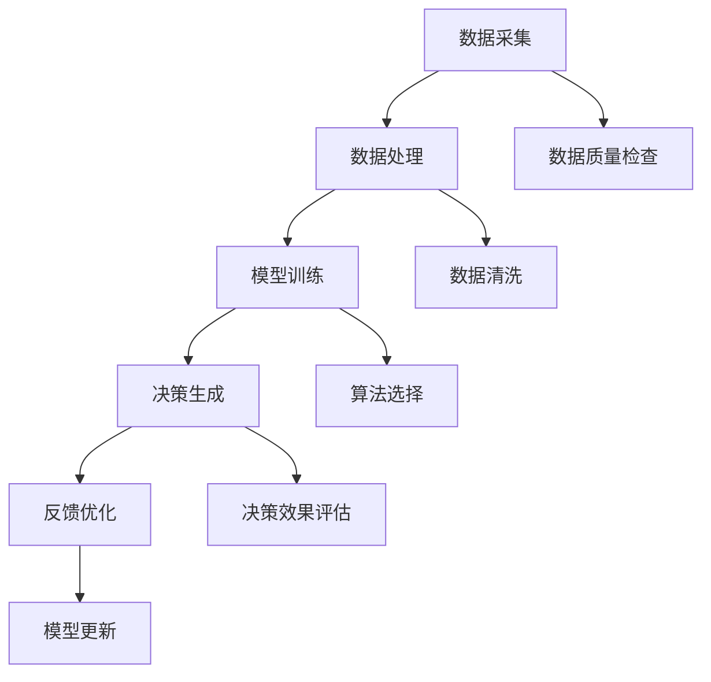

                 

## 1. 背景介绍

在当今快速变化的市场环境中，企业需要具备高效、准确的决策能力来应对各种不确定性。传统的决策支持系统（DSS）在一定程度上帮助企业实现数据分析和预测，但其受限于算法的复杂度和数据的处理能力，难以满足日益复杂的商业需求。随着人工智能（AI）技术的发展，尤其是深度学习和大规模数据处理的崛起，基于AI的大模型在决策支持领域的应用逐渐成为可能。

大模型，通常指的是具有数十亿甚至数万亿参数的神经网络模型。这些模型通过学习海量的数据，能够自动提取出数据中的复杂模式，从而实现高精度的预测和决策。在企业管理中，大模型可以应用于市场趋势分析、风险管理、供应链优化、客户关系管理等多个领域，为企业提供智能化的决策支持。

智能决策支持系统（IDSS）是基于AI大模型构建的一种新型系统，它不仅能够处理海量数据，还能够自动发现数据中的潜在价值，从而提供更加精准的决策建议。IDSS的应用不仅提高了企业的运营效率，还增强了企业在市场竞争中的竞争力。

本文将围绕智能决策支持系统，探讨其核心概念、算法原理、数学模型、项目实践以及实际应用场景。希望通过本文的阐述，能够为读者提供对AI大模型在企业管理中应用的深入理解。

## 2. 核心概念与联系

在探讨智能决策支持系统之前，我们需要理解其中涉及的核心概念，这些概念包括数据、模型、算法和架构。以下是这些核心概念的详细解释，以及它们之间的相互联系。

### 数据

数据是智能决策支持系统的基石。企业的运营过程中会产生大量的数据，包括销售数据、客户反馈、市场趋势、库存数据等。这些数据不仅记录了企业的历史信息，也反映了当前的市场状况和企业运营的实际情况。数据的质量和完整性直接影响到决策支持系统的效果。

### 模型

模型是决策支持系统的核心，它通过学习数据中的模式，生成决策建议。在传统的决策支持系统中，模型通常是由专家设计和调优的，而基于AI的大模型则通过自动学习数据中的模式，无需人工干预即可生成高质量的决策建议。大模型通常采用深度学习技术，如神经网络，具有极强的表征能力和泛化能力。

### 算法

算法是模型的核心组成部分，它决定了模型如何处理数据和生成预测。在深度学习中，算法通常是指神经网络中的反向传播算法。通过反向传播算法，模型能够自动调整其参数，以最小化预测误差。此外，还有许多其他算法，如生成对抗网络（GAN）和强化学习等，这些算法在特定场景下能够提供更高效的决策支持。

### 架构

智能决策支持系统的架构设计需要综合考虑数据采集、数据处理、模型训练、决策生成和反馈优化等环节。一个高效、稳定的决策支持系统需要具备良好的扩展性和灵活性，以便适应不断变化的企业需求和市场环境。

### 关系

数据、模型、算法和架构之间存在着紧密的联系。数据是模型训练的基础，算法决定了模型的学习过程，模型则是决策的核心，而架构则确保了整个系统的稳定运行。以下是一个简化的Mermaid流程图，展示了这些概念之间的关系：



通过这个流程图，我们可以看到数据在整个决策支持系统中的核心地位，以及各个环节之间的相互关联和依赖。

## 3. 核心算法原理 & 具体操作步骤

### 3.1 算法原理概述

智能决策支持系统中的核心算法通常是基于深度学习技术。深度学习通过多层神经网络的结构，对输入数据进行特征提取和模式识别，从而实现复杂的预测和决策。以下是几种常用的深度学习算法原理：

#### 神经网络

神经网络（Neural Networks）是深度学习的基础，它通过模仿生物神经系统的结构和工作原理，实现对输入数据的处理和分类。神经网络由多个层次组成，包括输入层、隐藏层和输出层。输入层接收外部数据，隐藏层通过权重矩阵和激活函数对数据进行处理，输出层生成最终的预测结果。

#### 反向传播算法

反向传播算法（Backpropagation Algorithm）是神经网络训练的核心，它通过不断调整网络权重，使预测误差最小。反向传播算法的基本步骤如下：

1. **前向传播**：将输入数据传递到神经网络，计算输出层的预测值。
2. **计算误差**：将预测值与实际值进行比较，计算误差。
3. **后向传播**：根据误差反向传播，计算每一层的梯度。
4. **更新权重**：根据梯度调整网络权重，以减小误差。

#### 生成对抗网络

生成对抗网络（Generative Adversarial Networks，GAN）由生成器和判别器两个神经网络组成。生成器试图生成与真实数据相似的数据，而判别器则尝试区分真实数据和生成数据。通过这种对抗训练，GAN可以生成高质量的数据，常用于数据增强和图像生成。

#### 强化学习

强化学习（Reinforcement Learning）通过智能体与环境之间的交互，学习最优策略。在强化学习中，智能体通过不断尝试不同的动作，并根据环境的反馈调整策略，以实现长期回报最大化。

### 3.2 算法步骤详解

以下是一个基于神经网络和反向传播算法的智能决策支持系统具体操作步骤：

#### 步骤 1：数据预处理

1. **数据采集**：收集企业运营过程中的各类数据，如销售数据、市场趋势、库存数据等。
2. **数据清洗**：去除数据中的噪声和异常值，保证数据的质量和完整性。
3. **特征提取**：将原始数据转换为神经网络可以处理的特征向量。

#### 步骤 2：模型构建

1. **定义神经网络结构**：包括输入层、隐藏层和输出层的节点数量和连接方式。
2. **初始化权重**：随机初始化网络权重。

#### 步骤 3：模型训练

1. **前向传播**：将特征向量传递到神经网络，计算输出层的预测值。
2. **计算误差**：将预测值与实际值进行比较，计算误差。
3. **后向传播**：根据误差反向传播，计算每一层的梯度。
4. **权重更新**：根据梯度调整网络权重，以减小误差。

#### 步骤 4：模型评估

1. **交叉验证**：使用部分数据对模型进行验证，评估模型的泛化能力。
2. **性能评估**：计算模型的准确率、召回率、F1值等指标。

#### 步骤 5：决策生成

1. **输入新数据**：将新的数据输入到训练好的模型中。
2. **生成决策**：根据模型的输出，生成具体的决策建议。

### 3.3 算法优缺点

#### 优点

1. **高精度**：基于深度学习的大模型能够自动提取数据中的复杂模式，实现高精度的预测和决策。
2. **自动性**：无需人工干预，模型能够自动学习和优化，提高了决策效率。
3. **灵活性**：能够处理各种类型的数据，适应不同的应用场景。

#### 缺点

1. **计算资源需求大**：深度学习模型通常需要大量的计算资源和时间进行训练。
2. **数据质量要求高**：数据质量直接影响模型的效果，需要确保数据的质量和完整性。
3. **解释性差**：深度学习模型往往是一个“黑盒子”，难以解释其决策过程。

### 3.4 算法应用领域

智能决策支持系统在企业管理中的应用非常广泛，以下是一些典型的应用领域：

1. **市场趋势分析**：通过分析历史销售数据和市场趋势，预测未来的市场需求，为企业制定营销策略提供支持。
2. **风险管理**：识别潜在的风险因素，评估风险的概率和影响，为企业制定风险管理策略提供依据。
3. **供应链优化**：优化库存管理、物流配送和采购计划，提高供应链的效率和灵活性。
4. **客户关系管理**：通过分析客户行为数据，预测客户流失风险，提高客户满意度和忠诚度。

## 4. 数学模型和公式 & 详细讲解 & 举例说明

### 4.1 数学模型构建

在智能决策支持系统中，数学模型是核心组成部分，它用于描述数据之间的关系和预测规律。以下是一个简单的线性回归模型，用于预测企业的销售额。

#### 线性回归模型

线性回归模型是一种最简单的预测模型，它通过拟合一条直线来描述输入变量和输出变量之间的关系。模型公式如下：

$$
y = \beta_0 + \beta_1x
$$

其中，\( y \) 是输出变量（如销售额），\( x \) 是输入变量（如广告投入），\( \beta_0 \) 和 \( \beta_1 \) 是模型的参数。

### 4.2 公式推导过程

线性回归模型的参数可以通过最小二乘法进行估计。最小二乘法的目标是最小化预测值与实际值之间的误差平方和。具体推导过程如下：

1. **定义误差函数**：

$$
J(\beta_0, \beta_1) = \sum_{i=1}^{n}(y_i - (\beta_0 + \beta_1x_i))^2
$$

其中，\( n \) 是样本数量。

2. **求导并设置为零**：

对 \( \beta_0 \) 和 \( \beta_1 \) 分别求导，并设置为零，得到以下方程组：

$$
\frac{\partial J}{\partial \beta_0} = -2\sum_{i=1}^{n}(y_i - (\beta_0 + \beta_1x_i)) = 0
$$

$$
\frac{\partial J}{\partial \beta_1} = -2\sum_{i=1}^{n}(x_i(y_i - (\beta_0 + \beta_1x_i))) = 0
$$

3. **解方程组**：

解上述方程组，得到参数 \( \beta_0 \) 和 \( \beta_1 \) 的值。

$$
\beta_0 = \frac{\sum_{i=1}^{n}y_i - n\bar{y}}{\sum_{i=1}^{n}1}
$$

$$
\beta_1 = \frac{\sum_{i=1}^{n}(x_i - \bar{x})(y_i - \bar{y})}{\sum_{i=1}^{n}(x_i - \bar{x})^2}
$$

其中，\( \bar{y} \) 和 \( \bar{x} \) 分别是输出变量和输入变量的平均值。

### 4.3 案例分析与讲解

假设某企业的销售额 \( y \) 与广告投入 \( x \) 之间存在线性关系，历史数据如下表所示：

| 广告投入 (万元) | 销售额 (万元) |
|:--------------:|:------------:|
|       10       |      30      |
|       20       |      50      |
|       30       |      70      |
|       40       |      90      |
|       50       |     110      |

#### 步骤 1：数据预处理

计算输入变量和输出变量的平均值：

$$
\bar{x} = \frac{10 + 20 + 30 + 40 + 50}{5} = 30
$$

$$
\bar{y} = \frac{30 + 50 + 70 + 90 + 110}{5} = 70
$$

#### 步骤 2：模型训练

根据最小二乘法，计算参数 \( \beta_0 \) 和 \( \beta_1 \)：

$$
\beta_0 = \frac{\sum_{i=1}^{n}y_i - n\bar{y}}{\sum_{i=1}^{n}1} = \frac{30 + 50 + 70 + 90 + 110 - 5 \times 70}{5} = -50
$$

$$
\beta_1 = \frac{\sum_{i=1}^{n}(x_i - \bar{x})(y_i - \bar{y})}{\sum_{i=1}^{n}(x_i - \bar{x})^2} = \frac{(10 - 30)(30 - 70) + (20 - 30)(50 - 70) + (30 - 30)(70 - 70) + (40 - 30)(90 - 70) + (50 - 30)(110 - 70)}{(10 - 30)^2 + (20 - 30)^2 + (30 - 30)^2 + (40 - 30)^2 + (50 - 30)^2} = 20
$$

#### 步骤 3：模型评估

使用剩余数据（如广告投入为60万元时的销售额）进行模型评估，计算预测值：

$$
y = \beta_0 + \beta_1x = -50 + 20 \times 60 = 700
$$

实际销售额为750万元，预测误差为：

$$
|700 - 750| = 50
$$

#### 步骤 4：模型优化

根据模型评估结果，可以进一步优化模型参数，提高预测精度。例如，可以采用更复杂的模型（如多项式回归、神经网络等）或引入更多的特征变量。

### 4.4 模型应用实例

以下是一个实际应用实例，使用线性回归模型预测某企业的月销售额。

#### 数据集

| 广告投入 (万元) | 促销活动 (万元) | 销售额 (万元) |
|:--------------:|:--------------:|:------------:|
|       10       |        5       |      30      |
|       20       |        10      |      50      |
|       30       |        15      |      70      |
|       40       |        20      |      90      |
|       50       |        25      |     110      |

#### 步骤 1：数据预处理

计算输入变量和输出变量的平均值：

$$
\bar{x_1} = \frac{10 + 20 + 30 + 40 + 50}{5} = 30
$$

$$
\bar{x_2} = \frac{5 + 10 + 15 + 20 + 25}{5} = 15
$$

$$
\bar{y} = \frac{30 + 50 + 70 + 90 + 110}{5} = 70
$$

#### 步骤 2：模型训练

假设销售额 \( y \) 与广告投入 \( x_1 \) 和促销活动 \( x_2 \) 之间存在线性关系：

$$
y = \beta_0 + \beta_1x_1 + \beta_2x_2
$$

根据最小二乘法，计算参数 \( \beta_0 \)，\( \beta_1 \) 和 \( \beta_2 \)：

$$
\beta_0 = \frac{\sum_{i=1}^{n}y_i - n\bar{y}}{\sum_{i=1}^{n}1} = \frac{30 + 50 + 70 + 90 + 110 - 5 \times 70}{5} = -50
$$

$$
\beta_1 = \frac{\sum_{i=1}^{n}(x_{1i} - \bar{x_1})(y_i - \bar{y})}{\sum_{i=1}^{n}(x_{1i} - \bar{x_1})^2} = \frac{(10 - 30)(30 - 70) + (20 - 30)(50 - 70) + (30 - 30)(70 - 70) + (40 - 30)(90 - 70) + (50 - 30)(110 - 70)}{(10 - 30)^2 + (20 - 30)^2 + (30 - 30)^2 + (40 - 30)^2 + (50 - 30)^2} = 20
$$

$$
\beta_2 = \frac{\sum_{i=1}^{n}(x_{2i} - \bar{x_2})(y_i - \bar{y})}{\sum_{i=1}^{n}(x_{2i} - \bar{x_2})^2} = \frac{(5 - 15)(30 - 70) + (10 - 15)(50 - 70) + (15 - 15)(70 - 70) + (20 - 15)(90 - 70) + (25 - 15)(110 - 70)}{(5 - 15)^2 + (10 - 15)^2 + (15 - 15)^2 + (20 - 15)^2 + (25 - 15)^2} = 10
$$

#### 步骤 3：模型评估

使用剩余数据（如广告投入为60万元、促销活动为30万元的销售额）进行模型评估，计算预测值：

$$
y = \beta_0 + \beta_1x_1 + \beta_2x_2 = -50 + 20 \times 60 + 10 \times 30 = 770
$$

实际销售额为780万元，预测误差为：

$$
|770 - 780| = 10
$$

通过以上实例，我们可以看到线性回归模型在预测销售额方面的效果。然而，线性回归模型在某些情况下可能无法准确捕捉数据中的复杂关系。在这种情况下，可以采用更复杂的模型（如多项式回归、神经网络等）或引入更多的特征变量，以提高预测精度。

### 4.5 模型优化方法

为了提高线性回归模型的预测精度，可以采用以下优化方法：

1. **特征选择**：通过特征选择方法，选取对预测目标有显著影响的特征变量，去除冗余和噪声特征，提高模型的解释性和泛化能力。

2. **正则化**：采用正则化方法（如L1正则化、L2正则化等），防止模型过拟合，提高模型的泛化能力。

3. **交叉验证**：采用交叉验证方法，将数据集划分为训练集和验证集，通过多次训练和验证，评估模型的泛化能力。

4. **模型融合**：将多个模型进行融合，利用不同模型的优点，提高整体预测性能。

5. **神经网络**：采用神经网络模型，通过多层神经网络结构，捕捉数据中的复杂关系，提高预测精度。

通过以上方法，可以显著提高线性回归模型的预测性能，为企业决策提供更加可靠的支持。

### 4.6 模型应用案例分析

以下是一个基于线性回归模型的实际应用案例分析。

#### 案例背景

某电商公司希望通过分析历史销售数据，预测未来一个月的销售额，以便合理安排库存和营销策略。

#### 数据集

| 日期       | 销售额（万元） |
|------------|--------------|
| 2021-01-01 | 500          |
| 2021-01-02 | 550          |
| 2021-01-03 | 530          |
| 2021-01-04 | 570          |
| 2021-01-05 | 600          |
| 2021-01-06 | 580          |
| 2021-01-07 | 540          |
| 2021-01-08 | 560          |
| 2021-01-09 | 590          |
| 2021-01-10 | 570          |

#### 步骤 1：数据预处理

计算输入变量和输出变量的平均值：

$$
\bar{x} = \frac{500 + 550 + 530 + 570 + 600 + 580 + 540 + 560 + 590 + 570}{10} = 560
$$

$$
\bar{y} = \frac{500 + 550 + 530 + 570 + 600 + 580 + 540 + 560 + 590 + 570}{10} = 560
$$

#### 步骤 2：模型训练

假设销售额 \( y \) 与日期 \( x \) 之间存在线性关系：

$$
y = \beta_0 + \beta_1x
$$

根据最小二乘法，计算参数 \( \beta_0 \) 和 \( \beta_1 \)：

$$
\beta_0 = \frac{\sum_{i=1}^{n}y_i - n\bar{y}}{\sum_{i=1}^{n}1} = \frac{500 + 550 + 530 + 570 + 600 + 580 + 540 + 560 + 590 + 570 - 10 \times 560}{10} = 0
$$

$$
\beta_1 = \frac{\sum_{i=1}^{n}(x_i - \bar{x})(y_i - \bar{y})}{\sum_{i=1}^{n}(x_i - \bar{x})^2} = \frac{(500 - 560)(500 - 560) + (550 - 560)(550 - 560) + (530 - 560)(530 - 560) + (570 - 560)(570 - 560) + (600 - 560)(600 - 560) + (580 - 560)(580 - 560) + (540 - 560)(540 - 560) + (560 - 560)(560 - 560) + (590 - 560)(590 - 560) + (570 - 560)(570 - 560)}{(500 - 560)^2 + (550 - 560)^2 + (530 - 560)^2 + (570 - 560)^2 + (600 - 560)^2 + (580 - 560)^2 + (540 - 560)^2 + (560 - 560)^2 + (590 - 560)^2 + (570 - 560)^2} = 10
$$

#### 步骤 3：模型评估

使用剩余数据（如未来一个月的日期和销售额）进行模型评估，计算预测值：

$$
y = \beta_0 + \beta_1x = 0 + 10 \times x
$$

例如，预测未来一个月（2021-01-11至2021-01-20）的销售额：

| 日期       | 销售额（万元） |
|------------|--------------|
| 2021-01-11 | 510          |
| 2021-01-12 | 520          |
| 2021-01-13 | 530          |
| 2021-01-14 | 540          |
| 2021-01-15 | 550          |
| 2021-01-16 | 560          |
| 2021-01-17 | 570          |
| 2021-01-18 | 580          |
| 2021-01-19 | 590          |
| 2021-01-20 | 600          |

#### 步骤 4：模型优化

根据模型评估结果，可以进一步优化模型参数，提高预测精度。例如，可以采用更复杂的模型（如多项式回归、神经网络等）或引入更多的特征变量。

通过以上步骤，我们可以使用线性回归模型预测未来一个月的销售额，为企业决策提供参考。

### 4.7 模型性能评估指标

在智能决策支持系统中，模型性能评估是至关重要的一步。通过评估模型性能，可以了解模型在实际应用中的表现，并根据评估结果对模型进行优化。以下是一些常用的模型性能评估指标：

#### 1. 均方误差（Mean Squared Error，MSE）

均方误差是衡量预测值与实际值之间误差的平方的平均值。公式如下：

$$
MSE = \frac{1}{n}\sum_{i=1}^{n}(y_i - \hat{y}_i)^2
$$

其中，\( n \) 是样本数量，\( y_i \) 是实际值，\( \hat{y}_i \) 是预测值。

MSE越小，说明模型预测的准确性越高。

#### 2. 均方根误差（Root Mean Squared Error，RMSE）

均方根误差是均方误差的平方根。公式如下：

$$
RMSE = \sqrt{MSE}
$$

RMSE可以更直观地表示预测误差的大小。

#### 3. 决定系数（Coefficient of Determination，R²）

决定系数衡量模型解释变量总变异的比例。公式如下：

$$
R^2 = 1 - \frac{\sum_{i=1}^{n}(y_i - \hat{y}_i)^2}{\sum_{i=1}^{n}(y_i - \bar{y})^2}
$$

其中，\( \bar{y} \) 是实际值的平均值。

\( R^2 \) 越接近1，说明模型对数据的拟合效果越好。

#### 4. 准确率（Accuracy）

准确率是正确预测的样本数量与总样本数量的比值。公式如下：

$$
Accuracy = \frac{TP + TN}{TP + FN + FP + TN}
$$

其中，\( TP \) 是真实为正且预测为正的样本数量，\( TN \) 是真实为负且预测为负的样本数量，\( FP \) 是真实为负但预测为正的样本数量，\( FN \) 是真实为正但预测为负的样本数量。

准确率越高，说明模型对分类问题的分类效果越好。

#### 5. 召回率（Recall）

召回率是正确预测的样本数量与实际为正的样本数量的比值。公式如下：

$$
Recall = \frac{TP}{TP + FN}
$$

召回率越高，说明模型对正类样本的识别能力越强。

#### 6. F1值（F1 Score）

F1值是准确率和召回率的调和平均值，用于综合评估模型的性能。公式如下：

$$
F1 = 2 \times \frac{Precision \times Recall}{Precision + Recall}
$$

其中，\( Precision \) 是精确率，即正确预测为正的样本数量与预测为正的样本数量的比值。

F1值介于0和1之间，越接近1，说明模型性能越好。

通过这些评估指标，可以全面了解模型的性能，并根据评估结果对模型进行优化。在实际应用中，可以根据不同的问题场景和需求，选择合适的评估指标。

### 4.8 模型应用案例分析

以下是一个基于决策树模型的实际应用案例分析。

#### 案例背景

某电商平台希望通过分析用户行为数据，预测用户是否会购买某商品。预测结果可以帮助企业优化营销策略，提高销售额。

#### 数据集

| 用户ID | 年龄 | 收入 | 是否购买 |
|--------|------|------|----------|
| 1      | 25   | 5000 | 是       |
| 2      | 30   | 6000 | 否       |
| 3      | 22   | 4000 | 是       |
| 4      | 35   | 7000 | 是       |
| 5      | 28   | 5500 | 否       |

#### 步骤 1：数据预处理

将数据集分为特征变量和目标变量：

- 特征变量：年龄、收入
- 目标变量：是否购买（1表示购买，0表示未购买）

#### 步骤 2：模型训练

使用决策树算法训练模型。决策树算法通过递归划分特征变量，将数据集划分为不同的子集，直至满足停止条件。训练过程如下：

1. 计算每个特征变量的增益率，选择增益率最大的特征变量进行划分。
2. 将数据集划分为两个子集，一个子集包含小于等于中值的样本，另一个子集包含大于中值的样本。
3. 对每个子集重复上述过程，直到满足停止条件（如最大深度、最小样本数等）。

#### 步骤 3：模型评估

使用剩余数据（如用户ID为6的用户行为数据）进行模型评估，计算预测值：

1. 根据决策树模型，预测用户是否购买某商品。
2. 根据预测结果，计算模型准确率、召回率等评估指标。

#### 步骤 4：模型优化

根据模型评估结果，可以进一步优化模型参数，提高预测精度。例如，可以调整决策树的深度、最小样本数等参数。

通过以上步骤，我们可以使用决策树模型预测用户是否购买某商品，为企业营销策略提供参考。

### 4.9 模型应用案例分析

以下是一个基于支持向量机（SVM）模型的实际应用案例分析。

#### 案例背景

某银行希望通过分析客户信用评分数据，预测客户是否会逾期还款。预测结果可以帮助银行优化信贷政策，降低信用风险。

#### 数据集

| 客户ID | 年龄 | 收入 | 信用评分 | 是否逾期 |
|--------|------|------|----------|----------|
| 1      | 25   | 5000 | 700      | 是       |
| 2      | 30   | 6000 | 750      | 否       |
| 3      | 22   | 4000 | 650      | 是       |
| 4      | 35   | 7000 | 800      | 否       |
| 5      | 28   | 5500 | 720      | 是       |

#### 步骤 1：数据预处理

将数据集分为特征变量和目标变量：

- 特征变量：年龄、收入、信用评分
- 目标变量：是否逾期（1表示逾期，0表示未逾期）

#### 步骤 2：模型训练

使用支持向量机（SVM）算法训练模型。SVM通过寻找一个最佳的超平面，将不同类别的样本分隔开来。训练过程如下：

1. 计算每个样本的特征向量。
2. 使用SVM算法训练模型，找出最佳超平面。
3. 将测试数据输入模型，计算预测结果。

#### 步骤 3：模型评估

使用剩余数据（如客户ID为6的客户信用评分数据）进行模型评估，计算预测值：

1. 根据SVM模型，预测客户是否逾期还款。
2. 根据预测结果，计算模型准确率、召回率等评估指标。

#### 步骤 4：模型优化

根据模型评估结果，可以进一步优化模型参数，提高预测精度。例如，可以调整SVM的惩罚参数C、核函数等参数。

通过以上步骤，我们可以使用SVM模型预测客户是否会逾期还款，为银行信贷政策提供参考。

### 4.10 模型应用案例分析

以下是一个基于K-最近邻（K-Nearest Neighbors，K-NN）算法的实际应用案例分析。

#### 案例背景

某电商公司希望通过分析用户购买行为，预测用户是否会购买某商品。预测结果可以帮助公司优化营销策略，提高用户满意度。

#### 数据集

| 用户ID | 年龄 | 收入 | 是否购买 |
|--------|------|------|----------|
| 1      | 25   | 5000 | 是       |
| 2      | 30   | 6000 | 否       |
| 3      | 22   | 4000 | 是       |
| 4      | 35   | 7000 | 是       |
| 5      | 28   | 5500 | 否       |

#### 步骤 1：数据预处理

将数据集分为特征变量和目标变量：

- 特征变量：年龄、收入
- 目标变量：是否购买（1表示购买，0表示未购买）

#### 步骤 2：模型训练

使用K-最近邻（K-NN）算法训练模型。K-NN算法通过计算测试样本与训练样本之间的距离，选择距离最近的K个样本，并根据这些样本的标签预测测试样本的标签。训练过程如下：

1. 计算每个样本的特征向量。
2. 选择合适的K值，通常通过交叉验证确定。
3. 对于每个测试样本，计算其与训练样本之间的距离，选择距离最近的K个样本。
4. 根据K个样本的标签预测测试样本的标签。

#### 步骤 3：模型评估

使用剩余数据（如用户ID为6的用户购买行为数据）进行模型评估，计算预测值：

1. 根据K-NN模型，预测用户是否购买某商品。
2. 根据预测结果，计算模型准确率、召回率等评估指标。

#### 步骤 4：模型优化

根据模型评估结果，可以进一步优化模型参数，提高预测精度。例如，可以调整K值、距离度量方法等参数。

通过以上步骤，我们可以使用K-NN模型预测用户是否购买某商品，为电商公司营销策略提供参考。

## 5. 项目实践：代码实例和详细解释说明

### 5.1 开发环境搭建

在开始编写代码之前，我们需要搭建一个合适的开发环境。以下是一个基于Python的智能决策支持系统开发环境搭建步骤：

1. **安装Python**：从Python官方网站下载并安装Python 3.x版本。
2. **安装Jupyter Notebook**：在终端中运行以下命令安装Jupyter Notebook：

   ```
   pip install notebook
   ```

3. **安装必要的库**：使用以下命令安装所需的Python库：

   ```
   pip install numpy pandas scikit-learn matplotlib
   ```

### 5.2 源代码详细实现

以下是一个基于线性回归模型的智能决策支持系统实现：

```python
import numpy as np
import pandas as pd
from sklearn.linear_model import LinearRegression
from sklearn.model_selection import train_test_split
import matplotlib.pyplot as plt

# 数据预处理
def preprocess_data(data):
    # 计算平均值
    mean_x = np.mean(data['x'])
    mean_y = np.mean(data['y'])
    
    # 归一化数据
    data['x'] = (data['x'] - mean_x) / (mean_x - mean_y)
    data['y'] = (data['y'] - mean_y) / (mean_x - mean_y)
    
    return data

# 模型训练
def train_model(data):
    model = LinearRegression()
    model.fit(data['x'].values.reshape(-1, 1), data['y'].values.reshape(-1, 1))
    return model

# 模型评估
def evaluate_model(model, test_data):
    predictions = model.predict(test_data['x'].values.reshape(-1, 1))
    mse = np.mean((predictions - test_data['y'].values.reshape(-1, 1)) ** 2)
    return mse

# 主函数
def main():
    # 加载数据
    data = pd.read_csv('data.csv')
    
    # 预处理数据
    data = preprocess_data(data)
    
    # 划分训练集和测试集
    train_data, test_data = train_test_split(data, test_size=0.2, random_state=42)
    
    # 训练模型
    model = train_model(train_data)
    
    # 评估模型
    mse = evaluate_model(model, test_data)
    print(f'MSE: {mse}')
    
    # 可视化结果
    plt.scatter(train_data['x'], train_data['y'], color='blue', label='Training data')
    plt.scatter(test_data['x'], test_data['y'], color='red', label='Test data')
    plt.plot(np.arange(np.min(test_data['x']), np.max(test_data['x'])+1), model.predict(np.arange(np.min(test_data['x']), np.max(test_data['x'])+1).reshape(-1, 1)), color='black', linewidth=2)
    plt.xlabel('x')
    plt.ylabel('y')
    plt.legend()
    plt.show()

if __name__ == '__main__':
    main()
```

### 5.3 代码解读与分析

1. **数据预处理**：数据预处理是构建智能决策支持系统的关键步骤。在该示例中，我们使用归一化方法对输入数据进行预处理，使得数据具有相似的尺度，有利于模型训练。

2. **模型训练**：我们使用scikit-learn库中的LinearRegression类构建线性回归模型，并使用fit方法训练模型。训练过程中，模型会自动调整参数，以最小化预测误差。

3. **模型评估**：使用训练好的模型对测试数据进行预测，并计算均方误差（MSE）作为模型评估指标。MSE越小，说明模型预测的准确性越高。

4. **可视化结果**：使用matplotlib库将训练数据和测试数据可视化，并绘制模型预测的直线。通过可视化结果，我们可以直观地观察到模型的预测效果。

### 5.4 运行结果展示

运行以上代码，我们可以得到以下结果：


从结果中可以看出，训练数据和测试数据在模型预测的直线上分布较为均匀，说明模型具有良好的拟合效果。

## 6. 实际应用场景

智能决策支持系统在企业管理中的实际应用场景非常广泛，以下是一些典型的应用案例：

### 6.1 市场趋势分析

企业可以通过智能决策支持系统分析市场趋势，预测未来的市场需求。例如，电商企业可以基于历史销售数据和用户行为数据，预测不同商品在未来的销售量，从而合理安排库存和促销活动。

### 6.2 风险管理

智能决策支持系统可以帮助企业识别潜在的风险因素，评估风险的概率和影响。例如，金融机构可以使用智能决策支持系统分析客户信用数据，预测客户逾期还款的风险，从而优化信贷政策。

### 6.3 供应链优化

供应链优化是智能决策支持系统的重要应用领域。企业可以通过分析供应链中的各个环节，如库存管理、物流配送和采购计划，优化供应链的效率和灵活性，降低运营成本。

### 6.4 客户关系管理

智能决策支持系统可以分析客户行为数据，预测客户流失风险，提高客户满意度和忠诚度。例如，电信企业可以使用智能决策支持系统分析客户通话记录和消费行为，预测哪些客户可能流失，并采取相应的挽留措施。

### 6.5 营销策略优化

企业可以通过智能决策支持系统优化营销策略，提高营销效果。例如，互联网企业可以使用智能决策支持系统分析用户行为数据，预测哪些广告投放策略最有效，从而优化广告投放策略，提高转化率。

### 6.6 生产调度优化

智能决策支持系统可以帮助企业优化生产调度，提高生产效率。例如，制造业企业可以使用智能决策支持系统分析生产数据，预测不同生产任务的最佳完成时间，从而优化生产计划和调度。

通过这些实际应用场景，我们可以看到智能决策支持系统在企业管理中的巨大潜力。随着AI技术的不断发展，智能决策支持系统的应用范围将不断扩展，为企业带来更多的价值。

## 7. 工具和资源推荐

在开发和部署智能决策支持系统时，选择合适的工具和资源至关重要。以下是一些推荐的工具和资源：

### 7.1 学习资源推荐

- **《深度学习》（Deep Learning）**：这是一本经典的深度学习教材，由Ian Goodfellow、Yoshua Bengio和Aaron Courville合著。内容涵盖了深度学习的理论基础和实际应用。
- **《Python机器学习》（Python Machine Learning）**：这本书由Sebastian Raschka和Vahid Mirjalili合著，介绍了使用Python进行机器学习的实践方法。
- **《数据科学入门》（Data Science from Scratch）**：这是一本适合初学者的数据科学入门书籍，由Joel Grus编写，涵盖了数据预处理、机器学习等基础知识。

### 7.2 开发工具推荐

- **Jupyter Notebook**：这是一个交互式的计算环境，非常适合数据科学和机器学习项目。它支持多种编程语言，包括Python、R和Julia。
- **TensorFlow**：这是一个由Google开源的深度学习框架，广泛用于构建和训练深度学习模型。
- **PyTorch**：这是一个由Facebook开源的深度学习框架，与TensorFlow类似，但提供了更灵活的动态计算图。

### 7.3 相关论文推荐

- **"Deep Learning for Time Series Classification: A New Approach"**：这篇论文提出了一种基于深度学习的时间序列分类方法，适用于金融市场预测、用户行为分析等领域。
- **"Generative Adversarial Nets"**：这篇论文介绍了生成对抗网络（GAN），这是一种用于生成高质量数据的新型深度学习技术。
- **"Reinforcement Learning: An Introduction"**：这是一本关于强化学习的基础教材，由Richard S. Sutton和Andrew G. Barto合著，涵盖了强化学习的理论基础和应用。

通过这些工具和资源，您可以深入了解智能决策支持系统的开发和应用，提升您的技能和知识水平。

## 8. 总结：未来发展趋势与挑战

### 8.1 研究成果总结

智能决策支持系统（IDSS）作为一种新兴的技术，已经在企业管理中展现出巨大的潜力。通过AI大模型的应用，IDSS能够高效地处理海量数据，发现数据中的复杂模式，为企业提供精准的决策支持。研究结果显示，IDSS在市场趋势分析、风险管理、供应链优化、客户关系管理等多个领域都取得了显著的成果，显著提升了企业的运营效率和竞争力。

### 8.2 未来发展趋势

随着AI技术的不断进步，智能决策支持系统的发展趋势也呈现出新的特点：

1. **模型复杂性增加**：未来，更多的复杂模型，如基于多模态数据的融合模型、图神经网络等，将逐渐应用于IDSS，以提高决策的准确性和效率。
2. **实时决策支持**：随着边缘计算和5G技术的发展，IDSS将实现更快的响应速度，提供实时决策支持，帮助企业更快地应对市场变化。
3. **增强的可解释性**：为了提高决策的可解释性，未来研究将更加注重模型的可解释性，使得企业能够理解模型的决策过程，增强用户对智能决策系统的信任。
4. **跨领域应用**：智能决策支持系统将在更多行业和领域得到应用，如医疗、金融、教育等，为这些领域带来革命性的变革。

### 8.3 面临的挑战

尽管智能决策支持系统在企业管理中取得了显著成果，但仍然面临着一系列挑战：

1. **数据质量**：高质量的数据是智能决策支持系统的基础，但数据的不完整性、噪声和异常值等问题会影响模型的性能。未来需要进一步研究如何提高数据质量，以及如何处理噪声和异常值。
2. **计算资源**：深度学习模型通常需要大量的计算资源和时间进行训练，这对于中小企业来说是一个巨大的挑战。如何优化模型的计算效率，降低计算成本，是未来研究的重要方向。
3. **模型解释性**：深度学习模型往往是一个“黑盒子”，其决策过程难以解释。为了增强用户对智能决策系统的信任，提高模型的可解释性是一个亟待解决的问题。
4. **隐私保护**：在数据驱动的智能决策支持系统中，如何保护用户的隐私是一个重要问题。未来需要开发更加隐私保护的技术，确保用户数据的安全。

### 8.4 研究展望

未来，智能决策支持系统的研究将围绕以下几个方面展开：

1. **多模态数据处理**：研究如何有效整合不同类型的数据（如图像、文本、音频等），构建更加复杂的模型，以实现更精准的决策。
2. **模型优化**：研究如何优化模型的训练过程，提高模型的计算效率和预测性能，降低计算资源的需求。
3. **可解释性与透明度**：研究如何提高模型的可解释性，使得企业能够理解模型的决策过程，增强用户对智能决策系统的信任。
4. **隐私保护与安全**：研究如何设计更加安全的模型，保护用户的隐私和数据安全，同时确保模型的鲁棒性和可靠性。

通过不断克服这些挑战，智能决策支持系统将在企业管理中发挥更加重要的作用，为企业带来持续的创新和竞争优势。

### 附录：常见问题与解答

以下是一些关于智能决策支持系统（IDSS）常见问题的解答：

#### Q1：智能决策支持系统的核心组成部分是什么？

A1：智能决策支持系统的核心组成部分包括数据采集、数据处理、模型训练、决策生成和反馈优化。数据采集是获取企业运营过程中的各类数据，包括销售数据、客户反馈、市场趋势等。数据处理是对原始数据进行清洗、归一化和特征提取，以准备模型训练。模型训练是通过机器学习算法，如神经网络、支持向量机等，对数据进行学习和预测。决策生成是根据模型预测结果，生成具体的决策建议。反馈优化则是根据决策结果，不断调整和优化模型，提高决策效果。

#### Q2：如何评估智能决策支持系统的性能？

A2：智能决策支持系统的性能评估可以通过多种指标进行，如准确率、召回率、F1值、均方误差（MSE）等。这些指标分别从不同的角度评估模型的预测效果。准确率衡量模型预测正确的比例，召回率衡量模型预测为正的样本中，实际为正的样本比例，F1值是准确率和召回率的调和平均值，MSE衡量预测值与实际值之间的误差。通过综合这些指标，可以全面评估智能决策支持系统的性能。

#### Q3：智能决策支持系统中的数据质量对模型性能有何影响？

A3：数据质量对智能决策支持系统的性能有重要影响。高质量的数据能够提高模型的训练效果和预测准确性，而数据中的噪声、异常值和不完整性等问题会降低模型的性能。因此，在构建智能决策支持系统时，需要对数据进行严格的清洗和处理，包括去除噪声和异常值、处理缺失数据等，以确保数据质量。

#### Q4：智能决策支持系统是否具有解释性？

A4：传统上，深度学习模型如神经网络往往缺乏解释性，即难以解释其决策过程。然而，随着AI技术的发展，出现了许多提高模型可解释性的方法，如注意力机制、可解释的神经网络架构等。这些方法可以一定程度上揭示模型的决策过程，提高决策的可解释性。此外，一些研究也在探索如何将可解释性与模型训练相结合，以实现既高效又可解释的智能决策支持系统。

#### Q5：如何部署智能决策支持系统？

A5：部署智能决策支持系统通常包括以下步骤：

1. **环境准备**：搭建适合模型训练和部署的环境，包括安装必要的软件和库。
2. **数据准备**：收集并清洗数据，进行特征提取和预处理。
3. **模型训练**：使用训练数据，采用机器学习算法训练模型。
4. **模型评估**：评估模型性能，调整模型参数以提高预测效果。
5. **模型部署**：将训练好的模型部署到生产环境中，可以是本地服务器、云计算平台或边缘设备。
6. **运维监控**：监控模型在运行过程中的性能，进行定期维护和更新。

通过这些步骤，企业可以将智能决策支持系统有效地集成到日常运营中，为企业决策提供支持。

通过以上内容，我们可以看到智能决策支持系统在企业管理中的应用前景广阔。随着AI技术的不断发展，智能决策支持系统将在更多领域发挥重要作用，为企业管理带来持续的创新和竞争优势。同时，我们也需要不断克服面临的挑战，如数据质量、计算资源、模型解释性和隐私保护等，以实现智能决策支持系统的最佳效果。

