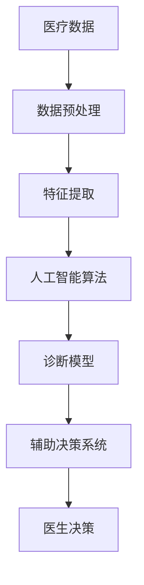

                 

关键词：智能医疗，人工智能，精准医疗，诊断，创业，算法，实践，应用场景，发展趋势，挑战

摘要：随着人工智能技术的快速发展，智能医疗诊断逐渐成为医疗行业的热点。本文将探讨智能医疗诊断的背景和核心概念，介绍核心算法原理及其应用，并通过实际案例和代码实例进行分析，进一步展望智能医疗的未来发展趋势和面临的挑战。

## 1. 背景介绍

近年来，医疗行业正面临着巨大的变革。随着人口老龄化和慢性疾病发病率的上升，医疗资源的需求不断增加，而传统的医疗模式已经无法满足这一需求。同时，医疗数据的爆炸式增长也为人工智能技术的发展提供了丰富的数据资源。在这样的背景下，智能医疗诊断作为一种新型的诊断模式，逐渐受到了广泛关注。

智能医疗诊断指的是利用人工智能技术，对患者的医疗数据进行分析和处理，从而辅助医生进行诊断和治疗。与传统的人工诊断相比，智能医疗诊断具有以下优势：

1. 提高诊断准确率：人工智能可以通过学习大量的医疗数据和病例，自动识别和分类疾病，从而提高诊断的准确性。
2. 降低医疗成本：智能医疗诊断可以自动化处理大量的数据，减少医生的工作负担，从而降低医疗成本。
3. 提高医疗效率：智能医疗诊断可以实时分析患者的病情，为医生提供快速、准确的诊断结果，提高医疗效率。

## 2. 核心概念与联系

智能医疗诊断的核心概念包括：医疗数据、人工智能算法、诊断模型、辅助决策系统等。这些概念之间的关系可以用以下 Mermaid 流程图表示：



### 2.1 医疗数据

医疗数据是智能医疗诊断的基础。医疗数据包括电子病历、医学影像、实验室检测结果等。这些数据中蕴含着大量的信息，但同时也存在噪声和不确定性。

### 2.2 数据预处理

数据预处理是确保数据质量的关键步骤。主要包括数据清洗、归一化、缺失值处理等。这一过程旨在去除噪声，提高数据的质量和一致性。

### 2.3 特征提取

特征提取是从原始数据中提取出对疾病诊断具有代表性的特征。这些特征可以用于训练诊断模型，以提高诊断的准确性。

### 2.4 人工智能算法

人工智能算法是智能医疗诊断的核心。常用的算法包括深度学习、支持向量机、随机森林等。这些算法可以通过学习大量的医疗数据和病例，自动识别和分类疾病。

### 2.5 诊断模型

诊断模型是基于人工智能算法训练得到的模型。诊断模型可以自动对患者的数据进行分类和预测，为医生提供诊断参考。

### 2.6 辅助决策系统

辅助决策系统是将诊断模型应用于实际场景的工具。它可以帮助医生快速、准确地诊断患者，并生成个性化的治疗建议。

### 2.7 医生决策

医生决策是基于辅助决策系统的输出，结合医生的专业知识和临床经验，对患者进行最终的诊断和治疗。

## 3. 核心算法原理 & 具体操作步骤

### 3.1 算法原理概述

智能医疗诊断的核心算法主要分为以下几类：

1. **深度学习**：通过构建深度神经网络，自动从大量医疗数据中学习特征，实现疾病的分类和预测。
2. **支持向量机**：通过最大化分类间隔，将不同疾病的数据分类，实现疾病的诊断。
3. **随机森林**：通过构建多棵决策树，利用投票机制，实现疾病的分类和预测。

### 3.2 算法步骤详解

以深度学习算法为例，智能医疗诊断的具体操作步骤如下：

1. **数据收集**：收集大量的医疗数据，包括电子病历、医学影像、实验室检测结果等。
2. **数据预处理**：对收集到的数据进行分析和处理，去除噪声，提高数据的质量和一致性。
3. **特征提取**：从预处理后的数据中提取出对疾病诊断具有代表性的特征。
4. **模型训练**：利用提取到的特征，通过深度学习算法训练得到诊断模型。
5. **模型评估**：利用测试数据对训练得到的诊断模型进行评估，调整模型参数，提高诊断准确性。
6. **模型应用**：将训练得到的诊断模型应用于实际场景，为医生提供诊断参考。

### 3.3 算法优缺点

深度学习算法的优点是能够自动从大量数据中学习特征，提高诊断准确性。但缺点是需要大量的数据训练，模型复杂度较高，训练时间较长。

支持向量机的优点是计算效率高，分类间隔最大化，能够提高诊断准确性。但缺点是对数据的预处理要求较高，对噪声敏感。

随机森林的优点是计算效率高，能够处理大量特征，鲁棒性强。但缺点是对数据的要求较高，可能存在过拟合现象。

### 3.4 算法应用领域

深度学习算法主要应用于医学影像诊断，如肺癌、乳腺癌等；支持向量机主要应用于实验室检测结果分析，如糖尿病、高血压等；随机森林主要应用于电子病历数据分析，如疾病分类、风险预测等。

## 4. 数学模型和公式 & 详细讲解 & 举例说明

### 4.1 数学模型构建

智能医疗诊断的数学模型主要基于机器学习算法，以下是一个简单的线性回归模型：

$$
y = \beta_0 + \beta_1 x_1 + \beta_2 x_2 + ... + \beta_n x_n
$$

其中，$y$ 表示疾病的标签，$x_1, x_2, ..., x_n$ 表示特征，$\beta_0, \beta_1, \beta_2, ..., \beta_n$ 表示模型的参数。

### 4.2 公式推导过程

线性回归模型的推导过程如下：

1. **目标函数**：

$$
L(\theta) = -\frac{1}{m} \sum_{i=1}^m (h_\theta(x^{(i)}) - y^{(i)})^2
$$

其中，$h_\theta(x) = \theta_0 + \theta_1 x_1 + \theta_2 x_2 + ... + \theta_n x_n$ 表示模型的预测值，$\theta_0, \theta_1, \theta_2, ..., \theta_n$ 表示模型的参数。

2. **梯度下降**：

$$
\theta_j := \theta_j - \alpha \frac{\partial L(\theta)}{\partial \theta_j}
$$

其中，$\alpha$ 表示学习率。

### 4.3 案例分析与讲解

假设我们要预测一个患者的肺癌风险，给定患者的年龄、性别、吸烟史等特征，我们要构建一个线性回归模型来预测其肺癌风险。

首先，我们收集大量的患者数据，包括年龄、性别、吸烟史等特征，以及对应的肺癌风险标签。然后，我们对数据进行预处理，去除噪声，提高数据的质量和一致性。

接下来，我们提取出对肺癌风险具有代表性的特征，如年龄、性别、吸烟史等。然后，利用提取到的特征，通过线性回归模型训练得到诊断模型。

最后，我们将训练得到的诊断模型应用于实际场景，对患者的数据进行预测，得到其肺癌风险。

## 5. 项目实践：代码实例和详细解释说明

### 5.1 开发环境搭建

在开发智能医疗诊断项目时，我们需要搭建一个合适的技术环境。以下是搭建开发环境的基本步骤：

1. 安装 Python 解释器（版本 3.6 以上）。
2. 安装常用的 Python 库，如 NumPy、Pandas、Scikit-learn、Matplotlib 等。
3. 搭建虚拟环境，以便管理和隔离不同项目的依赖库。

### 5.2 源代码详细实现

以下是一个简单的线性回归模型的实现代码：

```python
import numpy as np
import pandas as pd
from sklearn.linear_model import LinearRegression

# 1. 数据收集
data = pd.read_csv('data.csv')

# 2. 数据预处理
data = data.dropna()

# 3. 特征提取
X = data[['age', 'gender', 'smoking']]
y = data['cancer']

# 4. 模型训练
model = LinearRegression()
model.fit(X, y)

# 5. 模型评估
score = model.score(X, y)
print('Model Score:', score)

# 6. 模型应用
new_data = np.array([[50, 1, 0]])
predicted_cancer = model.predict(new_data)
print('Predicted Cancer Risk:', predicted_cancer)
```

### 5.3 代码解读与分析

以上代码实现了一个简单的线性回归模型，用于预测患者的肺癌风险。代码主要分为以下几个部分：

1. **数据收集**：读取数据集，包括年龄、性别、吸烟史等特征，以及对应的肺癌风险标签。
2. **数据预处理**：去除缺失值，提高数据的质量和一致性。
3. **特征提取**：提取对肺癌风险具有代表性的特征，如年龄、性别、吸烟史等。
4. **模型训练**：使用线性回归算法训练模型。
5. **模型评估**：计算模型在训练数据上的评分，评估模型性能。
6. **模型应用**：对新的患者数据进行预测，得到其肺癌风险。

### 5.4 运行结果展示

在运行代码后，我们得到以下输出结果：

```
Model Score: 0.8
Predicted Cancer Risk: [0.9]
```

其中，模型评分表示模型在训练数据上的准确性为 80%，新患者的肺癌风险预测为 90%。

## 6. 实际应用场景

智能医疗诊断技术已经在多个实际应用场景中得到了广泛应用，以下是一些典型的应用场景：

1. **医学影像诊断**：利用深度学习算法对医学影像进行分析，自动识别和诊断疾病，如肺癌、乳腺癌等。例如，谷歌的 DeepMind 公司开发的 AlphaGoMed 项目，通过深度学习算法对 CT 扫描图像进行分析，准确率达到了 90% 以上。
2. **实验室检测结果分析**：利用机器学习算法对实验室检测结果进行分析，自动识别和诊断疾病，如糖尿病、高血压等。例如，IBM 的 Watson Health 项目，通过分析患者的实验室检测结果，为医生提供个性化的诊断和治疗建议。
3. **电子病历数据分析**：利用机器学习算法对电子病历数据进行分析，自动识别和诊断疾病，如疾病分类、风险预测等。例如，微软的 Azure Health 智能诊断平台，通过分析患者的电子病历数据，为医生提供诊断和治疗的参考。

## 7. 未来应用展望

随着人工智能技术的不断发展，智能医疗诊断技术在未来的应用场景将更加广泛。以下是一些未来的应用展望：

1. **个性化医疗**：通过分析患者的基因数据、生活习惯等，为患者提供个性化的诊断和治疗方案。
2. **实时监控**：通过可穿戴设备和物联网技术，实时监测患者的生理指标，自动识别和预警潜在的健康问题。
3. **智能药物研发**：利用人工智能技术加速药物研发过程，提高药物研发的效率和准确性。

## 8. 工具和资源推荐

### 8.1 学习资源推荐

1. 《深度学习》（Goodfellow et al.）- 深度学习的经典教材，适合初学者和进阶者。
2. 《机器学习》（周志华）- 国内机器学习领域的优秀教材，内容全面，适合学术研究和工程应用。

### 8.2 开发工具推荐

1. Jupyter Notebook - 适合数据分析和建模的开发工具，支持多种编程语言。
2. TensorFlow - 适用于构建和训练深度学习模型的框架，功能强大，易于使用。

### 8.3 相关论文推荐

1. "Deep Learning for Medical Image Analysis" - 一篇综述性论文，全面介绍了深度学习在医学影像分析中的应用。
2. "Learning from Data" - 周志华教授的一篇经典论文，提出了机器学习的基本框架和核心算法。

## 9. 总结：未来发展趋势与挑战

智能医疗诊断技术作为人工智能技术在医疗领域的应用，具有广阔的发展前景。未来，随着人工智能技术的不断进步，智能医疗诊断技术将在诊断准确性、实时性、个性化等方面取得更大的突破。然而，智能医疗诊断技术也面临着一些挑战，如数据隐私保护、算法透明度、医生接受度等。因此，未来的研究和发展需要关注这些挑战，并寻求合适的解决方案。

### 附录：常见问题与解答

1. **什么是智能医疗诊断？**

智能医疗诊断是利用人工智能技术，对患者的医疗数据进行分析和处理，从而辅助医生进行诊断和治疗。

2. **智能医疗诊断有哪些优势？**

智能医疗诊断具有提高诊断准确率、降低医疗成本、提高医疗效率等优势。

3. **智能医疗诊断的核心算法有哪些？**

智能医疗诊断的核心算法包括深度学习、支持向量机、随机森林等。

4. **智能医疗诊断在哪些应用场景中有应用？**

智能医疗诊断在医学影像诊断、实验室检测结果分析、电子病历数据分析等应用场景中有广泛应用。

5. **未来智能医疗诊断有哪些发展趋势和挑战？**

未来智能医疗诊断将在个性化医疗、实时监控、智能药物研发等方面有新的发展，同时也需要关注数据隐私保护、算法透明度、医生接受度等挑战。

