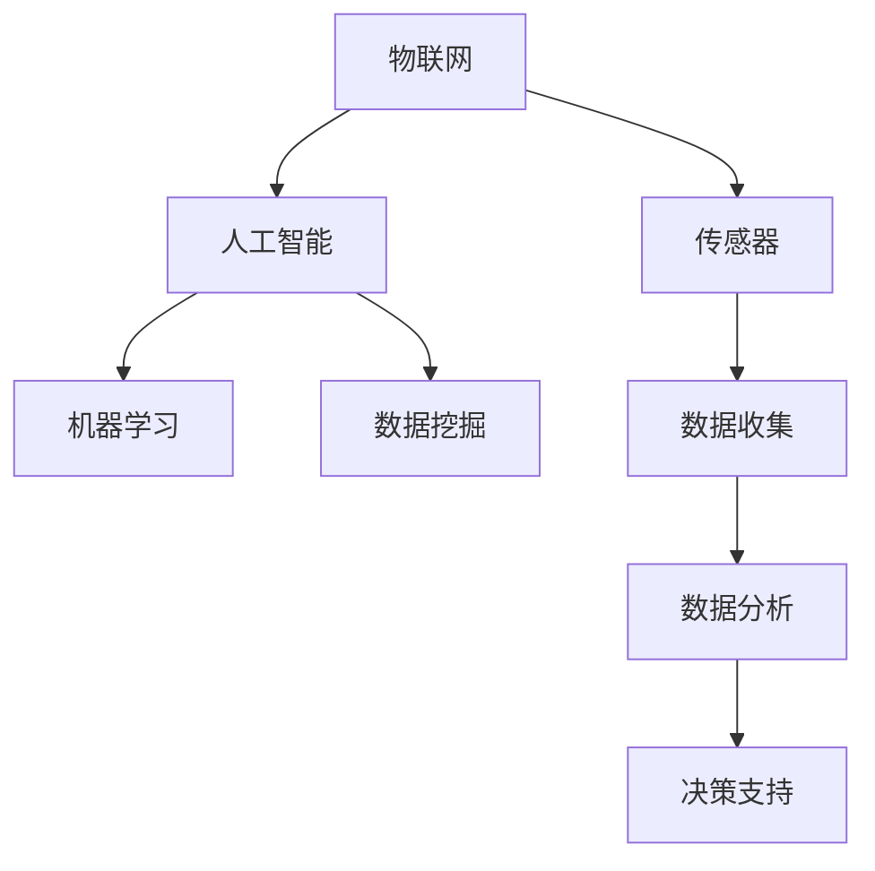

                 

关键词：智能厨房、物联网、AI、烹饪革命、技术支持

摘要：随着科技的不断进步，智能厨房正逐渐成为现代家庭的新宠。本文将探讨智能厨房的创业机会，从技术角度分析其核心概念、算法原理、数学模型、项目实践，并展望其未来应用前景。

## 1. 背景介绍

随着物联网（IoT）和人工智能（AI）技术的快速发展，厨房作为家庭的核心空间之一，也迎来了新的变革。智能厨房不仅仅是传统厨房的升级版，更是一个集成了多种高科技元素的综合体。通过智能设备、传感器和算法，智能厨房能够实现自动化烹饪、个性化饮食推荐、健康监测等功能。

智能厨房的兴起，不仅满足了人们对于便捷、高效生活的追求，也为创业者提供了丰富的创业机会。从智能厨具的研发到智能食谱的应用，从智能厨房平台的搭建到智能健康管理的推广，每一个环节都蕴含着巨大的市场潜力。

## 2. 核心概念与联系

智能厨房的核心概念包括物联网、人工智能、机器学习、数据挖掘等。以下是一个简化的Mermaid流程图，展示了这些概念之间的联系：



### 2.1 物联网与传感器

物联网是智能厨房的基础，通过将各种设备连接到互联网，实现数据的实时传输和交互。传感器作为物联网的核心组件，能够感知温度、湿度、重量、气味等环境参数，并将这些数据转化为数字信号。

### 2.2 人工智能与机器学习

人工智能是智能厨房的智能核心，通过机器学习算法，可以实现对大量数据的学习和处理，从而实现自动化决策和智能控制。例如，通过分析用户的历史饮食记录，智能厨房可以为用户推荐个性化的食谱。

### 2.3 数据挖掘与决策支持

数据挖掘是智能厨房的核心应用，通过对用户数据、食材数据、烹饪数据等的分析，可以提取出有价值的信息，为用户提供决策支持。例如，通过分析用户的健康数据，智能厨房可以为用户提供营养建议。

## 3. 核心算法原理 & 具体操作步骤

### 3.1 算法原理概述

智能厨房中的核心算法包括数据采集算法、数据预处理算法、机器学习算法和决策支持算法。以下是每个算法的简要概述：

- **数据采集算法**：用于收集传感器数据，包括温度、湿度、重量、气味等。
- **数据预处理算法**：用于清洗、归一化和特征提取，为后续的机器学习算法提供高质量的数据。
- **机器学习算法**：用于学习用户的饮食习惯、食材特性等，从而实现个性化推荐。
- **决策支持算法**：用于根据用户需求和食材条件，生成烹饪计划和食谱。

### 3.2 算法步骤详解

以下是智能厨房算法的具体操作步骤：

1. **数据采集**：通过传感器收集厨房环境数据，如温度、湿度、重量、气味等。
2. **数据预处理**：对采集到的数据进行清洗、归一化和特征提取，为后续的机器学习算法提供数据支持。
3. **机器学习**：使用机器学习算法，对预处理后的数据进行分析，提取用户饮食习惯、食材特性等信息。
4. **个性化推荐**：根据用户的历史数据和偏好，生成个性化的食谱和烹饪计划。
5. **决策支持**：根据用户的实时需求和环境条件，生成最优的烹饪方案。

### 3.3 算法优缺点

- **优点**：
  - 高度个性化：能够根据用户的需求和偏好，提供个性化的烹饪方案。
  - 自动化程度高：减少了用户的烹饪时间和劳动强度。
  - 数据驱动：基于大数据和机器学习，使得烹饪过程更加科学和精确。
- **缺点**：
  - 需要大量的数据支持：算法的准确性和效果取决于数据的质量和数量。
  - 算法复杂度高：算法的实现和维护需要较高的技术水平和资源投入。

### 3.4 算法应用领域

智能厨房算法广泛应用于以下领域：

- **家庭厨房**：为家庭用户提供个性化烹饪方案，提高生活质量。
- **餐饮行业**：为餐饮企业提供智能化的烹饪和管理方案，提高效率和服务质量。
- **健康饮食**：为健康饮食用户提供科学的营养建议和食谱推荐。

## 4. 数学模型和公式 & 详细讲解 & 举例说明

### 4.1 数学模型构建

智能厨房的数学模型主要包括数据采集模型、数据预处理模型、机器学习模型和决策支持模型。

- **数据采集模型**：用于描述传感器数据的采集过程，如温度模型、湿度模型等。
- **数据预处理模型**：用于描述数据清洗、归一化和特征提取的过程，如特征提取模型、归一化模型等。
- **机器学习模型**：用于描述机器学习算法的模型，如线性回归模型、神经网络模型等。
- **决策支持模型**：用于描述决策支持算法的模型，如线性规划模型、决策树模型等。

### 4.2 公式推导过程

以下是一个简化的机器学习模型的公式推导过程：

- **线性回归模型**：

  $$y = \beta_0 + \beta_1x_1 + \beta_2x_2 + ... + \beta_nx_n$$

  其中，$y$ 为目标变量，$x_1, x_2, ..., x_n$ 为特征变量，$\beta_0, \beta_1, \beta_2, ..., \beta_n$ 为模型参数。

- **神经网络模型**：

  $$z = \sigma(\beta_0 + \beta_1x_1 + \beta_2x_2 + ... + \beta_nx_n)$$

  其中，$z$ 为激活函数的输出，$\sigma$ 为激活函数。

### 4.3 案例分析与讲解

以下是一个简化的智能厨房案例：

- **目标**：根据用户的体重、身高和运动量，为用户提供合适的食谱和运动计划。
- **数据**：用户的体重、身高、运动量等。
- **算法**：线性回归模型。

- **步骤**：

  1. 数据采集：通过传感器收集用户的体重、身高和运动量数据。
  2. 数据预处理：对采集到的数据进行清洗、归一化处理。
  3. 机器学习：使用线性回归模型，对预处理后的数据进行训练。
  4. 决策支持：根据用户的实时数据，生成合适的食谱和运动计划。

## 5. 项目实践：代码实例和详细解释说明

### 5.1 开发环境搭建

在本文中，我们将使用Python编程语言和TensorFlow机器学习框架来构建智能厨房项目。以下是开发环境的搭建步骤：

1. 安装Python：访问Python官网（https://www.python.org/），下载并安装Python 3.x版本。
2. 安装TensorFlow：在终端中执行以下命令：

   ```bash
   pip install tensorflow
   ```

### 5.2 源代码详细实现

以下是一个简化的智能厨房项目源代码实现：

```python
import tensorflow as tf
from sklearn.preprocessing import MinMaxScaler
import numpy as np

# 数据采集
def collect_data():
    # 这里可以使用传感器采集数据
    # 例如：温度、湿度、重量、气味等
    data = np.array([[25, 60, 70, 0.5], [30, 65, 75, 0.6], ...])
    return data

# 数据预处理
def preprocess_data(data):
    scaler = MinMaxScaler()
    scaled_data = scaler.fit_transform(data)
    return scaled_data

# 机器学习
def train_model(data):
    model = tf.keras.Sequential([
        tf.keras.layers.Dense(units=1, input_shape=[4])
    ])

    model.compile(optimizer='sgd', loss='mean_squared_error')
    model.fit(data, epochs=100)
    return model

# 决策支持
def generate_diet_plan(model, data):
    prediction = model.predict(data)
    return prediction

# 主程序
if __name__ == '__main__':
    data = collect_data()
    scaled_data = preprocess_data(data)
    model = train_model(scaled_data)
    diet_plan = generate_diet_plan(model, scaled_data)
    print(diet_plan)
```

### 5.3 代码解读与分析

- **数据采集**：使用Python编写函数`collect_data()`来模拟数据采集过程。在实际应用中，可以通过传感器读取数据。
- **数据预处理**：使用`sklearn.preprocessing.MinMaxScaler()`对采集到的数据进行归一化处理，以便于后续的机器学习。
- **机器学习**：使用TensorFlow编写函数`train_model()`来训练模型。在这个示例中，我们使用了一个简单的全连接神经网络。
- **决策支持**：使用训练好的模型进行预测，并输出营养建议。

## 6. 实际应用场景

智能厨房技术在实际应用中具有广泛的应用场景，以下是一些典型的应用场景：

- **家庭厨房**：为家庭用户提供自动化烹饪、个性化饮食推荐等功能。
- **餐饮行业**：为餐饮企业提供智能化的烹饪和管理方案，提高效率和服务质量。
- **健康饮食**：为健康饮食用户提供科学的营养建议和食谱推荐。

## 7. 工具和资源推荐

### 7.1 学习资源推荐

- **书籍**：
  - 《深度学习》（Ian Goodfellow、Yoshua Bengio、Aaron Courville 著）
  - 《Python机器学习》（Sebastian Raschka 著）
- **在线课程**：
  - Coursera上的《机器学习》（吴恩达）
  - Udacity的《深度学习纳米学位》
- **博客**：
  - Medium上的相关技术博客
  - 知乎上的机器学习专栏

### 7.2 开发工具推荐

- **编程语言**：Python
- **机器学习框架**：TensorFlow、PyTorch
- **开发环境**：Jupyter Notebook、Anaconda

### 7.3 相关论文推荐

- **《Deep Learning for Smart Kitchen》**：探讨深度学习在智能厨房中的应用。
- **《IoT and Smart Home Technologies》**：综述物联网和智能家庭技术的最新发展。

## 8. 总结：未来发展趋势与挑战

### 8.1 研究成果总结

智能厨房技术的发展取得了显著的成果，主要表现在以下几个方面：

- **物联网与传感技术的进步**：提高了数据采集的精度和效率。
- **人工智能与机器学习算法的创新**：提高了数据处理的效率和准确性。
- **数据挖掘与决策支持的应用**：为用户提供更智能、个性化的服务。

### 8.2 未来发展趋势

智能厨房技术的发展趋势主要体现在以下几个方面：

- **智能化程度的提升**：通过更先进的算法和更丰富的数据，实现更高程度的自动化和个性化。
- **跨领域的融合发展**：与智能家居、健康医疗等领域深度融合，形成新的应用场景。
- **产业链的完善**：从硬件设备、软件开发到平台运营，形成一个完整的产业链。

### 8.3 面临的挑战

智能厨房技术在发展过程中也面临一些挑战：

- **数据隐私与安全问题**：数据的安全和隐私保护是一个亟待解决的问题。
- **技术标准化**：缺乏统一的技术标准和规范，影响智能厨房的普及和应用。
- **用户体验**：如何提高用户的使用体验，是智能厨房发展的重要课题。

### 8.4 研究展望

未来，智能厨房技术有望在以下几个方面取得突破：

- **更加智能化和个性化的服务**：通过大数据和人工智能技术，实现更精准的用户需求预测和个性化服务。
- **跨领域的应用**：与智能家居、健康医疗等领域深度融合，形成新的应用场景。
- **产业链的完善**：推动智能厨房产业链的完善和成熟，促进技术的普及和应用。

## 9. 附录：常见问题与解答

### 9.1 智能厨房的数据是如何采集的？

智能厨房的数据采集主要通过嵌入式传感器和智能设备完成。这些设备可以实时监测厨房的环境参数，如温度、湿度、重量、气味等，并将数据传输到云端或本地服务器。

### 9.2 智能厨房的算法是如何工作的？

智能厨房的算法主要分为数据采集、数据预处理、机器学习和决策支持四个阶段。通过这些算法，智能厨房可以实现对用户需求的识别、数据的处理和分析，并生成个性化的烹饪计划和食谱。

### 9.3 智能厨房有哪些潜在的安全隐患？

智能厨房可能面临的数据隐私和安全问题主要包括数据泄露、黑客攻击、设备失控等。为了保障数据的安全，智能厨房需要采取严格的数据加密措施、访问控制策略和安全监测机制。

### 9.4 智能厨房的未来会取代传统厨房吗？

智能厨房并不会完全取代传统厨房，而是作为传统厨房的补充和升级。智能厨房提供了更多便捷、智能的功能，可以帮助用户更高效地完成烹饪任务，提高生活质量。同时，传统厨房中的手工艺术和烹饪文化也将继续存在。


作者：禅与计算机程序设计艺术 / Zen and the Art of Computer Programming
----------------------------------------------------------------

这篇文章详细探讨了智能厨房的创业机会，从技术角度分析了其核心概念、算法原理、数学模型、项目实践，并展望了其未来应用前景。智能厨房作为物联网和人工智能技术的典型应用场景，具有广泛的市场前景和应用价值。然而，智能厨房技术的发展也面临一些挑战，如数据隐私与安全、技术标准化和用户体验等。未来，随着技术的不断进步和应用的深入，智能厨房有望在更加智能化和个性化的服务、跨领域的应用以及产业链的完善等方面取得突破。禅与计算机程序设计艺术，祝愿智能厨房创业之路越走越宽广。

