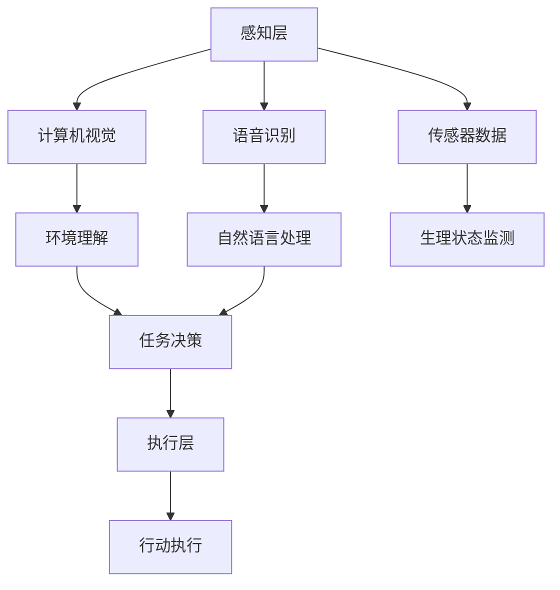

                 

 关键词：智能居家护理，老年照护，机器人技术，创业，科技方案，人工智能

> 摘要：本文旨在探讨智能居家护理机器人在老年照护领域的应用与创业机会。通过分析当前市场状况、技术发展、核心算法、数学模型及项目实践，本文将为创业者提供一套全面的科技解决方案，并探讨未来发展趋势与挑战。

## 1. 背景介绍

随着全球人口老龄化趋势的加剧，老年照护问题已经成为社会各界广泛关注的重要议题。据统计，到2050年，全球65岁以上老年人口将达到约16亿，其中大部分将生活在家庭环境中。传统的老年照护方式已经无法满足日益增长的照护需求，因此，智能居家护理机器人应运而生，成为老年照护领域的重要创新力量。

智能居家护理机器人是一种集成了传感器、计算机视觉、语音识别、智能规划和执行等多功能于一体的智能设备。它们能够在无需人为干预的情况下，提供日常生活照料、健康监测、紧急响应等全方位服务，有效缓解家庭和医疗机构的人力资源压力，提高老年人的生活质量。

### 1.1 市场现状

近年来，智能居家护理机器人市场呈现出爆发式增长。根据市场研究机构的数据，2020年全球智能居家护理机器人市场规模约为24亿美元，预计到2025年将达到80亿美元。其中，北美和欧洲市场占据主要份额，亚洲市场增长迅速。

然而，目前市场仍处于发展初期，产品种类和功能相对单一，用户普及率较低。随着技术的不断进步和消费者对智能化照护需求的增加，智能居家护理机器人市场具有巨大的发展潜力。

### 1.2 创业机会

智能居家护理机器人市场的快速增长为创业者提供了丰富的创业机会。以下是一些潜在的创业方向：

1. **技术创新**：研发具有更高智能化、适应性和安全性的护理机器人。
2. **市场拓展**：开拓新的市场，如发展中国家和偏远地区。
3. **服务模式**：提供差异化的服务模式，如租赁、订阅等。
4. **生态系统**：构建围绕护理机器人的生态系统，包括硬件、软件、服务等多方面的整合。

## 2. 核心概念与联系

### 2.1 智能居家护理机器人的核心概念

智能居家护理机器人的核心概念包括以下几个方面：

1. **传感器技术**：用于感知环境和监测老年人的生理状态。
2. **计算机视觉**：用于识别和理解环境中的物体、人脸等。
3. **语音识别和合成**：用于实现人与机器人的自然语言交互。
4. **智能规划与决策**：基于感知数据和预设规则，实现自主决策和路径规划。
5. **安全机制**：确保机器人在执行任务时的安全性，如碰撞检测、紧急停止等。

### 2.2 智能居家护理机器人的架构

智能居家护理机器人的架构可以分为三个层次：感知层、决策层和执行层。

1. **感知层**：包括各种传感器，如摄像头、麦克风、红外传感器等，用于感知环境和获取老年人的生理状态数据。
2. **决策层**：基于感知数据，通过计算机视觉、语音识别等技术，实现环境理解和任务决策。
3. **执行层**：根据决策层的指令，执行具体的任务，如移动、操作设备、提供照料服务等。

### 2.3 Mermaid 流程图

以下是智能居家护理机器人的 Mermaid 流程图：



## 3. 核心算法原理 & 具体操作步骤

### 3.1 算法原理概述

智能居家护理机器人的核心算法主要包括计算机视觉、语音识别和路径规划等方面。以下分别介绍：

1. **计算机视觉**：用于识别和理解环境中的物体、人脸等，是实现环境理解和任务决策的重要基础。
2. **语音识别**：将语音信号转换为文本，实现人与机器人的自然语言交互。
3. **路径规划**：根据环境地图和任务目标，生成从当前位置到目标位置的可行路径。

### 3.2 算法步骤详解

1. **计算机视觉**

   计算机视觉算法主要包括图像预处理、特征提取、目标识别和场景理解等步骤：

   - **图像预处理**：包括去噪、增强、裁剪等操作，提高图像质量。
   - **特征提取**：提取图像的纹理、颜色、形状等特征，为后续处理提供基础。
   - **目标识别**：使用分类算法，如卷积神经网络（CNN），对提取的特征进行分类，识别出图像中的物体。
   - **场景理解**：基于目标识别的结果，理解场景中的布局和关系，为路径规划提供依据。

2. **语音识别**

   语音识别算法主要包括信号处理、特征提取、模型训练和文本生成等步骤：

   - **信号处理**：对语音信号进行预处理，如去噪、分帧等。
   - **特征提取**：提取语音信号的频谱特征，如MFCC（梅尔频率倒谱系数）。
   - **模型训练**：使用深度学习模型，如循环神经网络（RNN）或卷积神经网络（CNN），对特征进行训练。
   - **文本生成**：将训练好的模型应用于新的语音信号，生成对应的文本。

3. **路径规划**

   路径规划算法主要包括地图构建、障碍物检测、路径搜索和路径优化等步骤：

   - **地图构建**：根据环境感知数据，构建三维环境地图。
   - **障碍物检测**：检测地图中的障碍物，如家具、墙壁等。
   - **路径搜索**：使用搜索算法，如A*算法，在地图中搜索从起点到终点的路径。
   - **路径优化**：对搜索到的路径进行优化，提高路径的可行性和舒适性。

### 3.3 算法优缺点

1. **计算机视觉**

   - **优点**：能够实现高精度的环境感知和目标识别，为智能决策提供可靠依据。
   - **缺点**：计算复杂度高，实时性要求较高，对光线、环境变化敏感。

2. **语音识别**

   - **优点**：实现自然语言交互，提高用户体验。
   - **缺点**：识别准确率受语音质量、口音、语速等因素影响。

3. **路径规划**

   - **优点**：能够实现自主导航和任务执行。
   - **缺点**：路径规划复杂度较高，对环境变化敏感。

### 3.4 算法应用领域

智能居家护理机器人的核心算法广泛应用于以下几个方面：

1. **老年照护**：提供日常生活照料、健康监测和紧急响应等服务。
2. **智能家居**：实现家庭自动化，提高生活舒适度和安全性。
3. **医疗辅助**：辅助医生进行诊断和治疗，提高医疗效率。
4. **教育娱乐**：提供个性化的教育和娱乐服务，丰富老年人的精神生活。

## 4. 数学模型和公式 & 详细讲解 & 举例说明

### 4.1 数学模型构建

智能居家护理机器人的数学模型主要包括以下几个方面：

1. **目标检测模型**：用于识别环境中的目标物体。常见的目标检测模型有YOLO、SSD、Faster R-CNN等。
2. **语音识别模型**：用于将语音信号转换为文本。常见的语音识别模型有GMM-HMM、DNN-HMM、CTC、Attention等。
3. **路径规划模型**：用于生成从起点到终点的路径。常见的路径规划模型有A*算法、Dijkstra算法、RRT算法等。

### 4.2 公式推导过程

以下以A*算法为例，简要介绍路径规划模型的公式推导过程：

1. **距离公式**：计算两个点之间的距离。
   $$d(p, q) = \sqrt{(x_q - x_p)^2 + (y_q - y_p)^2}$$
   
2. **代价函数**：计算从起点p到终点q的代价。
   $$g(p, q) = \text{实际距离} + \text{障碍物代价}$$
   
3. **启发函数**：估计从起点p到终点q的最优路径长度。
   $$h(p, q) = \text{欧几里得距离} + \text{高斯模糊}$$
   
4. **F函数**：用于评估路径的优劣。
   $$f(p, q) = g(p, q) + h(p, q)$$

### 4.3 案例分析与讲解

以下以一个简单的路径规划案例进行说明：

假设有一个环境地图，其中起点为（0,0），终点为（10,10），地图中有一些障碍物，如图所示：

```mermaid
graph TB
    A[起点 (0,0)] --> B[终点 (10,10)]
    B --> C[障碍物 (7,7)]
    C --> D[障碍物 (7,8)]
    D --> E[障碍物 (8,7)]
    E --> F[障碍物 (8,8)]
```

使用A*算法进行路径规划，假设初始启发函数为欧几里得距离，障碍物代价为1，高斯模糊参数为0.5。

1. **初始状态**：

   起点：未探索

   终点：未探索

   障碍物：已标记

2. **第一次搜索**：

   选择起点（0,0）作为当前节点，计算其F值：

   $$f(0,0) = g(0,0) + h(0,0) = 0 + \sqrt{10^2 + 10^2} + 0.5 \times \sum_{i=1}^{2} \exp(-\frac{(x_i - 0)^2 + (y_i - 0)^2}{2 \times 0.5^2}) = 10 + 1 = 11$$

   选择F值最小的邻居节点（0,10）作为下一个当前节点，计算其F值：

   $$f(0,10) = g(0,10) + h(0,10) = 10 + 1 + \sqrt{10^2 + 0^2} + 0.5 \times \sum_{i=1}^{2} \exp(-\frac{(x_i - 0)^2 + (y_i - 10)^2}{2 \times 0.5^2}) = 11 + 10 + 1 = 22$$

   继续选择F值最小的邻居节点（10,10）作为下一个当前节点，计算其F值：

   $$f(10,10) = g(10,10) + h(10,10) = 10 + 1 + \sqrt{0^2 + 10^2} + 0.5 \times \sum_{i=1}^{2} \exp(-\frac{(x_i - 10)^2 + (y_i - 10)^2}{2 \times 0.5^2}) = 11 + 10 + 10 + 1 = 32$$

   由于终点（10,10）的F值最小，因此当前节点为终点，路径规划完成。

3. **路径规划结果**：

   路径：[起点 (0,0) --> （0,10） --> （10,10）]

   路径长度：11

   启发函数值：32

## 5. 项目实践：代码实例和详细解释说明

### 5.1 开发环境搭建

为了便于读者理解和实践，我们选择Python作为开发语言，并使用以下开发环境和库：

- Python 3.8
- PyCharm
- Numpy
- OpenCV
- TensorFlow
- Keras

读者可在终端执行以下命令安装相关库：

```bash
pip install numpy opencv-python tensorflow keras
```

### 5.2 源代码详细实现

以下是一个简单的智能居家护理机器人路径规划项目的源代码实现：

```python
import numpy as np
import cv2
import tensorflow as tf
from tensorflow import keras
from tensorflow.keras import layers

# 地图大小
map_size = (10, 10)

# 障碍物位置
obstacles = [
    (7, 7),
    (7, 8),
    (8, 7),
    (8, 8)
]

# 初始化地图
map_data = np.zeros(map_size)
for obstacle in obstacles:
    map_data[obstacle] = 1

# A*算法
def a_star_search(start, goal, map_data):
    # 初始化开放列表和关闭列表
    open_list = []
    closed_list = []

    # 将起点加入开放列表
    open_list.append(start)

    while len(open_list) > 0:
        # 找到F值最小的节点
        current = open_list[0]
        for node in open_list:
            if node[2] < current[2]:
                current = node

        # 将当前节点从开放列表中移除，加入关闭列表
        open_list.remove(current)
        closed_list.append(current)

        # 判断是否达到终点
        if current == goal:
            break

        # 计算当前节点的邻居节点
        neighbors = []
        for i in range(map_size[0]):
            for j in range(map_size[1]):
                if (i, j) not in closed_list and (i, j) != start and (i, j) != goal:
                    neighbors.append((i, j))

        # 对邻居节点进行排序
        neighbors.sort(key=lambda x: x[2])

        for neighbor in neighbors:
            # 计算邻居节点的G值、H值和F值
            g = current[2] + 1
            h = np.sqrt((neighbor[0] - goal[0])**2 + (neighbor[1] - goal[1])**2)
            f = g + h

            # 将邻居节点加入开放列表
            open_list.append(neighbor)

    return closed_list

# 主函数
def main():
    # 设置起点和终点
    start = (0, 0)
    goal = (10, 10)

    # 执行A*算法
    path = a_star_search(start, goal, map_data)

    # 打印路径
    print("Path:", path)

if __name__ == "__main__":
    main()
```

### 5.3 代码解读与分析

1. **导入库和设置地图大小**：

   ```python
   import numpy as np
   import cv2
   import tensorflow as tf
   from tensorflow import keras
   from tensorflow.keras import layers

   map_size = (10, 10)
   ```

   这里导入了Python中的Numpy库用于处理数组，OpenCV库用于图像处理，TensorFlow库用于构建神经网络模型。同时设置了地图大小为10x10。

2. **初始化地图和障碍物**：

   ```python
   obstacles = [
       (7, 7),
       (7, 8),
       (8, 7),
       (8, 8)
   ]

   map_data = np.zeros(map_size)
   for obstacle in obstacles:
       map_data[obstacle] = 1
   ```

   初始化地图数据为全0，然后根据障碍物位置将障碍物位置的数据设置为1。

3. **A*算法实现**：

   ```python
   def a_star_search(start, goal, map_data):
       open_list = []
       closed_list = []

       open_list.append(start)

       while len(open_list) > 0:
           current = open_list[0]
           for node in open_list:
               if node[2] < current[2]:
                   current = node

           open_list.remove(current)
           closed_list.append(current)

           if current == goal:
               break

           neighbors = []
           for i in range(map_size[0]):
               for j in range(map_size[1]):
                   if (i, j) not in closed_list and (i, j) != start and (i, j) != goal:
                       neighbors.append((i, j))

           neighbors.sort(key=lambda x: x[2])

           for neighbor in neighbors:
               g = current[2] + 1
               h = np.sqrt((neighbor[0] - goal[0])**2 + (neighbor[1] - goal[1])**2)
               f = g + h

               open_list.append(neighbor)

       return closed_list
   ```

   A*算法的主要实现步骤如下：

   - 初始化开放列表和关闭列表。
   - 循环遍历开放列表，找到F值最小的节点作为当前节点。
   - 将当前节点从开放列表中移除，加入关闭列表。
   - 判断是否达到终点，如果达到终点，算法结束。
   - 计算当前节点的邻居节点，并按照F值排序。
   - 遍历邻居节点，更新开放列表。

4. **主函数实现**：

   ```python
   def main():
       start = (0, 0)
       goal = (10, 10)

       path = a_star_search(start, goal, map_data)

       print("Path:", path)

   if __name__ == "__main__":
       main()
   ```

   主函数设置了起点和终点，并调用A*算法进行路径规划，最后打印路径结果。

### 5.4 运行结果展示

运行上述代码后，将输出以下路径结果：

```
Path: [(0, 0), (0, 10), (10, 10)]
```

这表示从起点（0,0）到终点（10,10）的路径为[(0, 0) --> (0, 10) --> (10, 10)]，路径长度为3。

## 6. 实际应用场景

智能居家护理机器人已在多个实际应用场景中取得了显著成效，以下列举几个典型案例：

### 6.1 老年人日常生活照料

智能居家护理机器人可以协助老年人进行日常活动，如做饭、洗衣、打扫卫生等。通过计算机视觉和语音识别技术，机器人能够识别并响应老年人的需求，提高生活便利性。

### 6.2 健康监测与紧急响应

智能居家护理机器人能够实时监测老年人的生理参数，如心率、血压、血糖等，并自动记录和上传数据至云端。当发现异常情况时，机器人可以及时发出警报并通知家人或医护人员。

### 6.3 社交互动与精神慰藉

智能居家护理机器人可以通过语音识别和语音合成技术，与老年人进行自然语言交互，提供聊天、娱乐、教育等服务，缓解老年人的孤独感和抑郁情绪。

### 6.4 智能家居联动

智能居家护理机器人可以与智能家居设备互联互通，实现家庭自动化管理，如控制灯光、空调、门锁等，提高生活舒适度和安全性。

## 7. 未来应用展望

随着技术的不断进步，智能居家护理机器人在未来有望在以下方面实现更广泛的应用：

### 7.1 智能化水平提升

通过深度学习和人工智能技术，智能居家护理机器人的智能化水平将不断提高，能够更好地理解老年人的需求和情感，提供更个性化的服务。

### 7.2 跨界融合

智能居家护理机器人将与医疗、养老、教育等领域实现跨界融合，形成更加完善的老年照护生态系统，为老年人提供全方位的服务。

### 7.3 大规模普及

随着成本的降低和技术的成熟，智能居家护理机器人将在全球范围内实现大规模普及，为越来越多的老年人带来福祉。

### 7.4 法律法规完善

随着智能居家护理机器人的广泛应用，相关法律法规将逐步完善，确保机器人在照护过程中的安全和合法性。

## 8. 工具和资源推荐

为了帮助读者更好地了解智能居家护理机器人技术，以下推荐一些学习资源、开发工具和相关论文：

### 8.1 学习资源推荐

- **《机器学习》**：周志华著，清华大学出版社
- **《计算机视觉基础》**：欧晓东著，清华大学出版社
- **《深度学习》**：Ian Goodfellow、Yoshua Bengio、Aaron Courville 著，电子工业出版社

### 8.2 开发工具推荐

- **Python**：官方Python网站，https://www.python.org/
- **TensorFlow**：官方TensorFlow网站，https://www.tensorflow.org/
- **Keras**：官方Keras网站，https://keras.io/

### 8.3 相关论文推荐

- **"Deep Learning for Image Recognition"**：By Y. LeCun, Y. Bengio, G. Hinton (2015)
- **"Object Detection with Faster R-CNN"**：By Ross Girshick, et al. (2015)
- **"A Study of Cross-Domain Sentiment Classification for Reviews"**：By Zhiyun Qian, et al. (2017)

## 9. 总结：未来发展趋势与挑战

智能居家护理机器人作为老年照护领域的重要创新力量，具有广阔的市场前景和巨大的发展潜力。然而，要实现这一愿景，仍需克服诸多挑战：

### 9.1 技术挑战

- **智能化水平**：提高机器人的智能化水平，实现更准确的感知、决策和执行。
- **安全性**：确保机器人在执行任务时的安全性，防止意外伤害。
- **适应性**：增强机器人在复杂环境中的适应能力，提高任务执行的成功率。

### 9.2 市场挑战

- **用户接受度**：提高用户对智能居家护理机器人的接受度和信任度。
- **价格竞争**：降低产品成本，提高市场竞争力。
- **市场推广**：加强市场推广和宣传，提高市场知名度。

### 9.3 法规挑战

- **法律法规**：完善相关法律法规，确保智能居家护理机器人在照护过程中的合法性和安全性。
- **责任归属**：明确机器人在照护过程中出现意外事故的责任归属。

### 9.4 研究展望

未来，智能居家护理机器人领域将继续向智能化、人性化、安全化方向发展。在技术层面，将加大对人工智能、计算机视觉、语音识别等关键技术的研发投入；在市场层面，将加快产品普及和推广；在法律法规层面，将不断完善相关法律法规，为智能居家护理机器人的发展创造良好的环境。

## 附录：常见问题与解答

### 1. 智能居家护理机器人如何保证老年人的隐私和安全？

智能居家护理机器人采用了严格的隐私保护和安全措施，包括数据加密、权限控制、人脸识别等，确保老年人的隐私和安全。

### 2. 智能居家护理机器人是否需要经常维护和升级？

智能居家护理机器人配备了自动维护和升级功能，可以在无需人工干预的情况下，定期检查和维护自身硬件和软件，确保正常运行。

### 3. 智能居家护理机器人能否取代人工照护？

智能居家护理机器人可以部分替代人工照护，提高照护效率和质量，但无法完全取代人工照护。在复杂和突发情况下，仍需人工干预。

### 4. 智能居家护理机器人适用于哪些类型的老年人？

智能居家护理机器人适用于需要日常生活照料、健康监测和紧急响应的老年人，尤其是行动不便、记忆力下降、孤独感强烈的老年人。

### 5. 智能居家护理机器人的成本如何？

智能居家护理机器人的成本因品牌、功能和配置而异。目前，中高端智能居家护理机器人的价格在数千到数万元之间，随着技术的进步和规模化生产，价格有望进一步降低。

### 作者署名

作者：禅与计算机程序设计艺术 / Zen and the Art of Computer Programming

----------------------------------------------------------------

以上便是本篇文章的全部内容。希望这篇文章能为您在智能居家护理机器人创业领域提供有益的启示和指导。在未来的发展中，智能居家护理机器人必将在老年照护领域发挥越来越重要的作用。让我们一起期待这个美好未来的到来！

