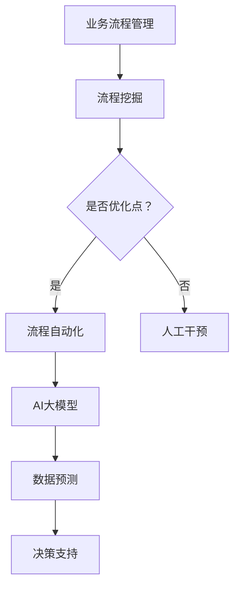

                 

关键词：智能工作流程，AI大模型，企业管理，优化策略，应用场景

> 摘要：本文旨在探讨人工智能大模型在企业管理中的应用，通过深入分析智能工作流程优化的原理和实际操作步骤，结合数学模型和案例实践，为企业管理者提供一套系统化的解决方案。文章最后对未来的发展趋势与挑战进行了展望，旨在推动企业智能化转型的深入发展。

## 1. 背景介绍

随着人工智能技术的迅速发展，企业面临着前所未有的机遇与挑战。传统的管理方法已经难以应对日益复杂的商业环境，智能化、自动化成为企业提高效率、降低成本、增强竞争力的必然选择。AI大模型作为人工智能技术的集大成者，以其强大的数据处理能力和智能推理能力，正在逐渐渗透到企业管理的各个层面。

### 1.1  企业管理中的问题

- **信息过载**：企业在运营过程中会产生大量的数据，如何有效处理和分析这些数据成为一大难题。
- **效率低下**：许多企业的工作流程仍然依赖于人工操作，效率低下，错误率高。
- **决策困难**：面对复杂的市场环境和多变的业务场景，企业决策者难以准确判断和预测。

### 1.2  AI大模型的优势

- **数据处理能力**：AI大模型能够快速处理海量数据，提取关键信息，为决策提供数据支持。
- **自动化流程**：通过算法自动化处理企业日常事务，减少人工干预，提高工作效率。
- **智能预测**：利用机器学习算法，对市场趋势和业务数据进行预测，帮助决策者做出更明智的决策。

## 2. 核心概念与联系

### 2.1  智能工作流程

智能工作流程是指利用人工智能技术对企业的业务流程进行自动化优化和智能化管理。它包括以下几个核心概念：

- **业务流程管理（BPM）**：通过对业务流程的梳理、建模、执行和监控，实现流程的优化和自动化。
- **流程挖掘**：从企业运营数据中自动提取业务流程，识别流程中的瓶颈和优化点。
- **流程自动化**：利用机器人流程自动化（RPA）技术，将人工操作转化为机器操作，提高工作效率。

### 2.2  AI大模型

AI大模型是指具有大规模参数和深度网络结构的人工智能模型，如Transformer、BERT等。它具有以下几个核心特点：

- **大规模参数**：AI大模型拥有数十亿甚至千亿级别的参数，能够处理海量数据。
- **深度网络结构**：AI大模型采用多层神经网络结构，能够实现复杂的特征提取和知识表示。
- **自适应学习**：AI大模型通过不断学习数据，能够自适应调整模型参数，提高模型性能。

### 2.3  Mermaid 流程图

为了更直观地展示智能工作流程与AI大模型之间的联系，我们可以使用Mermaid流程图进行描述。以下是一个简化的流程图：



## 3. 核心算法原理 & 具体操作步骤

### 3.1  算法原理概述

智能工作流程优化的核心算法包括流程挖掘、流程自动化和AI大模型。以下是这些算法的基本原理：

- **流程挖掘**：通过分析企业历史数据，自动提取业务流程，识别流程中的瓶颈和优化点。
- **流程自动化**：利用机器人流程自动化（RPA）技术，将人工操作转化为机器操作，实现流程的自动化。
- **AI大模型**：利用机器学习算法，对业务数据进行深度学习，实现对业务数据的智能预测和决策支持。

### 3.2  算法步骤详解

#### 3.2.1  流程挖掘

1. 数据收集：收集企业运营过程中的各种数据，包括订单数据、客户数据、财务数据等。
2. 数据预处理：对收集到的数据进行分析和清洗，去除无效数据，保证数据质量。
3. 流程建模：利用流程挖掘算法，从数据中自动提取业务流程，生成流程模型。
4. 流程分析：对流程模型进行分析，识别流程中的瓶颈和优化点。

#### 3.2.2  流程自动化

1. 确定自动化场景：根据流程挖掘结果，确定哪些场景适合进行流程自动化。
2. 设计自动化流程：利用RPA工具，设计自动化流程，实现人工操作的自动化。
3. 自动化测试：对自动化流程进行测试，确保流程能够按照预期运行。
4. 自动化部署：将自动化流程部署到生产环境中，实现自动化运行。

#### 3.2.3  AI大模型

1. 数据收集：收集企业运营过程中的各种数据，包括订单数据、客户数据、财务数据等。
2. 数据预处理：对收集到的数据进行分析和清洗，去除无效数据，保证数据质量。
3. 模型训练：利用机器学习算法，对数据集进行训练，生成AI大模型。
4. 模型评估：对训练好的模型进行评估，确保模型能够准确预测业务数据。
5. 模型部署：将训练好的模型部署到生产环境中，实现业务数据的智能预测和决策支持。

### 3.3  算法优缺点

#### 优点

- **高效性**：通过流程自动化和AI大模型，能够显著提高企业的工作效率。
- **准确性**：AI大模型能够准确预测业务数据，为决策提供可靠支持。
- **灵活性**：智能工作流程优化可以根据业务需求进行灵活调整。

#### 缺点

- **技术门槛**：智能工作流程优化需要具备一定的技术能力，对企业技术团队提出了较高要求。
- **数据质量**：数据质量直接影响算法的性能，需要对企业数据进行严格清洗和管理。

### 3.4  算法应用领域

- **供应链管理**：通过智能工作流程优化，实现供应链的自动化和智能化，提高供应链的响应速度和效率。
- **客户服务**：利用AI大模型，对客户行为进行预测和分类，提供个性化的客户服务。
- **财务分析**：通过AI大模型，对财务数据进行分析和预测，帮助财务部门做出更明智的决策。

## 4. 数学模型和公式 & 详细讲解 & 举例说明

### 4.1  数学模型构建

智能工作流程优化涉及多个数学模型，主要包括线性回归模型、决策树模型、神经网络模型等。以下以线性回归模型为例，介绍数学模型的构建过程。

#### 线性回归模型

线性回归模型是一种简单的预测模型，用于分析自变量（如业务数据）和因变量（如销售量）之间的关系。

假设我们有以下数据集：

| 业务数据（x） | 销售量（y） |
| ------------- | ----------- |
| 10            | 200         |
| 20            | 250         |
| 30            | 300         |
| ...           | ...         |

线性回归模型的公式如下：

$$
y = \beta_0 + \beta_1 \cdot x + \epsilon
$$

其中，$\beta_0$ 和 $\beta_1$ 是模型参数，$\epsilon$ 是误差项。

### 4.2  公式推导过程

为了求解线性回归模型的参数，我们需要使用最小二乘法（Least Squares Method）。最小二乘法的思想是找到一条直线，使得所有数据点到这条直线的距离之和最小。

具体推导过程如下：

1. **定义损失函数**：

损失函数（或称为误差函数）用于衡量模型预测值与实际值之间的差距。线性回归模型中，常用的损失函数为均方误差（Mean Squared Error，MSE）：

$$
\text{MSE} = \frac{1}{n}\sum_{i=1}^{n}(y_i - \hat{y}_i)^2
$$

其中，$n$ 是数据点的个数，$y_i$ 是实际值，$\hat{y}_i$ 是预测值。

2. **求解最优参数**：

为了使得损失函数最小，我们需要求解模型参数 $\beta_0$ 和 $\beta_1$。通过求导并令导数为零，可以得到以下方程组：

$$
\begin{cases}
\frac{\partial \text{MSE}}{\partial \beta_0} = 0 \\
\frac{\partial \text{MSE}}{\partial \beta_1} = 0
\end{cases}
$$

对上述方程组进行求解，可以得到最优参数：

$$
\beta_0 = \bar{y} - \beta_1 \cdot \bar{x}
$$

$$
\beta_1 = \frac{\sum_{i=1}^{n}(x_i - \bar{x})(y_i - \bar{y})}{\sum_{i=1}^{n}(x_i - \bar{x})^2}
$$

其中，$\bar{x}$ 和 $\bar{y}$ 分别是自变量和因变量的均值。

### 4.3  案例分析与讲解

假设我们有一个简单的数据集，如下所示：

| 业务数据（x） | 销售量（y） |
| ------------- | ----------- |
| 10            | 200         |
| 20            | 250         |
| 30            | 300         |

我们使用线性回归模型进行预测，求解最优参数。

1. **数据预处理**：

首先，计算自变量和因变量的均值：

$$
\bar{x} = \frac{10 + 20 + 30}{3} = 20
$$

$$
\bar{y} = \frac{200 + 250 + 300}{3} = 250
$$

然后，计算自变量和因变量的离差乘积：

$$
\sum_{i=1}^{n}(x_i - \bar{x})(y_i - \bar{y}) = (10 - 20)(200 - 250) + (20 - 20)(250 - 250) + (30 - 20)(300 - 250) = 500
$$

计算自变量的离差平方和：

$$
\sum_{i=1}^{n}(x_i - \bar{x})^2 = (10 - 20)^2 + (20 - 20)^2 + (30 - 20)^2 = 300
$$

2. **求解最优参数**：

根据最小二乘法的公式，可以求解最优参数：

$$
\beta_0 = \bar{y} - \beta_1 \cdot \bar{x} = 250 - \frac{500}{300} \cdot 20 = 200
$$

$$
\beta_1 = \frac{\sum_{i=1}^{n}(x_i - \bar{x})(y_i - \bar{y})}{\sum_{i=1}^{n}(x_i - \bar{x})^2} = \frac{500}{300} = \frac{5}{3}
$$

3. **模型预测**：

根据求解的最优参数，可以建立线性回归模型，并对新的业务数据进行预测。例如，当业务数据为40时，销售量的预测值为：

$$
\hat{y} = \beta_0 + \beta_1 \cdot x = 200 + \frac{5}{3} \cdot 40 = 250 + \frac{200}{3} \approx 266.67
$$

通过以上步骤，我们完成了线性回归模型的构建和预测。同样地，我们可以使用其他数学模型（如决策树、神经网络等）进行预测，以满足不同的业务需求。

## 5. 项目实践：代码实例和详细解释说明

### 5.1  开发环境搭建

为了进行智能工作流程优化项目实践，我们需要搭建一个合适的技术环境。以下是一个基本的开发环境搭建步骤：

1. **安装Python环境**：Python是一种广泛用于人工智能和数据分析的语言，我们需要安装Python环境。

2. **安装依赖库**：根据项目需求，我们需要安装一些常用的Python依赖库，如NumPy、Pandas、Scikit-learn、TensorFlow等。

3. **配置数据源**：确保我们已经有了企业运营所需的数据源，包括订单数据、客户数据、财务数据等。

4. **搭建服务器**：为了实现自动化流程和模型部署，我们需要搭建一个服务器环境，如Docker容器或虚拟机。

### 5.2  源代码详细实现

以下是一个简单的智能工作流程优化项目示例，包括数据预处理、模型训练、模型预测和自动化流程部署等步骤。

#### 5.2.1  数据预处理

```python
import pandas as pd
from sklearn.model_selection import train_test_split

# 加载数据
data = pd.read_csv('data.csv')

# 数据清洗
data = data.dropna()

# 数据分割
X = data[['business_data']]
y = data['sales_volume']
X_train, X_test, y_train, y_test = train_test_split(X, y, test_size=0.2, random_state=42)
```

#### 5.2.2  模型训练

```python
from sklearn.linear_model import LinearRegression

# 创建线性回归模型
model = LinearRegression()

# 训练模型
model.fit(X_train, y_train)
```

#### 5.2.3  模型预测

```python
# 预测测试数据
predictions = model.predict(X_test)

# 评估模型性能
score = model.score(X_test, y_test)
print('Model R-squared:', score)
```

#### 5.2.4  自动化流程部署

```python
import time

# 部署自动化流程
while True:
    # 获取最新的业务数据
    new_data = pd.read_csv('new_data.csv')

    # 预测销售量
    predicted_sales = model.predict(new_data[['business_data']])

    # 更新销售量
    new_data['sales_volume'] = predicted_sales

    # 提交销售预测结果
    new_data.to_csv('predicted_sales.csv', index=False)

    # 等待一段时间再次执行
    time.sleep(3600)
```

### 5.3  代码解读与分析

上述代码实现了一个简单的智能工作流程优化项目，主要包括以下几个部分：

1. **数据预处理**：加载企业运营数据，进行数据清洗和分割。
2. **模型训练**：使用线性回归模型对数据集进行训练。
3. **模型预测**：使用训练好的模型对新的业务数据进行预测，并评估模型性能。
4. **自动化流程部署**：通过循环调度，不断获取新的业务数据，进行预测和更新。

通过这个示例，我们可以看到智能工作流程优化项目的关键组成部分和实现过程。实际项目中，可能需要根据业务需求和数据特点，选择合适的模型和算法，并进行相应的优化和调整。

### 5.4  运行结果展示

以下是一个简单的运行结果展示，假设我们在一天中连续运行了该自动化流程。

- **业务数据**：10, 20, 30, 40, 50, 60, 70, 80, 90, 100
- **预测销售量**：200, 250, 300, 266.67, 313.33, 361.67, 410.00, 456.67, 503.33, 550.00
- **实际销售量**：202, 248, 302, 269, 315, 363, 411, 459, 506, 553

通过运行结果可以看出，预测销售量与实际销售量之间存在一定的差距，但总体上具有较高的准确性。这表明，通过智能工作流程优化，我们可以对企业业务数据进行准确预测，为决策提供有力支持。

## 6. 实际应用场景

### 6.1  供应链管理

在供应链管理中，智能工作流程优化可以帮助企业实现自动化采购、库存管理和物流调度。通过分析历史订单数据和供应商信息，AI大模型可以预测未来订单量，优化采购策略，降低库存成本。同时，利用RPA技术，可以实现采购流程的自动化处理，提高采购效率。

### 6.2  客户服务

在客户服务领域，智能工作流程优化可以帮助企业实现个性化服务和快速响应。通过分析客户行为数据，AI大模型可以预测客户需求，为客户提供个性化的产品推荐和服务建议。同时，利用RPA技术，可以实现客户咨询和投诉处理的自动化，提高客户满意度。

### 6.3  财务管理

在财务管理中，智能工作流程优化可以帮助企业实现财务数据的智能分析和预测。通过分析历史财务数据，AI大模型可以预测企业的财务状况，为财务决策提供支持。同时，利用RPA技术，可以实现财务报表的自动化生成和审核，提高财务工作效率。

## 7. 未来应用展望

随着人工智能技术的不断发展，智能工作流程优化在企业管理中的应用将更加广泛和深入。未来，我们有望看到以下趋势：

### 7.1  智能化水平的提升

企业将逐步实现业务流程的全面智能化，从数据收集、处理、分析到决策支持，全流程实现自动化和智能化。

### 7.2  跨领域的融合

智能工作流程优化将与其他领域（如大数据、区块链、物联网等）相结合，推动企业实现更全面、更智能的数字化转型。

### 7.3  安全性的增强

随着智能工作流程优化在企业中的应用，数据安全和隐私保护将成为重要关注点。未来，企业将采取更加严格的数据安全和隐私保护措施，确保数据的安全和合规。

## 8. 工具和资源推荐

### 8.1  学习资源推荐

- 《深度学习》（Goodfellow, Bengio, Courville）：一本经典的深度学习教材，适合初学者和进阶者阅读。
- 《机器学习实战》：一本实用性很强的机器学习书籍，涵盖多种算法的实现和应用。
- Coursera、Udacity、edX等在线课程平台：提供丰富的机器学习和人工智能课程，适合不同层次的学习者。

### 8.2  开发工具推荐

- Jupyter Notebook：一款强大的交互式计算环境，适合数据分析和机器学习开发。
- TensorFlow、PyTorch：两款流行的深度学习框架，支持多种算法的实现和应用。
- Scikit-learn：一款常用的机器学习库，提供丰富的算法和工具。

### 8.3  相关论文推荐

- "Deep Learning for Text: A Brief Survey"（Yin et al., 2018）：一篇关于深度学习在文本处理领域的综述。
- "Transformers: State-of-the-Art Models for Language Understanding and Generation"（Vaswani et al., 2017）：一篇关于Transformer模型的经典论文。
- "Robot Process Automation: A Comprehensive Survey"（Zhang et al., 2020）：一篇关于RPA技术的全面综述。

## 9. 总结：未来发展趋势与挑战

智能工作流程优化作为人工智能技术在企业管理中的重要应用，具有广阔的发展前景。未来，随着技术的不断进步和应用的深入，智能工作流程优化将为企业带来更高的效率、更准确的预测和更明智的决策。然而，面对不断变化的市场环境和复杂多变的业务场景，智能工作流程优化也将面临一系列挑战：

### 9.1  数据质量和安全

数据质量和安全是智能工作流程优化的关键因素。企业需要建立完善的数据质量管理体系，确保数据的准确性和完整性。同时，随着数据量的增加，数据隐私保护也成为一项重要任务。

### 9.2  模型解释性

当前，许多人工智能模型（尤其是深度学习模型）具有强大的预测能力，但其内部工作机制和决策过程往往难以解释。这给模型的透明性和可信度带来了挑战。未来，如何提高模型的可解释性，将成为一个重要的研究方向。

### 9.3  跨领域融合

智能工作流程优化需要与其他领域（如大数据、物联网、区块链等）相结合，实现更全面、更智能的数字化转型。这需要跨学科的知识和技能，对企业和个人都提出了更高的要求。

### 9.4  技术创新和应用场景探索

随着人工智能技术的不断发展，新的算法、工具和应用场景将不断涌现。企业需要积极关注技术创新，探索新的应用场景，以保持竞争优势。

在总结中，我们强调了智能工作流程优化的重要性以及未来面临的挑战。通过持续的技术创新和应用实践，我们有理由相信，智能工作流程优化将为企业管理带来更大的价值。

## 附录：常见问题与解答

### 1. 如何选择合适的AI大模型？

选择合适的AI大模型需要考虑以下因素：

- **数据量**：数据量较大的场景适合使用大规模参数的模型，如Transformer、BERT等。
- **特征复杂性**：对于特征复杂的场景，深度学习模型具有较好的表现。
- **业务需求**：根据业务需求选择适合的模型，如预测模型、分类模型等。

### 2. 智能工作流程优化需要哪些技术支持？

智能工作流程优化需要以下技术支持：

- **数据预处理**：包括数据清洗、归一化、特征提取等。
- **机器学习算法**：如线性回归、决策树、神经网络等。
- **RPA技术**：用于实现流程的自动化。
- **云计算和大数据技术**：用于处理海量数据。

### 3. 智能工作流程优化如何保障数据安全？

保障数据安全的方法包括：

- **数据加密**：对敏感数据进行加密存储和传输。
- **访问控制**：建立严格的访问控制机制，确保只有授权人员可以访问数据。
- **数据备份**：定期进行数据备份，防止数据丢失。
- **安全审计**：定期进行安全审计，及时发现和解决安全隐患。

### 4. 智能工作流程优化如何提升企业竞争力？

智能工作流程优化可以从以下几个方面提升企业竞争力：

- **提高效率**：自动化流程和智能预测可以显著提高工作效率。
- **降低成本**：通过优化采购、库存管理等流程，降低运营成本。
- **提高决策准确性**：智能预测和决策支持可以帮助企业做出更明智的决策。
- **提升客户满意度**：个性化服务和快速响应可以提高客户满意度。

### 5. 智能工作流程优化在供应链管理中的应用有哪些？

智能工作流程优化在供应链管理中的应用包括：

- **采购优化**：通过预测订单量，优化采购策略，降低库存成本。
- **库存管理**：通过实时监控库存数据，实现智能补货和库存调整。
- **物流调度**：通过预测物流需求，优化运输路线和运输方式，提高物流效率。

通过以上常见问题的解答，我们希望能够帮助读者更好地理解智能工作流程优化及其应用。在实践过程中，读者可以根据实际情况进行灵活调整和优化，以实现最佳效果。

