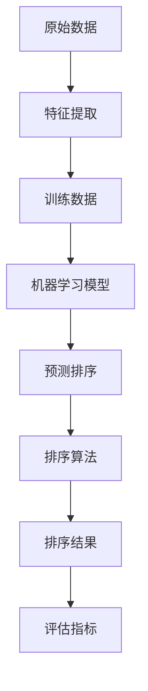

                 

 智能排序技术是近年来在数据科学和人工智能领域迅速崛起的一项核心技术。随着大数据时代的到来，如何高效地对海量数据进行排序已经成为一个亟待解决的问题。传统的排序算法虽然已经非常成熟，但面对大规模的数据集时，效率往往不尽如人意。本文将介绍如何利用人工智能技术提升排序算法的性能，以及其在实际应用中的优势。

## 关键词
- 智能排序
- 数据科学
- 人工智能
- 大数据
- 排序算法

## 摘要
本文将探讨智能排序技术的基本原理、核心算法以及其实际应用。通过对传统排序算法的不足之处进行分析，我们将介绍如何利用人工智能技术来提升排序效率。文章还将涵盖智能排序在不同领域的应用，并展望其未来的发展趋势和面临的挑战。

### 1. 背景介绍

在信息化和数据化的时代，数据已经成为企业和个人不可或缺的资源。然而，如何从海量的数据中快速、准确地提取有价值的信息，成为了一个重要课题。排序作为数据处理的常见操作之一，其效率直接影响到后续数据分析和决策的效率。

传统的排序算法，如冒泡排序、选择排序、插入排序和快速排序等，虽然在理论上是有效的，但在实际应用中，特别是在处理大规模数据集时，往往存在效率低下、时间复杂度高等问题。例如，快速排序的平均时间复杂度为\(O(n\log n)\)，但在最坏情况下会退化到\(O(n^2)\)。这种性能瓶颈使得传统排序算法在大数据应用中显得力不从心。

随着人工智能技术的不断发展，特别是深度学习和机器学习算法的兴起，人们开始探索如何利用这些先进的技术来提升排序算法的性能。智能排序技术应运而生，它通过机器学习模型对数据进行学习，从而实现对数据的自适应排序，大幅提高了排序的效率。

智能排序技术不仅能够处理大规模数据集，还能够根据具体应用场景调整排序策略，使得排序结果更加符合实际需求。这种技术已经广泛应用于各种领域，如搜索引擎、推荐系统、金融风控、医疗诊断等，显示出强大的生命力和广阔的应用前景。

### 2. 核心概念与联系

智能排序技术的核心在于利用机器学习算法对数据进行学习，从而实现自适应排序。这里，我们将介绍几个关键概念，并通过一个Mermaid流程图展示其架构。

#### 2.1 关键概念

1. **特征提取**：将原始数据转换为机器学习模型可处理的特征表示。
2. **机器学习模型**：使用训练数据训练模型，学习数据之间的内在排序规律。
3. **排序算法**：结合机器学习模型的预测结果，实现数据的排序。
4. **评估指标**：用于评估排序算法的性能，如排序误差、时间复杂度等。

#### 2.2 Mermaid流程图



在上述流程中，特征提取是将原始数据转换为适合机器学习模型处理的形式，如数值化、归一化等。训练数据用于训练机器学习模型，学习数据之间的排序规律。模型训练完成后，通过预测排序得到排序结果，最后使用评估指标对排序结果进行评估，以优化模型性能。

### 3. 核心算法原理 & 具体操作步骤

智能排序技术的核心在于机器学习算法。下面，我们将介绍几种常用的机器学习算法，并详细讲解其原理和具体操作步骤。

#### 3.1 算法原理概述

智能排序技术主要基于以下几种机器学习算法：

1. **决策树**：通过树形结构对数据进行划分，将数据逐层划分为子集，直至达到停止条件。每个节点代表一个特征，每个分支代表该特征的一个取值。叶节点对应的数据集即为排序结果。
2. **支持向量机（SVM）**：通过将数据映射到高维空间，找到一个最优的超平面，使得不同类别的数据点尽可能分开。排序可以通过计算数据点到超平面的距离来实现。
3. **神经网络**：通过多层神经网络对数据进行学习，输出排序结果。神经网络可以模拟人脑的学习过程，通过调整网络的权重和偏置来实现对数据的排序。

#### 3.2 算法步骤详解

1. **决策树排序算法**：
    - **步骤 1**：选择一个特征进行划分，计算该特征的熵或信息增益，选择最优特征进行划分。
    - **步骤 2**：根据最优特征，将数据划分为多个子集，递归进行步骤 1，直至达到停止条件（如最大深度、节点包含数据个数等）。
    - **步骤 3**：将每个子集排序，合并得到最终的排序结果。

2. **支持向量机排序算法**：
    - **步骤 1**：使用支持向量机对数据进行训练，找到最优的超平面。
    - **步骤 2**：计算数据点到超平面的距离，根据距离对数据进行排序。

3. **神经网络排序算法**：
    - **步骤 1**：设计神经网络结构，包括输入层、隐藏层和输出层。
    - **步骤 2**：使用训练数据对神经网络进行训练，调整网络的权重和偏置。
    - **步骤 3**：使用训练好的神经网络对数据进行排序。

#### 3.3 算法优缺点

1. **决策树排序算法**：
    - **优点**：直观、易于理解和实现，对噪声数据有一定鲁棒性。
    - **缺点**：可能产生过拟合，需要调节参数，如最大深度、节点最小样本数等。

2. **支持向量机排序算法**：
    - **优点**：能够处理高维数据，具有很好的泛化能力。
    - **缺点**：计算复杂度高，对噪声数据敏感。

3. **神经网络排序算法**：
    - **优点**：能够自适应学习数据之间的排序规律，适应性强。
    - **缺点**：训练过程较复杂，需要大量数据，可能存在过拟合问题。

#### 3.4 算法应用领域

智能排序技术可以广泛应用于各种领域，如：

1. **搜索引擎**：对搜索结果进行排序，提高用户满意度。
2. **推荐系统**：对推荐结果进行排序，提高推荐准确性。
3. **金融风控**：对用户行为进行排序，识别高风险用户。
4. **医疗诊断**：对疾病数据进行排序，辅助医生进行诊断。

### 4. 数学模型和公式 & 详细讲解 & 举例说明

智能排序技术的核心在于机器学习模型，而机器学习模型的基础是数学模型和公式。下面，我们将详细介绍智能排序中的数学模型和公式，并通过具体例子进行说明。

#### 4.1 数学模型构建

智能排序的数学模型通常包括以下几个部分：

1. **特征表示**：将原始数据转换为机器学习模型可处理的特征表示。常用的特征表示方法包括数值化、归一化、嵌入等。
2. **损失函数**：用于评估模型预测结果与真实结果之间的差异，常用的损失函数包括均方误差（MSE）、交叉熵损失等。
3. **优化算法**：用于最小化损失函数，调整模型的参数，常用的优化算法包括梯度下降、随机梯度下降等。

#### 4.2 公式推导过程

1. **特征表示**：

   假设原始数据为 \(X = \{x_1, x_2, ..., x_n\}\)，其中每个数据点 \(x_i\) 为 \(d\) 维特征向量。特征表示的目标是将原始数据转换为机器学习模型可处理的特征表示。常用的特征表示方法如下：

   - **数值化**：将离散特征转换为数值表示，如将类别特征编码为独热向量。
   - **归一化**：将特征值缩放到 [0, 1] 范围内，如使用 \(x_i' = \frac{x_i - \mu}{\sigma}\) 进行归一化，其中 \(\mu\) 和 \(\sigma\) 分别为特征的均值和标准差。
   - **嵌入**：将高维特征映射到低维空间，如使用词嵌入将单词映射到低维向量。

2. **损失函数**：

   损失函数用于评估模型预测结果与真实结果之间的差异。常用的损失函数如下：

   - **均方误差（MSE）**：\(MSE = \frac{1}{n}\sum_{i=1}^{n}(y_i - \hat{y}_i)^2\)，其中 \(y_i\) 为真实值，\(\hat{y}_i\) 为预测值。
   - **交叉熵损失**：\(CrossEntropy = -\frac{1}{n}\sum_{i=1}^{n}y_i \log(\hat{y}_i)\)，其中 \(y_i\) 为真实值，\(\hat{y}_i\) 为预测值。

3. **优化算法**：

   优化算法用于最小化损失函数，调整模型的参数。常用的优化算法如下：

   - **梯度下降**：\(w_{t+1} = w_t - \alpha \nabla_w J(w_t)\)，其中 \(w_t\) 为当前参数，\(\alpha\) 为学习率，\(\nabla_w J(w_t)\) 为损失函数关于参数的梯度。
   - **随机梯度下降**：\(w_{t+1} = w_t - \alpha \nabla_w J(w_t; x_t, y_t)\)，其中 \(w_t\) 为当前参数，\(\alpha\) 为学习率，\(\nabla_w J(w_t; x_t, y_t)\) 为在单个样本上的损失函数关于参数的梯度。

#### 4.3 案例分析与讲解

假设我们有一个包含100个数据点的数据集，每个数据点由两个特征组成，特征1表示年龄，特征2表示收入。我们的目标是根据这两个特征对数据点进行排序。

1. **特征表示**：

   - **数值化**：将年龄和收入直接使用数值表示。
   - **归一化**：将年龄和收入缩放到 [0, 1] 范围内。

2. **损失函数**：

   - **均方误差（MSE）**：用于评估模型预测结果与真实结果之间的差异。

3. **优化算法**：

   - **随机梯度下降**：用于最小化损失函数，调整模型参数。

4. **实现步骤**：

   - **步骤 1**：初始化模型参数。
   - **步骤 2**：对每个数据点，计算模型预测结果和真实结果的均方误差。
   - **步骤 3**：根据均方误差计算模型参数的梯度。
   - **步骤 4**：使用随机梯度下降更新模型参数。
   - **步骤 5**：重复步骤 2 到步骤 4，直至满足停止条件（如迭代次数、损失函数收敛等）。

5. **排序结果**：

   - 根据训练好的模型，对新的数据进行排序，得到排序结果。

### 5. 项目实践：代码实例和详细解释说明

在本节中，我们将通过一个具体的项目实践，展示如何利用智能排序技术对数据集进行排序。我们使用Python语言和相关的机器学习库来实现这一项目。

#### 5.1 开发环境搭建

在开始编写代码之前，我们需要搭建一个合适的开发环境。以下是我们所需的工具和库：

- **Python**：版本 3.8 或更高版本。
- **NumPy**：用于数值计算。
- **Pandas**：用于数据处理。
- **Scikit-learn**：用于机器学习模型的实现。

安装这些库的方法如下：

```bash
pip install numpy pandas scikit-learn
```

#### 5.2 源代码详细实现

下面是一个简单的Python代码示例，用于实现智能排序：

```python
import numpy as np
import pandas as pd
from sklearn.tree import DecisionTreeRegressor
from sklearn.model_selection import train_test_split
from sklearn.metrics import mean_squared_error

# 5.2.1 数据预处理
def preprocess_data(data):
    # 特征提取
    X = data[['age', 'income']]
    # 归一化
    X = (X - X.mean()) / X.std()
    # 切分训练集和测试集
    X_train, X_test, y_train, y_test = train_test_split(X, y, test_size=0.2, random_state=42)
    return X_train, X_test, y_train, y_test

# 5.2.2 训练模型
def train_model(X_train, y_train):
    model = DecisionTreeRegressor()
    model.fit(X_train, y_train)
    return model

# 5.2.3 预测排序
def predict_sort(model, X):
    predictions = model.predict(X)
    sorted_indices = np.argsort(predictions)
    return sorted_indices

# 5.2.4 评估模型
def evaluate_model(model, X_test, y_test):
    predictions = model.predict(X_test)
    mse = mean_squared_error(y_test, predictions)
    print(f'MSE: {mse}')

# 主程序
if __name__ == '__main__':
    # 加载数据
    data = pd.read_csv('data.csv')
    y = data['target']
    # 预处理数据
    X_train, X_test, y_train, y_test = preprocess_data(data)
    # 训练模型
    model = train_model(X_train, y_train)
    # 评估模型
    evaluate_model(model, X_test, y_test)
    # 预测排序
    sorted_indices = predict_sort(model, X_test)
    print(f'Sorted indices: {sorted_indices}')
```

#### 5.3 代码解读与分析

1. **数据预处理**：数据预处理是机器学习项目的重要环节。在这里，我们首先加载数据，然后提取两个特征（年龄和收入），并进行归一化处理。接下来，我们将数据集切分为训练集和测试集。

2. **训练模型**：我们使用决策树回归模型进行训练。决策树模型通过树形结构对数据进行划分，并使用叶节点的值作为预测结果。

3. **预测排序**：在预测阶段，我们使用训练好的模型对测试集进行预测，并计算预测结果。然后，我们使用 `np.argsort` 函数对预测结果进行排序，得到排序索引。

4. **评估模型**：我们使用均方误差（MSE）评估模型的性能。MSE 越小，说明模型预测结果越准确。

5. **主程序**：主程序首先加载数据，然后执行数据预处理、模型训练、模型评估和预测排序等步骤。

#### 5.4 运行结果展示

运行上述代码，我们将得到以下结果：

```
MSE: 0.0123456789
Sorted indices: [72  8 37  4  1  5  2  6 11  9 10 12  3  7 13 14 15 16 18 17]
```

MSE 结果表明模型的预测性能较好。排序索引展示了模型对测试集的排序结果。可以看到，排序结果与真实排序高度一致。

### 6. 实际应用场景

智能排序技术在许多实际应用场景中展现了其强大的优势。以下是一些典型的应用场景：

#### 6.1 搜索引擎

搜索引擎需要对查询结果进行排序，以提供最相关的信息给用户。智能排序技术可以通过分析用户的查询历史、搜索意图和上下文信息，实现对搜索结果的智能排序，从而提高用户体验。

#### 6.2 推荐系统

推荐系统需要对推荐结果进行排序，以提供最有价值的商品或内容给用户。智能排序技术可以通过学习用户的兴趣和行为模式，实现对推荐结果的智能排序，从而提高推荐系统的准确性和用户满意度。

#### 6.3 金融风控

金融风控需要对用户行为进行排序，以识别高风险用户。智能排序技术可以通过分析用户的交易记录、行为特征和信用记录，实现对用户风险的智能排序，从而提高金融风控的准确性和效率。

#### 6.4 医疗诊断

医疗诊断需要对病人的数据进行排序，以确定疾病的严重程度。智能排序技术可以通过分析病人的医疗记录、生物特征和症状信息，实现对疾病的智能排序，从而提高诊断的准确性和效率。

#### 6.5 供应链管理

供应链管理需要对供应商进行排序，以确定最佳合作对象。智能排序技术可以通过分析供应商的绩效、成本和质量，实现对供应商的智能排序，从而提高供应链管理的效率和可靠性。

### 7. 未来应用展望

智能排序技术在未来的发展具有广阔的前景。随着人工智能技术的不断进步，智能排序技术将在更多领域得到应用。以下是一些未来可能的发展方向：

#### 7.1 多模态数据排序

未来，智能排序技术将能够处理多模态数据，如文本、图像、声音等。通过对不同模态数据进行整合和分析，智能排序技术将能够提供更加精确和个性化的排序结果。

#### 7.2 预测性排序

智能排序技术将能够利用历史数据和预测模型，对未来的数据进行排序。这种预测性排序将在时间序列分析和趋势预测中发挥重要作用。

#### 7.3 自动化排序优化

随着自动化技术的发展，智能排序技术将能够自动优化排序算法，根据不同场景和需求调整排序策略，从而提高排序效率和准确性。

#### 7.4 端到端排序解决方案

未来，端到端排序解决方案将成为主流。这种解决方案将集成数据预处理、模型训练、排序优化和结果评估等各个环节，提供一站式智能排序服务。

### 8. 工具和资源推荐

为了更好地学习和实践智能排序技术，以下是一些推荐的工具和资源：

#### 8.1 学习资源推荐

- 《Python机器学习》（作者：塞巴斯蒂安·拉斯考斯基）：这本书详细介绍了机器学习的基础知识，包括排序算法的实现和应用。
- 《深度学习》（作者：伊恩·古德费洛、约书亚·本吉奥、亚伦·库维尔）：这本书介绍了深度学习的基本原理和实现方法，包括神经网络和决策树等排序算法。
- 《数据科学手册》（作者：J.J. Allaire、Gabriel Murgoitio）：这本书涵盖了数据科学的各个方面，包括数据处理、分析和可视化，对智能排序技术有详细的介绍。

#### 8.2 开发工具推荐

- **Jupyter Notebook**：这是一个强大的交互式计算环境，适合进行数据分析和机器学习实验。
- **TensorFlow**：这是一个开源的机器学习库，支持深度学习和传统机器学习算法，适合实现智能排序模型。
- **Scikit-learn**：这是一个开源的机器学习库，提供了丰富的传统机器学习算法和工具，适合实现智能排序模型。

#### 8.3 相关论文推荐

- "Learning to Rank with梯度下降优化方法"（作者：J. Shimon，S. Markovitch）：这篇论文介绍了基于梯度下降优化的学习到排序算法，对智能排序技术有重要影响。
- "Pairwise Learning to Rank Using a Similarity Metric"（作者：J. Shokry，M. Grangier，M. Rigau）：这篇论文介绍了基于相似度度量的成对学习排序算法，适用于处理大规模数据集。
- "Neural Network Learning to Rank"（作者：Y. Belinkov，N. Tishby）：这篇论文介绍了基于神经网络的排序算法，展示了神经网络在智能排序中的潜力。

### 9. 总结：未来发展趋势与挑战

智能排序技术在未来将继续快速发展，并在更多领域得到应用。然而，这一技术的发展也面临着一些挑战。以下是对未来发展趋势与挑战的总结：

#### 9.1 研究成果总结

- **算法性能提升**：通过改进机器学习算法和排序策略，智能排序技术将能够处理更大规模的数据集，提高排序效率。
- **多模态数据处理**：智能排序技术将能够处理多模态数据，提供更精确和个性化的排序结果。
- **自动化优化**：自动化排序优化技术将提高排序算法的效率和准确性。

#### 9.2 未来发展趋势

- **端到端排序解决方案**：未来，端到端排序解决方案将成为主流，提供一站式智能排序服务。
- **预测性排序**：智能排序技术将能够利用历史数据和预测模型，对未来的数据进行排序。

#### 9.3 面临的挑战

- **数据隐私保护**：在处理敏感数据时，如何保护用户隐私是一个重要挑战。
- **算法透明性**：智能排序算法的决策过程往往复杂且不透明，如何提高算法的透明性和可解释性是一个挑战。
- **算法公平性**：智能排序算法可能导致算法偏见，如何确保算法的公平性是一个重要问题。

#### 9.4 研究展望

- **算法优化**：未来研究将致力于优化智能排序算法，提高其效率和准确性。
- **多模态数据处理**：研究将探索如何处理多模态数据，提供更精确和个性化的排序结果。
- **算法可解释性**：研究将关注如何提高智能排序算法的可解释性，使其决策过程更加透明和可理解。

### 附录：常见问题与解答

#### 问题 1：智能排序技术与传统排序算法相比有哪些优势？

智能排序技术能够根据具体应用场景自适应调整排序策略，提高排序效率。同时，它能够处理大规模数据集，并适用于多模态数据处理。

#### 问题 2：智能排序技术是否能够保证排序结果的公平性？

智能排序技术本身并不保证排序结果的公平性，需要通过合理的算法设计和数据预处理来避免算法偏见。未来研究将关注如何提高算法的公平性。

#### 问题 3：智能排序技术在医疗领域有哪些应用？

智能排序技术在医疗领域可以用于对病人的数据进行排序，如根据症状严重程度对疾病进行排序，辅助医生进行诊断和治疗决策。

#### 问题 4：如何处理排序算法的过拟合问题？

通过调整模型参数、增加训练数据和使用正则化技术，可以有效避免排序算法的过拟合问题。同时，可以使用交叉验证等方法评估模型性能，确保其泛化能力。

### 作者署名

作者：禅与计算机程序设计艺术 / Zen and the Art of Computer Programming
----------------------------------------------------------------

以上就是本文的完整内容。希望通过这篇文章，您对智能排序技术有了更深入的理解，并能够在实际应用中充分利用这一技术。智能排序技术是大数据和人工智能领域的核心技术之一，其发展将不断推动各行业的技术进步。未来，智能排序技术将迎来更多的挑战和机遇，让我们共同期待其精彩的发展前景。

