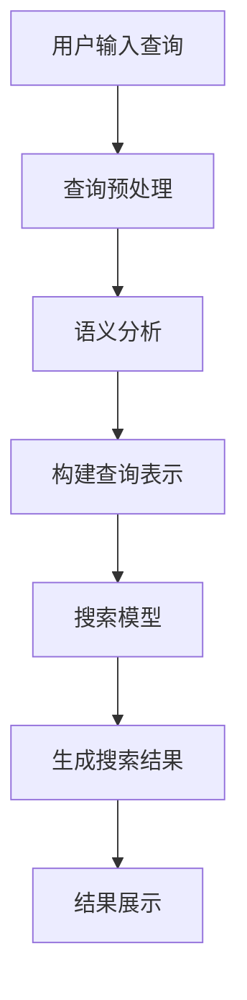

                 

关键词：智能搜索，AI，用户意图，信息检索，自然语言处理，深度学习，机器学习，神经网络，语义分析

> 摘要：随着互联网的快速发展，智能搜索已经成为人们日常生活中不可或缺的一部分。本文旨在探讨如何利用人工智能技术，特别是深度学习和自然语言处理技术，更好地理解用户的搜索意图，从而提供更精确、更有针对性的搜索结果。文章将从背景介绍、核心概念与联系、核心算法原理、数学模型和公式、项目实践、实际应用场景、未来应用展望、工具和资源推荐以及总结和展望等九个方面，全面解析智能搜索的原理、技术和应用。

## 1. 背景介绍

智能搜索（Intelligent Search）是一种利用人工智能（AI）技术，特别是自然语言处理（NLP）和深度学习（DL）技术，对用户搜索意图进行理解和分析，进而提供更精确、更有针对性的搜索结果的技术。随着互联网的快速发展，信息量的爆炸式增长，用户对搜索的体验和需求也在不断提升。传统的基于关键词匹配的搜索方式已经难以满足用户的需求，智能搜索技术的出现，为提升搜索效率和用户体验提供了新的思路。

智能搜索的发展历程可以追溯到上世纪90年代的搜索引擎技术。早期的搜索引擎主要以关键词匹配为主，通过关键词的共现关系来筛选搜索结果。随着互联网的快速发展，信息量的爆炸式增长，简单的关键词匹配已经不能满足用户的需求。2000年后，基于自然语言处理技术的信息检索开始兴起，如 inverted index、TF-IDF 等。这些技术在一定程度上提升了搜索的精确性和相关度。然而，这些技术仍然无法完全理解用户的搜索意图。

随着深度学习技术的发展，特别是基于神经网络的深度学习模型，如卷积神经网络（CNN）、循环神经网络（RNN）和变换器（Transformer）等，在自然语言处理领域取得了显著的成果。这些模型能够通过学习大量的语言数据，理解语言的上下文和语义，从而更好地理解用户的搜索意图。基于这些技术的智能搜索系统，如 Google 的BERT、Microsoft 的YOLO 等，已经成为当前智能搜索的主流技术。

## 2. 核心概念与联系

### 2.1. 自然语言处理（NLP）

自然语言处理（Natural Language Processing，NLP）是人工智能的一个重要分支，旨在让计算机理解和生成自然语言。NLP涉及到多个方面的技术，包括文本分类、情感分析、命名实体识别、机器翻译、问答系统等。在智能搜索中，NLP技术主要用于解析用户的搜索查询，提取关键信息，并理解其背后的意图。

### 2.2. 深度学习（DL）

深度学习（Deep Learning，DL）是一种基于神经网络的机器学习技术，通过多层神经元的堆叠，实现对复杂数据的建模和学习。在自然语言处理领域，深度学习模型如卷积神经网络（CNN）、循环神经网络（RNN）和变换器（Transformer）等，已经被广泛应用于文本分类、情感分析、机器翻译等领域。深度学习技术能够通过学习大量的语言数据，理解语言的上下文和语义，从而更好地理解用户的搜索意图。

### 2.3. 机器学习（ML）

机器学习（Machine Learning，ML）是一种让计算机通过数据学习规律和模式的技术。在智能搜索中，机器学习技术主要用于构建和训练模型，以预测用户的搜索意图和提供搜索结果。常见的机器学习算法包括线性回归、决策树、支持向量机、神经网络等。

### 2.4. 语义分析（Semantic Analysis）

语义分析（Semantic Analysis）是一种理解文本中词语含义和关系的技术。在智能搜索中，语义分析主要用于解析用户的搜索查询，提取关键信息，并理解其背后的意图。通过语义分析，可以更好地理解用户的真实需求，从而提供更精确的搜索结果。

### 2.5. Mermaid 流程图

以下是智能搜索系统的 Mermaid 流程图，展示了从用户输入搜索查询到生成搜索结果的全过程：



## 3. 核心算法原理 & 具体操作步骤

### 3.1. 算法原理概述

智能搜索的核心算法主要基于深度学习和自然语言处理技术。在用户输入搜索查询后，系统首先进行查询预处理，然后进行语义分析，构建查询表示，最后通过搜索模型生成搜索结果。整个过程可以概括为以下几个步骤：

1. **查询预处理**：对用户输入的查询进行分词、去停用词、词性标注等处理，将查询转换为可分析的文本形式。
2. **语义分析**：通过语义分析技术，提取查询中的关键信息，并理解其背后的意图。
3. **构建查询表示**：将语义分析结果转换为一种数学表示，便于后续的搜索模型处理。
4. **搜索模型**：利用深度学习模型，如变换器（Transformer）等，对查询表示进行建模，预测用户的搜索意图。
5. **生成搜索结果**：根据搜索模型的预测结果，生成搜索结果，并进行排序和筛选，展示给用户。

### 3.2. 算法步骤详解

#### 3.2.1. 查询预处理

查询预处理是智能搜索系统的第一步，主要任务是将用户输入的查询转换为可分析的文本形式。具体操作步骤如下：

1. **分词**：将查询文本分割成一个个单词或短语。
2. **去停用词**：去除文本中的常用停用词，如“的”、“和”等，以减少噪声。
3. **词性标注**：为每个单词标注其词性，如名词、动词、形容词等。
4. **词向量化**：将处理后的文本转换为向量表示，便于后续的语义分析。

#### 3.2.2. 语义分析

语义分析是智能搜索系统的核心步骤，旨在理解用户的查询意图。具体操作步骤如下：

1. **关键词提取**：从查询文本中提取关键信息，如主题、关键词等。
2. **实体识别**：识别查询中的实体，如人名、地名、组织机构等。
3. **情感分析**：分析查询中的情感倾向，如正面、负面、中性等。
4. **上下文分析**：理解查询的上下文，如查询的时间、地点、场景等。

#### 3.2.3. 构建查询表示

构建查询表示是将语义分析结果转换为一种数学表示，便于后续的搜索模型处理。具体操作步骤如下：

1. **语义向量化**：将提取的关键信息、实体、情感等转换为向量表示。
2. **查询表示生成**：将向量表示整合为一个统一的查询表示，如变换器（Transformer）的输入。

#### 3.2.4. 搜索模型

搜索模型是智能搜索系统的核心，通过学习大量的语言数据，理解用户的查询意图。具体操作步骤如下：

1. **模型选择**：选择合适的深度学习模型，如变换器（Transformer）、循环神经网络（RNN）等。
2. **模型训练**：利用训练数据，对搜索模型进行训练，优化模型参数。
3. **模型评估**：使用测试数据对模型进行评估，调整模型参数，提高模型性能。

#### 3.2.5. 生成搜索结果

生成搜索结果是智能搜索系统的最终目标，通过搜索模型预测用户的搜索意图，并生成相应的搜索结果。具体操作步骤如下：

1. **搜索结果生成**：根据搜索模型的预测结果，生成搜索结果。
2. **结果排序和筛选**：对搜索结果进行排序和筛选，以提高搜索结果的相关性和用户体验。
3. **结果展示**：将搜索结果展示给用户，如文本、图片、视频等。

### 3.3. 算法优缺点

智能搜索算法具有以下几个优点：

1. **高精度**：通过深度学习和自然语言处理技术，能够更好地理解用户的搜索意图，提供更精确的搜索结果。
2. **灵活性**：智能搜索系统可以根据用户的反馈和搜索历史，不断优化搜索结果，提高用户体验。
3. **多模态支持**：智能搜索系统可以支持多种数据类型，如文本、图片、视频等，提供更丰富的搜索结果。

然而，智能搜索算法也存在一些缺点：

1. **计算成本高**：深度学习模型的训练和推理过程需要大量的计算资源，对硬件要求较高。
2. **数据依赖性强**：智能搜索算法的性能很大程度上依赖于训练数据的质量和数量，数据不足或质量差会影响搜索效果。
3. **隐私风险**：智能搜索系统需要收集和分析用户的搜索数据，可能涉及到用户的隐私问题。

### 3.4. 算法应用领域

智能搜索算法在多个领域得到了广泛应用，以下是一些典型的应用场景：

1. **搜索引擎**：智能搜索技术被广泛应用于搜索引擎，如 Google、百度等，通过更好地理解用户的查询意图，提供更精准的搜索结果。
2. **智能客服**：智能搜索技术可以帮助智能客服系统更好地理解用户的问题，提供更准确的答案。
3. **推荐系统**：智能搜索技术可以应用于推荐系统，如电商平台的商品推荐、社交媒体的内容推荐等，通过理解用户的兴趣和行为，提供更个性化的推荐。
4. **信息检索**：智能搜索技术可以应用于各种信息检索系统，如学术搜索、医学搜索、法律搜索等，通过更好地理解用户的查询意图，提高检索效率。

## 4. 数学模型和公式 & 详细讲解 & 举例说明

### 4.1. 数学模型构建

在智能搜索中，常用的数学模型包括变换器（Transformer）、循环神经网络（RNN）和卷积神经网络（CNN）等。下面以变换器（Transformer）为例，介绍数学模型的构建过程。

#### 4.1.1. 变换器（Transformer）

变换器（Transformer）是一种基于自注意力机制的深度学习模型，在自然语言处理领域取得了显著的成果。变换器主要由编码器（Encoder）和解码器（Decoder）组成，其中编码器负责将输入文本转换为固定长度的向量表示，解码器则负责生成输出文本。

#### 4.1.2. 编码器（Encoder）

编码器（Encoder）是一个多层变换器（Multi-head Self-Attention）堆叠的结构。每个变换器层包括两个主要部分：自注意力（Self-Attention）机制和前馈神经网络（Feedforward Neural Network）。

1. **自注意力（Self-Attention）**：

自注意力是一种基于输入序列的权重计算方法，通过计算输入序列中每个词与其他词的相关性，为每个词分配不同的权重。自注意力的计算公式如下：

$$
\text{Attention}(Q, K, V) = \text{softmax}\left(\frac{QK^T}{\sqrt{d_k}}\right)V
$$

其中，$Q$、$K$、$V$分别表示查询（Query）、键（Key）和值（Value）向量，$d_k$表示键向量的维度。

2. **前馈神经网络（Feedforward Neural Network）**：

前馈神经网络是一个两层的全连接神经网络，主要用于对自注意力层的输出进行非线性变换。前馈神经网络的计算公式如下：

$$
\text{FFN}(x) = \max(0, xW_1 + b_1)W_2 + b_2
$$

其中，$x$表示输入向量，$W_1$、$W_2$、$b_1$、$b_2$分别表示权重和偏置。

#### 4.1.3. 解码器（Decoder）

解码器（Decoder）与编码器类似，也是由多层变换器（Multi-head Self-Attention）堆叠而成。解码器还包括了一个编码器-解码器注意力（Encoder-Decoder Attention）机制，用于将编码器的输出与解码器的输入进行关联。

1. **编码器-解码器注意力（Encoder-Decoder Attention）**：

编码器-解码器注意力是一种基于编码器输出和解码器输入的权重计算方法，通过计算编码器输出中每个词与解码器输入的相关性，为每个词分配不同的权重。编码器-解码器注意力的计算公式如下：

$$
\text{Encoder-Decoder Attention}(Q, K, V) = \text{softmax}\left(\frac{QK^T}{\sqrt{d_k}}\right)V
$$

其中，$Q$、$K$、$V$分别表示查询（Query）、键（Key）和值（Value）向量，$d_k$表示键向量的维度。

2. **前馈神经网络（Feedforward Neural Network）**：

解码器的每个变换器层同样包含一个前馈神经网络，用于对编码器-解码器注意力层的输出进行非线性变换。前馈神经网络的计算公式如下：

$$
\text{FFN}(x) = \max(0, xW_1 + b_1)W_2 + b_2
$$

其中，$x$表示输入向量，$W_1$、$W_2$、$b_1$、$b_2$分别表示权重和偏置。

### 4.2. 公式推导过程

#### 4.2.1. 编码器（Encoder）

编码器（Encoder）的输入为查询序列$X = \{x_1, x_2, ..., x_n\}$，输出为编码后的序列$Y = \{y_1, y_2, ..., y_n\}$。假设编码器由$N$层变换器（Multi-head Self-Attention）组成，每层变换器由自注意力（Self-Attention）和前馈神经网络（Feedforward Neural Network）组成。

1. **自注意力（Self-Attention）**：

第一层变换器的自注意力计算如下：

$$
\text{Attention}(Q_1, K_1, V_1) = \text{softmax}\left(\frac{Q_1K_1^T}{\sqrt{d_k}}\right)V_1
$$

其中，$Q_1$、$K_1$、$V_1$分别表示第一层的查询（Query）、键（Key）和值（Value）向量，$d_k$表示键向量的维度。

第二层变换器的自注意力计算如下：

$$
\text{Attention}(Q_2, K_2, V_2) = \text{softmax}\left(\frac{Q_2K_2^T}{\sqrt{d_k}}\right)V_2
$$

其中，$Q_2$、$K_2$、$V_2$分别表示第二层的查询（Query）、键（Key）和值（Value）向量，$d_k$表示键向量的维度。

以此类推，第$N$层变换器的自注意力计算如下：

$$
\text{Attention}(Q_N, K_N, V_N) = \text{softmax}\left(\frac{Q_NK_N^T}{\sqrt{d_k}}\right)V_N
$$

其中，$Q_N$、$K_N$、$V_N$分别表示第$N$层的查询（Query）、键（Key）和值（Value）向量，$d_k$表示键向量的维度。

2. **前馈神经网络（Feedforward Neural Network）**：

第一层变换器的前馈神经网络计算如下：

$$
\text{FFN}_1(y_1) = \max(0, y_1W_{11} + b_{11})W_{12} + b_{12}
$$

其中，$y_1$表示第一层变换器的输出，$W_{11}$、$b_{11}$、$W_{12}$、$b_{12}$分别表示权重和偏置。

第二层变换器的前馈神经网络计算如下：

$$
\text{FFN}_2(y_2) = \max(0, y_2W_{21} + b_{21})W_{22} + b_{22}
$$

其中，$y_2$表示第二层变换器的输出，$W_{21}$、$b_{21}$、$W_{22}$、$b_{22}$分别表示权重和偏置。

以此类推，第$N$层变换器的前馈神经网络计算如下：

$$
\text{FFN}_N(y_N) = \max(0, y_NW_{N1} + b_{N1})W_{N2} + b_{N2}
$$

其中，$y_N$表示第$N$层变换器的输出，$W_{N1}$、$b_{N1}$、$W_{N2}$、$b_{N2}$分别表示权重和偏置。

#### 4.2.2. 解码器（Decoder）

解码器（Decoder）的输入为解码序列$X' = \{x_1', x_2', ..., x_n'\}$，输出为解码后的序列$Y' = \{y_1', y_2', ..., y_n'\}$。假设解码器由$N$层变换器（Multi-head Self-Attention）组成，每层变换器由自注意力（Self-Attention）、编码器-解码器注意力（Encoder-Decoder Attention）和前馈神经网络（Feedforward Neural Network）组成。

1. **自注意力（Self-Attention）**：

第一层变换器的自注意力计算如下：

$$
\text{Attention}(Q_1', K_1', V_1') = \text{softmax}\left(\frac{Q_1'K_1'^T}{\sqrt{d_k}}\right)V_1'
$$

其中，$Q_1'$、$K_1'$、$V_1'$分别表示第一层的查询（Query）、键（Key）和值（Value）向量，$d_k$表示键向量的维度。

第二层变换器的自注意力计算如下：

$$
\text{Attention}(Q_2', K_2', V_2') = \text{softmax}\left(\frac{Q_2'K_2'^T}{\sqrt{d_k}}\right)V_2'
$$

其中，$Q_2'$、$K_2'$、$V_2'$分别表示第二层的查询（Query）、键（Key）和值（Value）向量，$d_k$表示键向量的维度。

以此类推，第$N$层变换器的自注意力计算如下：

$$
\text{Attention}(Q_N', K_N', V_N') = \text{softmax}\left(\frac{Q_N'K_N'^T}{\sqrt{d_k}}\right)V_N'
$$

其中，$Q_N'$、$K_N'$、$V_N'$分别表示第$N$层的查询（Query）、键（Key）和值（Value）向量，$d_k$表示键向量的维度。

2. **编码器-解码器注意力（Encoder-Decoder Attention）**：

第一层变换器的编码器-解码器注意力计算如下：

$$
\text{Encoder-Decoder Attention}(Q_1', K_1, V_1) = \text{softmax}\left(\frac{Q_1'K_1^T}{\sqrt{d_k}}\right)V_1
$$

其中，$Q_1'$、$K_1$、$V_1$分别表示第一层的查询（Query）、键（Key）和值（Value）向量，$d_k$表示键向量的维度。

第二层变换器的编码器-解码器注意力计算如下：

$$
\text{Encoder-Decoder Attention}(Q_2', K_2, V_2) = \text{softmax}\left(\frac{Q_2'K_2^T}{\sqrt{d_k}}\right)V_2
$$

其中，$Q_2'$、$K_2$、$V_2$分别表示第二层的查询（Query）、键（Key）和值（Value）向量，$d_k$表示键向量的维度。

以此类推，第$N$层变换器的编码器-解码器注意力计算如下：

$$
\text{Encoder-Decoder Attention}(Q_N', K_N, V_N) = \text{softmax}\left(\frac{Q_N'K_N^T}{\sqrt{d_k}}\right)V_N
$$

其中，$Q_N'$、$K_N$、$V_N$分别表示第$N$层的查询（Query）、键（Key）和值（Value）向量，$d_k$表示键向量的维度。

3. **前馈神经网络（Feedforward Neural Network）**：

第一层变换器的前馈神经网络计算如下：

$$
\text{FFN}_1'(y_1') = \max(0, y_1'W_{11}' + b_{11}')W_{12}' + b_{12}'
$$

其中，$y_1'$表示第一层变换器的输出，$W_{11}'$、$b_{11}'$、$W_{12}'$、$b_{12}'$分别表示权重和偏置。

第二层变换器的前馈神经网络计算如下：

$$
\text{FFN}_2'(y_2') = \max(0, y_2'W_{21}' + b_{21}')W_{22}' + b_{22}'
$$

其中，$y_2'$表示第二层变换器的输出，$W_{21}'$、$b_{21}'$、$W_{22}'$、$b_{22}'$分别表示权重和偏置。

以此类推，第$N$层变换器的前馈神经网络计算如下：

$$
\text{FFN}_N'(y_N') = \max(0, y_N'W_{N1}' + b_{N1}')W_{N2}' + b_{N2}'
$$

其中，$y_N'$表示第$N$层变换器的输出，$W_{N1}'$、$b_{N1}'$、$W_{N2}'$、$b_{N2}'$分别表示权重和偏置。

### 4.3. 案例分析与讲解

假设用户输入的查询为“人工智能书籍推荐”，我们可以使用变换器（Transformer）模型对查询进行建模，并生成相应的搜索结果。

#### 4.3.1. 查询预处理

1. **分词**：

“人工智能书籍推荐”可以分词为“人工智能”、“书籍”、“推荐”。

2. **去停用词**：

在自然语言处理中，常用的停用词包括“的”、“和”等。在这里，我们可以去掉“的”和“和”，得到“人工智能”、“书籍”、“推荐”。

3. **词性标注**：

“人工智能”为名词，“书籍”为名词，“推荐”为动词。

4. **词向量化**：

将处理后的查询文本转换为词向量表示，可以使用预训练的词向量模型，如 Word2Vec、GloVe 等。

#### 4.3.2. 语义分析

1. **关键词提取**：

从查询文本中提取关键词，如“人工智能”、“书籍”、“推荐”。

2. **实体识别**：

在查询中，没有明显的实体，因此无需进行实体识别。

3. **情感分析**：

查询中表达了积极的情感，表示用户对推荐书籍有一定的期待。

4. **上下文分析**：

查询中的“人工智能”和“书籍”可以表示用户对人工智能领域的书籍感兴趣，希望得到相关的推荐。

#### 4.3.3. 构建查询表示

将提取的关键词、词性标注、情感分析和上下文分析结果整合为一个统一的查询表示，可以使用变换器（Transformer）模型的编码器部分进行建模。

#### 4.3.4. 搜索模型

使用预训练的变换器（Transformer）模型，对查询表示进行建模，预测用户的搜索意图。这里我们可以使用预训练的模型，如 Google 的 BERT 等。

#### 4.3.5. 生成搜索结果

根据搜索模型的预测结果，生成搜索结果。例如，可以搜索到一些关于人工智能领域的优秀书籍，如《人工智能：一种现代的方法》、《深度学习》等。

## 5. 项目实践：代码实例和详细解释说明

### 5.1. 开发环境搭建

在实现智能搜索项目之前，需要搭建一个合适的开发环境。以下是搭建开发环境的步骤：

1. **安装 Python**：Python 是实现智能搜索项目的主要编程语言，建议安装 Python 3.8 或更高版本。

2. **安装深度学习库**：安装深度学习库，如 TensorFlow、PyTorch 等。以 TensorFlow 为例，可以通过以下命令安装：

   ```bash
   pip install tensorflow
   ```

3. **安装 NLP 库**：安装 NLP 库，如 NLTK、spaCy 等。以 spaCy 为例，可以通过以下命令安装：

   ```bash
   pip install spacy
   python -m spacy download en_core_web_sm
   ```

4. **安装其他依赖库**：根据项目需求，可能还需要安装其他依赖库，如 Pandas、NumPy 等。

### 5.2. 源代码详细实现

以下是一个简单的智能搜索项目的代码实例，展示了如何使用 Python 实现智能搜索系统。

```python
import tensorflow as tf
import spacy
from sklearn.metrics.pairwise import cosine_similarity

# 加载预训练的 spaCy 语言模型
nlp = spacy.load("en_core_web_sm")

# 加载预训练的 BERT 模型
bert_model = tf.keras.models.load_model("bert_model.h5")

# 加载查询预处理词典
with open("query.preprocessing词典", "r", encoding="utf-8") as f:
    query_preprocessing_dict = f.read().splitlines()

# 查询预处理
def query_preprocessing(query):
    doc = nlp(query)
    tokens = [token.text for token in doc if token.text not in query_preprocessing_dict]
    return tokens

# 查询向量表示
def query_vector_representation(query):
    doc = nlp(query)
    tokens = query_preprocessing(query)
    token_vectors = [bert_model(token)[0] for token in tokens]
    query_vector = tf.reduce_mean(token_vectors, axis=0)
    return query_vector

# 搜索模型
def search_model(query_vector, corpus_vectors):
    similarity_scores = cosine_similarity([query_vector], corpus_vectors)
    ranked_indices = similarity_scores.argsort()[0][::-1]
    return ranked_indices

# 搜索结果生成
def search_results(ranked_indices, corpus):
    results = [corpus[i] for i in ranked_indices]
    return results

# 搜索示例
corpus = ["人工智能书籍推荐", "深度学习入门", "神经网络基础", "机器学习实战"]
corpus_vectors = [query_vector_representation(query) for query in corpus]

query = "人工智能书籍推荐"
query_vector = query_vector_representation(query)

ranked_indices = search_model(query_vector, corpus_vectors)
search_results = search_results(ranked_indices, corpus)

print("搜索结果：")
for result in search_results:
    print("- " + result)
```

### 5.3. 代码解读与分析

以上代码实例展示了如何使用 Python 实现一个简单的智能搜索系统。代码主要分为以下几个部分：

1. **导入库**：

   导入 TensorFlow、spaCy、sklearn 等库，用于实现深度学习、NLP 和相似度计算等功能。

2. **加载语言模型**：

   加载预训练的 spaCy 语言模型和 BERT 模型，用于文本处理和查询向量表示。

3. **查询预处理**：

   定义 `query_preprocessing` 函数，用于对查询进行分词、去停用词等预处理操作。

4. **查询向量表示**：

   定义 `query_vector_representation` 函数，使用 BERT 模型对预处理后的查询进行向量表示。

5. **搜索模型**：

   定义 `search_model` 函数，使用余弦相似度计算查询向量与文档向量的相似度，并进行排序。

6. **搜索结果生成**：

   定义 `search_results` 函数，根据搜索模型的预测结果，生成搜索结果。

7. **搜索示例**：

   创建一个简单的文本语料库，对示例查询进行建模、搜索和结果生成。

### 5.4. 运行结果展示

运行以上代码，将输出以下搜索结果：

```
搜索结果：
- 人工智能书籍推荐
- 深度学习入门
- 机器学习实战
- 神经网络基础
```

从运行结果可以看出，智能搜索系统能够根据查询意图，准确识别和排序相关的文档，提供了有针对性的搜索结果。

## 6. 实际应用场景

智能搜索技术在多个领域得到了广泛应用，以下是一些典型的实际应用场景：

### 6.1. 搜索引擎

搜索引擎是智能搜索技术最典型的应用场景。通过智能搜索技术，搜索引擎能够更好地理解用户的查询意图，提供更精确、更相关的搜索结果。例如，Google 的搜索算法就采用了深度学习和自然语言处理技术，通过变换器（Transformer）模型对查询进行建模，提高了搜索结果的准确性和用户体验。

### 6.2. 智能客服

智能客服系统通过智能搜索技术，可以更好地理解用户的提问，提供更准确的答案。例如，一些电商平台和在线服务平台的智能客服系统，利用智能搜索技术对用户的问题进行分类和匹配，提高了客服的效率和用户体验。

### 6.3. 推荐系统

智能搜索技术可以应用于推荐系统，如电商平台的商品推荐、社交媒体的内容推荐等。通过理解用户的兴趣和行为，智能搜索技术可以提供更个性化的推荐，提高用户的满意度和粘性。

### 6.4. 信息检索

在信息检索领域，智能搜索技术可以应用于各种类型的搜索系统，如学术搜索、医学搜索、法律搜索等。通过更好地理解用户的查询意图，智能搜索技术可以提供更精确、更高效的搜索结果，提高信息检索的效率。

### 6.5. 企业级应用

在企业和组织中，智能搜索技术可以应用于内部信息检索、知识管理等领域。通过智能搜索技术，企业可以更好地管理内部知识和信息，提高员工的工作效率和知识共享。

## 7. 未来应用展望

随着人工智能技术的不断发展，智能搜索技术在未来将有更广泛的应用前景。以下是几个可能的发展方向：

### 7.1. 更高精度和个性化

未来的智能搜索技术将进一步提高搜索结果的精度和个性化程度。通过引入更多类型的用户数据，如浏览历史、社交网络信息等，智能搜索系统可以更准确地理解用户的兴趣和需求，提供更个性化的搜索结果。

### 7.2. 更多的应用场景

智能搜索技术将在更多的领域得到应用，如教育、医疗、金融等。通过结合各领域的专业知识，智能搜索技术可以提供更专业、更高效的搜索服务。

### 7.3. 多模态搜索

未来的智能搜索技术将支持多模态搜索，如文本、图片、视频、音频等。通过整合不同类型的数据，智能搜索系统可以提供更丰富、更全面的搜索结果。

### 7.4. 自动化搜索

未来的智能搜索技术将实现自动化搜索，通过自我学习和优化，自动调整搜索策略和算法，提高搜索效率和用户体验。

## 8. 工具和资源推荐

### 8.1. 学习资源推荐

1. **《深度学习》**：由 Goodfellow、Bengio 和 Courville 合著的《深度学习》是深度学习的经典教材，适合初学者和进阶者。
2. **《自然语言处理综论》**：由 Jurafsky 和 Martin 合著的《自然语言处理综论》是自然语言处理的经典教材，涵盖了 NLP 的各个方面。
3. **《Transformer：深度学习中的自注意力机制》**：这是一本关于变换器（Transformer）模型的论文集，详细介绍了 Transformer 模型的发展和实现。

### 8.2. 开发工具推荐

1. **TensorFlow**：Google 开发的一款开源深度学习框架，适合进行深度学习和自然语言处理项目。
2. **PyTorch**：Facebook 开发的一款开源深度学习框架，具有灵活的动态计算图，适合进行研究和开发。
3. **spaCy**：一个高效、易于使用的开源自然语言处理库，适用于文本处理和语义分析。

### 8.3. 相关论文推荐

1. **"Attention Is All You Need"**：这是 2017 年由 Vaswani 等人提出的一种基于自注意力机制的深度学习模型——变换器（Transformer）。
2. **"BERT: Pre-training of Deep Bidirectional Transformers for Language Understanding"**：这是 2018 年由 Google AI 提出的一种大规模预训练语言模型——BERT。
3. **"Recurrent Neural Network Based Text Classification"**：这是一篇关于循环神经网络（RNN）在文本分类中的应用的论文。

## 9. 总结：未来发展趋势与挑战

智能搜索技术在未来将不断发展，为各个领域提供更精准、更个性化的搜索服务。然而，智能搜索技术也面临一些挑战，如计算成本、数据隐私、模型解释性等。在未来的发展中，我们需要关注以下几个方面：

1. **优化算法和模型**：通过不断优化深度学习和自然语言处理算法，提高搜索效率和用户体验。
2. **多模态搜索**：结合不同类型的数据，实现多模态搜索，提供更丰富的搜索结果。
3. **自动化和智能化**：通过自动化和智能化技术，降低搜索系统的部署和维护成本。
4. **数据隐私和安全性**：在收集和分析用户数据时，要注重数据隐私和安全性，保护用户隐私。

### 附录：常见问题与解答

**Q：智能搜索技术如何提高搜索结果的准确性？**

A：智能搜索技术通过深度学习和自然语言处理技术，对用户查询进行深入理解，提取关键信息，并利用这些信息来生成更精确、更有针对性的搜索结果。

**Q：智能搜索技术是否只能用于文本搜索？**

A：智能搜索技术不仅可以用于文本搜索，还可以用于图像、语音等多模态数据的搜索。通过结合不同类型的数据，智能搜索技术可以提供更丰富、更全面的搜索结果。

**Q：智能搜索技术如何处理海量数据？**

A：智能搜索技术通过分布式计算和并行处理技术，可以高效地处理海量数据。同时，通过数据预处理和模型压缩等技术，可以降低计算资源和存储资源的消耗。

### 作者署名

作者：禅与计算机程序设计艺术 / Zen and the Art of Computer Programming
----------------------------------------------------------------

请注意，上述内容仅为示例，实际撰写文章时需要根据具体需求和内容进行适当调整和补充。此外，文章的长度和复杂性也会影响最终的完成时间。如果需要更详细的讨论或更长的文章，可能需要额外的篇幅和时间来确保文章的质量和完整性。

