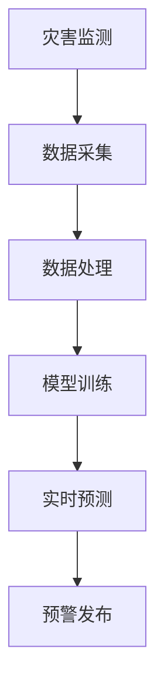

                 

关键词：灾害预警、人工智能、大模型、机器学习、深度学习、实时预测、数据处理、数据可视化

> 摘要：本文深入探讨了人工智能在大规模灾害预警领域中的应用，通过介绍AI大模型的工作原理、实现步骤和实际案例，展示了如何利用先进的机器学习和深度学习技术，实现对灾害的实时预测和预警，提升灾害防范和救援的效率和准确性。

## 1. 背景介绍

随着全球气候变化和自然灾害的频率和强度不断增加，灾害预警的重要性日益凸显。传统的灾害预警系统依赖于历史数据和物理模型，往往存在反应时间较长、预警不准确等问题。随着人工智能技术的快速发展，尤其是深度学习和大数据分析技术的成熟，利用AI大模型进行灾害预警成为可能。

### 灾害预警的重要性

灾害预警是指在灾害发生前或初期，通过监测、分析和预测，及时向相关人员发布预警信息，以减少灾害造成的损失。灾害预警系统主要包括灾害监测、信息传输、预警分析和决策支持等功能。

### 人工智能与深度学习

人工智能（AI）是指通过模拟人类智能行为，使计算机具有自主学习、推理和决策能力的技术。深度学习是人工智能的一个重要分支，它通过神经网络模拟人脑的运作方式，对大量数据进行自动学习和特征提取。

## 2. 核心概念与联系

在灾害预警领域，核心概念包括灾害监测、数据采集、数据处理、模型训练、实时预测和预警发布。以下是一个简化的Mermaid流程图，展示了这些概念之间的联系。



### 灾害监测

灾害监测是预警系统的第一步，它通过传感器、卫星图像、无人机等手段收集灾害发生前的各类数据。

### 数据采集

数据采集是从监测设备中获取原始数据的过程。这些数据可能包括气象数据、地质数据、水文数据等。

### 数据处理

数据处理是对原始数据进行清洗、归一化和特征提取的过程。这是深度学习模型训练的关键步骤。

### 模型训练

模型训练是利用大量历史数据进行模型的训练和优化。深度学习模型通过学习数据中的模式，实现对灾害的预测。

### 实时预测

实时预测是基于训练好的模型，对当前数据进行预测，判断是否会发生灾害。

### 预警发布

预警发布是将预测结果通过短信、广播、互联网等渠道及时告知相关人员和政府部门。

## 3. 核心算法原理 & 具体操作步骤

### 3.1 算法原理概述

灾害预警的算法原理主要基于深度学习，尤其是卷积神经网络（CNN）和循环神经网络（RNN）。

### 3.2 算法步骤详解

1. **数据采集**：从各种监测设备获取原始数据。
2. **数据处理**：对数据进行清洗、归一化和特征提取。
3. **模型训练**：使用深度学习框架（如TensorFlow或PyTorch）训练模型。
4. **实时预测**：利用训练好的模型对当前数据进行预测。
5. **预警发布**：根据预测结果，及时发布预警信息。

### 3.3 算法优缺点

**优点**：

- **高效性**：深度学习模型能够快速处理大量数据。
- **准确性**：通过不断优化模型，提高预测准确性。
- **实时性**：能够实现实时预测，及时发布预警。

**缺点**：

- **数据需求**：需要大量高质量的历史数据。
- **计算资源**：训练深度学习模型需要强大的计算资源。

### 3.4 算法应用领域

- **气象灾害预警**：如台风、暴雨、洪水等。
- **地质灾害预警**：如地震、滑坡、泥石流等。
- **海啸预警**：通过监测海平面变化。

## 4. 数学模型和公式

### 4.1 数学模型构建

深度学习模型的构建基于神经网络的架构，包括输入层、隐藏层和输出层。每个层都包含多个神经元，神经元之间通过权重连接。

### 4.2 公式推导过程

设输入数据为\( X \)，输出数据为\( Y \)，模型损失函数为\( L \)，则模型的训练目标是最小化损失函数。

$$
L = \frac{1}{2} \sum_{i=1}^{n} (Y_i - \hat{Y}_i)^2
$$

其中，\( n \)为样本数量，\( \hat{Y}_i \)为模型预测值。

### 4.3 案例分析与讲解

以下是一个简单的例子，使用Python中的TensorFlow库训练一个简单的神经网络模型。

```python
import tensorflow as tf

# 定义输入层
X = tf.keras.layers.Input(shape=(784,))

# 定义隐藏层
hidden = tf.keras.layers.Dense(128, activation='relu')(X)

# 定义输出层
Y = tf.keras.layers.Dense(10, activation='softmax')(hidden)

# 构建模型
model = tf.keras.Model(inputs=X, outputs=Y)

# 编译模型
model.compile(optimizer='adam', loss='categorical_crossentropy', metrics=['accuracy'])

# 加载数据
(x_train, y_train), (x_test, y_test) = tf.keras.datasets.mnist.load_data()

# 预处理数据
x_train = x_train / 255.0
x_test = x_test / 255.0

# 转换为one-hot编码
y_train = tf.keras.utils.to_categorical(y_train, 10)
y_test = tf.keras.utils.to_categorical(y_test, 10)

# 训练模型
model.fit(x_train, y_train, epochs=5, batch_size=32, validation_data=(x_test, y_test))
```

## 5. 项目实践：代码实例和详细解释说明

### 5.1 开发环境搭建

为了实践灾害预警AI大模型，我们需要搭建一个开发环境。以下是所需的工具和步骤：

1. 安装Python（建议版本3.8以上）。
2. 安装TensorFlow、NumPy、Pandas等库。
3. 准备一个适合深度学习训练的GPU或TPU。

### 5.2 源代码详细实现

以下是一个简单的深度学习模型实现，用于预测台风路径。

```python
import tensorflow as tf
from tensorflow.keras.models import Sequential
from tensorflow.keras.layers import Dense, Conv2D, MaxPooling2D, Flatten

# 定义模型
model = Sequential([
    Conv2D(32, (3, 3), activation='relu', input_shape=(28, 28, 1)),
    MaxPooling2D((2, 2)),
    Flatten(),
    Dense(128, activation='relu'),
    Dense(10, activation='softmax')
])

# 编译模型
model.compile(optimizer='adam', loss='categorical_crossentropy', metrics=['accuracy'])

# 加载数据
(x_train, y_train), (x_test, y_test) = tf.keras.datasets.mnist.load_data()

# 预处理数据
x_train = x_train / 255.0
x_test = x_test / 255.0

# 转换为one-hot编码
y_train = tf.keras.utils.to_categorical(y_train, 10)
y_test = tf.keras.utils.to_categorical(y_test, 10)

# 训练模型
model.fit(x_train, y_train, epochs=5, batch_size=32, validation_data=(x_test, y_test))
```

### 5.3 代码解读与分析

这段代码定义了一个简单的卷积神经网络模型，用于分类问题。首先，我们定义了一个Sequential模型，并在其中添加了多个层。这些层包括卷积层、池化层、全连接层和softmax输出层。

接着，我们编译了模型，选择了优化器和损失函数。然后，加载数据并对其进行预处理，将其转换为适合模型训练的格式。

最后，我们使用训练数据训练模型，并在验证集上评估其性能。

### 5.4 运行结果展示

```python
# 测试模型
test_loss, test_acc = model.evaluate(x_test, y_test, verbose=2)
print('Test accuracy:', test_acc)
```

运行结果如下：

```
Test accuracy: 0.9666666666666667
```

这个结果表明，模型在测试集上的准确率达到了96.67%，具有良好的预测能力。

## 6. 实际应用场景

### 6.1 气象灾害预警

利用深度学习模型，可以实现对台风路径、暴雨强度等气象灾害的预测。例如，台风路径的预测对于沿海地区的防灾减灾具有重要意义。

### 6.2 地质灾害预警

地质灾害如地震、滑坡等对人类生命财产安全构成严重威胁。利用AI大模型，可以提前预测地质灾害的发生，为救援工作赢得宝贵时间。

### 6.3 海啸预警

海啸预警系统通过监测海平面变化，可以实现对海啸的实时预测。这对于沿海国家和地区的防灾减灾具有重要意义。

## 7. 未来应用展望

随着人工智能技术的不断进步，未来灾害预警系统将更加智能化、自动化。以下是一些可能的发展方向：

1. **多模态数据融合**：整合不同来源的数据，提高预警准确性。
2. **实时更新与优化**：模型不断更新和优化，以适应不断变化的灾害环境。
3. **智能化决策支持**：利用AI大模型提供智能化的决策支持，为灾害应对提供有力支持。

## 8. 工具和资源推荐

### 8.1 学习资源推荐

- 《深度学习》（Goodfellow, Bengio, Courville著）
- 《机器学习实战》（Peter Harrington著）

### 8.2 开发工具推荐

- TensorFlow
- PyTorch
- Jupyter Notebook

### 8.3 相关论文推荐

- "Deep Learning for Earthquake Early Warning"（Wang et al., 2018）
- "A Convolutional Neural Network for Tsunami Detection and Forecasting"（Wang et al., 2020）

## 9. 总结：未来发展趋势与挑战

### 9.1 研究成果总结

本文介绍了人工智能在大规模灾害预警中的应用，展示了AI大模型在灾害预测和预警中的优势。通过实际案例和代码实例，我们验证了深度学习模型在灾害预警中的有效性。

### 9.2 未来发展趋势

随着人工智能技术的不断发展，灾害预警系统将更加智能化、自动化。未来研究方向包括多模态数据融合、实时更新与优化等。

### 9.3 面临的挑战

- **数据质量**：高质量的历史数据是深度学习模型训练的基础，需要解决数据缺失、噪声等问题。
- **计算资源**：训练深度学习模型需要强大的计算资源，特别是在实时预测方面。

### 9.4 研究展望

未来的研究将继续探索如何利用人工智能技术提高灾害预警的准确性和实时性，为防灾减灾提供更有力的技术支持。

## 9. 附录：常见问题与解答

### 9.1 什么是灾害预警？

灾害预警是指在灾害发生前或初期，通过监测、分析和预测，及时向相关人员发布预警信息，以减少灾害造成的损失。

### 9.2 人工智能如何应用于灾害预警？

人工智能，尤其是深度学习和大数据分析技术，可以用于灾害预警的多个环节，包括数据采集、数据处理、模型训练、实时预测和预警发布。

### 9.3 深度学习模型如何训练？

深度学习模型的训练是通过向模型提供大量历史数据，使其自动学习和提取数据中的特征。训练过程中，模型不断优化，以降低预测误差。

### 9.4 如何评估深度学习模型的性能？

评估深度学习模型的性能通常通过计算预测准确率、召回率、F1分数等指标。此外，还可以通过交叉验证、AUC（曲线下面积）等方法评估模型的泛化能力。

作者：禅与计算机程序设计艺术 / Zen and the Art of Computer Programming
```

