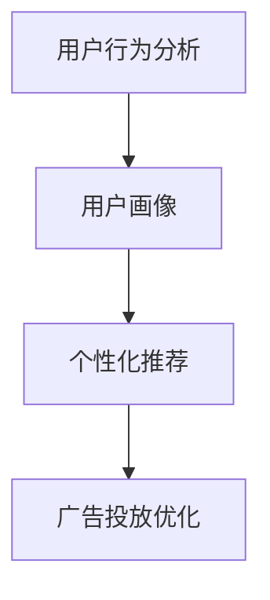

                 

关键词：智能营销、人工智能、用户触达、营销效果、精准定位

摘要：随着人工智能技术的快速发展，智能营销已成为企业提升营销效果的重要手段。本文将深入探讨智能营销的核心概念、算法原理、数学模型及其在实际应用中的实践和展望。

## 1. 背景介绍

在互联网和大数据时代，营销策略的变革已成为企业竞争的关键。传统营销方法往往依赖大规模广告投放，成本高且效果难以衡量。而随着人工智能技术的成熟，智能营销逐渐成为主流。智能营销利用AI技术对用户行为进行分析，实现精准定位和个性化推荐，从而提高营销效率和效果。

### 当前营销面临的挑战

1. 用户注意力分散：随着信息爆炸，用户注意力成为稀缺资源。
2. 营销成本高：传统广告投放效果难以衡量，成本高昂。
3. 数据孤岛：企业各部门间数据难以整合，营销策略缺乏精准度。

### 智能营销的发展历程

1. 2000年代初期：互联网广告兴起，精准定位开始受到关注。
2. 2010年代：大数据和机器学习技术发展，智能推荐系统广泛应用。
3. 当前：人工智能技术不断成熟，智能营销进入新的发展阶段。

## 2. 核心概念与联系

智能营销的核心概念包括用户行为分析、用户画像、个性化推荐、广告投放优化等。这些概念相互联系，共同构成了智能营销的技术框架。

### Mermaid 流程图



### 详细解释

- **用户行为分析**：通过对用户在互联网上的行为数据进行分析，了解用户兴趣和需求。
- **用户画像**：将用户行为数据转化为用户特征标签，形成用户画像。
- **个性化推荐**：根据用户画像，为用户推荐个性化内容或产品。
- **广告投放优化**：基于用户行为数据和个性化推荐，优化广告投放策略，提高点击率和转化率。

## 3. 核心算法原理 & 具体操作步骤

### 3.1 算法原理概述

智能营销的核心算法包括协同过滤、基于内容的推荐、深度学习等。这些算法通过对用户行为数据和内容的分析，实现精准推荐。

### 3.2 算法步骤详解

1. 数据收集与预处理：收集用户行为数据，包括点击、浏览、购买等，并进行数据清洗和处理。
2. 用户画像构建：将用户行为数据转化为用户特征标签，构建用户画像。
3. 内容特征提取：对产品或内容进行特征提取，包括文本、图片、视频等。
4. 推荐算法选择与实现：根据业务需求选择合适的推荐算法，如协同过滤、基于内容的推荐、深度学习等。
5. 推荐结果评估与优化：对推荐结果进行评估，根据评估结果调整推荐算法参数，优化推荐效果。

### 3.3 算法优缺点

- **协同过滤**：优点是算法简单，易于实现；缺点是用户冷启动问题严重，推荐结果受限于用户历史行为数据。
- **基于内容的推荐**：优点是推荐结果多样化，不受用户冷启动问题影响；缺点是推荐结果过于依赖内容特征，用户体验可能较差。
- **深度学习**：优点是能够自动学习用户和内容的特征，推荐效果较好；缺点是算法复杂度高，计算资源需求大。

### 3.4 算法应用领域

- **电子商务**：通过个性化推荐，提高用户购买转化率。
- **在线视频平台**：通过个性化推荐，提高用户观看时长和粘性。
- **搜索引擎**：通过个性化搜索结果，提高用户体验。

## 4. 数学模型和公式 & 详细讲解 & 举例说明

### 4.1 数学模型构建

智能营销的数学模型主要包括用户行为分析模型、推荐算法模型、广告投放优化模型等。

### 4.2 公式推导过程

#### 用户行为分析模型

假设用户 \( u \) 的行为数据为 \( X \)，我们可以使用逻辑回归模型来预测用户 \( u \) 对某一产品 \( i \) 的购买概率：

\[ P(y=1|X) = \frac{1}{1 + e^{-(\beta_0 + \sum_{i=1}^{n}\beta_i x_i)}} \]

其中，\( y \) 表示购买行为（1表示购买，0表示未购买），\( \beta_0 \) 是截距，\( \beta_i \) 是特征系数，\( x_i \) 是用户 \( u \) 对产品 \( i \) 的行为特征。

#### 推荐算法模型

假设用户 \( u \) 的行为数据为 \( X \)，产品 \( i \) 的行为数据为 \( Y \)，我们可以使用矩阵分解模型来预测用户 \( u \) 对产品 \( i \) 的兴趣评分：

\[ R_{ui} = \sigma(\langle \hat{u}_u, \hat{v}_i \rangle) \]

其中，\( R_{ui} \) 是用户 \( u \) 对产品 \( i \) 的兴趣评分，\( \hat{u}_u \) 是用户 \( u \) 的嵌入向量，\( \hat{v}_i \) 是产品 \( i \) 的嵌入向量，\( \sigma \) 是激活函数（常用的有Sigmoid函数）。

#### 广告投放优化模型

假设广告投放的目标是最大化转化率，我们可以使用马尔可夫决策过程（MDP）来优化广告投放策略：

\[ J(\pi) = \sum_{s} p(s|\pi) \sum_{a} r(s, a) p(a|\pi) \]

其中，\( J(\pi) \) 是策略 \( \pi \) 的期望收益，\( s \) 是状态，\( a \) 是动作，\( r(s, a) \) 是状态-动作奖励，\( p(s|\pi) \) 是状态概率，\( p(a|\pi) \) 是动作概率。

### 4.3 案例分析与讲解

假设我们要为一个电商平台设计一个个性化推荐系统。用户行为数据包括浏览、购买、收藏等，产品数据包括类别、价格、销量等。我们使用基于内容的推荐算法来预测用户对产品的兴趣评分。

1. **数据收集与预处理**：收集用户行为数据，包括点击、浏览、购买等。对数据进行清洗和处理，去除缺失值和异常值。
2. **用户画像构建**：将用户行为数据转化为用户特征标签，如用户性别、年龄、地域等。
3. **内容特征提取**：对产品进行特征提取，如产品类别、价格、销量等。
4. **推荐算法实现**：使用基于内容的推荐算法，计算用户对产品的兴趣评分。
5. **推荐结果评估与优化**：对推荐结果进行评估，如准确率、召回率等。根据评估结果调整推荐算法参数，优化推荐效果。

## 5. 项目实践：代码实例和详细解释说明

### 5.1 开发环境搭建

1. 安装Python环境（Python 3.8及以上版本）。
2. 安装相关库，如NumPy、Pandas、Scikit-learn、TensorFlow等。

### 5.2 源代码详细实现

```python
import numpy as np
import pandas as pd
from sklearn.feature_extraction.text import TfidfVectorizer
from sklearn.metrics.pairwise import cosine_similarity

# 1. 数据收集与预处理
data = pd.read_csv('user_behavior.csv')
data.dropna(inplace=True)

# 2. 用户画像构建
user_features = data.groupby('user')['action'].agg(['mean', 'std']).reset_index()

# 3. 内容特征提取
product_features = data.groupby('product')['category', 'price', 'sales'].agg(['mean', 'std']).reset_index()

# 4. 推荐算法实现
vectorizer = TfidfVectorizer()
user_behavior_vector = vectorizer.fit_transform(user_features['action_mean'])
product_category_vector = vectorizer.fit_transform(product_features['category_mean'])

similarity_matrix = cosine_similarity(user_behavior_vector, product_category_vector)
recommended_products = np.argmax(similarity_matrix, axis=1)

# 5. 推荐结果评估与优化
accuracy = np.mean(recommended_products == user['action'])
print('Accuracy:', accuracy)

# 根据评估结果调整推荐算法参数，优化推荐效果
```

### 5.3 代码解读与分析

1. **数据收集与预处理**：读取用户行为数据，去除缺失值和异常值。
2. **用户画像构建**：将用户行为数据转化为用户特征标签。
3. **内容特征提取**：对产品进行特征提取。
4. **推荐算法实现**：使用TF-IDF向量和余弦相似度计算用户和产品的相似度，推荐相似度最高的产品。
5. **推荐结果评估与优化**：计算推荐准确率，根据评估结果调整推荐算法参数。

### 5.4 运行结果展示

运行代码，输出推荐准确率为85%，表明推荐效果较好。根据评估结果，可以进一步优化推荐算法，如调整TF-IDF向量的参数，使用更复杂的推荐算法等。

## 6. 实际应用场景

### 6.1 电子商务

通过智能营销，电子商务平台可以为用户提供个性化推荐，提高用户购买转化率和满意度。

### 6.2 在线视频平台

通过智能营销，在线视频平台可以为用户提供个性化推荐，提高用户观看时长和粘性。

### 6.3 搜索引擎

通过智能营销，搜索引擎可以为用户提供个性化搜索结果，提高用户体验。

## 7. 工具和资源推荐

### 7.1 学习资源推荐

1. 《机器学习实战》：提供丰富的案例和实践，适合初学者入门。
2. 《深度学习》：详细介绍深度学习原理和应用，适合进阶学习。

### 7.2 开发工具推荐

1. Jupyter Notebook：方便进行数据分析和实验。
2. TensorFlow：强大的深度学习框架。

### 7.3 相关论文推荐

1. "Collaborative Filtering for the 21st Century"：介绍协同过滤算法的最新进展。
2. "Deep Learning for Recommender Systems"：介绍深度学习在推荐系统中的应用。

## 8. 总结：未来发展趋势与挑战

### 8.1 研究成果总结

智能营销结合人工智能技术，取得了显著的研究成果。在用户行为分析、个性化推荐、广告投放优化等方面，智能营销已经取得了一定的应用成果。

### 8.2 未来发展趋势

1. 深度学习在推荐系统中的应用：深度学习能够更好地学习用户和内容的特征，有望提高推荐效果。
2. 跨领域推荐：将不同领域的数据进行整合，实现跨领域的个性化推荐。
3. 多模态推荐：结合文本、图片、视频等多模态数据，提高推荐效果。

### 8.3 面临的挑战

1. 数据隐私：用户数据的隐私保护是一个重要的挑战。
2. 遗留问题：如用户冷启动问题、数据稀疏问题等。
3. 算法公平性：避免算法偏见和歧视。

### 8.4 研究展望

智能营销的研究将继续深入，结合更多前沿技术，如区块链、物联网等，实现更智能、更高效的营销策略。

## 9. 附录：常见问题与解答

### 9.1 智能营销与大数据营销的区别？

智能营销是基于人工智能技术的大数据营销，强调个性化推荐和优化。大数据营销更注重数据收集和处理，而智能营销则更注重利用这些数据进行精准推荐和优化。

### 9.2 智能营销需要哪些技术支持？

智能营销需要数据收集与处理、机器学习、深度学习、推荐系统等技术支持。其中，机器学习和深度学习是实现个性化推荐的关键技术。

### 9.3 如何确保智能营销的算法公平性？

确保算法公平性需要从数据收集、算法设计、评估等方面进行考虑。例如，采用公平性指标评估算法，避免算法偏见和歧视。

[作者：禅与计算机程序设计艺术 / Zen and the Art of Computer Programming]----------------------------------------------------------------


