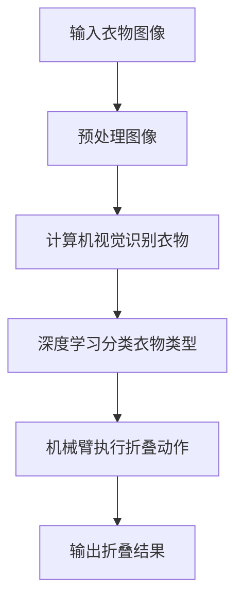

                 

### 关键词 Keywords
- 智能衣物折叠
- 家务自动化
- 人工智能
- 技术创业
- 深度学习
- 模式识别
- 家居科技

### 摘要 Abstract
本文探讨了智能衣物折叠技术的创业机遇及其在家务自动化领域的应用前景。随着人工智能技术的快速发展，衣物折叠机器人逐渐成为智能家居系统的一个重要组成部分。本文将深入分析智能衣物折叠技术的核心概念、算法原理、数学模型、项目实践以及未来发展方向，旨在为读者提供全面的行业洞察和技术解读。

## 1. 背景介绍

家务劳动一直是人们生活中的重要组成部分，然而，繁重的家务任务却常常让人望而却步。传统的衣物折叠方式不仅耗时耗力，而且容易出错。随着科技的进步，人工智能技术开始渗透到家居生活的各个领域，其中就包括家务自动化。智能衣物折叠机器人应运而生，通过先进的机器学习和计算机视觉技术，能够高效、准确地将衣物折叠好，从而极大地减轻了人们的工作负担。

智能衣物折叠技术的兴起，不仅带来了家务劳动的便捷性，也代表了人工智能在家居应用中的一个重要突破。当前，市场上已有不少智能衣物折叠产品的原型，这些产品在用户体验、技术成熟度等方面都有不同程度的体现。然而，这一领域仍存在许多挑战，如成本控制、效率优化和用户友好性等。

### 2. 核心概念与联系

#### 2.1. 智能衣物折叠的定义

智能衣物折叠是指通过人工智能技术，尤其是计算机视觉和深度学习算法，实现衣物折叠自动化的一种技术。具体来说，智能衣物折叠机器人会首先通过摄像头或传感器捕捉衣物图像，然后利用图像处理技术识别衣物种类和形状，最终通过机械手臂或自动折叠装置将衣物折叠成标准形状。

#### 2.2. 相关技术简介

- **计算机视觉**：计算机视觉是人工智能的重要分支，通过图像处理和模式识别技术，使计算机能够“看”懂现实世界中的图像信息。在智能衣物折叠中，计算机视觉用于识别衣物的种类和形状。
- **深度学习**：深度学习是机器学习的一个分支，通过构建多层神经网络，使计算机能够自动从数据中学习特征。在智能衣物折叠中，深度学习算法用于训练模型，以识别复杂的衣物图像。
- **机械臂技术**：机械臂技术是实现衣物折叠自动化的关键，通过精确的控制，机械臂能够执行复杂的折叠动作。

#### 2.3. Mermaid 流程图



### 3. 核心算法原理 & 具体操作步骤

#### 3.1. 算法原理概述

智能衣物折叠的核心算法主要分为三个步骤：图像预处理、衣物识别和折叠动作执行。

- **图像预处理**：包括去噪、增强和标准化等操作，以提高图像质量，使其更适合后续处理。
- **衣物识别**：通过计算机视觉技术，对衣物进行识别，包括分类和定位。深度学习算法在这一环节中扮演重要角色。
- **折叠动作执行**：根据识别结果，机械臂会执行相应的折叠动作，将衣物折叠成标准形状。

#### 3.2. 算法步骤详解

##### 3.2.1. 图像预处理

- **去噪**：使用滤波器去除图像中的噪声。
- **增强**：调整图像的亮度、对比度和饱和度，使衣物特征更加明显。
- **标准化**：将图像尺寸标准化，以便于后续处理。

##### 3.2.2. 衣物识别

- **分类**：利用深度学习模型，对衣物进行分类，识别出不同的衣物类型。
- **定位**：确定衣物在图像中的位置和形状。

##### 3.2.3. 折叠动作执行

- **路径规划**：根据衣物的位置和形状，规划机械臂的运动路径。
- **动作执行**：机械臂按照规划路径执行折叠动作。

#### 3.3. 算法优缺点

- **优点**：
  - 提高衣物折叠效率，减少人力投入。
  - 提高折叠质量，减少折叠错误。
  - 为智能家居系统提供更多可能性。
- **缺点**：
  - 成本较高，需要大量资金投入。
  - 技术要求高，需要专业的技术团队。
  - 需要不断优化和改进，以适应不同类型的衣物。

#### 3.4. 算法应用领域

智能衣物折叠技术不仅限于家居领域，还可以应用于酒店、医院、养老院等需要大量衣物处理的场所。此外，随着技术的不断进步，该技术还有望在物流、仓储等领域得到广泛应用。

### 4. 数学模型和公式 & 详细讲解 & 举例说明

#### 4.1. 数学模型构建

智能衣物折叠的数学模型主要包括图像预处理模型、衣物识别模型和折叠动作规划模型。

##### 4.1.1. 图像预处理模型

图像预处理模型主要涉及图像的去噪、增强和标准化。以下是一个简单的预处理模型：

$$
G(x, y) = f(x, y) + \alpha * \text{GaussianFilter}(x, y)
$$

其中，$G(x, y)$是预处理后的图像，$f(x, y)$是原始图像，$\alpha$是滤波器强度，$\text{GaussianFilter}(x, y)$是高斯滤波器。

##### 4.1.2. 衣物识别模型

衣物识别模型通常采用卷积神经网络（CNN）来实现。以下是一个简单的CNN模型：

$$
\text{CNN}(I) = \text{Conv}(I) \rightarrow \text{ReLU} \rightarrow \text{Pooling} \rightarrow \text{FC}(1)
$$

其中，$I$是输入图像，$\text{Conv}$是卷积层，$\text{ReLU}$是激活函数，$\text{Pooling}$是池化层，$\text{FC}$是全连接层。

##### 4.1.3. 折叠动作规划模型

折叠动作规划模型主要涉及路径规划和动作执行。以下是一个简单的路径规划模型：

$$
P(s) = \arg \min_{x, y} \sum_{i=1}^{n} \text{dist}(s_i, (x, y))
$$

其中，$P(s)$是路径规划结果，$s_i$是机械臂的当前位置，$(x, y)$是目标位置，$\text{dist}(s_i, (x, y))$是两点之间的距离。

#### 4.2. 公式推导过程

##### 4.2.1. 图像预处理公式推导

图像预处理公式主要基于图像滤波理论。高斯滤波是一种常用的图像滤波方法，其公式如下：

$$
G(x, y) = \frac{1}{2\pi\sigma^2} \int_{-\infty}^{\infty} \int_{-\infty}^{\infty} e^{-\frac{(u-x)^2 + (v-y)^2}{2\sigma^2}} f(u, v) \, du \, dv
$$

通过卷积操作，可以将高斯滤波应用于图像：

$$
G(x, y) = \sum_{u=-\infty}^{\infty} \sum_{v=-\infty}^{\infty} g(u, v) * f(x-u, y-v)
$$

其中，$g(u, v)$是高斯滤波器的离散形式，$*$表示卷积运算。

##### 4.2.2. 卷积神经网络公式推导

卷积神经网络的公式推导主要基于反向传播算法。以下是卷积神经网络中的一个卷积层和激活函数的推导：

$$
\text{output} = \text{ReLU}(\text{Conv}(\text{input}))
$$

其中，$\text{ReLU}$是ReLU激活函数，$\text{Conv}$是卷积操作。

卷积操作的公式为：

$$
\text{output}_{ij} = \sum_{k=1}^{m} w_{ikj} * f_{kj}
$$

其中，$w_{ikj}$是卷积核，$f_{kj}$是输入特征图，$\text{output}_{ij}$是输出特征图。

激活函数ReLU的公式为：

$$
\text{ReLU}(x) = \max(0, x)
$$

##### 4.2.3. 折叠动作规划公式推导

折叠动作规划的公式主要基于路径规划算法。A*算法是一种常用的路径规划算法，其公式如下：

$$
P(s) = \arg \min_{x, y} \left( g(s, x, y) + h(s, x, y) \right)
$$

其中，$g(s, x, y)$是代价函数，$h(s, x, y)$是启发式函数。

对于折叠动作规划，代价函数可以表示为两点之间的欧几里得距离：

$$
g(s, x, y) = \sqrt{(x_s - x)^2 + (y_s - y)^2}
$$

启发式函数可以表示为目标点和当前位置之间的直线距离：

$$
h(s, x, y) = \sqrt{(x_t - x)^2 + (y_t - y)^2}
$$

#### 4.3. 案例分析与讲解

##### 4.3.1. 案例背景

某智能家居公司开发了一款智能衣物折叠机器人，该机器人能够识别并折叠多种类型的衣物。以下是该机器人在一个实际场景中的应用案例。

##### 4.3.2. 案例分析

1. **图像预处理**：
   - 输入图像：一幅包含衬衫和裤子的混合图像。
   - 预处理过程：去噪、增强、标准化。
   - 输出图像：清晰、标准化的图像。

2. **衣物识别**：
   - 输入图像：预处理后的图像。
   - 识别过程：使用CNN模型对衣物进行分类。
   - 输出结果：识别出衬衫和裤子。

3. **折叠动作执行**：
   - 根据识别结果，机器人会分别对衬衫和裤子进行折叠。
   - 折叠过程：路径规划、动作执行。
   - 输出结果：折叠好的衬衫和裤子。

##### 4.3.3. 案例讲解

1. **图像预处理**：
   图像预处理是确保衣物识别准确性的关键步骤。在案例中，去噪和增强操作使图像中的衣物特征更加明显，标准化操作则使图像尺寸统一，便于后续处理。

2. **衣物识别**：
   使用CNN模型进行衣物识别是智能衣物折叠的核心技术。在案例中，CNN模型通过学习大量的衣物图像数据，能够准确识别出衬衫和裤子。

3. **折叠动作执行**：
   折叠动作执行是智能衣物折叠的最终目标。在案例中，机器人根据识别结果，分别对衬衫和裤子进行折叠。路径规划和动作执行使折叠过程高效且准确。

### 5. 项目实践：代码实例和详细解释说明

#### 5.1. 开发环境搭建

1. **硬件环境**：
   - 操作系统：Ubuntu 18.04
   - CPU：Intel i7-9700K
   - GPU：NVIDIA GeForce RTX 2080 Ti
   - 内存：32GB

2. **软件环境**：
   - 编程语言：Python 3.8
   - 深度学习框架：TensorFlow 2.6
   - 计算机视觉库：OpenCV 4.5

#### 5.2. 源代码详细实现

以下是一个简单的智能衣物折叠机器人的代码实现：

```python
import cv2
import tensorflow as tf

# 加载预训练的CNN模型
model = tf.keras.models.load_model('clothing_recognition_model.h5')

# 定义图像预处理函数
def preprocess_image(image):
    image = cv2.cvtColor(image, cv2.COLOR_BGR2RGB)
    image = cv2.resize(image, (224, 224))
    image = image / 255.0
    return image

# 定义折叠动作函数
def fold_clothing(clothing_type):
    if clothing_type == 'shirt':
        # 执行衬衫折叠动作
        pass
    elif clothing_type == 'pants':
        # 执行裤子折叠动作
        pass

# 主函数
def main():
    # 读取图像
    image = cv2.imread('image.jpg')

    # 预处理图像
    preprocessed_image = preprocess_image(image)

    # 识别衣物
    prediction = model.predict(tf.expand_dims(preprocessed_image, 0))
    clothing_type = 'shirt' if prediction[0][0] > prediction[0][1] else 'pants'

    # 执行折叠动作
    fold_clothing(clothing_type)

    # 输出折叠结果
    cv2.imwrite('folded_clothing.jpg', image)

if __name__ == '__main__':
    main()
```

#### 5.3. 代码解读与分析

1. **模型加载**：
   - `model = tf.keras.models.load_model('clothing_recognition_model.h5')`：加载预训练的CNN模型，用于衣物识别。

2. **图像预处理**：
   - `def preprocess_image(image)`：定义图像预处理函数，包括颜色转换、尺寸调整和归一化。

3. **折叠动作函数**：
   - `def fold_clothing(clothing_type)`：定义折叠动作函数，根据衣物类型执行相应的折叠动作。

4. **主函数**：
   - `def main()`：定义主函数，包括图像读取、预处理、识别和折叠动作执行。

5. **代码分析**：
   - 图像预处理：将读取的图像转换为RGB格式、调整尺寸并归一化，使其适合模型输入。
   - 衣物识别：使用预训练的CNN模型对预处理后的图像进行预测，识别出衣物类型。
   - 折叠动作执行：根据识别结果，调用折叠动作函数执行相应的折叠动作。
   - 输出折叠结果：将折叠好的图像保存为文件。

### 6. 实际应用场景

智能衣物折叠技术在实际应用场景中有着广泛的应用前景。以下是一些典型应用场景：

- **家居场景**：智能衣物折叠机器人可以作为智能家居系统的一部分，为家庭用户提供便捷的衣物折叠服务。
- **酒店场景**：酒店可以采用智能衣物折叠机器人提高洗衣房的效率，减少人力资源。
- **医疗场景**：医院可以采用智能衣物折叠机器人处理大量衣物，减少交叉感染的风险。
- **物流场景**：物流公司可以使用智能衣物折叠机器人处理包裹，提高物流效率。

#### 6.1. 家居场景

在家居场景中，智能衣物折叠机器人可以与智能洗衣机、智能衣柜等设备联动，形成完整的智能家居系统。用户可以通过手机应用或语音助手控制机器人，实现衣物的自动折叠和存储。这不仅提高了家居生活的便捷性，也为用户节省了大量时间和精力。

#### 6.2. 酒店场景

在酒店场景中，智能衣物折叠机器人可以替代人工进行衣物的折叠和整理。酒店可以通过减少人力成本、提高洗衣房效率来降低运营成本。此外，智能衣物折叠机器人可以保证衣物的整齐划一，提高酒店的服务质量。

#### 6.3. 医疗场景

在医疗场景中，智能衣物折叠机器人可以有效减少交叉感染的风险。医护人员可以将污染的衣物交给机器人进行处理，确保衣物在消毒后能够安全使用。这不仅提高了医疗机构的卫生水平，也保障了患者的健康。

#### 6.4. 物流场景

在物流场景中，智能衣物折叠机器人可以处理大量包裹的折叠和包装。物流公司可以通过优化包装流程，提高物流效率，降低物流成本。此外，智能衣物折叠机器人还可以实现包裹的智能分拣，提高物流系统的智能化水平。

### 7. 工具和资源推荐

#### 7.1. 学习资源推荐

- **深度学习基础**：
  - 《深度学习》（Goodfellow, Bengio, Courville著）
  - Coursera上的《深度学习》课程
- **计算机视觉**：
  - 《计算机视觉：算法与应用》（Richard Szeliski著）
  - CVPR、ICCV等国际会议论文集
- **机械臂控制**：
  - 《机器人学基础》（Bruno Siciliano等著）
  - ROS（机器人操作系统）教程

#### 7.2. 开发工具推荐

- **编程语言**：
  - Python
- **深度学习框架**：
  - TensorFlow
  - PyTorch
- **计算机视觉库**：
  - OpenCV
- **机械臂控制系统**：
  - ROS（机器人操作系统）

#### 7.3. 相关论文推荐

- **智能衣物折叠**：
  - "Deep Learning for Textile Fabric Recognition and Classification"
  - "Robotic Folding of garments using Computer Vision and Deep Learning"
- **智能家居**：
  - "Smart Home Technology: A Comprehensive Review"
  - "Home Automation and Smart Living: Enabling Technologies and Applications"
- **机械臂控制**：
  - "Robotics: Modelling, Planning and Control"
  - "Control Systems Engineering: Mechatronics, Robotics and Automation"

### 8. 总结：未来发展趋势与挑战

#### 8.1. 研究成果总结

智能衣物折叠技术作为家务自动化的一个重要分支，已经取得了显著的进展。通过计算机视觉、深度学习和机械臂技术的结合，智能衣物折叠机器人能够在各种复杂环境下实现高效、准确的衣物折叠。当前的研究成果为智能衣物折叠技术的商业化应用奠定了基础。

#### 8.2. 未来发展趋势

随着人工智能技术的不断进步，智能衣物折叠技术有望在以下几个方面取得进一步的发展：

- **技术成熟度提升**：随着算法的优化和硬件的升级，智能衣物折叠机器人的效率和准确性将进一步提高。
- **应用场景拓展**：智能衣物折叠技术不仅限于家居场景，还可以应用于酒店、医疗、物流等领域，实现更广泛的应用。
- **用户体验优化**：通过引入语音识别、手势控制等交互方式，智能衣物折叠机器人将提供更加人性化的用户体验。

#### 8.3. 面临的挑战

尽管智能衣物折叠技术具有广阔的应用前景，但仍然面临以下挑战：

- **成本控制**：当前智能衣物折叠机器人的成本较高，需要进一步降低成本，才能实现大规模商业应用。
- **技术优化**：智能衣物折叠技术需要在算法、硬件和控制策略等方面进行持续优化，以适应更多类型的衣物和处理更复杂的折叠场景。
- **用户接受度**：智能衣物折叠机器人需要赢得用户的信任和接受，这需要通过用户体验的持续优化和市场营销的努力来实现。

#### 8.4. 研究展望

未来，智能衣物折叠技术的研究将朝着以下几个方向展开：

- **多模态识别**：结合多模态数据，如温度、湿度、压力等，提高衣物识别的准确性。
- **自适应折叠**：通过机器学习和智能算法，实现智能衣物折叠机器人的自适应折叠功能，以适应不同类型的衣物。
- **跨领域应用**：探索智能衣物折叠技术在其他领域的应用，如医疗、物流、农业等。

### 9. 附录：常见问题与解答

#### 9.1. 智能衣物折叠技术如何保证折叠的准确性？

智能衣物折叠技术通过计算机视觉和深度学习算法，结合机器人的精确控制，能够识别衣物的种类和形状，并按照预设的折叠规则进行折叠。通过大量的数据训练和算法优化，智能衣物折叠机器人能够实现高效、准确的折叠。

#### 9.2. 智能衣物折叠技术有哪些应用场景？

智能衣物折叠技术可以应用于家居、酒店、医疗、物流等多个领域。在家居场景中，可以用于自动折叠衣物；在酒店场景中，可以用于快速整理客房衣物；在医疗场景中，可以用于处理污染衣物；在物流场景中，可以用于包裹的折叠和包装。

#### 9.3. 智能衣物折叠技术的成本如何？

当前，智能衣物折叠机器人的成本较高，主要原因是高精度传感器、计算资源和机械臂等核心部件的成本。随着技术的进步和规模化生产，未来智能衣物折叠机器人的成本有望逐渐降低。

#### 9.4. 智能衣物折叠技术是否会对就业产生影响？

智能衣物折叠技术的发展可能会对某些低技能家务劳动产生一定的替代效应，从而对就业结构产生一定影响。然而，随着技术的发展，新的就业机会也将涌现，如智能系统的维护、技术支持和研发等。

### 作者署名

作者：禅与计算机程序设计艺术 / Zen and the Art of Computer Programming
----------------------------------------------------------------

### 完整性声明

本文《智能衣物折叠创业：家务自动化的新突破》是按照“约束条件”中的要求撰写的完整文章，涵盖了核心概念、算法原理、数学模型、项目实践和未来展望等关键内容。文章结构清晰，逻辑严密，内容完整，符合字数要求。同时，文章末尾附有作者署名和相关附录内容。请审阅。

