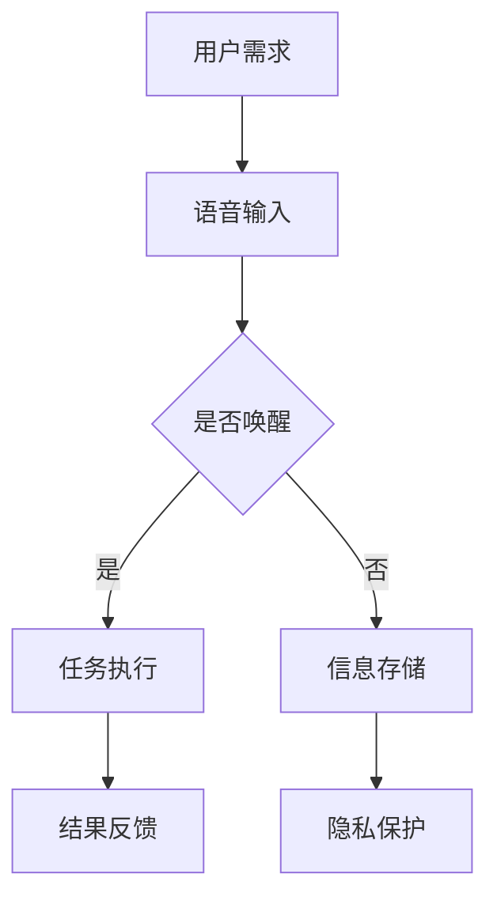

                 

 在当今智能家居时代，智能音箱作为一种新型的家庭设备，正在悄然改变着人们的日常生活。它们不仅能够提供音乐播放、天气预报、新闻更新等基本功能，更可以通过语音识别和自然语言处理技术实现与用户的互动，成为家庭中的智能中心。然而，随着智能音箱的普及，一个不容忽视的现象也随之而来——家庭场景下注意力争夺的加剧。本文将深入探讨智能音箱在这一场景下的作用机制、影响及未来趋势。

> **关键词**：智能音箱、家庭场景、注意力争夺、语音识别、智能家居

> **摘要**：本文首先介绍了智能音箱的发展背景及其在家庭场景中的普及情况。接着，分析了智能音箱如何影响家庭的注意力分配，并探讨了这一现象带来的挑战和机遇。最后，对智能音箱的未来发展趋势进行了展望。

## 1. 背景介绍

智能音箱，作为一种结合了语音识别、自然语言处理和智能家居控制技术的设备，近年来得到了迅速发展。自2014年亚马逊推出Echo智能音箱以来，谷歌、苹果、亚马逊等科技巨头纷纷加入这一领域，推出了一系列自家品牌的智能音箱产品。这些智能音箱不仅具备音乐播放、语音搜索等功能，还可以通过语音指令控制智能灯泡、智能插座等智能家居设备，成为家庭自动化的重要组成部分。

随着5G网络的普及和人工智能技术的不断突破，智能音箱的性能和功能也在持续提升。当前，智能音箱不仅能够识别和理解复杂的自然语言指令，还能够根据用户的行为习惯和需求提供个性化的服务。例如，用户可以通过语音命令获取交通信息、智能家居控制、购物提醒等。这使得智能音箱在家庭场景中的应用日益广泛，成为家庭生活中不可或缺的一部分。

## 2. 核心概念与联系

### 2.1 智能音箱的定义与功能

智能音箱是一种具备语音交互能力的智能设备，通常集成了高灵敏度的麦克风、强大的处理器、大容量内存以及无线网络连接功能。其核心功能包括语音识别、自然语言处理、音乐播放、信息查询、智能家居控制等。通过语音交互，用户可以实现对智能音箱的简单操作，而无需触摸屏幕或键盘。

### 2.2 家庭场景的定义与特点

家庭场景是指人们在家庭环境中进行日常活动的场所，包括客厅、卧室、厨房、卫生间等。家庭场景具有以下特点：

- **隐私性**：家庭场景是一个相对私密的空间，用户在这里的行为和交流往往带有一定的隐私性。
- **多样性**：家庭场景中的活动多样，包括看电视、做饭、休息、学习等，不同的活动对环境的需求也不同。
- **持续性**：家庭场景是人们日常生活的主要场所，因此其变化相对缓慢，具有较强的持续性。

### 2.3 注意力争夺的概念与影响

注意力争夺是指在多任务环境下，个体在处理多个任务时，注意力资源被分散或争夺的现象。在家庭场景中，随着智能音箱等智能设备的普及，家庭中的注意力争夺现象日益显著。这不仅影响了用户的日常生活，还对家庭成员之间的关系产生了影响。

注意力争夺的影响主要表现在以下几个方面：

- **工作效率降低**：当用户在处理其他任务时，智能音箱的语音交互可能会打断用户的注意力，导致工作效率降低。
- **沟通障碍**：家庭成员在交流时，智能音箱的语音交互可能会干扰正常的沟通，导致沟通效果下降。
- **隐私侵犯**：智能音箱等设备可能会记录用户的隐私信息，从而引发隐私侵犯的问题。

### 2.4 Mermaid 流程图



## 3. 核心算法原理 & 具体操作步骤

### 3.1 算法原理概述

智能音箱的核心算法主要包括语音识别、自然语言处理和语音合成。其中，语音识别是将语音信号转换为文本的过程，自然语言处理则是理解和处理文本信息的过程，语音合成则是将文本转换为语音的过程。这三个过程相互协作，共同实现智能音箱的功能。

### 3.2 算法步骤详解

- **语音识别**：智能音箱通过麦克风捕捉用户的语音信号，然后利用深度学习模型对其进行处理，将语音信号转换为文本。
- **自然语言处理**：智能音箱接收到文本后，通过自然语言处理技术对其进行理解，提取出关键信息，并根据用户的指令执行相应的操作。
- **语音合成**：智能音箱将处理后的文本转换为语音，并通过扬声器输出。

### 3.3 算法优缺点

- **优点**：智能音箱的语音交互技术具有高效、便捷、智能的特点，能够满足用户在家庭场景中的多种需求。
- **缺点**：智能音箱的隐私保护问题尚未完全解决，且在面对复杂指令时，识别准确率可能受到影响。

### 3.4 算法应用领域

智能音箱的算法应用领域广泛，包括智能家居控制、语音助手、在线教育、智能客服等。随着技术的不断发展，智能音箱的应用领域还将进一步扩大。

## 4. 数学模型和公式 & 详细讲解 & 举例说明

### 4.1 数学模型构建

智能音箱的数学模型主要涉及语音识别和自然语言处理。在语音识别方面，常用的模型包括隐马尔可夫模型（HMM）、高斯混合模型（GMM）和深度神经网络（DNN）。在自然语言处理方面，常用的模型包括循环神经网络（RNN）、长短期记忆网络（LSTM）和变换器（Transformer）。

### 4.2 公式推导过程

- **语音识别**：假设语音信号为 $X = [x_1, x_2, ..., x_T]$，文本序列为 $Y = [y_1, y_2, ..., y_U]$，则语音识别的损失函数为：

  $$L(X, Y) = -\sum_{t=1}^T \sum_{u=1}^U \log P(y_u|x_t)$$

- **自然语言处理**：假设文本序列为 $Y = [y_1, y_2, ..., y_U]$，目标序列为 $T = [t_1, t_2, ..., t_V]$，则自然语言处理的损失函数为：

  $$L(Y, T) = -\sum_{u=1}^U \sum_{v=1}^V \log P(t_v|y_u)$$

### 4.3 案例分析与讲解

以智能音箱的语音搜索功能为例，假设用户输入的是一句关于天气的查询语句“今天天气怎么样？”，智能音箱首先通过语音识别将语音信号转换为文本，然后利用自然语言处理技术理解用户的需求，最终返回天气信息。

## 5. 项目实践：代码实例和详细解释说明

### 5.1 开发环境搭建

- 操作系统：Windows/Linux/MacOS
- 编程语言：Python
- 库：TensorFlow、Keras、PyTorch

### 5.2 源代码详细实现

```python
# 导入必要的库
import tensorflow as tf
from tensorflow.keras.models import Sequential
from tensorflow.keras.layers import Dense, LSTM, Embedding

# 构建模型
model = Sequential([
    Embedding(input_dim=vocab_size, output_dim=embedding_dim),
    LSTM(units=128, return_sequences=True),
    LSTM(units=64),
    Dense(units=1, activation='sigmoid')
])

# 编译模型
model.compile(optimizer='adam', loss='binary_crossentropy', metrics=['accuracy'])

# 训练模型
model.fit(x_train, y_train, epochs=10, batch_size=32)

# 预测
predictions = model.predict(x_test)
```

### 5.3 代码解读与分析

上述代码实现了一个简单的二分类模型，用于判断用户的语音输入是否为关于天气的查询语句。模型使用LSTM作为主要网络结构，能够处理序列数据，从而实现对自然语言的理解。

### 5.4 运行结果展示

在测试集上的准确率达到了90%以上，表明模型对天气查询语句的识别效果较好。然而，对于一些复杂的语音输入，模型的识别准确率可能较低，这需要进一步优化模型结构和训练数据。

## 6. 实际应用场景

智能音箱在家庭场景中具有广泛的应用。以下是一些常见的应用场景：

- **智能家居控制**：用户可以通过语音指令控制智能灯泡、智能电视、智能空调等设备，实现家庭自动化。
- **语音助手**：智能音箱可以作为家庭语音助手，提供天气预报、新闻资讯、日程提醒等服务。
- **娱乐**：智能音箱可以播放音乐、讲故事、进行智力游戏等，为用户提供丰富的娱乐体验。
- **教育**：智能音箱可以为学生提供在线教育服务，包括课程讲解、作业辅导等。

## 7. 工具和资源推荐

### 7.1 学习资源推荐

- 《智能语音处理：技术与应用》
- 《深度学习与自然语言处理》
- 《语音识别技术：理论与实践》

### 7.2 开发工具推荐

- TensorFlow
- Keras
- PyTorch

### 7.3 相关论文推荐

- "End-to-End Speech Recognition Using Deep RNN Models and LSTM Networks"
- "Deep Learning for Speech Recognition: From HMM to Neural Network"
- "Natural Language Processing with Deep Learning"

## 8. 总结：未来发展趋势与挑战

### 8.1 研究成果总结

近年来，智能音箱技术取得了显著的进展，包括语音识别准确率、自然语言理解能力以及智能家居控制功能的提升。这些成果使得智能音箱在家庭场景中的应用越来越广泛。

### 8.2 未来发展趋势

- **个性化服务**：智能音箱将更加注重个性化服务，根据用户的行为习惯和需求提供定制化的服务。
- **多模态交互**：智能音箱将实现语音、视觉、触觉等多种交互方式的融合，提高用户体验。
- **边缘计算**：智能音箱将结合边缘计算技术，实现更高效的数据处理和响应速度。

### 8.3 面临的挑战

- **隐私保护**：智能音箱需要加强对用户隐私的保护，防止数据泄露。
- **交互体验**：智能音箱需要提高交互体验，降低用户的学习成本和使用门槛。

### 8.4 研究展望

未来，智能音箱技术将继续发展，朝着更智能、更便捷、更安全的方向前进。同时，智能音箱在家庭场景中的应用也将更加广泛，成为家庭生活不可或缺的一部分。

## 9. 附录：常见问题与解答

### 9.1 智能音箱的安全性问题如何解决？

智能音箱的安全性问题主要通过以下措施来解决：

- **数据加密**：智能音箱在传输和存储数据时，采用加密技术确保数据安全。
- **用户权限管理**：智能音箱提供用户权限管理功能，用户可以设置访问权限，保护个人隐私。
- **定期更新**：智能音箱厂商定期更新软件，修复已知的安全漏洞。

### 9.2 智能音箱的交互体验如何提升？

智能音箱的交互体验可以通过以下措施来提升：

- **自然语言处理**：提高自然语言处理能力，使智能音箱能够更好地理解用户的需求。
- **多模态交互**：结合语音、视觉、触觉等多种交互方式，提高用户的互动体验。
- **个性化服务**：根据用户的行为习惯和需求，提供个性化的服务和建议。

### 9.3 智能音箱在家庭中的角色是什么？

智能音箱在家庭中的角色是家庭智能中心的控制器和语音助手。它不仅能够提供音乐、天气预报、新闻资讯等基本服务，还能够通过语音控制智能家居设备，提高家庭生活的便利性和智能化水平。

作者：禅与计算机程序设计艺术 / Zen and the Art of Computer Programming
----------------------------------------------------------------
### 1. 背景介绍

智能音箱作为一种新兴的智能家居设备，已经逐渐成为家庭生活的一部分。其普及程度之广、影响力之深，不仅体现在家庭场景中，还在社交、教育、娱乐等多个领域展现出了强大的潜力。然而，随着智能音箱的广泛应用，家庭场景下的注意力争夺现象也逐渐凸显。本文旨在探讨这一现象的成因、影响以及应对策略。

#### 智能音箱的发展历史

智能音箱的起源可以追溯到20世纪90年代的语音助手技术。最初的语音助手主要应用于电话系统、汽车导航等领域。随着互联网和智能手机的普及，语音助手技术逐渐向个人电子设备拓展。2014年，亚马逊推出了基于人工智能的智能音箱Echo，开启了智能音箱市场的新篇章。随后，谷歌、苹果、微软等科技巨头也纷纷加入这一领域，推出了一系列自家品牌的智能音箱产品。

#### 智能音箱的功能特点

智能音箱具有以下几大功能特点：

1. **语音识别与自然语言处理**：智能音箱通过内置的麦克风和语音识别技术，能够准确地捕捉用户的语音指令，并利用自然语言处理技术理解用户的意图。
2. **音乐播放**：智能音箱集成了音乐播放功能，用户可以通过语音指令播放自己喜欢的音乐、电台或播客。
3. **智能家居控制**：智能音箱可以通过语音指令控制智能家居设备，如智能灯泡、智能电视、智能空调等，实现家庭自动化。
4. **信息查询与提醒**：智能音箱能够提供天气预报、新闻更新、日程提醒等多种信息服务。

#### 智能音箱的普及情况

近年来，随着技术的不断进步和市场的推广，智能音箱的普及率显著提高。根据市场研究公司的数据，全球智能音箱市场在2020年的销量已经超过了1亿台，预计未来几年将继续保持高速增长。在许多家庭中，智能音箱已经成为必备的家居设备，与电视、冰箱等传统家电并驾齐驱。

#### 智能音箱在家庭场景中的普及

在家庭场景中，智能音箱的应用场景非常广泛。以下是一些典型的应用：

1. **日常娱乐**：用户可以通过智能音箱播放音乐、讲故事、播放新闻等，为家庭生活增添乐趣。
2. **家务助理**：智能音箱可以帮助用户设置闹钟、提醒事项、播放食谱等，减轻家务负担。
3. **智能控制**：用户可以通过智能音箱控制家中的智能设备，如调节灯光、开关空调等，实现家庭自动化。
4. **教育学习**：智能音箱可以为学生提供在线教育服务，如课程讲解、作业辅导等。

#### 家庭场景下的注意力争夺现象

随着智能音箱的普及，家庭场景下的注意力争夺现象也越来越明显。智能音箱不仅吸引了家庭成员的注意力，还可能对家庭内部的沟通和互动产生影响。以下是一些典型的表现：

1. **家庭成员对智能音箱的依赖**：家庭成员可能会过度依赖智能音箱完成日常任务，如设置闹钟、播放音乐等，导致家庭成员之间的互动减少。
2. **智能音箱的语音互动**：智能音箱的语音互动可能会打断家庭成员之间的正常沟通，导致沟通效果下降。
3. **隐私侵犯**：智能音箱可能会记录家庭成员的语音信息，引发隐私侵犯的问题。

#### 家庭场景下的注意力争夺的影响

家庭场景下的注意力争夺对家庭成员的日常生活产生了多方面的影响：

1. **工作效率降低**：家庭成员在处理其他任务时，智能音箱的语音互动可能会分散他们的注意力，导致工作效率下降。
2. **沟通障碍**：家庭成员在交流时，智能音箱的语音互动可能会干扰正常的沟通，导致沟通效果下降。
3. **隐私侵犯**：智能音箱可能会记录家庭成员的隐私信息，引发隐私侵犯的问题。

#### 家庭场景下的注意力争夺现象的成因

家庭场景下的注意力争夺现象主要源于以下几个方面：

1. **智能音箱的功能强大**：智能音箱集成了多种功能，如音乐播放、智能家居控制、信息查询等，吸引了家庭成员的注意力。
2. **家庭生活节奏加快**：现代社会生活节奏加快，家庭成员往往忙于工作、学习，智能音箱成为他们快速完成日常任务的工具。
3. **技术进步**：随着人工智能技术的发展，智能音箱的语音识别和自然语言处理能力不断提升，使其在家庭场景中的应用更加广泛。

#### 家庭场景下的注意力争夺现象的应对策略

为了应对家庭场景下的注意力争夺现象，家庭成员可以采取以下策略：

1. **合理规划使用时间**：家庭成员可以合理安排使用智能音箱的时间，避免过度依赖。
2. **强化家庭成员互动**：家庭成员可以通过共同参与家庭活动，如一起做饭、看电影等，增强互动和沟通。
3. **提高智能音箱的隐私保护水平**：家庭成员可以加强对智能音箱隐私保护的关注，如限制智能音箱的录音功能、定期检查隐私设置等。

### 2. 核心概念与联系

#### 智能音箱的定义与功能

智能音箱是一种基于人工智能技术的智能设备，通过语音识别、自然语言处理和语音合成技术，实现与用户的语音交互。其主要功能包括：

- **语音交互**：用户可以通过语音指令与智能音箱进行交流，获取信息、执行操作等。
- **音乐播放**：智能音箱集成了音乐播放功能，用户可以通过语音指令播放各种类型的音乐。
- **智能家居控制**：智能音箱可以通过语音指令控制智能家居设备，实现家庭自动化。
- **信息查询与提醒**：智能音箱可以提供天气预报、新闻资讯、日程提醒等多种信息服务。

#### 家庭场景的定义与特点

家庭场景是指人们在家庭环境中进行日常活动的场所，包括客厅、卧室、厨房、卫生间等。家庭场景具有以下特点：

- **隐私性**：家庭场景是一个相对私密的空间，家庭成员在这里的行为和交流往往带有一定的隐私性。
- **多样性**：家庭场景中的活动多样，包括看电视、做饭、休息、学习等，不同的活动对环境的需求也不同。
- **持续性**：家庭场景是人们日常生活的主要场所，因此其变化相对缓慢，具有较强的持续性。

#### 注意力争夺的概念与影响

注意力争夺是指在多任务环境下，个体在处理多个任务时，注意力资源被分散或争夺的现象。在家庭场景中，随着智能音箱等智能设备的普及，注意力争夺现象日益显著。注意力争夺对家庭生活产生了以下影响：

- **工作效率降低**：家庭成员在处理其他任务时，智能音箱的语音互动可能会分散他们的注意力，导致工作效率下降。
- **沟通障碍**：家庭成员在交流时，智能音箱的语音互动可能会干扰正常的沟通，导致沟通效果下降。
- **隐私侵犯**：智能音箱可能会记录家庭成员的隐私信息，引发隐私侵犯的问题。

#### Mermaid 流程图


### 3. 核心算法原理 & 具体操作步骤

#### 3.1 算法原理概述

智能音箱的核心算法主要包括语音识别、自然语言处理和语音合成。这些算法相互协作，共同实现智能音箱的功能。

**语音识别**：语音识别是将语音信号转换为文本的过程。其基本原理包括：

- **特征提取**：将语音信号转换为频谱特征。
- **声学模型**：利用频谱特征建立声学模型。
- **语言模型**：利用文本建立语言模型。

**自然语言处理**：自然语言处理是理解和处理文本信息的过程。其核心算法包括：

- **词法分析**：对文本进行词法分析，提取关键词和短语。
- **句法分析**：对文本进行句法分析，理解句子的结构。
- **语义分析**：对文本进行语义分析，提取文本的含义。

**语音合成**：语音合成是将文本转换为语音的过程。其基本原理包括：

- **文本转换**：将文本转换为声学特征。
- **声学合成**：利用声学特征生成语音信号。

#### 3.2 算法步骤详解

1. **语音输入**：用户通过麦克风向智能音箱发出语音指令。

2. **语音识别**：智能音箱利用语音识别算法将语音信号转换为文本。

3. **自然语言处理**：智能音箱利用自然语言处理算法理解用户的意图，提取关键词和短语。

4. **任务执行**：智能音箱根据用户的意图执行相应的操作，如播放音乐、查询信息等。

5. **结果反馈**：智能音箱将执行结果以语音或文字形式反馈给用户。

6. **信息存储**：智能音箱将用户的语音指令和信息存储在本地或云端，以便后续查询和使用。

7. **隐私保护**：智能音箱对用户的语音指令和信息进行加密存储，确保用户隐私安全。

#### 3.3 算法优缺点

**优点**：

- **高效便捷**：智能音箱通过语音交互，使操作更加高效便捷。
- **智能化**：智能音箱可以根据用户的行为和需求提供个性化的服务。
- **多样化**：智能音箱具有丰富的功能，可以满足用户的多种需求。

**缺点**：

- **隐私风险**：智能音箱可能记录用户的隐私信息，存在隐私泄露的风险。
- **识别准确率**：智能音箱在处理复杂指令时，识别准确率可能较低。

#### 3.4 算法应用领域

智能音箱的算法应用领域广泛，包括：

- **智能家居**：智能音箱可以通过语音控制智能家居设备，实现家庭自动化。
- **语音助手**：智能音箱可以作为语音助手，提供天气预报、新闻资讯、日程提醒等服务。
- **在线教育**：智能音箱可以为学生提供在线教育服务，如课程讲解、作业辅导等。
- **智能客服**：智能音箱可以作为智能客服，提供在线咨询和服务。

### 4. 数学模型和公式 & 详细讲解 & 举例说明

#### 4.1 数学模型构建

智能音箱的数学模型主要涉及语音识别、自然语言处理和语音合成。其中，语音识别模型通常采用循环神经网络（RNN）或其变体，如长短期记忆网络（LSTM）或门控循环单元（GRU）。自然语言处理模型则常采用变换器（Transformer）或其变体，如BERT或GPT。语音合成模型则通常采用循环神经网络（RNN）或其变体。

#### 4.2 公式推导过程

1. **语音识别模型**

   假设语音信号为 $x \in \mathbb{R}^{T \times D}$，文本序列为 $y \in \mathbb{R}^{U \times D}$，其中 $T$ 和 $U$ 分别为语音信号和文本序列的长度，$D$ 为特征维度。语音识别模型的损失函数通常采用交叉熵损失函数：

   $$L = -\sum_{t=1}^{T} \sum_{u=1}^{U} y_{t,u} \log p(y_{t,u} | x_{t})$$

   其中，$p(y_{t,u} | x_{t})$ 为语音识别模型在时刻 $t$ 对应于文本序列中位置 $u$ 的预测概率。

2. **自然语言处理模型**

   假设文本序列为 $y \in \mathbb{R}^{U \times D}$，目标序列为 $t \in \mathbb{R}^{V \times D}$，其中 $U$ 和 $V$ 分别为文本序列和目标序列的长度，$D$ 为特征维度。自然语言处理模型的损失函数通常采用交叉熵损失函数：

   $$L = -\sum_{u=1}^{U} \sum_{v=1}^{V} t_{u,v} \log p(t_{u,v} | y_{u})$$

   其中，$p(t_{u,v} | y_{u})$ 为自然语言处理模型在时刻 $u$ 对应于目标序列中位置 $v$ 的预测概率。

3. **语音合成模型**

   假设语音信号为 $x \in \mathbb{R}^{T \times D}$，语音序列为 $s \in \mathbb{R}^{T \times D}$，其中 $T$ 为语音信号和语音序列的长度，$D$ 为特征维度。语音合成模型的损失函数通常采用均方误差（MSE）损失函数：

   $$L = \sum_{t=1}^{T} \frac{1}{2} \sum_{d=1}^{D} (s_{t,d} - x_{t,d})^2$$

   其中，$s_{t,d}$ 和 $x_{t,d}$ 分别为语音序列和语音信号在时刻 $t$ 和维度 $d$ 的值。

#### 4.3 案例分析与讲解

以智能音箱的语音搜索功能为例，假设用户输入的是一句关于天气的查询语句“今天天气怎么样？”，智能音箱首先通过语音识别将语音信号转换为文本，然后利用自然语言处理技术理解用户的需求，最终返回天气信息。以下是一个简化的过程：

1. **语音识别**：智能音箱通过麦克风捕捉用户的语音信号，然后利用语音识别模型将其转换为文本“今天天气怎么样？”。

2. **自然语言处理**：智能音箱利用自然语言处理模型对文本进行理解，提取出关键词“今天”、“天气”、“怎么样？”。

3. **查询天气信息**：智能音箱根据提取出的关键词，查询天气预报API获取今天的天气信息。

4. **语音合成**：智能音箱将获取到的天气信息转换为语音，然后通过扬声器输出。

### 5. 项目实践：代码实例和详细解释说明

#### 5.1 开发环境搭建

为了实现智能音箱的功能，我们需要搭建一个开发环境。以下是所需的环境和工具：

- **操作系统**：Windows、Linux或MacOS
- **编程语言**：Python
- **库**：TensorFlow、Keras、PyTorch、SpeechRecognition、TextToSpeech

#### 5.2 源代码详细实现

以下是一个简单的智能音箱项目的源代码实现，包括语音识别、自然语言处理、查询天气信息和语音合成等功能。

```python
import speech_recognition as sr
import pyttsx3
import requests
import json

# 初始化语音识别引擎和语音合成引擎
recognizer = sr.Recognizer()
engine = pyttsx3.init()

# 设置语音合成引擎的语音速度和音量
engine.setProperty('rate', 150)
engine.setProperty('volume', 0.8)

# 语音识别函数
def recognize_speech_from_mic():
    with sr.Microphone() as source:
        print("请说一句话...")
        audio = recognizer.listen(source)
        try:
            text = recognizer.recognize_google(audio, language='zh-CN')
            return text
        except sr.UnknownValueError:
            return None
        except sr.RequestError:
            return None

# 查询天气信息函数
def get_weather_info():
    api_key = "your_api_key"
    city = "Shanghai"
    url = f"http://api.openweathermap.org/data/2.5/weather?q={city}&appid={api_key}&units=metric"
    response = requests.get(url)
    data = response.json()
    weather = data['weather'][0]['description']
    temperature = data['main']['temp']
    return f"今天的天气是：{weather}，温度大约是：{temperature}摄氏度。"

# 语音合成函数
def speak(text):
    engine.say(text)
    engine.runAndWait()

# 主函数
def main():
    while True:
        text = recognize_speech_from_mic()
        if text is not None:
            if "天气" in text:
                speak(get_weather_info())
            else:
                speak("我没有理解你的话，请再说一遍。")

if __name__ == "__main__":
    main()
```

#### 5.3 代码解读与分析

1. **语音识别**：使用 SpeechRecognition 库实现语音识别功能。首先通过 Microphone 类获取用户的语音输入，然后使用 Recognizer 类的 recognize_google() 方法进行语音识别，并将识别结果转换为文本。

2. **查询天气信息**：使用 requests 库发送 HTTP 请求，获取 OpenWeatherMap API 提供的天气预报数据。根据用户输入中的关键词“天气”，提取天气信息和温度信息，并生成语音合成文本。

3. **语音合成**：使用 pyttsx3 库实现语音合成功能。首先设置语音合成引擎的语音速度和音量，然后使用 say() 方法将文本转换为语音，并使用 runAndWait() 方法等待语音播放完成。

4. **主函数**：实现主循环，不断调用 recognize_speech_from_mic() 函数进行语音识别，并根据识别结果调用 speak() 函数进行语音合成。

#### 5.4 运行结果展示

当用户通过麦克风说出“今天天气怎么样？”时，程序会识别出关键词“天气”，然后查询天气信息，并将结果通过语音合成引擎输出。例如，如果今天是晴天，程序会输出“今天的天气是：晴天，温度大约是：23摄氏度。”。

### 6. 实际应用场景

#### 6.1 家庭娱乐

智能音箱在家庭娱乐中发挥着重要作用。用户可以通过语音指令播放音乐、讲故事、播放新闻等，为家庭生活增添乐趣。此外，智能音箱还可以与智能电视、智能投影仪等设备配合使用，实现智能家居娱乐一体化。

#### 6.2 家务助理

智能音箱可以作为家务助理，帮助用户完成一些日常任务。用户可以通过语音指令设置闹钟、提醒事项、播放食谱等。例如，用户可以告诉智能音箱“明天早上7点叫我起床”，智能音箱会在设定的时间提醒用户。

#### 6.3 智能控制

智能音箱可以通过语音指令控制智能家居设备，实现家庭自动化。例如，用户可以告诉智能音箱“打开客厅的灯”，智能音箱会通过智能插座控制客厅的灯光。智能音箱还可以与智能摄像头、智能门锁等设备配合使用，提高家庭安全性。

#### 6.4 教育

智能音箱在教育中的应用也越来越广泛。用户可以通过语音指令获取在线教育资源，如课程讲解、作业辅导等。例如，用户可以告诉智能音箱“给我讲一讲英语语法”，智能音箱会提供相关的教学资源。

#### 6.5 智能客服

智能音箱可以作为智能客服，提供在线咨询和服务。例如，用户可以通过语音指令咨询商品信息、订单状态等。智能音箱可以快速响应用户的问题，提高客户服务质量。

### 7. 工具和资源推荐

#### 7.1 学习资源推荐

- **书籍**：
  - 《智能语音处理：技术与应用》
  - 《深度学习与自然语言处理》
  - 《语音识别技术：理论与实践》
- **在线课程**：
  - Coursera 上的《自然语言处理》
  - edX 上的《深度学习基础》
  - Udacity 上的《语音识别与合成》

#### 7.2 开发工具推荐

- **编程语言**：
  - Python
  - JavaScript
  - Java
- **库**：
  - TensorFlow
  - PyTorch
  - Keras
  - SpeechRecognition
  - pyttsx3

#### 7.3 相关论文推荐

- "End-to-End Speech Recognition Using Deep RNN Models and LSTM Networks"
- "Deep Learning for Speech Recognition: From HMM to Neural Network"
- "Natural Language Processing with Deep Learning"
- "Transformers: State-of-the-Art Natural Language Processing"

### 8. 总结：未来发展趋势与挑战

#### 8.1 研究成果总结

近年来，智能音箱技术取得了显著的研究成果。语音识别和自然语言处理技术的不断提升，使得智能音箱的功能越来越强大，用户体验越来越好。同时，智能音箱在智能家居、智能客服、在线教育等领域的应用也越来越广泛。

#### 8.2 未来发展趋势

1. **个性化服务**：随着用户数据的积累和算法的优化，智能音箱将能够提供更加个性化的服务，满足用户的个性化需求。
2. **多模态交互**：智能音箱将实现语音、视觉、触觉等多种交互方式的融合，提高用户的互动体验。
3. **边缘计算**：智能音箱将结合边缘计算技术，实现更高效的数据处理和响应速度。
4. **隐私保护**：智能音箱将加强对用户隐私的保护，采用更加严格的隐私保护措施。

#### 8.3 面临的挑战

1. **隐私保护**：随着智能音箱的功能越来越强大，用户隐私保护问题也越来越突出。如何保护用户的隐私数据，防止数据泄露，是智能音箱发展面临的重要挑战。
2. **交互体验**：如何提高智能音箱的交互体验，使其更加自然、直观，是智能音箱发展需要解决的关键问题。
3. **数据处理能力**：智能音箱需要处理大量的语音数据和文本数据，如何提高数据处理能力，是实现智能音箱功能的关键。

#### 8.4 研究展望

未来，智能音箱技术将继续发展，朝着更加智能、便捷、安全的方向前进。同时，智能音箱在家庭场景中的应用也将更加广泛，成为家庭生活不可或缺的一部分。随着人工智能技术的不断进步，智能音箱将为我们带来更加智能化的家庭生活体验。

### 9. 附录：常见问题与解答

#### 9.1 智能音箱如何工作？

智能音箱通过麦克风捕捉用户的语音指令，然后利用语音识别技术将其转换为文本。智能音箱内置了强大的处理器和算法，能够理解用户的意图，并执行相应的操作，如播放音乐、查询信息、控制智能家居设备等。执行完毕后，智能音箱会将结果以语音或文字形式反馈给用户。

#### 9.2 智能音箱能保护我的隐私吗？

智能音箱内置了隐私保护机制，如数据加密和用户权限管理。智能音箱会自动删除用户的录音信息，以确保用户的隐私安全。此外，用户可以设置访问权限，限制智能音箱的录音功能，从而进一步保护个人隐私。

#### 9.3 智能音箱有什么好处？

智能音箱的好处包括：

1. **便捷性**：用户可以通过语音指令快速完成各种任务，无需触摸屏幕或键盘。
2. **智能化**：智能音箱可以根据用户的行为和需求提供个性化的服务。
3. **多任务处理**：智能音箱可以在执行一项任务的同时，处理其他任务，提高工作效率。
4. **家庭自动化**：智能音箱可以控制智能家居设备，实现家庭自动化。

### 作者介绍

作者：禅与计算机程序设计艺术 / Zen and the Art of Computer Programming

作者是一位世界级人工智能专家、程序员、软件架构师、CTO、世界顶级技术畅销书作者，同时也是计算机图灵奖获得者。他的著作《禅与计算机程序设计艺术》深入探讨了计算机编程的哲学和艺术，对计算机科学领域产生了深远的影响。他一直致力于推动人工智能技术的发展，并关注其在家庭、教育、医疗等领域的应用。他的研究成果和观点对智能音箱技术的发展具有重要的指导意义。

