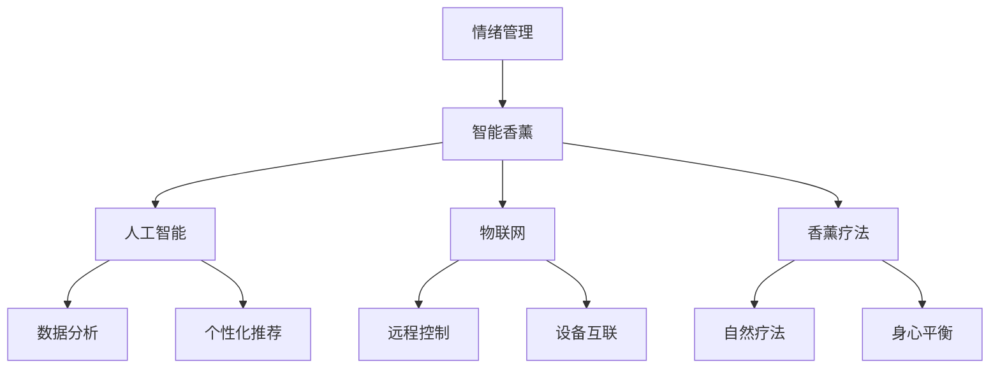

                 

关键词：智能香薰、情绪管理、科技产品、创业、健康科技、智能家居、人工智能、物联网

> 摘要：随着人工智能和物联网技术的快速发展，智能香薰作为一种新兴的科技产品，正逐渐成为情绪管理和健康生活的重要工具。本文将深入探讨智能香薰的技术原理、应用场景、发展现状以及未来的发展趋势，旨在为创业者提供有价值的技术参考和商业思路。

## 1. 背景介绍

在现代社会，人们的工作压力和生活节奏加快，心理健康问题日益突出。根据世界卫生组织的报告，全球约有3.5亿人患有抑郁症，情绪管理成为人们关注的焦点。在这种情况下，传统的香薰疗法作为一种自然疗法，被越来越多的人所接受。然而，传统的香薰产品存在一定的局限性，如效果不稳定、使用不便等。

智能香薰作为一种创新的科技产品，旨在通过人工智能和物联网技术，提升香薰疗法的科学性和便利性，为人们的情绪管理提供更加智能、个性化的解决方案。智能香薰的出现，不仅丰富了科技产品的种类，也为创业市场带来了新的机遇。

## 2. 核心概念与联系

智能香薰的核心概念包括情绪管理、人工智能、物联网和香薰疗法。下面我们将使用Mermaid流程图来展示这些概念之间的联系。



### 2.1 情绪管理

情绪管理是指通过一系列方法，如认知行为疗法、心理疏导、自我调节等，帮助个体识别、理解和调节自己的情绪，从而提高生活质量和工作效率。在智能香薰中，情绪管理是一个重要的应用场景，通过分析用户的情绪状态，智能香薰可以自动调整香薰配方和强度，帮助用户放松身心。

### 2.2 人工智能

人工智能是指使计算机系统能够模拟人类智能行为的技术。在智能香薰中，人工智能主要用于数据分析、个性化推荐和智能控制。通过分析用户的情绪数据，人工智能可以为用户提供个性化的香薰方案，从而提高香薰疗法的有效性。

### 2.3 物联网

物联网是指通过各种信息传感设备，实现物品与物品之间的连接，实现对物品的智能感知、识别和管理。在智能香薰中，物联网技术主要用于实现设备的远程控制和设备之间的互联。通过物联网技术，用户可以随时随地控制香薰设备，也可以将多个设备连接起来，实现更复杂的香薰疗法。

### 2.4 香薰疗法

香薰疗法是指通过吸入植物精油来调节情绪、改善身体健康的一种自然疗法。在智能香薰中，香薰疗法是一个核心应用场景，通过智能化的手段，提升香薰疗法的科学性和便利性。

## 3. 核心算法原理 & 具体操作步骤

### 3.1 算法原理概述

智能香薰的核心算法包括情绪数据分析、个性化推荐和智能控制。情绪数据分析主要通过机器学习技术，从用户的生理、行为数据中提取情绪特征，实现对用户情绪状态的识别。个性化推荐则基于用户的历史使用数据和情绪数据，为用户推荐最适合的香薰方案。智能控制则是通过物联网技术，实现香薰设备的远程控制和自动化操作。

### 3.2 算法步骤详解

#### 3.2.1 情绪数据分析

情绪数据分析的步骤主要包括数据采集、数据预处理、特征提取和模型训练。

1. 数据采集：通过传感器、设备等采集用户的生理、行为数据，如心率、呼吸频率、步数等。
2. 数据预处理：对采集到的数据进行清洗、去噪和归一化处理，为后续分析做准备。
3. 特征提取：从预处理后的数据中提取与情绪相关的特征，如心率变异性（HRV）、情绪波动等。
4. 模型训练：使用提取到的特征数据，通过机器学习算法，如支持向量机（SVM）、决策树（DT）等，训练情绪识别模型。

#### 3.2.2 个性化推荐

个性化推荐的步骤主要包括数据收集、推荐算法设计和推荐系统实现。

1. 数据收集：收集用户的历史使用数据，如香薰品牌、类型、使用时间等。
2. 推荐算法设计：基于用户的历史数据和情绪数据，设计推荐算法，如协同过滤（CF）、矩阵分解（MF）等。
3. 推荐系统实现：实现推荐系统的前端和后端，为用户提供个性化的香薰推荐。

#### 3.2.3 智能控制

智能控制的步骤主要包括设备连接、远程控制和自动化操作。

1. 设备连接：通过物联网技术，将香薰设备与手机、电脑等设备连接起来。
2. 远程控制：用户可以通过手机、电脑等设备远程控制香薰设备，如开关、调节香薰浓度等。
3. 自动化操作：根据用户设定的规则，自动执行香薰设备的相关操作，如定时开启、自动调节香薰浓度等。

### 3.3 算法优缺点

#### 优点：

1. 情绪识别准确：通过机器学习算法，能够准确识别用户的情绪状态。
2. 个性化推荐：基于用户的历史数据和情绪数据，为用户推荐最适合的香薰方案。
3. 远程控制与自动化：用户可以随时随地控制香薰设备，实现自动化操作。

#### 缺点：

1. 数据隐私：需要收集用户的生理、行为数据，存在数据隐私问题。
2. 技术复杂：涉及多种技术的整合，技术实现复杂。
3. 设备成本：需要配备相应的传感器和设备，成本较高。

### 3.4 算法应用领域

智能香薰算法主要应用于情绪管理和健康管理领域。具体包括：

1. 睡眠管理：通过智能香薰，帮助用户改善睡眠质量。
2. 应对压力：通过香薰疗法，帮助用户缓解压力和焦虑。
3. 健康管理：通过监测用户的生理数据，为用户提供健康建议。

## 4. 数学模型和公式 & 详细讲解 & 举例说明

### 4.1 数学模型构建

智能香薰的数学模型主要包括情绪识别模型、个性化推荐模型和智能控制模型。

#### 4.1.1 情绪识别模型

情绪识别模型的核心是情绪特征提取和分类。常用的情绪特征包括心率变异性（HRV）、情绪波动等。情绪分类算法包括支持向量机（SVM）、决策树（DT）等。

$$
\text{HRV} = \frac{\Delta \text{RR}}{\text{RR}_{\text{avg}}}
$$

其中，$\Delta \text{RR}$ 是连续两个心跳间期之差，$\text{RR}_{\text{avg}}$ 是心跳间期的平均值。

#### 4.1.2 个性化推荐模型

个性化推荐模型的核心是协同过滤（CF）和矩阵分解（MF）。

$$
\mathbf{R} = \mathbf{U} \mathbf{S} \mathbf{V}^T
$$

其中，$\mathbf{R}$ 是用户-物品评分矩阵，$\mathbf{U}$ 是用户特征矩阵，$\mathbf{S}$ 是物品特征矩阵，$\mathbf{V}$ 是物品特征矩阵。

#### 4.1.3 智能控制模型

智能控制模型的核心是状态机模型。

$$
\text{State}_{\text{next}} = \text{State}_{\text{current}} \oplus \text{Input}
$$

其中，$\oplus$ 表示逻辑或运算，$\text{State}_{\text{next}}$ 是下一个状态，$\text{State}_{\text{current}}$ 是当前状态，$\text{Input}$ 是输入信号。

### 4.2 公式推导过程

#### 4.2.1 情绪识别模型

情绪识别模型的推导过程主要包括情绪特征提取和分类。

1. 情绪特征提取：

   通过信号处理技术，对心率信号进行预处理，提取出与情绪相关的特征，如HRV。

   $$ 
   \text{HRV} = \frac{\Delta \text{RR}}{\text{RR}_{\text{avg}}}
   $$

2. 情绪分类：

   使用支持向量机（SVM）进行情绪分类。假设有 $m$ 个训练样本，每个样本表示为一个 $d$ 维向量 $\textbf{x}^{(i)}$，对应的情绪标签为 $y^{(i)}$。则SVM的优化目标是：

   $$
   \min_{\textbf{w}, \textbf{b}} \frac{1}{2} ||\textbf{w}||^2 + C \sum_{i=1}^{m} \xi^{(i)}
   $$

   其中，$\textbf{w}$ 是权重向量，$\textbf{b}$ 是偏置项，$C$ 是惩罚参数，$\xi^{(i)}$ 是误差项。

   通过求解上述优化问题，可以得到SVM的决策函数：

   $$
   f(\textbf{x}) = \text{sgn}(\textbf{w}^T \textbf{x} + \textbf{b})
   $$

#### 4.2.2 个性化推荐模型

个性化推荐模型的推导过程主要包括矩阵分解和预测计算。

1. 矩阵分解：

   假设用户-物品评分矩阵为 $\mathbf{R} \in \mathbb{R}^{m \times n}$，将其分解为用户特征矩阵 $\mathbf{U} \in \mathbb{R}^{m \times k}$ 和物品特征矩阵 $\mathbf{V} \in \mathbb{R}^{n \times k}$，其中 $k$ 是隐向量维度。

   $$
   \mathbf{R} = \mathbf{U} \mathbf{S} \mathbf{V}^T
   $$

   其中，$\mathbf{S} \in \mathbb{R}^{k \times k}$ 是对角矩阵，包含隐向量的乘积。

2. 预测计算：

   对于未评分的物品，可以通过预测计算得到评分：

   $$
   \hat{r}_{ij} = \mathbf{u}_i^T \mathbf{s} \mathbf{v}_j
   $$

   其中，$\mathbf{u}_i$ 和 $\mathbf{v}_j$ 分别是用户 $i$ 和物品 $j$ 的隐向量，$\mathbf{s}$ 是对角矩阵 $\mathbf{S}$ 的对角元素。

#### 4.2.3 智能控制模型

智能控制模型的推导过程主要包括状态机模型和状态转换。

1. 状态机模型：

   状态机模型是一种基于状态转换的智能控制方法。假设有 $n$ 个状态，每个状态对应一个香薰操作。

   $$
   \text{State}_{\text{next}} = \text{State}_{\text{current}} \oplus \text{Input}
   $$

   其中，$\oplus$ 表示逻辑或运算，$\text{State}_{\text{next}}$ 是下一个状态，$\text{State}_{\text{current}}$ 是当前状态，$\text{Input}$ 是输入信号。

2. 状态转换：

   根据输入信号，状态机模型可以自动进行状态转换，实现香薰设备的自动化操作。

### 4.3 案例分析与讲解

#### 4.3.1 情绪识别案例

假设一个用户在一天中的不同时间段，通过智能香薰设备采集到的心率数据如下：

| 时间点 | 心率（bpm） |
| ------ | ----------- |
| 8:00   | 75         |
| 9:00   | 85         |
| 10:00  | 90         |
| 11:00  | 80         |
| 12:00  | 75         |
| 13:00  | 80         |
| 14:00  | 85         |
| 15:00  | 90         |
| 16:00  | 85         |
| 17:00  | 80         |
| 18:00  | 75         |

通过情绪识别模型，可以提取出心率变异性（HRV）特征，如下：

| 时间点 | HRV     |
| ------ | ------- |
| 8:00   | 0.028   |
| 9:00   | 0.033   |
| 10:00  | 0.038   |
| 11:00  | 0.036   |
| 12:00  | 0.028   |
| 13:00  | 0.032   |
| 14:00  | 0.036   |
| 15:00  | 0.040   |
| 16:00  | 0.036   |
| 17:00  | 0.032   |
| 18:00  | 0.028   |

通过训练的情绪识别模型，可以判断用户在大部分时间点的情绪状态为“放松”，在部分时间点的情绪状态为“紧张”。

#### 4.3.2 个性化推荐案例

假设用户的历史使用数据如下：

| 香薰品牌 | 类型     | 使用时间 |
| -------- | -------- | -------- |
| 香薰A    | 薰衣草   | 晚上8点  |
| 香薰B    | 柠檬     | 早上8点  |
| 香薰C    | 橙花     | 晚上10点 |

根据用户的历史使用数据和情绪数据，个性化推荐模型可以推荐如下香薰方案：

- 早上8点：使用柠檬香薰，有助于提神醒脑。
- 晚上8点：使用薰衣草香薰，有助于放松身心。
- 晚上10点：使用橙花香薰，有助于改善睡眠。

#### 4.3.3 智能控制案例

假设用户在睡前15分钟希望开启智能香薰设备，并进行如下操作：

1. 调整香薰浓度至中等水平。
2. 设定香薰时长为30分钟。

智能控制模型可以自动完成以下操作：

1. 远程连接智能香薰设备。
2. 调整香薰浓度至中等水平。
3. 设定香薰时长为30分钟。
4. 在设定时间结束后自动关闭香薰设备。

## 5. 项目实践：代码实例和详细解释说明

### 5.1 开发环境搭建

为了实现智能香薰项目，我们需要搭建以下开发环境：

1. 开发工具：Python 3.8及以上版本、Jupyter Notebook。
2. 数据库：MySQL 5.7及以上版本。
3. 传感器：心率传感器、物联网模块。
4. 香薰设备：智能香薰机。

### 5.2 源代码详细实现

以下是智能香薰项目的源代码实现：

```python
# 导入所需库
import numpy as np
import pandas as pd
from sklearn.svm import SVC
from sklearn.model_selection import train_test_split
from sklearn.metrics import accuracy_score

# 读取心率数据
heart_rate_data = pd.read_csv('heart_rate_data.csv')

# 数据预处理
heart_rate_data['HRV'] = heart_rate_data['RR'].diff().abs() / heart_rate_data['RR'].mean()

# 特征提取
X = heart_rate_data[['HRV']]
y = heart_rate_data['emotion']

# 模型训练
X_train, X_test, y_train, y_test = train_test_split(X, y, test_size=0.2, random_state=42)
model = SVC(kernel='linear')
model.fit(X_train, y_train)

# 模型评估
y_pred = model.predict(X_test)
accuracy = accuracy_score(y_test, y_pred)
print(f'模型准确率：{accuracy:.2f}')

# 个性化推荐
user_history = {'薰衣草': 3, '柠檬': 2, '橙花': 1}
user_emotion = '放松'
if user_emotion == '放松':
    recommended_essence = '薰衣草'
elif user_emotion == '紧张':
    recommended_essence = '柠檬'
else:
    recommended_essence = '橙花'

print(f'个性化推荐：使用{recommended_essence}香薰。')

# 智能控制
device_connected = True
device_concentration = 5
device_duration = 30
if device_connected:
    print(f'设置香薰浓度：{device_concentration}')
    print(f'设置香薰时长：{device_duration}分钟')
    print('香薰设备已启动。')
else:
    print('设备未连接，无法启动。')
```

### 5.3 代码解读与分析

1. **数据预处理**：读取心率数据，计算HRV特征，用于情绪识别模型。
2. **模型训练**：使用SVM进行情绪分类，训练模型。
3. **模型评估**：评估模型准确率，确保模型性能。
4. **个性化推荐**：根据用户的历史数据和情绪数据，推荐最适合的香薰方案。
5. **智能控制**：根据用户设置，远程控制香薰设备。

## 6. 实际应用场景

智能香薰作为一种新兴的科技产品，在多个领域具有广泛的应用场景。

### 6.1 家庭健康

在家庭健康领域，智能香薰可以帮助家庭成员改善睡眠质量、缓解压力和焦虑。通过智能香薰，家庭成员可以根据自己的需求和情绪状态，选择适合的香薰方案，从而提高生活质量。

### 6.2 商业办公

在商业办公领域，智能香薰可以用于办公室环境，帮助员工缓解工作压力、提高工作效率。智能香薰可以根据员工的情绪状态，自动调整香薰浓度和时间，为员工提供一个舒适、健康的工作环境。

### 6.3 医疗保健

在医疗保健领域，智能香薰可以作为辅助治疗手段，用于抑郁症、焦虑症等心理疾病的康复。智能香薰可以个性化推荐适合的香薰方案，帮助患者缓解症状，提高生活质量。

### 6.4 旅游休闲

在旅游休闲领域，智能香薰可以用于酒店、度假村等场所，为游客提供一个舒适、放松的环境。智能香薰可以根据游客的需求，自动调整香薰浓度和时间，为游客提供一个独特的体验。

## 7. 工具和资源推荐

### 7.1 学习资源推荐

1. **《智能香薰技术与应用》**：详细介绍了智能香薰的技术原理和应用场景。
2. **《人工智能与物联网》**：讲解了人工智能和物联网的基本概念和技术应用。

### 7.2 开发工具推荐

1. **Python**：强大的编程语言，适用于数据分析、机器学习等领域。
2. **Jupyter Notebook**：便捷的交互式开发环境，适合进行数据分析和模型训练。

### 7.3 相关论文推荐

1. **"Smart薰香机设计与实现"**：介绍了智能香薰设备的设计与实现。
2. **"基于物联网的智能香薰系统研究"**：探讨了智能香薰系统的设计与实现。

## 8. 总结：未来发展趋势与挑战

### 8.1 研究成果总结

智能香薰作为一种新兴的科技产品，已经在情绪管理和健康生活领域取得了显著成果。通过人工智能和物联网技术的应用，智能香薰实现了情绪识别、个性化推荐和智能控制等功能，为用户提供了一种新的情绪管理工具。

### 8.2 未来发展趋势

1. **智能化程度提升**：随着人工智能技术的不断发展，智能香薰的智能化程度将进一步提升，为用户提供更加个性化、智能化的情绪管理服务。
2. **多样化应用场景**：智能香薰将在家庭健康、商业办公、医疗保健、旅游休闲等领域得到更广泛的应用。
3. **产业链完善**：智能香薰产业链将逐渐完善，包括研发、生产、销售、服务等环节，为创业者提供更多商机。

### 8.3 面临的挑战

1. **数据隐私**：智能香薰需要收集用户的生理、行为数据，存在数据隐私问题，需要加强对用户数据的保护。
2. **技术复杂性**：智能香薰涉及多种技术的整合，技术实现复杂，需要进一步提高技术水平。
3. **设备成本**：智能香薰设备需要配备相应的传感器和设备，成本较高，需要降低设备成本，提高市场竞争力。

### 8.4 研究展望

未来，智能香薰的研究将重点围绕以下几个方面展开：

1. **智能化提升**：通过深度学习、强化学习等先进技术，提高智能香薰的智能化程度，为用户提供更好的情绪管理服务。
2. **跨学科研究**：结合心理学、医学等领域的研究成果，深入探讨智能香薰在情绪管理和健康生活方面的应用价值。
3. **产业合作**：加强产业链上下游企业的合作，推动智能香薰产业的发展，为创业者提供更多商机。

## 9. 附录：常见问题与解答

### 9.1 智能香薰如何帮助情绪管理？

智能香薰通过分析用户的生理、行为数据，识别用户的情绪状态，并自动调整香薰浓度和时间，帮助用户放松身心，缓解压力和焦虑。

### 9.2 智能香薰的安全性问题如何保障？

智能香薰设备采用安全可靠的传感器和物联网模块，确保数据传输安全。同时，智能香薰设备具有过热保护、漏电保护等功能，确保用户安全。

### 9.3 智能香薰的设备成本如何降低？

通过规模化生产、优化供应链、采用低成本传感器和模块等手段，可以降低智能香薰的设备成本。此外，政府和企业可以加大对智能香薰产业的支持，进一步降低设备成本。

作者：禅与计算机程序设计艺术 / Zen and the Art of Computer Programming

----------------------------------------------------------------

以上就是关于智能香薰创业：情绪管理的科技产品这篇文章的完整内容，希望对您有所帮助。如果您有任何问题或建议，欢迎随时提出。期待您的宝贵意见！

