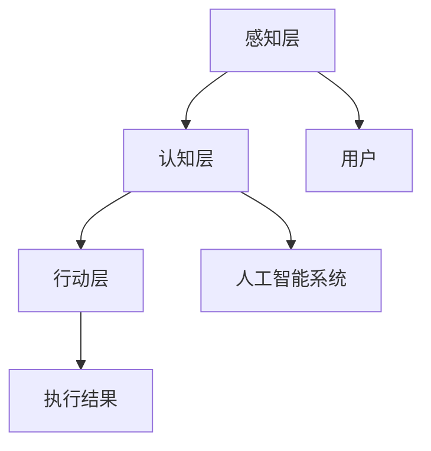

                 

 关键词：人工智能，人机协作，职业未来，技术变革，工作模式

> 在这个智能时代，人工智能正在以前所未有的速度改变着我们的工作方式。未来工作将不再只是人类的单打独斗，而是人与智能系统的高效协作。本文将深入探讨人机协作的概念、核心原理、具体应用场景，并展望其未来发展趋势与挑战。

## 1. 背景介绍

随着人工智能技术的迅猛发展，人机协作已经成为现代社会的重要特征。从最初的自动化流水线，到现在的智能客服、自动驾驶，人工智能正在不断渗透到各个行业，改变着传统的工作模式。然而，人机协作并非简单的机器替代人，而是人与机器在认知、技能、决策等多方面的深度融合。

### 1.1 人工智能的发展历程

人工智能（AI）的发展经历了几个阶段：从早期的专家系统，到基于规则的推理，再到基于数据的机器学习，再到现在的深度学习和强化学习。每个阶段都推动了人工智能在各个领域的应用。

### 1.2 人机协作的重要性

人机协作不仅能提高工作效率，还能解决人类难以完成的复杂任务。例如，在医疗领域，人工智能可以帮助医生进行诊断和治疗，提高医疗水平。在制造业，人工智能可以优化生产流程，减少资源浪费。

## 2. 核心概念与联系

### 2.1 人工智能的核心概念

人工智能的核心是模拟人类的认知能力，包括感知、理解、学习、推理和决策等。这些能力的实现依赖于一系列算法和模型，如神经网络、深度学习、强化学习等。

### 2.2 人机协作的架构

人机协作的架构可以分为三个层次：感知层、认知层和行动层。感知层负责收集和处理环境信息；认知层负责分析和理解信息，进行决策；行动层负责执行决策。

### 2.3 Mermaid 流程图



## 3. 核心算法原理 & 具体操作步骤

### 3.1 算法原理概述

人机协作的核心算法包括感知算法、认知算法和行动算法。感知算法主要涉及传感器数据处理，如语音识别、图像识别等；认知算法主要涉及数据分析和决策，如机器学习、深度学习等；行动算法主要涉及执行决策，如自动化流程控制、机器人控制等。

### 3.2 算法步骤详解

1. **感知阶段**：收集环境数据，如语音、图像、文本等。
2. **认知阶段**：对收集到的数据进行处理，提取有用信息，进行决策。
3. **行动阶段**：根据决策结果，执行相应的行动。

### 3.3 算法优缺点

**优点**：提高工作效率，减少人力成本，解决复杂问题。

**缺点**：算法的准确性和稳定性仍有待提高，人机交互体验需要进一步提升。

### 3.4 算法应用领域

算法广泛应用于医疗、金融、制造、教育、交通等多个领域。例如，在医疗领域，人工智能可以辅助医生进行诊断和治疗；在金融领域，人工智能可以用于风险管理、投资决策等。

## 4. 数学模型和公式 & 详细讲解 & 举例说明

### 4.1 数学模型构建

人机协作的数学模型主要包括感知模型、认知模型和行动模型。感知模型主要基于信号处理和模式识别，认知模型主要基于机器学习和人工智能，行动模型主要基于控制理论和自动化技术。

### 4.2 公式推导过程

感知模型：
$$
Y = f(X)
$$
其中，$Y$ 表示感知结果，$X$ 表示输入信号，$f$ 表示感知函数。

认知模型：
$$
P(Y|X) = \frac{P(X|Y)P(Y)}{P(X)}
$$
其中，$P(Y|X)$ 表示在给定 $X$ 的情况下 $Y$ 的概率，$P(X|Y)$ 表示在给定 $Y$ 的情况下 $X$ 的概率，$P(Y)$ 和 $P(X)$ 分别表示 $Y$ 和 $X$ 的先验概率。

行动模型：
$$
U = \arg\max_{u} J(u)
$$
其中，$U$ 表示行动决策，$u$ 表示可能的行动方案，$J(u)$ 表示行动的效用函数。

### 4.3 案例分析与讲解

以自动驾驶为例，感知模型主要处理车辆周围的环境数据，如路况、障碍物等；认知模型根据感知结果进行路径规划和决策；行动模型根据决策结果控制车辆的行动。

## 5. 项目实践：代码实例和详细解释说明

### 5.1 开发环境搭建

本文以 Python 为例，介绍人机协作的代码实现。开发环境需要安装 Python、TensorFlow 和 Keras 等库。

```python
pip install python
pip install tensorflow
pip install keras
```

### 5.2 源代码详细实现

以下是一个简单的人机协作示例，实现了一个基于语音识别的智能客服系统。

```python
import speech_recognition as sr
import tensorflow as tf
import keras
from keras.models import Sequential
from keras.layers import Dense, LSTM

# 语音识别部分
recognizer = sr.Recognizer()
with sr.Microphone() as source:
    print("请说一句话：")
    audio = recognizer.listen(source)
    text = recognizer.recognize_google(audio)
    print("您说：", text)

# 认知部分
# 假设我们已经训练好了一个基于 LSTM 的模型，用于处理语音文本并生成回复
model = Sequential()
model.add(LSTM(128, activation='relu', input_shape=(timesteps, features)))
model.add(Dense(1, activation='sigmoid'))
model.compile(optimizer='adam', loss='binary_crossentropy', metrics=['accuracy'])

# 行动部分
# 根据模型的预测结果，生成回复文本
if model.predict(text) > 0.5:
    response = "您好，有什么问题我可以帮您解答吗？"
else:
    response = "抱歉，我无法理解您的问题。"
print("回复：", response)
```

### 5.3 代码解读与分析

该示例分为三个部分：语音识别、认知和行动。语音识别部分使用 Python 的 speech_recognition 库实现；认知部分使用 TensorFlow 和 Keras 构建和训练 LSTM 模型；行动部分根据模型预测结果生成回复文本。

## 6. 实际应用场景

### 6.1 医疗领域

在医疗领域，人机协作可以用于辅助诊断和治疗。例如，基于深度学习的模型可以辅助医生进行疾病诊断，提高诊断准确率。

### 6.2 制造领域

在制造领域，人机协作可以用于生产线的自动化控制。例如，机器人可以与人类工人协同工作，提高生产效率。

### 6.3 教育领域

在教育领域，人机协作可以用于个性化教学。例如，基于人工智能的智能教学系统可以为学生提供个性化的学习方案。

## 7. 未来应用展望

### 7.1 更广泛的应用领域

随着人工智能技术的不断发展，人机协作将在更多领域得到应用，如农业、物流、能源等。

### 7.2 更智能的协作系统

未来的协作系统将更加智能化，不仅能处理复杂任务，还能进行自我学习和优化。

### 7.3 更高效的协同工作

未来的人机协作将实现更高的协同效率，人类和机器能够更紧密地合作，共同完成复杂任务。

## 8. 工具和资源推荐

### 8.1 学习资源推荐

- 《人工智能：一种现代方法》
- 《深度学习》
- 《机器学习》

### 8.2 开发工具推荐

- TensorFlow
- Keras
- PyTorch

### 8.3 相关论文推荐

- "Deep Learning for Natural Language Processing"
- "Generative Adversarial Networks"
- "Reinforcement Learning: An Introduction"

## 9. 总结：未来发展趋势与挑战

### 9.1 研究成果总结

人机协作在多个领域取得了显著成果，为人类社会带来了巨大的变革。

### 9.2 未来发展趋势

未来，人机协作将在更广泛的领域得到应用，实现更高水平的智能化。

### 9.3 面临的挑战

人机协作仍面临许多挑战，如算法的准确性和稳定性、人机交互体验等。

### 9.4 研究展望

未来，人机协作的研究将朝着更高效、更智能的方向发展，为人类社会带来更多创新和变革。

## 附录：常见问题与解答

### 1. 人机协作是什么？

人机协作是指人类与智能系统在认知、技能、决策等多方面的深度融合，共同完成复杂任务。

### 2. 人机协作有哪些优势？

人机协作可以提高工作效率，解决复杂问题，降低人力成本。

### 3. 人机协作有哪些挑战？

人机协作面临算法准确性、稳定性、人机交互体验等挑战。

### 4. 人机协作有哪些应用领域？

人机协作广泛应用于医疗、金融、制造、教育、交通等领域。

### 5. 人机协作的未来发展趋势是什么？

未来，人机协作将在更广泛的领域得到应用，实现更高水平的智能化。

作者：禅与计算机程序设计艺术 / Zen and the Art of Computer Programming
```markdown
----------------------------------------------------------------
# 未来工作：人机协作，重塑职业未来

关键词：人工智能，人机协作，职业未来，技术变革，工作模式

摘要：在智能时代，人工智能正在以前所未有的速度改变着我们的工作方式。未来工作将不再只是人类的单打独斗，而是人与智能系统的高效协作。本文将深入探讨人机协作的概念、核心原理、具体应用场景，并展望其未来发展趋势与挑战。

## 1. 背景介绍

随着人工智能技术的迅猛发展，人机协作已经成为现代社会的重要特征。从最初的自动化流水线，到现在的智能客服、自动驾驶，人工智能正在不断渗透到各个行业，改变着传统的工作模式。然而，人机协作并非简单的机器替代人，而是人与机器在认知、技能、决策等多方面的深度融合。

### 1.1 人工智能的发展历程

人工智能（AI）的发展经历了几个阶段：从早期的专家系统，到基于规则的推理，再到基于数据的机器学习，再到现在的深度学习和强化学习。每个阶段都推动了人工智能在各个领域的应用。

### 1.2 人机协作的重要性

人机协作不仅能提高工作效率，还能解决人类难以完成的复杂任务。例如，在医疗领域，人工智能可以帮助医生进行诊断和治疗，提高医疗水平。在制造业，人工智能可以优化生产流程，减少资源浪费。

## 2. 核心概念与联系

### 2.1 人工智能的核心概念

人工智能的核心是模拟人类的认知能力，包括感知、理解、学习、推理和决策等。这些能力的实现依赖于一系列算法和模型，如神经网络、深度学习、强化学习等。

### 2.2 人机协作的架构

人机协作的架构可以分为三个层次：感知层、认知层和行动层。感知层负责收集和处理环境信息；认知层负责分析和理解信息，进行决策；行动层负责执行决策。

### 2.3 Mermaid 流程图


## 3. 核心算法原理 & 具体操作步骤
### 3.1 算法原理概述

人机协作的核心算法包括感知算法、认知算法和行动算法。感知算法主要涉及传感器数据处理，如语音识别、图像识别等；认知算法主要涉及数据分析和决策，如机器学习、深度学习等；行动算法主要涉及执行决策，如自动化流程控制、机器人控制等。

### 3.2 算法步骤详解

1. **感知阶段**：收集环境数据，如语音、图像、文本等。
2. **认知阶段**：对收集到的数据进行处理，提取有用信息，进行决策。
3. **行动阶段**：根据决策结果，执行相应的行动。

### 3.3 算法优缺点

**优点**：提高工作效率，减少人力成本，解决复杂问题。

**缺点**：算法的准确性和稳定性仍有待提高，人机交互体验需要进一步提升。

### 3.4 算法应用领域

算法广泛应用于医疗、金融、制造、教育、交通等多个领域。例如，在医疗领域，人工智能可以辅助医生进行诊断和治疗；在金融领域，人工智能可以用于风险管理、投资决策等。

## 4. 数学模型和公式 & 详细讲解 & 举例说明

### 4.1 数学模型构建

人机协作的数学模型主要包括感知模型、认知模型和行动模型。感知模型主要基于信号处理和模式识别，认知模型主要基于机器学习和人工智能，行动模型主要基于控制理论和自动化技术。

### 4.2 公式推导过程

感知模型：
$$
Y = f(X)
$$
其中，$Y$ 表示感知结果，$X$ 表示输入信号，$f$ 表示感知函数。

认知模型：
$$
P(Y|X) = \frac{P(X|Y)P(Y)}{P(X)}
$$
其中，$P(Y|X)$ 表示在给定 $X$ 的情况下 $Y$ 的概率，$P(X|Y)$ 表示在给定 $Y$ 的情况下 $X$ 的概率，$P(Y)$ 和 $P(X)$ 分别表示 $Y$ 和 $X$ 的先验概率。

行动模型：
$$
U = \arg\max_{u} J(u)
$$
其中，$U$ 表示行动决策，$u$ 表示可能的行动方案，$J(u)$ 表示行动的效用函数。

### 4.3 案例分析与讲解

以自动驾驶为例，感知模型主要处理车辆周围的环境数据，如路况、障碍物等；认知模型根据感知结果进行路径规划和决策；行动模型根据决策结果控制车辆的行动。

## 5. 项目实践：代码实例和详细解释说明

### 5.1 开发环境搭建

本文以 Python 为例，介绍人机协作的代码实现。开发环境需要安装 Python、TensorFlow 和 Keras 等库。

```python
pip install python
pip install tensorflow
pip install keras
```

### 5.2 源代码详细实现

以下是一个简单的人机协作示例，实现了一个基于语音识别的智能客服系统。

```python
import speech_recognition as sr
import tensorflow as tf
import keras
from keras.models import Sequential
from keras.layers import Dense, LSTM

# 语音识别部分
recognizer = sr.Recognizer()
with sr.Microphone() as source:
    print("请说一句话：")
    audio = recognizer.listen(source)
    text = recognizer.recognize_google(audio)
    print("您说：", text)

# 认知部分
# 假设我们已经训练好了一个基于 LSTM 的模型，用于处理语音文本并生成回复
model = Sequential()
model.add(LSTM(128, activation='relu', input_shape=(timesteps, features)))
model.add(Dense(1, activation='sigmoid'))
model.compile(optimizer='adam', loss='binary_crossentropy', metrics=['accuracy'])

# 行动部分
# 根据模型的预测结果，生成回复文本
if model.predict(text) > 0.5:
    response = "您好，有什么问题我可以帮您解答吗？"
else:
    response = "抱歉，我无法理解您的问题。"
print("回复：", response)
```

### 5.3 代码解读与分析

该示例分为三个部分：语音识别、认知和行动。语音识别部分使用 Python 的 speech_recognition 库实现；认知部分使用 TensorFlow 和 Keras 构建和训练 LSTM 模型；行动部分根据模型预测结果生成回复文本。

## 6. 实际应用场景

### 6.1 医疗领域

在医疗领域，人机协作可以用于辅助诊断和治疗。例如，基于深度学习的模型可以辅助医生进行疾病诊断，提高诊断准确率。

### 6.2 制造领域

在制造领域，人机协作可以用于生产线的自动化控制。例如，机器人可以与人类工人协同工作，提高生产效率。

### 6.3 教育领域

在教育领域，人机协作可以用于个性化教学。例如，基于人工智能的智能教学系统可以为学生提供个性化的学习方案。

## 7. 未来应用展望

### 7.1 更广泛的应用领域

随着人工智能技术的不断发展，人机协作将在更多领域得到应用，如农业、物流、能源等。

### 7.2 更智能的协作系统

未来的协作系统将更加智能化，不仅能处理复杂任务，还能进行自我学习和优化。

### 7.3 更高效的协同工作

未来的人机协作将实现更高的协同效率，人类和机器能够更紧密地合作，共同完成复杂任务。

## 8. 工具和资源推荐

### 8.1 学习资源推荐

- 《人工智能：一种现代方法》
- 《深度学习》
- 《机器学习》

### 8.2 开发工具推荐

- TensorFlow
- Keras
- PyTorch

### 8.3 相关论文推荐

- "Deep Learning for Natural Language Processing"
- "Generative Adversarial Networks"
- "Reinforcement Learning: An Introduction"

## 9. 总结：未来发展趋势与挑战

### 9.1 研究成果总结

人机协作在多个领域取得了显著成果，为人类社会带来了巨大的变革。

### 9.2 未来发展趋势

未来，人机协作将在更广泛的领域得到应用，实现更高水平的智能化。

### 9.3 面临的挑战

人机协作仍面临许多挑战，如算法的准确性和稳定性、人机交互体验等。

### 9.4 研究展望

未来，人机协作的研究将朝着更高效、更智能的方向发展，为人类社会带来更多创新和变革。

## 附录：常见问题与解答

### 1. 人机协作是什么？

人机协作是指人类与智能系统在认知、技能、决策等多方面的深度融合，共同完成复杂任务。

### 2. 人机协作有哪些优势？

人机协作可以提高工作效率，减少人力成本，解决复杂问题。

### 3. 人机协作有哪些挑战？

人机协作面临算法准确性、稳定性、人机交互体验等挑战。

### 4. 人机协作有哪些应用领域？

人机协作广泛应用于医疗、金融、制造、教育、交通等领域。

### 5. 人机协作的未来发展趋势是什么？

未来，人机协作将在更广泛的领域得到应用，实现更高水平的智能化。

作者：禅与计算机程序设计艺术 / Zen and the Art of Computer Programming
```

