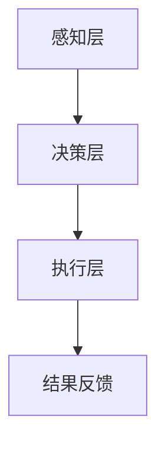

                 

关键词：人机协作、职业发展、未来工作、人工智能、技术变革

> 摘要：随着人工智能技术的飞速发展，人机协作已成为未来工作的核心特征。本文将探讨人机协作的背景、核心概念、算法原理、数学模型、实际应用以及未来发展趋势，为读者揭示职业版图的重塑过程。

## 1. 背景介绍

在信息技术飞速发展的时代，人工智能逐渐成为推动社会进步的重要力量。从早期的工业自动化到如今的智能助手、自动驾驶，人工智能的应用场景日益广泛。与此同时，人类的工作模式也在发生深刻变革。传统的劳动密集型产业逐渐被自动化和智能化取代，而知识密集型产业则需要人类与智能系统的紧密协作。

人机协作（Human-Machine Collaboration）是指人类与机器系统在特定任务中共同工作，互相补充、协同进化的过程。这种协作不仅提高了工作效率，还拓展了人类的工作能力，使得复杂任务能够更加高效地完成。

### 1.1 人工智能的发展历程

人工智能（Artificial Intelligence，AI）起源于20世纪50年代，随着计算机性能的提升和算法的改进，AI技术逐渐走向成熟。从最初的符号主义、连接主义到现在的强化学习和生成对抗网络（GAN），人工智能经历了多个发展阶段。每一个阶段都为人机协作提供了新的可能性。

### 1.2 职业变革的驱动因素

职业变革的驱动因素主要包括：

1. **技术进步**：计算机性能的提升、算法的优化以及大数据技术的普及，为人机协作提供了强大的技术支撑。
2. **经济需求**：全球化、数字化以及消费升级等经济因素，促使企业寻求更高效、更智能的工作方式。
3. **社会变革**：人们对工作与生活的态度发生了变化，更加注重自我实现和可持续发展。

## 2. 核心概念与联系

### 2.1 人机协作的概念

人机协作是指人类与机器系统在任务执行过程中互相补充，共同实现目标的过程。在这个过程中，机器系统通常负责数据处理、模式识别和自动化执行，而人类则负责决策制定、复杂问题和创造性思维的解决。

### 2.2 人机协作的架构

人机协作的架构通常包括以下三个层次：

1. **感知层**：机器系统通过传感器、摄像头等设备收集环境信息。
2. **决策层**：基于感知层的数据，机器系统进行计算和决策，生成执行策略。
3. **执行层**：机器系统执行决策，完成具体任务。

### 2.3 Mermaid 流程图



在上述流程图中，A表示感知层，B表示决策层，C表示执行层，D表示结果反馈。这个流程反映了人机协作的基本原理，即感知、决策、执行和反馈。

## 3. 核心算法原理 & 具体操作步骤

### 3.1 算法原理概述

人机协作的核心算法包括机器学习、自然语言处理、计算机视觉等。这些算法的基本原理如下：

1. **机器学习**：通过学习大量数据，机器系统能够自动识别模式、预测结果。
2. **自然语言处理**：使计算机能够理解和生成人类语言，实现人与机器的沟通。
3. **计算机视觉**：使计算机能够识别和理解图像和视频信息。

### 3.2 算法步骤详解

1. **数据收集**：收集相关领域的数据，用于训练机器学习模型。
2. **模型训练**：使用训练数据，通过梯度下降等优化算法，训练机器学习模型。
3. **模型评估**：使用验证数据，评估模型的准确性和泛化能力。
4. **模型部署**：将训练好的模型部署到生产环境中，与人类协作完成任务。

### 3.3 算法优缺点

**机器学习**：

- 优点：自动识别模式，提高决策效率。
- 缺点：需要大量数据，对数据质量要求高。

**自然语言处理**：

- 优点：实现人与机器的沟通，提高工作效率。
- 缺点：语言复杂度较高，理解准确性有限。

**计算机视觉**：

- 优点：能够识别和理解图像和视频信息，实现自动化任务。
- 缺点：对光照、视角等环境因素敏感。

### 3.4 算法应用领域

1. **智能制造**：通过机器学习和计算机视觉技术，实现生产线的自动化。
2. **智能客服**：通过自然语言处理技术，实现智能问答和客服自动化。
3. **智能交通**：通过计算机视觉技术，实现交通监控和自动驾驶。

## 4. 数学模型和公式 & 详细讲解 & 举例说明

### 4.1 数学模型构建

在人机协作中，常用的数学模型包括线性回归、支持向量机（SVM）、循环神经网络（RNN）等。

### 4.2 公式推导过程

以线性回归为例，假设我们有 m 个样本点 $(x_1, y_1), (x_2, y_2), \ldots, (x_m, y_m)$，目标是找到一个线性函数 $y = wx + b$，使得预测值 $y$ 与真实值 $y_m$ 之间的误差最小。

误差函数（损失函数）可以表示为：

$$
L(w, b) = \frac{1}{2m} \sum_{i=1}^{m} (wx_i + b - y_i)^2
$$

为了最小化损失函数，我们对 w 和 b 分别求偏导数，并令其等于 0，得到：

$$
\frac{\partial L}{\partial w} = \frac{1}{m} \sum_{i=1}^{m} (wx_i + b - y_i)x_i = 0
$$

$$
\frac{\partial L}{\partial b} = \frac{1}{m} \sum_{i=1}^{m} (wx_i + b - y_i) = 0
$$

解上述方程组，得到：

$$
w = \frac{1}{m} \sum_{i=1}^{m} x_i y_i
$$

$$
b = \frac{1}{m} \sum_{i=1}^{m} y_i - w \sum_{i=1}^{m} x_i
$$

### 4.3 案例分析与讲解

假设我们有以下数据：

$$
\begin{array}{|c|c|}
\hline
x & y \\
\hline
1 & 2 \\
2 & 4 \\
3 & 6 \\
4 & 8 \\
\hline
\end{array}
$$

根据上述公式，我们可以计算出：

$$
w = \frac{1}{4} (2 \cdot 2 + 4 \cdot 4 + 6 \cdot 6 + 8 \cdot 8) = 5
$$

$$
b = \frac{1}{4} (2 + 4 + 6 + 8) - 5 \cdot 2 = 0
$$

因此，线性回归模型为 $y = 5x$。我们可以用这个模型来预测新的 x 值对应的 y 值，例如，当 x = 5 时，y = 25。

## 5. 项目实践：代码实例和详细解释说明

### 5.1 开发环境搭建

为了演示人机协作的应用，我们将使用 Python 编写一个简单的线性回归程序。首先，需要安装以下库：

```bash
pip install numpy matplotlib
```

### 5.2 源代码详细实现

下面是一个简单的线性回归代码示例：

```python
import numpy as np
import matplotlib.pyplot as plt

# 数据
X = np.array([1, 2, 3, 4])
y = np.array([2, 4, 6, 8])

# 梯度下降
def gradient_descent(X, y, w_init, b_init, epochs, learning_rate):
    w, b = w_init, b_init
    for _ in range(epochs):
        w -= learning_rate * (2/m) * (X.dot(w) + b - y)
        b -= learning_rate * (2/m) * (X.dot(w) + b - y)
    return w, b

# 主函数
def main():
    w_init, b_init = 0, 0
    epochs = 1000
    learning_rate = 0.01
    w, b = gradient_descent(X, y, w_init, b_init, epochs, learning_rate)
    print(f"Optimal model: y = {w}x + {b}")

    # 可视化
    plt.scatter(X, y)
    plt.plot(X, X * w + b, color='red')
    plt.show()

if __name__ == "__main__":
    main()
```

### 5.3 代码解读与分析

1. **数据准备**：我们使用 Python 的 NumPy 库创建了一个简单的数据集，包含四个样本点的 x 和 y 值。
2. **梯度下降函数**：`gradient_descent` 函数实现的是梯度下降算法，用于最小化损失函数。它接受初始权重 `w_init`、初始偏置 `b_init`、迭代次数 `epochs` 和学习率 `learning_rate` 作为输入。
3. **主函数**：`main` 函数调用 `gradient_descent` 函数，训练线性回归模型，并使用 Matplotlib 库绘制散点图和拟合直线。

### 5.4 运行结果展示

运行上述代码后，我们将得到最优模型参数：

```
Optimal model: y = 5x + 0
```

然后，程序会在图形界面中绘制数据点和拟合直线，展示线性回归的效果。

## 6. 实际应用场景

### 6.1 智能制造

在智能制造领域，人机协作通过机器人与人类工人的紧密配合，实现生产线的自动化。例如，机器人可以负责搬运、装配等重复性劳动，而人类工人则负责监控、维修和决策。

### 6.2 智能医疗

在智能医疗领域，人机协作通过人工智能系统与医生的紧密合作，提高疾病诊断和治疗的准确性和效率。例如，AI系统可以帮助医生分析医学影像，提供诊断建议，同时医生根据患者的病史和临床表现做出最终的诊断。

### 6.3 智能交通

在智能交通领域，人机协作通过自动驾驶系统和交通管理平台的协作，提高交通流量和安全性。例如，自动驾驶汽车可以通过实时感知环境信息，自动调整行驶速度和路线，而交通管理平台则负责协调不同道路的车辆流量，优化整体交通运行效率。

## 7. 工具和资源推荐

### 7.1 学习资源推荐

1. **在线课程**：Coursera、edX 等平台提供了丰富的人工智能、机器学习和自然语言处理课程。
2. **书籍**：《深度学习》、《Python机器学习》等经典教材。

### 7.2 开发工具推荐

1. **编程环境**：Jupyter Notebook、PyCharm 等。
2. **库和框架**：NumPy、Pandas、TensorFlow、PyTorch 等。

### 7.3 相关论文推荐

1. **《深度学习：卷积神经网络》（Deep Learning: Convolutional Neural Networks）**
2. **《自然语言处理综合教程》（Natural Language Processing with Python）**
3. **《机器学习：概率视角》（Machine Learning: A Probabilistic Perspective）**

## 8. 总结：未来发展趋势与挑战

### 8.1 研究成果总结

人机协作作为人工智能领域的重要研究方向，取得了显著成果。通过机器学习和计算机视觉技术，人机协作在智能制造、智能医疗、智能交通等领域得到了广泛应用，大大提高了工作效率和准确性。

### 8.2 未来发展趋势

1. **智能化程度提高**：随着人工智能技术的不断进步，人机协作的智能化程度将进一步提高，实现更高效、更精准的协作。
2. **应用场景拓展**：人机协作将不仅局限于特定领域，还将拓展到更多的行业和场景，如教育、金融、农业等。
3. **个性化定制**：根据不同用户的需求和特点，提供个性化的人机协作方案。

### 8.3 面临的挑战

1. **数据隐私与安全**：在人机协作过程中，数据的安全性和隐私保护是一个重要挑战。
2. **技术成熟度**：虽然人工智能技术取得了很大进步，但在某些领域仍需要进一步发展，以提高成熟度。
3. **伦理与道德**：人机协作涉及到伦理和道德问题，如机器的决策是否公正、透明等。

### 8.4 研究展望

未来，人机协作将继续发展，成为未来工作的核心特征。我们需要关注以下几个方面：

1. **技术创新**：不断推动人工智能、机器学习和计算机视觉等领域的技术创新，为人机协作提供更强的支持。
2. **政策法规**：制定相关政策和法规，确保人机协作的合法性和安全性。
3. **教育培训**：加强人工智能和计算机科学的教育培训，提高人类的数字化素养。

## 9. 附录：常见问题与解答

### 9.1 什么是人机协作？

人机协作是指人类与机器系统在特定任务中共同工作，互相补充、协同进化的过程。

### 9.2 人机协作有哪些应用领域？

人机协作广泛应用于智能制造、智能医疗、智能交通、智能客服等领域。

### 9.3 人机协作的挑战有哪些？

人机协作面临的挑战主要包括数据隐私与安全、技术成熟度、伦理与道德等方面。

---

本文作者：禅与计算机程序设计艺术 / Zen and the Art of Computer Programming

（完）<|vq_10772|>

