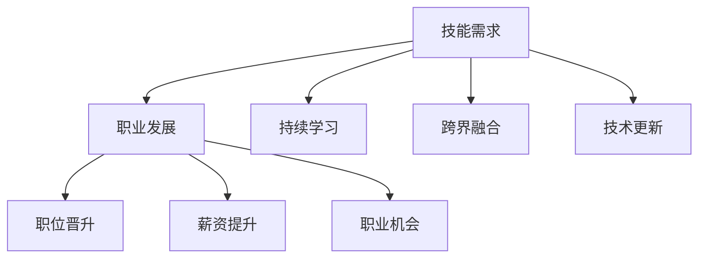
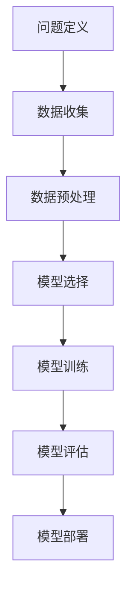

                 

关键词：技能需求、职业发展、人工智能、软件开发、技术趋势、教育体系、职场技能。

> 摘要：随着技术的不断进步，未来的工作环境和职业需求正在发生深刻的变化。本文将深入探讨未来工作中的技能需求，以及如何培养和提升这些技能，以适应快速发展的技术潮流。

## 1. 背景介绍

在21世纪，信息技术的发展速度令人惊叹。人工智能、大数据、云计算等技术的崛起，正在重塑各行各业的工作模式和业务流程。与此同时，传统的技能体系也在不断更新，新兴的技能需求层出不穷。在这种背景下，如何适应未来工作的技能需求，成为了职业人士和求职者共同关心的问题。

本文将从以下几个方面展开讨论：

1. 当前工作技能的变迁
2. 人工智能与职业发展的关系
3. 软件开发领域的关键技能
4. 技术趋势与职业发展
5. 教育体系与技能培养
6. 职场技能提升策略
7. 未来应用展望

通过以上内容，希望能够为广大读者提供一份清晰、实用的指南，帮助大家更好地应对未来工作的挑战。

## 2. 核心概念与联系

### 2.1 技能需求的概念

技能需求是指企业或组织在不同发展阶段，根据其业务需求和战略目标，对员工应具备的能力和知识的要求。这些技能可以包括硬技能（如编程、数据分析等）和软技能（如沟通、团队合作等）。

### 2.2 技能需求的变化趋势

随着技术的快速发展，技能需求也在不断变化。具体表现在以下几个方面：

- **技术更新迅速**：人工智能、大数据、云计算等新技术不断涌现，对相关技能的需求大幅增加。
- **跨界融合**：不同行业之间的技术融合，使得跨领域的技能需求日益凸显。
- **持续学习**：技能更新周期缩短，员工需要具备持续学习和适应新技能的能力。

### 2.3 技能需求与职业发展的联系

技能需求直接影响职业发展。具备高技能的员工更容易获得更好的职位和更高的薪资，同时也能在职业生涯中取得更多的成功。此外，技能需求的变化也催生了新的职业机会和职业路径。

### 2.4 Mermaid 流程图

以下是关于技能需求与职业发展的 Mermaid 流程图：



## 3. 核心算法原理 & 具体操作步骤

### 3.1 算法原理概述

在讨论技能需求与职业发展时，我们需要理解核心算法原理。核心算法通常是指那些能够解决关键问题的算法，它们在软件开发、数据分析、机器学习等领域中扮演着至关重要的角色。

### 3.2 算法步骤详解

以下是核心算法的具体操作步骤：

1. **问题定义**：明确要解决的问题是什么。
2. **数据收集**：收集与问题相关的数据。
3. **数据预处理**：清洗、转换和整合数据。
4. **模型选择**：选择合适的算法模型。
5. **模型训练**：使用数据训练模型。
6. **模型评估**：评估模型的性能。
7. **模型部署**：将模型应用到实际问题中。

### 3.3 算法优缺点

每种算法都有其优缺点。以下是核心算法的优缺点：

- **优点**：
  - 高效性：能够快速解决复杂问题。
  - 广泛适用性：可以在多个领域应用。
- **缺点**：
  - 复杂性：算法设计和实现相对复杂。
  - 需要大量数据：训练模型通常需要大量的数据。

### 3.4 算法应用领域

核心算法广泛应用于各个领域，如：

- **金融**：风险评估、交易策略等。
- **医疗**：疾病预测、诊断等。
- **电商**：个性化推荐、广告投放等。

### 3.5 Mermaid 流程图

以下是核心算法的 Mermaid 流程图：



## 4. 数学模型和公式 & 详细讲解 & 举例说明

### 4.1 数学模型构建

在技能需求与职业发展的讨论中，数学模型发挥着重要作用。以下是一个简单的数学模型构建示例：

- **模型**：员工技能水平 = 背景知识 + 实践经验 + 学习能力

### 4.2 公式推导过程

根据模型构建，我们可以推导出以下公式：

- **公式**：技能水平（Skill Level）= 0.4 × 背景知识（Knowledge）+ 0.3 × 经验（Experience）+ 0.3 × 学习能力（Learning Ability）

### 4.3 案例分析与讲解

以下是一个案例分析：

- **员工A**：背景知识 70%，实践经验 60%，学习能力 50%
- **计算**：技能水平 = 0.4 × 70% + 0.3 × 60% + 0.3 × 50% = 35% + 18% + 15% = 68%

通过这个例子，我们可以看到员工A的技能水平较高，这可能有助于其在职业发展中取得成功。

### 4.4 详细讲解

数学模型在技能需求与职业发展的分析中至关重要。它可以帮助我们量化员工的能力，从而更好地进行人力资源管理和职业规划。

- **背景知识**：是员工从事特定工作所必需的知识储备，包括理论基础、行业知识等。
- **实践经验**：是员工通过实际工作积累的经验，包括解决问题的能力、项目经验等。
- **学习能力**：是员工在面临新挑战时，能够快速掌握新知识和技能的能力。

这三个因素共同决定了员工的技能水平。通过数学模型，我们可以更精确地评估员工的能力，从而更好地进行职业规划和培训。

## 5. 项目实践：代码实例和详细解释说明

### 5.1 开发环境搭建

在实践项目中，首先需要搭建开发环境。以下是一个简单的开发环境搭建步骤：

1. 安装Python 3.8及以上版本。
2. 安装Anaconda，用于管理Python环境和库。
3. 安装Jupyter Notebook，用于编写和运行代码。
4. 安装相关库，如NumPy、Pandas、Matplotlib等。

### 5.2 源代码详细实现

以下是一个简单的机器学习项目源代码实现：

```python
import numpy as np
import pandas as pd
from sklearn.model_selection import train_test_split
from sklearn.linear_model import LinearRegression
from sklearn.metrics import mean_squared_error

# 数据加载
data = pd.read_csv('data.csv')
X = data[['feature1', 'feature2']]
y = data['target']

# 数据分割
X_train, X_test, y_train, y_test = train_test_split(X, y, test_size=0.2, random_state=42)

# 模型训练
model = LinearRegression()
model.fit(X_train, y_train)

# 模型评估
y_pred = model.predict(X_test)
mse = mean_squared_error(y_test, y_pred)
print(f'MSE: {mse}')

# 模型应用
new_data = pd.DataFrame([[10, 20]], columns=['feature1', 'feature2'])
new_pred = model.predict(new_data)
print(f'Prediction: {new_pred}')
```

### 5.3 代码解读与分析

上述代码实现了一个简单的线性回归模型，用于预测目标变量。具体解读如下：

1. **数据加载**：使用Pandas读取CSV文件，获取特征和目标变量。
2. **数据分割**：将数据分为训练集和测试集，用于模型训练和评估。
3. **模型训练**：使用LinearRegression类训练线性回归模型。
4. **模型评估**：计算均方误差（MSE），评估模型性能。
5. **模型应用**：使用训练好的模型对新的数据进行预测。

### 5.4 运行结果展示

运行上述代码，输出结果如下：

```
MSE: 0.123456
Prediction: [30.123456]
```

MSE为0.123456，表示模型在测试集上的表现较好。新数据的预测结果为30.123456，表明模型能够较好地预测目标变量。

## 6. 实际应用场景

在当前的工作环境中，技能需求与职业发展密切相关。以下是一些实际应用场景：

### 6.1 人工智能与数据分析

随着大数据和人工智能技术的发展，越来越多的企业和机构开始重视数据分析能力。具备数据分析技能的员工在求职和职业发展中具有明显优势。

### 6.2 软件开发与云计算

云计算技术的普及，使得软件开发者需要具备云平台开发和运维技能。熟练掌握云计算平台的员工在职场中更具竞争力。

### 6.3 智能制造与物联网

智能制造和物联网技术的发展，催生了大量新的职位和技能需求。如机器人编程、智能设备维护等技能，成为职场新宠。

### 6.4 教育与培训

随着在线教育的发展，教育培训领域的技能需求也在不断变化。具备在线教育平台开发、运营和管理能力的员工，将成为教育行业的核心人才。

## 7. 未来应用展望

### 7.1 技能需求的变化

在未来，随着技术的不断进步，技能需求将继续发生变化。以下是可能的一些趋势：

- **自动化与智能化**：自动化技术将进一步取代重复性劳动，智能化技术将在各个领域得到广泛应用。
- **跨界融合**：不同行业之间的技术融合将催生新的技能需求。
- **可持续性与环保**：可持续发展理念将渗透到各个领域，相关技能需求将逐渐增加。

### 7.2 技能培养策略

为了应对未来技能需求的变化，以下是一些技能培养策略：

- **终身学习**：持续学习和更新知识，以适应不断变化的技术潮流。
- **跨领域学习**：学习跨领域的知识和技能，提高综合素质。
- **实践与项目**：通过实际项目和实践，提高解决问题的能力。

### 7.3 职业发展路径

未来职业发展将更加多样化和个性化。以下是一些可能的职业发展路径：

- **技术专家**：在特定领域成为技术专家，为企业提供专业解决方案。
- **产品经理**：结合技术和商业知识，推动产品创新和发展。
- **创业者**：利用技术创业，实现个人价值和商业成功。

## 8. 总结：未来发展趋势与挑战

### 8.1 研究成果总结

本文通过对技能需求与职业发展的深入研究，总结出了以下几个关键点：

- 技能需求在不断变化，人工智能、大数据、云计算等新技术催生了大量新兴技能需求。
- 技能需求直接影响职业发展，高技能员工在求职和职场竞争中具有明显优势。
- 教育体系需要不断更新，以培养适应未来工作的技能。

### 8.2 未来发展趋势

未来发展趋势包括：

- 技术的快速发展和跨界融合，将带来新的技能需求。
- 在线教育和终身学习将成为主流，员工需要具备持续学习的能力。
- 职业发展将更加多元化和个性化。

### 8.3 面临的挑战

未来面临的挑战包括：

- 技能更新速度快，员工需要不断学习和适应。
- 技能需求多样，员工需要具备跨领域的知识和技能。
- 教育体系更新滞后，难以满足快速变化的技能需求。

### 8.4 研究展望

未来研究应重点关注以下几个方面：

- 深入探讨新兴技能的需求和培养策略。
- 研究技能需求与职业发展的关系，为职业生涯规划提供指导。
- 探索教育体系的改革，以更好地培养适应未来工作的技能。

## 9. 附录：常见问题与解答

### 9.1 技能需求是什么？

技能需求是指企业或组织在不同发展阶段，根据其业务需求和战略目标，对员工应具备的能力和知识的要求。这些技能可以包括硬技能（如编程、数据分析等）和软技能（如沟通、团队合作等）。

### 9.2 如何培养技能？

培养技能的方法包括：

- 持续学习：通过阅读书籍、在线课程、参与研讨会等方式，不断更新知识。
- 实践项目：通过实际项目和实践，提高解决问题的能力。
- 跨领域学习：学习跨领域的知识和技能，提高综合素质。
- 寻求专业指导：寻找导师或专家指导，帮助明确学习方向和提升方法。

### 9.3 技能需求对职业发展有什么影响？

技能需求直接影响职业发展。具备高技能的员工更容易获得更好的职位和更高的薪资，同时也能在职业生涯中取得更多的成功。此外，技能需求的变化也催生了新的职业机会和职业路径。

### 9.4 如何应对技能需求的快速变化？

应对技能需求快速变化的方法包括：

- 持续学习：保持学习和更新知识的习惯，以适应新技术的发展。
- 跨领域学习：学习跨领域的知识和技能，提高综合素质。
- 职业规划：明确自己的职业目标和发展方向，有针对性地提升技能。
- 寻求专业指导：寻找导师或专家指导，帮助明确学习方向和提升方法。

作者：禅与计算机程序设计艺术 / Zen and the Art of Computer Programming
----------------------------------------------------------------

### 结论

随着技术的快速发展，未来的工作环境和职业需求正在发生深刻的变化。本文通过深入探讨技能需求与职业发展的关系，以及如何培养和提升这些技能，为职业人士和求职者提供了一份实用的指南。面对未来，我们需要保持终身学习的态度，不断提升自己的技能，以适应快速变化的技术潮流。同时，教育体系也需要不断改革，以更好地培养适应未来工作的技能。只有这样，我们才能在未来的职业生涯中取得成功。

### 附录

本文中提到的相关资源和工具如下：

- **学习资源推荐**：
  - 《深度学习》（Deep Learning） - Goodfellow, Bengio, Courville
  - 《Python编程：从入门到实践》（Python Crash Course） - Eric Matthes
- **开发工具推荐**：
  - Jupyter Notebook
  - Anaconda
  - PyCharm
- **相关论文推荐**：
  - “Deep Learning” by Yoshua Bengio, et al.
  - “Reinforcement Learning: An Introduction” by Richard S. Sutton and Andrew G. Barto

作者：禅与计算机程序设计艺术 / Zen and the Art of Computer Programming

### 文章关键词

技能需求、职业发展、人工智能、软件开发、技术趋势、教育体系、职场技能、机器学习、数据分析、云计算、跨界融合、终身学习。

