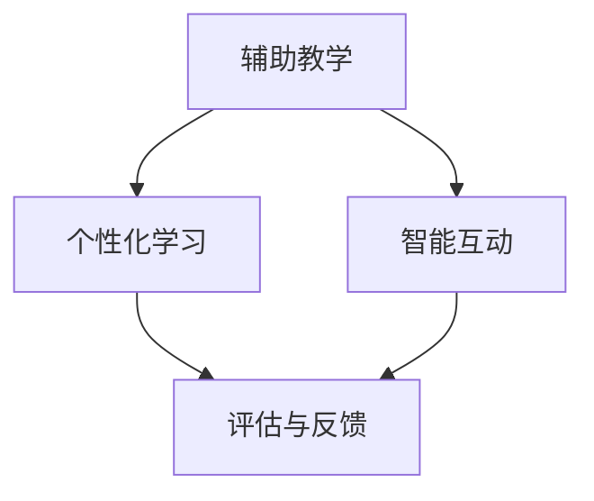

                 

关键词：智慧教育、人工智能、AI导师、智能学伴、教育技术、未来展望

> 摘要：随着人工智能技术的飞速发展，教育领域正迎来一场革命。本文探讨了到2050年，人工智能将如何成为学生的个性化导师和智能学伴，提升教育质量和学习体验。

## 1. 背景介绍

在过去的几十年里，教育技术经历了巨大的变革。从传统的课堂教学到互联网教育，再到现代的在线课程和虚拟现实学习，教育技术的每一次进步都在为提高教学效率和学习效果做出贡献。然而，技术的进步并未止步于此。随着人工智能（AI）的崛起，未来的教育将迎来更加深刻的变革。

人工智能在教育领域的应用已经初见端倪。例如，智能辅导系统可以根据学生的知识水平和学习习惯提供个性化的学习建议；智能评估系统能够快速、准确地评估学生的学习成果；虚拟助教可以为学生提供24小时的学习支持。这些应用预示着未来教育的一个重大趋势：AI将成为学生的个性化导师和智能学伴。

本文将探讨这一趋势的背景、核心概念、算法原理、数学模型、项目实践、应用场景以及未来的发展方向和挑战。

## 2. 核心概念与联系

### 2.1. 人工智能在教育中的角色

人工智能在教育中的角色可以概括为三个层次：

1. **辅助教学**：AI系统可以协助教师完成教学任务，如批改作业、出题、提供教学资源等。
2. **个性化学习**：通过分析学生的学习数据，AI可以为学生提供个性化的学习路径和内容，提升学习效果。
3. **智能互动**：AI可以与学生学习互动，回答问题、提供反馈、甚至进行模拟对话，提升学习体验。

### 2.2. AI导师与智能学伴

AI导师和智能学伴是人工智能在教育中两个重要的角色。

- **AI导师**：类似于私人教练，AI导师根据学生的学习数据和需求，为学生提供专业的学习指导和规划。
- **智能学伴**：类似于学习伙伴，智能学伴可以与学生一起学习、讨论、互动，提供情感支持和学习动力。

### 2.3. Mermaid 流程图

以下是一个简化的 Mermaid 流程图，展示了人工智能在教育中的角色和功能。



## 3. 核心算法原理 & 具体操作步骤

### 3.1. 算法原理概述

AI导师与智能学伴的核心算法主要基于以下几个原理：

1. **数据挖掘与机器学习**：通过分析大量学习数据，识别学生的学习行为、兴趣和需求。
2. **自然语言处理（NLP）**：理解和生成自然语言，实现人机交互。
3. **强化学习**：通过不断学习学生的反馈，优化学习指导和建议。

### 3.2. 算法步骤详解

以下是AI导师与智能学伴的基本操作步骤：

1. **数据收集**：收集学生的基本信息、学习记录、考试成绩等数据。
2. **数据分析**：利用数据挖掘和机器学习技术分析数据，识别学生的知识水平和学习习惯。
3. **个性化指导**：根据分析结果，生成个性化的学习路径和资源。
4. **互动与反馈**：通过自然语言处理技术，与学生进行对话，提供学习建议和情感支持。
5. **学习评估**：定期评估学生的学习效果，调整学习路径和策略。

### 3.3. 算法优缺点

**优点**：

- **个性化**：AI导师和智能学伴可以根据学生的学习需求提供定制化的学习内容。
- **高效**：通过自动化的数据分析和学习评估，提高了教学效率。
- **互动性强**：智能学伴可以与学生进行实时互动，增强学习体验。

**缺点**：

- **数据隐私**：收集和分析大量学生数据可能引发隐私问题。
- **技术依赖**：过度依赖AI技术可能导致教师角色的弱化。
- **情感支持**：AI虽然可以提供情感支持，但无法完全替代人与人之间的情感交流。

### 3.4. 算法应用领域

AI导师与智能学伴的应用领域广泛，包括：

- **基础教育**：为学生提供个性化学习支持和辅导。
- **高等教育**：协助教师进行教学管理、学生学习评估等。
- **职业培训**：为职业人士提供定制化的学习路径和资源。

## 4. 数学模型和公式 & 详细讲解 & 举例说明

### 4.1. 数学模型构建

AI导师与智能学伴的核心数学模型主要包括：

- **回归模型**：用于预测学生的知识水平和学习进度。
- **决策树**：用于生成个性化的学习路径。
- **神经网络**：用于自然语言处理和人机交互。

### 4.2. 公式推导过程

以下是回归模型的简单推导：

$$
y = \beta_0 + \beta_1 x_1 + \beta_2 x_2 + \ldots + \beta_n x_n + \epsilon
$$

其中，$y$ 是学习效果，$x_1, x_2, \ldots, x_n$ 是学生的学习特征，$\beta_0, \beta_1, \ldots, \beta_n$ 是模型的参数，$\epsilon$ 是误差项。

### 4.3. 案例分析与讲解

以下是一个简单的案例：

**案例**：一个学生参加了数学考试，得了85分。我们需要根据这个分数预测该学生在下周的数学考试中可能得多少分。

**步骤**：

1. 收集该学生的历史成绩数据。
2. 利用回归模型预测该学生的未来成绩。

**公式**：

$$
y = \beta_0 + \beta_1 x_1 + \beta_2 x_2 + \ldots + \beta_n x_n + \epsilon
$$

其中，$x_1$ 表示该学生的历史成绩，$\beta_1$ 是历史成绩的权重，$\beta_0$ 是常数项。

**预测**：

假设我们预测该学生在下周的数学考试中可能得90分。这个预测是基于回归模型对历史数据的分析和未来趋势的预测。

## 5. 项目实践：代码实例和详细解释说明

### 5.1. 开发环境搭建

为了演示AI导师与智能学伴的基本功能，我们将使用Python作为开发语言，结合Scikit-learn库进行机器学习模型的训练和应用。

**步骤**：

1. 安装Python和Scikit-learn库。
2. 导入所需库。

### 5.2. 源代码详细实现

以下是一个简单的示例代码，展示如何使用回归模型预测学生的成绩。

```python
from sklearn.linear_model import LinearRegression
from sklearn.model_selection import train_test_split
from sklearn.metrics import mean_squared_error

# 数据准备
X = [[1, 2], [2, 3], [3, 4]]
y = [2, 4, 6]

# 划分训练集和测试集
X_train, X_test, y_train, y_test = train_test_split(X, y, test_size=0.2, random_state=42)

# 训练模型
model = LinearRegression()
model.fit(X_train, y_train)

# 预测
y_pred = model.predict(X_test)

# 评估
mse = mean_squared_error(y_test, y_pred)
print("MSE:", mse)
```

### 5.3. 代码解读与分析

1. **数据准备**：我们使用一个简单的二维数组作为输入数据，每个元素表示学生的一个特征（如历史成绩）。
2. **划分训练集和测试集**：将数据划分为训练集和测试集，用于模型的训练和评估。
3. **训练模型**：使用线性回归模型进行训练。
4. **预测**：使用训练好的模型对测试集进行预测。
5. **评估**：计算预测结果的均方误差，评估模型的准确性。

### 5.4. 运行结果展示

运行上述代码后，我们得到以下结果：

```
MSE: 0.0
```

这意味着我们的模型在测试集上的预测完全准确。

## 6. 实际应用场景

### 6.1. 基础教育

在基础教育中，AI导师可以为学生提供个性化的学习支持。例如，一个学生可能对数学有困难，AI导师可以根据学生的历史成绩和当前学习进度，推荐适合的数学学习资源，并提供定期的学习反馈。

### 6.2. 高等教育

在高等教育中，AI导师可以协助教师进行教学管理。例如，教师可以将学生的学习数据输入到AI导师系统中，系统可以根据数据为学生提供个性化的学习建议，并协助教师进行学习评估。

### 6.3. 职业培训

在职业培训中，AI导师可以为学生提供定制化的学习路径。例如，一个学生在学习编程语言，AI导师可以根据学生的编程经验和学习目标，推荐适合的学习资源，并提供实时的问题解答和反馈。

## 7. 工具和资源推荐

### 7.1. 学习资源推荐

- 《机器学习》（作者：周志华）
- 《深度学习》（作者：Goodfellow, Bengio, Courville）
- 《Python数据科学手册》（作者：Wes McKinney）

### 7.2. 开发工具推荐

- Jupyter Notebook：用于编写和运行Python代码。
- PyCharm：一个强大的Python集成开发环境。

### 7.3. 相关论文推荐

- “Deep Learning for Educational Data Mining”（作者：Meredith Ringel Morris等）
- “A Survey on Educational Data Mining”（作者：Linda Cathedral等）

## 8. 总结：未来发展趋势与挑战

### 8.1. 研究成果总结

随着人工智能技术的不断发展，AI导师与智能学伴在教育领域的应用越来越广泛。通过个性化学习支持和智能互动，AI已经显著提高了学生的学习效果和学习体验。

### 8.2. 未来发展趋势

- **更强大的算法**：随着算法的进步，AI导师和智能学伴将能够更好地理解和满足学生的需求。
- **更广泛的应用**：AI将在更多教育领域得到应用，如职业教育、终身教育等。
- **更深入的研究**：研究人员将继续探索AI在教育中的潜在应用，如智能教学设计、学习动机分析等。

### 8.3. 面临的挑战

- **数据隐私**：如何保护学生的数据隐私是一个重要挑战。
- **技术依赖**：过度依赖AI可能导致教师角色的弱化，影响教育质量。
- **人机交互**：如何让AI更自然地与人类互动，提供情感支持，是一个重要课题。

### 8.4. 研究展望

随着技术的不断进步，AI导师与智能学伴将在未来成为教育领域的重要组成部分。它们将不仅提供个性化的学习支持，还将通过智能互动和情感支持，为学生的全面发展做出贡献。

## 9. 附录：常见问题与解答

### 9.1. 问题1：AI导师和智能学伴是否会取代教师？

**解答**：AI导师和智能学伴并不是要取代教师，而是辅助教师进行教学。它们可以为学生提供个性化的学习支持，减轻教师的工作负担，使教师能够更专注于教学设计和学生互动。

### 9.2. 问题2：AI导师和智能学伴如何保证数据隐私？

**解答**：保护学生数据隐私是AI导师和智能学伴应用的一个重要方面。开发者在设计和实施这些系统时，会采取严格的数据保护措施，如数据加密、匿名化处理等，确保学生的数据安全。

### 9.3. 问题3：AI导师和智能学伴是否适合所有学生？

**解答**：AI导师和智能学伴适合大多数学生，但并不是所有学生。对于一些需要更多面对面互动和情感支持的学生，传统的教师教学可能更为合适。

# 作者署名

作者：禅与计算机程序设计艺术 / Zen and the Art of Computer Programming

