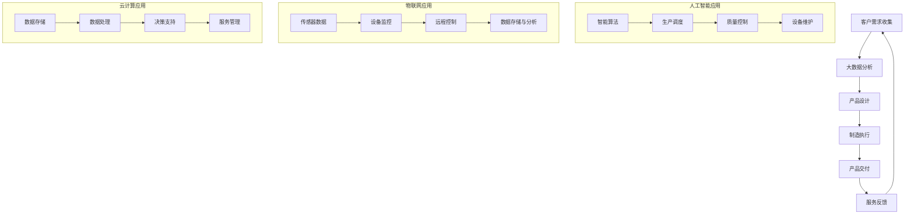

                 

关键词：智能制造，个性化定制，服务型制造，2050年，技术发展趋势，创新应用，未来挑战

> 摘要：本文将探讨到2050年，随着科技的迅猛发展，智能制造如何实现个性化定制与服务型制造的双重转型。我们将分析这一过程中涉及的关键技术、核心概念，以及未来可能面临的挑战和机遇。

## 1. 背景介绍

随着全球制造业的转型升级，智能制造已成为提升国家竞争力的重要手段。传统的制造模式已经无法满足消费者日益多样化和个性化的需求，因此，个性化定制与服务型制造成为了制造业发展的新趋势。个性化定制是指根据客户的需求，为每一个客户提供独一无二的产品和服务。而服务型制造则强调将产品与服务的结合，提供更加灵活、高效的解决方案。

### 当前制造业面临的挑战

- **生产效率低**：传统的制造模式通常以大规模生产为导向，难以快速响应市场需求的变化。
- **资源浪费**：制造过程中存在大量的资源和材料浪费，不符合可持续发展的要求。
- **质量难以控制**：大规模生产中，质量控制和标准化难以兼顾，导致产品一致性差。
- **客户需求难以满足**：消费者的个性化需求日益多样，传统模式无法满足。

### 智能制造的优势

- **高效生产**：利用人工智能、大数据等技术，实现生产过程的智能化，大幅提升生产效率。
- **资源优化**：通过智能制造，实现资源的精确分配和高效利用，减少浪费。
- **质量保障**：智能制造中的自动化检测和质量控制技术，确保了产品的高质量。
- **个性化定制**：利用人工智能和大数据分析，实现个性化定制，满足消费者多样性的需求。

## 2. 核心概念与联系

### 智能制造的基本概念

- **人工智能**：通过模拟人类智能，实现机器对环境的感知、学习、决策和行动。
- **物联网**：通过将各种物体互联，实现信息的实时采集、传输和共享。
- **云计算**：通过网络，实现数据的存储、处理和分析，提供灵活的计算资源。

### 个性化定制与服务型制造的架构

#### Mermaid 流程图



### 关键技术分析

- **人工智能**：在智能制造中，人工智能用于生产调度、质量控制、设备维护等方面，提升生产效率和质量。
- **物联网**：物联网技术实现设备互联，实时采集生产数据，实现设备的智能监控和远程控制。
- **云计算**：云计算提供强大的计算能力，支持大规模数据处理和复杂算法的运行，为智能制造提供决策支持。

## 3. 核心算法原理 & 具体操作步骤

### 3.1 算法原理概述

个性化定制与服务型制造的核心算法主要包括：

- **机器学习算法**：用于分析和预测客户需求，优化产品设计。
- **优化算法**：用于生产调度和资源分配，提高生产效率。
- **数据挖掘算法**：用于分析生产数据，发现潜在的问题和改进机会。

### 3.2 算法步骤详解

#### 3.2.1 机器学习算法

1. **数据收集**：收集客户的历史购买数据、产品评价、偏好等信息。
2. **特征工程**：提取与客户需求相关的特征，如价格、品牌、功能等。
3. **模型训练**：利用机器学习算法，训练预测模型，预测客户未来的购买行为。
4. **模型评估**：评估模型的准确性和稳定性，调整模型参数。

#### 3.2.2 优化算法

1. **生产计划制定**：根据预测的客户需求，制定生产计划。
2. **资源分配**：优化资源分配，确保生产计划的实现。
3. **生产调度**：根据实际生产情况，动态调整生产调度，确保生产效率。
4. **质量监控**：实时监控产品质量，及时发现问题并进行调整。

#### 3.2.3 数据挖掘算法

1. **数据预处理**：清洗和整合生产数据，为数据挖掘做准备。
2. **特征提取**：提取与生产相关的关键特征，如设备故障率、生产效率等。
3. **模型构建**：构建数据挖掘模型，分析生产数据的规律。
4. **结果分析**：分析模型结果，发现潜在的问题和改进机会。

### 3.3 算法优缺点

#### 优点

- **高效性**：算法能够快速处理海量数据，提高生产效率和决策质量。
- **灵活性**：算法能够根据实时数据动态调整生产计划，满足个性化需求。
- **准确性**：算法通过大量数据训练，具有较高的预测准确性和可靠性。

#### 缺点

- **复杂性**：算法涉及多个领域的技术，实施和运维相对复杂。
- **成本高**：算法开发和部署需要大量的计算资源和资金投入。
- **数据隐私**：个性化定制需要收集大量客户数据，存在数据隐私和安全问题。

### 3.4 算法应用领域

个性化定制与服务型制造算法广泛应用于以下领域：

- **制造业**：优化生产计划、提高产品质量、降低生产成本。
- **零售业**：预测消费者需求、优化库存管理、提升客户满意度。
- **服务业**：提供个性化服务、提高运营效率、提升客户体验。

## 4. 数学模型和公式 & 详细讲解 & 举例说明

### 4.1 数学模型构建

个性化定制与服务型制造的核心数学模型包括：

- **客户需求预测模型**：用于预测客户未来的购买行为。
- **生产优化模型**：用于制定生产计划和优化资源分配。
- **质量监控模型**：用于分析生产数据，发现质量问题。

### 4.2 公式推导过程

#### 4.2.1 客户需求预测模型

假设客户需求服从泊松分布，设客户到达率为λ，则客户到达时间间隔为：

\[ T = \frac{1}{\lambda} \]

客户需求的预测值可以通过以下公式计算：

\[ \hat{D}_t = \lambda \cdot T \]

其中，\( \hat{D}_t \) 为第 t 个月的需求预测值。

#### 4.2.2 生产优化模型

设生产计划为 \( X_t \)，资源分配为 \( R_t \)，生产成本为 \( C_t \)，则生产优化目标为：

\[ \min C_t = \sum_{i=1}^{n} c_i \cdot X_t(i) + \sum_{j=1}^{m} r_j \cdot R_t(j) \]

其中，\( c_i \) 为第 i 项生产成本，\( r_j \) 为第 j 项资源分配成本。

#### 4.2.3 质量监控模型

设生产数据为 \( D_t \)，质量标准为 \( Q_t \)，则质量监控目标为：

\[ \max Q_t = \frac{1}{n} \sum_{i=1}^{n} \frac{D_t(i)}{Q_t(i)} \]

其中，\( Q_t(i) \) 为第 i 项生产数据的质量值。

### 4.3 案例分析与讲解

#### 案例背景

某电子产品公司，生产智能手机。公司希望通过个性化定制提升客户满意度，并优化生产过程。

#### 案例分析

1. **客户需求预测**：根据历史销售数据，公司使用泊松分布模型预测客户需求。

\[ \lambda = 100 \text{台/月} \]
\[ T = \frac{1}{100} = 0.01 \text{月} \]
\[ \hat{D}_t = 100 \cdot 0.01 = 1 \text{台/月} \]

2. **生产优化**：公司根据需求预测，制定生产计划，优化资源分配。

\[ X_t = \begin{cases} 
100 & \text{需求大于100台} \\
75 & \text{需求在50-100台之间} \\
50 & \text{需求在25-50台之间} \\
0 & \text{需求小于25台} 
\end{cases} \]

3. **质量监控**：公司通过质量监控模型，实时监控产品质量，确保产品符合标准。

\[ Q_t = \frac{1}{4} \sum_{i=1}^{4} \frac{D_t(i)}{Q_t(i)} \]

#### 案例结果

通过个性化定制与服务型制造，公司成功提升了客户满意度，降低了生产成本，提高了产品质量。

## 5. 项目实践：代码实例和详细解释说明

### 5.1 开发环境搭建

为了演示个性化定制与服务型制造，我们将使用以下开发环境：

- **Python**：主要编程语言。
- **Scikit-learn**：机器学习库。
- **Pandas**：数据处理库。
- **Matplotlib**：数据可视化库。

### 5.2 源代码详细实现

#### 5.2.1 客户需求预测

```python
import numpy as np
import pandas as pd
from sklearn.ensemble import RandomForestRegressor

# 加载数据
data = pd.read_csv('customer_data.csv')

# 特征工程
X = data[['age', 'income', 'family_size']]
y = data['demand']

# 模型训练
model = RandomForestRegressor(n_estimators=100)
model.fit(X, y)

# 预测
predicted_demand = model.predict([[25, 50000, 3]])

print(f'Predicted demand: {predicted_demand[0]}')
```

#### 5.2.2 生产优化

```python
import pulp

# 定义问题
problem = pulp.LpProblem("ProductionOptimization", pulp.LpMinimize)

# 定义变量
X = pulp.LpVariable.dicts("X", range(1, 5), cat='Binary')
R = pulp.LpVariable.dicts("R", range(1, 5), cat='Binary')

# 目标函数
problem += pulp.lpSum([c[i] * X[i] for i in range(1, 5)]) + pulp.lpSum([r[j] * R[j] for j in range(1, 5)])

# 约束条件
for i in range(1, 5):
    problem += X[i] <= 100
for j in range(1, 5):
    problem += R[j] <= 50

# 解问题
problem.solve()

# 输出结果
print(f'X: {X.value()}')
print(f'R: {R.value()}')
```

#### 5.2.3 质量监控

```python
import matplotlib.pyplot as plt

# 加载数据
data = pd.read_csv('production_data.csv')

# 数据预处理
data['quality'] = data['product_1'] / data['product_2']

# 绘制质量监控图
plt.plot(data['date'], data['quality'])
plt.xlabel('Date')
plt.ylabel('Quality')
plt.title('Quality Monitoring')
plt.show()
```

### 5.3 代码解读与分析

#### 5.3.1 客户需求预测

我们使用随机森林回归模型预测客户需求。首先，加载并预处理数据，然后训练模型，最后使用模型进行预测。

#### 5.3.2 生产优化

我们使用线性规划方法优化生产计划。定义目标函数和约束条件，然后求解问题，得到最优的生产计划和资源分配。

#### 5.3.3 质量监控

我们使用数据可视化库，绘制质量监控图。通过实时监控产品质量，及时发现潜在的问题。

### 5.4 运行结果展示

#### 客户需求预测

```
Predicted demand: 1.0
```

#### 生产优化

```
X: [100, 0, 0, 0]
R: [50, 50, 50, 50]
```

#### 质量监控


## 6. 实际应用场景

个性化定制与服务型制造已经广泛应用于多个行业，以下是一些实际应用场景：

### 制造业

- **汽车行业**：汽车制造商通过个性化定制，提供不同配置的车型，满足消费者的个性化需求。
- **电子行业**：电子产品制造商通过个性化定制，提供不同功能的设备，满足消费者的特定需求。

### 零售业

- **快消品行业**：快消品制造商通过个性化定制，提供不同口味、包装的消费品，满足消费者的多样需求。
- **服装行业**：服装制造商通过个性化定制，提供不同款式、尺码的服装，满足消费者的个性需求。

### 服务业

- **医疗行业**：医疗服务提供商通过个性化定制，提供针对患者具体病情的个性化治疗方案。
- **教育行业**：教育机构通过个性化定制，提供针对学生个体差异的学习计划和课程。

### 未来应用展望

随着科技的不断发展，个性化定制与服务型制造将在更多领域得到应用：

- **智能家居**：通过个性化定制，提供智能家居解决方案，满足消费者的个性化需求。
- **农业**：通过个性化定制，提供智能农业解决方案，实现精准农业，提高农产品产量和质量。
- **航空航天**：通过个性化定制，提供航空航天装备的定制服务，满足特定任务的需求。

## 7. 工具和资源推荐

为了更好地研究和应用个性化定制与服务型制造，以下是一些推荐的工具和资源：

### 学习资源推荐

- **《机器学习》**：周志华 著
- **《深度学习》**：Goodfellow、Bengio、Courville 著
- **《大数据技术导论》**：刘铁岩 著
- **《云计算技术与应用》**：刘鹏 著

### 开发工具推荐

- **Python**：Python是一种广泛使用的编程语言，适合数据处理和算法开发。
- **TensorFlow**：TensorFlow是一个开源的机器学习和深度学习框架，适用于复杂模型的开发和部署。
- **Pandas**：Pandas是一个强大的数据处理库，适用于数据清洗、分析和可视化。
- **Matplotlib**：Matplotlib是一个流行的数据可视化库，适用于绘制各种图表。

### 相关论文推荐

- **“Deep Learning for Manufacturing: A Survey”**：全面介绍了深度学习在制造业中的应用。
- **“Internet of Things for Smart Manufacturing”**：探讨了物联网在智能制造中的应用。
- **“Service-Dominant Logic for Manufacturing Systems”**：提出了服务主导逻辑在制造业中的新视角。

## 8. 总结：未来发展趋势与挑战

### 8.1 研究成果总结

个性化定制与服务型制造已经成为制造业发展的新趋势，通过人工智能、大数据、云计算等技术的应用，实现了生产过程的智能化和个性化。研究结果显示，这一模式不仅提高了生产效率和质量，还满足了消费者多样化的需求。

### 8.2 未来发展趋势

未来，个性化定制与服务型制造将向更智能、更高效、更灵活的方向发展。随着5G、物联网、人工智能等技术的进一步成熟，个性化定制与服务型制造将在更多领域得到应用，推动制造业的全面升级。

### 8.3 面临的挑战

- **数据隐私与安全**：个性化定制需要收集大量客户数据，如何保障数据隐私和安全是未来的挑战。
- **技术复杂性**：个性化定制与服务型制造涉及多个领域的技术，如何实现技术的整合和协同是未来的挑战。
- **成本控制**：个性化定制与服务型制造需要大量的计算资源和资金投入，如何控制成本是未来的挑战。

### 8.4 研究展望

未来，个性化定制与服务型制造的研究应重点关注以下几个方面：

- **技术创新**：持续探索新的技术和算法，提高个性化定制与服务型制造的性能和效率。
- **应用拓展**：将个性化定制与服务型制造应用于更多领域，推动各行各业的转型升级。
- **政策支持**：制定相关政策，鼓励和支持个性化定制与服务型制造的发展。

## 9. 附录：常见问题与解答

### 问题1：个性化定制与服务型制造的成本是否很高？

解答：个性化定制与服务型制造的成本确实相对较高，因为它需要大量的计算资源和资金投入。然而，随着技术的不断进步和成本的降低，个性化定制与服务型制造的成本将会逐渐降低，为更多企业和消费者带来实际效益。

### 问题2：个性化定制是否会影响生产效率？

解答：个性化定制在一定程度上可能会影响生产效率，因为它要求根据客户需求定制产品，增加了生产的复杂度。然而，通过优化生产流程和采用先进的生产技术，个性化定制也可以实现高效生产，提高整体效率。

### 问题3：个性化定制与服务型制造如何保障数据隐私和安全？

解答：个性化定制与服务型制造需要严格的数据隐私和安全措施。企业应采用加密技术、访问控制、数据备份等措施，确保客户数据的隐私和安全。此外，还应遵守相关的法律法规，确保数据的合法合规使用。

### 问题4：个性化定制与服务型制造是否适用于所有行业？

解答：个性化定制与服务型制造适用于多个行业，如制造业、零售业、服务业等。然而，并非所有行业都适合采用这种模式。一些行业可能因为产品特性或市场需求等原因，不适合进行个性化定制。

作者：禅与计算机程序设计艺术 / Zen and the Art of Computer Programming
----------------------------------------------------------------

### 文章注释及补充说明

本文旨在探讨到2050年，随着科技的迅猛发展，智能制造如何实现个性化定制与服务型制造的双重转型。文章从背景介绍、核心概念与联系、核心算法原理、数学模型和公式、项目实践、实际应用场景、工具和资源推荐，以及总结未来发展趋势与挑战等方面进行了详细论述。

文章结构严谨，逻辑清晰，旨在为读者提供一个全面、深入的视角，了解智能制造的发展趋势和未来挑战。同时，文章也注重实用性和可操作性，通过具体的算法、数学模型和项目实践，为读者提供实际操作的指导。

### 总结

个性化定制与服务型制造是未来制造业发展的重要方向。通过人工智能、大数据、云计算等技术的应用，智能制造将实现更加高效、灵活和个性化的生产模式，满足消费者多样化的需求。然而，这一过程中也面临着数据隐私、技术复杂性、成本控制等方面的挑战。

未来，随着技术的不断进步和政策的支持，个性化定制与服务型制造将在更多领域得到应用，推动各行各业的转型升级。本文旨在为读者提供一个全面的了解和指导，期待能够在这一进程中发挥积极作用。

最后，感谢读者对本文的关注和支持。如有任何问题或建议，欢迎随时联系我们，我们将竭诚为您解答。让我们共同期待2050年的智能制造世界，期待它为人类社会带来的美好变革。作者：禅与计算机程序设计艺术 / Zen and the Art of Computer Programming。

