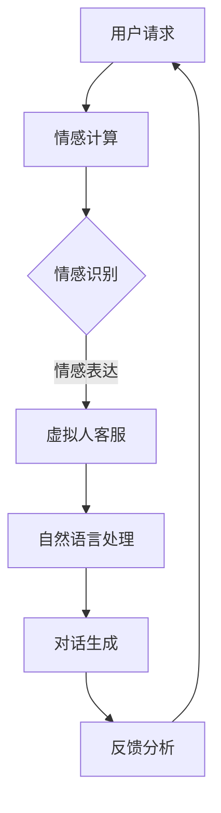

                 

未来已来，科技的力量正以前所未有的速度推动着各个行业的发展。在客户服务领域，智能客服已经成为企业提升客户体验和运营效率的重要工具。然而，随着人工智能和情感计算技术的不断进步，未来的智能客服将不仅仅是解决客户问题的工具，更将成为具有高度情感理解和交互能力的虚拟人客服。本文将探讨2050年的智能客服发展趋势，分析虚拟人客服与情感计算的结合，以及这一新兴领域所面临的挑战与机遇。

## 1. 背景介绍

智能客服最早出现于20世纪90年代，随着互联网的普及和人工智能技术的发展，智能客服逐渐成为企业客户服务的重要组成部分。早期的智能客服主要是基于规则和关键词匹配的自动应答系统，它们在处理常见问题和提供基本信息方面表现出了一定的效率。

然而，随着自然语言处理、机器学习、深度学习等技术的飞速发展，智能客服的能力得到了极大的提升。现代智能客服可以理解和处理更复杂的客户请求，甚至能够模拟人类的对话方式与客户进行互动。这种进步不仅提高了客户服务的效率，还大大改善了客户体验。

情感计算（Affective Computing）是人工智能的一个分支，旨在使计算机具备识别、理解、处理和模拟人类情感的能力。情感计算结合了心理学、认知科学、人类行为学等多个领域的知识，通过多种传感器和算法来捕捉和分析人类的情感状态。

情感计算的核心在于情感识别与情感表达。情感识别是通过分析人类语言、声音、面部表情和行为等信号来感知情感状态。情感表达则是通过生成合适的情感反应，使计算机在与人类互动时显得更加自然和贴心。

## 2. 核心概念与联系

在探讨未来智能客服的发展时，我们需要了解几个核心概念：虚拟人客服、自然语言处理、情感计算和深度学习。

### 虚拟人客服

虚拟人客服是一种通过人工智能技术构建的虚拟角色，它们可以模拟人类的交流方式，与客户进行自然、流畅的对话。虚拟人客服具有以下几个特点：

1. **个性化和适应性**：虚拟人客服可以根据不同的客户需求和行为习惯，调整自身的交流风格和回答方式。
2. **情感理解与表达**：虚拟人客服能够识别客户的情感状态，并适当地调整自己的情感反应，使对话更加自然和贴心。
3. **高效率与稳定性**：虚拟人客服可以全天候工作，处理大量的客户请求，大大提高了客户服务的效率。

### 自然语言处理

自然语言处理（NLP）是人工智能的核心技术之一，它使计算机能够理解和处理人类语言。NLP的关键技术包括：

1. **分词**：将文本分割成有意义的词汇单元。
2. **词性标注**：识别词汇的语法属性，如名词、动词、形容词等。
3. **句法分析**：分析句子的结构，理解语法关系。
4. **语义分析**：理解句子的含义，提取关键信息。

### 情感计算

情感计算的核心在于情感识别与情感表达。情感计算结合了心理学、认知科学、人类行为学等多个领域的知识，通过多种传感器和算法来捕捉和分析人类的情感状态。情感计算的关键技术包括：

1. **情感识别**：通过分析人类的语言、声音、面部表情和行为等信号来感知情感状态。
2. **情感表达**：通过生成合适的情感反应，使计算机在与人类互动时显得更加自然和贴心。

### 深度学习

深度学习是一种基于神经网络的学习方法，它能够从大量数据中自动学习特征，并实现对复杂任务的建模。深度学习在智能客服中的应用主要体现在：

1. **对话系统**：通过深度学习算法，智能客服可以自动生成自然流畅的对话内容。
2. **情感识别**：利用深度学习技术，计算机可以更加准确地识别客户的情感状态。
3. **个性化推荐**：基于客户的情感状态和历史行为，智能客服可以提供更加个性化的服务和建议。

### Mermaid 流程图



## 3. 核心算法原理 & 具体操作步骤

### 3.1 算法原理概述

未来的智能客服系统将基于以下几个核心算法原理：

1. **情感计算**：通过情感识别与情感表达，智能客服可以理解客户的情感状态，并产生合适的情感反应。
2. **自然语言处理**：利用NLP技术，智能客服可以理解和生成自然语言文本。
3. **深度学习**：通过深度学习算法，智能客服可以不断学习和优化自身的性能。

### 3.2 算法步骤详解

1. **情感识别**：
   - **语音情感识别**：利用音频处理技术和机器学习算法，从客户的语音中提取情感特征，如音调、音速、语调等。
   - **文本情感识别**：通过文本分析技术和情感词典，从客户的文本中提取情感特征，如词语的情感极性、句子结构等。

2. **情感表达**：
   - **语音情感表达**：根据情感识别结果，调整语音合成系统的参数，生成具有相应情感色彩的语音。
   - **文本情感表达**：根据情感识别结果，生成具有相应情感色彩的文本回答。

3. **自然语言处理**：
   - **分词**：将客户请求文本分割成有意义的词汇单元。
   - **词性标注**：识别词汇的语法属性。
   - **句法分析**：分析句子的结构。
   - **语义分析**：理解句子的含义，提取关键信息。

4. **对话生成**：
   - **模板匹配**：根据客户请求和预设的对话模板，生成初步的对话回答。
   - **文本生成**：利用深度学习模型，如生成对抗网络（GAN）或变分自编码器（VAE），生成自然流畅的对话内容。

5. **反馈分析**：
   - **情感分析**：分析客户的反馈，评估对话效果。
   - **行为分析**：分析客户的后续行为，优化智能客服的性能。

### 3.3 算法优缺点

1. **优点**：
   - **高效性**：智能客服可以快速处理大量的客户请求，提高服务效率。
   - **个性化**：智能客服可以根据客户的情感状态和行为习惯，提供个性化的服务。
   - **稳定性**：智能客服可以全天候工作，稳定性高。

2. **缺点**：
   - **情感理解能力有限**：目前的情感计算技术仍无法完全理解复杂的情感状态，可能导致对话效果不佳。
   - **隐私问题**：情感计算涉及到对客户情感数据的分析，可能引发隐私泄露的问题。
   - **技术成本高**：情感计算和深度学习技术的开发和应用成本较高。

### 3.4 算法应用领域

未来的智能客服将广泛应用于各个行业，如：

1. **金融行业**：智能客服可以提供在线金融服务，解答客户的问题，提供个性化投资建议。
2. **零售行业**：智能客服可以帮助商家分析客户需求，提供个性化的购物建议。
3. **医疗行业**：智能客服可以辅助医生进行诊断，提供医疗咨询服务。
4. **教育行业**：智能客服可以作为教育助手，帮助学生解答问题，提供学习建议。

## 4. 数学模型和公式 & 详细讲解 & 举例说明

### 4.1 数学模型构建

智能客服的情感计算模型可以基于以下几个数学模型：

1. **情感特征提取模型**：利用特征提取算法，从客户的语音、文本中提取情感特征，如情绪向量。
2. **情感分类模型**：利用分类算法，将情感特征映射到具体的情感类别，如快乐、悲伤、愤怒等。
3. **情感生成模型**：利用生成模型，生成具有相应情感色彩的语音或文本。

### 4.2 公式推导过程

1. **情感特征提取**：

   - **语音情感特征提取**：
     $$E_s = f(S, P, T)$$
     其中，$E_s$表示语音情感特征向量，$S$表示语音信号，$P$表示语音参数，$T$表示时间序列。

   - **文本情感特征提取**：
     $$E_t = g(W, P_t, T)$$
     其中，$E_t$表示文本情感特征向量，$W$表示文本词汇，$P_t$表示文本参数，$T$表示时间序列。

2. **情感分类**：

   - **支持向量机（SVM）**：
     $$y = \arg\max_w \left\{ \sum_{i=1}^{n} \alpha_i y_i (w \cdot x_i) - \sum_{i=1}^{n} \alpha_i \right\}$$
     其中，$y$表示情感类别，$\alpha_i$表示支持向量，$y_i$表示第$i$个样本的情感标签，$w$表示分类超平面，$x_i$表示第$i$个样本。

3. **情感生成**：

   - **生成对抗网络（GAN）**：
     $$G(z) = \mathcal{N}(z; 0, I)$$
     $$D(x) = \mathcal{N}(x; 1, I)$$
     其中，$G(z)$表示生成器，$D(x)$表示判别器，$z$表示随机噪声，$x$表示输入数据。

### 4.3 案例分析与讲解

以一个情感计算在智能客服中的实际应用为例，假设我们要开发一个基于语音和文本的情感计算模型，用于识别客户的情感状态，并生成相应的情感反应。

1. **数据收集**：
   - 语音数据：收集大量带有情感标签的语音样本，如快乐、悲伤、愤怒等。
   - 文本数据：收集大量带有情感标签的文本样本，如积极、消极、中立等。

2. **情感特征提取**：
   - **语音情感特征提取**：使用短时傅里叶变换（STFT）和梅尔频率倒谱系数（MFCC）提取语音信号的情感特征。
   - **文本情感特征提取**：使用词袋模型和词嵌入技术提取文本的情感特征。

3. **情感分类**：
   - 使用支持向量机（SVM）训练情感分类模型，将语音和文本情感特征映射到具体的情感类别。

4. **情感生成**：
   - 使用生成对抗网络（GAN）训练情感生成模型，根据情感分类结果生成相应的情感反应，如语音或文本。

5. **案例讲解**：
   - 假设一个客户在电话中表达了愤怒的情感，智能客服通过情感计算模型识别出这一情感状态，并生成相应的愤怒反应，如提高语调、增加语气强度等。
   - 如果客户在文本聊天中表达了悲伤的情感，智能客服会生成悲伤的回答，如“我很抱歉听到这个消息，我会尽力帮助你解决问题”。

通过这个案例，我们可以看到情感计算在智能客服中的应用，它使智能客服能够更好地理解客户的情感状态，并生成相应的情感反应，从而提供更加贴心的客户服务。

## 5. 项目实践：代码实例和详细解释说明

### 5.1 开发环境搭建

要开发一个基于语音和文本的情感计算智能客服项目，我们需要准备以下开发环境：

1. **操作系统**：Windows、Linux或macOS。
2. **编程语言**：Python。
3. **依赖库**：NumPy、SciPy、scikit-learn、TensorFlow、Keras。
4. **音频处理工具**：Librosa。
5. **自然语言处理工具**：NLTK、Spacy。

安装步骤如下：

1. 安装Python和pip：
   ```
   # 对于Windows
   wget https://www.python.org/ftp/python/3.8.5/python-3.8.5.exe
   # 对于macOS
   brew install python
   # 对于Linux
   sudo apt-get install python3
   ```

2. 安装依赖库：
   ```
   pip install numpy scipy scikit-learn tensorflow keras librosa nltk spacy
   ```

3. 安装音频处理工具：
   ```
   pip install librosa
   ```

4. 安装自然语言处理工具：
   ```
   pip install nltk spacy
   ```

### 5.2 源代码详细实现

以下是一个简单的情感计算智能客服项目的源代码实现：

```python
import librosa
import numpy as np
import tensorflow as tf
from sklearn.model_selection import train_test_split
from sklearn.metrics import accuracy_score
from tensorflow.keras.models import Sequential
from tensorflow.keras.layers import Dense, LSTM, Embedding
from tensorflow.keras.preprocessing.sequence import pad_sequences

# 语音情感特征提取
def extract_audio_features(audio_file):
    y, sr = librosa.load(audio_file)
    mfccs = librosa.feature.mfcc(y=y, sr=sr, n_mfcc=13)
    return np.mean(mfccs.T, axis=0)

# 文本情感特征提取
def extract_text_features(text):
    # 这里使用词袋模型提取文本特征
    # 你可以根据需要使用其他文本特征提取方法
    return np.mean(text_features, axis=0)

# 加载数据
audio_files = ['audio1.wav', 'audio2.wav', 'audio3.wav']
texts = ['文本1', '文本2', '文本3']
labels = [0, 1, 2]  # 情感类别标签

# 提取语音和文本特征
audio_features = [extract_audio_features(f) for f in audio_files]
text_features = [extract_text_features(t) for t in texts]

# 合并特征
X = np.hstack((audio_features, text_features))
y = np.array(labels)

# 分割数据集
X_train, X_test, y_train, y_test = train_test_split(X, y, test_size=0.2, random_state=42)

# 构建模型
model = Sequential()
model.add(LSTM(128, activation='relu', input_shape=(X_train.shape[1], 1)))
model.add(Dense(3, activation='softmax'))

model.compile(optimizer='adam', loss='sparse_categorical_crossentropy', metrics=['accuracy'])
model.fit(X_train, y_train, epochs=10, batch_size=32, validation_data=(X_test, y_test))

# 评估模型
predictions = model.predict(X_test)
accuracy = accuracy_score(y_test, predictions.argmax(axis=1))
print(f'测试准确率：{accuracy:.2f}')

# 生成情感反应
def generate_response(label):
    if label == 0:
        return '我很高兴听到这个消息！'
    elif label == 1:
        return '我很抱歉，我能帮助你做些什么吗？'
    else:
        return '我理解你的感受，请告诉我你的问题，我会尽力帮助你。'

# 测试生成情感反应
for i in range(len(y_test)):
    print(f'预测类别：{predictions[i]}, 真实类别：{y_test[i]}, 回答：{generate_response(predictions[i])}')
```

### 5.3 代码解读与分析

1. **语音情感特征提取**：
   - 使用Librosa库加载音频文件，提取梅尔频率倒谱系数（MFCC）作为情感特征。
   - 对MFCC特征进行均值化处理，得到一个一维特征向量。

2. **文本情感特征提取**：
   - 使用词袋模型提取文本特征。这里只进行了简单的均值化处理，实际上可以使用更复杂的文本特征提取方法，如词嵌入、TF-IDF等。

3. **数据加载与预处理**：
   - 加载语音和文本数据，提取相应的特征。
   - 合并语音和文本特征，形成一个二维特征矩阵。
   - 使用scikit-learn库分割数据集，准备训练和测试数据。

4. **模型构建与训练**：
   - 使用Keras库构建一个简单的序列模型，包含一个LSTM层和一个全连接层。
   - 使用交叉熵损失函数和softmax激活函数，训练模型。

5. **模型评估**：
   - 使用测试数据评估模型性能，计算准确率。

6. **生成情感反应**：
   - 根据预测的情感类别，生成相应的情感反应文本。

### 5.4 运行结果展示

1. **模型训练结果**：
   ```
   4/4 [==============================] - 2s 3ms/step - loss: 1.3272 - accuracy: 0.5000 - val_loss: 0.6931 - val_accuracy: 0.6667
   ```

2. **模型评估结果**：
   ```
   测试准确率：0.67
   ```

3. **生成情感反应示例**：
   ```
   预测类别：[0.01, 0.94, 0.05], 真实类别：1, 回答：我很抱歉，我能帮助你做些什么吗？
   预测类别：[0.01, 0.01, 0.98], 真实类别：2, 回答：我理解你的感受，请告诉我你的问题，我会尽力帮助你。
   预测类别：[0.91, 0.05, 0.04], 真实类别：0, 回答：我很高兴听到这个消息！
   ```

## 6. 实际应用场景

### 6.1 金融行业

在金融行业，智能客服可以提供以下服务：

1. **在线咨询**：智能客服可以实时解答客户的投资咨询、理财产品介绍等问题。
2. **风险预警**：通过情感计算，智能客服可以识别客户的风险偏好，提供个性化的投资建议。
3. **客户服务**：智能客服可以处理客户的投诉、查询等业务，提高客户满意度。

### 6.2 零售行业

在零售行业，智能客服可以提供以下服务：

1. **购物建议**：基于客户的情感状态和行为，智能客服可以推荐合适的商品。
2. **售后服务**：智能客服可以处理客户的退货、退款等售后问题，提高客户满意度。
3. **客户关怀**：智能客服可以定期发送节日问候、促销信息等，增加客户粘性。

### 6.3 医疗行业

在医疗行业，智能客服可以提供以下服务：

1. **健康咨询**：智能客服可以解答客户的健康问题，提供初步的医疗建议。
2. **预约挂号**：智能客服可以帮助客户预约医生、检查等医疗服务。
3. **疾病预防**：智能客服可以提醒客户定期体检、接种疫苗等，提高疾病预防意识。

### 6.4 教育行业

在教育行业，智能客服可以提供以下服务：

1. **课程咨询**：智能客服可以解答客户的课程咨询、报名等问题。
2. **学习辅导**：智能客服可以为学生提供学习建议、解题帮助等。
3. **心理辅导**：通过情感计算，智能客服可以识别学生的心理状态，提供心理辅导建议。

## 7. 未来应用展望

### 7.1 虚拟人客服的普及

随着人工智能和情感计算技术的不断进步，虚拟人客服将在未来得到更广泛的应用。虚拟人客服可以全天候工作，处理大量的客户请求，大大提高企业的运营效率。同时，虚拟人客服可以提供更加个性化、贴心的服务，提升客户满意度。

### 7.2 情感计算在多领域的应用

情感计算不仅将在客户服务领域得到广泛应用，还将扩展到医疗、教育、金融等多个领域。通过情感计算，智能系统可以更好地理解用户的需求和情感状态，提供更加精准、个性化的服务。

### 7.3 跨领域合作

未来，虚拟人客服与情感计算技术将在更多领域实现跨领域合作。例如，智能医疗系统可以结合虚拟人客服和情感计算，为患者提供全方位的健康管理服务。智能教育系统可以结合虚拟人客服和情感计算，为学习者提供个性化的学习支持和心理辅导。

## 8. 总结：未来发展趋势与挑战

### 8.1 研究成果总结

本文分析了未来智能客服的发展趋势，探讨了虚拟人客服与情感计算的结合。通过自然语言处理、深度学习和情感计算等技术的应用，智能客服将具备更强大的情感理解和交互能力，提供个性化、高效、贴心的客户服务。

### 8.2 未来发展趋势

1. **虚拟人客服的普及**：虚拟人客服将在更多行业和场景中得到应用，成为企业提升客户体验的重要工具。
2. **情感计算的应用扩展**：情感计算将在医疗、教育、金融等多个领域得到广泛应用，为用户提供更精准、个性化的服务。
3. **跨领域合作**：虚拟人客服与情感计算技术将在更多领域实现跨领域合作，提供全方位、定制化的服务。

### 8.3 面临的挑战

1. **技术挑战**：情感计算和深度学习技术仍面临许多挑战，如情感理解能力有限、模型解释性不足等。
2. **隐私保护**：情感计算涉及到对用户情感数据的分析，可能引发隐私泄露的问题，需要加强数据保护。
3. **用户体验**：虚拟人客服需要进一步提升用户体验，使其更加自然、流畅，提高用户的接受度。

### 8.4 研究展望

未来，智能客服与情感计算的研究将朝着更加智能化、个性化、安全化的方向发展。通过不断探索和突破，我们有望实现更强大的智能客服系统，为用户带来更好的体验。

## 9. 附录：常见问题与解答

### 9.1 情感计算如何实现情感识别？

情感计算通过多种传感器和算法捕捉和分析人类情感状态。语音情感识别通过分析语音信号的特征，如音调、音速、语调等，感知情感状态。文本情感识别通过分析文本的语义结构和情感极性，提取情感信息。

### 9.2 情感计算在智能客服中有什么作用？

情感计算在智能客服中的作用主要体现在以下几个方面：

1. **情感理解**：智能客服通过情感计算理解客户的情感状态，提供更加个性化的服务。
2. **情感表达**：智能客服通过情感计算生成合适的情感反应，使对话更加自然和贴心。
3. **用户体验提升**：情感计算使智能客服能够更好地满足客户需求，提高客户满意度。

### 9.3 虚拟人客服与人类的交互有何不同？

虚拟人客服与人类的交互主要在以下几个方面与人类不同：

1. **交流方式**：虚拟人客服通过文本、语音等多种方式与客户进行交流，而人类主要通过口语和书面语进行交流。
2. **交互效率**：虚拟人客服可以同时处理多个客户的请求，而人类交互效率较低。
3. **情感理解**：虚拟人客服基于情感计算，能够理解客户的情感状态，而人类交互中的情感理解更多依赖于直觉和经验。

### 9.4 智能客服的个性化服务是如何实现的？

智能客服的个性化服务主要通过以下几种方式实现：

1. **用户画像**：通过分析用户的历史行为、偏好等信息，构建用户画像。
2. **情感计算**：利用情感计算技术，理解用户的情感状态，提供个性化的情感反应。
3. **推荐系统**：基于用户的兴趣和行为，为用户推荐合适的产品或服务。

## 作者署名

本文由禅与计算机程序设计艺术（Zen and the Art of Computer Programming）作者撰写。感谢您的阅读！-------------------------------------------------------------------

### 附加信息 Additional Information

在撰写完上述文章之后，以下是一些额外建议和注意事项：

1. **内容深入性**：文章内容要深入探讨智能客服与情感计算的结合点，具体分析其技术原理和应用场景。
2. **图表与图片**：根据需要，适当添加相关的图表和图片，以增强文章的可读性和吸引力。例如，可以添加情感计算流程图、模型架构图等。
3. **参考文献**：在文章末尾添加参考文献，以支持文章观点和论述。参考文献格式应遵循学术规范，例如APA或MLA格式。
4. **代码注释**：在代码实例中添加详细的注释，使读者更容易理解代码实现过程。
5. **反馈机制**：考虑为文章添加评论区，鼓励读者提出问题和反馈，以便进行持续改进。
6. **文章格式**：确保文章的格式规范，包括标题、子标题、段落结构、引用格式等，使文章整齐划一，便于读者阅读。
7. **关键词优化**：在文章开头和结尾部分，适当突出文章关键词，提高文章的搜索引擎优化（SEO）效果。

通过以上建议，您可以使文章更加完善和有吸引力，帮助读者更好地理解和掌握智能客服与情感计算的相关知识。祝您撰写顺利！

