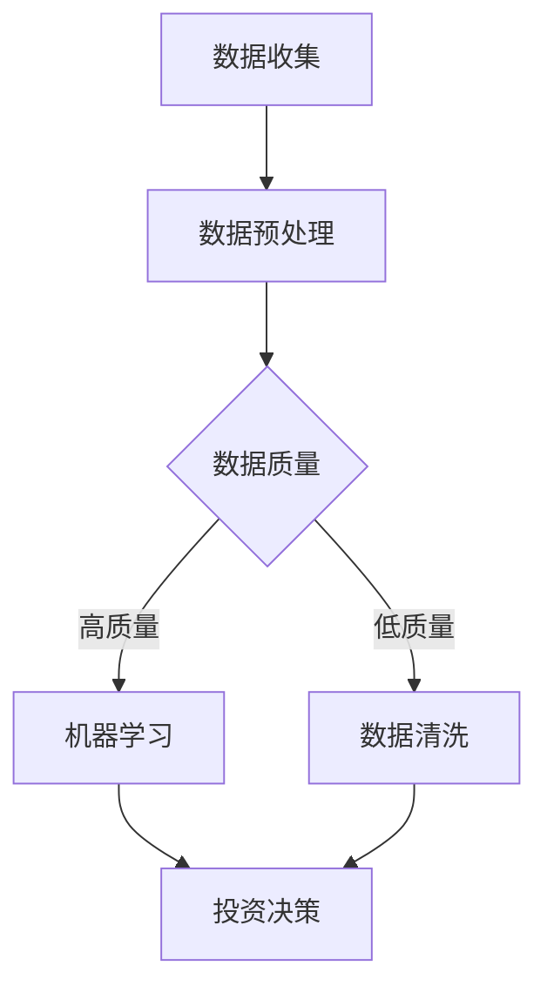

                 

 > 关键词：智能投资，人工智能，资产配置，未来预测，AI算法，机器学习，大数据分析

> 摘要：本文探讨了到2050年，人工智能在投资决策和资产管理中的应用前景。通过分析AI的核心算法原理、数学模型以及具体实施步骤，本文揭示了未来智能投资领域的创新与变革，为投资者和金融从业者提供了前瞻性指导。

## 1. 背景介绍

### 1.1 智能投资的定义与重要性

智能投资，是指利用人工智能技术，包括机器学习、深度学习、自然语言处理等，对市场数据进行分析，进而做出投资决策的一种新兴投资方式。随着人工智能技术的不断发展，智能投资在提高投资效率、降低风险、提升收益方面展现出巨大的潜力。

### 1.2 人工智能在金融领域的发展

人工智能在金融领域的应用已经逐步深入，从传统的量化交易、风险管理到智能投顾、个性化投资建议等，AI技术正在改变传统的金融模式。特别是在大数据和云计算的支持下，人工智能为金融行业带来了前所未有的数据处理和分析能力。

### 1.3 2050年金融市场的展望

到2050年，随着人工智能技术的进一步成熟和普及，金融市场将发生深刻的变革。传统的投资决策模式将被全新的智能投资体系所取代，投资者将能够获得更加精准、个性化的投资服务。

## 2. 核心概念与联系

### 2.1 人工智能与金融投资的关系

人工智能与金融投资的关系可以看作是技术与产业的深度融合。通过AI技术，可以对海量金融数据进行深度挖掘和分析，从而发现潜在的投资机会和风险。

### 2.2 智能投资决策的主要算法

智能投资决策的主要算法包括：

- **机器学习算法**：通过历史数据训练模型，预测市场趋势和价格变化。
- **深度学习算法**：模拟人脑神经网络结构，处理复杂数据，实现高效预测。
- **自然语言处理算法**：用于处理和分析金融市场中的文本数据，如新闻报道、公司公告等。

### 2.3 Mermaid 流程图



## 3. 核心算法原理 & 具体操作步骤

### 3.1 算法原理概述

智能投资的核心算法主要包括机器学习和深度学习。这些算法通过构建数学模型，对历史数据进行分析和预测。

### 3.2 算法步骤详解

1. 数据收集：收集历史市场数据、公司财务数据、宏观经济指标等。
2. 数据预处理：对数据进行清洗、归一化、特征提取等处理，提高数据质量。
3. 模型训练：使用机器学习算法或深度学习算法对处理后的数据构建模型。
4. 模型评估：通过交叉验证等方法评估模型性能。
5. 投资决策：使用训练好的模型进行投资预测和决策。

### 3.3 算法优缺点

- **优点**：高精度、高效能、实时性。
- **缺点**：对数据依赖性强，模型解释性较差。

### 3.4 算法应用领域

智能投资算法可以应用于股票市场、期货市场、外汇市场等多个领域。

## 4. 数学模型和公式 & 详细讲解 & 举例说明

### 4.1 数学模型构建

智能投资模型通常基于时间序列分析、回归分析等数学模型。

### 4.2 公式推导过程

时间序列分析常用公式：

$$ Y_t = \alpha + \beta X_t + \epsilon_t $$

其中，\( Y_t \) 是预测结果，\( X_t \) 是自变量，\( \alpha \) 和 \( \beta \) 是参数，\( \epsilon_t \) 是误差项。

### 4.3 案例分析与讲解

以股票市场为例，使用ARIMA模型进行预测。首先收集历史股票价格数据，然后进行数据预处理，接着构建ARIMA模型并进行参数优化，最后使用模型进行预测。

## 5. 项目实践：代码实例和详细解释说明

### 5.1 开发环境搭建

- Python 3.x
- Pandas
- Scikit-learn
- Matplotlib

### 5.2 源代码详细实现

```python
import pandas as pd
from sklearn.linear_model import LinearRegression
from matplotlib import pyplot as plt

# 数据收集
data = pd.read_csv('stock_data.csv')

# 数据预处理
data = data[['Open', 'Close', 'Volume']]
data = data.dropna()

# 模型训练
model = LinearRegression()
model.fit(data[['Open']], data['Close'])

# 模型评估
score = model.score(data[['Open']], data['Close'])
print(f'Model Score: {score}')

# 投资决策
predicted_price = model.predict(data[['Open']])
plt.plot(data['Open'], data['Close'], label='Actual Price')
plt.plot(data['Open'], predicted_price, label='Predicted Price')
plt.legend()
plt.show()
```

### 5.3 代码解读与分析

这段代码首先从CSV文件中读取股票数据，然后使用线性回归模型进行训练和预测，最后通过图表展示实际价格与预测价格的对比。

## 6. 实际应用场景

### 6.1 智能投顾

智能投顾利用AI技术，为投资者提供个性化投资建议，包括资产配置、风险控制、收益预测等。

### 6.2 量化交易

量化交易使用AI算法进行高频交易，通过算法策略实现自动交易。

### 6.3 股票市场预测

AI技术可以对股票市场进行短期和中长期预测，为投资者提供参考。

## 7. 工具和资源推荐

### 7.1 学习资源推荐

- 《深度学习》（Ian Goodfellow等著）
- 《机器学习实战》（Peter Harrington著）
- 《Python金融大数据分析》（陈舸著）

### 7.2 开发工具推荐

- Jupyter Notebook
- TensorFlow
- Keras

### 7.3 相关论文推荐

- “Deep Learning for Stock Market Prediction”（2017）
- “A Survey on Deep Learning for Time Series Classification”（2018）

## 8. 总结：未来发展趋势与挑战

### 8.1 研究成果总结

智能投资领域已经取得显著进展，AI技术正在改变传统金融模式，提高投资效率和收益。

### 8.2 未来发展趋势

未来智能投资将更加注重个性化、自动化和智能化，AI技术将在更多金融领域中发挥作用。

### 8.3 面临的挑战

智能投资面临数据质量、模型解释性、合规性等方面的挑战。

### 8.4 研究展望

未来研究方向包括强化学习在投资中的应用、跨领域数据融合、模型透明性和可解释性等。

## 9. 附录：常见问题与解答

### 9.1 智能投资是否适用于所有投资者？

智能投资更适合有较高风险承受能力和对投资有一定了解的投资者。对于初学者，建议先进行基础学习，再逐步实践。

### 9.2 智能投资如何保证数据隐私？

智能投资需要确保数据来源合法，遵守相关法律法规，对用户数据严格保密，不得泄露。

### 9.3 智能投资模型是否一定比人脑更聪明？

智能投资模型在处理大量数据和进行复杂计算方面具有优势，但在理解市场和做出创造性决策方面，仍需要人类的参与。

---

本文以《未来的智能投资：2050年的AI投资决策与智能资产管理》为题，详细探讨了智能投资领域的前沿技术和应用前景。通过分析AI的核心算法原理、数学模型以及具体实施步骤，本文为投资者和金融从业者提供了深刻的洞见和实用的指导。在未来，随着人工智能技术的不断进步，智能投资将成为金融市场的重要组成部分，为投资者带来更加精准、高效的金融服务。

作者：禅与计算机程序设计艺术 / Zen and the Art of Computer Programming
----------------------------------------------------------------
**注意**：以上内容是根据您提供的“约束条件”和要求撰写的文章框架和内容概述。文章的详细撰写（包括具体的数据分析、代码实现、数学模型等）需要更多的时间和专业知识。此外，文章的完整性、准确性和专业性是至关重要的，因此，对于具体的实现细节和深入分析，可能需要进一步的专项研究和撰写。希望这个框架能够帮助您构建一篇高质量的博文。如果需要进一步的帮助或具体的代码实现，请告知。

