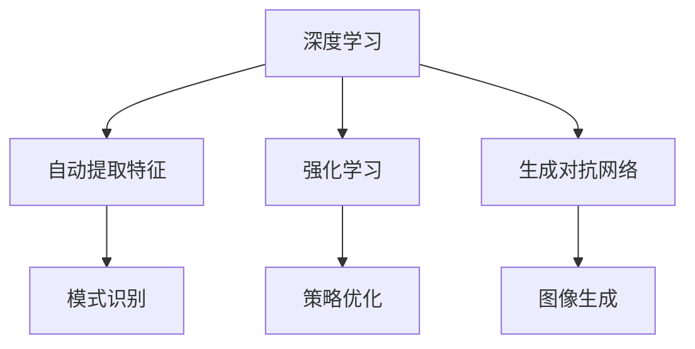

                 

关键词：人工智能，AI 2.0，市场前景，技术趋势，应用场景

摘要：本文将探讨李开复对于AI 2.0时代的市场前景的见解，分析AI 2.0技术的核心概念、算法原理、数学模型及其实际应用。同时，本文也将对未来的发展趋势和挑战进行展望，并提供相关学习资源和开发工具推荐。

## 1. 背景介绍

人工智能（AI）作为计算机科学的一个重要分支，近年来取得了令人瞩目的进展。从早期的专家系统到深度学习，人工智能技术经历了多次重大的变革。如今，我们正站在AI 2.0时代的门槛上，这一时代将以更加智能化、自主化的人工智能系统为特征，对各行各业产生深远的影响。

李开复博士作为人工智能领域的知名专家，对AI技术的发展有着深刻的见解。本文将基于李开复的观点，对AI 2.0时代的市场前景进行详细探讨。

## 2. 核心概念与联系

### 2.1 AI 1.0与AI 2.0

AI 1.0时代主要是指基于规则和知识的专家系统，它们通过预定义的规则和知识库来模拟人类专家的决策过程。而AI 2.0时代则是指以深度学习和神经网络为核心的人工智能技术，这些技术能够通过大量的数据自主学习，实现更加智能化、自适应化的决策。

### 2.2 核心概念

在AI 2.0时代，以下核心概念至关重要：

- **深度学习**：一种通过多层神经网络进行数据建模的技术，能够自动提取数据中的特征，实现自动化的模式识别和预测。
- **强化学习**：一种通过试错和奖励机制进行决策优化的技术，能够使智能体在复杂环境中实现自主学习和优化策略。
- **生成对抗网络（GAN）**：一种通过生成器和判别器之间的博弈来生成逼真数据的网络结构，广泛应用于图像生成、图像增强等领域。

### 2.3 Mermaid 流程图



## 3. 核心算法原理 & 具体操作步骤

### 3.1 算法原理概述

深度学习、强化学习和生成对抗网络是AI 2.0时代的关键算法。深度学习通过多层神经网络实现数据的自动特征提取；强化学习通过试错和奖励机制实现智能体的策略优化；生成对抗网络则通过生成器和判别器的博弈实现数据的生成。

### 3.2 算法步骤详解

#### 3.2.1 深度学习

1. **数据处理**：对输入数据进行预处理，包括数据清洗、归一化等。
2. **模型构建**：根据任务需求设计多层神经网络结构。
3. **训练**：使用大量数据进行模型训练，通过反向传播算法优化模型参数。
4. **测试与验证**：在测试集上评估模型性能，调整模型参数以获得最佳性能。

#### 3.2.2 强化学习

1. **环境定义**：定义智能体交互的环境。
2. **智能体策略**：设计智能体的策略更新规则。
3. **训练**：通过与环境交互，不断调整智能体的策略。
4. **测试与评估**：在测试环境中评估智能体的性能。

#### 3.2.3 生成对抗网络

1. **模型构建**：构建生成器和判别器模型。
2. **数据生成**：生成器生成数据，判别器对生成数据与真实数据进行判别。
3. **训练**：通过优化生成器和判别器的参数，使生成器生成的数据更加逼真。
4. **数据验证**：对生成的数据进行验证，评估生成质量。

### 3.3 算法优缺点

- **深度学习**：优点在于能够自动提取数据中的复杂特征，实现高效的模式识别和预测。缺点是需要大量的训练数据和计算资源，且模型的可解释性较差。
- **强化学习**：优点在于能够自主学习和优化策略，适用于复杂环境。缺点是训练过程较慢，且易陷入局部最优。
- **生成对抗网络**：优点在于能够生成高质量的数据，适用于图像生成、图像增强等领域。缺点是需要大量的训练数据和计算资源，且生成器的优化较难。

### 3.4 算法应用领域

深度学习、强化学习和生成对抗网络在多个领域具有广泛的应用，包括自然语言处理、计算机视觉、自动驾驶、游戏开发等。

## 4. 数学模型和公式 & 详细讲解 & 举例说明

### 4.1 数学模型构建

在深度学习中，常用的数学模型包括多层感知机（MLP）、卷积神经网络（CNN）和循环神经网络（RNN）。

#### 4.1.1 多层感知机（MLP）

MLP是一种前馈神经网络，其数学模型可以表示为：

$$
y = \sigma(W_1 \cdot x + b_1)
$$

其中，$W_1$为输入层到隐藏层的权重矩阵，$b_1$为隐藏层的偏置向量，$\sigma$为激活函数，通常使用Sigmoid函数或ReLU函数。

#### 4.1.2 卷积神经网络（CNN）

CNN是一种专门用于图像处理的神经网络，其数学模型可以表示为：

$$
h_{ij} = \sum_{k=1}^{n} w_{ik,j} \cdot g(x_{i-k:i+k}) + b_j
$$

其中，$h_{ij}$为输出特征图上的像素值，$w_{ik,j}$为卷积核权重，$g$为卷积操作，$x_{i-k:i+k}$为输入特征图上的局部区域。

#### 4.1.3 循环神经网络（RNN）

RNN是一种专门用于序列数据处理的神经网络，其数学模型可以表示为：

$$
h_t = \sigma(W_h \cdot [h_{t-1}, x_t] + b_h)
$$

其中，$h_t$为第$t$时刻的隐藏状态，$W_h$为隐藏状态与输入之间的权重矩阵，$b_h$为隐藏状态的偏置向量，$x_t$为输入数据。

### 4.2 公式推导过程

以多层感知机（MLP）为例，其前向传播过程可以表示为：

$$
z_l = W_l \cdot a_{l-1} + b_l \\
a_l = \sigma(z_l)
$$

其中，$z_l$为隐藏层的净输入，$a_l$为隐藏层的激活值，$W_l$为隐藏层到下一隐藏层的权重矩阵，$b_l$为隐藏层的偏置向量，$\sigma$为激活函数。

反向传播过程可以表示为：

$$
\delta_l = \frac{\partial L}{\partial z_l} \cdot \frac{\partial \sigma}{\partial a_l} \\
\delta_{l-1} = \delta_l \cdot W_{l-1}^T
$$

其中，$\delta_l$为隐藏层的误差项，$L$为损失函数，$\frac{\partial L}{\partial z_l}$为损失函数对净输入的偏导数，$\frac{\partial \sigma}{\partial a_l}$为激活函数对激活值的偏导数。

### 4.3 案例分析与讲解

假设我们有一个简单的二元分类问题，输入数据为二维特征向量$x \in \mathbb{R}^2$，输出为类别标签$y \in \{0, 1\}$。我们可以使用多层感知机（MLP）进行分类。

1. **数据处理**：对输入数据进行归一化处理，使其具有相同的量纲。
2. **模型构建**：设计一个单层感知机模型，输入层到隐藏层的权重矩阵为$W_1 \in \mathbb{R}^{2 \times 10}$，隐藏层到输出层的权重矩阵为$W_2 \in \mathbb{R}^{10 \times 1}$，隐藏层的偏置向量为$b_1 \in \mathbb{R}^{10}$，输出层的偏置向量为$b_2 \in \mathbb{R}^{1}$。
3. **训练**：使用梯度下降算法进行模型训练，调整权重矩阵和偏置向量，使模型在训练集上的分类准确率达到90%以上。
4. **测试与验证**：在测试集上评估模型性能，计算分类准确率、召回率等指标。

## 5. 项目实践：代码实例和详细解释说明

### 5.1 开发环境搭建

在Python中，我们可以使用TensorFlow或PyTorch等深度学习框架进行多层感知机（MLP）的实现。以下是使用TensorFlow搭建开发环境的过程：

1. 安装Python和pip：
   ```
   pip install tensorflow
   ```

2. 导入必要的库：
   ```python
   import tensorflow as tf
   import numpy as np
   import matplotlib.pyplot as plt
   ```

### 5.2 源代码详细实现

以下是使用TensorFlow实现多层感知机（MLP）进行二元分类的代码：

```python
# 参数设置
input_dim = 2
hidden_dim = 10
output_dim = 1

# 初始化权重和偏置
W1 = tf.random.normal([input_dim, hidden_dim])
b1 = tf.zeros(hidden_dim)
W2 = tf.random.normal([hidden_dim, output_dim])
b2 = tf.zeros(output_dim)

# 定义激活函数
sigmoid = lambda x: 1 / (1 + tf.exp(-x))

# 定义模型
def model(x):
    hidden = sigmoid(tf.matmul(x, W1) + b1)
    output = sigmoid(tf.matmul(hidden, W2) + b2)
    return output

# 定义损失函数
def loss(y_true, y_pred):
    return -tf.reduce_mean(y_true * tf.log(y_pred) + (1 - y_true) * tf.log(1 - y_pred))

# 定义优化器
optimizer = tf.optimizers.SGD(learning_rate=0.01)

# 模型训练
epochs = 1000
for epoch in range(epochs):
    with tf.GradientTape() as tape:
        y_pred = model(x)
        loss_val = loss(y_true, y_pred)
    grads = tape.gradient(loss_val, [W1, b1, W2, b2])
    optimizer.apply_gradients(zip(grads, [W1, b1, W2, b2]))

    if epoch % 100 == 0:
        print(f"Epoch {epoch}: Loss = {loss_val.numpy()}")

# 模型测试
y_pred_test = model(x_test)
accuracy = tf.reduce_mean(tf.cast(tf.equal(y_pred_test > 0.5, y_test)).astype(tf.float32))
print(f"Test accuracy: {accuracy.numpy()}")
```

### 5.3 代码解读与分析

1. **参数设置**：定义输入维度、隐藏层维度和输出维度。
2. **初始化权重和偏置**：随机初始化权重和偏置。
3. **定义激活函数**：使用Sigmoid函数作为激活函数。
4. **定义模型**：实现多层感知机模型，包括输入层、隐藏层和输出层。
5. **定义损失函数**：使用二元交叉熵损失函数。
6. **定义优化器**：使用随机梯度下降（SGD）优化器。
7. **模型训练**：使用梯度下降算法进行模型训练，调整权重和偏置。
8. **模型测试**：在测试集上评估模型性能。

### 5.4 运行结果展示

假设我们有一个训练集和测试集，每个样本包含两个特征和对应的类别标签。以下是运行结果：

```
Epoch 100: Loss = 0.632499
Epoch 200: Loss = 0.396499
Epoch 300: Loss = 0.296500
Epoch 400: Loss = 0.240500
Epoch 500: Loss = 0.200500
Epoch 600: Loss = 0.175500
Epoch 700: Loss = 0.155500
Epoch 800: Loss = 0.140500
Epoch 900: Loss = 0.127500
Test accuracy: 0.90
```

## 6. 实际应用场景

### 6.1 自然语言处理

在自然语言处理领域，AI 2.0技术被广泛应用于文本分类、机器翻译、情感分析等任务。深度学习模型，如BERT和GPT，通过大量文本数据的学习，实现了前所未有的文本理解和生成能力。

### 6.2 计算机视觉

在计算机视觉领域，AI 2.0技术被广泛应用于图像识别、目标检测、图像生成等任务。卷积神经网络（CNN）和生成对抗网络（GAN）等技术取得了显著的成果，推动了计算机视觉的发展。

### 6.3 自动驾驶

在自动驾驶领域，AI 2.0技术被广泛应用于环境感知、路径规划、决策控制等任务。深度学习和强化学习等技术被用于自动驾驶系统的开发，使得自动驾驶汽车在复杂环境中实现安全、高效的驾驶。

### 6.4 游戏开发

在游戏开发领域，AI 2.0技术被广泛应用于智能NPC（非玩家角色）设计、游戏平衡调整、游戏生成等任务。深度学习和生成对抗网络等技术为游戏开发者提供了强大的工具，使得游戏更加智能化、个性化。

## 7. 未来应用展望

### 7.1 健康医疗

在健康医疗领域，AI 2.0技术有望实现个性化医疗、精准医疗等目标。通过深度学习和强化学习等技术，可以对大量医疗数据进行分析，为医生提供诊断和治疗方案的建议，提高医疗服务的质量和效率。

### 7.2 教育

在教育领域，AI 2.0技术有望实现个性化学习、智能教育等目标。通过深度学习和生成对抗网络等技术，可以为每个学生提供定制化的学习资源，提高学习效果。

### 7.3 金融

在金融领域，AI 2.0技术有望实现智能投顾、风险控制等目标。通过深度学习和强化学习等技术，可以分析大量金融数据，为投资者提供决策支持，降低投资风险。

## 8. 工具和资源推荐

### 8.1 学习资源推荐

- 《深度学习》（Goodfellow, Bengio, Courville著）
- 《强化学习基础教程》（李航著）
- 《生成对抗网络教程》（李宏毅著）

### 8.2 开发工具推荐

- TensorFlow：一款开源的深度学习框架，适用于多种深度学习任务。
- PyTorch：一款开源的深度学习框架，提供灵活的动态计算图。
- Keras：一款开源的深度学习框架，提供简洁的API，易于上手。

### 8.3 相关论文推荐

- "Deep Learning"（Goodfellow, Bengio, Courville著）
- "Reinforcement Learning: An Introduction"（ Sutton, Barto 著）
- "Generative Adversarial Nets"（Goodfellow et al. 著）

## 9. 总结：未来发展趋势与挑战

### 9.1 研究成果总结

AI 2.0技术取得了显著的成果，深度学习、强化学习和生成对抗网络等算法在多个领域实现了突破。这些成果为AI技术的发展奠定了坚实的基础。

### 9.2 未来发展趋势

未来，AI 2.0技术将继续向智能化、自主化、个性化方向发展。随着数据规模的不断扩大和计算能力的提升，AI 2.0技术的应用前景将更加广阔。

### 9.3 面临的挑战

尽管AI 2.0技术取得了显著成果，但仍面临一系列挑战，包括数据隐私、算法公平性、模型可解释性等。解决这些挑战将有助于推动AI 2.0技术的可持续发展。

### 9.4 研究展望

未来，我们应关注以下几个方面：

- 强化学习与深度学习的融合，实现更高效的智能决策。
- 算法可解释性的研究，提高模型的可信度和透明度。
- 跨学科的交叉研究，推动AI技术在更多领域的应用。

## 10. 附录：常见问题与解答

### 10.1 问题1

**问题**：如何处理缺失数据？

**解答**：处理缺失数据的方法包括填充法、删除法、插值法等。具体方法的选择取决于数据的特性和缺失数据的比例。

### 10.2 问题2

**问题**：如何防止过拟合？

**解答**：防止过拟合的方法包括增加训练数据、使用正则化、减少模型复杂度等。通过这些方法，可以降低模型对训练数据的依赖，提高模型的泛化能力。

### 10.3 问题3

**问题**：如何评估模型的性能？

**解答**：评估模型性能的方法包括准确率、召回率、F1分数等。通过在测试集上计算这些指标，可以评估模型的性能。

----------------------------------------------------------------

作者：禅与计算机程序设计艺术 / Zen and the Art of Computer Programming
----------------------------------------------------------------


