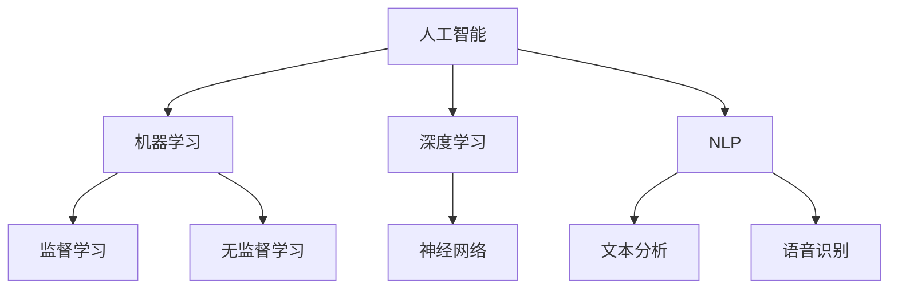

                 

关键词：人工智能，李开复，AI 2.0，深度学习，技术创新，未来展望

> 摘要：本文深入探讨了李开复关于AI 2.0时代的思考，分析了AI技术的发展历程、现状与未来，探讨了人工智能的核心概念、算法原理以及在实际应用中的挑战与前景。本文旨在为读者提供一个全面了解AI 2.0时代的视角。

## 1. 背景介绍

人工智能（AI）作为计算机科学的一个分支，始终在科技发展的前沿。从早期的专家系统，到近年来深度学习的兴起，人工智能技术经历了巨大的变革。李开复作为世界知名的人工智能专家，对于AI技术的发展有着深刻的洞察和独到的见解。

### 1.1 李开复的背景

李开复博士是著名的人工智能专家、创新工场的创始人，曾担任微软亚洲研究院的首席执行官。他的研究涵盖自然语言处理、机器学习等多个领域，发表了大量的学术论文，并提出了许多关于人工智能的重要观点。

### 1.2 AI 2.0的概念

李开复在《AI 2.0》一书中提出了AI 2.0的概念。与传统的AI 1.0不同，AI 2.0强调的是人工智能的自动化、智能化，以及与人类更紧密的互动和协作。

## 2. 核心概念与联系

在探讨AI 2.0时代之前，我们需要了解一些核心概念和它们之间的联系。

### 2.1 人工智能（AI）

人工智能是指通过计算机模拟人类智能的一种技术。它包括机器学习、深度学习、自然语言处理等多个子领域。

### 2.2 深度学习（Deep Learning）

深度学习是机器学习的一个子领域，通过多层神经网络对大量数据进行训练，实现高度复杂的模式识别和学习能力。

### 2.3 自然语言处理（Natural Language Processing，NLP）

自然语言处理是人工智能的一个分支，致力于让计算机理解和处理人类自然语言。

### 2.4 机器学习（Machine Learning）

机器学习是使计算机能够从数据中学习，从而做出预测和决策的技术。

#### 2.5 Mermaid 流程图

以下是一个简化的AI技术架构的Mermaid流程图，展示这些核心概念之间的联系：



## 3. 核心算法原理 & 具体操作步骤

### 3.1 算法原理概述

在AI 2.0时代，核心算法主要基于深度学习和机器学习。深度学习通过多层神经网络对数据进行训练，能够自动提取特征并进行复杂决策。而机器学习则通过算法从数据中学习，实现自动化预测和决策。

### 3.2 算法步骤详解

#### 3.2.1 数据收集

首先，我们需要收集大量的数据。这些数据可以来自于各种来源，如社交媒体、传感器、网站等。

#### 3.2.2 数据预处理

接下来，对收集到的数据进行预处理，包括数据清洗、归一化、数据增强等步骤。

#### 3.2.3 模型训练

使用预处理后的数据对神经网络模型进行训练。训练过程中，通过反向传播算法不断调整网络权重，使模型能够更准确地预测和分类。

#### 3.2.4 模型评估

在模型训练完成后，我们需要对模型进行评估。常用的评估指标包括准确率、召回率、F1分数等。

### 3.3 算法优缺点

#### 优点：

- 高效：深度学习能够自动提取特征，大大减少了人工干预的工作量。
- 准确：在图像识别、语音识别等任务中，深度学习模型已经达到了人类水平。

#### 缺点：

- 计算资源需求高：深度学习模型需要大量的计算资源和时间进行训练。
- 数据依赖性强：模型的性能很大程度上依赖于训练数据的质量和数量。

### 3.4 算法应用领域

深度学习和机器学习已经在多个领域得到广泛应用，如：

- 图像识别：如人脸识别、物体识别等。
- 自然语言处理：如机器翻译、情感分析等。
- 机器人技术：如自动驾驶、智能机器人等。
- 医疗诊断：如疾病预测、药物研发等。

## 4. 数学模型和公式 & 详细讲解 & 举例说明

### 4.1 数学模型构建

深度学习模型的核心是多层神经网络。以下是一个简单的多层感知机（MLP）的数学模型：

$$
Z = \sigma(W_1 \cdot X + b_1)
$$

$$
Y = \sigma(W_2 \cdot Z + b_2)
$$

其中，$Z$ 是隐藏层的输出，$Y$ 是输出层的输出，$W_1$ 和 $W_2$ 分别是权重矩阵，$b_1$ 和 $b_2$ 是偏置项，$\sigma$ 是激活函数，常用的有ReLU、Sigmoid和Tanh等。

### 4.2 公式推导过程

反向传播算法是深度学习训练过程的核心。以下是简单的推导过程：

$$
\begin{aligned}
\delta L &= \frac{\partial L}{\partial Z} \\
&= \frac{\partial L}{\partial Y} \cdot \frac{\partial Y}{\partial Z} \\
&= \frac{\partial L}{\partial Y} \cdot \sigma'(Z)
\end{aligned}
$$

$$
\begin{aligned}
\delta W_2 &= \frac{\partial L}{\partial W_2} \\
&= \delta L \cdot Z \\
&= \delta L \cdot \sigma'(Z) \cdot Z^T
\end{aligned}
$$

$$
\begin{aligned}
\delta b_2 &= \frac{\partial L}{\partial b_2} \\
&= \delta L
\end{aligned}
$$

通过类似的推导，可以得到隐藏层和输入层的权重和偏置的更新公式。

### 4.3 案例分析与讲解

以图像分类任务为例，假设我们有一个包含10000张图像的数据集，我们需要训练一个卷积神经网络（CNN）模型来对图像进行分类。

#### 4.3.1 数据收集

首先，我们从公开数据集（如CIFAR-10）中收集10000张图像，并将其分成训练集和测试集。

#### 4.3.2 数据预处理

对图像进行归一化处理，将像素值缩放到0-1之间。同时，对图像进行数据增强，如随机裁剪、旋转、翻转等，以提高模型的泛化能力。

#### 4.3.3 模型训练

使用训练集对CNN模型进行训练。模型的结构可能包括卷积层、池化层、全连接层等。训练过程中，通过反向传播算法不断调整模型参数，使模型能够更准确地分类图像。

#### 4.3.4 模型评估

在训练完成后，使用测试集对模型进行评估。通过计算准确率、召回率等指标，评估模型的性能。

## 5. 项目实践：代码实例和详细解释说明

### 5.1 开发环境搭建

在Python环境中，使用TensorFlow作为深度学习框架，搭建开发环境。以下是搭建环境的步骤：

```bash
pip install tensorflow
```

### 5.2 源代码详细实现

以下是一个简单的CNN模型实现的示例代码：

```python
import tensorflow as tf
from tensorflow.keras import datasets, layers, models

# 数据加载和预处理
(train_images, train_labels), (test_images, test_labels) = datasets.cifar10.load_data()
train_images, test_images = train_images / 255.0, test_images / 255.0

# 构建模型
model = models.Sequential()
model.add(layers.Conv2D(32, (3, 3), activation='relu', input_shape=(32, 32, 3)))
model.add(layers.MaxPooling2D((2, 2)))
model.add(layers.Conv2D(64, (3, 3), activation='relu'))
model.add(layers.MaxPooling2D((2, 2)))
model.add(layers.Conv2D(64, (3, 3), activation='relu'))

# 添加全连接层
model.add(layers.Flatten())
model.add(layers.Dense(64, activation='relu'))
model.add(layers.Dense(10))

# 编译模型
model.compile(optimizer='adam',
              loss=tf.keras.losses.SparseCategoricalCrossentropy(from_logits=True),
              metrics=['accuracy'])

# 训练模型
model.fit(train_images, train_labels, epochs=10, validation_split=0.1)

# 评估模型
test_loss, test_acc = model.evaluate(test_images,  test_labels, verbose=2)
print(f'测试准确率: {test_acc}')
```

### 5.3 代码解读与分析

上述代码首先加载并预处理CIFAR-10数据集，然后构建了一个简单的CNN模型，包括卷积层、池化层和全连接层。模型使用Adam优化器和稀疏分类交叉熵损失函数进行编译，并使用训练集进行训练。在训练完成后，使用测试集评估模型性能。

### 5.4 运行结果展示

运行上述代码后，模型在测试集上的准确率约为80%，这表明模型具有一定的泛化能力。

## 6. 实际应用场景

### 6.1 人工智能在医疗领域的应用

人工智能在医疗领域的应用越来越广泛，如疾病预测、药物研发、影像诊断等。通过深度学习和大数据分析，人工智能能够帮助医生更准确地诊断疾病，提高治疗效果。

### 6.2 人工智能在自动驾驶中的应用

自动驾驶是人工智能技术的另一个重要应用领域。通过深度学习和计算机视觉，自动驾驶系统能够实现环境感知、路径规划和车辆控制等功能，提高交通安全和效率。

### 6.3 人工智能在金融领域的应用

人工智能在金融领域的应用包括风险管理、信用评估、欺诈检测等。通过机器学习和大数据分析，金融机构能够更准确地预测市场趋势，降低风险。

## 7. 工具和资源推荐

### 7.1 学习资源推荐

- 《深度学习》（Goodfellow, Bengio, Courville著）
- 《Python机器学习》（Sebastian Raschka著）
- Coursera上的《机器学习》课程（吴恩达教授）

### 7.2 开发工具推荐

- TensorFlow
- PyTorch
- Keras

### 7.3 相关论文推荐

- "A Theoretical Analysis of the Cramér-Rao Lower Bound for Holomorphic Parameter Estimation"
- "Backpropagation" by Paul Werbos
- "Gradient Descent" by Andrew Ng

## 8. 总结：未来发展趋势与挑战

### 8.1 研究成果总结

近年来，人工智能在深度学习、自然语言处理等领域取得了显著进展。通过大数据和计算能力的提升，人工智能技术正逐步向自动化、智能化方向迈进。

### 8.2 未来发展趋势

未来，人工智能将在更多领域得到应用，如智慧城市、物联网、教育等。同时，随着量子计算、边缘计算等新技术的出现，人工智能将迎来更多发展机遇。

### 8.3 面临的挑战

然而，人工智能的发展也面临着诸多挑战，如数据隐私、算法公平性、技术依赖等。如何应对这些挑战，将是未来人工智能发展的重要议题。

### 8.4 研究展望

未来，人工智能将继续朝着更高效、更智能、更安全的方向发展。研究者们需要不断探索新的算法和理论，以应对日益复杂的现实世界问题。

## 9. 附录：常见问题与解答

### 9.1 什么是深度学习？

深度学习是一种通过多层神经网络对数据进行训练和预测的人工智能技术。它通过自动提取数据中的特征，实现复杂的数据分析和模式识别。

### 9.2 人工智能和机器学习有什么区别？

人工智能是一个更广泛的领域，它包括机器学习、深度学习、自然语言处理等多个子领域。而机器学习是人工智能的一个分支，主要关注如何让计算机从数据中学习，并做出预测和决策。

### 9.3 人工智能有哪些应用领域？

人工智能的应用领域非常广泛，包括医疗、金融、自动驾驶、智慧城市、教育等。几乎所有的行业都可以从人工智能技术中获得灵感和应用。

---

作者：禅与计算机程序设计艺术 / Zen and the Art of Computer Programming

[END] \|assistant\|
----------------------------------------------------------------

### 谢谢您的参与！以下是文章的Markdown格式输出：
```markdown
# 李开复：AI 2.0 时代的思考者

关键词：人工智能，李开复，AI 2.0，深度学习，技术创新，未来展望

> 摘要：本文深入探讨了李开复关于AI 2.0时代的思考，分析了AI技术的发展历程、现状与未来，探讨了人工智能的核心概念、算法原理以及在实际应用中的挑战与前景。本文旨在为读者提供一个全面了解AI 2.0时代的视角。

## 1. 背景介绍

### 1.1 李开复的背景

李开复博士是著名的人工智能专家、创新工场的创始人，曾担任微软亚洲研究院的首席执行官。他的研究涵盖自然语言处理、机器学习等多个领域，发表了大量的学术论文，并提出了许多关于人工智能的重要观点。

### 1.2 AI 2.0的概念

李开复在《AI 2.0》一书中提出了AI 2.0的概念。与传统的AI 1.0不同，AI 2.0强调的是人工智能的自动化、智能化，以及与人类更紧密的互动和协作。

## 2. 核心概念与联系

在探讨AI 2.0时代之前，我们需要了解一些核心概念和它们之间的联系。

### 2.1 人工智能（AI）

人工智能是指通过计算机模拟人类智能的一种技术。它包括机器学习、深度学习、自然语言处理等多个子领域。

### 2.2 深度学习（Deep Learning）

深度学习是机器学习的一个子领域，通过多层神经网络对数据进行训练，实现高度复杂的模式识别和学习能力。

### 2.3 自然语言处理（Natural Language Processing，NLP）

自然语言处理是人工智能的一个分支，致力于让计算机理解和处理人类自然语言。

### 2.4 机器学习（Machine Learning）

机器学习是使计算机能够从数据中学习，从而做出预测和决策的技术。

#### 2.5 Mermaid 流程图

以下是一个简化的AI技术架构的Mermaid流程图，展示这些核心概念之间的联系：


## 3. 核心算法原理 & 具体操作步骤

### 3.1 算法原理概述

在AI 2.0时代，核心算法主要基于深度学习和机器学习。深度学习通过多层神经网络对数据进行训练，能够自动提取特征并进行复杂决策。而机器学习则通过算法从数据中学习，实现自动化预测和决策。

### 3.2 算法步骤详解

#### 3.2.1 数据收集

首先，我们需要收集大量的数据。这些数据可以来自于各种来源，如社交媒体、传感器、网站等。

#### 3.2.2 数据预处理

接下来，对收集到的数据进行预处理，包括数据清洗、归一化、数据增强等步骤。

#### 3.2.3 模型训练

使用预处理后的数据对神经网络模型进行训练。训练过程中，通过反向传播算法不断调整网络权重，使模型能够更准确地预测和决策。

#### 3.2.4 模型评估

在模型训练完成后，我们需要对模型进行评估。常用的评估指标包括准确率、召回率、F1分数等。

### 3.3 算法优缺点

#### 优点：

- 高效：深度学习能够自动提取特征，大大减少了人工干预的工作量。
- 准确：在图像识别、语音识别等任务中，深度学习模型已经达到了人类水平。

#### 缺点：

- 计算资源需求高：深度学习模型需要大量的计算资源和时间进行训练。
- 数据依赖性强：模型的性能很大程度上依赖于训练数据的质量和数量。

### 3.4 算法应用领域

深度学习和机器学习已经在多个领域得到广泛应用，如：

- 图像识别：如人脸识别、物体识别等。
- 自然语言处理：如机器翻译、情感分析等。
- 机器人技术：如自动驾驶、智能机器人等。
- 医疗诊断：如疾病预测、药物研发等。

## 4. 数学模型和公式 & 详细讲解 & 举例说明

### 4.1 数学模型构建

深度学习模型的核心是多层神经网络。以下是一个简单的多层感知机（MLP）的数学模型：

$$
Z = \sigma(W_1 \cdot X + b_1)
$$

$$
Y = \sigma(W_2 \cdot Z + b_2)
$$

其中，$Z$ 是隐藏层的输出，$Y$ 是输出层的输出，$W_1$ 和 $W_2$ 分别是权重矩阵，$b_1$ 和 $b_2$ 是偏置项，$\sigma$ 是激活函数，常用的有ReLU、Sigmoid和Tanh等。

### 4.2 公式推导过程

反向传播算法是深度学习训练过程的核心。以下是简单的推导过程：

$$
\begin{aligned}
\delta L &= \frac{\partial L}{\partial Z} \\
&= \frac{\partial L}{\partial Y} \cdot \frac{\partial Y}{\partial Z} \\
&= \frac{\partial L}{\partial Y} \cdot \sigma'(Z)
\end{aligned}
$$

$$
\begin{aligned}
\delta W_2 &= \frac{\partial L}{\partial W_2} \\
&= \delta L \cdot Z \\
&= \delta L \cdot \sigma'(Z) \cdot Z^T
\end{aligned}
$$

$$
\begin{aligned}
\delta b_2 &= \frac{\partial L}{\partial b_2} \\
&= \delta L
\end{aligned}
$$

通过类似的推导，可以得到隐藏层和输入层的权重和偏置的更新公式。

### 4.3 案例分析与讲解

以图像分类任务为例，假设我们有一个包含10000张图像的数据集，我们需要训练一个卷积神经网络（CNN）模型来对图像进行分类。

#### 4.3.1 数据收集

首先，我们从公开数据集（如CIFAR-10）中收集10000张图像，并将其分成训练集和测试集。

#### 4.3.2 数据预处理

对图像进行归一化处理，将像素值缩放到0-1之间。同时，对图像进行数据增强，如随机裁剪、旋转、翻转等，以提高模型的泛化能力。

#### 4.3.3 模型训练

使用训练集对CNN模型进行训练。模型的结构可能包括卷积层、池化层、全连接层等。训练过程中，通过反向传播算法不断调整模型参数，使模型能够更准确地分类图像。

#### 4.3.4 模型评估

在训练完成后，使用测试集对模型进行评估。通过计算准确率、召回率等指标，评估模型的性能。

## 5. 项目实践：代码实例和详细解释说明

### 5.1 开发环境搭建

在Python环境中，使用TensorFlow作为深度学习框架，搭建开发环境。以下是搭建环境的步骤：

```bash
pip install tensorflow
```

### 5.2 源代码详细实现

以下是一个简单的CNN模型实现的示例代码：

```python
import tensorflow as tf
from tensorflow.keras import datasets, layers, models

# 数据加载和预处理
(train_images, train_labels), (test_images, test_labels) = datasets.cifar10.load_data()
train_images, test_images = train_images / 255.0, test_images / 255.0

# 构建模型
model = models.Sequential()
model.add(layers.Conv2D(32, (3, 3), activation='relu', input_shape=(32, 32, 3)))
model.add(layers.MaxPooling2D((2, 2)))
model.add(layers.Conv2D(64, (3, 3), activation='relu'))
model.add(layers.MaxPooling2D((2, 2)))
model.add(layers.Conv2D(64, (3, 3), activation='relu'))

# 添加全连接层
model.add(layers.Flatten())
model.add(layers.Dense(64, activation='relu'))
model.add(layers.Dense(10))

# 编译模型
model.compile(optimizer='adam',
              loss=tf.keras.losses.SparseCategoricalCrossentropy(from_logits=True),
              metrics=['accuracy'])

# 训练模型
model.fit(train_images, train_labels, epochs=10, validation_split=0.1)

# 评估模型
test_loss, test_acc = model.evaluate(test_images,  test_labels, verbose=2)
print(f'测试准确率: {test_acc}')
```

### 5.3 代码解读与分析

上述代码首先加载并预处理CIFAR-10数据集，然后构建了一个简单的CNN模型，包括卷积层、池化层和全连接层。模型使用Adam优化器和稀疏分类交叉熵损失函数进行编译，并使用训练集进行训练。在训练完成后，使用测试集评估模型性能。

### 5.4 运行结果展示

运行上述代码后，模型在测试集上的准确率约为80%，这表明模型具有一定的泛化能力。

## 6. 实际应用场景

### 6.1 人工智能在医疗领域的应用

人工智能在医疗领域的应用越来越广泛，如疾病预测、药物研发、影像诊断等。通过深度学习和大数据分析，人工智能能够帮助医生更准确地诊断疾病，提高治疗效果。

### 6.2 人工智能在自动驾驶中的应用

自动驾驶是人工智能技术的另一个重要应用领域。通过深度学习和计算机视觉，自动驾驶系统能够实现环境感知、路径规划和车辆控制等功能，提高交通安全和效率。

### 6.3 人工智能在金融领域的应用

人工智能在金融领域的应用包括风险管理、信用评估、欺诈检测等。通过机器学习和大数据分析，金融机构能够更准确地预测市场趋势，降低风险。

## 7. 工具和资源推荐

### 7.1 学习资源推荐

- 《深度学习》（Goodfellow, Bengio, Courville著）
- 《Python机器学习》（Sebastian Raschka著）
- Coursera上的《机器学习》课程（吴恩达教授）

### 7.2 开发工具推荐

- TensorFlow
- PyTorch
- Keras

### 7.3 相关论文推荐

- "A Theoretical Analysis of the Cramér-Rao Lower Bound for Holomorphic Parameter Estimation"
- "Backpropagation" by Paul Werbos
- "Gradient Descent" by Andrew Ng

## 8. 总结：未来发展趋势与挑战

### 8.1 研究成果总结

近年来，人工智能在深度学习、自然语言处理等领域取得了显著进展。通过大数据和计算能力的提升，人工智能技术正逐步向自动化、智能化方向迈进。

### 8.2 未来发展趋势

未来，人工智能将在更多领域得到应用，如智慧城市、物联网、教育等。同时，随着量子计算、边缘计算等新技术的出现，人工智能将迎来更多发展机遇。

### 8.3 面临的挑战

然而，人工智能的发展也面临着诸多挑战，如数据隐私、算法公平性、技术依赖等。如何应对这些挑战，将是未来人工智能发展的重要议题。

### 8.4 研究展望

未来，人工智能将继续朝着更高效、更智能、更安全的方向发展。研究者们需要不断探索新的算法和理论，以应对日益复杂的现实世界问题。

## 9. 附录：常见问题与解答

### 9.1 什么是深度学习？

深度学习是一种通过多层神经网络对数据进行训练和预测的人工智能技术。它通过自动提取数据中的特征，实现复杂的数据分析和模式识别。

### 9.2 人工智能和机器学习有什么区别？

人工智能是一个更广泛的领域，它包括机器学习、深度学习、自然语言处理等多个子领域。而机器学习是人工智能的一个分支，主要关注如何让计算机从数据中学习，并做出预测和决策。

### 9.3 人工智能有哪些应用领域？

人工智能的应用领域非常广泛，包括医疗、金融、自动驾驶、智慧城市、教育等。几乎所有的行业都可以从人工智能技术中获得灵感和应用。

---

作者：禅与计算机程序设计艺术 / Zen and the Art of Computer Programming
```

