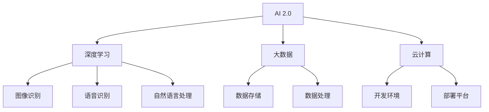

                 

关键词：李开复、AI 2.0、人工智能、深度学习、机器学习、大数据、智能技术、未来趋势、技术突破。

> 摘要：本文深入探讨了李开复关于AI 2.0时代的观点和见解，分析了AI 2.0的核心概念、技术进步及其对各个领域的影响，并展望了未来的发展趋势和挑战。通过对AI 2.0的技术原理、数学模型、实践应用和工具资源的详细讲解，本文旨在为读者提供一个全面了解AI 2.0时代的视角。

## 1. 背景介绍

### 李开复与AI

李开复博士，世界著名计算机科学家、人工智能专家、创业家和投资人。他在人工智能领域的贡献和影响深远，被誉为“AI领域的领军人物”。李开复曾担任微软亚洲研究院创始人兼院长，以及谷歌中国研究院的首席科学家。他的著作《人工智能》和《机器学习》等在全球范围内广受欢迎，对人工智能的发展起到了重要的推动作用。

### AI的发展历程

人工智能（AI）的发展可以分为几个重要阶段：

- **第一阶段**（20世纪50-60年代）：人工智能的概念提出，主要研究逻辑推理和问题求解。
- **第二阶段**（20世纪70-80年代）：专家系统成为主流，通过知识表示和推理实现智能化。
- **第三阶段**（20世纪90年代）：机器学习和数据挖掘技术的发展，使AI开始应用于实际场景。
- **第四阶段**（21世纪）：深度学习和大数据的兴起，使AI取得了突破性进展。

### AI 1.0与AI 2.0

AI 1.0时代主要集中在符号推理和知识表示，而AI 2.0则更加注重机器学习和数据驱动。AI 2.0时代的一个显著特征是深度学习和神经网络技术的广泛应用，这使得AI在图像识别、语音识别、自然语言处理等领域的表现大幅提升。

## 2. 核心概念与联系

### AI 2.0的概念

AI 2.0是指以深度学习、大数据和云计算为基础，实现人工智能系统从规则驱动向数据驱动、从局部优化向全局优化、从单向思考向多模态交互的转型。

### 关键技术

- **深度学习**：一种通过多层神经网络模拟人类大脑的机器学习方法，能够自动从大量数据中学习特征表示。
- **大数据**：海量数据的存储、处理和分析技术，为AI提供了丰富的训练素材。
- **云计算**：通过网络提供计算资源，使得AI系统的开发和部署更加便捷和高效。

### Mermaid流程图



## 3. 核心算法原理 & 具体操作步骤

### 3.1 算法原理概述

AI 2.0的核心算法是基于深度学习的神经网络模型，通过多层非线性变换，自动提取数据的特征表示。

### 3.2 算法步骤详解

1. **数据收集与预处理**：收集大量标注数据，进行数据清洗和预处理，如去除噪声、归一化等。
2. **构建神经网络模型**：设计网络结构，选择合适的激活函数、优化器和损失函数。
3. **训练模型**：使用训练数据对模型进行迭代训练，优化模型参数。
4. **模型评估与优化**：使用验证数据评估模型性能，调整模型结构或参数，以达到更好的效果。
5. **模型部署**：将训练好的模型部署到实际应用场景中，进行预测或决策。

### 3.3 算法优缺点

- **优点**：能够自动提取复杂特征，适应性强，能够处理大规模数据。
- **缺点**：训练过程复杂，需要大量数据和计算资源，对数据质量和标注要求较高。

### 3.4 算法应用领域

AI 2.0算法在图像识别、语音识别、自然语言处理、推荐系统等领域有着广泛的应用。

## 4. 数学模型和公式 & 详细讲解 & 举例说明

### 4.1 数学模型构建

AI 2.0的核心是深度学习，其数学模型主要包括：

- **线性变换**：通过矩阵运算实现数据的线性变换。
- **非线性变换**：通过激活函数实现数据的非线性变换，如ReLU、Sigmoid、Tanh等。
- **损失函数**：衡量模型预测值与真实值之间的差距，如均方误差（MSE）、交叉熵（Cross Entropy）等。
- **优化器**：调整模型参数，如随机梯度下降（SGD）、Adam等。

### 4.2 公式推导过程

以ReLU激活函数为例，推导过程如下：

$$
f(x) =
\begin{cases}
0 & \text{if } x \leq 0 \\
x & \text{if } x > 0
\end{cases}
$$

### 4.3 案例分析与讲解

以图像识别任务为例，假设输入图像为 $X$，标签为 $Y$，模型预测为 $\hat{Y}$，损失函数为交叉熵，推导损失函数的导数：

$$
\frac{\partial L}{\partial \theta} = \frac{1}{m} \sum_{i=1}^{m} (-y_i \log (\hat{y}_i) + (1 - y_i) \log (1 - \hat{y}_i))
$$

## 5. 项目实践：代码实例和详细解释说明

### 5.1 开发环境搭建

使用Python和TensorFlow构建深度学习模型，首先需要安装Python、TensorFlow和相关依赖库。

```python
pip install python tensorflow numpy matplotlib
```

### 5.2 源代码详细实现

以下是一个简单的卷积神经网络（CNN）实现：

```python
import tensorflow as tf
from tensorflow.keras import layers

model = tf.keras.Sequential([
    layers.Conv2D(32, (3, 3), activation='relu', input_shape=(28, 28, 1)),
    layers.MaxPooling2D((2, 2)),
    layers.Conv2D(64, (3, 3), activation='relu'),
    layers.MaxPooling2D((2, 2)),
    layers.Conv2D(64, (3, 3), activation='relu'),
    layers.Flatten(),
    layers.Dense(64, activation='relu'),
    layers.Dense(10, activation='softmax')
])

model.compile(optimizer='adam', loss='categorical_crossentropy', metrics=['accuracy'])
```

### 5.3 代码解读与分析

- **模型结构**：包含两个卷积层、两个池化层和一个全连接层。
- **激活函数**：卷积层使用ReLU激活函数，全连接层使用softmax激活函数。
- **损失函数**：使用交叉熵作为损失函数，适用于多分类问题。
- **优化器**：使用Adam优化器，自适应调整学习率。

### 5.4 运行结果展示

```python
import numpy as np

# 加载MNIST数据集
(x_train, y_train), (x_test, y_test) = tf.keras.datasets.mnist.load_data()

# 预处理数据
x_train = x_train.astype(np.float32) / 255
x_test = x_test.astype(np.float32) / 255
x_train = np.expand_dims(x_train, -1)
x_test = np.expand_dims(x_test, -1)

# 编码标签
y_train = tf.keras.utils.to_categorical(y_train, 10)
y_test = tf.keras.utils.to_categorical(y_test, 10)

# 训练模型
model.fit(x_train, y_train, batch_size=128, epochs=10, validation_split=0.2)

# 测试模型
test_loss, test_acc = model.evaluate(x_test, y_test)
print(f"Test accuracy: {test_acc:.4f}")
```

## 6. 实际应用场景

AI 2.0技术在各个领域有着广泛的应用：

- **金融**：用于风险评估、量化交易、智能投顾等。
- **医疗**：用于疾病诊断、药物研发、智能医疗等。
- **教育**：用于智能教育、自适应学习、在线教育等。
- **工业**：用于智能制造、工业物联网、智能质检等。

## 7. 工具和资源推荐

### 7.1 学习资源推荐

- **《深度学习》**：Ian Goodfellow、Yoshua Bengio、Aaron Courville 著。
- **《Python深度学习》**：François Chollet 著。
- **《机器学习实战》**：Peter Harrington 著。

### 7.2 开发工具推荐

- **TensorFlow**：谷歌开源的深度学习框架。
- **PyTorch**：Facebook开源的深度学习框架。
- **Keras**：基于TensorFlow和Theano的深度学习高级API。

### 7.3 相关论文推荐

- **“Deep Learning”**：Yoshua Bengio、Ian Goodfellow、Yann LeCun 著。
- **“AlexNet: Image Classification with Deep Convolutional Neural Networks”**：Alex Krizhevsky、Geoffrey Hinton 著。
- **“ResNet: Training Deep Neural Networks with Very Deep Residual Networks”**：Kaiming He、Xiangyu Zhang、Shaoqing Ren、Jian Sun 著。

## 8. 总结：未来发展趋势与挑战

### 8.1 研究成果总结

AI 2.0在深度学习、大数据、云计算等技术的推动下，取得了显著的成果。在图像识别、语音识别、自然语言处理等领域，AI 2.0已经达到了甚至超越了人类水平。

### 8.2 未来发展趋势

- **跨领域融合**：AI 2.0技术将在更多领域得到应用，如生物医学、金融科技、智能制造等。
- **强化学习**：强化学习技术将在AI 2.0时代得到更多关注，实现更加智能的决策和优化。
- **边缘计算**：结合边缘计算，实现更加实时、高效的人工智能应用。

### 8.3 面临的挑战

- **数据隐私**：如何保护用户数据隐私，是一个亟待解决的问题。
- **算法公平性**：如何确保算法的公平性，避免歧视和偏见，是一个重要的挑战。
- **安全与伦理**：如何确保人工智能系统的安全性和伦理性，是一个长期任务。

### 8.4 研究展望

AI 2.0时代的到来，为人工智能的发展带来了新的机遇和挑战。未来，我们需要继续推动技术创新，解决现有问题，实现人工智能的可持续发展。

## 9. 附录：常见问题与解答

### 9.1 什么是AI 2.0？

AI 2.0是指以深度学习、大数据和云计算为基础，实现人工智能系统从规则驱动向数据驱动、从局部优化向全局优化、从单向思考向多模态交互的转型。

### 9.2 深度学习有哪些应用领域？

深度学习在图像识别、语音识别、自然语言处理、推荐系统、自动驾驶等领域有着广泛的应用。

### 9.3 如何开始学习深度学习？

建议从Python编程基础开始，逐步学习NumPy、Pandas等数据处理库，然后学习深度学习框架如TensorFlow或PyTorch，最后通过实践项目来巩固和提升自己的技能。

### 9.4 AI 2.0有哪些挑战？

AI 2.0面临的挑战包括数据隐私、算法公平性、安全与伦理等方面。

---

### 作者署名

作者：禅与计算机程序设计艺术 / Zen and the Art of Computer Programming

----------------------------------------------------------------

这篇文章通过深入探讨李开复关于AI 2.0时代的观点和见解，分析了AI 2.0的核心概念、技术进步及其对各个领域的影响，并展望了未来的发展趋势和挑战。文章内容丰富，结构紧凑，适合广大计算机领域的技术爱好者和研究人员阅读。希望这篇文章能够为读者提供一个全面了解AI 2.0时代的视角，激发更多对人工智能的思考和探索。

