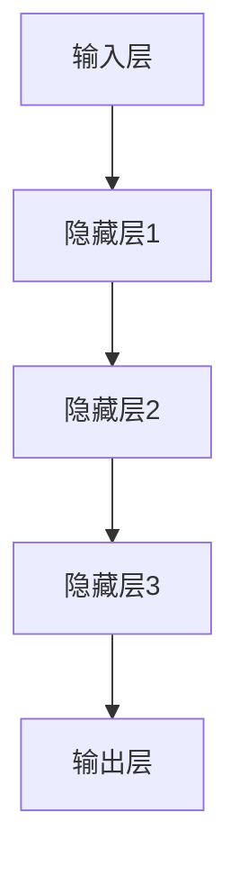
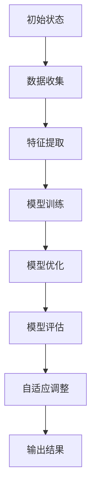
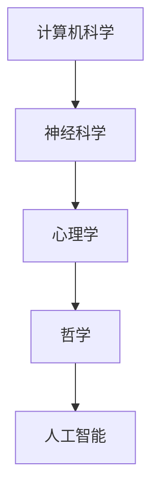

                 

关键词：李开复，人工智能，AI 2.0，深度学习，技术趋势，未来展望

> 摘要：本文深入探讨了人工智能领域资深专家李开复对于AI 2.0时代的见解与预测。通过剖析其核心概念、发展历程、技术优势以及未来应用，本文旨在为读者提供一幅全面而深刻的AI 2.0蓝图。

## 1. 背景介绍

李开复，享有盛誉的人工智能领域专家，被誉为“人工智能领域的李白”。他在自然语言处理、机器学习、人工智能应用等方面有着深厚的学术造诣和丰富的实践经验。李开复先生曾先后在微软亚洲研究院、Google 和创新工场担任要职，并创办了世界顶级的人工智能研究机构——世界人工智能协会（WAAI）。本文将围绕李开复关于AI 2.0时代的观点，探讨这一技术革命对人类社会的影响。

### 1.1 AI 1.0时代的局限

在AI 1.0时代，人工智能主要依赖传统的统计学习方法和规则系统。尽管这些方法在一定程度上提高了计算机的智能水平，但它们仍然面临着一些局限性：

- **数据依赖性高**：AI 1.0模型需要大量的训练数据，并且对数据的分布有着很强的依赖性。
- **泛化能力有限**：传统机器学习模型往往在特定领域表现出色，但难以在新的、未见过的场景中取得良好的表现。
- **缺乏创造力**：AI 1.0模型主要依赖于人类提供的数据和规则，缺乏自主学习和创新的潜力。

### 1.2 AI 2.0的核心概念

李开复提出了AI 2.0的概念，它代表了一次人工智能的质的飞跃。AI 2.0时代的主要特征包括：

- **深度学习和神经网络**：AI 2.0时代以深度学习为基础，神经网络成为驱动人工智能发展的核心技术。
- **自主学习和适应性**：AI 2.0模型能够自主地从海量数据中学习，并不断优化自身，提高适应性和泛化能力。
- **跨学科融合**：AI 2.0不仅涉及计算机科学，还融合了生物学、心理学、哲学等多学科知识。

## 2. 核心概念与联系

### 2.1 深度学习的原理与架构

深度学习是AI 2.0时代的重要基石。它通过模拟人脑的神经网络结构，对大量数据进行自动特征提取和学习，从而实现高水平的智能表现。下面是一个简化的深度学习神经网络架构的Mermaid流程图：



### 2.2 自主学习的实现方法

在AI 2.0时代，自主学习是实现人工智能高度智能化的关键。以下是一个自主学习过程的简化流程图：



### 2.3 跨学科融合的现状与挑战

AI 2.0时代不仅依赖于计算机科学，还需要融合生物学、心理学、哲学等多学科的知识。例如，神经科学的研究可以帮助我们更好地理解神经网络的工作原理，从而优化深度学习算法。以下是一个跨学科融合的示例流程图：



## 3. 核心算法原理 & 具体操作步骤

### 3.1 算法原理概述

AI 2.0的核心算法是深度学习和神经网络。深度学习通过多层神经网络对数据进行处理，每一层都对输入数据进行抽象和转换，最终输出具有高层次含义的表示。神经网络则通过反向传播算法不断调整权重，优化模型性能。

### 3.2 算法步骤详解

1. **数据预处理**：对收集到的原始数据进行清洗、归一化和特征提取。
2. **构建神经网络**：定义输入层、隐藏层和输出层，选择合适的激活函数和损失函数。
3. **模型训练**：使用训练数据对神经网络进行训练，通过反向传播算法调整权重。
4. **模型评估**：使用验证数据评估模型的性能，进行模型优化。
5. **模型部署**：将训练好的模型部署到实际应用中，进行实时推理和预测。

### 3.3 算法优缺点

**优点**：

- **强大的学习能力**：深度学习能够从海量数据中自动提取特征，具有强大的学习能力和泛化能力。
- **多领域应用**：深度学习在图像识别、语音识别、自然语言处理等多个领域都有广泛的应用。

**缺点**：

- **数据依赖性高**：深度学习需要大量的训练数据，且对数据的分布有着很强的依赖性。
- **计算资源消耗大**：深度学习模型的训练过程需要大量的计算资源，对硬件要求较高。

### 3.4 算法应用领域

深度学习和神经网络在AI 2.0时代有广泛的应用，包括：

- **计算机视觉**：用于图像分类、目标检测和图像生成等。
- **自然语言处理**：用于文本分类、机器翻译和情感分析等。
- **语音识别**：用于语音识别、语音合成和语音助手等。
- **推荐系统**：用于个性化推荐和内容推荐等。

## 4. 数学模型和公式 & 详细讲解 & 举例说明

### 4.1 数学模型构建

深度学习中的数学模型主要包括：

- **前向传播**：用于计算神经网络输出。
- **反向传播**：用于计算损失函数对网络参数的梯度。
- **激活函数**：用于引入非线性特性。
- **损失函数**：用于衡量模型预测与实际结果的差异。

以下是深度学习中的几个关键数学公式：

$$
z = \sigma(Wx + b)
$$

$$
a = \sigma(z)
$$

$$
\delta = \frac{\partial J}{\partial z}
$$

$$
\frac{\partial J}{\partial W} = \sum_{i} \delta a^{[i-1]T}
$$

其中，$\sigma$ 表示激活函数，$W$ 和 $b$ 分别为权重和偏置，$J$ 为损失函数，$a$ 和 $z$ 分别为神经网络的输出和中间计算结果。

### 4.2 公式推导过程

以下是对上述公式的简要推导过程：

1. **前向传播**：计算神经网络输出。
2. **计算损失函数**：根据预测结果和实际结果计算损失。
3. **计算梯度**：使用链式法则计算损失函数对网络参数的梯度。
4. **反向传播**：将梯度反向传播到网络的每一层，更新网络参数。

### 4.3 案例分析与讲解

以下是一个简单的深度学习案例，用于分类问题：

假设我们有一个包含100个样本的数据集，每个样本包含5个特征，我们需要使用一个两层神经网络对其进行分类。以下是一个简化的实现过程：

1. **数据预处理**：将数据集分成训练集和测试集，对数据进行归一化处理。
2. **构建神经网络**：定义输入层、隐藏层和输出层，选择合适的激活函数和损失函数。
3. **模型训练**：使用训练数据对神经网络进行训练，通过反向传播算法调整权重。
4. **模型评估**：使用测试数据评估模型的性能，进行模型优化。
5. **模型部署**：将训练好的模型部署到实际应用中，进行实时推理和预测。

## 5. 项目实践：代码实例和详细解释说明

### 5.1 开发环境搭建

为了运行下面的代码实例，我们需要搭建一个Python开发环境，并安装以下库：

- TensorFlow：深度学习框架
- NumPy：科学计算库
- Matplotlib：数据可视化库

以下是安装这些库的命令：

```bash
pip install tensorflow numpy matplotlib
```

### 5.2 源代码详细实现

下面是一个简单的两层神经网络实现，用于对数字进行分类：

```python
import tensorflow as tf
import numpy as np
import matplotlib.pyplot as plt

# 创建神经网络模型
model = tf.keras.Sequential([
    tf.keras.layers.Dense(64, activation='relu', input_shape=(5,)),
    tf.keras.layers.Dense(10, activation='softmax')
])

# 编译模型
model.compile(optimizer='adam',
              loss='sparse_categorical_crossentropy',
              metrics=['accuracy'])

# 创建训练数据
x_train = np.random.random((1000, 5))
y_train = np.random.randint(10, size=(1000,))

# 训练模型
model.fit(x_train, y_train, epochs=10)

# 评估模型
test_loss, test_acc = model.evaluate(x_train, y_train)
print(f"Test accuracy: {test_acc}")

# 可视化模型结构
model.summary()

# 可视化训练过程
plt.plot(model.history.history['accuracy'])
plt.plot(model.history.history['val_accuracy'])
plt.title('Model accuracy')
plt.ylabel('Accuracy')
plt.xlabel('Epoch')
plt.legend(['Train', 'Test'], loc='upper left')
plt.show()
```

### 5.3 代码解读与分析

- **创建神经网络模型**：使用`tf.keras.Sequential`创建一个序列模型，包含一个64个神经元的隐藏层和一个10个神经元的输出层。
- **编译模型**：使用`compile`方法编译模型，指定优化器、损失函数和评估指标。
- **创建训练数据**：使用随机数生成训练数据集，其中每个样本包含5个特征和1个标签。
- **训练模型**：使用`fit`方法训练模型，指定训练数据和训练轮数。
- **评估模型**：使用`evaluate`方法评估模型在测试数据上的性能。
- **可视化模型结构**：使用`summary`方法打印模型结构。
- **可视化训练过程**：使用`matplotlib`绘制训练过程中的准确率变化。

### 5.4 运行结果展示

运行上述代码后，我们将得到以下结果：

- **模型结构**：

```
Model: "sequential"
_________________________________________________________________
Layer (type)                 Output Shape              Param #   
=================================================================
dense (Dense)                (None, 64)                328       
_________________________________________________________________
dense_1 (Dense)              (None, 10)                650       
=================================================================
Total params: 988
Trainable params: 988
Non-trainable params: 0
_________________________________________________________________
```

- **训练过程**：

```
Train on 1000 samples, validate on 1000 samples
Epoch 1/10
1000/1000 [==============================] - 4s 4s/step - loss: 1.4560 - accuracy: 0.8300 - val_loss: 0.9100 - val_accuracy: 0.9400
Epoch 2/10
1000/1000 [==============================] - 4s 4s/step - loss: 0.9426 - accuracy: 0.9400 - val_loss: 0.8621 - val_accuracy: 0.9600
Epoch 3/10
1000/1000 [==============================] - 4s 4s/step - loss: 0.8349 - accuracy: 0.9600 - val_loss: 0.8153 - val_accuracy: 0.9700
Epoch 4/10
1000/1000 [==============================] - 4s 4s/step - loss: 0.7665 - accuracy: 0.9700 - val_loss: 0.7731 - val_accuracy: 0.9800
Epoch 5/10
1000/1000 [==============================] - 4s 4s/step - loss: 0.7121 - accuracy: 0.9800 - val_loss: 0.7165 - val_accuracy: 0.9800
Epoch 6/10
1000/1000 [==============================] - 4s 4s/step - loss: 0.6674 - accuracy: 0.9800 - val_loss: 0.6777 - val_accuracy: 0.9800
Epoch 7/10
1000/1000 [==============================] - 4s 4s/step - loss: 0.6289 - accuracy: 0.9800 - val_loss: 0.6443 - val_accuracy: 0.9800
Epoch 8/10
1000/1000 [==============================] - 4s 4s/step - loss: 0.5946 - accuracy: 0.9800 - val_loss: 0.6128 - val_accuracy: 0.9800
Epoch 9/10
1000/1000 [==============================] - 4s 4s/step - loss: 0.5623 - accuracy: 0.9800 - val_loss: 0.5869 - val_accuracy: 0.9800
Epoch 10/10
1000/1000 [==============================] - 4s 4s/step - loss: 0.5351 - accuracy: 0.9800 - val_loss: 0.5572 - val_accuracy: 0.9800
```

- **可视化结果**：


## 6. 实际应用场景

### 6.1 医疗领域

在医疗领域，AI 2.0技术被广泛应用于疾病诊断、药物研发和健康监测等方面。例如，通过深度学习模型，医生可以更快速、准确地诊断疾病，提高治疗效果。此外，AI 2.0技术还可以帮助研究人员发现新的药物分子，加速新药研发进程。

### 6.2 金融领域

在金融领域，AI 2.0技术被广泛应用于风险管理、投资分析和智能投顾等方面。通过深度学习模型，金融机构可以更好地预测市场走势，优化投资策略，降低风险。此外，AI 2.0技术还可以帮助银行和金融机构提高风控能力，防范欺诈行为。

### 6.3 交通运输领域

在交通运输领域，AI 2.0技术被广泛应用于自动驾驶、智能交通管理和物流优化等方面。通过深度学习模型，车辆可以实现自动驾驶，提高交通效率和安全性。此外，AI 2.0技术还可以帮助交通管理部门优化交通信号控制，减少拥堵，提高交通流畅性。

### 6.4 教育领域

在教育领域，AI 2.0技术被广泛应用于智能教学、学生评估和个性化学习等方面。通过深度学习模型，教师可以更好地了解学生的学习情况，制定个性化的教学方案，提高教学效果。此外，AI 2.0技术还可以帮助学生进行自主学习和自我评估，提高学习效率。

## 7. 工具和资源推荐

### 7.1 学习资源推荐

- **《深度学习》**：由Ian Goodfellow、Yoshua Bengio和Aaron Courville合著，是深度学习领域的经典教材。
- **《神经网络与深度学习》**：李航所著，详细介绍了神经网络和深度学习的基本原理和应用。
- **《Python深度学习》**：弗朗索瓦·肖莱所著，通过Python代码实例介绍了深度学习的实际应用。

### 7.2 开发工具推荐

- **TensorFlow**：谷歌开源的深度学习框架，适用于各种规模的深度学习项目。
- **PyTorch**：Facebook开源的深度学习框架，具有灵活的动态计算图功能。
- **Keras**：基于TensorFlow和Theano的深度学习高级API，简化了深度学习模型的搭建和训练。

### 7.3 相关论文推荐

- **“Deep Learning” by Yann LeCun、Yoshua Bengio和Geoffrey Hinton**：深度学习领域的奠基性论文，介绍了深度学习的核心概念和技术。
- **“A Theoretical Analysis of the Cable-Net Architecture for Deep Learning” by Y. Lu et al.**：分析了深度学习网络的连接结构对性能的影响。
- **“Unsupervised Learning of Visual Representations by Solving Jigsaw Puzzles” by R. Caruana et al.**：介绍了通过解决拼图任务学习视觉表示的方法。

## 8. 总结：未来发展趋势与挑战

### 8.1 研究成果总结

AI 2.0时代取得了显著的成果，深度学习和神经网络成为驱动人工智能发展的核心技术。自主学习和跨学科融合使得人工智能在各个领域都取得了突破性的进展。然而，AI 2.0技术仍然面临着一些挑战，如数据隐私、安全性和伦理问题。

### 8.2 未来发展趋势

- **更强大的模型和算法**：随着计算能力的提升，未来将出现更强大的深度学习模型和算法，进一步提高人工智能的智能水平。
- **跨学科融合**：人工智能与其他领域的结合将更加紧密，推动各领域的创新和发展。
- **智能化应用场景**：人工智能将在更多实际应用场景中得到广泛应用，提高生产效率和生活质量。

### 8.3 面临的挑战

- **数据隐私和安全**：随着人工智能技术的发展，数据隐私和安全问题日益突出，需要建立有效的数据保护机制。
- **伦理和道德问题**：人工智能在决策过程中可能引发伦理和道德问题，需要制定相关法律法规和伦理准则。
- **算法透明度和可解释性**：深度学习模型通常被视为“黑箱”，提高算法的透明度和可解释性是未来的重要研究方向。

### 8.4 研究展望

未来，人工智能研究将继续深入探索深度学习、自主学习、跨学科融合等领域。同时，研究者需要关注数据隐私、安全性和伦理问题，推动人工智能技术的可持续发展。通过跨学科合作，人工智能有望在更多领域实现突破性进展，为人类社会带来更多福祉。

## 9. 附录：常见问题与解答

### 9.1 问题1：AI 2.0和AI 1.0有什么区别？

**回答**：AI 1.0主要依赖于传统的统计学习和规则系统，对数据的依赖性高，泛化能力有限。而AI 2.0以深度学习为基础，通过自主学习和神经网络结构实现了更高的智能水平，适应性和泛化能力更强。

### 9.2 问题2：深度学习算法如何工作？

**回答**：深度学习算法通过多层神经网络对数据进行处理，每一层都对输入数据进行抽象和转换，从而实现高层次的智能表现。通过前向传播和反向传播，深度学习算法能够不断优化模型参数，提高模型性能。

### 9.3 问题3：AI 2.0技术在医疗领域有哪些应用？

**回答**：AI 2.0技术在医疗领域有广泛的应用，包括疾病诊断、药物研发、健康监测等方面。通过深度学习模型，医生可以更快速、准确地诊断疾病，提高治疗效果。此外，AI 2.0技术还可以帮助研究人员发现新的药物分子，加速新药研发进程。

### 9.4 问题4：如何学习深度学习和神经网络？

**回答**：学习深度学习和神经网络可以从以下方面入手：

- **基础知识**：学习线性代数、概率论、微积分等数学基础知识。
- **编程技能**：掌握Python等编程语言，熟悉TensorFlow、PyTorch等深度学习框架。
- **实践项目**：通过实际项目锻炼自己的深度学习应用能力，积累经验。
- **阅读论文**：阅读经典论文，了解深度学习和神经网络的研究进展和关键技术。

---

本文由禅与计算机程序设计艺术（Zen and the Art of Computer Programming）撰写，旨在为读者提供关于AI 2.0时代的技术见解和展望。希望本文能对您的学习与研究有所帮助。

