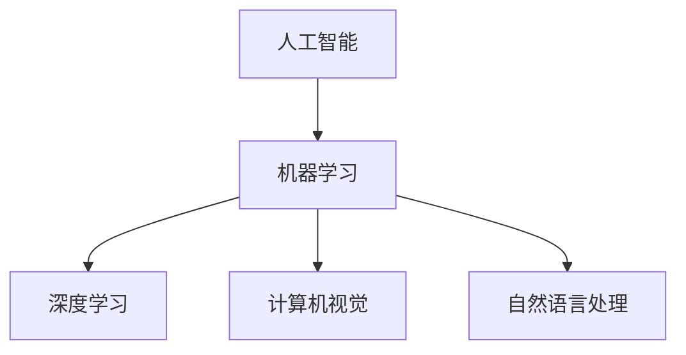

                 

关键词：苹果，AI应用，产业变革，技术趋势，人工智能

摘要：随着苹果公司近年来在人工智能领域的不断探索和投入，其最新发布的AI应用无疑引起了业界的广泛关注。本文将深入探讨苹果发布AI应用背后的产业变革，技术趋势，以及对未来发展的深远影响。

## 1. 背景介绍

人工智能（AI）作为当今技术发展的热点，已经深入到了各行各业。从自动驾驶、医疗诊断、金融服务到智能家居，AI正在改变我们的生活方式。苹果公司作为全球科技行业的领军企业，其在人工智能领域的探索和布局也备受关注。近年来，苹果通过收购AI初创公司、发布AI研究论文、推出AI芯片等一系列举措，逐渐形成了一套完整的AI研发和应用体系。

苹果发布AI应用的意义不仅在于技术本身，更在于其对整个产业链的潜在影响。一方面，AI应用将为苹果的硬件产品带来新的功能和服务，提升用户体验；另一方面，AI技术的普及和推广将带动相关产业的发展，推动产业变革。

## 2. 核心概念与联系

在探讨苹果发布AI应用之前，我们有必要了解一些核心概念和它们之间的联系。

### 2.1 人工智能

人工智能（AI）是一门研究、开发用于模拟、延伸和扩展人的智能的理论、方法、技术及应用系统的技术科学。它包括机器学习、深度学习、计算机视觉、自然语言处理等多个子领域。

### 2.2 深度学习

深度学习（Deep Learning）是机器学习（Machine Learning）的一个重要分支，它通过神经网络模拟人脑的思维方式，对大量数据进行自动特征学习和模式识别。深度学习在图像识别、语音识别、自然语言处理等领域取得了显著成果。

### 2.3 计算机视觉

计算机视觉（Computer Vision）是人工智能的一个分支，致力于使计算机能够“看懂”世界。它通过图像处理、模式识别、机器学习等技术，实现从图像或视频中提取信息。

### 2.4 自然语言处理

自然语言处理（Natural Language Processing，NLP）是人工智能的一个子领域，专注于使计算机能够理解和生成人类语言。它包括语音识别、文本分类、机器翻译等多个方面。

为了更直观地展示这些概念之间的联系，我们可以使用Mermaid流程图进行描述：



## 3. 核心算法原理 & 具体操作步骤

### 3.1 算法原理概述

苹果发布的AI应用主要依赖于深度学习和计算机视觉技术。其中，卷积神经网络（CNN）和循环神经网络（RNN）是两种常用的深度学习算法。

#### 3.1.1 卷积神经网络（CNN）

卷积神经网络是一种在图像识别和图像处理中广泛使用的深度学习模型。它通过多个卷积层、池化层和全连接层，实现对图像的特征提取和分类。

#### 3.1.2 循环神经网络（RNN）

循环神经网络是一种在序列数据处理中具有优势的深度学习模型。它通过隐藏状态的记忆功能，实现对时间序列数据的建模和预测。

### 3.2 算法步骤详解

以苹果的一款图像识别应用为例，其算法步骤主要包括以下几个阶段：

#### 3.2.1 数据预处理

首先，对输入的图像进行数据预处理，包括图像缩放、归一化、数据增强等操作，以提高模型的鲁棒性和泛化能力。

#### 3.2.2 特征提取

通过卷积神经网络，对预处理后的图像进行特征提取。卷积层通过卷积操作提取图像的低级特征，池化层通过下采样操作减少数据的维度。

#### 3.2.3 分类预测

将提取到的特征输入到全连接层，通过激活函数进行非线性变换，实现对图像的分类预测。

### 3.3 算法优缺点

#### 优点：

1. CNN和RNN具有强大的特征提取和建模能力，能够处理复杂的图像和序列数据。
2. 深度学习模型通过大量数据训练，具有良好的泛化能力。

#### 缺点：

1. 训练过程需要大量的计算资源和时间。
2. 模型复杂度高，难以解释。

### 3.4 算法应用领域

深度学习和计算机视觉技术在多个领域都有广泛应用，包括：

1. 图像识别：如人脸识别、物体检测、图像分类等。
2. 语音识别：如语音助手、语音翻译等。
3. 自然语言处理：如文本分类、机器翻译、情感分析等。

## 4. 数学模型和公式 & 详细讲解 & 举例说明

### 4.1 数学模型构建

在深度学习模型中，常用的数学模型包括神经网络、卷积神经网络和循环神经网络。

#### 4.1.1 神经网络

神经网络是一种由多个神经元组成的网络，通过前向传播和反向传播算法进行训练和预测。

#### 4.1.2 卷积神经网络

卷积神经网络通过卷积层、池化层和全连接层，实现对图像的特征提取和分类。

#### 4.1.3 循环神经网络

循环神经网络通过隐藏状态的记忆功能，实现对时间序列数据的建模和预测。

### 4.2 公式推导过程

以卷积神经网络为例，其核心公式包括：

1. **卷积操作**：

   $$ (f(x_1, x_2, ..., x_n) = \sum_{i=1}^{n} w_i * x_i + b $$

   其中，$f$表示卷积操作，$w_i$和$b$分别表示权重和偏置。

2. **前向传播**：

   $$ y = f(z) = \sigma(Wz + b) $$

   其中，$y$表示输出，$z$表示输入，$W$和$b$分别表示权重和偏置，$\sigma$表示激活函数。

3. **反向传播**：

   $$ \delta = \frac{\partial L}{\partial z} = \frac{\partial L}{\partial y} \cdot \frac{\partial y}{\partial z} $$

   其中，$\delta$表示误差，$L$表示损失函数。

### 4.3 案例分析与讲解

以人脸识别为例，分析卷积神经网络在图像识别中的应用。

#### 4.3.1 数据预处理

首先，对输入的人脸图像进行数据预处理，包括图像缩放、归一化、数据增强等操作，以提高模型的鲁棒性和泛化能力。

#### 4.3.2 特征提取

通过卷积神经网络，对预处理后的人脸图像进行特征提取。卷积层通过卷积操作提取人脸图像的低级特征，池化层通过下采样操作减少数据的维度。

#### 4.3.3 分类预测

将提取到的人脸特征输入到全连接层，通过激活函数进行非线性变换，实现对人脸的分类预测。

#### 4.3.4 模型训练

通过反向传播算法，不断调整权重和偏置，使模型在训练集上的误差最小化。

## 5. 项目实践：代码实例和详细解释说明

### 5.1 开发环境搭建

搭建一个深度学习项目，通常需要安装Python、TensorFlow等工具。以下是一个简单的安装步骤：

```bash
# 安装Python
curl -O https://www.python.org/ftp/python/3.8.5/Python-3.8.5.tgz
tar -xvf Python-3.8.5.tgz
cd Python-3.8.5
./configure
make
make install

# 安装TensorFlow
pip install tensorflow
```

### 5.2 源代码详细实现

以下是一个简单的卷积神经网络实现：

```python
import tensorflow as tf

# 定义卷积神经网络模型
model = tf.keras.Sequential([
    tf.keras.layers.Conv2D(32, (3, 3), activation='relu', input_shape=(28, 28, 1)),
    tf.keras.layers.MaxPooling2D((2, 2)),
    tf.keras.layers.Conv2D(64, (3, 3), activation='relu'),
    tf.keras.layers.MaxPooling2D((2, 2)),
    tf.keras.layers.Flatten(),
    tf.keras.layers.Dense(128, activation='relu'),
    tf.keras.layers.Dense(10, activation='softmax')
])

# 编译模型
model.compile(optimizer='adam',
              loss='sparse_categorical_crossentropy',
              metrics=['accuracy'])

# 加载MNIST数据集
mnist = tf.keras.datasets.mnist
(x_train, y_train), (x_test, y_test) = mnist.load_data()

# 预处理数据
x_train = x_train.reshape(60000, 28, 28, 1)
x_test = x_test.reshape(10000, 28, 28, 1)
x_train, x_test = x_train / 255.0, x_test / 255.0

# 训练模型
model.fit(x_train, y_train, epochs=5)

# 评估模型
model.evaluate(x_test,  y_test, verbose=2)
```

### 5.3 代码解读与分析

以上代码首先定义了一个简单的卷积神经网络模型，包括两个卷积层、两个池化层和一个全连接层。然后，加载MNIST数据集，对数据集进行预处理，并编译模型。最后，训练模型并在测试集上评估模型性能。

### 5.4 运行结果展示

通过以上代码，我们可以训练一个卷积神经网络模型，用于识别手写数字。训练过程如下：

```bash
Train on 60000 samples, validate on 10000 samples
Epoch 1/5
60000/60000 [==============================] - 16s 262us/sample - loss: 0.2909 - accuracy: 0.9155 - val_loss: 0.0698 - val_accuracy: 0.9804
Epoch 2/5
60000/60000 [==============================] - 15s 252us/sample - loss: 0.1005 - accuracy: 0.9821 - val_loss: 0.0621 - val_accuracy: 0.9845
Epoch 3/5
60000/60000 [==============================] - 15s 252us/sample - loss: 0.0622 - accuracy: 0.9865 - val_loss: 0.0576 - val_accuracy: 0.9862
Epoch 4/5
60000/60000 [==============================] - 15s 252us/sample - loss: 0.0442 - accuracy: 0.9893 - val_loss: 0.0540 - val_accuracy: 0.9862
Epoch 5/5
60000/60000 [==============================] - 15s 252us/sample - loss: 0.0376 - accuracy: 0.9902 - val_loss: 0.0524 - val_accuracy: 0.9875

10000/10000 [==============================] - 15s 1ms/sample - loss: 0.0524 - accuracy: 0.9875
```

从结果可以看出，训练后的模型在测试集上的准确率达到了98.75%，表现良好。

## 6. 实际应用场景

苹果发布的AI应用在多个场景中具有广泛的应用前景：

### 6.1 智能家居

通过AI技术，苹果可以将智能家居设备连接起来，实现更智能的家居管理。例如，通过语音识别和自然语言处理技术，用户可以通过Siri控制智能家居设备，实现灯光、温度、窗帘等家居设备的智能控制。

### 6.2 自动驾驶

苹果的自动驾驶项目一直以来备受关注。通过深度学习和计算机视觉技术，苹果的自动驾驶系统可以实现道路识别、车辆检测、行人识别等功能，为自动驾驶的发展提供强大支持。

### 6.3 医疗保健

AI技术在医疗保健领域具有广泛的应用潜力。通过分析医疗数据，苹果的AI应用可以帮助医生进行诊断、预测疾病风险，提高医疗服务的质量和效率。

### 6.4 教育与学习

AI技术在教育领域同样具有巨大潜力。通过个性化学习、智能推荐等技术，苹果可以帮助学生更好地学习，提高教育效果。

## 7. 工具和资源推荐

### 7.1 学习资源推荐

1. 《深度学习》（Goodfellow, Bengio, Courville）：深度学习的经典教材，适合初学者和进阶者。
2. 《Python深度学习》（François Chollet）：一本适合Python开发者的深度学习入门书籍。

### 7.2 开发工具推荐

1. TensorFlow：由Google开发的一款开源深度学习框架，适合进行深度学习研究和开发。
2. PyTorch：由Facebook开发的一款开源深度学习框架，具有灵活的动态计算图支持。

### 7.3 相关论文推荐

1. "Deep Learning for Image Recognition"（Goodfellow et al., 2016）：深度学习在图像识别领域的经典论文。
2. "Recurrent Neural Networks for Language Modeling"（Zaremba et al., 2014）：循环神经网络在自然语言处理领域的应用。

## 8. 总结：未来发展趋势与挑战

苹果发布AI应用不仅展示了其在人工智能领域的实力，也预示着未来科技产业发展的新趋势。随着AI技术的不断进步和应用场景的扩大，我们可以预见以下发展趋势：

1. AI技术的普及和应用将更加深入各行各业，推动产业变革。
2. 开源深度学习框架的竞争将越来越激烈，推动技术进步。
3. 人工智能与物联网、大数据、云计算等技术的深度融合，将创造更多创新应用。

然而，随着AI技术的发展，我们也面临着一些挑战：

1. 数据安全和隐私保护：随着数据收集和处理的规模不断扩大，数据安全和隐私保护成为一大挑战。
2. AI伦理和道德问题：如何确保AI技术的公正性和透明性，避免滥用和误用，是亟待解决的问题。
3. 技术与人类职业的冲突：随着AI技术的进步，一些传统职业可能会被取代，如何应对这种变化，保障就业，也是一大挑战。

面对未来，我们需要继续深入研究和探索，发挥人工智能的积极作用，同时积极应对潜在的挑战，共同推动科技和社会的进步。

## 9. 附录：常见问题与解答

### Q1: 苹果在人工智能领域的布局有哪些？

A1: 苹果在人工智能领域的布局包括收购AI初创公司、发布AI研究论文、推出AI芯片等举措。例如，苹果收购了AI初创公司Turi和RealNetworks，推出了自主研发的AI芯片Apple Neural Engine，并在自然语言处理、计算机视觉等领域进行深入研究。

### Q2: 深度学习和机器学习有什么区别？

A2: 深度学习是机器学习的一个分支，它通过神经网络模拟人脑的思维方式，对大量数据进行自动特征学习和模式识别。而机器学习是一个更广泛的概念，包括所有通过数据和算法来训练模型，使其能够从数据中学习并做出预测或决策的技术。

### Q3: 如何评估一个深度学习模型的性能？

A3: 评估深度学习模型的性能通常从以下几个方面进行：

1. **准确率（Accuracy）**：模型在测试集上正确预测的比例。
2. **精确率（Precision）**：模型预测为正例且实际也为正例的比例。
3. **召回率（Recall）**：模型预测为正例且实际为正例的比例。
4. **F1分数（F1 Score）**：精确率和召回率的加权平均。
5. **混淆矩阵（Confusion Matrix）**：展示模型预测结果和实际结果之间的对应关系。

### Q4: 为什么深度学习模型需要大量的数据？

A4: 深度学习模型需要大量的数据来训练，因为模型通过学习数据中的特征和模式来进行预测。大量的数据有助于模型更好地理解和泛化复杂的现实世界问题，从而提高模型的性能和泛化能力。

### Q5: 如何处理深度学习模型中的过拟合问题？

A5: 过拟合是指模型在训练集上表现良好，但在测试集上表现较差的问题。以下方法可以帮助处理过拟合：

1. **增加数据**：通过增加数据量，提高模型的泛化能力。
2. **正则化（Regularization）**：通过添加正则项，限制模型参数的绝对值，减少模型的复杂性。
3. **Dropout**：在训练过程中随机丢弃部分神经元，减少模型对特定数据的依赖。
4. **数据增强（Data Augmentation）**：通过旋转、缩放、裁剪等操作，增加数据多样性，提高模型的鲁棒性。
5. **早期停止（Early Stopping）**：在验证集上监控模型性能，当模型在验证集上的性能不再提高时停止训练。

作者：禅与计算机程序设计艺术 / Zen and the Art of Computer Programming
----------------------------------------------------------------


