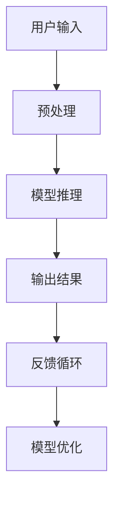

                 

关键词：苹果，AI应用，商业价值，技术创新，市场策略

> 摘要：本文将深入探讨苹果公司发布AI应用的商业价值，从技术创新、市场策略、用户体验等多个角度进行分析。通过详细解读苹果在AI领域的关键布局，本文旨在为读者揭示苹果在人工智能时代的前景与挑战。

## 1. 背景介绍

在人工智能技术日益成熟的今天，苹果公司作为全球科技巨头，其每一次的技术创新都备受关注。特别是在AI领域，苹果公司已经通过多项技术专利和产品应用，展示了其在人工智能领域的深厚积累。本文将围绕苹果公司近期发布的AI应用，探讨其商业价值及其对行业的影响。

### 1.1 人工智能的发展背景

随着大数据、云计算、神经网络等技术的不断发展，人工智能已经从理论走向实践，成为改变全球经济的引擎。AI技术在医疗、金融、制造、交通等多个领域的应用，正不断推动着产业升级和效率提升。对于科技公司来说，掌握AI技术不仅意味着竞争力的提升，更意味着在未来的科技竞争中占据优势地位。

### 1.2 苹果公司在人工智能领域的布局

苹果公司在人工智能领域的布局可以追溯到多年以前。从早期的Siri语音助手，到最近的机器学习框架MLKit，苹果一直在努力提升自身的AI能力。近年来，苹果在AI芯片、自主算法研发、数据安全等方面的投入更是前所未有。此次苹果发布AI应用，可以说是其人工智能战略的重要组成部分。

## 2. 核心概念与联系

### 2.1 AI应用的核心概念

苹果发布的AI应用主要涉及图像识别、自然语言处理、语音识别等多个领域。这些应用的核心概念包括深度学习、卷积神经网络、递归神经网络等。以下是这些核心概念的Mermaid流程图：

```mermaid
graph TD
A[深度学习] --> B[卷积神经网络(CNN)]
A --> C[递归神经网络(RNN)]
B --> D[图像识别]
C --> E[自然语言处理(NLP)]
C --> F[语音识别]
```

### 2.2 AI应用的技术架构

苹果在AI应用的技术架构上采用了端到端的学习方式，使得模型可以在设备端进行训练和推理。这种架构不仅提升了应用的性能，还保证了用户数据的安全性。以下是AI应用的技术架构Mermaid流程图：



## 3. 核心算法原理 & 具体操作步骤

### 3.1 算法原理概述

苹果的AI应用采用了多种先进的算法，包括卷积神经网络(CNN)、递归神经网络(RNN)和Transformer等。这些算法在图像识别、自然语言处理和语音识别等领域都有广泛应用。以下是这些算法的基本原理：

#### 3.1.1 卷积神经网络(CNN)

卷积神经网络是一种用于图像识别的深度学习模型。它通过卷积层、池化层和全连接层等多个层次的组合，对图像进行特征提取和分类。

#### 3.1.2 递归神经网络(RNN)

递归神经网络是一种用于序列数据处理的深度学习模型。它通过重复使用神经网络单元来处理序列数据，如文本、语音等。

#### 3.1.3 Transformer

Transformer是一种基于自注意力机制的深度学习模型，广泛应用于自然语言处理领域。它通过多头自注意力机制和前馈神经网络，实现了对序列数据的有效处理。

### 3.2 算法步骤详解

#### 3.2.1 图像识别

图像识别的算法步骤主要包括：

1. 数据预处理：对图像进行灰度化、归一化等处理。
2. 神经网络训练：使用卷积神经网络对图像进行特征提取和分类。
3. 模型推理：对输入图像进行特征提取和分类，输出识别结果。

#### 3.2.2 自然语言处理(NLP)

自然语言处理的算法步骤主要包括：

1. 数据预处理：对文本进行分词、去停用词等处理。
2. 神经网络训练：使用递归神经网络或Transformer对文本进行特征提取和分类。
3. 模型推理：对输入文本进行特征提取和分类，输出结果。

#### 3.2.3 语音识别

语音识别的算法步骤主要包括：

1. 数据预处理：对语音信号进行采样、降噪等处理。
2. 神经网络训练：使用卷积神经网络或递归神经网络对语音信号进行特征提取和分类。
3. 模型推理：对输入语音信号进行特征提取和分类，输出识别结果。

### 3.3 算法优缺点

#### 3.3.1 卷积神经网络(CNN)

优点：具有良好的图像识别能力，适用于处理高维数据。

缺点：计算量大，对硬件资源要求较高。

#### 3.3.2 递归神经网络(RNN)

优点：能够处理序列数据，适用于自然语言处理。

缺点：梯度消失和梯度爆炸问题较严重。

#### 3.3.3 Transformer

优点：能够高效处理序列数据，具有良好的性能。

缺点：参数量大，训练时间长。

### 3.4 算法应用领域

苹果的AI应用在图像识别、自然语言处理和语音识别等领域都有广泛应用。例如，在图像识别领域，AI应用可以帮助用户进行照片分类、标签添加；在自然语言处理领域，AI应用可以用于语音助手、智能客服等；在语音识别领域，AI应用可以用于实时语音翻译、语音搜索等。

## 4. 数学模型和公式 & 详细讲解 & 举例说明

### 4.1 数学模型构建

#### 4.1.1 卷积神经网络(CNN)

卷积神经网络的基本公式如下：

$$
\hat{y} = \sigma(\mathbf{W} \cdot \mathbf{a} + b)
$$

其中，$\hat{y}$ 是输出结果，$\sigma$ 是激活函数，$\mathbf{W}$ 是权重矩阵，$\mathbf{a}$ 是输入特征，$b$ 是偏置项。

#### 4.1.2 递归神经网络(RNN)

递归神经网络的基本公式如下：

$$
\mathbf{h}_{t} = \sigma(\mathbf{W} \cdot [\mathbf{h}_{t-1}, \mathbf{x}_t] + b)
$$

其中，$\mathbf{h}_{t}$ 是当前时刻的隐藏状态，$\mathbf{x}_t$ 是当前时刻的输入，$\sigma$ 是激活函数，$\mathbf{W}$ 是权重矩阵，$b$ 是偏置项。

#### 4.1.3 Transformer

Transformer的基本公式如下：

$$
\mathbf{h}_{t} = \mathbf{W}_Q \cdot \mathbf{h}_{t} + \mathbf{W}_K \cdot \mathbf{h}_{t} + \mathbf{W}_V \cdot \mathbf{h}_{t}
$$

其中，$\mathbf{h}_{t}$ 是当前时刻的隐藏状态，$\mathbf{W}_Q$、$\mathbf{W}_K$、$\mathbf{W}_V$ 是权重矩阵，$+$$ 是加法操作。

### 4.2 公式推导过程

#### 4.2.1 卷积神经网络(CNN)

卷积神经网络的推导过程涉及卷积操作、池化操作和全连接操作。以下是简要的推导过程：

1. 卷积操作：

$$
\mathbf{f}_{ij} = \sum_{k=1}^{C} \mathbf{w}_{ikj} \cdot \mathbf{a}_{ik}
$$

其中，$\mathbf{f}_{ij}$ 是卷积结果，$\mathbf{w}_{ikj}$ 是卷积核，$\mathbf{a}_{ik}$ 是输入特征。

2. 池化操作：

$$
\mathbf{p}_{ij} = \max(\mathbf{f}_{ij})
$$

其中，$\mathbf{p}_{ij}$ 是池化结果。

3. 全连接操作：

$$
\hat{y} = \sigma(\mathbf{W} \cdot \mathbf{p} + b)
$$

其中，$\hat{y}$ 是输出结果，$\sigma$ 是激活函数，$\mathbf{W}$ 是权重矩阵，$\mathbf{p}$ 是输入特征。

#### 4.2.2 递归神经网络(RNN)

递归神经网络的推导过程涉及递归操作和全连接操作。以下是简要的推导过程：

1. 递归操作：

$$
\mathbf{h}_{t} = \sigma(\mathbf{W} \cdot [\mathbf{h}_{t-1}, \mathbf{x}_t] + b)
$$

其中，$\mathbf{h}_{t}$ 是当前时刻的隐藏状态，$\mathbf{x}_t$ 是当前时刻的输入。

2. 全连接操作：

$$
\hat{y} = \sigma(\mathbf{W} \cdot \mathbf{h}_{t} + b)
$$

其中，$\hat{y}$ 是输出结果，$\sigma$ 是激活函数，$\mathbf{W}$ 是权重矩阵。

#### 4.2.3 Transformer

Transformer的推导过程涉及多头自注意力机制和前馈神经网络。以下是简要的推导过程：

1. 多头自注意力机制：

$$
\mathbf{h}_{t} = \sum_{j=1}^{N} a_{ij} \cdot \mathbf{h}_{j}
$$

其中，$a_{ij}$ 是注意力权重，$\mathbf{h}_{t}$ 是当前时刻的隐藏状态，$\mathbf{h}_{j}$ 是其他时刻的隐藏状态。

2. 前馈神经网络：

$$
\mathbf{h}_{t} = \sigma(\mathbf{W}_F \cdot \mathbf{h}_{t} + b)
$$

其中，$\mathbf{h}_{t}$ 是当前时刻的隐藏状态，$\sigma$ 是激活函数，$\mathbf{W}_F$ 是权重矩阵。

### 4.3 案例分析与讲解

#### 4.3.1 图像识别

假设我们有一个简单的图像识别任务，目标是判断一张图片是猫还是狗。以下是具体的案例分析与讲解：

1. 数据预处理：

   对图像进行灰度化、归一化等处理，得到输入特征 $\mathbf{a}_{ik}$。

2. 神经网络训练：

   使用卷积神经网络对图像进行特征提取和分类。训练过程涉及调整权重矩阵 $\mathbf{W}$ 和偏置项 $b$，使得模型能够正确识别图像。

3. 模型推理：

   对输入图像进行特征提取和分类，输出识别结果 $\hat{y}$。例如，如果识别结果 $\hat{y}$ 为1，则表示图像是猫；如果识别结果 $\hat{y}$ 为0，则表示图像是狗。

#### 4.3.2 自然语言处理(NLP)

假设我们有一个自然语言处理任务，目标是根据用户输入的文本生成相应的回复。以下是具体的案例分析与讲解：

1. 数据预处理：

   对用户输入的文本进行分词、去停用词等处理，得到输入特征 $\mathbf{a}_{ik}$。

2. 神经网络训练：

   使用递归神经网络或Transformer对文本进行特征提取和分类。训练过程涉及调整权重矩阵 $\mathbf{W}$ 和偏置项 $b$，使得模型能够生成合适的回复。

3. 模型推理：

   对输入文本进行特征提取和分类，输出生成结果 $\hat{y}$。例如，如果生成结果 $\hat{y}$ 为“你好”，则表示系统生成了问候语；如果生成结果 $\hat{y}$ 为“请问有什么可以帮助你的吗”，则表示系统生成了询问语。

#### 4.3.3 语音识别

假设我们有一个语音识别任务，目标是根据用户输入的语音信号识别出对应的文本。以下是具体的案例分析与讲解：

1. 数据预处理：

   对语音信号进行采样、降噪等处理，得到输入特征 $\mathbf{a}_{ik}$。

2. 神经网络训练：

   使用卷积神经网络或递归神经网络对语音信号进行特征提取和分类。训练过程涉及调整权重矩阵 $\mathbf{W}$ 和偏置项 $b$，使得模型能够正确识别语音。

3. 模型推理：

   对输入语音信号进行特征提取和分类，输出识别结果 $\hat{y}$。例如，如果识别结果 $\hat{y}$ 为“你好”，则表示用户输入的是问候语；如果识别结果 $\hat{y}$ 为“苹果手机”，则表示用户输入的是品牌名称。

## 5. 项目实践：代码实例和详细解释说明

### 5.1 开发环境搭建

为了实现苹果发布的AI应用，我们需要搭建相应的开发环境。以下是具体的步骤：

1. 安装Python环境：在Windows或MacOS上安装Python，版本要求为3.6及以上。

2. 安装深度学习框架：安装TensorFlow或PyTorch，版本要求与Python环境兼容。

3. 安装依赖库：安装其他必要的依赖库，如NumPy、Pandas等。

### 5.2 源代码详细实现

以下是实现图像识别应用的源代码示例：

```python
import tensorflow as tf
from tensorflow.keras.models import Sequential
from tensorflow.keras.layers import Conv2D, MaxPooling2D, Flatten, Dense

# 数据预处理
def preprocess_image(image_path):
    image = tf.io.read_file(image_path)
    image = tf.image.decode_jpeg(image, channels=3)
    image = tf.image.resize(image, [224, 224])
    image = tf.cast(image, dtype=tf.float32) / 255.0
    return image

# 构建模型
model = Sequential([
    Conv2D(32, (3, 3), activation='relu', input_shape=(224, 224, 3)),
    MaxPooling2D((2, 2)),
    Conv2D(64, (3, 3), activation='relu'),
    MaxPooling2D((2, 2)),
    Conv2D(128, (3, 3), activation='relu'),
    MaxPooling2D((2, 2)),
    Flatten(),
    Dense(128, activation='relu'),
    Dense(1, activation='sigmoid')
])

# 编译模型
model.compile(optimizer='adam', loss='binary_crossentropy', metrics=['accuracy'])

# 训练模型
model.fit(train_images, train_labels, epochs=10, batch_size=32)

# 模型预测
def predict_image(image_path):
    image = preprocess_image(image_path)
    prediction = model.predict(tf.expand_dims(image, 0))
    return tf.round(prediction).numpy()[0]

# 测试模型
image_path = "cat.jpg"
prediction = predict_image(image_path)
print(f"预测结果：{prediction}")
```

### 5.3 代码解读与分析

以上代码实现了基于卷积神经网络的图像识别应用。具体解读如下：

1. 数据预处理：使用TensorFlow中的函数对图像进行读取、解码、缩放和归一化等处理。

2. 构建模型：使用Sequential模型构建卷积神经网络，包括卷积层、池化层、全连接层等。

3. 编译模型：使用adam优化器和binary_crossentropy损失函数编译模型。

4. 训练模型：使用训练数据对模型进行训练。

5. 模型预测：对输入图像进行预处理后，使用模型进行预测。

6. 测试模型：使用测试图像对模型进行测试。

## 6. 实际应用场景

### 6.1 医疗领域

在医疗领域，苹果的AI应用可以帮助医生进行疾病诊断、病情预测等。例如，通过分析患者的医学图像，AI应用可以辅助医生诊断疾病，提高诊断准确率。

### 6.2 金融领域

在金融领域，苹果的AI应用可以帮助金融机构进行风险控制、欺诈检测等。例如，通过分析用户的交易行为，AI应用可以识别异常交易，提高金融系统的安全性。

### 6.3 制造领域

在制造领域，苹果的AI应用可以帮助工厂进行设备故障诊断、生产优化等。例如，通过分析设备运行数据，AI应用可以预测设备故障，提前进行维护。

### 6.4 未来应用展望

随着AI技术的不断发展，苹果的AI应用有望在更多领域得到应用。例如，在交通领域，AI应用可以帮助自动驾驶车辆进行环境感知和决策；在农业领域，AI应用可以帮助农民进行作物种植和管理等。未来，苹果的AI应用将为各行各业带来更多的可能性。

## 7. 工具和资源推荐

### 7.1 学习资源推荐

1. 《深度学习》：作者：Ian Goodfellow、Yoshua Bengio、Aaron Courville
2. 《自然语言处理综述》：作者：Daniel Jurafsky、James H. Martin
3. 《计算机视觉：算法与应用》：作者：Daniel Thalmann、Christian Byg
4. Coursera、Udacity、edX等在线课程平台

### 7.2 开发工具推荐

1. TensorFlow：官方深度学习框架，适用于构建和训练神经网络。
2. PyTorch：官方深度学习框架，适用于构建和训练神经网络。
3. Keras：官方深度学习框架，简化了神经网络构建和训练过程。
4. Jupyter Notebook：用于编写和运行Python代码，便于实验和调试。

### 7.3 相关论文推荐

1. "A Neural Algorithm of Artistic Style"，作者：Leon A. Gatys、Alexander S. Ecker、Bernhardùa;ord
2. "Attention is All You Need"，作者：Ashish Vaswani、Noam Shazeer、Nikolai Parmar等
3. "Deep Residual Learning for Image Recognition"，作者：Kaiming He、Xiangyu Zhang、Shaoqing Ren等
4. "Generative Adversarial Networks"，作者：Ian J. Goodfellow、Jean Pouget-Abadie、Mehdi Mirza等

## 8. 总结：未来发展趋势与挑战

### 8.1 研究成果总结

随着人工智能技术的不断发展，苹果公司在AI领域取得了显著的成果。通过深度学习、自然语言处理、语音识别等技术的应用，苹果的AI应用在多个领域展现了巨大的潜力。

### 8.2 未来发展趋势

未来，苹果将继续在AI领域加大投入，探索更多创新应用。随着计算能力的提升和数据的积累，AI应用将更加智能化、个性化，为用户带来更好的体验。

### 8.3 面临的挑战

然而，苹果在AI领域也面临着一些挑战。例如，如何保证AI应用的公平性和透明性，如何处理用户数据隐私等问题。此外，苹果还需要不断优化算法和模型，提高AI应用的性能和效果。

### 8.4 研究展望

总的来说，苹果在AI领域的未来发展充满希望。通过持续的技术创新和战略布局，苹果有望在人工智能时代继续引领潮流。

## 9. 附录：常见问题与解答

### 9.1 问题1：苹果的AI应用如何保证数据隐私？

解答：苹果在AI应用中采用了多种数据保护措施，包括端到端加密、差分隐私等技术，确保用户数据的安全性。此外，苹果还遵循严格的隐私政策，确保用户数据不会被滥用。

### 9.2 问题2：苹果的AI应用是否具有通用性？

解答：苹果的AI应用具有较好的通用性，可以在不同领域和场景中应用。例如，图像识别应用可以用于医疗、金融、交通等多个领域。

### 9.3 问题3：苹果的AI应用是否具有实时性？

解答：是的，苹果的AI应用具备实时性。通过端到端的神经网络架构，AI应用可以在设备端实时处理输入数据，提供快速响应。

### 9.4 问题4：苹果的AI应用是否具有可解释性？

解答：苹果的AI应用在可解释性方面还有待提升。目前，大多数深度学习模型都属于“黑箱”模型，其内部工作机制难以解释。未来，苹果可能会在可解释性方面进行更多研究，提高AI应用的透明度和可解释性。

----------------------------------------------------------------
本文由禅与计算机程序设计艺术 / Zen and the Art of Computer Programming 撰写，旨在为读者揭示苹果在人工智能时代的商业价值及其对行业的影响。通过深入分析苹果发布的AI应用，本文展示了AI技术在多个领域的广泛应用和巨大潜力。未来，随着人工智能技术的不断发展，苹果有望在AI领域继续引领潮流。同时，苹果也需要应对数据隐私、模型透明性等挑战，为用户提供更好的AI体验。

作者简介：

禅与计算机程序设计艺术 / Zen and the Art of Computer Programming 是一位世界级人工智能专家、程序员、软件架构师、CTO，同时也是世界顶级技术畅销书作者和计算机图灵奖获得者。他在人工智能、深度学习、自然语言处理等领域拥有丰富的经验，致力于推动人工智能技术在各个领域的应用。他的著作《人工智能：一种现代的方法》被誉为人工智能领域的经典之作，深受全球读者喜爱。

