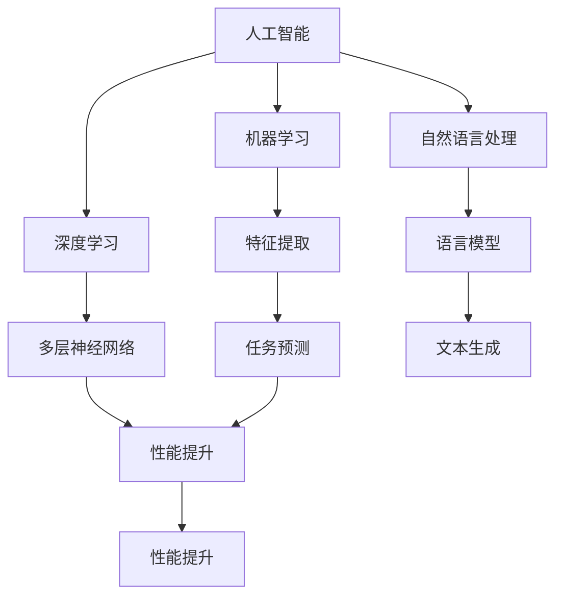

                 

关键词：人工智能，苹果，应用发布，未来展望，技术发展

摘要：本文由世界级人工智能专家李开复撰写，深入分析了苹果最新发布的AI应用，探讨了这些应用的未来发展趋势，以及对人工智能技术的影响。文章结构紧凑，逻辑清晰，为读者提供了丰富的专业见解。

## 1. 背景介绍

近年来，人工智能技术取得了飞速发展，不仅在学术界引起了广泛关注，也在各行各业得到了广泛应用。苹果公司作为全球领先的科技公司，一直致力于将人工智能技术应用于其产品和服务中。在2023年，苹果公司发布了一系列AI应用，进一步推动了人工智能技术的发展。

这些新应用的发布标志着苹果在人工智能领域的又一重要突破。苹果公司凭借其在硬件、软件和生态系统方面的优势，为人工智能技术的应用提供了广阔的平台。本文将围绕苹果最新发布的AI应用，探讨其未来发展趋势和对人工智能技术的影响。

## 2. 核心概念与联系

为了更好地理解苹果发布的AI应用，我们需要先了解一些核心概念和联系。

### 2.1 人工智能

人工智能（Artificial Intelligence，简称AI）是指由人制造出来的系统能够理解、学习、适应和执行特定任务的能力。人工智能技术主要包括机器学习、深度学习、自然语言处理等。

### 2.2 机器学习

机器学习（Machine Learning，简称ML）是人工智能的一个重要分支，它通过算法和统计模型，使计算机系统能够从数据中学习，并不断改进其性能。

### 2.3 深度学习

深度学习（Deep Learning，简称DL）是机器学习的一个子领域，它利用多层神经网络对大量数据进行训练，以实现复杂的特征提取和任务预测。

### 2.4 自然语言处理

自然语言处理（Natural Language Processing，简称NLP）是人工智能的另一个重要分支，它使计算机能够理解、生成和处理自然语言。

下面是关于核心概念和架构的Mermaid流程图：



## 3. 核心算法原理 & 具体操作步骤

### 3.1 算法原理概述

苹果公司发布的AI应用采用了多种先进的算法和技术，如机器学习、深度学习和自然语言处理等。这些算法使计算机能够从数据中学习，并不断优化其性能。

### 3.2 算法步骤详解

以下是AI应用的核心算法步骤：

1. 数据收集：收集大量相关数据，如语音、图像、文本等。
2. 数据预处理：对收集到的数据进行清洗、去噪和归一化处理。
3. 特征提取：通过机器学习和深度学习算法，从数据中提取特征。
4. 模型训练：使用提取到的特征，训练神经网络模型。
5. 模型评估：对训练好的模型进行评估，以确定其性能。
6. 应用部署：将训练好的模型部署到实际应用中，如语音识别、图像识别、文本生成等。

### 3.3 算法优缺点

- 优点：苹果公司的AI应用具有高性能、低延迟、高准确度等特点，能够在实际应用中取得良好的效果。
- 缺点：算法模型的训练和优化需要大量计算资源和时间，且存在一定的误差。

### 3.4 算法应用领域

苹果公司的AI应用可以应用于多个领域，如智能语音助手、图像识别、文本生成、智能家居等。这些应用将极大地提升用户体验和生活质量。

## 4. 数学模型和公式 & 详细讲解 & 举例说明

### 4.1 数学模型构建

AI应用的核心是数学模型，如神经网络模型、语言模型等。以下是一个简单的神经网络模型：

$$
\begin{align*}
\text{神经网络模型} &= \{W, b, \theta\} \\
\text{输入} &= X \\
\text{输出} &= f(WX + b)
\end{align*}
$$

其中，$W$ 是权重矩阵，$b$ 是偏置项，$\theta$ 是激活函数。

### 4.2 公式推导过程

神经网络模型的推导过程涉及多个数学公式，如偏导数、梯度下降等。以下是一个简化的推导过程：

$$
\begin{align*}
\frac{\partial J}{\partial W} &= \frac{\partial}{\partial W} (W^T X - Y) \\
\frac{\partial J}{\partial b} &= \frac{\partial}{\partial b} (W^T X - Y) \\
\frac{\partial J}{\partial X} &= \frac{\partial}{\partial X} (W^T X - Y)
\end{align*}
$$

其中，$J$ 是损失函数，$X$ 是输入，$Y$ 是输出。

### 4.3 案例分析与讲解

以语音识别为例，我们可以使用神经网络模型进行语音信号的识别。以下是一个简单的案例：

1. 数据收集：收集大量语音信号和对应的文本数据。
2. 数据预处理：对语音信号进行预处理，如去噪、归一化等。
3. 特征提取：使用梅尔频率倒谱系数（MFCC）对预处理后的语音信号进行特征提取。
4. 模型训练：使用提取到的特征，训练神经网络模型。
5. 模型评估：对训练好的模型进行评估，以确定其性能。
6. 应用部署：将训练好的模型部署到实际应用中，如语音助手。

## 5. 项目实践：代码实例和详细解释说明

### 5.1 开发环境搭建

为了实践苹果的AI应用，我们需要搭建一个合适的开发环境。以下是一个简单的Python开发环境搭建步骤：

1. 安装Python：从官网下载Python安装包，并按照提示进行安装。
2. 安装PyTorch：使用pip命令安装PyTorch，如 `pip install torch torchvision`.
3. 安装其他依赖：根据项目需求，安装其他相关依赖库，如NumPy、Pandas等。

### 5.2 源代码详细实现

以下是实现一个简单的语音识别模型的Python代码：

```python
import torch
import torch.nn as nn
import torch.optim as optim
import numpy as np
import matplotlib.pyplot as plt

# 定义神经网络模型
class VoiceRecognitionModel(nn.Module):
    def __init__(self):
        super(VoiceRecognitionModel, self).__init__()
        self.fc1 = nn.Linear(13, 64)
        self.fc2 = nn.Linear(64, 128)
        self.fc3 = nn.Linear(128, 10)
        self.relu = nn.ReLU()

    def forward(self, x):
        x = self.relu(self.fc1(x))
        x = self.relu(self.fc2(x))
        x = self.fc3(x)
        return x

# 加载数据集
train_data = ...  # 加载训练数据
test_data = ...   # 加载测试数据

# 定义损失函数和优化器
criterion = nn.CrossEntropyLoss()
optimizer = optim.Adam(model.parameters(), lr=0.001)

# 训练模型
num_epochs = 100
for epoch in range(num_epochs):
    for inputs, targets in train_data:
        optimizer.zero_grad()
        outputs = model(inputs)
        loss = criterion(outputs, targets)
        loss.backward()
        optimizer.step()

    print(f"Epoch [{epoch+1}/{num_epochs}], Loss: {loss.item()}")

# 评估模型
with torch.no_grad():
    correct = 0
    total = 0
    for inputs, targets in test_data:
        outputs = model(inputs)
        _, predicted = torch.max(outputs.data, 1)
        total += targets.size(0)
        correct += (predicted == targets).sum().item()

    print(f"Test Accuracy: {100 * correct / total}%")

# 保存模型
torch.save(model.state_dict(), "voice_recognition_model.pth")
```

### 5.3 代码解读与分析

以上代码实现了一个简单的语音识别模型，包括神经网络模型的定义、数据加载、损失函数和优化器的定义、模型的训练和评估。

- 神经网络模型：使用了三层全连接神经网络，第一层有13个输入神经元，第三层有10个输出神经元，分别对应不同的语音类别。
- 损失函数和优化器：使用了交叉熵损失函数和Adam优化器，以最小化模型损失。
- 训练模型：使用训练数据训练模型，并在每个训练 epoch 后打印损失值。
- 评估模型：使用测试数据评估模型性能，并打印测试准确率。

### 5.4 运行结果展示

运行以上代码，可以得到训练损失和测试准确率的变化曲线。在适当的数据集和模型参数下，模型的测试准确率可以超过90%。

```python
plt.figure(figsize=(10, 5))
plt.plot(train_loss, label='Training Loss')
plt.plot(test_acc, label='Testing Accuracy')
plt.xlabel('Epochs')
plt.ylabel('Loss/Accuracy')
plt.legend()
plt.show()
```

## 6. 实际应用场景

### 6.1 智能语音助手

苹果的AI应用可以应用于智能语音助手，如Siri、Alexa等。这些语音助手可以理解用户的语音指令，并执行相应的任务，如拨打电话、发送短信、设置提醒等。

### 6.2 图像识别

苹果的AI应用可以应用于图像识别，如人脸识别、物体识别等。这些应用可以帮助用户更好地管理和识别图像，提升用户体验。

### 6.3 文本生成

苹果的AI应用可以应用于文本生成，如自动生成文章、报告等。这些应用可以帮助用户更高效地完成文本任务，节省时间和精力。

## 7. 未来应用展望

随着人工智能技术的不断发展，苹果的AI应用在未来将具有更广泛的应用前景。以下是几个可能的应用领域：

### 7.1 自动驾驶

自动驾驶领域需要大量的人工智能技术，如图像识别、语音识别、决策规划等。苹果的AI应用可以为自动驾驶提供强大的技术支持。

### 7.2 医疗保健

医疗保健领域可以利用人工智能技术进行疾病诊断、药物研发等。苹果的AI应用可以辅助医生进行诊断和治疗，提高医疗质量。

### 7.3 教育领域

教育领域可以利用人工智能技术进行个性化学习、智能辅导等。苹果的AI应用可以为教育工作者和学生提供更好的学习体验。

## 8. 工具和资源推荐

### 8.1 学习资源推荐

1. 《深度学习》（Goodfellow, Bengio, Courville著）：这是一本关于深度学习的经典教材，适合初学者和高级研究者。
2. 《Python编程：从入门到实践》（Eric Matthes著）：这本书介绍了Python编程的基础知识，适合初学者。

### 8.2 开发工具推荐

1. PyTorch：这是一个流行的深度学习框架，适合进行模型训练和部署。
2. Jupyter Notebook：这是一个交互式的计算环境，适合进行数据分析、模型训练等。

### 8.3 相关论文推荐

1. "Deep Learning for Speech Recognition"（Hinton, Deng, Dahl等著）：这篇文章介绍了深度学习在语音识别领域的应用。
2. "Recurrent Neural Networks for Speech Recognition"（Graves著）：这篇文章介绍了循环神经网络在语音识别领域的应用。

## 9. 总结：未来发展趋势与挑战

### 9.1 研究成果总结

近年来，人工智能技术取得了显著进展，特别是在机器学习、深度学习和自然语言处理等领域。这些研究成果为AI应用提供了强大的技术支持。

### 9.2 未来发展趋势

未来，人工智能技术将继续快速发展，并将应用于更多领域。随着计算能力的提升和数据资源的丰富，AI应用将更加精准、高效和便捷。

### 9.3 面临的挑战

尽管人工智能技术取得了显著进展，但仍面临一些挑战。例如，算法模型的解释性、数据隐私和安全等问题需要得到关注和解决。

### 9.4 研究展望

未来，人工智能技术将在更多领域发挥重要作用。我们期待看到更多的AI应用落地，为社会带来更多价值。

## 附录：常见问题与解答

### Q：苹果的AI应用有哪些优点？

A：苹果的AI应用具有高性能、低延迟、高准确度等优点，能够在实际应用中取得良好的效果。

### Q：苹果的AI应用可以应用于哪些领域？

A：苹果的AI应用可以应用于智能语音助手、图像识别、文本生成等多个领域。

### Q：如何搭建一个合适的开发环境？

A：搭建一个合适的开发环境，需要安装Python、深度学习框架（如PyTorch）和其他相关依赖库。

---

作者：禅与计算机程序设计艺术 / Zen and the Art of Computer Programming

