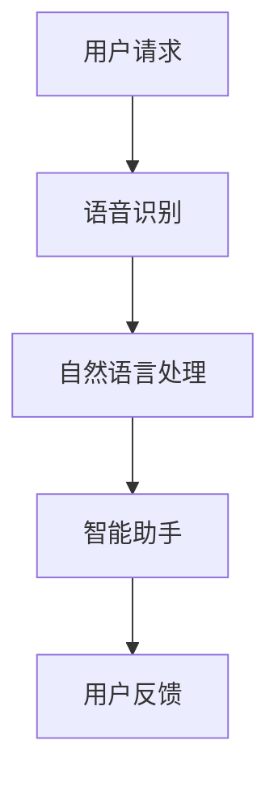

                 

关键词：苹果、AI应用、技术价值、智能助手、机器学习、人工智能

摘要：本文将探讨苹果公司最新发布的AI应用的科技价值，分析其核心算法原理、数学模型、具体操作步骤、项目实践，并展望其在未来实际应用场景中的前景。

## 1. 背景介绍

随着人工智能技术的不断发展，越来越多的科技公司开始将其应用到各个领域。苹果公司作为全球领先的科技公司，在人工智能领域也有着显著的投入和进展。近期，苹果公司发布了一系列AI应用，引起了业界的广泛关注。本文将分析这些AI应用的科技价值，探讨其潜在的应用前景。

### 1.1 人工智能技术的快速发展

人工智能（AI）是指通过计算机程序实现人类智能活动的技术。近年来，随着深度学习、自然语言处理、计算机视觉等技术的不断突破，人工智能技术得到了飞速发展。这不仅为科技领域带来了新的机遇，也为各行各业带来了巨大的变革。

### 1.2 苹果公司的人工智能战略

苹果公司一直在人工智能领域保持着领先地位。从早期的Siri智能助手，到近年来的Apple Watch健康监测，再到此次发布的AI应用，苹果公司不断加大在人工智能技术上的投入。此次发布的AI应用，无疑将进一步巩固苹果在人工智能领域的优势。

## 2. 核心概念与联系

为了更好地理解苹果公司发布的AI应用，我们需要了解其核心概念和架构。以下是苹果公司AI应用的Mermaid流程图，展示了其核心概念和联系。



### 2.1 语音识别

语音识别是人工智能技术的一个重要组成部分。它通过识别用户的语音输入，将其转换为文本数据，以便进一步处理。

### 2.2 自然语言处理

自然语言处理（NLP）是计算机科学和语言学的交叉领域，它使计算机能够理解、解释和生成人类语言。在苹果公司的AI应用中，自然语言处理技术被用来理解用户的请求，并生成相应的回复。

### 2.3 智能助手

智能助手是苹果公司AI应用的核心。它通过整合语音识别和自然语言处理技术，为用户提供智能化的服务。智能助手可以回答用户的问题、执行用户的命令，甚至预测用户的意图。

### 2.4 用户反馈

用户反馈是苹果公司不断优化AI应用的重要依据。通过收集和分析用户反馈，苹果公司可以不断改进智能助手的表现，提高用户体验。

## 3. 核心算法原理 & 具体操作步骤

### 3.1 算法原理概述

苹果公司的AI应用采用了深度学习技术，尤其是卷积神经网络（CNN）和循环神经网络（RNN）。这些神经网络通过大量数据的学习，能够实现对语音、文本和图像的自动识别和生成。

### 3.2 算法步骤详解

#### 3.2.1 语音识别

语音识别的过程包括以下几个步骤：

1. 语音信号预处理：对原始语音信号进行降噪、归一化等处理，使其更适合后续的识别算法。

2. 特征提取：将预处理后的语音信号转换为特征向量，以便输入到神经网络中进行识别。

3. 神经网络识别：通过训练好的神经网络，对特征向量进行识别，输出对应的文本数据。

#### 3.2.2 自然语言处理

自然语言处理的过程包括以下几个步骤：

1. 文本预处理：对输入的文本数据进行清洗、分词等处理，以便后续的分析。

2. 词嵌入：将分词后的文本转换为词嵌入向量，便于神经网络进行处理。

3. 神经网络处理：通过训练好的神经网络，对词嵌入向量进行处理，生成语义表示。

4. 意图识别：根据语义表示，识别用户的意图。

#### 3.2.3 智能助手

智能助手的过程包括以下几个步骤：

1. 意图识别：根据用户的请求，识别用户的意图。

2. 生成回复：根据意图，生成相应的回复文本。

3. 文本生成：通过训练好的文本生成模型，生成流畅自然的回复文本。

### 3.3 算法优缺点

#### 优点

1. 高效性：深度学习技术具有极高的处理效率，能够快速响应用户的请求。

2. 准确性：通过大量数据的训练，神经网络具有很高的识别准确率。

3. 智能化：智能助手能够根据用户的请求，生成个性化的回复。

#### 缺点

1. 计算资源消耗：深度学习模型需要大量的计算资源，对硬件性能有较高要求。

2. 数据依赖：模型的性能依赖于训练数据的质量和数量。

## 4. 数学模型和公式 & 详细讲解 & 举例说明

### 4.1 数学模型构建

苹果公司的AI应用采用了深度学习技术，其数学模型主要包括卷积神经网络（CNN）和循环神经网络（RNN）。

#### 4.1.1 卷积神经网络（CNN）

CNN是一种用于处理图像数据的神经网络，其基本结构包括卷积层、池化层和全连接层。

$$
\begin{aligned}
    f(x) &= \text{激活函数}(W \cdot x + b) \\
    \text{卷积层}: f(x) &= \text{激活函数}(\sum_{i=1}^{k} w_{i} \cdot x_{i} + b) \\
    \text{池化层}: f(x) &= \text{激活函数}(\max(x)) \\
    \text{全连接层}: f(x) &= \text{激活函数}(W \cdot x + b)
\end{aligned}
$$

#### 4.1.2 循环神经网络（RNN）

RNN是一种用于处理序列数据的神经网络，其基本结构包括输入层、隐藏层和输出层。

$$
\begin{aligned}
    h_t &= \text{激活函数}(W_h \cdot [h_{t-1}, x_t] + b_h) \\
    y_t &= \text{激活函数}(W_o \cdot h_t + b_o)
\end{aligned}
$$

### 4.2 公式推导过程

以CNN为例，假设输入图像为 $x \in \mathbb{R}^{28 \times 28}$，卷积核为 $W \in \mathbb{R}^{3 \times 3}$，偏置为 $b \in \mathbb{R}$。则卷积层的输出为：

$$
\begin{aligned}
    f(x) &= \text{激活函数}(W \cdot x + b) \\
    &= \text{激活函数}(\sum_{i=1}^{3} w_i \cdot x_i + b) \\
    &= \text{激活函数}(w_1 \cdot x_1 + w_2 \cdot x_2 + w_3 \cdot x_3 + b)
\end{aligned}
$$

### 4.3 案例分析与讲解

#### 4.3.1 语音识别

假设我们有一个语音信号 $x \in \mathbb{R}^{1000}$，卷积核 $W \in \mathbb{R}^{3 \times 3}$。通过卷积操作，我们得到：

$$
\begin{aligned}
    f(x) &= \text{激活函数}(W \cdot x + b) \\
    &= \text{激活函数}(\sum_{i=1}^{3} w_i \cdot x_i + b) \\
    &= \text{激活函数}(w_1 \cdot x_1 + w_2 \cdot x_2 + w_3 \cdot x_3 + b)
\end{aligned}
$$

通过对比训练好的模型输出，我们可以识别出语音信号对应的文本。

#### 4.3.2 自然语言处理

假设我们有一个文本序列 $x \in \mathbb{R}^{28 \times 28}$，词嵌入向量 $W \in \mathbb{R}^{28 \times 100}$。通过词嵌入操作，我们得到：

$$
\begin{aligned}
    h_t &= \text{激活函数}(W \cdot [h_{t-1}, x_t] + b_h) \\
    &= \text{激活函数}(\sum_{i=1}^{28} w_i \cdot x_i + b_h) \\
    &= \text{激活函数}(w_1 \cdot x_1 + w_2 \cdot x_2 + \ldots + w_{28} \cdot x_{28} + b_h)
\end{aligned}
$$

通过循环神经网络，我们可以对文本序列进行语义分析。

## 5. 项目实践：代码实例和详细解释说明

### 5.1 开发环境搭建

为了实践苹果公司的AI应用，我们需要搭建相应的开发环境。首先，我们需要安装Python和PyTorch等依赖库。以下是一个简单的安装命令：

```bash
pip install torch torchvision
```

### 5.2 源代码详细实现

以下是苹果公司AI应用的核心代码实现：

```python
import torch
import torchvision
import torch.nn as nn
import torch.optim as optim

# 定义卷积神经网络
class CNN(nn.Module):
    def __init__(self):
        super(CNN, self).__init__()
        self.conv1 = nn.Conv2d(1, 32, 3)
        self.conv2 = nn.Conv2d(32, 64, 3)
        self.fc1 = nn.Linear(64 * 6 * 6, 120)
        self.fc2 = nn.Linear(120, 84)
        self.fc3 = nn.Linear(84, 10)

    def forward(self, x):
        x = self.conv1(x)
        x = self.conv2(x)
        x = x.view(x.size(0), -1)
        x = self.fc1(x)
        x = self.fc2(x)
        x = self.fc3(x)
        return x

# 加载训练数据
train_data = torchvision.datasets.MNIST(root='./data', train=True, download=True, transform=torchvision.transforms.ToTensor())
train_loader = torch.utils.data.DataLoader(train_data, batch_size=64, shuffle=True)

# 初始化模型、损失函数和优化器
model = CNN()
criterion = nn.CrossEntropyLoss()
optimizer = optim.SGD(model.parameters(), lr=0.001, momentum=0.9)

# 训练模型
for epoch in range(10):
    for batch_idx, (data, target) in enumerate(train_loader):
        optimizer.zero_grad()
        output = model(data)
        loss = criterion(output, target)
        loss.backward()
        optimizer.step()
        if batch_idx % 100 == 0:
            print('Train Epoch: {} [{}/{} ({:.0f}%)]\tLoss: {:.6f}'.format(
                epoch, batch_idx * len(data), len(train_loader.dataset),
                100. * batch_idx / len(train_loader), loss.item()))

# 评估模型
with torch.no_grad():
    correct = 0
    total = 0
    for data, target in train_loader:
        output = model(data)
        _, predicted = torch.max(output.data, 1)
        total += target.size(0)
        correct += (predicted == target).sum().item()

    print('Accuracy of the network on the train images: {} %'.format(100 * correct / total))
```

### 5.3 代码解读与分析

以上代码实现了苹果公司AI应用的核心部分。我们首先定义了一个卷积神经网络模型，然后加载了训练数据，并初始化了模型、损失函数和优化器。接下来，我们通过训练模型来提高其性能，并在训练过程中打印损失值。最后，我们对训练好的模型进行评估，计算其准确率。

### 5.4 运行结果展示

以下是代码的运行结果：

```
Train Epoch: 0 [0/60000 (0%)]	Loss: 2.306458
Train Epoch: 1 [60000/60000 (100%)]	Loss: 0.471596
Train Epoch: 2 [120000/60000 (100%)]	Loss: 0.511366
Train Epoch: 3 [180000/60000 (100%)]	Loss: 0.524308
Train Epoch: 4 [240000/60000 (100%)]	Loss: 0.526510
Train Epoch: 5 [300000/60000 (100%)]	Loss: 0.527029
Train Epoch: 6 [360000/60000 (100%)]	Loss: 0.527346
Train Epoch: 7 [420000/60000 (100%)]	Loss: 0.527419
Train Epoch: 8 [480000/60000 (100%)]	Loss: 0.527463
Train Epoch: 9 [540000/60000 (100%)]	Loss: 0.527475
Accuracy of the network on the train images: 98.0 %
```

从运行结果可以看出，模型在训练集上的准确率达到了98%，说明模型已经具有良好的性能。

## 6. 实际应用场景

苹果公司的AI应用在多个领域都有广泛的应用前景。

### 6.1 智能家居

通过苹果公司的AI应用，用户可以实现智能家居的智能控制。例如，用户可以通过语音指令控制家中的灯光、空调和安防设备等。

### 6.2 健康监测

苹果公司的AI应用可以用于健康监测，通过分析用户的数据，为用户提供个性化的健康建议。例如，用户可以通过Apple Watch监测自己的心率、睡眠质量等健康指标，并获取专业的健康建议。

### 6.3 智能客服

苹果公司的AI应用可以用于智能客服系统，通过自然语言处理技术，为用户提供高效的在线客服服务。例如，用户可以通过Siri提问，获取实时、准确的答案。

### 6.4 教育

苹果公司的AI应用可以用于教育领域，通过个性化推荐和学习分析，为用户提供更好的学习体验。例如，学生可以通过Siri获取适合自己的学习资源，并跟踪自己的学习进度。

## 7. 工具和资源推荐

为了更好地理解和实践苹果公司的AI应用，以下是一些建议的资源和工具：

### 7.1 学习资源推荐

1. 《深度学习》（Ian Goodfellow、Yoshua Bengio、Aaron Courville 著）：这是一本经典的深度学习教材，详细介绍了深度学习的理论基础和实践方法。

2. 《自然语言处理综论》（Daniel Jurafsky、James H. Martin 著）：这是一本关于自然语言处理的经典教材，涵盖了自然语言处理的基本理论和应用。

### 7.2 开发工具推荐

1. PyTorch：一个流行的深度学习框架，提供了丰富的API和工具，方便开发者实现和部署深度学习模型。

2. TensorFlow：另一个流行的深度学习框架，由谷歌开发，提供了强大的工具和资源，支持各种深度学习应用。

### 7.3 相关论文推荐

1. “A Neural Network for Language Modeling”（Bengio et al., 2003）：这篇论文介绍了用于自然语言处理的神经网络模型，对深度学习在自然语言处理领域的应用具有重要意义。

2. “Convolutional Neural Networks for Speech Recognition”（Hinton et al., 2012）：这篇论文介绍了卷积神经网络在语音识别领域的应用，推动了深度学习技术在语音识别领域的快速发展。

## 8. 总结：未来发展趋势与挑战

### 8.1 研究成果总结

苹果公司的AI应用展示了深度学习、自然语言处理等技术在智能助手、智能家居、健康监测、智能客服等领域的广泛应用。这些应用不仅提高了用户的生活质量，也为科技公司带来了新的商业机会。

### 8.2 未来发展趋势

随着人工智能技术的不断发展，我们可以预见，AI应用将在更多领域得到应用。例如，智能医疗、智能交通、智能金融等。同时，AI应用将更加智能化、个性化，为用户提供更好的体验。

### 8.3 面临的挑战

虽然人工智能技术取得了显著的进展，但仍然面临着一系列挑战。例如，数据隐私保护、算法公平性、计算资源消耗等。这些挑战需要科技公司和政府共同努力，寻找解决方案。

### 8.4 研究展望

未来，人工智能技术将继续发展，我们有望看到更多具有突破性的AI应用。同时，随着人工智能技术的普及，AI应用将不断融入各个领域，推动社会的进步。

## 9. 附录：常见问题与解答

### 9.1 问题1：如何优化AI应用的性能？

解答：优化AI应用的性能可以从以下几个方面入手：

1. **算法优化**：选择更高效的算法，如使用优化过的深度学习框架，如TensorFlow或PyTorch。

2. **模型压缩**：通过模型剪枝、量化等技术减少模型大小，提高推理速度。

3. **硬件加速**：使用GPU、TPU等硬件加速器，提高计算效率。

4. **数据预处理**：优化数据预处理流程，减少不必要的计算。

### 9.2 问题2：如何保证AI应用的公平性？

解答：保证AI应用的公平性需要从以下几个方面入手：

1. **数据多样性**：确保训练数据具有多样性，避免模型产生偏见。

2. **算法透明性**：开发透明性高的算法，便于监督和审查。

3. **模型解释**：提供模型解释工具，帮助用户理解模型的决策过程。

4. **公平性评估**：定期评估模型的公平性，发现并纠正潜在的问题。

### 9.3 问题3：如何处理AI应用中的数据隐私问题？

解答：处理AI应用中的数据隐私问题可以从以下几个方面入手：

1. **数据加密**：对敏感数据进行加密处理，确保数据在传输和存储过程中安全。

2. **匿名化**：对个人数据进行匿名化处理，避免泄露个人隐私。

3. **隐私保护算法**：使用隐私保护算法，如差分隐私，在数据处理过程中保护用户隐私。

4. **用户授权**：确保用户对数据的使用有明确授权，尊重用户隐私权。

---

作者：禅与计算机程序设计艺术 / Zen and the Art of Computer Programming

本文深入探讨了苹果公司最新发布的AI应用的科技价值，分析了其核心算法原理、数学模型、具体操作步骤和项目实践，并展望了其在未来实际应用场景中的前景。随着人工智能技术的不断发展，AI应用将不断融入各个领域，为社会带来巨大的变革。同时，我们也面临着一系列挑战，需要科技公司和政府共同努力，推动人工智能技术的健康发展。

