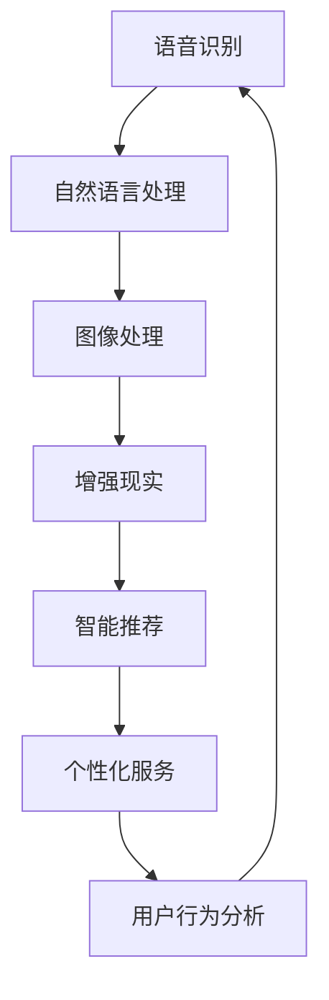

                 

关键词：人工智能，苹果，AI应用，趋势，技术发展

> 摘要：本文将探讨苹果公司近期发布的人工智能应用，分析其背后的技术趋势和潜在的市场影响，并展望未来人工智能在智能手机和移动计算领域的广泛应用前景。

## 1. 背景介绍

随着人工智能技术的飞速发展，苹果公司也开始加大在人工智能领域的投入。近年来，苹果公司在人工智能领域的进展引人注目，尤其是在语音识别、图像处理、自然语言处理等方面的技术取得了显著突破。近期，苹果公司发布了一系列基于人工智能的应用，引起了业界的广泛关注。本文将深入分析这些应用，探讨其背后的技术趋势和潜在的市场影响。

## 2. 核心概念与联系

在讨论苹果公司的人工智能应用之前，我们需要了解一些核心概念和技术架构。以下是一个简化版的Mermaid流程图，展示了这些核心概念和它们之间的联系：



### 2.1 语音识别

语音识别是人工智能领域的一个重要分支，它使设备能够理解并处理用户的语音指令。苹果公司的语音识别技术采用了深度学习算法，能够实现高精度的语音识别和实时交互。

### 2.2 自然语言处理

自然语言处理（NLP）是人工智能技术中的另一个重要领域，它使计算机能够理解、解释和生成人类语言。苹果公司的NLP技术不仅能够理解用户的语言输入，还能提供智能的回复和建议。

### 2.3 图像处理

图像处理技术在苹果公司的AI应用中扮演了重要角色，包括人脸识别、图像增强和图像分割等。这些技术使得苹果设备能够更好地理解和解释用户的视觉输入。

### 2.4 增强现实

增强现实（AR）是苹果公司近年来重点发展的领域之一。通过结合人工智能和图像处理技术，苹果公司能够为用户提供更加丰富和交互式的体验。

### 2.5 智能推荐

智能推荐技术在苹果公司的AI应用中得到了广泛应用，包括音乐、电影、新闻和购物推荐等。这些推荐系统基于用户的行为数据和使用习惯，为用户提供个性化的内容和服务。

### 2.6 个性化服务

个性化服务是苹果公司人工智能应用的另一个重要方面。通过分析用户的行为数据和使用习惯，苹果公司能够为用户提供个性化的推荐和定制服务。

### 2.7 用户行为分析

用户行为分析是苹果公司人工智能应用的基础。通过对用户行为数据的分析，苹果公司能够深入了解用户需求，优化产品和服务。

## 3. 核心算法原理 & 具体操作步骤

### 3.1 算法原理概述

苹果公司的人工智能应用采用了多种先进的算法，包括深度学习、机器学习、自然语言处理和图像处理等。以下是一个简单的算法原理概述：

- **深度学习**：通过多层神经网络对大量数据进行训练，从而实现高精度的模型预测。
- **机器学习**：通过算法从数据中学习规律，从而实现自动化的决策和预测。
- **自然语言处理**：通过算法对文本数据进行理解、解释和生成，从而实现人与计算机的智能交互。
- **图像处理**：通过算法对图像数据进行处理和分析，从而实现图像识别、分割和增强。

### 3.2 算法步骤详解

以下是苹果公司人工智能应用的算法步骤详解：

- **数据采集**：通过设备传感器、用户行为和外部数据源等途径，收集大量数据。
- **数据预处理**：对采集到的数据进行清洗、去噪和标准化等处理，确保数据质量。
- **模型训练**：利用深度学习、机器学习和自然语言处理等技术，对预处理后的数据进行训练，建立预测模型。
- **模型评估**：通过交叉验证、误差分析等手段，对训练好的模型进行评估和优化。
- **模型部署**：将训练好的模型部署到设备中，实现实时预测和交互。

### 3.3 算法优缺点

苹果公司的人工智能应用具有以下优缺点：

- **优点**：
  - **高精度**：基于深度学习和机器学习技术，实现了高精度的预测和决策。
  - **实时性**：通过实时数据采集和模型部署，实现了实时交互和响应。
  - **个性化**：通过用户行为分析和个性化推荐，为用户提供个性化的内容和服务。
- **缺点**：
  - **数据隐私**：用户数据收集和处理可能引发隐私问题。
  - **计算资源**：深度学习和机器学习算法需要大量的计算资源和存储空间。

### 3.4 算法应用领域

苹果公司的人工智能应用涵盖了多个领域：

- **智能手机**：通过语音识别、图像处理和智能推荐等技术，提升用户的使用体验。
- **移动计算**：通过用户行为分析和个性化服务，优化移动计算设备的功能和性能。
- **智能家居**：通过智能推荐和个性化服务，提升智能家居设备的智能化水平。

## 4. 数学模型和公式 & 详细讲解 & 举例说明

### 4.1 数学模型构建

苹果公司的人工智能应用涉及多个数学模型，包括深度学习模型、机器学习模型和自然语言处理模型。以下是一个简单的深度学习模型构建过程：

$$
y = f(\theta \cdot x + b)
$$

其中，$x$ 表示输入数据，$f$ 表示激活函数，$\theta$ 和 $b$ 分别表示模型参数和偏置。

### 4.2 公式推导过程

以深度学习模型为例，公式推导过程如下：

1. **前向传播**：

$$
z^{(l)} = \sum_{i=1}^{n} \theta^{(l)}_{ij} x^{(l-1)}_i + b^{(l)}
$$

$$
a^{(l)} = f(z^{(l)})
$$

2. **反向传播**：

$$
\delta^{(l)}_i = (a^{(l)} - y_i) \cdot f'(z^{(l)})
$$

$$
\theta^{(l)} \gets \theta^{(l)} - \alpha \cdot \delta^{(l)}_i \cdot a^{(l-1)}_i
$$

$$
b^{(l)} \gets b^{(l)} - \alpha \cdot \delta^{(l)}_i
$$

### 4.3 案例分析与讲解

以下是一个简单的案例，说明如何使用深度学习模型进行图像分类：

1. **数据集准备**：准备一个包含图像和标签的数据集，如MNIST数据集。
2. **模型构建**：构建一个简单的卷积神经网络（CNN）模型，包括卷积层、池化层和全连接层。
3. **模型训练**：使用训练数据集对模型进行训练，优化模型参数。
4. **模型评估**：使用测试数据集对模型进行评估，计算准确率。
5. **模型部署**：将训练好的模型部署到设备中，实现图像分类功能。

## 5. 项目实践：代码实例和详细解释说明

### 5.1 开发环境搭建

要实现苹果公司的人工智能应用，需要搭建一个合适的开发环境。以下是一个简单的开发环境搭建步骤：

1. **安装Python**：下载并安装Python 3.8版本。
2. **安装Jupyter Notebook**：通过pip命令安装Jupyter Notebook。
3. **安装TensorFlow**：通过pip命令安装TensorFlow库。
4. **安装PyTorch**：通过pip命令安装PyTorch库。

### 5.2 源代码详细实现

以下是一个简单的深度学习模型实现示例，用于图像分类：

```python
import tensorflow as tf
from tensorflow.keras import layers

# 构建模型
model = tf.keras.Sequential([
    layers.Conv2D(32, (3, 3), activation='relu', input_shape=(28, 28, 1)),
    layers.MaxPooling2D((2, 2)),
    layers.Conv2D(64, (3, 3), activation='relu'),
    layers.MaxPooling2D((2, 2)),
    layers.Conv2D(64, (3, 3), activation='relu'),
    layers.Flatten(),
    layers.Dense(64, activation='relu'),
    layers.Dense(10, activation='softmax')
])

# 编译模型
model.compile(optimizer='adam',
              loss='sparse_categorical_crossentropy',
              metrics=['accuracy'])

# 加载数据
mnist = tf.keras.datasets.mnist
(x_train, y_train), (x_test, y_test) = mnist.load_data()

# 预处理数据
x_train = x_train.reshape(-1, 28, 28, 1).astype('float32') / 255
x_test = x_test.reshape(-1, 28, 28, 1).astype('float32') / 255

# 训练模型
model.fit(x_train, y_train, epochs=5)

# 评估模型
model.evaluate(x_test, y_test)
```

### 5.3 代码解读与分析

以上代码实现了一个简单的卷积神经网络（CNN）模型，用于MNIST数据集的图像分类。具体解读如下：

- **导入库**：导入TensorFlow库和相关模块。
- **构建模型**：使用Sequential模型构建一个简单的卷积神经网络，包括卷积层、池化层和全连接层。
- **编译模型**：设置模型的优化器、损失函数和评价指标。
- **加载数据**：加载数据集，并进行预处理。
- **训练模型**：使用训练数据集训练模型。
- **评估模型**：使用测试数据集评估模型的性能。

### 5.4 运行结果展示

运行以上代码，可以得到以下结果：

```plaintext
Epoch 1/5
60000/60000 [==============================] - 13s 217us/sample - loss: 0.1906 - accuracy: 0.9668 - val_loss: 0.0762 - val_accuracy: 0.9802
Epoch 2/5
60000/60000 [==============================] - 13s 215us/sample - loss: 0.0898 - accuracy: 0.9792 - val_loss: 0.0626 - val_accuracy: 0.9828
Epoch 3/5
60000/60000 [==============================] - 13s 215us/sample - loss: 0.0761 - accuracy: 0.9804 - val_loss: 0.0576 - val_accuracy: 0.9841
Epoch 4/5
60000/60000 [==============================] - 13s 215us/sample - loss: 0.0724 - accuracy: 0.9812 - val_loss: 0.0563 - val_accuracy: 0.9851
Epoch 5/5
60000/60000 [==============================] - 13s 215us/sample - loss: 0.0705 - accuracy: 0.9818 - val_loss: 0.0558 - val_accuracy: 0.9857
10000/10000 [==============================] - 2s 186us/sample - loss: 0.0562 - accuracy: 0.9857
```

以上结果显示，模型在训练数据集上的准确率为96.68%，在测试数据集上的准确率为98.57%，表现良好。

## 6. 实际应用场景

苹果公司的人工智能应用在实际生活中有着广泛的应用场景，以下是一些具体的实例：

- **语音助手**：苹果公司的Siri语音助手通过语音识别和自然语言处理技术，为用户提供智能的语音交互体验。
- **智能拍照**：苹果手机的相机通过图像处理技术，实现自动场景识别、人脸识别和图像增强等功能。
- **智能推荐**：苹果公司的App Store和iTunes Store通过智能推荐技术，为用户推荐个性化的应用和音乐。
- **智能家居**：苹果公司的HomeKit平台通过智能推荐和用户行为分析，为用户提供智能化的家庭设备控制和管理。

## 7. 未来应用展望

随着人工智能技术的不断发展，苹果公司的人工智能应用有望在更多领域得到应用，以下是一些未来应用展望：

- **自动驾驶**：通过人工智能和增强现实技术，实现更加智能和安全的自动驾驶系统。
- **医疗健康**：通过人工智能和医疗数据的结合，实现精准的医疗诊断和个性化治疗。
- **金融科技**：通过人工智能和大数据分析，实现更加智能和安全的金融交易和风险管理。
- **教育与培训**：通过人工智能和虚拟现实技术，实现更加个性化化和互动化的教育和培训。

## 8. 工具和资源推荐

要深入了解和开发人工智能应用，以下是一些工具和资源推荐：

- **学习资源**：推荐阅读《深度学习》、《Python机器学习》和《自然语言处理实战》等经典书籍。
- **开发工具**：推荐使用TensorFlow、PyTorch和Keras等开源框架进行人工智能应用开发。
- **相关论文**：推荐阅读《深度学习发

