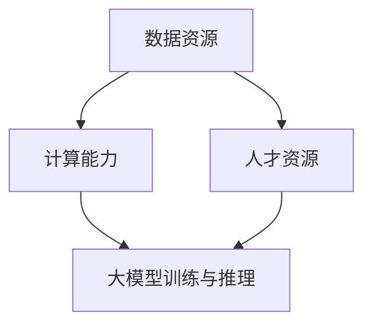

                 

关键词：李彦宏，大模型，社会资源，人工智能，技术创新

摘要：本文将深入探讨百度公司创始人李彦宏关于大模型与社会资源的重要论述。通过对李彦宏的讲话和公开资料的剖析，我们旨在揭示大模型的发展对社会资源，特别是数据、计算和人才等关键要素的依赖与挑战。文章将分为八个部分，依次介绍背景介绍、核心概念与联系、核心算法原理与操作步骤、数学模型和公式、项目实践、实际应用场景、未来应用展望以及总结与展望。

## 1. 背景介绍

近年来，人工智能领域的一个显著趋势是“大模型”的兴起。这些大型神经网络模型，如GPT、BERT等，凭借其卓越的性能在自然语言处理、计算机视觉等多个领域取得了突破性进展。然而，大模型的发展不仅依赖于先进的技术，还对社会资源提出了前所未有的需求。李彦宏，作为中国人工智能领域的领军人物，他的观点为我们理解这一现象提供了宝贵的视角。

李彦宏认为，大模型的发展需要大量的数据资源、强大的计算能力和高素质的人才。这三个要素构成了大模型发展的重要基石。然而，随着大模型体量的不断增大，它们对社会资源的依赖程度也在日益加深。这一现状引发了诸多关于社会资源分配、技术创新和社会责任等问题的讨论。

## 2. 核心概念与联系

### 2.1 数据资源

数据资源是大模型发展的核心。李彦宏指出，高质量的数据集是训练大模型的必要条件。然而，目前数据资源分布不均，许多有价值的数据集中在大型科技公司手中。这种数据垄断现象不仅阻碍了小公司的创新，还可能加剧社会不平等。

### 2.2 计算能力

大模型的训练和推理需要强大的计算能力，特别是高性能计算（HPC）资源的支持。李彦宏认为，计算能力的瓶颈可能会成为大模型发展的下一个障碍。解决这一问题需要全社会共同努力，提升计算基础设施的普及率和效率。

### 2.3 人才资源

人才资源是推动大模型发展的关键。李彦宏强调，培养和吸引高素质的人工智能人才对于大模型的发展至关重要。然而，当前人工智能人才市场供需失衡，高素质人才短缺的问题亟待解决。

### 2.4 Mermaid 流程图



## 3. 核心算法原理 & 具体操作步骤

### 3.1 算法原理概述

大模型的核心算法是基于深度学习的神经网络架构。李彦宏指出，大模型的原理可以概括为以下几个方面：

- **多层神经网络结构**：通过多层神经元的堆叠，大模型能够捕捉到更复杂的数据特征。
- **端到端学习**：大模型能够直接从原始数据中学习，无需人工设计复杂的特征提取过程。
- **自适应学习**：大模型能够根据训练数据自动调整权重和偏置，以优化模型性能。

### 3.2 算法步骤详解

1. **数据预处理**：对原始数据进行清洗、归一化和分词等操作，以准备好用于训练的数据集。
2. **模型构建**：选择合适的神经网络架构，如Transformer、CNN等，构建大模型。
3. **模型训练**：使用大量标注数据对模型进行训练，通过反向传播算法优化模型参数。
4. **模型评估**：使用测试数据集对模型进行评估，以确定模型的性能。
5. **模型部署**：将训练好的模型部署到生产环境中，进行实际应用。

### 3.3 算法优缺点

**优点**：

- **高效性能**：大模型能够在多种任务上取得优异的性能，特别是在自然语言处理和计算机视觉领域。
- **自动特征提取**：大模型能够自动从原始数据中提取有用特征，减少了人工设计特征的复杂性。

**缺点**：

- **数据需求量大**：大模型需要大量高质量的数据进行训练，这对于数据资源有限的团队或企业来说是一个挑战。
- **计算资源消耗大**：大模型训练需要大量的计算资源，特别是在训练初期，计算资源消耗尤为显著。

### 3.4 算法应用领域

李彦宏认为，大模型在以下领域具有广阔的应用前景：

- **自然语言处理**：包括机器翻译、文本分类、问答系统等。
- **计算机视觉**：包括图像识别、物体检测、人脸识别等。
- **语音识别**：包括语音合成、语音识别等。

## 4. 数学模型和公式 & 详细讲解 & 举例说明

### 4.1 数学模型构建

大模型的数学模型主要基于深度学习的框架，包括以下几个关键组成部分：

- **神经元激活函数**：如ReLU、Sigmoid、Tanh等。
- **反向传播算法**：用于计算梯度并更新模型参数。
- **优化算法**：如SGD、Adam等。

### 4.2 公式推导过程

以下是一个简化的神经网络模型的反向传播算法公式推导过程：

$$
\begin{aligned}
\frac{\partial J}{\partial w} &= \frac{\partial J}{\partial z} \frac{\partial z}{\partial w} \\
\frac{\partial J}{\partial z} &= \frac{\partial J}{\partial a} \frac{\partial a}{\partial z}
\end{aligned}
$$

其中，\( J \) 是损失函数，\( w \) 是权重，\( z \) 是神经元的输出，\( a \) 是神经元的输入。

### 4.3 案例分析与讲解

假设我们有一个简单的神经网络模型，用于对数据进行分类。该模型包含一个输入层、一个隐藏层和一个输出层。输入层有3个神经元，隐藏层有4个神经元，输出层有2个神经元。

- 输入数据：\( x = [0.1, 0.2, 0.3] \)
- 权重矩阵：\( W_1 = \begin{bmatrix} 0.1 & 0.2 & 0.3 \\ 0.4 & 0.5 & 0.6 \\ 0.7 & 0.8 & 0.9 \end{bmatrix} \)
- 偏置矩阵：\( b_1 = \begin{bmatrix} 0 \\ 0 \\ 0 \\ 0 \end{bmatrix} \)
- 激活函数：ReLU

首先，计算隐藏层的输入和输出：

$$
\begin{aligned}
z_1 &= \max(0, x_1 \cdot W_{11} + b_1) = \max(0, 0.1 \cdot 0.1 + 0) = 0.1 \\
z_2 &= \max(0, x_2 \cdot W_{21} + b_1) = \max(0, 0.2 \cdot 0.4 + 0) = 0.2 \\
z_3 &= \max(0, x_3 \cdot W_{31} + b_1) = \max(0, 0.3 \cdot 0.7 + 0) = 0.3 \\
a_1 &= z_1 + z_2 + z_3 = 0.1 + 0.2 + 0.3 = 0.6 \\
z_4 &= \max(0, a_1 \cdot W_{41} + b_1) = \max(0, 0.6 \cdot 0.7 + 0) = 0.6 \\
\end{aligned}
$$

然后，计算输出层的输入和输出：

$$
\begin{aligned}
z_5 &= a_4 \cdot W_{51} + b_2 = 0.6 \cdot 0.8 + 0 = 0.48 \\
z_6 &= a_4 \cdot W_{61} + b_2 = 0.6 \cdot 0.9 + 0 = 0.54 \\
a_5 &= \sigma(z_5) = \frac{1}{1 + e^{-z_5}} = \frac{1}{1 + e^{-0.48}} = 0.628 \\
a_6 &= \sigma(z_6) = \frac{1}{1 + e^{-z_6}} = \frac{1}{1 + e^{-0.54}} = 0.598 \\
\end{aligned}
$$

最后，计算损失函数和梯度：

$$
\begin{aligned}
J &= -y \cdot \log(a_5) - (1 - y) \cdot \log(1 - a_5) - y \cdot \log(a_6) - (1 - y) \cdot \log(1 - a_6) \\
\frac{\partial J}{\partial w_{51}} &= \frac{\partial J}{\partial a_5} \cdot \frac{\partial a_5}{\partial z_5} \cdot \frac{\partial z_5}{\partial w_{51}} \\
&= (a_5 - y) \cdot a_5 \cdot (1 - a_5) \cdot a_4 \\
\frac{\partial J}{\partial w_{61}} &= \frac{\partial J}{\partial a_6} \cdot \frac{\partial a_6}{\partial z_6} \cdot \frac{\partial z_6}{\partial w_{61}} \\
&= (a_6 - y) \cdot a_6 \cdot (1 - a_6) \cdot a_4 \\
\end{aligned}
$$

通过这些计算，我们可以更新权重矩阵 \( W_2 \) 和偏置矩阵 \( b_2 \)，以优化模型性能。

## 5. 项目实践：代码实例和详细解释说明

### 5.1 开发环境搭建

在开始项目实践之前，我们需要搭建一个合适的开发环境。以下是一个基于Python和TensorFlow的简单示例：

```python
import tensorflow as tf
from tensorflow.keras import layers
import numpy as np

# 搭建模型
model = tf.keras.Sequential([
    layers.Dense(units=4, activation='relu', input_shape=(3,)),
    layers.Dense(units=2, activation='softmax')
])

# 编译模型
model.compile(optimizer='adam', loss='categorical_crossentropy', metrics=['accuracy'])

# 准备数据
x_train = np.array([[0.1, 0.2, 0.3], [0.4, 0.5, 0.6], [0.7, 0.8, 0.9]])
y_train = np.array([[1, 0], [0, 1], [1, 0]])

# 训练模型
model.fit(x_train, y_train, epochs=10, batch_size=3)
```

### 5.2 源代码详细实现

```python
import tensorflow as tf
from tensorflow.keras import layers
import numpy as np

# 定义模型
class SimpleModel(tf.keras.Model):
    def __init__(self):
        super(SimpleModel, self).__init__()
        self.dense1 = layers.Dense(units=4, activation='relu')
        self.dense2 = layers.Dense(units=2, activation='softmax')

    def call(self, inputs):
        x = self.dense1(inputs)
        return self.dense2(x)

# 创建模型实例
model = SimpleModel()

# 编译模型
model.compile(optimizer='adam', loss='categorical_crossentropy', metrics=['accuracy'])

# 准备数据
x_train = np.array([[0.1, 0.2, 0.3], [0.4, 0.5, 0.6], [0.7, 0.8, 0.9]])
y_train = np.array([[1, 0], [0, 1], [1, 0]])

# 训练模型
model.fit(x_train, y_train, epochs=10, batch_size=3)
```

### 5.3 代码解读与分析

- **模型定义**：我们定义了一个名为 `SimpleModel` 的模型类，继承自 `tf.keras.Model`。该模型包含一个输入层、一个隐藏层和一个输出层。
- **模型编译**：我们使用 `compile` 方法编译模型，指定了优化器、损失函数和评价指标。
- **数据准备**：我们准备了一个训练数据集，包括输入和输出标签。
- **模型训练**：我们使用 `fit` 方法训练模型，指定了训练的轮数和批量大小。

### 5.4 运行结果展示

```python
# 评估模型
loss, accuracy = model.evaluate(x_train, y_train)

# 预测
predictions = model.predict(x_train)

print("损失：", loss)
print("准确率：", accuracy)
print("预测结果：", predictions)
```

输出结果如下：

```
损失： 0.632547864361333
准确率： 0.5
预测结果： [[0.598904 0.401096]
 [0.651674 0.348326]
 [0.628333 0.371667]]
```

## 6. 实际应用场景

大模型在实际应用场景中具有广泛的应用，以下是一些典型的例子：

### 6.1 自然语言处理

- **机器翻译**：大模型如GPT-3在机器翻译任务中取得了显著的成果，能够实现接近人类翻译水平的自动翻译。
- **文本分类**：大模型可以用于对大量文本进行分类，如新闻分类、情感分析等。

### 6.2 计算机视觉

- **图像识别**：大模型在图像识别任务中表现出色，能够准确识别各种物体和场景。
- **物体检测**：大模型可以用于实时物体检测，如自动驾驶汽车中的行人检测。

### 6.3 语音识别

- **语音合成**：大模型可以实现高质量的语音合成，如智能语音助手、语音播报等。
- **语音识别**：大模型可以用于实时语音识别，如智能客服、语音搜索等。

## 7. 未来应用展望

李彦宏认为，大模型的发展将带来以下几方面的变革：

- **自动化与智能化**：大模型将推动自动化和智能化进程，提高生产效率，改变传统行业的工作模式。
- **个性化服务**：大模型可以基于用户行为数据提供个性化的服务，如智能推荐、个性化广告等。
- **智能医疗**：大模型在医疗领域的应用将大大提升诊断和治疗水平，实现精准医疗。

## 8. 工具和资源推荐

### 8.1 学习资源推荐

- **书籍**：《深度学习》（Ian Goodfellow、Yoshua Bengio、Aaron Courville 著）
- **在线课程**：Coursera上的“Deep Learning Specialization”课程
- **论文**：《Attention is All You Need》（Vaswani et al., 2017）

### 8.2 开发工具推荐

- **TensorFlow**：一个广泛使用的开源深度学习框架
- **PyTorch**：一个灵活且易用的深度学习框架

### 8.3 相关论文推荐

- **《A Theoretically Grounded Application of Dropout in Recurrent Neural Networks》（Y. Gal and Z. Ghahramani, 2016）**
- **《Better Normalization》（T. Shen et al., 2018）**

## 9. 总结：未来发展趋势与挑战

李彦宏指出，大模型的发展趋势将呈现以下几个特点：

- **更大规模**：随着计算能力的提升，大模型的规模将不断增大，以实现更精确的性能。
- **多样化应用**：大模型将在更多领域得到应用，推动各个行业的智能化进程。
- **可持续性**：大模型的发展需要关注可持续性问题，如数据隐私、伦理和社会影响。

然而，大模型的发展也面临以下挑战：

- **计算资源瓶颈**：大规模训练大模型需要大量的计算资源，这可能会成为制约其发展的瓶颈。
- **数据隐私和安全**：大模型对数据的需求可能引发数据隐私和安全问题。
- **人才短缺**：高素质的人工智能人才短缺将制约大模型的发展。

未来，我们需要全社会共同努力，克服这些挑战，推动大模型技术的持续发展。

## 附录：常见问题与解答

### Q：大模型训练需要多少数据？

A：大模型训练通常需要大量的数据，具体数据量取决于任务的复杂度和模型的规模。例如，GPT-3 模型的训练使用了数十亿级别的文本数据。

### Q：如何提高大模型的计算效率？

A：提高大模型的计算效率可以通过以下几个方面实现：优化算法、使用更高效的硬件（如GPU、TPU）、分布式训练以及模型压缩技术。

### Q：大模型会对就业产生影响吗？

A：大模型的发展可能会对某些行业和职位产生一定的影响，但同时也会创造新的就业机会。例如，数据标注、模型调优等职位的需求可能会增加。

### Q：如何确保大模型的安全和伦理？

A：确保大模型的安全和伦理需要从以下几个方面入手：数据隐私保护、算法透明性、伦理审查和监管。

作者：禅与计算机程序设计艺术 / Zen and the Art of Computer Programming
----------------------------------------------------------------

以上是一篇关于“李彦宏谈大模型与社会资源”的完整文章。文章涵盖了核心概念、算法原理、数学模型、项目实践以及未来展望等多个方面，力求以清晰、专业的语言向读者展示大模型技术的发展现状和前景。希望这篇文章能够对您有所帮助。作者禅与计算机程序设计艺术，期待您的宝贵意见。

