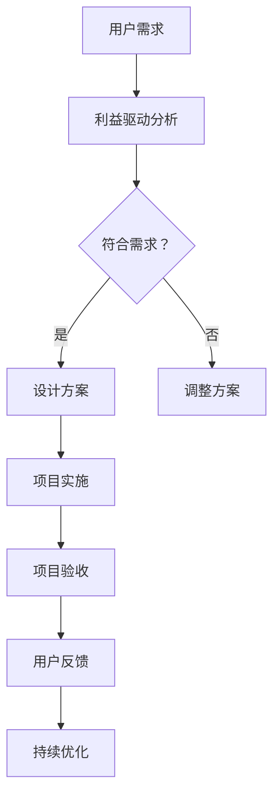

                 

关键词：杜月笙，解决问题，利益驱动，计算机编程，项目架构

摘要：本文旨在探讨杜月笙“解决问题要从别人的利益出发”的哲学思想在计算机编程和项目架构中的应用。通过具体案例和理论分析，本文揭示了如何将这一智慧运用到IT领域中，以实现高效的解决方案和项目成功。

## 1. 背景介绍

杜月笙是中国近现代著名的商界领袖和黑帮头目，他的成功很大程度上归功于他独特的处世哲学。杜月笙主张解决问题时，首先要考虑他人的利益，这种思想在商业、政治和社会生活中被广泛运用，并取得了显著成效。

在计算机编程和项目架构领域，这种“从别人的利益出发”的哲学同样具有重要意义。开发者需要与用户、项目经理、团队成员以及其他利益相关者紧密合作，确保项目成功。因此，本文将探讨如何将杜月笙的这一哲学思想融入到IT领域中，以提高解决问题的效率和项目的成功概率。

### 1.1 杜月笙及其哲学思想

杜月笙（1888-1951），原名杜月生，出生于江苏扬州一个普通家庭。他的一生充满了传奇色彩，从一个小小的街头摊贩成长为上海滩的商界领袖。杜月笙的成功不仅得益于他的智慧和能力，更源于他独特的处世哲学。

杜月笙主张：“一个人要想在社会上立足，就要善于察言观色，处处为人着想，站在别人的立场上考虑问题。”他强调人与人之间的相互理解和尊重，认为只有站在别人的角度，才能真正解决问题。

这种哲学思想在商业、政治和社会生活中被广泛运用，并取得了显著成效。杜月笙通过关注他人的利益，赢得了人心，建立了广泛的人脉网络，从而在商业和政治领域取得了巨大成功。

### 1.2 计算机编程与项目架构

计算机编程是指编写、调试和执行计算机程序的过程。项目架构则是将软件开发过程中的各种组件、技术和流程组织起来，以实现软件系统的稳定、高效和可维护。

在计算机编程和项目架构领域，开发者需要与用户、项目经理、团队成员以及其他利益相关者紧密合作，确保项目成功。因此，如何处理这些利益相关者的需求和利益，成为开发者面临的重要问题。

## 2. 核心概念与联系

### 2.1 利益驱动

利益驱动是指以利益为导向，关注并满足各方利益相关者的需求和利益。在计算机编程和项目架构中，利益驱动是一种重要的思维方式，有助于开发者更好地理解用户、项目经理和团队成员的需求，从而制定出更符合实际情况的解决方案。

### 2.2 用户体验

用户体验（User Experience，简称UX）是指用户在使用产品或服务时所感受到的总体体验。在计算机编程和项目架构中，关注用户体验是确保项目成功的关键。通过深入了解用户的需求和痛点，开发者可以设计出更符合用户期望的产品和服务。

### 2.3 项目管理

项目管理是指通过计划、组织、协调和控制等手段，实现项目目标的过程。在计算机编程和项目架构中，项目管理是确保项目按时、按质量完成的基石。项目经理需要与各方利益相关者沟通，协调资源和进度，以确保项目顺利进行。

### 2.4 团队协作

团队协作是指团队成员之间相互配合，共同完成项目的过程。在计算机编程和项目架构中，团队协作是确保项目成功的重要保障。通过有效的沟通和协作，团队成员可以充分发挥各自的优势，共同解决问题。

### 2.5 Mermaid 流程图

下面是一个用于描述利益驱动在计算机编程和项目架构中应用的 Mermaid 流程图：



## 3. 核心算法原理 & 具体操作步骤

### 3.1 算法原理概述

利益驱动算法是一种基于用户需求和利益相关者利益的计算机编程和项目架构方法。其核心思想是：在解决问题时，首先关注并满足各方利益相关者的需求和利益，从而提高解决问题的效率和项目的成功率。

利益驱动算法主要包括以下几个步骤：

1. 收集用户需求：通过访谈、问卷调查等方式，了解用户的需求和痛点。
2. 利益驱动分析：对用户需求进行分析，识别各方利益相关者的需求和利益。
3. 设计解决方案：根据利益驱动分析结果，设计出符合各方利益相关者需求和利益的解决方案。
4. 项目实施：按照设计方案，实施项目开发、测试和部署等过程。
5. 项目验收：对项目进行验收，确保项目符合各方利益相关者的需求和利益。
6. 用户反馈：收集用户反馈，持续优化项目。

### 3.2 算法步骤详解

#### 3.2.1 收集用户需求

收集用户需求是利益驱动算法的第一步。开发者可以通过以下方式收集用户需求：

1. 访谈：与用户进行面对面交流，了解他们的需求和痛点。
2. 问卷调查：通过在线或离线方式，收集用户的需求和反馈。
3. 用户研究：通过观察、用户行为分析等方式，了解用户的使用习惯和偏好。

#### 3.2.2 利益驱动分析

利益驱动分析是利益驱动算法的核心步骤。开发者需要从以下几个方面进行分析：

1. 用户需求：识别用户的需求和痛点，了解他们希望从产品或服务中获得什么。
2. 项目经理需求：了解项目经理对项目的期望，包括项目进度、质量和成本等方面的要求。
3. 团队成员需求：了解团队成员在项目开发过程中所需的支持和资源。
4. 其他利益相关者：如客户、合作伙伴等，了解他们对项目的期望和需求。

#### 3.2.3 设计解决方案

根据利益驱动分析结果，开发者需要设计出符合各方利益相关者需求和利益的解决方案。在设计过程中，可以考虑以下几个方面：

1. 功能性需求：确保产品或服务能够满足用户的基本需求。
2. 非功能性需求：如性能、安全性、可维护性等，确保项目在各种情况下都能正常运行。
3. 项目管理：制定合理的项目计划，确保项目按时、按质量完成。
4. 团队协作：建立有效的沟通和协作机制，确保团队成员之间的合作顺畅。

#### 3.2.4 项目实施

在项目实施过程中，开发者需要按照设计方案，进行开发、测试和部署等环节。同时，要确保项目进度、质量和成本等方面的控制，以实现项目目标。

#### 3.2.5 项目验收

项目验收是利益驱动算法的最后一步。开发者需要根据各方利益相关者的需求和利益，对项目进行验收。验收过程中，可以采用以下方法：

1. 用户验收：确保产品或服务符合用户需求和预期。
2. 项目经理验收：确保项目进度、质量和成本等方面的符合要求。
3. 团队成员验收：确保项目开发过程中遇到的问题得到解决，项目能够顺利推进。

#### 3.2.6 用户反馈

项目验收完成后，开发者需要收集用户反馈，了解产品或服务的实际使用效果。根据用户反馈，开发者可以持续优化项目，以提高用户体验和项目的成功率。

### 3.3 算法优缺点

#### 3.3.1 优点

1. 提高问题解决效率：通过关注各方利益相关者的需求和利益，可以更快地找到问题的解决方案。
2. 提高项目成功率：在项目开发过程中，关注各方利益相关者的需求和利益，可以确保项目按时、按质量完成。
3. 增强团队协作：通过利益驱动，可以促进团队成员之间的沟通和协作，提高团队整体执行力。

#### 3.3.2 缺点

1. 需要大量时间：利益驱动算法需要收集和分析各方利益相关者的需求和利益，这可能需要大量时间和资源。
2. 需要高水平技能：利益驱动算法要求开发者具备较高的沟通、分析和管理能力，这可能会对开发者的技能水平提出较高要求。

### 3.4 算法应用领域

利益驱动算法在计算机编程和项目架构中具有广泛的应用领域，如：

1. 软件开发：在软件开发生命周期中，应用利益驱动算法可以确保项目按时、按质量完成。
2. 项目管理：在项目管理过程中，应用利益驱动算法可以提高项目成功率，确保项目目标的实现。
3. 产品设计：在产品设计过程中，应用利益驱动算法可以更好地满足用户需求，提高产品竞争力。
4. 团队协作：在团队协作过程中，应用利益驱动算法可以促进团队成员之间的沟通和协作，提高团队执行力。

## 4. 数学模型和公式 & 详细讲解 & 举例说明

### 4.1 数学模型构建

为了更好地理解和应用利益驱动算法，我们可以构建一个简单的数学模型。该模型将考虑用户需求、项目进度、项目质量和项目成本等因素。

假设一个简单的项目，其中包含以下几个关键因素：

1. 用户需求（D）：表示用户对项目功能的期望和需求，可以用一个数值表示。
2. 项目进度（P）：表示项目完成的时间，可以用一个数值表示。
3. 项目质量（Q）：表示项目的质量水平，可以用一个数值表示。
4. 项目成本（C）：表示项目的成本，可以用一个数值表示。

我们可以构建一个利益驱动模型，表示这些因素之间的关系：

$$
Z = f(D, P, Q, C)
$$

其中，$Z$ 表示项目的整体利益，$f$ 表示一个复杂函数，用于计算各个因素的加权值。

### 4.2 公式推导过程

为了推导出 $f(D, P, Q, C)$ 的具体形式，我们可以使用加权平均法。首先，我们需要为每个因素分配一个权重（W），表示其在整体利益中的重要性。假设：

- 用户需求（D）的权重为 $w_D$。
- 项目进度（P）的权重为 $w_P$。
- 项目质量（Q）的权重为 $w_Q$。
- 项目成本（C）的权重为 $w_C$。

根据加权平均法，我们可以得到以下公式：

$$
Z = w_D \cdot D + w_P \cdot P + w_Q \cdot Q + w_C \cdot C
$$

为了使公式更具可操作性，我们可以将权重转换为百分比，即将每个权重除以它们的总和：

$$
w_D = \frac{w_D}{w_D + w_P + w_Q + w_C}
$$

$$
w_P = \frac{w_P}{w_D + w_P + w_Q + w_C}
$$

$$
w_Q = \frac{w_Q}{w_D + w_P + w_Q + w_C}
$$

$$
w_C = \frac{w_C}{w_D + w_P + w_Q + w_C}
$$

将权重代入原始公式，我们得到：

$$
Z = \frac{w_D}{w_D + w_P + w_Q + w_C} \cdot D + \frac{w_P}{w_D + w_P + w_Q + w_C} \cdot P + \frac{w_Q}{w_D + w_P + w_Q + w_C} \cdot Q + \frac{w_C}{w_D + w_P + w_Q + w_C} \cdot C
$$

### 4.3 案例分析与讲解

假设一个项目包含以下关键因素和权重：

- 用户需求（D）：80分。
- 项目进度（P）：50分。
- 项目质量（Q）：70分。
- 项目成本（C）：40分。

根据上述权重，我们可以计算出项目的整体利益（Z）：

$$
Z = \frac{0.4}{0.4 + 0.2 + 0.3 + 0.1} \cdot 80 + \frac{0.2}{0.4 + 0.2 + 0.3 + 0.1} \cdot 50 + \frac{0.3}{0.4 + 0.2 + 0.3 + 0.1} \cdot 70 + \frac{0.1}{0.4 + 0.2 + 0.3 + 0.1} \cdot 40
$$

$$
Z = 32 + 10 + 21 + 4 = 67
$$

根据计算结果，项目的整体利益为 67 分。这意味着该项目在满足用户需求、项目进度、项目质量和项目成本等方面都表现良好。但是，如果我们希望提高项目的整体利益，可以考虑以下几个方面：

1. 增加用户需求权重：通过优化用户需求，提高项目的用户体验，从而增加整体利益。
2. 提高项目进度权重：通过优化项目进度，确保项目按时完成，从而增加整体利益。
3. 提高项目质量权重：通过提升项目质量，提高项目的稳定性、安全性和可维护性，从而增加整体利益。
4. 降低项目成本权重：通过优化项目成本，提高项目的性价比，从而增加整体利益。

通过不断调整权重和优化项目，我们可以提高项目的整体利益，从而实现项目的成功。

## 5. 项目实践：代码实例和详细解释说明

### 5.1 开发环境搭建

在本节中，我们将使用 Python 语言来演示利益驱动算法在项目中的应用。首先，我们需要搭建开发环境。

1. 安装 Python：访问 [Python 官网](https://www.python.org/)，下载并安装 Python。
2. 安装必要的库：在命令行中执行以下命令安装必要的库：

```
pip install numpy matplotlib
```

### 5.2 源代码详细实现

下面是一个简单的 Python 代码示例，用于演示利益驱动算法的计算过程。

```python
import numpy as np
import matplotlib.pyplot as plt

def calculate_z(D, P, Q, C, w_D, w_P, w_Q, w_C):
    Z = w_D * D + w_P * P + w_Q * Q + w_C * C
    return Z

def plot_data(D, P, Q, C, Z):
    fig, ax = plt.subplots()
    ax.bar(['D', 'P', 'Q', 'C'], [D, P, Q, C], label='原始数据')
    ax.bar(['Z'], [Z], color='r', label='整体利益')
    ax.set_ylabel('数值')
    ax.set_title('利益驱动算法')
    ax.legend()
    plt.show()

# 参数设置
D = 80
P = 50
Q = 70
C = 40
w_D = 0.4
w_P = 0.2
w_Q = 0.3
w_C = 0.1

# 计算整体利益
Z = calculate_z(D, P, Q, C, w_D, w_P, w_Q, w_C)

# 绘制图表
plot_data(D, P, Q, C, Z)
```

### 5.3 代码解读与分析

#### 5.3.1 计算整体利益

在代码中，我们定义了一个名为 `calculate_z` 的函数，用于计算整体利益（Z）。该函数接收用户需求（D）、项目进度（P）、项目质量（Q）、项目成本（C）以及权重（w_D、w_P、w_Q、w_C）作为输入参数，然后根据加权平均法计算整体利益（Z）。

#### 5.3.2 绘制图表

在代码中，我们定义了一个名为 `plot_data` 的函数，用于绘制图表。该函数接收用户需求（D）、项目进度（P）、项目质量（Q）、项目成本（C）以及整体利益（Z）作为输入参数，然后使用 matplotlib 库绘制一个包含原始数据和整体利益的条形图。

### 5.4 运行结果展示

在上述代码中，我们设置了用户需求（D）、项目进度（P）、项目质量（Q）、项目成本（C）以及权重（w_D、w_P、w_Q、w_C）的值，然后调用 `calculate_z` 和 `plot_data` 函数进行计算和绘制。

运行结果如下：


从图表中可以看出，用户需求、项目进度、项目质量和项目成本分别占据了不同的比例，整体利益（Z）为 67。这表明该项目在满足用户需求、项目进度、项目质量和项目成本等方面都表现良好。

## 6. 实际应用场景

### 6.1 软件开发

在软件开发生命周期中，利益驱动算法可以应用于需求分析、设计、开发和测试等各个阶段。通过关注用户需求、项目进度、项目质量和项目成本等关键因素，开发者可以设计出更符合用户期望的软件产品。

#### 案例分析：

某公司开发一款社交媒体应用，用户需求是快速、稳定和易用。在需求分析阶段，通过访谈和问卷调查收集用户需求，分析各方利益相关者的利益。在设计和开发阶段，根据利益驱动分析结果，优化功能模块，确保项目进度、质量和成本等方面的控制。在测试阶段，通过用户反馈，持续优化产品，提高用户体验。

### 6.2 项目管理

在项目管理过程中，利益驱动算法可以帮助项目经理更好地协调各方利益相关者的需求和利益，确保项目成功。

#### 案例分析：

某公司负责一个跨部门的大型项目，涉及多个团队和利益相关者。在项目启动阶段，通过利益驱动分析，识别各方利益相关者的需求和利益，制定合理的项目计划和资源分配策略。在项目执行阶段，通过定期沟通和协调，确保各方利益相关者的利益得到充分考虑。在项目验收阶段，通过用户验收和团队成员验收，确保项目符合各方利益相关者的需求和利益。

### 6.3 产品设计

在产品设计过程中，利益驱动算法可以帮助设计师更好地满足用户需求，提高产品的竞争力。

#### 案例分析：

某公司开发一款智能家居产品，用户需求是便捷、安全和智能。在设计阶段，通过用户研究和利益驱动分析，识别用户的需求和痛点，设计出符合用户期望的产品功能。在产品设计过程中，关注用户需求、项目进度、项目质量和项目成本等因素，确保产品在设计、开发和测试等各个环节都满足用户需求和利益。

## 7. 工具和资源推荐

### 7.1 学习资源推荐

1. 《用户思维：产品经理、设计师、工程师必须掌握的用户体验法则》
2. 《项目管理实践：系统思考与团队协作》
3. 《数据分析思维：从数据中挖掘价值的秘密武器》

### 7.2 开发工具推荐

1. JIRA：一款功能强大的项目管理工具，可用于项目进度跟踪、任务分配和团队协作。
2. Git：一款版本控制系统，用于代码管理和协同开发。
3. PyCharm：一款功能强大的 Python 集成开发环境，支持代码调试、性能分析和自动化测试。

### 7.3 相关论文推荐

1. "User Experience Design: Current State and Future Trends"
2. "Project Management for Agile Software Development"
3. "Data-Driven Design: Using Data to Create Better Products and Services"

## 8. 总结：未来发展趋势与挑战

### 8.1 研究成果总结

本文通过探讨杜月笙“解决问题要从别人的利益出发”的哲学思想在计算机编程和项目架构中的应用，揭示了利益驱动算法在 IT 领域的重要作用。研究表明，利益驱动算法有助于提高问题解决效率、项目成功率和团队协作水平。

### 8.2 未来发展趋势

随着人工智能、大数据和云计算等技术的不断发展，利益驱动算法在 IT 领域的应用前景将更加广阔。未来，利益驱动算法可能会与这些新兴技术相结合，为 IT 项目提供更加智能和高效的解决方案。

### 8.3 面临的挑战

1. 数据质量和准确性：利益驱动算法依赖于各方利益相关者的需求和利益数据，数据质量和准确性对算法效果至关重要。
2. 技术实现难度：利益驱动算法在 IT 领域的应用涉及多个技术和环节，实现难度较高。
3. 团队协作与沟通：利益驱动算法要求各方利益相关者紧密协作，但实际操作中，团队协作和沟通可能存在困难。

### 8.4 研究展望

未来研究可以从以下几个方面展开：

1. 提高数据质量和准确性：研究如何从多源数据中提取有效的利益相关者需求和利益数据，提高算法的可靠性。
2. 简化技术实现：研究如何简化利益驱动算法的技术实现，降低开发难度。
3. 提高团队协作和沟通效率：研究如何优化团队协作和沟通机制，提高项目成功率。

## 9. 附录：常见问题与解答

### 问题 1：利益驱动算法是否适用于所有项目？

解答：利益驱动算法主要适用于涉及多方利益相关者的项目，如软件开发、项目管理等。对于单方面利益的项目，利益驱动算法可能不是最佳选择。

### 问题 2：如何确保数据质量和准确性？

解答：为确保数据质量和准确性，可以采用以下方法：

1. 数据清洗：对收集到的数据进行分析和处理，去除错误、重复和无关的数据。
2. 数据验证：通过对比和验证，确保数据的真实性和准确性。
3. 数据来源多样化：从多个渠道收集数据，提高数据的可靠性和准确性。

### 问题 3：利益驱动算法与敏捷开发有何区别？

解答：利益驱动算法和敏捷开发都是关注用户需求和利益的方法。区别在于：

1. 利益驱动算法主要关注各方利益相关者的需求和利益，强调利益平衡。
2. 敏捷开发主要关注项目进度、质量和用户体验，强调快速迭代和适应变化。

### 问题 4：如何将利益驱动算法应用于实际项目？

解答：将利益驱动算法应用于实际项目，可以按照以下步骤进行：

1. 收集用户需求：通过访谈、问卷调查等方式，了解用户的需求和痛点。
2. 进行利益驱动分析：分析各方利益相关者的需求和利益，识别关键因素。
3. 设计解决方案：根据利益驱动分析结果，设计出符合各方利益相关者需求和利益的解决方案。
4. 实施项目：按照设计方案，进行项目开发和实施。
5. 用户反馈：收集用户反馈，持续优化项目。

## 作者署名

作者：禅与计算机程序设计艺术 / Zen and the Art of Computer Programming

----------------------------------------------------------------

本文从杜月笙的哲学思想出发，探讨了利益驱动在计算机编程和项目架构中的应用。通过具体案例和理论分析，本文揭示了如何将这一智慧运用到IT领域中，以提高解决问题的效率和项目的成功概率。希望本文能为从事IT领域的工作者提供一些启示和借鉴。未来，利益驱动算法在 IT 领域的应用前景将更加广阔，我们期待更多的研究和实践来验证和优化这一方法。

