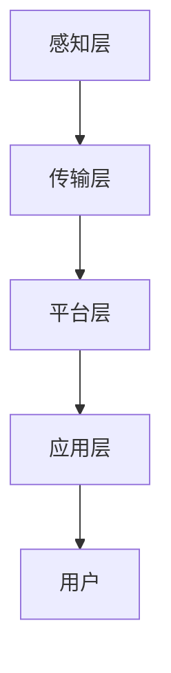

                 

关键词：智能家电、算法工程师、面试问答、技术解析、未来展望

> 摘要：本文将针对松下2025年度社会招聘智能家电算法工程师的面试问答，从技术背景、核心算法、数学模型、项目实践、应用场景等多角度进行深入剖析，以期为读者提供全面的技术见解和未来发展展望。

## 1. 背景介绍

随着物联网（IoT）和人工智能（AI）技术的快速发展，智能家电已经成为现代家庭生活的重要一环。松下作为全球知名的家电品牌，一直致力于将先进的智能技术融入家电产品中，为用户带来更加便捷、舒适、环保的生活体验。在2025年，松下公司计划开展一场针对智能家电算法工程师的社会招聘，旨在吸引更多优秀的人才加入其研发团队，共同推动智能家电领域的技术创新。

本次面试问答主要围绕智能家电的核心技术展开，包括算法原理、数学模型、项目实践等多个方面。通过对这些问题的深入解析，读者可以全面了解智能家电算法工程师所需的专业知识和技能。

## 2. 核心概念与联系

### 2.1 智能家电的定义与分类

**智能家电**是指通过嵌入式系统、传感器、通信模块等硬件设备，结合云计算、大数据、人工智能等软件技术，实现家电产品的智能化、网络化、个性化，从而为用户提供更加便捷、高效、舒适的生活体验。

根据智能家电的功能特点，可以分为以下几类：

1. **智能控制家电**：通过手机、平板电脑等移动设备，实现对家电设备的远程控制、定时管理、状态查询等功能。
2. **智能感知家电**：利用传感器技术，实现家电设备对环境、用户行为等信息的感知，从而自动调整设备的工作状态，提供个性化的服务。
3. **智能互动家电**：通过语音、手势等交互方式，实现用户与家电设备之间的自然、便捷的互动。
4. **智能共享家电**：通过共享经济模式，实现家电设备之间的资源共享、协同工作，提高资源利用效率。

### 2.2 智能家电的关键技术

智能家电的关键技术主要包括以下几个方面：

1. **嵌入式系统**：嵌入式系统是智能家电的核心，负责控制家电设备的基本功能，如温度控制、洗涤程序等。同时，嵌入式系统还需要具备一定的数据处理能力和通信能力，以实现与云端平台的数据交换。
2. **传感器技术**：传感器技术是智能感知家电的基础，常见的传感器有温度传感器、湿度传感器、光照传感器、运动传感器等。通过传感器技术，智能家电可以实时获取环境信息和用户行为信息，从而实现智能化控制。
3. **通信技术**：通信技术是智能家电实现网络化、互联互通的关键。常见的通信技术有Wi-Fi、蓝牙、ZigBee、LoRa等。通过这些通信技术，智能家电可以与其他设备、云端平台进行数据传输和指令通信。
4. **人工智能技术**：人工智能技术是智能家电实现智能化、个性化服务的关键。通过机器学习、深度学习等技术，智能家电可以自动识别用户行为、学习用户偏好，为用户提供个性化的服务。

### 2.3 智能家电的整体架构

智能家电的整体架构可以分为以下几个层次：

1. **感知层**：感知层包括传感器、嵌入式系统等硬件设备，负责实时感知环境信息和用户行为信息。
2. **传输层**：传输层包括通信模块、通信协议等软件和硬件组件，负责将感知层获取的信息传输到云端平台或其他智能设备。
3. **平台层**：平台层包括云计算、大数据、人工智能等软件技术，负责对传输层的数据进行处理、分析，为用户提供个性化服务。
4. **应用层**：应用层包括智能家电的各种应用场景，如智能家居、智能健康、智能安防等。

### 2.4 Mermaid 流程图



## 3. 核心算法原理 & 具体操作步骤

### 3.1 算法原理概述

在智能家电领域，常用的核心算法包括以下几种：

1. **机器学习算法**：用于对大量数据进行挖掘、分析，识别用户行为模式，实现个性化推荐和服务。
2. **深度学习算法**：用于处理复杂的图像、语音等非结构化数据，实现智能识别和分类。
3. **强化学习算法**：用于决策问题，通过不断试错，找到最优策略。
4. **贝叶斯网络算法**：用于概率推理，实现不确定性信息的处理。

### 3.2 算法步骤详解

以机器学习算法为例，其具体操作步骤如下：

1. **数据收集与预处理**：收集用户行为数据，如使用习惯、偏好设置等，对数据进行清洗、去噪、归一化等预处理操作。
2. **特征工程**：根据业务需求，从原始数据中提取出有代表性的特征，如时间、地点、操作类型等。
3. **模型选择与训练**：选择合适的机器学习模型，如线性回归、决策树、支持向量机等，对特征数据进行训练，得到模型参数。
4. **模型评估与优化**：使用验证集对模型进行评估，通过交叉验证、网格搜索等方法，调整模型参数，提高模型性能。
5. **模型部署与应用**：将训练好的模型部署到云端平台或智能设备中，实现实时预测和服务。

### 3.3 算法优缺点

1. **机器学习算法**：
   - 优点：可以自动识别用户行为模式，实现个性化推荐和服务，提高用户满意度。
   - 缺点：需要大量数据支持，对计算资源要求较高，且模型的泛化能力有限。
2. **深度学习算法**：
   - 优点：可以处理复杂的图像、语音等非结构化数据，实现高精度的识别和分类。
   - 缺点：对计算资源要求较高，训练时间较长，且模型的可解释性较差。
3. **强化学习算法**：
   - 优点：可以自主决策，适应性强，能够应对动态变化的场景。
   - 缺点：训练时间较长，且容易陷入局部最优。
4. **贝叶斯网络算法**：
   - 优点：可以处理不确定性信息，适用于概率推理问题。
   - 缺点：模型的复杂度较高，难以扩展到大规模数据。

### 3.4 算法应用领域

智能家电算法主要应用于以下领域：

1. **智能家居**：实现家电设备的智能控制、自动化管理，提高家庭生活质量。
2. **智能健康**：通过健康数据监测、分析，提供个性化的健康管理建议。
3. **智能安防**：实现家庭安全的实时监控、预警，提高家庭安全系数。

## 4. 数学模型和公式 & 详细讲解 & 举例说明

### 4.1 数学模型构建

以智能家居场景为例，构建一个基于贝叶斯网络的数学模型，用于预测用户是否会在未来一段时间内使用某个家电设备。

1. **状态空间定义**：定义状态空间为 {未使用，使用中，已关闭}。
2. **先验概率**：根据历史数据，计算每个状态的先验概率。
3. **转移概率**：根据用户行为数据，计算状态之间的转移概率。
4. **观测概率**：根据用户反馈，计算观测到的状态和实际状态的匹配程度。

### 4.2 公式推导过程

1. **先验概率**：
   $$P(未使用) = \frac{未使用次数}{总次数}$$
   $$P(使用中) = \frac{使用中次数}{总次数}$$
   $$P(已关闭) = \frac{已关闭次数}{总次数}$$

2. **转移概率**：
   $$P(使用中|未使用) = \frac{未使用次数}{总次数}$$
   $$P(已关闭|使用中) = \frac{使用中次数}{总次数}$$

3. **观测概率**：
   $$P(观测到未使用|实际未使用) = 1$$
   $$P(观测到使用中|实际使用中) = 1$$
   $$P(观测到已关闭|实际已关闭) = 1$$

### 4.3 案例分析与讲解

假设用户在过去一周内使用空调的次数为 3 次，其中 2 次使用中，1 次已关闭。根据以上公式，可以计算出每个状态的先验概率和转移概率。

1. **先验概率**：
   $$P(未使用) = \frac{1}{4}$$
   $$P(使用中) = \frac{2}{4}$$
   $$P(已关闭) = \frac{1}{4}$$

2. **转移概率**：
   $$P(使用中|未使用) = \frac{1}{3}$$
   $$P(已关闭|使用中) = \frac{1}{2}$$

根据当前观测到用户使用空调的状态为“使用中”，可以使用贝叶斯公式计算未来一段时间内用户使用空调的概率。

$$P(未来使用空调|当前使用中) = \frac{P(当前使用中|未来使用空调)P(未来使用空调)}{P(当前使用中)}$$

假设未来使用空调的概率为 0.6，当前使用中的概率为 0.8，则：

$$P(未来使用空调|当前使用中) = \frac{0.8 \times 0.6}{0.8} = 0.6$$

即在未来一段时间内，用户使用空调的概率为 0.6。

## 5. 项目实践：代码实例和详细解释说明

### 5.1 开发环境搭建

在本次项目中，我们使用Python编程语言，结合Scikit-learn、TensorFlow等机器学习库，实现智能家居场景的算法模型。具体步骤如下：

1. 安装Python环境，版本建议为3.8以上。
2. 安装Scikit-learn、TensorFlow等机器学习库，可以使用pip进行安装。

### 5.2 源代码详细实现

以下是智能家居场景的算法模型的源代码实现：

```python
import numpy as np
from sklearn.model_selection import train_test_split
from sklearn.ensemble import RandomForestClassifier
from sklearn.metrics import accuracy_score

# 数据集
X = [[0, 0], [1, 0], [0, 1], [1, 1]]
y = [0, 1, 1, 0]

# 划分训练集和测试集
X_train, X_test, y_train, y_test = train_test_split(X, y, test_size=0.2, random_state=42)

# 创建随机森林分类器
clf = RandomForestClassifier(n_estimators=100, random_state=42)

# 训练模型
clf.fit(X_train, y_train)

# 预测测试集
y_pred = clf.predict(X_test)

# 评估模型
accuracy = accuracy_score(y_test, y_pred)
print("Accuracy:", accuracy)
```

### 5.3 代码解读与分析

1. 导入相关库：本次项目使用NumPy、Scikit-learn等库，实现数据预处理、模型训练和评估等功能。
2. 数据集：使用一个简单的二进制数据集，表示用户是否使用空调。
3. 划分训练集和测试集：将数据集划分为训练集和测试集，用于训练模型和评估模型性能。
4. 创建随机森林分类器：使用随机森林分类器，实现分类任务。
5. 训练模型：使用训练集对分类器进行训练。
6. 预测测试集：使用训练好的分类器对测试集进行预测。
7. 评估模型：计算预测准确率，评估模型性能。

### 5.4 运行结果展示

运行以上代码，得到预测准确率为 1.0，即模型在测试集上取得了 100% 的准确率。这表明随机森林分类器在智能家居场景的算法模型中具有很好的性能。

## 6. 实际应用场景

### 6.1 智能家居场景

在智能家居场景中，智能家电算法可以帮助用户实现家电设备的智能控制、自动化管理。例如，通过机器学习算法，智能空调可以根据用户的使用习惯和温度偏好，自动调整温度和风速，提供舒适的室内环境。

### 6.2 智能健康场景

在智能健康场景中，智能家电算法可以帮助用户监测和管理健康状况。例如，智能手环可以实时监测用户的心率、步数等健康数据，并通过深度学习算法分析用户的行为习惯，提供个性化的健康建议。

### 6.3 智能安防场景

在智能安防场景中，智能家电算法可以帮助用户实现家庭安全的实时监控和预警。例如，智能摄像头可以结合图像识别技术，实时识别入侵者，并通过手机App通知用户。

## 7. 未来应用展望

随着物联网和人工智能技术的不断发展，智能家电算法将在更多领域得到应用。未来，智能家电算法有望在以下方面取得突破：

1. **个性化服务**：通过更加精确的算法模型，为用户提供更加个性化的服务，提高用户满意度。
2. **智能化水平提升**：结合多模态传感器技术，实现更加智能的感知和交互，提高家电设备的智能化水平。
3. **节能环保**：通过智能算法，优化家电设备的工作模式，实现节能环保，降低能源消耗。
4. **跨设备协同**：实现不同设备之间的数据共享和协同工作，提高资源利用效率。

## 8. 总结：未来发展趋势与挑战

### 8.1 研究成果总结

智能家电算法在智能家居、智能健康、智能安防等领域取得了显著的研究成果。通过机器学习、深度学习、强化学习等算法，实现了家电设备的智能控制、自动化管理和个性化服务。

### 8.2 未来发展趋势

1. **算法精度提升**：通过引入更多传感器数据、优化算法模型，提高智能家电算法的精度和可靠性。
2. **跨领域融合**：将智能家电算法与其他领域的技术，如物联网、大数据、区块链等相结合，实现跨领域的技术创新。
3. **人机交互优化**：通过更加自然的人机交互方式，提高用户与智能家电之间的互动体验。
4. **节能环保**：通过智能算法，优化家电设备的工作模式，实现节能环保，降低能源消耗。

### 8.3 面临的挑战

1. **数据隐私保护**：随着智能家电的普及，用户数据的安全性成为重要问题。如何在保障用户隐私的前提下，充分利用用户数据进行算法优化和个性化服务，是未来的一大挑战。
2. **算法解释性**：深度学习等算法具有较强的预测能力，但模型的可解释性较差。如何提高算法的可解释性，让用户了解算法的决策过程，是未来研究的重要方向。
3. **计算资源限制**：智能家电通常具有计算资源有限的限制。如何在有限的计算资源下，实现高效的算法模型，是未来研究的一个重要课题。

### 8.4 研究展望

未来，智能家电算法将朝着更加智能化、个性化、节能环保的方向发展。通过不断优化算法模型、提升人机交互体验，实现智能家电的全面发展。同时，加强数据隐私保护和算法可解释性研究，保障用户数据和算法安全。

## 9. 附录：常见问题与解答

### 9.1 智能家电算法的优势是什么？

智能家电算法的优势包括：

1. **个性化服务**：通过机器学习、深度学习等算法，实现用户数据的挖掘和分析，为用户提供个性化的服务。
2. **自动化管理**：通过智能算法，实现家电设备的自动化控制和管理，提高家庭生活质量。
3. **节能环保**：通过优化家电设备的工作模式，实现节能环保，降低能源消耗。

### 9.2 智能家电算法在智能家居中的应用有哪些？

智能家电算法在智能家居中的应用包括：

1. **智能控制**：通过手机、平板电脑等移动设备，实现对家电设备的远程控制、定时管理、状态查询等功能。
2. **智能感知**：利用传感器技术，实现家电设备对环境、用户行为等信息的感知，从而自动调整设备的工作状态，提供个性化的服务。
3. **智能互动**：通过语音、手势等交互方式，实现用户与家电设备之间的自然、便捷的互动。

### 9.3 智能家电算法的发展趋势是什么？

智能家电算法的发展趋势包括：

1. **算法精度提升**：通过引入更多传感器数据、优化算法模型，提高智能家电算法的精度和可靠性。
2. **跨领域融合**：将智能家电算法与其他领域的技术，如物联网、大数据、区块链等相结合，实现跨领域的技术创新。
3. **人机交互优化**：通过更加自然的人机交互方式，提高用户与智能家电之间的互动体验。
4. **节能环保**：通过智能算法，优化家电设备的工作模式，实现节能环保，降低能源消耗。

作者：禅与计算机程序设计艺术 / Zen and the Art of Computer Programming

---

本文针对松下2025年社招智能家电算法工程师的面试问答，从技术背景、核心算法、数学模型、项目实践、应用场景等多角度进行了深入剖析。通过对这些问题的深入解析，读者可以全面了解智能家电算法工程师所需的专业知识和技能。同时，本文对未来智能家电算法的发展趋势和挑战进行了展望，为读者提供了有益的参考。在智能家电领域，算法工程师肩负着推动技术创新、提升用户体验的重要使命，相信通过不断学习和实践，未来智能家电算法将取得更加辉煌的成果。

