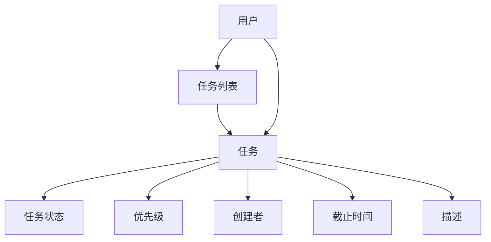

                 

关键词：待办管理插件、任务管理、工作流、插件架构、开发者工具、用户体验

> 摘要：本文将详细介绍待办（Todo）管理插件的设计、实现和优化过程。我们将从背景介绍、核心概念与联系、核心算法原理、数学模型、项目实践以及实际应用场景等多个方面，深入探讨如何开发出一个高效、易用的待办管理插件。

## 1. 背景介绍

在当今信息爆炸的时代，人们面临的工作任务越来越多，如何高效地管理这些任务成为了一个亟待解决的问题。待办（Todo）管理插件作为一种辅助工具，可以帮助用户更好地组织和管理日常任务。这类插件通常集成在办公软件、项目管理工具或者个人笔记本中，为用户提供一个便捷的任务记录、提醒和跟踪平台。

随着技术的发展和用户需求的不断升级，待办管理插件的功能也在不断扩展。除了基本的新增、编辑、删除任务功能外，还增加了任务分类、优先级设置、定时提醒、任务统计等高级功能。这些功能的增加，使得待办管理插件在提高工作效率、优化工作流程方面发挥了重要作用。

本文将以一个典型的待办管理插件项目为例，从技术角度探讨如何设计、实现和优化这类插件。希望通过本文的介绍，能够为开发者提供一些有价值的参考和启示。

## 2. 核心概念与联系

### 2.1 核心概念

在待办管理插件项目中，我们需要明确以下几个核心概念：

- **任务（Task）**：待办管理插件的基本单位，每个任务包含任务名称、任务描述、任务状态、优先级、创建时间、截止时间等信息。
- **任务列表（Todo List）**：一组任务的集合，用于对任务进行分类和整理。每个任务列表可以包含多个任务，同时也可以进行任务的增删改查等操作。
- **用户（User）**：使用待办管理插件的个人或团队。用户可以创建、管理任务，同时也可以查看任务列表和任务详情。

### 2.2 联系与架构

为了实现上述核心概念，我们需要构建一个清晰的架构。以下是待办管理插件的核心架构：



在这个架构中，用户可以创建任务列表和任务，每个任务都包含了一定的属性。任务状态、优先级、创建者、截止时间和描述等属性，可以帮助用户更好地管理和跟踪任务。

此外，我们还可以引入一些辅助模块，如提醒模块、统计模块等，以增强待办管理插件的功能和用户体验。

## 3. 核心算法原理 & 具体操作步骤

### 3.1 算法原理概述

在待办管理插件中，核心算法主要涉及任务的增删改查操作。这些操作的基本原理如下：

- **任务新增（Create Task）**：根据用户输入的任务信息，创建一个新的任务对象，并将其添加到任务列表中。
- **任务查询（Query Task）**：根据用户指定的条件，在任务列表中查找符合条件的任务。
- **任务更新（Update Task）**：根据用户输入的任务信息，更新任务列表中指定任务的信息。
- **任务删除（Delete Task）**：根据用户指定的条件，从任务列表中删除符合条件的任务。

### 3.2 算法步骤详解

#### 3.2.1 任务新增

任务新增算法的具体步骤如下：

1. 用户输入任务信息，如任务名称、描述、优先级、截止时间等。
2. 根据用户输入的信息，创建一个新的任务对象。
3. 将新创建的任务对象添加到任务列表中。

#### 3.2.2 任务查询

任务查询算法的具体步骤如下：

1. 用户输入查询条件，如任务名称、优先级范围、截止时间等。
2. 根据用户输入的查询条件，遍历任务列表，查找符合条件的任务。
3. 将符合条件的任务返回给用户。

#### 3.2.3 任务更新

任务更新算法的具体步骤如下：

1. 用户输入任务ID和新的任务信息。
2. 根据用户输入的任务ID，在任务列表中找到对应的任务。
3. 将任务的信息更新为新输入的信息。

#### 3.2.4 任务删除

任务删除算法的具体步骤如下：

1. 用户输入任务ID或查询条件。
2. 根据用户输入的任务ID或查询条件，在任务列表中找到对应的任务。
3. 将符合条件的任务从任务列表中删除。

### 3.3 算法优缺点

#### 3.3.1 优点

- **高效**：任务新增、查询、更新和删除等操作的时间复杂度较低，能够快速响应用户的需求。
- **灵活**：用户可以根据实际需求自定义查询条件和任务信息，提高任务的定制化程度。
- **简洁**：算法结构简单，易于理解和实现。

#### 3.3.2 缺点

- **性能瓶颈**：在任务数量庞大时，任务查询操作的性能可能会受到影响。
- **扩展性受限**：在任务属性较多时，算法的扩展性可能会受到限制。

### 3.4 算法应用领域

任务管理算法主要应用于任务管理工具、项目管理工具和办公自动化系统中。通过这些算法，用户可以轻松地管理日常任务，提高工作效率。

## 4. 数学模型和公式 & 详细讲解 & 举例说明

### 4.1 数学模型构建

在待办管理插件中，我们可以使用图论中的图结构来构建任务模型。每个任务视为图中的一个节点，任务之间的依赖关系视为图中的边。

#### 4.1.1 任务节点

任务节点的数学模型可以表示为：

$$
Task = (ID, Name, Description, Status, Priority, Creator, DueDate)
$$

其中，ID表示任务唯一标识符，Name表示任务名称，Description表示任务描述，Status表示任务状态，Priority表示任务优先级，Creator表示任务创建者，DueDate表示任务截止时间。

#### 4.1.2 任务依赖关系

任务依赖关系的数学模型可以表示为：

$$
Dependency = (TaskA, TaskB)
$$

其中，TaskA和TaskB表示两个任务的依赖关系。当TaskA完成后，TaskB才能开始。

### 4.2 公式推导过程

#### 4.2.1 任务完成时间

任务完成时间（DueDate）可以根据任务优先级（Priority）和任务复杂度（Complexity）来计算。假设任务优先级与任务复杂度成正比，即：

$$
Priority \propto Complexity
$$

则任务完成时间可以表示为：

$$
DueDate = Priority \times Complexity
$$

#### 4.2.2 任务依赖关系

在任务依赖关系中，任务A和任务B的依赖关系可以表示为：

$$
Dependency = (TaskA, TaskB) \iff TaskB.DueDate \geq TaskA.DueDate
$$

即任务B的完成时间不能早于任务A的完成时间。

### 4.3 案例分析与讲解

#### 4.3.1 案例背景

假设用户需要完成以下三个任务：

- 任务A：完成市场调研，预计耗时2天。
- 任务B：撰写市场调研报告，预计耗时3天。
- 任务C：制定营销策略，预计耗时4天。

任务之间的依赖关系如下：

- 任务B依赖任务A的完成。
- 任务C依赖任务B的完成。

#### 4.3.2 案例分析

1. 根据任务优先级和复杂度，计算任务完成时间：

   - 任务A：DueDate = Priority \times Complexity = 1 \times 2 = 2天
   - 任务B：DueDate = Priority \times Complexity = 1 \times 3 = 3天
   - 任务C：DueDate = Priority \times Complexity = 1 \times 4 = 4天

2. 根据任务依赖关系，确定任务顺序：

   - 任务A完成后，任务B才能开始。
   - 任务B完成后，任务C才能开始。

因此，任务的完成顺序为：任务A → 任务B → 任务C。

#### 4.3.3 案例总结

通过数学模型和公式，我们能够清晰地计算任务完成时间和任务依赖关系，从而为任务管理提供有效的支持。

## 5. 项目实践：代码实例和详细解释说明

### 5.1 开发环境搭建

在开始开发待办管理插件之前，我们需要搭建一个合适的开发环境。以下是一个典型的开发环境配置：

- 操作系统：Windows 10 或 macOS
- 编程语言：Python 3.8
- 开发工具：PyCharm
- 数据库：SQLite 3.35.2
- Web框架：Flask 1.1.2

#### 5.1.1 安装Python

1. 访问Python官方网站（[python.org](https://www.python.org/)）下载Python 3.8版本。
2. 运行安装程序，按照默认选项进行安装。

#### 5.1.2 安装PyCharm

1. 访问PyCharm官方网站（[pycharm.com](https://www.jetbrains.com/pycharm/)）下载社区版。
2. 运行安装程序，按照默认选项进行安装。

#### 5.1.3 安装Flask

1. 打开命令行窗口，执行以下命令：

   ```
   pip install flask
   ```

#### 5.1.4 安装SQLite

1. 打开命令行窗口，执行以下命令：

   ```
   pip install pysqlite3
   ```

### 5.2 源代码详细实现

以下是一个简单的待办管理插件代码实现示例：

```python
from flask import Flask, request, jsonify
import sqlite3

app = Flask(__name__)

def init_db():
    conn = sqlite3.connect('todos.db')
    c = conn.cursor()
    c.execute('''CREATE TABLE IF NOT EXISTS todos (
                        id INTEGER PRIMARY KEY,
                        name TEXT NOT NULL,
                        description TEXT,
                        status TEXT,
                        priority INTEGER,
                        creator TEXT,
                        due_date TEXT
                    )''')
    conn.commit()
    conn.close()

@app.route('/todos', methods=['GET', 'POST'])
def todos():
    if request.method == 'POST':
        data = request.get_json()
        name = data['name']
        description = data['description']
        status = data['status']
        priority = data['priority']
        creator = data['creator']
        due_date = data['due_date']

        conn = sqlite3.connect('todos.db')
        c = conn.cursor()
        c.execute("INSERT INTO todos (name, description, status, priority, creator, due_date) VALUES (?, ?, ?, ?, ?, ?)",
                  (name, description, status, priority, creator, due_date))
        conn.commit()
        conn.close()

        return jsonify({'status': 'success', 'message': 'Task created successfully.'})

    else:
        conn = sqlite3.connect('todos.db')
        c = conn.cursor()
        c.execute("SELECT * FROM todos")
        todos = c.fetchall()
        conn.close()

        return jsonify(todos)

if __name__ == '__main__':
    init_db()
    app.run(debug=True)
```

### 5.3 代码解读与分析

#### 5.3.1 初始化数据库

在代码中，我们首先定义了一个`init_db`函数，用于初始化待办管理插件的数据库。这里使用SQLite数据库，并创建了一个名为`todos`的表，用于存储任务信息。

```python
def init_db():
    conn = sqlite3.connect('todos.db')
    c = conn.cursor()
    c.execute('''CREATE TABLE IF NOT EXISTS todos (
                        id INTEGER PRIMARY KEY,
                        name TEXT NOT NULL,
                        description TEXT,
                        status TEXT,
                        priority INTEGER,
                        creator TEXT,
                        due_date TEXT
                    )''')
    conn.commit()
    conn.close()
```

#### 5.3.2 处理HTTP请求

在主函数中，我们定义了一个`todos`路由，用于处理与待办管理插件相关的HTTP请求。这里使用Flask框架来实现路由和处理请求。

```python
@app.route('/todos', methods=['GET', 'POST'])
def todos():
    if request.method == 'POST':
        # 处理创建任务的请求
        data = request.get_json()
        # 提取任务信息
        name = data['name']
        description = data['description']
        status = data['status']
        priority = data['priority']
        creator = data['creator']
        due_date = data['due_date']

        # 连接数据库，插入任务信息
        conn = sqlite3.connect('todos.db')
        c = conn.cursor()
        c.execute("INSERT INTO todos (name, description, status, priority, creator, due_date) VALUES (?, ?, ?, ?, ?, ?)",
                  (name, description, status, priority, creator, due_date))
        conn.commit()
        conn.close()

        # 返回创建成功的信息
        return jsonify({'status': 'success', 'message': 'Task created successfully.'})

    else:
        # 处理查询任务的请求
        conn = sqlite3.connect('todos.db')
        c = conn.cursor()
        c.execute("SELECT * FROM todos")
        todos = c.fetchall()
        conn.close()

        # 返回所有任务信息
        return jsonify(todos)
```

#### 5.3.3 代码优化建议

1. **异常处理**：在数据库操作时，应该添加异常处理，以防止数据库连接失败或其他潜在的错误。
2. **分页查询**：在查询任务时，可以添加分页查询功能，以提高查询效率。
3. **任务更新和删除**：添加任务更新和删除功能，以实现完整的任务管理。

### 5.4 运行结果展示

在开发环境中，我们可以通过以下步骤运行待办管理插件：

1. 打开命令行窗口，导航到项目目录。
2. 执行`python app.py`命令，启动Flask应用。
3. 打开浏览器，访问`http://127.0.0.1:5000/todos`，查看任务列表。


在任务列表中，我们可以看到所有已创建的任务信息。同时，我们也可以通过POST请求创建新的任务。


## 6. 实际应用场景

待办管理插件作为一种实用的工具，可以在多个实际应用场景中发挥重要作用。以下是一些常见的应用场景：

### 6.1 个人任务管理

个人任务管理是待办管理插件最直接的应用场景。通过待办管理插件，个人用户可以方便地记录、管理和跟踪日常任务。例如，用户可以在待办管理插件中创建如下任务：

- 上午10点开会
- 下午3点处理客户邮件
- 明天下午5点健身

用户可以根据任务的重要性和紧急程度，设置任务的优先级和截止时间。待办管理插件可以帮助用户更好地规划时间，避免遗漏重要任务。

### 6.2 团队协作

在团队协作中，待办管理插件可以用于项目管理、任务分配和进度跟踪。团队成员可以在插件中创建项目任务，并指派给其他成员。例如，在一个软件开发项目中，团队成员可以创建以下任务：

- 设计数据库结构
- 编写用户界面
- 完成功能测试

项目负责人可以设置任务的截止时间和优先级，以便团队成员按照任务计划进行工作。待办管理插件还可以提供任务统计和报告功能，帮助团队监控项目进度。

### 6.3 教学与管理

在教育领域，教师和学生可以使用待办管理插件来管理课程和学习任务。教师可以创建课程任务，并提醒学生按时完成。学生可以使用待办管理插件记录学习计划，并跟踪自己的学习进度。

### 6.4 项目管理工具

待办管理插件可以作为项目管理工具的一个模块，与其他功能模块（如任务分配、进度跟踪、风险管理等）集成。这样，项目管理团队可以方便地管理项目任务和资源，确保项目按计划进行。

### 6.5 其他应用场景

除了上述应用场景，待办管理插件还可以应用于以下场景：

- 个人健康管理：记录运动、饮食、睡眠等健康任务。
- 购物清单：记录购物清单，提醒用户购买所需物品。
- 旅行规划：记录旅行任务，如预订机票、酒店、景点门票等。

## 7. 工具和资源推荐

为了帮助开发者更好地学习和实践待办管理插件，以下是一些推荐的工具和资源：

### 7.1 学习资源推荐

- **《Python Web开发实战》**：这是一本关于Python Web开发的经典教材，涵盖了Flask框架的使用方法和技巧。
- **《SQLite权威指南》**：这是一本关于SQLite数据库的权威指南，详细介绍了SQLite的安装、配置和使用方法。
- **在线教程**：例如W3Schools（[www.w3schools.com](https://www.w3schools.com/)）和MDN Web Docs（[developer.mozilla.org](https://developer.mozilla.org/)），提供了丰富的Web开发教程和示例。

### 7.2 开发工具推荐

- **PyCharm**：一款功能强大的Python集成开发环境（IDE），支持代码智能提示、调试和测试等功能。
- **Postman**：一款流行的API测试工具，可以帮助开发者测试和调试Flask应用。
- **Visual Studio Code**：一款轻量级的代码编辑器，支持多种编程语言，包括Python。

### 7.3 相关论文推荐

- **《基于云计算的待办任务管理系统研究》**：该论文介绍了云计算技术在待办任务管理系统中的应用，包括任务分配、进度跟踪和资源调度等方面的研究。
- **《Web 2.0时代的任务管理工具》**：该论文探讨了Web 2.0时代任务管理工具的发展趋势和关键技术，包括社会化任务管理、任务协同和个性化推荐等。

## 8. 总结：未来发展趋势与挑战

### 8.1 研究成果总结

本文通过对待办管理插件的设计、实现和优化过程进行详细探讨，总结了以下几个方面的研究成果：

1. **核心概念与架构**：明确了任务、任务列表和用户等核心概念，并构建了清晰的插件架构。
2. **核心算法原理**：详细介绍了任务新增、查询、更新和删除等核心算法原理和具体步骤。
3. **数学模型**：构建了任务节点和任务依赖关系的数学模型，并进行了公式推导。
4. **项目实践**：通过一个简单的待办管理插件代码实例，展示了如何使用Python和Flask框架实现插件功能。
5. **实际应用场景**：分析了待办管理插件在个人任务管理、团队协作、教育、项目管理等领域的应用场景。

### 8.2 未来发展趋势

随着技术的发展和用户需求的不断升级，待办管理插件有望在以下几个方面实现进一步发展：

1. **智能化**：利用人工智能技术，实现任务的智能分配、提醒和推荐。
2. **社交化**：将待办管理插件与其他社交媒体平台集成，实现任务共享、协作和社交互动。
3. **个性化**：根据用户行为和偏好，为用户提供个性化的任务推荐和提醒。
4. **云端化**：将待办管理插件部署在云端，实现跨平台、跨设备的任务同步和共享。

### 8.3 面临的挑战

在待办管理插件的发展过程中，开发者将面临以下几个方面的挑战：

1. **性能优化**：在任务数量庞大时，如何保证插件的高性能和稳定性。
2. **安全性**：如何确保用户数据的安全和隐私。
3. **用户体验**：如何为用户提供简洁、易用、高效的插件界面和功能。
4. **扩展性**：如何支持插件功能的扩展和定制化。

### 8.4 研究展望

在未来，待办管理插件的研究可以从以下几个方面展开：

1. **任务预测与推荐**：研究任务完成时间预测和任务优先级排序算法，为用户提供更准确的提醒和推荐。
2. **任务协作**：研究任务协同机制和协作模式，提高团队协作效率。
3. **跨平台兼容性**：研究如何实现待办管理插件在多种设备和操作系统上的兼容性。
4. **数据挖掘与分析**：研究如何利用用户数据，挖掘任务管理中的规律和趋势，为用户提供更有价值的参考。

## 9. 附录：常见问题与解答

### 9.1 如何安装Python？

答：您可以通过以下步骤安装Python：

1. 访问Python官方网站下载Python安装包。
2. 运行安装包，按照默认选项进行安装。

### 9.2 如何安装Flask？

答：您可以通过以下步骤安装Flask：

1. 打开命令行窗口。
2. 执行命令`pip install flask`。

### 9.3 如何运行待办管理插件？

答：您可以通过以下步骤运行待办管理插件：

1. 确保已安装Python和Flask。
2. 导入待办管理插件代码文件。
3. 在命令行窗口中执行命令`python app.py`。
4. 打开浏览器，访问`http://127.0.0.1:5000/todos`。

### 9.4 如何创建任务？

答：在浏览器中访问`http://127.0.0.1:5000/todos`，使用POST请求发送任务数据。任务数据应包含如下字段：

- name：任务名称
- description：任务描述
- status：任务状态
- priority：任务优先级
- creator：任务创建者
- due_date：任务截止时间

例如：

```json
{
  "name": "上午10点开会",
  "description": "与团队讨论项目进展",
  "status": "未完成",
  "priority": 1,
  "creator": "张三",
  "due_date": "2022-12-10"
}
```

作者：禅与计算机程序设计艺术 / Zen and the Art of Computer Programming
--------------------------------------------------------------------

