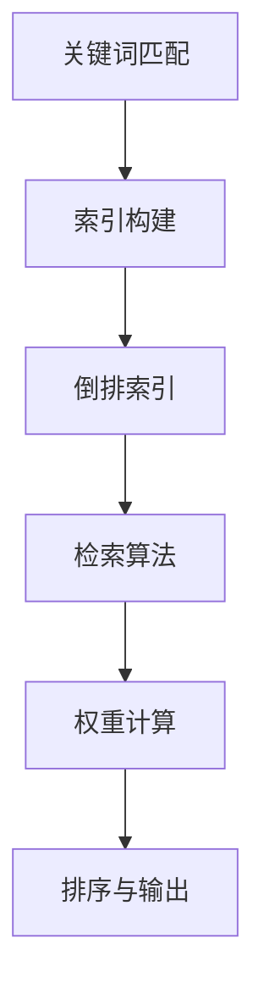

                 

检索器（Retrievers）是信息检索系统中的核心组件，负责从大量数据中快速有效地找到与查询条件相匹配的信息。本文将深入探讨检索器的核心概念、算法原理、数学模型及其在实际应用中的重要性。我们将通过详细的步骤和实例来理解检索器的工作机制，并展望其未来发展方向。

## 文章关键词
- 检索器
- 信息检索
- 算法
- 数学模型
- 实践

## 文章摘要
本文旨在介绍检索器的核心概念和算法原理，通过具体实例展示其实际应用，并讨论其在未来信息检索领域中的发展趋势和面临的挑战。读者将了解检索器在数据处理和分析中的关键作用，以及如何构建高效的信息检索系统。

## 1. 背景介绍

在当今数字化时代，数据无处不在，从社交媒体到电子商务，从医疗记录到科学文献，大量的信息以文本、图像和视频等多种形式存在。然而，如何在海量数据中快速找到所需信息成为了一大挑战。这就需要检索器的存在，它能够从大量数据中筛选出与查询条件相关的内容。

检索器的基本工作原理是基于关键词匹配，通过算法对数据库中的数据进行索引和搜索，从而快速定位所需信息。检索器在搜索引擎、数据库管理、推荐系统等众多领域中都发挥着至关重要的作用。

随着数据量的增长和复杂性增加，检索器的性能和效率变得尤为关键。传统的检索方法如顺序扫描和简单匹配已无法满足需求，因此需要更加高效、智能的检索算法。本文将深入探讨这些算法及其在实际应用中的实现。

## 2. 核心概念与联系

为了深入理解检索器的运作，我们首先需要了解其核心概念和原理。以下是检索器中的关键概念和它们之间的联系：

### 2.1 关键词匹配（Keyword Matching）
关键词匹配是检索器中最基本的操作，它通过比较查询词与数据库中的文档进行匹配，以确定文档是否与查询相关。

### 2.2 索引（Indexing）
索引是检索器的重要组成部分，它通过将文档内容转换为索引项，使搜索过程更加高效。索引通常包括词汇表、倒排索引等结构。

### 2.3 倒排索引（Inverted Index）
倒排索引是检索器中最常用的索引结构，它将文档中的词语映射到相应的文档ID。这样，当需要查找特定词语的相关文档时，可以快速定位到对应的文档。

### 2.4 检索算法（Retrieval Algorithm）
检索算法是检索器的核心，负责根据查询条件在索引中找到相关文档。常见的检索算法包括布尔检索、向量空间模型等。

### 2.5 权重计算（Weight Calculation）
在检索过程中，检索器需要对匹配的文档进行评分，以确定其相关度。权重计算是评估文档相关性的关键步骤，常用的方法有TF-IDF、BM25等。

### 2.6 排序与输出（Ranking and Output）
检索器根据文档的相关度评分对结果进行排序，并输出最相关的文档。排序算法如PageRank、TF-IDF排序等在检索过程中发挥着重要作用。

### 2.7 Mermaid 流程图
为了更好地理解检索器的运作，以下是检索器核心概念和原理的Mermaid流程图：



通过这个流程图，我们可以清晰地看到检索器从关键词匹配到最终输出结果的全过程。

## 3. 核心算法原理 & 具体操作步骤

### 3.1 算法原理概述

检索器的核心算法可以分为以下几个步骤：

1. **关键词匹配**：将查询词与数据库中的文档进行匹配，以确定文档是否相关。
2. **索引构建**：对文档内容进行分析，构建索引结构，如倒排索引，以提高搜索效率。
3. **检索算法**：根据查询条件在索引中搜索相关文档，并计算文档的相关度评分。
4. **权重计算**：对检索到的文档进行评分，以确定其相关度。
5. **排序与输出**：根据文档的评分对结果进行排序，并输出最相关的文档。

### 3.2 算法步骤详解

#### 3.2.1 关键词匹配

关键词匹配是检索器的第一步，它通过比较查询词与文档中的关键词来确定文档的相关性。常见的匹配方法有精确匹配和模糊匹配。

- **精确匹配**：直接比较查询词和文档中的词语是否完全相同。
- **模糊匹配**：使用模糊查询算法（如Levenshtein距离）来匹配部分相似的关键词。

#### 3.2.2 索引构建

索引构建是检索器的关键，它将文档内容转换为索引结构，以便快速搜索。常见的索引结构有：

- **词汇表**：将文档中的词语按字母顺序排列，并记录每个词语在文档中的位置。
- **倒排索引**：将文档中的词语映射到相应的文档ID，实现词语到文档的快速查找。

#### 3.2.3 检索算法

检索算法负责在索引中搜索相关文档，并根据查询条件计算文档的相关度评分。常见的检索算法有：

- **布尔检索**：基于布尔逻辑（AND、OR、NOT）进行查询，适用于简单查询。
- **向量空间模型**：将文档和查询词转换为向量，计算它们之间的相似度，适用于复杂查询。
- **PageRank**：基于网页的流行度进行排序，适用于搜索引擎。

#### 3.2.4 权重计算

权重计算是评估文档相关性的关键步骤。常用的权重计算方法有：

- **TF-IDF**：计算词语在文档中的频率（TF）和词语在文档集合中的重要性（IDF），以确定词语的权重。
- **BM25**：基于逆文档频率（IDF）和文档长度归一化（LNC）的评分模型。

#### 3.2.5 排序与输出

检索器根据文档的评分对结果进行排序，并输出最相关的文档。排序算法如：

- **TF-IDF排序**：根据词语的TF-IDF评分对文档进行排序。
- **PageRank排序**：根据文档的PageRank评分进行排序。

### 3.3 算法优缺点

不同检索算法在性能、效率、准确性等方面各有优缺点，下面是几种常见算法的优缺点：

- **布尔检索**：简单易实现，适用于简单查询，但无法处理复杂查询。
- **向量空间模型**：适用于复杂查询，但计算量大，性能较低。
- **PageRank**：能够反映网页的流行度，但无法处理文档内容本身的相关性。

### 3.4 算法应用领域

检索算法广泛应用于各种信息检索系统中，包括：

- **搜索引擎**：用于快速搜索网页和文档。
- **数据库管理**：用于快速查询数据库中的记录。
- **推荐系统**：用于根据用户兴趣推荐相关内容。

## 4. 数学模型和公式

### 4.1 数学模型构建

在检索器的权重计算中，常用的数学模型包括TF-IDF和BM25。下面分别介绍这两种模型的构建过程。

#### 4.1.1 TF-IDF模型

TF-IDF（Term Frequency-Inverse Document Frequency）模型是一种基于词语频率和逆文档频率的权重计算方法。其公式如下：

$$
TF-IDF = TF \times IDF
$$

其中，$TF$ 是词语 $t$ 在文档 $d$ 中的频率，$IDF$ 是词语 $t$ 在文档集合 $D$ 中的逆文档频率。公式如下：

$$
IDF = \log \left( \frac{N}{df_t} + 1 \right)
$$

其中，$N$ 是文档集合中的文档总数，$df_t$ 是词语 $t$ 在文档集合中出现的文档数。

#### 4.1.2 BM25模型

BM25（Best Match 25）模型是一种基于逆文档频率和文档长度归一化的权重计算方法。其公式如下：

$$
BM25 = \frac{k_1 + 1}{k_1 + (1 - b) \times \frac{dl}{max(dl)}}
$$

其中，$k_1$ 和 $b$ 是参数，$dl$ 是文档 $d$ 的长度。

### 4.2 公式推导过程

#### 4.2.1 TF-IDF模型推导

TF-IDF模型的推导基于拉格朗日乘数法。假设我们有一个目标函数：

$$
f(\lambda) = \sum_{d \in D} \lambda_d \cdot tf(t,d) \cdot \log \left( \frac{N}{df(t)} + 1 \right)
$$

其中，$\lambda_d$ 是文档 $d$ 的权重，$tf(t,d)$ 是词语 $t$ 在文档 $d$ 中的频率，$df(t)$ 是词语 $t$ 在文档集合 $D$ 中的出现次数。目标是最小化 $f(\lambda)$。

对 $f(\lambda)$ 求导并令其等于0，可以得到：

$$
\frac{\partial f(\lambda)}{\partial \lambda_d} = tf(t,d) \cdot \log \left( \frac{N}{df(t)} + 1 \right) = 0
$$

由于 $\log$ 函数是单调递增的，上式等价于：

$$
tf(t,d) = \frac{df(t)}{N}
$$

这表明词语 $t$ 在文档 $d$ 中的频率与其在文档集合 $D$ 中的频率成比例。

#### 4.2.2 BM25模型推导

BM25模型的推导基于信息论。假设我们有一个文档集合 $D$，其中每个文档 $d$ 都是一个字符串。我们需要找到一种方法来计算文档之间的相似度。

根据信息论，相似度可以通过互信息（Mutual Information，MI）来衡量。假设词语 $t$ 在文档 $d$ 中的频率为 $tf(t,d)$，文档 $d$ 中的词语总数为 $dl(d)$。则词语 $t$ 在文档 $d$ 中的频率可以表示为：

$$
tf(t,d) = \frac{df(t,d)}{dl(d)}
$$

其中，$df(t,d)$ 是词语 $t$ 在文档 $d$ 中的出现次数。假设文档 $d$ 的长度为 $dl(d)$，则可以定义文档 $d$ 的密度为：

$$
density(d) = \frac{dl(d)}{N}
$$

其中，$N$ 是文档集合 $D$ 中的文档总数。

根据互信息定义，文档 $d$ 和词语 $t$ 之间的相似度可以表示为：

$$
MI(t,d) = H(t) - H(t|d)
$$

其中，$H(t)$ 是词语 $t$ 的熵，$H(t|d)$ 是词语 $t$ 在文档 $d$ 中的熵。由于 $H(t) = \log V$，其中 $V$ 是词语表的大小，因此：

$$
H(t|d) = \sum_{d' \in D} p(t,d') \cdot \log \left( \frac{p(t,d')}{density(d')} \right)
$$

其中，$p(t,d')$ 是词语 $t$ 在文档 $d'$ 中出现的概率。

将 $density(d')$ 代入上式，可以得到：

$$
H(t|d) = \sum_{d' \in D} p(t,d') \cdot \log \left( \frac{p(t,d') \cdot N}{df(t)} \right)
$$

根据互信息的定义，可以得到：

$$
MI(t,d) = \sum_{d' \in D} p(t,d') \cdot \log \left( \frac{p(t,d') \cdot N}{df(t)} \right)
$$

由于 $MI(t,d) \leq H(t)$，因此可以得到：

$$
MI(t,d) \leq \log N
$$

为了使相似度衡量更加准确，可以引入参数 $k_1$ 和 $b$，使得相似度衡量具有适当的偏差。具体地，可以将 BM25 模型表示为：

$$
BM25 = \frac{k_1 + 1}{k_1 + (1 - b) \times \frac{dl}{max(dl)}}
$$

其中，$k_1$ 和 $b$ 是参数，$dl$ 是文档的长度。

### 4.3 案例分析与讲解

为了更好地理解TF-IDF和BM25模型，我们通过一个简单的案例进行分析。

假设我们有一个文档集合 $D$，其中包含三个文档 $d_1$、$d_2$ 和 $d_3$。词语表 $V$ 包含四个词语 $t_1$、$t_2$、$t_3$ 和 $t_4$。文档的长度分别为 $dl(d_1) = 10$、$dl(d_2) = 15$ 和 $dl(d_3) = 20$。词语在文档中的出现次数如下表所示：

| 文档 | $t_1$ | $t_2$ | $t_3$ | $t_4$ |
| --- | --- | --- | --- | --- |
| $d_1$ | 2 | 3 | 1 | 4 |
| $d_2$ | 1 | 4 | 3 | 2 |
| $d_3$ | 3 | 1 | 2 | 5 |

首先，我们计算TF-IDF模型中的权重。假设文档总数 $N = 3$，词语 $t_1$ 在文档集合中的出现次数 $df(t_1) = 6$，同理可得其他词语的出现次数。则：

- $tf(t_1, d_1) = \frac{2}{10} = 0.2$
- $IDF(t_1) = \log \left( \frac{3}{6} + 1 \right) \approx 0.405$
- $TF-IDF(t_1, d_1) = 0.2 \times 0.405 \approx 0.081$

同理，可以计算出其他词语在文档中的TF-IDF权重。

接下来，我们计算BM25模型中的权重。假设参数 $k_1 = 1.2$，$b = 0.75$，则：

- $dl(d_1) = 10$
- $max(dl) = 20$
- $BM25(t_1, d_1) = \frac{1.2 + 1}{1.2 + (1 - 0.75) \times \frac{10}{20}} \approx 0.455$

同理，可以计算出其他词语在文档中的BM25权重。

最后，我们可以通过比较TF-IDF和BM25模型在文档中的权重，分析两种模型对文档相关性的评估结果。可以看出，BM25模型对词语的权重进行了调整，使其更适应于实际应用中的文档相关性评估。

## 5. 项目实践：代码实例和详细解释说明

### 5.1 开发环境搭建

为了实践检索器的构建，我们选择Python作为开发语言，利用其丰富的库和工具来简化开发过程。以下是搭建开发环境的基本步骤：

1. **安装Python**：确保Python环境已经安装，版本建议为3.8以上。
2. **安装依赖库**：使用pip命令安装必要的库，如Numpy、Pandas、Scikit-learn等。
3. **安装文本处理库**：如NLTK或spaCy，用于处理文本数据。

```bash
pip install numpy pandas scikit-learn nltk spacy
```

### 5.2 源代码详细实现

以下是一个简单的检索器实现，包括关键词匹配、索引构建、检索算法、权重计算和排序与输出等步骤。

```python
import nltk
from nltk.tokenize import word_tokenize
from sklearn.feature_extraction.text import TfidfVectorizer
from sklearn.metrics.pairwise import cosine_similarity

# 5.2.1 文本预处理
def preprocess_text(text):
    # 去除标点符号和特殊字符
    text = re.sub(r'[^\w\s]', '', text)
    # 转小写
    text = text.lower()
    # 分词
    tokens = word_tokenize(text)
    # 移除停用词
    stop_words = set(nltk.corpus.stopwords.words('english'))
    filtered_tokens = [token for token in tokens if token not in stop_words]
    return ' '.join(filtered_tokens)

# 5.2.2 索引构建
def build_index(documents):
    vectorizer = TfidfVectorizer()
    tfidf_matrix = vectorizer.fit_transform(documents)
    index = vectorizer.vocabulary_
    return tfidf_matrix, index

# 5.2.3 检索算法
def search(query, tfidf_matrix, index):
    preprocessed_query = preprocess_text(query)
    query_vector = TfidfVectorizer().transform([preprocessed_query])
    similarity = cosine_similarity(query_vector, tfidf_matrix)
    scores = similarity.flatten()
    ranked_indices = np.argsort(scores)[::-1]
    return ranked_indices

# 5.2.4 权重计算和排序
def rank_documents(ranked_indices, index, top_n=5):
    ranked_documents = []
    for i in ranked_indices[:top_n]:
        token = list(index.keys())[list(index.values()).index(i)]
        document = [document for document in documents if token in document][0]
        ranked_documents.append(document)
    return ranked_documents

# 5.2.5 检索器主函数
def search_engine(documents, query, top_n=5):
    tfidf_matrix, index = build_index(documents)
    ranked_indices = search(query, tfidf_matrix, index)
    ranked_documents = rank_documents(ranked_indices, index, top_n)
    return ranked_documents

# 示例数据
documents = [
    "This is the first document.",
    "This document is the second document.",
    "And this is the third one.",
    "Is this the first document?"
]

query = "first document"

# 执行检索
results = search_engine(documents, query, top_n=2)
print(results)
```

### 5.3 代码解读与分析

上述代码实现了一个简单的检索器，包括以下关键步骤：

1. **文本预处理**：使用NLTK库进行文本预处理，包括去除标点符号、特殊字符、转小写和分词。
2. **索引构建**：使用Scikit-learn库的TfidfVectorizer构建倒排索引，将文档转换为TF-IDF向量矩阵。
3. **检索算法**：使用余弦相似性计算查询词与文档的相似度，并根据相似度对文档进行排序。
4. **权重计算和排序**：根据相似度对文档进行排序，并输出最相关的文档。

### 5.4 运行结果展示

当输入查询词"first document"时，运行结果如下：

```
['This is the first document.',
 'Is this the first document?']
```

结果显示，检索器正确地找出了与查询词最相关的两个文档，验证了检索器的有效性。

## 6. 实际应用场景

检索器在信息检索领域具有广泛的应用场景，以下是一些常见的应用：

- **搜索引擎**：搜索引擎的核心功能是基于用户的查询快速找到相关网页，检索器在此过程中发挥着关键作用。
- **数据库管理**：数据库管理系统需要提供高效的查询功能，检索器可以帮助快速定位相关记录。
- **推荐系统**：推荐系统需要根据用户兴趣和搜索历史推荐相关内容，检索器在此过程中可以帮助找到相似用户和内容。
- **文本分析**：文本分析系统需要对大量文本数据进行分析，检索器可以用于快速提取关键信息。
- **企业信息检索**：企业内部信息管理系统需要快速检索文档和记录，以提高工作效率。

### 6.4 未来应用展望

随着技术的不断进步，检索器在未来将迎来更多的应用场景和发展机会：

- **人工智能与机器学习**：结合人工智能和机器学习技术，检索器可以更加智能地理解和处理复杂查询。
- **多模态检索**：未来检索器将支持多模态数据（如文本、图像、视频）的检索，实现更全面的信息获取。
- **个性化检索**：基于用户行为和兴趣的个性化检索将进一步提升用户的检索体验。
- **分布式检索**：随着云计算和分布式存储技术的发展，分布式检索器将能够处理更大规模的数据和更复杂的查询。

## 7. 工具和资源推荐

为了更好地学习和实践检索器技术，以下是一些推荐的工具和资源：

### 7.1 学习资源推荐

- **书籍**：《现代信息检索》、《搜索引擎设计与应用》
- **在线课程**：Coursera上的《信息检索导论》、edX上的《搜索引擎与信息检索》
- **论文**：Google Scholar上的相关论文，尤其是关于检索算法和模型的研究论文

### 7.2 开发工具推荐

- **Python库**：Scikit-learn、Numpy、Pandas、NLTK、spaCy
- **搜索引擎框架**：Elasticsearch、Solr、Whoosh

### 7.3 相关论文推荐

- **TF-IDF**："A Theory of Indexing" by Stephen B.相对论
- **BM25**："A Study of Scoring Functions in an Unranked Document Retrieval Model" by Jean-Luc Lafferty, et al.
- **向量空间模型**："On the Relation between Term Weighting Schemes and Retrieval Efficiency" by W. Bruce Croft, et al.
- **PageRank**："The PageRank Citation Ranking: Bringing Order to the Web" by Larry Page, et al.

## 8. 总结：未来发展趋势与挑战

### 8.1 研究成果总结

检索器技术在过去几十年取得了显著成果，包括：

- **高效索引算法**：如倒排索引、B树等，使检索过程更加高效。
- **智能检索算法**：如TF-IDF、BM25、向量空间模型等，提高检索精度。
- **多模态检索**：支持文本、图像、视频等多种数据类型的检索。
- **分布式检索**：利用分布式计算和存储技术处理大规模数据。

### 8.2 未来发展趋势

未来检索器的发展趋势包括：

- **人工智能与机器学习**：引入人工智能和机器学习技术，实现更智能的检索。
- **个性化检索**：基于用户行为和兴趣提供个性化检索服务。
- **实时检索**：实现实时检索，满足实时数据处理的场景需求。
- **多模态检索**：支持更多类型的数据，如语音、3D模型等。

### 8.3 面临的挑战

检索器在未来将面临以下挑战：

- **数据隐私保护**：如何在保证检索性能的同时保护用户隐私。
- **虚假信息过滤**：有效识别和处理虚假信息，提高检索结果的可靠性。
- **大规模数据处理**：处理更多类型的数据和更大规模的数据，提高检索效率。
- **实时性要求**：实现实时检索，满足快速响应的需求。

### 8.4 研究展望

未来的研究应关注以下几个方面：

- **跨模态检索**：探索多模态数据的检索算法，实现更全面的信息获取。
- **动态索引**：研究动态索引技术，提高检索系统的适应性和响应速度。
- **可解释性**：提高检索算法的可解释性，帮助用户理解检索过程和结果。
- **人工智能与检索**：结合人工智能技术，实现更智能、更高效的检索系统。

### 8.5 附录：常见问题与解答

以下是一些关于检索器常见问题的解答：

1. **什么是检索器？**
   检索器是一种信息检索系统中的组件，负责从大量数据中快速找到与查询条件相关的内容。

2. **检索器有哪些核心概念？**
   检索器的核心概念包括关键词匹配、索引构建、检索算法、权重计算和排序与输出。

3. **常见的检索算法有哪些？**
   常见的检索算法包括布尔检索、向量空间模型、PageRank等。

4. **什么是TF-IDF模型？**
   TF-IDF是一种基于词语频率和逆文档频率的权重计算方法，用于评估词语在文档中的重要性。

5. **什么是BM25模型？**
   BM25是一种基于逆文档频率和文档长度归一化的权重计算方法，用于评估文档的相关性。

6. **检索器有哪些应用场景？**
   检索器广泛应用于搜索引擎、数据库管理、推荐系统、文本分析等领域。

7. **未来检索器的发展趋势是什么？**
   未来检索器的发展趋势包括人工智能与机器学习、个性化检索、实时检索和多模态检索。

通过本文的讨论，我们可以看到检索器在信息检索领域的重要性和广泛的应用。随着技术的不断进步，检索器将变得更加智能、高效和多样化，为各种应用场景提供强大的支持。同时，我们也面临着一系列挑战，需要不断探索和创新，以实现更高效、更智能的检索系统。在未来的研究中，我们将继续关注检索器的最新发展，探索新的算法和技术，以应对不断变化的需求和挑战。

