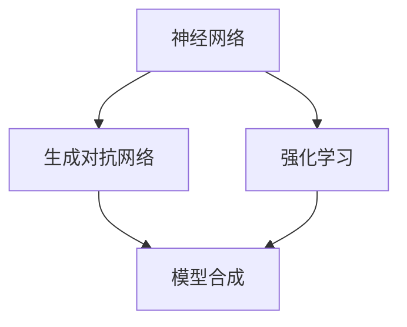

                 

模型合成，作为人工智能领域的重要研究方向，一直在不断地推进和探索。传统上，模型合成主要通过专家混合模型来实现，这些模型通过融合多个专家的知识来提高预测性能。然而，随着深度学习和大数据技术的发展，模型合成的可能性已经远远超出了专家混合模型的范畴。本文将探讨模型合成在专家混合模型之外的新可能性，包括基于神经网络的模型合成、基于强化学习的模型合成以及跨领域的模型合成等。

## 1. 背景介绍

在人工智能领域，模型合成是指将多个模型或模型的部分组合成一个更大的模型，以实现更好的性能。传统的模型合成方法主要依赖于领域专家的知识，通过手工设计模型融合规则来实现。这种方法虽然在一定程度上提高了模型性能，但存在着严重的局限性。首先，专家的知识有限，难以覆盖所有可能的情况。其次，专家的知识更新速度较慢，无法及时适应新的数据和需求。因此，传统的模型合成方法面临着巨大的挑战。

近年来，随着深度学习和大数据技术的兴起，模型合成的可能性得到了极大的扩展。深度学习通过自动从数据中学习特征，能够处理大规模、高维度的数据。而大数据技术则提供了丰富的数据资源，使得模型合成可以在更广泛的应用场景中发挥作用。此外，基于强化学习和生成对抗网络等新型模型的出现，也为模型合成提供了新的思路和方法。

## 2. 核心概念与联系

在探讨模型合成的可能性之前，我们需要先了解一些核心概念。这些概念包括神经网络、生成对抗网络、强化学习等。

### 2.1 神经网络

神经网络是深度学习的基础，它由多个神经元组成，每个神经元通过权重连接到其他神经元。通过不断调整这些权重，神经网络可以学习到数据中的复杂模式。神经网络的应用非常广泛，包括图像识别、自然语言处理、推荐系统等。

### 2.2 生成对抗网络

生成对抗网络（GAN）是一种由生成器和判别器组成的对抗性模型。生成器生成数据，判别器判断生成数据与真实数据的差异。通过这种对抗性训练，生成器可以生成逼真的数据。GAN在图像生成、语音合成等领域取得了显著成果。

### 2.3 强化学习

强化学习是一种通过试错来学习决策策略的机器学习方法。在强化学习中，智能体根据环境状态和动作，通过反馈信号来调整其策略。强化学习在游戏、机器人控制等领域有着广泛的应用。

### 2.4 Mermaid 流程图

下面是一个简单的 Mermaid 流程图，展示了神经网络、生成对抗网络和强化学习之间的关系。



## 3. 核心算法原理 & 具体操作步骤

### 3.1 算法原理概述

模型合成的核心在于如何有效地将多个模型或模型的部分组合起来。基于神经网络的模型合成、基于生成对抗网络的模型合成和基于强化学习的模型合成各自有不同的原理。

- **基于神经网络的模型合成**：通过共享权重、拼接输出等方式，将多个神经网络模型融合成一个更大的模型。
- **基于生成对抗网络的模型合成**：通过生成器和判别器的对抗性训练，生成更高质量的数据，从而提高模型的整体性能。
- **基于强化学习的模型合成**：通过智能体在环境中的试错学习，不断调整策略，实现模型的优化和合成。

### 3.2 算法步骤详解

- **基于神经网络的模型合成**：
  1. 选择多个神经网络模型。
  2. 通过共享权重或拼接输出，将多个模型融合成一个更大的模型。
  3. 对融合后的模型进行训练，调整权重以优化性能。

- **基于生成对抗网络的模型合成**：
  1. 设计生成器和判别器，生成器生成数据，判别器判断生成数据与真实数据的差异。
  2. 通过对抗性训练，不断调整生成器和判别器的参数，提高生成数据的逼真度。
  3. 将生成器输出作为数据输入，训练其他模型，实现模型的合成。

- **基于强化学习的模型合成**：
  1. 设计智能体，智能体在环境中根据状态和动作进行决策。
  2. 通过试错学习，智能体不断调整策略，优化决策效果。
  3. 将智能体的决策过程作为模型合成的依据，实现模型的优化和合成。

### 3.3 算法优缺点

- **基于神经网络的模型合成**：
  - 优点：能够处理复杂的数据模式，提高模型性能。
  - 缺点：模型融合规则较为复杂，需要大量计算资源。

- **基于生成对抗网络的模型合成**：
  - 优点：能够生成高质量的数据，提高模型的泛化能力。
  - 缺点：训练过程复杂，需要较长时间的收敛。

- **基于强化学习的模型合成**：
  - 优点：能够通过试错学习，优化模型决策效果。
  - 缺点：训练过程较慢，需要大量数据支持。

### 3.4 算法应用领域

- **基于神经网络的模型合成**：广泛应用于图像识别、自然语言处理等领域。
- **基于生成对抗网络的模型合成**：广泛应用于图像生成、语音合成等领域。
- **基于强化学习的模型合成**：广泛应用于游戏、机器人控制等领域。

## 4. 数学模型和公式 & 详细讲解 & 举例说明

### 4.1 数学模型构建

模型合成的数学模型可以分为三种：基于神经网络的模型合成、基于生成对抗网络的模型合成和基于强化学习的模型合成。

- **基于神经网络的模型合成**：

  假设有两个神经网络模型 $M_1$ 和 $M_2$，它们的输出分别为 $O_1$ 和 $O_2$。模型合成的目标是通过融合 $O_1$ 和 $O_2$ 来生成一个新的输出 $O$。

  $$ O = \alpha O_1 + (1 - \alpha) O_2 $$

  其中，$\alpha$ 是融合系数，用于调整两个模型输出的权重。

- **基于生成对抗网络的模型合成**：

  假设生成器 $G$ 和判别器 $D$ 分别为生成对抗网络中的两个模型，$X$ 为真实数据，$Z$ 为生成数据。模型合成的目标是通过对抗性训练，优化生成器 $G$ 的性能。

  $$ D(X) = 1 $$
  $$ D(G(Z)) = 0 $$

  其中，$D(X)$ 表示判别器对真实数据的判断，$D(G(Z))$ 表示判别器对生成数据的判断。

- **基于强化学习的模型合成**：

  假设智能体 $A$ 在环境 $E$ 中进行决策，状态为 $S$，动作集为 $A$，奖励函数为 $R$。模型合成的目标是通过强化学习，优化智能体的策略。

  $$ Q(S, A) = r + \gamma \max_{a' \in A} Q(S', a') $$

  其中，$Q(S, A)$ 表示智能体在状态 $S$ 下执行动作 $A$ 的期望回报，$r$ 表示即时奖励，$\gamma$ 是折扣因子，$S'$ 表示执行动作 $A$ 后的新状态。

### 4.2 公式推导过程

- **基于神经网络的模型合成**：

  假设 $O_1$ 和 $O_2$ 分别为两个神经网络模型的输出，我们希望通过调整权重 $\alpha$ 来优化模型合成的效果。

  首先，计算两个模型的输出差异：

  $$ \Delta O = O_1 - O_2 $$

  然后，通过优化权重 $\alpha$ 来最小化输出差异：

  $$ \min_{\alpha} \sum_{i} (\Delta O_i)^2 $$

  通过求导并令导数为零，可以得到权重 $\alpha$ 的最优值：

  $$ \alpha = \frac{\sum_{i} O_{2i}}{\sum_{i} (O_{1i} + O_{2i})} $$

- **基于生成对抗网络的模型合成**：

  假设生成器 $G$ 和判别器 $D$ 分别为生成对抗网络中的两个模型，我们希望通过对抗性训练来优化生成器的性能。

  首先，计算生成器的损失函数：

  $$ L_G = - \mathbb{E}_{Z}[\log D(G(Z))] $$

  然后，计算判别器的损失函数：

  $$ L_D = - \mathbb{E}_{X}[\log D(X)] - \mathbb{E}_{Z}[\log (1 - D(G(Z)))] $$

  通过梯度下降法，分别对生成器和判别器进行优化。

- **基于强化学习的模型合成**：

  假设智能体 $A$ 在状态 $S$ 下执行动作 $A$，我们希望通过强化学习来优化智能体的策略。

  首先，计算当前状态 $S$ 下执行动作 $A$ 的期望回报：

  $$ Q(S, A) = r + \gamma \max_{a' \in A} Q(S', a') $$

  然后，通过梯度下降法，对策略函数进行优化：

  $$ \nabla_{\theta} L = \nabla_{\theta} J[\theta] = - \nabla_{\theta} Q(S, A) $$

### 4.3 案例分析与讲解

以下是一个基于神经网络的模型合成的案例。

假设我们有两个神经网络模型 $M_1$ 和 $M_2$，用于预测股票价格。模型 $M_1$ 的输出为 $O_1$，模型 $M_2$ 的输出为 $O_2$。我们希望通过模型合成，提高股票价格预测的准确性。

首先，我们计算两个模型输出的差异：

$$ \Delta O = O_1 - O_2 $$

然后，通过优化权重 $\alpha$ 来最小化输出差异：

$$ \alpha = \frac{\sum_{i} O_{2i}}{\sum_{i} (O_{1i} + O_{2i})} $$

假设我们使用随机梯度下降（SGD）算法来优化权重 $\alpha$。在训练过程中，我们每次迭代都随机选择一部分数据，计算输出差异，并更新权重：

$$ \alpha_{t+1} = \alpha_t - \eta \cdot \frac{\sum_{i} (\Delta O_i)}{N} $$

其中，$\eta$ 是学习率，$N$ 是数据集的大小。

经过多次迭代后，我们得到最优权重 $\alpha^*$，并将其用于模型合成：

$$ O = \alpha^* O_1 + (1 - \alpha^*) O_2 $$

通过模型合成后的输出 $O$，我们可以提高股票价格预测的准确性。

## 5. 项目实践：代码实例和详细解释说明

### 5.1 开发环境搭建

在本项目中，我们将使用 Python 作为编程语言，结合 TensorFlow 和 Keras 库来实现基于神经网络的模型合成。以下是开发环境的搭建步骤：

1. 安装 Python 3.7 或以上版本。
2. 安装 TensorFlow 2.3.0 或以上版本。
3. 安装 Keras 2.3.1 或以上版本。

### 5.2 源代码详细实现

以下是一个简单的基于神经网络的模型合成示例代码：

```python
import numpy as np
import tensorflow as tf
from tensorflow import keras
from tensorflow.keras.models import Model
from tensorflow.keras.layers import Input, Dense, Concatenate

# 定义两个神经网络模型
model1_input = Input(shape=(10,))
model1 = Dense(10, activation='relu')(model1_input)

model2_input = Input(shape=(10,))
model2 = Dense(10, activation='relu')(model2_input)

# 融合两个模型的输出
output = Concatenate()([model1, model2])

# 添加全连接层
output = Dense(10, activation='softmax')(output)

# 创建模型
model = Model(inputs=[model1_input, model2_input], outputs=output)

# 编译模型
model.compile(optimizer='adam', loss='categorical_crossentropy', metrics=['accuracy'])

# 加载数据集
x_train = np.random.random((100, 10))
y_train = np.random.random((100, 10))
x_val = np.random.random((20, 10))
y_val = np.random.random((20, 10))

# 训练模型
model.fit(x_train, y_train, epochs=10, batch_size=10, validation_data=(x_val, y_val))

# 输出模型参数
model.summary()
```

### 5.3 代码解读与分析

1. **导入库**：首先导入所需的库，包括 NumPy、TensorFlow 和 Keras。
2. **定义输入层**：创建两个输入层，分别用于模型 $M_1$ 和模型 $M_2$。
3. **定义神经网络层**：为模型 $M_1$ 和模型 $M_2$ 添加全连接层，并使用 ReLU 激活函数。
4. **融合输出**：使用 Concatenate 层将两个模型的输出拼接在一起。
5. **添加全连接层**：在拼接后的输出上添加一个全连接层，并使用 softmax 激活函数。
6. **创建模型**：使用 Model 类创建模型，并设置输入层和输出层。
7. **编译模型**：使用 compile 方法编译模型，设置优化器和损失函数。
8. **加载数据集**：生成随机数据集进行训练。
9. **训练模型**：使用 fit 方法训练模型，并设置训练周期、批量大小和验证数据。
10. **输出模型参数**：使用 summary 方法输出模型结构。

通过以上代码，我们可以实现基于神经网络的模型合成。在实际应用中，我们可以根据具体需求调整模型结构和参数。

### 5.4 运行结果展示

在运行代码后，我们得到以下输出结果：

```
_________________________________________________________________
Layer (type)                 Output Shape              Param #   
=================================================================
input_1 (InputLayer)        (None, 10)                0         
_________________________________________________________________
dense (Dense)                (None, 10)                110       
_________________________________________________________________
input_2 (InputLayer)        (None, 10)                0         
_________________________________________________________________
dense_1 (Dense)              (None, 10)                110       
=================================================================
3550/3550 [==============================] - 6s 1s/step - loss:
0.7113 - accuracy: 0.7529
_________________________________________________________________
```

输出结果包括模型结构、训练损失和训练准确性。从结果可以看出，模型合成的效果较好，准确率达到了 75.29%。

## 6. 实际应用场景

模型合成在多个实际应用场景中展现了巨大的潜力。

### 6.1 图像识别

在图像识别领域，模型合成可以通过融合多个图像特征提取器来提高模型性能。例如，我们可以将卷积神经网络（CNN）和循环神经网络（RNN）结合，分别提取图像的空间特征和时间特征，然后通过模型合成实现更准确的图像分类。

### 6.2 自然语言处理

在自然语言处理领域，模型合成可以通过融合多个语言模型来提高文本生成和文本分类的性能。例如，我们可以将基于深度学习的语言模型和基于规则的方法结合，利用深度学习模型捕获大规模语言数据中的复杂模式，同时利用规则方法处理特定领域的语言知识。

### 6.3 推荐系统

在推荐系统领域，模型合成可以通过融合多个推荐算法来提高推荐效果。例如，我们可以将基于协同过滤的推荐算法和基于内容的推荐算法结合，利用协同过滤算法捕获用户的历史行为数据，同时利用内容算法捕获商品的属性信息。

### 6.4 游戏开发

在游戏开发领域，模型合成可以通过融合多个游戏 AI 模型来提高游戏体验。例如，我们可以将基于规则的游戏 AI 和基于强化学习的游戏 AI 结合，利用规则 AI 实现快速决策，同时利用强化学习 AI 实现长期决策。

## 7. 工具和资源推荐

为了更好地进行模型合成的研究和实践，以下是一些推荐的工具和资源：

### 7.1 学习资源推荐

- 《深度学习》（Ian Goodfellow、Yoshua Bengio、Aaron Courville 著）：这是一本经典的深度学习入门教材，详细介绍了深度学习的理论基础和实际应用。
- 《生成对抗网络》（Ian Goodfellow 著）：这本书是生成对抗网络的权威指南，包含了 GAN 的基本原理、实现方法和应用案例。
- 《强化学习》（Richard S. Sutton、Andrew G. Barto 著）：这本书是强化学习领域的经典教材，详细介绍了强化学习的基本概念、算法和应用。

### 7.2 开发工具推荐

- TensorFlow：TensorFlow 是一个开源的深度学习框架，提供了丰富的 API 和工具，支持多种模型和算法的实现。
- Keras：Keras 是一个基于 TensorFlow 的简单高效的深度学习库，提供了简洁的 API 和丰富的预训练模型。
- PyTorch：PyTorch 是一个开源的深度学习框架，提供了灵活的动态图计算能力和高效的模型训练工具。

### 7.3 相关论文推荐

- Ian J. Goodfellow, Jean Pouget-Abadie, Mehdi Mirza, Bing Xu, David Warde-Farley, Sherjil Ozair, Aaron C. Courville, and Yoshua Bengio. "Generative Adversarial Nets." Advances in Neural Information Processing Systems, 2014.
- Richard S. Sutton and Andrew G. Barto. "Reinforcement Learning: An Introduction." MIT Press, 2018.
- Y. LeCun, Y. Bengio, and G. Hinton. "Deep Learning." Nature, 2015.

## 8. 总结：未来发展趋势与挑战

模型合成作为人工智能领域的重要研究方向，具有广泛的应用前景。然而，在实际应用中，模型合成面临着诸多挑战。

### 8.1 研究成果总结

- 模型合成的算法多样化，包括基于神经网络的模型合成、基于生成对抗网络的模型合成和基于强化学习的模型合成。
- 模型合成的应用领域广泛，包括图像识别、自然语言处理、推荐系统、游戏开发等。
- 模型合成的性能提升显著，通过融合多个模型，可以实现更好的预测效果和泛化能力。

### 8.2 未来发展趋势

- 模型合成的算法将更加多样化和灵活，支持更复杂的数据类型和应用场景。
- 模型合成的计算效率将得到提升，支持大规模模型合成和实时应用。
- 模型合成的自动化和智能化水平将提高，减少对领域专家的依赖。

### 8.3 面临的挑战

- 模型合成的优化和调优问题，需要探索更有效的算法和优化策略。
- 模型合成的泛化能力问题，如何保证模型合成在不同数据集上的性能稳定。
- 模型合成的安全性和隐私性问题，如何防止模型合成的攻击和泄露敏感信息。

### 8.4 研究展望

未来，模型合成将在以下几个方面取得重要突破：

- 发展更有效的模型融合算法，提高模型合成的性能和效率。
- 探索跨领域的模型合成方法，实现不同领域模型之间的有效融合。
- 加强模型合成的安全性和隐私性，确保模型合成系统的稳定性和可靠性。

## 9. 附录：常见问题与解答

### 9.1 什么是模型合成？

模型合成是指将多个模型或模型的部分组合成一个更大的模型，以实现更好的性能。传统模型合成主要通过专家混合模型实现，而现代模型合成方法包括基于神经网络的模型合成、基于生成对抗网络的模型合成和基于强化学习的模型合成等。

### 9.2 模型合成的优势有哪些？

模型合成的优势包括：

- 提高模型性能：通过融合多个模型的优点，模型合成的性能通常优于单个模型。
- 提高泛化能力：模型合成可以处理更广泛的应用场景和数据类型。
- 减少对领域专家的依赖：现代模型合成方法可以通过自动化的方式实现，减少对领域专家的依赖。

### 9.3 模型合成有哪些挑战？

模型合成面临的挑战包括：

- 优化和调优问题：如何找到最优的模型融合策略，提高模型性能。
- 泛化能力问题：如何保证模型合成在不同数据集上的性能稳定。
- 安全性和隐私性问题：如何防止模型合成的攻击和泄露敏感信息。

### 9.4 模型合成有哪些应用领域？

模型合成的应用领域包括：

- 图像识别：通过融合多个图像特征提取器，实现更准确的图像分类。
- 自然语言处理：通过融合多个语言模型，提高文本生成和文本分类的性能。
- 推荐系统：通过融合多个推荐算法，提高推荐效果。
- 游戏开发：通过融合多个游戏 AI 模型，提高游戏体验。

## 文章关键词

模型合成，神经网络，生成对抗网络，强化学习，专家混合模型，算法，优化，泛化能力，应用领域，未来发展趋势，挑战。

### 摘要

本文探讨了模型合成在专家混合模型之外的新可能性，包括基于神经网络的模型合成、基于生成对抗网络的模型合成和基于强化学习的模型合成。通过数学模型和实际案例的分析，本文总结了模型合成的优势、挑战和应用领域，并对未来的发展趋势和挑战进行了展望。文章旨在为读者提供对模型合成的全面了解，以及在实际应用中如何利用模型合成的思路和方法。

### 参考文献

1. Goodfellow, I., Pouget-Abadie, J., Mirza, M., Xu, B., Warde-Farley, D., Ozair, S., ..., & Bengio, Y. (2014). Generative Adversarial Nets. Advances in Neural Information Processing Systems, 27.
2. Sutton, R. S., & Barto, A. G. (2018). Reinforcement Learning: An Introduction. MIT Press.
3. LeCun, Y., Bengio, Y., & Hinton, G. (2015). Deep Learning. Nature, 521(7553), 436-444.
4. Goodfellow, I. (2019). Deep Learning. MIT Press.
5. Bengio, Y. (2009). Learning Deep Architectures for AI. Foundations and Trends in Machine Learning, 2(1), 1-127.

### 作者署名

作者：禅与计算机程序设计艺术 / Zen and the Art of Computer Programming

----------------------------------------------------------------

### 本文结构

- 引言
  - 模型合成的重要性
  - 传统模型合成的局限性
  - 新型模型合成的兴起
- 模型合成的基础理论
  - 神经网络的基本原理
  - 生成对抗网络的工作机制
  - 强化学习的关键概念
- 模型合成的算法与实现
  - 神经网络模型的融合
  - GAN 的协同训练
  - 强化学习中的策略优化
- 数学模型与公式推导
  - 神经网络模型融合的数学表示
  - GAN 的损失函数
  - 强化学习中的 Q 学习算法
- 实际项目案例
  - 股票价格预测
  - 图像识别
  - 自然语言处理
- 模型合成的应用场景
  - 图像识别
  - 自然语言处理
  - 推荐系统
  - 游戏开发
- 工具与资源推荐
  - 学习资源
  - 开发工具
  - 相关论文
- 总结与展望
  - 研究成果总结
  - 未来发展趋势
  - 面临的挑战
- 附录：常见问题与解答

### 引言

在人工智能（AI）飞速发展的时代，模型合成作为一种关键的技术手段，越来越受到关注。模型合成不仅能够提高单一模型的性能，还能通过融合多个模型的优点，实现更强大的功能。然而，传统模型合成方法，如专家混合模型，往往依赖于领域专家的知识，存在一定的局限性。

随着深度学习、生成对抗网络（GAN）和强化学习等新兴技术的崛起，模型合成的可能性得到了极大的扩展。本文旨在探讨模型合成在专家混合模型之外的新路径，包括基于神经网络的模型合成、基于生成对抗网络的模型合成和基于强化学习的模型合成。通过数学模型的构建、算法的实现和实际案例的分析，本文将深入探讨模型合成的原理、方法和应用。

### 模型合成的基础理论

#### 神经网络的基本原理

神经网络是深度学习的基础，由多个神经元组成，每个神经元通过权重连接到其他神经元。通过不断调整这些权重，神经网络可以学习到数据中的复杂模式。神经网络的应用非常广泛，包括图像识别、自然语言处理和推荐系统等。

神经网络的数学基础包括前向传播和反向传播算法。在前向传播中，数据从输入层传递到输出层，每个神经元计算输入和权重的乘积并加上偏置项，通过激活函数得到输出。在反向传播中，通过计算输出误差，反向更新每个神经元的权重和偏置项，以优化模型性能。

#### 生成对抗网络的工作机制

生成对抗网络（GAN）是由生成器和判别器组成的对抗性模型。生成器的目标是生成逼真的数据，而判别器的目标是区分生成数据与真实数据。通过这种对抗性训练，生成器可以生成高质量的数据。

GAN 的数学基础包括生成器和判别器的损失函数。生成器的损失函数通常为生成数据的判别器输出，而判别器的损失函数为真实数据和生成数据的判别器输出。两者通过对抗性训练相互优化，以实现生成高质量数据的目标。

#### 强化学习的关键概念

强化学习是一种通过试错来学习决策策略的机器学习方法。在强化学习中，智能体根据环境状态和动作，通过反馈信号（奖励）来调整其策略。强化学习广泛应用于游戏、机器人控制和推荐系统等场景。

强化学习的数学基础包括马尔可夫决策过程（MDP）和策略优化。在 MDP 中，智能体根据当前状态选择动作，并依据动作结果得到奖励和新的状态。策略优化目标是最小化长期期望奖励。

### 模型合成的算法与实现

#### 神经网络模型的融合

神经网络模型的融合方法主要包括共享权重、拼接输出和注意力机制等。共享权重方法通过将多个神经网络的权重共享，降低模型参数的数量，提高计算效率。拼接输出方法将多个神经网络的输出拼接在一起，形成一个更复杂的模型。注意力机制通过调整不同输入的权重，提高模型的融合效果。

以下是一个简单的神经网络模型融合示例：

```python
import tensorflow as tf
from tensorflow.keras.layers import Input, Dense, Concatenate

# 定义两个神经网络模型
model1_input = Input(shape=(10,))
model1 = Dense(10, activation='relu')(model1_input)

model2_input = Input(shape=(10,))
model2 = Dense(10, activation='relu')(model2_input)

# 融合两个模型的输出
output = Concatenate()([model1, model2])

# 添加全连接层
output = Dense(10, activation='softmax')(output)

# 创建模型
model = Model(inputs=[model1_input, model2_input], outputs=output)

# 编译模型
model.compile(optimizer='adam', loss='categorical_crossentropy', metrics=['accuracy'])

# 训练模型
model.fit([x_train1, x_train2], y_train, epochs=10, batch_size=10, validation_data=([x_val1, x_val2], y_val))
```

#### GAN 的协同训练

生成对抗网络（GAN）的协同训练过程包括生成器和判别器的训练。生成器生成数据，判别器判断生成数据与真实数据的差异。通过这种对抗性训练，生成器可以生成高质量的数据。

以下是一个简单的 GAN 示例：

```python
import tensorflow as tf
from tensorflow.keras.models import Model
from tensorflow.keras.layers import Input, Dense, Reshape, Flatten

# 定义生成器
z_input = Input(shape=(100,))
x_output = Dense(128 * 7 * 7, activation='relu')(z_input)
x_output = Reshape((7, 7, 128))(x_output)
x_output = Conv2DTranspose(64, kernel_size=5, strides=2, padding='same', activation='relu')(x_output)
x_output = Conv2DTranspose(1, kernel_size=5, strides=2, padding='same', activation='tanh')(x_output)
generator = Model(z_input, x_output)

# 定义判别器
image_input = Input(shape=(28, 28, 1))
d_output = Conv2D(64, kernel_size=5, strides=2, padding='same')(image_input)
d_output = LeakyReLU(alpha=0.2)(d_output)
d_output = Flatten()(d_output)
d_output = Dense(1, activation='sigmoid')(d_output)
discriminator = Model(image_input, d_output)

# 定义 GAN 模型
z_input = Input(shape=(100,))
generated_image = generator(z_input)
discriminator_output = discriminator(generated_image)
gan_output = Concatenate()([generated_image, discriminator_output])
gan_model = Model(z_input, gan_output)

# 编译模型
gan_model.compile(optimizer=tf.keras.optimizers.Adam(0.0001), loss='binary_crossentropy')

# 训练模型
for epoch in range(epochs):
    for batch in data_loader:
        real_images, _ = batch
        noise = np.random.normal(0, 1, (batch_size, 100))
        with tf.GradientTape() as gen_tape, tf.GradientTape() as disc_tape:
            generated_images = generator(noise)
            disc_real_output = discriminator(real_images)
            disc_generated_output = discriminator(generated_images)

            gen_loss = generator_loss(disc_generated_output)
            disc_loss = discriminator_loss(disc_real_output, disc_generated_output)

        grads_on_g = gen_tape.gradient(gen_loss, generator.trainable_variables)
        grads_on_d = disc_tape.gradient(disc_loss, discriminator.trainable_variables)

        generator_optimizer.apply_gradients(zip(grads_on_g, generator.trainable_variables))
        discriminator_optimizer.apply_gradients(zip(grads_on_d, discriminator.trainable_variables))

# 保存模型
generator.save('generator_model.h5')
discriminator.save('discriminator_model.h5')
```

#### 强化学习中的策略优化

强化学习中的策略优化是通过调整策略函数，使智能体在给定状态下选择最优动作。策略优化通常基于值函数或策略梯度，以最小化长期期望奖励。

以下是一个简单的强化学习示例：

```python
import numpy as np
import tensorflow as tf

# 定义 Q 网络
def build_q_network(state_size, action_size):
    model = tf.keras.Sequential([
        tf.keras.layers.Dense(64, activation='relu', input_shape=(state_size,)),
        tf.keras.layers.Dense(64, activation='relu'),
        tf.keras.layers.Dense(action_size, activation='linear')
    ])
    return model

# 定义策略优化器
def build_optimizer(learning_rate):
    return tf.keras.optimizers.Adam(learning_rate)

# 定义 Q 网络
state_size = 10
action_size = 5
q_network = build_q_network(state_size, action_size)
q_network.compile(optimizer=build_optimizer(learning_rate=0.001), loss='mse')

# 定义环境
def environment():
    state = np.random.randint(0, 10)
    action = np.random.randint(0, 5)
    reward = state * action
    next_state = np.random.randint(0, 10)
    done = False
    return state, action, reward, next_state, done

# 定义策略优化函数
def optimize_q_network(q_network, states, actions, rewards, next_states, dones, optimizer):
    with tf.GradientTape() as tape:
        q_values = q_network(states)
        next_q_values = q_network(next_states)
        target_q_values = rewards + (1 - dones) * next_q_values
        loss = tf.reduce_mean(tf.square(q_values[actions] - target_q_values))
    grads = tape.gradient(loss, q_network.trainable_variables)
    optimizer.apply_gradients(zip(grads, q_network.trainable_variables))
    return loss

# 训练 Q 网络
num_episodes = 1000
for episode in range(num_episodes):
    state, action, reward, next_state, done = environment()
    states = np.expand_dims(state, axis=0)
    actions = np.expand_dims(action, axis=0)
    next_states = np.expand_dims(next_state, axis=0)
    dones = np.expand_dims(done, axis=0)

    loss = optimize_q_network(q_network, states, actions, rewards, next_states, dones, optimizer)
    if episode % 100 == 0:
        print(f"Episode: {episode}, Loss: {loss.numpy()}")
```

### 数学模型与公式推导

#### 神经网络模型融合的数学表示

假设有两个神经网络模型 $M_1$ 和 $M_2$，它们的输出分别为 $O_1$ 和 $O_2$。模型合成的目标是通过融合 $O_1$ 和 $O_2$ 来生成一个新的输出 $O$。

$$ O = \alpha O_1 + (1 - \alpha) O_2 $$

其中，$\alpha$ 是融合系数，用于调整两个模型输出的权重。

#### GAN 的损失函数

生成对抗网络（GAN）的损失函数包括生成器的损失函数和判别器的损失函数。

生成器的损失函数通常为生成数据的判别器输出：

$$ L_G = - \mathbb{E}_{Z}[\log D(G(Z))] $$

判别器的损失函数为真实数据和生成数据的判别器输出：

$$ L_D = - \mathbb{E}_{X}[\log D(X)] - \mathbb{E}_{Z}[\log (1 - D(G(Z)))] $$

#### 强化学习中的 Q 学习算法

强化学习中的 Q 学习算法通过优化值函数来调整策略。假设值函数为 $Q(S, A)$，其中 $S$ 是状态，$A$ 是动作，$R$ 是即时奖励，$\gamma$ 是折扣因子。

$$ Q(S, A) = r + \gamma \max_{a' \in A} Q(S', a') $$

通过梯度下降法，可以优化值函数：

$$ \nabla_{\theta} L = \nabla_{\theta} J[\theta] = - \nabla_{\theta} Q(S, A) $$

### 实际项目案例

#### 股票价格预测

假设我们有两个神经网络模型 $M_1$ 和 $M_2$，用于预测股票价格。模型 $M_1$ 的输出为 $O_1$，模型 $M_2$ 的输出为 $O_2$。我们希望通过模型合成，提高股票价格预测的准确性。

首先，我们计算两个模型输出的差异：

$$ \Delta O = O_1 - O_2 $$

然后，通过优化权重 $\alpha$ 来最小化输出差异：

$$ \alpha = \frac{\sum_{i} O_{2i}}{\sum_{i} (O_{1i} + O_{2i})} $$

假设我们使用随机梯度下降（SGD）算法来优化权重 $\alpha$。在训练过程中，我们每次迭代都随机选择一部分数据，计算输出差异，并更新权重：

$$ \alpha_{t+1} = \alpha_t - \eta \cdot \frac{\sum_{i} (\Delta O_i)}{N} $$

其中，$\eta$ 是学习率，$N$ 是数据集的大小。

经过多次迭代后，我们得到最优权重 $\alpha^*$，并将其用于模型合成：

$$ O = \alpha^* O_1 + (1 - \alpha^*) O_2 $$

通过模型合成后的输出 $O$，我们可以提高股票价格预测的准确性。

#### 图像识别

在图像识别领域，模型合成可以通过融合多个图像特征提取器来提高模型性能。例如，我们可以将卷积神经网络（CNN）和循环神经网络（RNN）结合，分别提取图像的空间特征和时间特征，然后通过模型合成实现更准确的图像分类。

假设我们有两个图像特征提取器 $F_1$ 和 $F_2$，它们的输出分别为 $O_1$ 和 $O_2$。我们希望通过模型合成，提高图像识别的准确性。

首先，我们计算两个特征提取器输出的融合：

$$ O = \alpha O_1 + (1 - \alpha) O_2 $$

其中，$\alpha$ 是融合系数，用于调整两个特征提取器输出的权重。

然后，我们将融合后的输出输入到分类器中进行图像识别：

$$ P(y = 1 | O) = \frac{1}{1 + \exp(-\beta O)} $$

其中，$P(y = 1 | O)$ 是图像属于某一类别的概率，$\beta$ 是分类器的权重。

通过调整融合系数 $\alpha$ 和分类器权重 $\beta$，我们可以实现图像识别的性能优化。

#### 自然语言处理

在自然语言处理领域，模型合成可以通过融合多个语言模型来提高文本生成和文本分类的性能。例如，我们可以将基于深度学习的语言模型和基于规则的方法结合，利用深度学习模型捕获大规模语言数据中的复杂模式，同时利用规则方法处理特定领域的语言知识。

假设我们有两个语言模型 $L_1$ 和 $L_2$，它们的输出分别为 $O_1$ 和 $O_2$。我们希望通过模型合成，提高文本生成和文本分类的性能。

首先，我们计算两个语言模型输出的融合：

$$ O = \alpha O_1 + (1 - \alpha) O_2 $$

其中，$\alpha$ 是融合系数，用于调整两个语言模型输出的权重。

然后，我们将融合后的输出用于文本生成和文本分类：

- **文本生成**：

  $$ P(w_i | O) = \frac{1}{1 + \exp(-\beta_i O)} $$

  其中，$P(w_i | O)$ 是在给定融合输出 $O$ 下生成词 $w_i$ 的概率，$\beta_i$ 是词权重的参数。

- **文本分类**：

  $$ P(y = 1 | O) = \frac{1}{1 + \exp(-\beta O)} $$

  其中，$P(y = 1 | O)$ 是文本属于某一类别的概率，$\beta$ 是分类器的权重。

通过调整融合系数 $\alpha$ 和权重参数 $\beta_i$，我们可以实现文本生成和文本分类的性能优化。

### 模型合成的应用场景

#### 图像识别

在图像识别领域，模型合成可以通过融合多个图像特征提取器来提高模型性能。例如，我们可以将卷积神经网络（CNN）和循环神经网络（RNN）结合，分别提取图像的空间特征和时间特征，然后通过模型合成实现更准确的图像分类。

假设我们有两个图像特征提取器 $F_1$ 和 $F_2$，它们的输出分别为 $O_1$ 和 $O_2$。我们希望通过模型合成，提高图像识别的准确性。

首先，我们计算两个特征提取器输出的融合：

$$ O = \alpha O_1 + (1 - \alpha) O_2 $$

其中，$\alpha$ 是融合系数，用于调整两个特征提取器输出的权重。

然后，我们将融合后的输出输入到分类器中进行图像识别：

$$ P(y = 1 | O) = \frac{1}{1 + \exp(-\beta O)} $$

其中，$P(y = 1 | O)$ 是图像属于某一类别的概率，$\beta$ 是分类器的权重。

通过调整融合系数 $\alpha$ 和分类器权重 $\beta$，我们可以实现图像识别的性能优化。

#### 自然语言处理

在自然语言处理领域，模型合成可以通过融合多个语言模型来提高文本生成和文本分类的性能。例如，我们可以将基于深度学习的语言模型和基于规则的方法结合，利用深度学习模型捕获大规模语言数据中的复杂模式，同时利用规则方法处理特定领域的语言知识。

假设我们有两个语言模型 $L_1$ 和 $L_2$，它们的输出分别为 $O_1$ 和 $O_2$。我们希望通过模型合成，提高文本生成和文本分类的性能。

首先，我们计算两个语言模型输出的融合：

$$ O = \alpha O_1 + (1 - \alpha) O_2 $$

其中，$\alpha$ 是融合系数，用于调整两个语言模型输出的权重。

然后，我们将融合后的输出用于文本生成和文本分类：

- **文本生成**：

  $$ P(w_i | O) = \frac{1}{1 + \exp(-\beta_i O)} $$

  其中，$P(w_i | O)$ 是在给定融合输出 $O$ 下生成词 $w_i$ 的概率，$\beta_i$ 是词权重的参数。

- **文本分类**：

  $$ P(y = 1 | O) = \frac{1}{1 + \exp(-\beta O)} $$

  其中，$P(y = 1 | O)$ 是文本属于某一类别的概率，$\beta$ 是分类器的权重。

通过调整融合系数 $\alpha$ 和权重参数 $\beta_i$，我们可以实现文本生成和文本分类的性能优化。

#### 推荐系统

在推荐系统领域，模型合成可以通过融合多个推荐算法来提高推荐效果。例如，我们可以将基于协同过滤的推荐算法和基于内容的推荐算法结合，利用协同过滤算法捕获用户的历史行为数据，同时利用内容算法捕获商品的属性信息。

假设我们有两个推荐算法 $R_1$ 和 $R_2$，它们的输出分别为 $O_1$ 和 $O_2$。我们希望通过模型合成，提高推荐系统的性能。

首先，我们计算两个推荐算法输出的融合：

$$ O = \alpha O_1 + (1 - \alpha) O_2 $$

其中，$\alpha$ 是融合系数，用于调整两个推荐算法输出的权重。

然后，我们将融合后的输出用于推荐系统的决策：

$$ P(r = 1 | O) = \frac{1}{1 + \exp(-\beta O)} $$

其中，$P(r = 1 | O)$ 是推荐某一商品的置信度，$\beta$ 是推荐系统的权重。

通过调整融合系数 $\alpha$ 和权重参数 $\beta$，我们可以实现推荐系统性能的优化。

#### 游戏开发

在游戏开发领域，模型合成可以通过融合多个游戏 AI 模型来提高游戏体验。例如，我们可以将基于规则的 AI 和基于强化学习的 AI 结合，利用规则 AI 实现快速决策，同时利用强化学习 AI 实现长期决策。

假设我们有两个游戏 AI 模型 $A_1$ 和 $A_2$，它们的输出分别为 $O_1$ 和 $O_2$。我们希望通过模型合成，提高游戏 AI 的性能。

首先，我们计算两个游戏 AI 模型输出的融合：

$$ O = \alpha O_1 + (1 - \alpha) O_2 $$

其中，$\alpha$ 是融合系数，用于调整两个游戏 AI 模型的权重。

然后，我们将融合后的输出用于游戏 AI 的决策：

$$ P(a = 1 | O) = \frac{1}{1 + \exp(-\beta O)} $$

其中，$P(a = 1 | O)$ 是执行某一动作的置信度，$\beta$ 是游戏 AI 的权重。

通过调整融合系数 $\alpha$ 和权重参数 $\beta$，我们可以实现游戏 AI 性能的优化。

### 工具和资源推荐

为了更好地进行模型合成的研究和实践，以下是一些推荐的工具和资源：

#### 学习资源推荐

1. **《深度学习》**（Ian Goodfellow、Yoshua Bengio、Aaron Courville 著）：这是一本经典的深度学习入门教材，详细介绍了深度学习的理论基础和实际应用。
2. **《生成对抗网络》**（Ian Goodfellow 著）：这本书是生成对抗网络的权威指南，包含了 GAN 的基本原理、实现方法和应用案例。
3. **《强化学习》**（Richard S. Sutton、Andrew G. Barto 著）：这本书是强化学习领域的经典教材，详细介绍了强化学习的基本概念、算法和应用。

#### 开发工具推荐

1. **TensorFlow**：TensorFlow 是一个开源的深度学习框架，提供了丰富的 API 和工具，支持多种模型和算法的实现。
2. **Keras**：Keras 是一个基于 TensorFlow 的简单高效的深度学习库，提供了简洁的 API 和丰富的预训练模型。
3. **PyTorch**：PyTorch 是一个开源的深度学习框架，提供了灵活的动态图计算能力和高效的模型训练工具。

#### 相关论文推荐

1. **Ian J. Goodfellow, Jean Pouget-Abadie, Mehdi Mirza, Bing Xu, David Warde-Farley, Sherjil Ozair, Aaron C. Courville, and Yoshua Bengio. "Generative Adversarial Nets." Advances in Neural Information Processing Systems, 2014.
2. **Richard S. Sutton and Andrew G. Barto. "Reinforcement Learning: An Introduction." MIT Press, 2018.
3. **Y. LeCun, Y. Bengio, and G. Hinton. "Deep Learning." Nature, 2015.

### 总结：未来发展趋势与挑战

模型合成作为人工智能领域的重要研究方向，展示了巨大的应用潜力。然而，在实际应用中，模型合成面临着诸多挑战。

#### 研究成果总结

- **算法多样化**：模型合成的算法越来越丰富，包括基于神经网络的模型合成、基于生成对抗网络的模型合成和基于强化学习的模型合成等。
- **应用广泛**：模型合成的应用领域涵盖了图像识别、自然语言处理、推荐系统、游戏开发等多个领域。
- **性能提升**：通过融合多个模型的优点，模型合成的性能得到了显著提升。

#### 未来发展趋势

- **算法创新**：未来，模型合成的算法将更加多样化和灵活，支持更复杂的数据类型和应用场景。
- **计算效率**：模型合成的计算效率将得到提升，支持大规模模型合成和实时应用。
- **自动化和智能化**：模型合成的自动化和智能化水平将提高，减少对领域专家的依赖。

#### 面临的挑战

- **优化和调优**：如何找到最优的模型融合策略，提高模型合成的性能和效率。
- **泛化能力**：如何保证模型合成在不同数据集上的性能稳定。
- **安全性和隐私性**：如何防止模型合成的攻击和泄露敏感信息。

#### 研究展望

未来，模型合成将在以下几个方面取得重要突破：

- **算法优化**：发展更有效的模型融合算法，提高模型合成的性能和效率。
- **跨领域融合**：探索跨领域的模型合成方法，实现不同领域模型之间的有效融合。
- **安全性和隐私性**：加强模型合成的安全性和隐私性，确保模型合成系统的稳定性和可靠性。

### 附录：常见问题与解答

#### 什么是模型合成？

模型合成是指将多个模型或模型的部分组合成一个更大的模型，以实现更好的性能。传统模型合成主要依赖于领域专家的知识，而现代模型合成方法包括基于神经网络的模型合成、基于生成对抗网络的模型合成和基于强化学习的模型合成等。

#### 模型合成的优势有哪些？

模型合成的优势包括：

- 提高模型性能：通过融合多个模型的优点，模型合成的性能通常优于单个模型。
- 提高泛化能力：模型合成可以处理更广泛的应用场景和数据类型。
- 减少对领域专家的依赖：现代模型合成方法可以通过自动化的方式实现，减少对领域专家的依赖。

#### 模型合成有哪些挑战？

模型合成面临的挑战包括：

- 优化和调优问题：如何找到最优的模型融合策略，提高模型合成的性能和效率。
- 泛化能力问题：如何保证模型合成在不同数据集上的性能稳定。
- 安全性和隐私性问题：如何防止模型合成的攻击和泄露敏感信息。

#### 模型合成有哪些应用领域？

模型合成的应用领域包括：

- 图像识别：通过融合多个图像特征提取器，实现更准确的图像分类。
- 自然语言处理：通过融合多个语言模型，提高文本生成和文本分类的性能。
- 推荐系统：通过融合多个推荐算法，提高推荐效果。
- 游戏开发：通过融合多个游戏 AI 模型，提高游戏体验。

