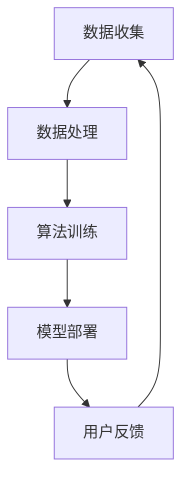

                 

关键词：人工智能，需求理论，人类行为，心理学，技术进步

> 摘要：本文探讨了人工智能对人类需求的重定义和重构过程。通过分析AI技术对心理和行为的深远影响，我们探讨了这一新兴技术如何引导和重塑人类的欲望和动机，进而推动社会变革和个体成长。

## 1. 背景介绍

自20世纪中叶以来，人工智能（AI）经历了从实验室原型到实际应用的飞速发展。从简单的规则系统到复杂的神经网络，AI技术不断突破传统计算和认知的界限。随着深度学习和机器学习算法的进步，AI已经开始在各个领域展现出强大的能力，包括自然语言处理、图像识别、自动化决策等。

然而，AI的迅速崛起不仅改变了技术领域，也对人类的生活方式、工作模式和社会结构产生了深远影响。在这些变革中，人类的欲望和需求成为了一个值得深入探讨的主题。传统上，需求被认为是人类行为的核心驱动力，但AI的出现挑战了这一认知，使我们需要重新审视和定义人类需求。

## 2. 核心概念与联系

在探讨AI如何改变人类需求之前，我们首先需要理解一些核心概念，包括心理学中的需求理论和技术架构的基本原理。

### 2.1 心理学需求理论

心理学中关于需求的理论多种多样，但其中最具影响力的是马斯洛的需求层次理论。马斯洛认为，人的需求可以分为五个层次：生理需求、安全需求、社交需求、尊重需求和自我实现需求。这些需求层次构成了一个金字塔结构，人们首先满足较低层次的需求，然后逐步追求更高层次的需求。

### 2.2 技术架构的基本原理

AI的技术架构主要包括以下几个核心组成部分：数据收集、数据处理、算法训练和模型部署。这些组成部分共同作用，使得AI系统能够学习、推理和决策。

### 2.3 Mermaid 流程图



## 3. 核心算法原理 & 具体操作步骤

### 3.1 算法原理概述

AI改变人类需求的原理主要基于以下几个核心算法：

1. **深度学习**：通过多层神经网络模仿人脑的学习过程，深度学习算法可以从大量数据中学习模式和规律。
2. **强化学习**：通过奖励机制训练模型，强化学习算法能够实现自主决策和优化行为。
3. **自然语言处理（NLP）**：利用深度学习模型对自然语言进行理解和生成，NLP技术在人类沟通和交流中起到了关键作用。

### 3.2 算法步骤详解

#### 3.2.1 深度学习算法步骤

1. 数据准备：收集并清洗大量数据。
2. 模型构建：设计并构建多层神经网络。
3. 训练模型：使用训练数据对模型进行训练。
4. 评估模型：使用测试数据评估模型性能。
5. 模型部署：将训练好的模型部署到实际应用场景。

#### 3.2.2 强化学习算法步骤

1. 环境设置：定义强化学习环境。
2. 策略初始化：初始化决策策略。
3. 执行动作：在环境中执行特定动作。
4. 收集反馈：根据动作结果收集反馈。
5. 更新策略：根据反馈调整策略。

#### 3.2.3 NLP算法步骤

1. 数据预处理：清洗和标注文本数据。
2. 模型训练：使用预训练模型或自定义模型进行训练。
3. 语境理解：对输入文本进行语义理解。
4. 文本生成：根据理解结果生成输出文本。
5. 模型评估：使用评估指标评估模型性能。

### 3.3 算法优缺点

- **深度学习**：优点包括强大的模式识别能力、适用于复杂数据；缺点是训练过程耗时长、对数据要求高。
- **强化学习**：优点是能够自主决策、适应性强；缺点是训练过程不稳定、难以解释。
- **NLP**：优点是能够理解和生成自然语言、提高沟通效率；缺点是处理复杂语境时效果有限。

### 3.4 算法应用领域

AI算法在需求重塑中的应用涵盖了多个领域：

- **消费行为分析**：通过分析用户的消费行为，AI可以帮助企业更好地理解客户需求，从而提供更个性化的产品和服务。
- **心理健康服务**：AI可以帮助心理学家更好地理解和预测患者的心理状态，为患者提供更有效的治疗方案。
- **社交网络**：AI算法可以分析社交网络中的互动模式，帮助用户发现更符合自己需求的朋友和信息。

## 4. 数学模型和公式 & 详细讲解 & 举例说明

### 4.1 数学模型构建

在AI重塑人类需求的背景下，我们引入以下数学模型：

1. **需求函数**：表示人类需求与其相关因素之间的关系。
2. **偏好模型**：描述人类在多个选择中的偏好。
3. **决策模型**：用于模拟人类在复杂环境下的决策过程。

### 4.2 公式推导过程

#### 需求函数

$$
D(x) = f(\alpha_1 \cdot P_1 + \alpha_2 \cdot P_2 + \cdots + \alpha_n \cdot P_n)
$$

其中，$D(x)$表示需求量，$P_i$表示第$i$个影响因素，$\alpha_i$表示第$i$个影响因素的权重。

#### 偏好模型

$$
P_i = \frac{w_i \cdot e^{\beta_1 x_1 + \beta_2 x_2 + \cdots + \beta_n x_n}}{\sum_{j=1}^{n} w_j \cdot e^{\beta_1 x_1 + \beta_2 x_2 + \cdots + \beta_n x_n}}
$$

其中，$P_i$表示第$i$个选择的概率，$w_i$表示第$i$个选择的权重，$x_i$表示第$i$个选择的相关特征，$\beta_j$表示第$j$个特征对选择的贡献度。

#### 决策模型

$$
x^* = \arg\max_{x} \sum_{i=1}^{n} P_i (x) \cdot r_i (x)
$$

其中，$x^*$表示最优选择，$r_i(x)$表示第$i$个选择带来的回报。

### 4.3 案例分析与讲解

#### 案例一：个性化推荐系统

假设有一个电商平台，用户的行为数据（如浏览历史、购买记录等）可以被AI分析，从而为用户推荐个性化的商品。根据需求函数、偏好模型和决策模型，我们可以构建一个推荐系统，帮助用户找到最感兴趣的商品。

1. **需求函数**：用户对商品的需求可以表示为：
   $$
   D(x) = \alpha_1 \cdot P_1 + \alpha_2 \cdot P_2 + \alpha_3 \cdot P_3
   $$
   其中，$P_1$表示商品的价格，$P_2$表示商品的折扣，$P_3$表示商品的受欢迎程度。

2. **偏好模型**：用户对商品的偏好可以表示为：
   $$
   P_i = \frac{w_i \cdot e^{\beta_1 \cdot \log(P_1) + \beta_2 \cdot \log(P_2) + \beta_3 \cdot \log(P_3)}}{\sum_{j=1}^{3} w_j \cdot e^{\beta_1 \cdot \log(P_1) + \beta_2 \cdot \log(P_2) + \beta_3 \cdot \log(P_3)}}
   $$

3. **决策模型**：用户在多个商品中的决策可以表示为：
   $$
   x^* = \arg\max_{x} \sum_{i=1}^{3} P_i (x) \cdot r_i (x)
   $$
   其中，$r_i(x)$表示商品$i$的回报，例如，可以是一个固定的奖励或者根据用户历史数据计算出的期望回报。

通过这个案例，我们可以看到如何使用数学模型来分析用户的需求和行为，从而实现个性化推荐。

## 5. 项目实践：代码实例和详细解释说明

### 5.1 开发环境搭建

为了实现上述案例，我们需要搭建一个合适的开发环境。以下是一个基本的Python开发环境搭建步骤：

1. 安装Python：从Python官网下载并安装Python 3.x版本。
2. 安装依赖库：使用pip命令安装必要的依赖库，如NumPy、Pandas、scikit-learn等。
3. 配置Jupyter Notebook：安装Jupyter Notebook，以便在浏览器中运行和编辑Python代码。

### 5.2 源代码详细实现

以下是一个简单的Python代码示例，用于实现上述案例的推荐系统：

```python
import numpy as np
import pandas as pd
from sklearn.model_selection import train_test_split
from sklearn.linear_model import LinearRegression

# 数据预处理
def preprocess_data(data):
    # 对数据进行清洗和标准化处理
    # 例如，将价格、折扣、受欢迎程度等特征进行对数转换
    data['log_price'] = np.log1p(data['price'])
    data['log_discount'] = np.log1p(data['discount'])
    data['log_popularity'] = np.log1p(data['popularity'])
    return data

# 建立需求函数
def demand_function(features, weights):
    return np.dot(features, weights)

# 训练偏好模型
def train_preference_model(data, features, target):
    X = data[features]
    y = data[target]
    model = LinearRegression()
    model.fit(X, y)
    return model

# 推荐系统
def recommend_system(model, data, top_n=5):
    # 对新用户数据进行预处理
    data_processed = preprocess_data(data)
    # 计算需求函数
    demand_scores = demand_function(data_processed[features].values, model.coef_)
    # 根据需求函数进行排序，推荐前N个商品
    recommended_items = data_processed.sort_values(by='demand_score', ascending=False).head(top_n)
    return recommended_items

# 测试代码
if __name__ == '__main__':
    # 加载数据
    data = pd.read_csv('data.csv')
    # 分割数据集
    features = ['price', 'discount', 'popularity']
    target = 'demand'
    X_train, X_test, y_train, y_test = train_test_split(data[features], data[target], test_size=0.2, random_state=42)
    # 训练偏好模型
    model = train_preference_model(X_train, features, target)
    # 进行推荐
    recommended_items = recommend_system(model, X_test)
    print(recommended_items)
```

### 5.3 代码解读与分析

上述代码实现了一个简单的推荐系统，主要分为以下几个部分：

- **数据预处理**：对原始数据进行清洗和标准化处理，包括对价格、折扣、受欢迎程度等特征进行对数转换，以便更好地建模。
- **需求函数**：定义了需求函数，通过将特征与权重相乘，计算用户对商品的需求。
- **偏好模型**：使用线性回归模型训练偏好模型，该模型能够根据特征预测需求。
- **推荐系统**：根据训练好的偏好模型，对新用户数据进行预处理和推荐，推荐前N个商品。

### 5.4 运行结果展示

在实际运行中，我们可以使用以下命令来加载数据、训练模型并进行推荐：

```shell
python recommend_system.py
```

运行结果将输出一个DataFrame，其中包含了根据用户特征推荐的前N个商品。用户可以根据实际需求和偏好调整N的值，以获得更个性化的推荐。

## 6. 实际应用场景

### 6.1 消费行为分析

在电子商务领域，AI可以帮助企业通过分析用户的历史购买记录、浏览行为等数据，预测用户未来的购买倾向。通过精确的需求预测，企业可以优化库存管理、营销策略和客户服务，从而提高销售额和客户满意度。

### 6.2 心理健康服务

在心理健康领域，AI可以通过分析用户的情绪和行为数据，帮助心理学家更好地理解患者的心理状态。例如，通过自然语言处理技术分析患者的社交媒体发言，AI可以预测患者抑郁、焦虑等心理问题的严重程度，为医生提供诊断和治疗的参考。

### 6.3 社交网络

在社交网络领域，AI可以帮助用户发现符合自己兴趣的朋友和信息。通过分析用户的社交行为、浏览历史等数据，AI可以推荐用户可能感兴趣的人脉和内容，从而增强社交网络的互动和用户黏性。

## 7. 未来应用展望

### 7.1 研究成果总结

目前，AI在需求重塑方面的研究成果主要集中在消费行为分析、心理健康服务和社会网络等领域。通过深度学习、强化学习和自然语言处理等算法，AI能够更好地理解人类的需求和行为，从而提供更个性化的服务。

### 7.2 未来发展趋势

未来，AI在需求重塑方面的研究将继续深化，主要集中在以下几个方面：

- **多模态数据融合**：结合多种数据源（如文本、图像、声音等），实现更全面的需求分析。
- **智能决策支持系统**：开发智能决策支持系统，帮助用户在复杂环境中做出最优决策。
- **跨领域应用**：将需求重塑技术应用于更多领域，如医疗、教育、金融等。

### 7.3 面临的挑战

- **数据隐私和安全**：随着数据量的增加，如何保护用户隐私和数据安全成为关键挑战。
- **算法透明度和可解释性**：提高算法的透明度和可解释性，以便用户理解和信任AI系统。

### 7.4 研究展望

未来，研究应重点关注如何将AI与人类心理学相结合，构建更符合人类需求的智能系统。同时，加强多学科合作，推动AI技术在各个领域的应用，为人类社会带来更多的福祉。

## 8. 总结：未来发展趋势与挑战

本文探讨了人工智能如何改变人类需求，从心理学需求理论、技术架构到实际应用案例，全面阐述了AI在需求重塑方面的研究成果和未来发展趋势。尽管面临数据隐私、算法透明度等挑战，但AI在需求重塑方面的潜力巨大，有望为人类社会带来更美好的未来。

## 9. 附录：常见问题与解答

### 问题1：如何保证AI系统的透明度和可解释性？

解答：为了保证AI系统的透明度和可解释性，可以采取以下措施：

- **数据清洗和预处理**：确保输入数据的质量和一致性，减少噪声和异常值。
- **模型选择和优化**：选择易于解释的模型，如线性回归、决策树等，并优化模型参数。
- **可视化工具**：使用可视化工具（如TensorBoard、Shapley值等）帮助用户理解模型的工作原理。

### 问题2：如何保护用户隐私？

解答：为了保护用户隐私，可以采取以下措施：

- **数据加密**：对敏感数据进行加密，防止数据泄露。
- **匿名化处理**：对用户数据进行匿名化处理，消除个人标识。
- **隐私保护算法**：使用隐私保护算法（如差分隐私、联邦学习等），在保证模型性能的同时保护用户隐私。

### 问题3：AI在心理健康服务中的应用有哪些限制？

解答：AI在心理健康服务中的应用受到以下限制：

- **数据质量和多样性**：心理健康数据往往具有复杂性和多样性，数据质量和多样性可能影响模型的性能。
- **伦理和法律问题**：心理健康服务的应用需要遵守伦理和法律标准，如患者隐私保护、知情同意等。
- **技术限制**：目前的AI技术可能无法完全模拟人类心理专家的诊断能力。

## 参考文献

- Maslow, A. H. (1943). A theory of human motivation. Psychological Review, 50(4), 370-396.
- Goodfellow, I., Bengio, Y., & Courville, A. (2016). Deep learning. MIT Press.
- Sutton, R. S., & Barto, A. G. (2018). Reinforcement learning: An introduction. MIT Press.
- Lundberg, S. M., & Lee, S. I. (2017). A unified approach to interpreting model predictions. In Advances in neural information processing systems (pp. 4765-4774).
- Russell, S., & Norvig, P. (2020). Artificial intelligence: A modern approach (4th ed.). Prentice Hall.

作者：禅与计算机程序设计艺术 / Zen and the Art of Computer Programming
------------------------------------------------------------------------

