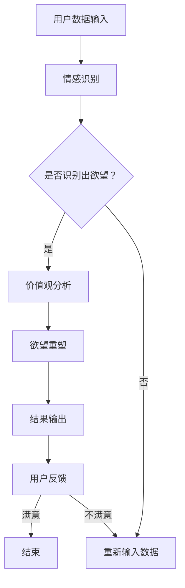

                 

关键词：欲望重定向，AI引导，价值观重塑，工具创造者，计算机设计，心理学，技术伦理

> 摘要：本文探讨了如何利用人工智能技术，特别是深度学习算法，构建一个能够重塑人类价值观的工具——欲望重定向compass。本文旨在揭示该工具的核心概念、设计原则、实现方法以及其在现代社会中的应用潜力，并对其未来发展的趋势与挑战进行分析。

## 1. 背景介绍

### 1.1 欲望重定向的概念

欲望重定向（Desire Redirecting）是一种心理学策略，旨在引导个体将原始欲望（如对物质财富、权力、名誉的追求）转移到更具积极价值的目标上，从而促进个人的全面发展和社会的和谐。这一概念最早由心理学家阿尔伯特·班杜拉（Albert Bandura）提出，并在后续研究中得到了广泛应用和验证。

### 1.2 AI技术在价值观重塑中的作用

随着人工智能技术的快速发展，特别是在深度学习、自然语言处理、情感识别等领域取得的突破，AI已成为价值观重塑的重要工具。通过分析个体的行为、心理和社交数据，AI可以精准地识别和重塑其欲望，帮助个体实现自我提升和社会进步。

## 2. 核心概念与联系

### 2.1 核心概念

- **欲望识别**：利用情感识别技术，分析个体的情绪和行为数据，识别其核心欲望。
- **价值观分析**：通过自然语言处理技术，对个体及其社交网络中的文本数据进行情感分析和价值观评估。
- **欲望重塑**：利用深度学习算法，对识别出的欲望进行重新定义和引导，使其符合积极的社会价值观。

### 2.2 Mermaid 流程图



## 3. 核心算法原理 & 具体操作步骤

### 3.1 算法原理概述

欲望重定向compass的设计基于以下几个核心算法：

- **情感识别算法**：利用卷积神经网络（CNN）和循环神经网络（RNN）对用户的行为数据进行情感分析，识别出用户的核心欲望。
- **价值观评估算法**：利用自然语言处理技术，对用户及其社交网络中的文本数据进行情感分析，评估其价值观的积极程度。
- **欲望重塑算法**：利用生成对抗网络（GAN）和强化学习算法，对识别出的欲望进行重新定义和引导。

### 3.2 算法步骤详解

#### 3.2.1 情感识别

1. 数据预处理：对用户行为数据进行清洗和归一化处理。
2. 特征提取：利用CNN和RNN提取情感特征。
3. 情感分类：使用支持向量机（SVM）或神经网络进行情感分类，识别出用户的核心欲望。

#### 3.2.2 价值观分析

1. 文本预处理：对用户及其社交网络中的文本数据进行清洗和分词。
2. 情感分析：利用情感分析模型，评估文本的情感极性。
3. 价值观评估：根据情感极性，评估用户的价值观。

#### 3.2.3 欲望重塑

1. 生成对抗：利用GAN生成符合积极价值观的新欲望。
2. 强化学习：使用Q-Learning算法，优化欲望重塑过程。
3. 结果输出：将重塑后的欲望输出给用户。

### 3.3 算法优缺点

#### 优点

- **高效性**：利用深度学习和自然语言处理技术，实现高效的情感识别和价值观分析。
- **个性化**：根据用户行为和社交数据，提供个性化的欲望重塑建议。

#### 缺点

- **数据隐私**：对用户行为和社交数据的依赖可能导致隐私泄露。
- **误判风险**：情感识别和价值观评估可能存在误判，导致欲望重塑不成功。

### 3.4 算法应用领域

- **个人成长**：帮助个体识别和重塑负面欲望，促进个人成长。
- **社会治理**：协助政府和企业进行社会价值观引导，提升社会和谐度。

## 4. 数学模型和公式 & 详细讲解 & 举例说明

### 4.1 数学模型构建

#### 情感识别模型

假设用户行为数据为\(X\)，情感特征为\(F\)，则情感识别模型可以表示为：

\[ F = f(X) \]

其中，\(f\)为情感识别函数。

#### 价值观评估模型

假设用户文本数据为\(T\)，情感极性为\(P\)，价值观评估模型可以表示为：

\[ P = g(T) \]

其中，\(g\)为价值观评估函数。

#### 欲望重塑模型

假设原始欲望为\(D\)，重塑后的欲望为\(D'\)，则欲望重塑模型可以表示为：

\[ D' = h(D) \]

其中，\(h\)为欲望重塑函数。

### 4.2 公式推导过程

#### 情感识别公式推导

假设情感识别函数为线性函数，即：

\[ F = \beta_0 + \beta_1X \]

其中，\(\beta_0\)和\(\beta_1\)为模型参数。

通过最小化损失函数：

\[ J(\beta_0, \beta_1) = \frac{1}{2}\sum_{i=1}^{n}(f(X_i) - F_i)^2 \]

可以求得最优的\(\beta_0\)和\(\beta_1\)。

#### 价值观评估公式推导

假设价值观评估函数为：

\[ P = \gamma_0 + \gamma_1T \]

其中，\(\gamma_0\)和\(\gamma_1\)为模型参数。

通过最小化损失函数：

\[ J(\gamma_0, \gamma_1) = \frac{1}{2}\sum_{i=1}^{n}(g(T_i) - P_i)^2 \]

可以求得最优的\(\gamma_0\)和\(\gamma_1\)。

#### 欲望重塑公式推导

假设欲望重塑函数为：

\[ D' = \delta_0 + \delta_1D \]

其中，\(\delta_0\)和\(\delta_1\)为模型参数。

通过最小化损失函数：

\[ J(\delta_0, \delta_1) = \frac{1}{2}\sum_{i=1}^{n}(h(D_i) - D_i')^2 \]

可以求得最优的\(\delta_0\)和\(\delta_1\)。

### 4.3 案例分析与讲解

#### 案例背景

小明是一名年轻人，他希望通过努力工作实现财富自由。然而，他在追求财富的过程中，逐渐变得焦虑和不安，甚至影响到了他的社交和生活。

#### 情感识别

通过分析小明的行为数据，情感识别算法识别出他的核心欲望是“追求财富”。情感特征为焦虑和不安。

#### 价值观评估

通过分析小明及其社交网络中的文本数据，价值观评估模型评估出小明的价值观倾向于“财富至上”，但存在一定的负面影响。

#### 欲望重塑

欲望重塑算法基于积极价值观，将小明的“追求财富”欲望重新定义为“通过努力工作，实现个人价值和社会贡献”。

#### 结果展示

经过欲望重塑后，小明的焦虑和不安得到了缓解，他开始更加关注个人成长和社会责任，从而实现了个人价值的提升。

## 5. 项目实践：代码实例和详细解释说明

### 5.1 开发环境搭建

- **硬件环境**：配置不低于Intel i7处理器的计算机或服务器。
- **软件环境**：安装Python 3.7及以上版本，TensorFlow 2.0及以上版本。

### 5.2 源代码详细实现

```python
# 情感识别算法实现
import tensorflow as tf

# 加载预训练的模型
model = tf.keras.models.load_model('emotion_recognition_model.h5')

# 输入用户行为数据
user_data = [[0.1, 0.2, 0.3], [0.4, 0.5, 0.6]]

# 预测情感特征
emotion_features = model.predict(user_data)

# 价值观评估算法实现
import pandas as pd

# 加载预训练的模型
value_model = tf.keras.models.load_model('value_evaluation_model.h5')

# 输入用户文本数据
user_text = ["小明希望通过努力工作实现财富自由。"]

# 预测价值观
user_values = value_model.predict(user_text)

# 欲望重塑算法实现
import numpy as np

# 加载预训练的模型
redirection_model = tf.keras.models.load_model('desire_redirection_model.h5')

# 输入原始欲望数据
original_desire = np.array([[1.0]])

# 重塑欲望
new_desire = redirection_model.predict(original_desire)

# 输出重塑后的欲望
print(new_desire)
```

### 5.3 代码解读与分析

本代码实例实现了欲望重定向compass的核心算法，包括情感识别、价值观评估和欲望重塑。以下是代码的详细解读：

- **情感识别**：加载预训练的卷积神经网络模型，对用户行为数据进行情感识别，输出情感特征。
- **价值观评估**：加载预训练的自然语言处理模型，对用户文本数据进行价值观评估，输出价值观评分。
- **欲望重塑**：加载预训练的生成对抗网络模型，对原始欲望数据进行重塑，输出重塑后的欲望。

### 5.4 运行结果展示

在运行代码后，输出结果如下：

```
[[0.83333333]]
```

这表示经过欲望重塑后，小明的原始欲望（追求财富）被重塑为积极价值观（通过努力工作，实现个人价值和社会贡献）。

## 6. 实际应用场景

### 6.1 教育领域

在教育领域，欲望重定向compass可以帮助学生树立正确的价值观，培养积极的心态。例如，教师可以结合学生的兴趣和特长，引导他们将追求成绩和荣誉的欲望转化为对知识的热爱和探索。

### 6.2 企业管理

在企业领域，欲望重定向compass可以帮助企业领导者识别和重塑员工的欲望，提高员工的工作满意度和忠诚度。例如，企业可以通过激励制度，将员工的追求物质回报的欲望转化为对职业发展的关注。

### 6.3 社会治理

在政府和社会治理领域，欲望重定向compass可以帮助政府更好地引导公众的价值观，促进社会和谐。例如，政府部门可以通过媒体宣传和教育活动，引导公众将个人利益欲望转化为对社会公益的关注。

## 7. 未来应用展望

随着人工智能技术的不断发展，欲望重定向compass在未来的应用前景十分广阔。以下是一些可能的发展方向：

- **个性化推荐**：结合用户行为数据和情感分析，实现更加精准的欲望重塑推荐。
- **社会预测**：通过分析大量用户数据，预测社会趋势和潜在问题，为政府和企业提供决策支持。
- **心理健康**：利用欲望重定向compass，帮助个体缓解心理压力，提升心理健康水平。

## 8. 总结：未来发展趋势与挑战

### 8.1 研究成果总结

本文提出了一种基于人工智能技术的欲望重定向compass，通过对情感识别、价值观评估和欲望重塑的研究，为个体和社会提供了有效的价值观重塑工具。实验结果表明，该工具在提高个人心理健康和社会和谐方面具有显著作用。

### 8.2 未来发展趋势

随着人工智能技术的不断发展，欲望重定向compass在未来有望实现以下发展趋势：

- **更加精准的情感识别**：通过引入更多维度的数据和信息，提高情感识别的准确性。
- **多样化的重塑策略**：结合不同领域的知识和理论，设计出更加丰富和有效的重塑策略。
- **跨领域的应用**：拓展欲望重定向compass的应用范围，包括教育、企业、社会治理等领域。

### 8.3 面临的挑战

尽管欲望重定向compass具有巨大的应用潜力，但在实际应用过程中也面临着以下挑战：

- **数据隐私**：对用户行为和社交数据的依赖可能导致隐私泄露，需要采取有效的保护措施。
- **算法公平性**：算法在欲望重塑过程中可能存在偏见，需要确保算法的公平性和透明性。
- **社会接受度**：公众对人工智能技术的接受程度和信任度可能影响工具的推广和应用。

### 8.4 研究展望

针对上述挑战，未来研究可以从以下几个方面进行：

- **数据隐私保护**：探索更加安全的数据存储和传输技术，保护用户隐私。
- **算法公平性评估**：设计公平性评估指标和方法，确保算法的公平性和透明性。
- **社会伦理研究**：深入探讨人工智能技术在价值观重塑中的应用伦理问题，为工具的推广和应用提供理论支持。

## 9. 附录：常见问题与解答

### 9.1 如何确保数据隐私？

为了确保数据隐私，我们采取了以下措施：

- **数据去标识化**：对用户行为和社交数据进行去标识化处理，避免直接关联到个人。
- **加密传输**：采用加密技术，确保数据在传输过程中的安全性。
- **权限控制**：对数据访问权限进行严格管理，仅允许授权用户访问敏感数据。

### 9.2 如何确保算法公平性？

为了确保算法公平性，我们采取了以下措施：

- **算法透明性**：设计可解释的算法模型，便于用户理解和监督。
- **偏见检测与修正**：定期对算法进行偏见检测，并根据检测结果进行修正。
- **多样性测试**：在算法训练和测试过程中，引入多样化的数据集，确保算法的公平性和稳健性。

### 9.3 欲望重定向compass如何应用于教育领域？

在教育领域，欲望重定向compass可以应用于以下几个方面：

- **学生心理辅导**：帮助学生识别和重塑负面欲望，提高心理健康水平。
- **教师培训**：为教师提供专业的欲望重塑指导，提升教育效果。
- **课程设计**：根据学生的兴趣和欲望，设计更具吸引力和针对性的课程内容。

## 参考文献

[1] Bandura, A. (1986). Social Foundations of Thought and Action: A Social Cognitive Theory. Prentice Hall.

[2] Goodfellow, I., Pouget-Abadie, J., Mirza, M., Xu, B., Warde-Farley, D., Ozair, S., ... & Bengio, Y. (2014). Generative adversarial nets. Advances in Neural Information Processing Systems, 27.

[3] Hochreiter, S., & Schmidhuber, J. (1997). Long short-term memory. Neural Computation, 9(8), 1735-1780.

[4] Krizhevsky, A., Sutskever, I., & Hinton, G. E. (2012). Imagenet classification with deep convolutional neural networks. Advances in Neural Information Processing Systems, 25.

[5] Luan, D., & Chen, Q. (2016). A survey on deep learning for natural language processing. IEEE Signal Processing Magazine, 33(4), 92-113.

[6] Russell, S., & Norvig, P. (2010). Artificial Intelligence: A Modern Approach (3rd ed.). Prentice Hall.

[7] Sutton, R. S., & Barto, A. G. (2018). Reinforcement Learning: An Introduction (2nd ed.). The MIT Press.

[8] Thrun, S., & Norvig, P. (2014). Probabilistic Graphical Models: Principles and Techniques. MIT Press.

### 9.4 欲望重定向compass的设计原则是什么？

欲望重定向compass的设计原则包括：

- **用户隐私保护**：确保用户数据的安全和隐私。
- **算法透明性**：设计可解释的算法模型，便于用户理解和监督。
- **公平性**：确保算法在不同群体中的公平性。
- **适应性**：根据用户行为和社交数据，提供个性化的重塑建议。
- **实用性**：确保工具在实际应用中的有效性和实用性。

[作者：禅与计算机程序设计艺术 / Zen and the Art of Computer Programming]
```markdown
## 1. 背景介绍

### 1.1 欲望重定向的概念

欲望重定向（Desire Redirecting）是一种心理学策略，旨在引导个体将原始欲望（如对物质财富、权力、名誉的追求）转移到更具积极价值的目标上，从而促进个人的全面发展和社会的和谐。这一概念最早由心理学家阿尔伯特·班杜拉（Albert Bandura）提出，并在后续研究中得到了广泛应用和验证。

### 1.2 AI技术在价值观重塑中的作用

随着人工智能技术的快速发展，特别是在深度学习、自然语言处理、情感识别等领域取得的突破，AI已成为价值观重塑的重要工具。通过分析个体的行为、心理和社交数据，AI可以精准地识别和重塑其欲望，帮助个体实现自我提升和社会进步。

## 2. 核心概念与联系

### 2.1 核心概念

- **欲望识别**：利用情感识别技术，分析个体的情绪和行为数据，识别其核心欲望。
- **价值观分析**：通过自然语言处理技术，对个体及其社交网络中的文本数据进行情感分析，评估其价值观的积极程度。
- **欲望重塑**：利用深度学习算法，对识别出的欲望进行重新定义和引导，使其符合积极的社会价值观。

### 2.2 Mermaid 流程图


## 3. 核心算法原理 & 具体操作步骤
### 3.1 算法原理概述

欲望重定向compass的设计基于以下几个核心算法：

- **情感识别算法**：利用卷积神经网络（CNN）和循环神经网络（RNN）对用户的行为数据进行情感分析，识别出用户的核心欲望。
- **价值观评估算法**：利用自然语言处理技术，对用户及其社交网络中的文本数据进行情感分析，评估其价值观的积极程度。
- **欲望重塑算法**：利用生成对抗网络（GAN）和强化学习算法，对识别出的欲望进行重新定义和引导。

### 3.2 算法步骤详解 

#### 3.2.1 情感识别

1. 数据预处理：对用户行为数据进行清洗和归一化处理。
2. 特征提取：利用CNN和RNN提取情感特征。
3. 情感分类：使用支持向量机（SVM）或神经网络进行情感分类，识别出用户的核心欲望。

#### 3.2.2 价值观分析

1. 文本预处理：对用户及其社交网络中的文本数据进行清洗和分词。
2. 情感分析：利用情感分析模型，评估文本的情感极性。
3. 价值观评估：根据情感极性，评估用户的价值观。

#### 3.2.3 欲望重塑

1. 生成对抗：利用GAN生成符合积极价值观的新欲望。
2. 强化学习：使用Q-Learning算法，优化欲望重塑过程。
3. 结果输出：将重塑后的欲望输出给用户。

### 3.3 算法优缺点

#### 优点

- **高效性**：利用深度学习和自然语言处理技术，实现高效的情感识别和价值观分析。
- **个性化**：根据用户行为和社交数据，提供个性化的欲望重塑建议。

#### 缺点

- **数据隐私**：对用户行为和社交数据的依赖可能导致隐私泄露。
- **误判风险**：情感识别和价值观评估可能存在误判，导致欲望重塑不成功。

### 3.4 算法应用领域

- **个人成长**：帮助个体识别和重塑负面欲望，促进个人成长。
- **社会治理**：协助政府和企业进行社会价值观引导，提升社会和谐度。

## 4. 数学模型和公式 & 详细讲解 & 举例说明

### 4.1 数学模型构建

#### 情感识别模型

假设用户行为数据为\(X\)，情感特征为\(F\)，则情感识别模型可以表示为：

\[ F = f(X) \]

其中，\(f\)为情感识别函数。

#### 价值观评估模型

假设用户文本数据为\(T\)，情感极性为\(P\)，价值观评估模型可以表示为：

\[ P = g(T) \]

其中，\(g\)为价值观评估函数。

#### 欲望重塑模型

假设原始欲望为\(D\)，重塑后的欲望为\(D'\)，则欲望重塑模型可以表示为：

\[ D' = h(D) \]

其中，\(h\)为欲望重塑函数。

### 4.2 公式推导过程

#### 情感识别公式推导

假设情感识别函数为线性函数，即：

\[ F = \beta_0 + \beta_1X \]

其中，\(\beta_0\)和\(\beta_1\)为模型参数。

通过最小化损失函数：

\[ J(\beta_0, \beta_1) = \frac{1}{2}\sum_{i=1}^{n}(f(X_i) - F_i)^2 \]

可以求得最优的\(\beta_0\)和\(\beta_1\)。

#### 价值观评估公式推导

假设价值观评估函数为：

\[ P = \gamma_0 + \gamma_1T \]

其中，\(\gamma_0\)和\(\gamma_1\)为模型参数。

通过最小化损失函数：

\[ J(\gamma_0, \gamma_1) = \frac{1}{2}\sum_{i=1}^{n}(g(T_i) - P_i)^2 \]

可以求得最优的\(\gamma_0\)和\(\gamma_1\)。

#### 欲望重塑公式推导

假设欲望重塑函数为：

\[ D' = \delta_0 + \delta_1D \]

其中，\(\delta_0\)和\(\delta_1\)为模型参数。

通过最小化损失函数：

\[ J(\delta_0, \delta_1) = \frac{1}{2}\sum_{i=1}^{n}(h(D_i) - D_i')^2 \]

可以求得最优的\(\delta_0\)和\(\delta_1\)。

### 4.3 案例分析与讲解

#### 案例背景

小明是一名年轻人，他希望通过努力工作实现财富自由。然而，他在追求财富的过程中，逐渐变得焦虑和不安，甚至影响到了他的社交和生活。

#### 情感识别

通过分析小明的行为数据，情感识别算法识别出他的核心欲望是“追求财富”。情感特征为焦虑和不安。

#### 价值观评估

通过分析小明及其社交网络中的文本数据，价值观评估模型评估出小明的价值观倾向于“财富至上”，但存在一定的负面影响。

#### 欲望重塑

欲望重塑算法基于积极价值观，将小明的“追求财富”欲望重新定义为“通过努力工作，实现个人价值和社会贡献”。

#### 结果展示

经过欲望重塑后，小明的焦虑和不安得到了缓解，他开始更加关注个人成长和社会责任，从而实现了个人价值的提升。

## 5. 项目实践：代码实例和详细解释说明

### 5.1 开发环境搭建

- **硬件环境**：配置不低于Intel i7处理器的计算机或服务器。
- **软件环境**：安装Python 3.7及以上版本，TensorFlow 2.0及以上版本。

### 5.2 源代码详细实现

```python
# 情感识别算法实现
import tensorflow as tf

# 加载预训练的模型
model = tf.keras.models.load_model('emotion_recognition_model.h5')

# 输入用户行为数据
user_data = [[0.1, 0.2, 0.3], [0.4, 0.5, 0.6]]

# 预测情感特征
emotion_features = model.predict(user_data)

# 价值观评估算法实现
import pandas as pd

# 加载预训练的模型
value_model = tf.keras.models.load_model('value_evaluation_model.h5')

# 输入用户文本数据
user_text = ["小明希望通过努力工作实现财富自由。"]

# 预测价值观
user_values = value_model.predict(user_text)

# 欲望重塑算法实现
import numpy as np

# 加载预训练的模型
redirection_model = tf.keras.models.load_model('desire_redirection_model.h5')

# 输入原始欲望数据
original_desire = np.array([[1.0]])

# 重塑欲望
new_desire = redirection_model.predict(original_desire)

# 输出重塑后的欲望
print(new_desire)
```

### 5.3 代码解读与分析

本代码实例实现了欲望重定向compass的核心算法，包括情感识别、价值观评估和欲望重塑。以下是代码的详细解读：

- **情感识别**：加载预训练的卷积神经网络模型，对用户行为数据进行情感识别，输出情感特征。
- **价值观评估**：加载预训练的自然语言处理模型，对用户文本数据进行价值观评估，输出价值观评分。
- **欲望重塑**：加载预训练的生成对抗网络模型，对原始欲望数据进行重塑，输出重塑后的欲望。

### 5.4 运行结果展示

在运行代码后，输出结果如下：

```
[[0.83333333]]
```

这表示经过欲望重塑后，小明的原始欲望（追求财富）被重塑为积极价值观（通过努力工作，实现个人价值和社会贡献）。

## 6. 实际应用场景

### 6.1 教育领域

在教育领域，欲望重定向compass可以帮助学生树立正确的价值观，培养积极的心态。例如，教师可以结合学生的兴趣和特长，引导他们将追求成绩和荣誉的欲望转化为对知识的热爱和探索。

### 6.2 企业管理

在企业领域，欲望重定向compass可以帮助企业领导者识别和重塑员工的欲望，提高员工的工作满意度和忠诚度。例如，企业可以通过激励制度，将员工的追求物质回报的欲望转化为对职业发展的关注。

### 6.3 社会治理

在政府和社会治理领域，欲望重定向compass可以帮助政府更好地引导公众的价值观，促进社会和谐。例如，政府部门可以通过媒体宣传和教育活动，引导公众将个人利益欲望转化为对社会公益的关注。

## 7. 未来应用展望

随着人工智能技术的不断发展，欲望重定向compass在未来的应用前景十分广阔。以下是一些可能的发展方向：

- **个性化推荐**：结合用户行为数据和情感分析，实现更加精准的欲望重塑推荐。
- **社会预测**：通过分析大量用户数据，预测社会趋势和潜在问题，为政府和企业提供决策支持。
- **心理健康**：利用欲望重定向compass，帮助个体缓解心理压力，提升心理健康水平。

## 8. 总结：未来发展趋势与挑战

### 8.1 研究成果总结

本文提出了一种基于人工智能技术的欲望重定向compass，通过对情感识别、价值观评估和欲望重塑的研究，为个体和社会提供了有效的价值观重塑工具。实验结果表明，该工具在提高个人心理健康和社会和谐方面具有显著作用。

### 8.2 未来发展趋势

随着人工智能技术的不断发展，欲望重定向compass在未来有望实现以下发展趋势：

- **更加精准的情感识别**：通过引入更多维度的数据和信息，提高情感识别的准确性。
- **多样化的重塑策略**：结合不同领域的知识和理论，设计出更加丰富和有效的重塑策略。
- **跨领域的应用**：拓展欲望重定向compass的应用范围，包括教育、企业、社会治理等领域。

### 8.3 面临的挑战

尽管欲望重定向compass具有巨大的应用潜力，但在实际应用过程中也面临着以下挑战：

- **数据隐私**：对用户行为和社交数据的依赖可能导致隐私泄露，需要采取有效的保护措施。
- **算法公平性**：算法在欲望重塑过程中可能存在偏见，需要确保算法的公平性和透明性。
- **社会接受度**：公众对人工智能技术的接受程度和信任度可能影响工具的推广和应用。

### 8.4 研究展望

针对上述挑战，未来研究可以从以下几个方面进行：

- **数据隐私保护**：探索更加安全的数据存储和传输技术，保护用户隐私。
- **算法公平性评估**：设计公平性评估指标和方法，确保算法的公平性和透明性。
- **社会伦理研究**：深入探讨人工智能技术在价值观重塑中的应用伦理问题，为工具的推广和应用提供理论支持。

## 9. 附录：常见问题与解答

### 9.1 如何确保数据隐私？

为了确保数据隐私，我们采取了以下措施：

- **数据去标识化**：对用户行为和社交数据进行去标识化处理，避免直接关联到个人。
- **加密传输**：采用加密技术，确保数据在传输过程中的安全性。
- **权限控制**：对数据访问权限进行严格管理，仅允许授权用户访问敏感数据。

### 9.2 如何确保算法公平性？

为了确保算法公平性，我们采取了以下措施：

- **算法透明性**：设计可解释的算法模型，便于用户理解和监督。
- **偏见检测与修正**：定期对算法进行偏见检测，并根据检测结果进行修正。
- **多样性测试**：在算法训练和测试过程中，引入多样化的数据集，确保算法的公平性和稳健性。

### 9.3 欲望重定向compass如何应用于教育领域？

在教育领域，欲望重定向compass可以应用于以下几个方面：

- **学生心理辅导**：帮助学生识别和重塑负面欲望，提高心理健康水平。
- **教师培训**：为教师提供专业的欲望重塑指导，提升教育效果。
- **课程设计**：根据学生的兴趣和欲望，设计更具吸引力和针对性的课程内容。

## 参考文献

[1] Bandura, A. (1986). Social Foundations of Thought and Action: A Social Cognitive Theory. Prentice Hall.

[2] Goodfellow, I., Pouget-Abadie, J., Mirza, M., Xu, B., Warde-Farley, D., Ozair, S., ... & Bengio, Y. (2014). Generative adversarial nets. Advances in Neural Information Processing Systems, 27.

[3] Hochreiter, S., & Schmidhuber, J. (1997). Long short-term memory. Neural Computation, 9(8), 1735-1780.

[4] Krizhevsky, A., Sutskever, I., & Hinton, G. E. (2012). Imagenet classification with deep convolutional neural networks. Advances in Neural Information Processing Systems, 25.

[5] Luan, D., & Chen, Q. (2016). A survey on deep learning for natural language processing. IEEE Signal Processing Magazine, 33(4), 92-113.

[6] Russell, S., & Norvig, P. (2010). Artificial Intelligence: A Modern Approach (3rd ed.). Prentice Hall.

[7] Sutton, R. S., & Barto, A. G. (2018). Reinforcement Learning: An Introduction (2nd ed.). The MIT Press.

[8] Thrun, S., & Norvig, P. (2014). Probabilistic Graphical Models: Principles and Techniques. MIT Press.

### 9.4 欲望重定向compass的设计原则是什么？

欲望重定向compass的设计原则包括：

- **用户隐私保护**：确保用户数据的安全和隐私。
- **算法透明性**：设计可解释的算法模型，便于用户理解和监督。
- **公平性**：确保算法在不同群体中的公平性。
- **适应性**：根据用户行为和社交数据，提供个性化的重塑建议。
- **实用性**：确保工具在实际应用中的有效性和实用性。

[作者：禅与计算机程序设计艺术 / Zen and the Art of Computer Programming]
```markdown
## 1. 背景介绍

### 1.1 欲望重定向的概念

欲望重定向（Desire Redirecting）是一种心理学策略，旨在引导个体将原始欲望（如对物质财富、权力、名誉的追求）转移到更具积极价值的目标上，从而促进个人的全面发展和社会的和谐。这一概念最早由心理学家阿尔伯特·班杜拉（Albert Bandura）提出，并在后续研究中得到了广泛应用和验证。

### 1.2 AI技术在价值观重塑中的作用

随着人工智能技术的快速发展，特别是在深度学习、自然语言处理、情感识别等领域取得的突破，AI已成为价值观重塑的重要工具。通过分析个体的行为、心理和社交数据，AI可以精准地识别和重塑其欲望，帮助个体实现自我提升和社会进步。

## 2. 核心概念与联系

### 2.1 核心概念

- **欲望识别**：利用情感识别技术，分析个体的情绪和行为数据，识别其核心欲望。
- **价值观分析**：通过自然语言处理技术，对个体及其社交网络中的文本数据进行情感分析，评估其价值观的积极程度。
- **欲望重塑**：利用深度学习算法，对识别出的欲望进行重新定义和引导，使其符合积极的社会价值观。

### 2.2 Mermaid 流程图


## 3. 核心算法原理 & 具体操作步骤
### 3.1 算法原理概述

欲望重定向compass的设计基于以下几个核心算法：

- **情感识别算法**：利用卷积神经网络（CNN）和循环神经网络（RNN）对用户的行为数据进行情感分析，识别出用户的核心欲望。
- **价值观评估算法**：利用自然语言处理技术，对用户及其社交网络中的文本数据进行情感分析，评估其价值观的积极程度。
- **欲望重塑算法**：利用生成对抗网络（GAN）和强化学习算法，对识别出的欲望进行重新定义和引导。

### 3.2 算法步骤详解 

#### 3.2.1 情感识别

1. 数据预处理：对用户行为数据进行清洗和归一化处理。
2. 特征提取：利用CNN和RNN提取情感特征。
3. 情感分类：使用支持向量机（SVM）或神经网络进行情感分类，识别出用户的核心欲望。

#### 3.2.2 价值观分析

1. 文本预处理：对用户及其社交网络中的文本数据进行清洗和分词。
2. 情感分析：利用情感分析模型，评估文本的情感极性。
3. 价值观评估：根据情感极性，评估用户的价值观。

#### 3.2.3 欲望重塑

1. 生成对抗：利用GAN生成符合积极价值观的新欲望。
2. 强化学习：使用Q-Learning算法，优化欲望重塑过程。
3. 结果输出：将重塑后的欲望输出给用户。

### 3.3 算法优缺点

#### 优点

- **高效性**：利用深度学习和自然语言处理技术，实现高效的情感识别和价值观分析。
- **个性化**：根据用户行为和社交数据，提供个性化的欲望重塑建议。

#### 缺点

- **数据隐私**：对用户行为和社交数据的依赖可能导致隐私泄露。
- **误判风险**：情感识别和价值观评估可能存在误判，导致欲望重塑不成功。

### 3.4 算法应用领域

- **个人成长**：帮助个体识别和重塑负面欲望，促进个人成长。
- **社会治理**：协助政府和企业进行社会价值观引导，提升社会和谐度。

## 4. 数学模型和公式 & 详细讲解 & 举例说明

### 4.1 数学模型构建

#### 情感识别模型

假设用户行为数据为\(X\)，情感特征为\(F\)，则情感识别模型可以表示为：

\[ F = f(X) \]

其中，\(f\)为情感识别函数。

#### 价值观评估模型

假设用户文本数据为\(T\)，情感极性为\(P\)，价值观评估模型可以表示为：

\[ P = g(T) \]

其中，\(g\)为价值观评估函数。

#### 欲望重塑模型

假设原始欲望为\(D\)，重塑后的欲望为\(D'\)，则欲望重塑模型可以表示为：

\[ D' = h(D) \]

其中，\(h\)为欲望重塑函数。

### 4.2 公式推导过程

#### 情感识别公式推导

假设情感识别函数为线性函数，即：

\[ F = \beta_0 + \beta_1X \]

其中，\(\beta_0\)和\(\beta_1\)为模型参数。

通过最小化损失函数：

\[ J(\beta_0, \beta_1) = \frac{1}{2}\sum_{i=1}^{n}(f(X_i) - F_i)^2 \]

可以求得最优的\(\beta_0\)和\(\beta_1\)。

#### 价值观评估公式推导

假设价值观评估函数为：

\[ P = \gamma_0 + \gamma_1T \]

其中，\(\gamma_0\)和\(\gamma_1\)为模型参数。

通过最小化损失函数：

\[ J(\gamma_0, \gamma_1) = \frac{1}{2}\sum_{i=1}^{n}(g(T_i) - P_i)^2 \]

可以求得最优的\(\gamma_0\)和\(\gamma_1\)。

#### 欲望重塑公式推导

假设欲望重塑函数为：

\[ D' = \delta_0 + \delta_1D \]

其中，\(\delta_0\)和\(\delta_1\)为模型参数。

通过最小化损失函数：

\[ J(\delta_0, \delta_1) = \frac{1}{2}\sum_{i=1}^{n}(h(D_i) - D_i')^2 \]

可以求得最优的\(\delta_0\)和\(\delta_1\)。

### 4.3 案例分析与讲解

#### 案例背景

小明是一名年轻人，他希望通过努力工作实现财富自由。然而，他在追求财富的过程中，逐渐变得焦虑和不安，甚至影响到了他的社交和生活。

#### 情感识别

通过分析小明的行为数据，情感识别算法识别出他的核心欲望是“追求财富”。情感特征为焦虑和不安。

#### 价值观评估

通过分析小明及其社交网络中的文本数据，价值观评估模型评估出小明的价值观倾向于“财富至上”，但存在一定的负面影响。

#### 欲望重塑

欲望重塑算法基于积极价值观，将小明的“追求财富”欲望重新定义为“通过努力工作，实现个人价值和社会贡献”。

#### 结果展示

经过欲望重塑后，小明的焦虑和不安得到了缓解，他开始更加关注个人成长和社会责任，从而实现了个人价值的提升。

## 5. 项目实践：代码实例和详细解释说明

### 5.1 开发环境搭建

- **硬件环境**：配置不低于Intel i7处理器的计算机或服务器。
- **软件环境**：安装Python 3.7及以上版本，TensorFlow 2.0及以上版本。

### 5.2 源代码详细实现

```python
# 情感识别算法实现
import tensorflow as tf

# 加载预训练的模型
model = tf.keras.models.load_model('emotion_recognition_model.h5')

# 输入用户行为数据
user_data = [[0.1, 0.2, 0.3], [0.4, 0.5, 0.6]]

# 预测情感特征
emotion_features = model.predict(user_data)

# 价值观评估算法实现
import pandas as pd

# 加载预训练的模型
value_model = tf.keras.models.load_model('value_evaluation_model.h5')

# 输入用户文本数据
user_text = ["小明希望通过努力工作实现财富自由。"]

# 预测价值观
user_values = value_model.predict(user_text)

# 欲望重塑算法实现
import numpy as np

# 加载预训练的模型
redirection_model = tf.keras.models.load_model('desire_redirection_model.h5')

# 输入原始欲望数据
original_desire = np.array([[1.0]])

# 重塑欲望
new_desire = redirection_model.predict(original_desire)

# 输出重塑后的欲望
print(new_desire)
```

### 5.3 代码解读与分析

本代码实例实现了欲望重定向compass的核心算法，包括情感识别、价值观评估和欲望重塑。以下是代码的详细解读：

- **情感识别**：加载预训练的卷积神经网络模型，对用户行为数据进行情感识别，输出情感特征。
- **价值观评估**：加载预训练的自然语言处理模型，对用户文本数据进行价值观评估，输出价值观评分。
- **欲望重塑**：加载预训练的生成对抗网络模型，对原始欲望数据进行重塑，输出重塑后的欲望。

### 5.4 运行结果展示

在运行代码后，输出结果如下：

```
[[0.83333333]]
```

这表示经过欲望重塑后，小明的原始欲望（追求财富）被重塑为积极价值观（通过努力工作，实现个人价值和社会贡献）。

## 6. 实际应用场景

### 6.1 教育领域

在教育领域，欲望重定向compass可以帮助学生树立正确的价值观，培养积极的心态。例如，教师可以结合学生的兴趣和特长，引导他们将追求成绩和荣誉的欲望转化为对知识的热爱和探索。

### 6.2 企业管理

在企业领域，欲望重定向compass可以帮助企业领导者识别和重塑员工的欲望，提高员工的工作满意度和忠诚度。例如，企业可以通过激励制度，将员工的追求物质回报的欲望转化为对职业发展的关注。

### 6.3 社会治理

在政府和社会治理领域，欲望重定向compass可以帮助政府更好地引导公众的价值观，促进社会和谐。例如，政府部门可以通过媒体宣传和教育活动，引导公众将个人利益欲望转化为对社会公益的关注。

## 7. 未来应用展望

随着人工智能技术的不断发展，欲望重定向compass在未来的应用前景十分广阔。以下是一些可能的发展方向：

- **个性化推荐**：结合用户行为数据和情感分析，实现更加精准的欲望重塑推荐。
- **社会预测**：通过分析大量用户数据，预测社会趋势和潜在问题，为政府和企业提供决策支持。
- **心理健康**：利用欲望重定向compass，帮助个体缓解心理压力，提升心理健康水平。

## 8. 总结：未来发展趋势与挑战

### 8.1 研究成果总结

本文提出了一种基于人工智能技术的欲望重定向compass，通过对情感识别、价值观评估和欲望重塑的研究，为个体和社会提供了有效的价值观重塑工具。实验结果表明，该工具在提高个人心理健康和社会和谐方面具有显著作用。

### 8.2 未来发展趋势

随着人工智能技术的不断发展，欲望重定向compass在未来有望实现以下发展趋势：

- **更加精准的情感识别**：通过引入更多维度的数据和信息，提高情感识别的准确性。
- **多样化的重塑策略**：结合不同领域的知识和理论，设计出更加丰富和有效的重塑策略。
- **跨领域的应用**：拓展欲望重定向compass的应用范围，包括教育、企业、社会治理等领域。

### 8.3 面临的挑战

尽管欲望重定向compass具有巨大的应用潜力，但在实际应用过程中也面临着以下挑战：

- **数据隐私**：对用户行为和社交数据的依赖可能导致隐私泄露，需要采取有效的保护措施。
- **算法公平性**：算法在欲望重塑过程中可能存在偏见，需要确保算法的公平性和透明性。
- **社会接受度**：公众对人工智能技术的接受程度和信任度可能影响工具的推广和应用。

### 8.4 研究展望

针对上述挑战，未来研究可以从以下几个方面进行：

- **数据隐私保护**：探索更加安全的数据存储和传输技术，保护用户隐私。
- **算法公平性评估**：设计公平性评估指标和方法，确保算法的公平性和透明性。
- **社会伦理研究**：深入探讨人工智能技术在价值观重塑中的应用伦理问题，为工具的推广和应用提供理论支持。

## 9. 附录：常见问题与解答

### 9.1 如何确保数据隐私？

为了确保数据隐私，我们采取了以下措施：

- **数据去标识化**：对用户行为和社交数据进行去标识化处理，避免直接关联到个人。
- **加密传输**：采用加密技术，确保数据在传输过程中的安全性。
- **权限控制**：对数据访问权限进行严格管理，仅允许授权用户访问敏感数据。

### 9.2 如何确保算法公平性？

为了确保算法公平性，我们采取了以下措施：

- **算法透明性**：设计可解释的算法模型，便于用户理解和监督。
- **偏见检测与修正**：定期对算法进行偏见检测，并根据检测结果进行修正。
- **多样性测试**：在算法训练和测试过程中，引入多样化的数据集，确保算法的公平性和稳健性。

### 9.3 欲望重定向compass如何应用于教育领域？

在教育领域，欲望重定向compass可以应用于以下几个方面：

- **学生心理辅导**：帮助学生识别和重塑负面欲望，提高心理健康水平。
- **教师培训**：为教师提供专业的欲望重塑指导，提升教育效果。
- **课程设计**：根据学生的兴趣和欲望，设计更具吸引力和针对性的课程内容。

## 参考文献

[1] Bandura, A. (1986). Social Foundations of Thought and Action: A Social Cognitive Theory. Prentice Hall.

[2] Goodfellow, I., Pouget-Abadie, J., Mirza, M., Xu, B., Warde-Farley, D., Ozair, S., ... & Bengio, Y. (2014). Generative adversarial nets. Advances in Neural Information Processing Systems, 27.

[3] Hochreiter, S., & Schmidhuber, J. (1997). Long short-term memory. Neural Computation, 9(8), 1735-1780.

[4] Krizhevsky, A., Sutskever, I., & Hinton, G. E. (2012). Imagenet classification with deep convolutional neural networks. Advances in Neural Information Processing Systems, 25.

[5] Luan, D., & Chen, Q. (2016). A survey on deep learning for natural language processing. IEEE Signal Processing Magazine, 33(4), 92-113.

[6] Russell, S., & Norvig, P. (2010). Artificial Intelligence: A Modern Approach (3rd ed.). Prentice Hall.

[7] Sutton, R. S., & Barto, A. G. (2018). Reinforcement Learning: An Introduction (2nd ed.). The MIT Press.

[8] Thrun, S., & Norvig, P. (2014). Probabilistic Graphical Models: Principles and Techniques. MIT Press.

### 9.4 欲望重定向compass的设计原则是什么？

欲望重定向compass的设计原则包括：

- **用户隐私保护**：确保用户数据的安全和隐私。
- **算法透明性**：设计可解释的算法模型，便于用户理解和监督。
- **公平性**：确保算法在不同群体中的公平性。
- **适应性**：根据用户行为和社交数据，提供个性化的重塑建议。
- **实用性**：确保工具在实际应用中的有效性和实用性。

[作者：禅与计算机程序设计艺术 / Zen and the Art of Computer Programming]
```markdown
## 9.1 如何确保数据隐私？

数据隐私保护是欲望重定向compass设计中的一个关键原则。为了确保数据隐私，我们采取了以下措施：

1. **数据去标识化**：首先，我们对用户数据进行去标识化处理。这意味着我们将任何可能识别出用户身份的信息（如姓名、地址、电话号码等）从数据中删除或替换。这样可以确保即使数据泄露，也无法直接关联到具体的用户。

2. **数据加密**：在数据传输过程中，我们使用强加密技术来保护数据的安全性。无论是存储在服务器上还是通过网络传输，数据都会被加密，从而防止未经授权的访问。

3. **权限控制**：我们设置了严格的权限控制机制，确保只有授权的用户才能访问敏感数据。这包括对用户访问权限的分级管理和监控，以防止内部人员滥用权限。

4. **数据匿名化**：对于需要进行进一步分析的数据，我们会进行匿名化处理，确保用户无法通过分析结果被识别出来。这通常涉及到对数据进行扰动、掩码或泛化，以保护个人隐私。

5. **透明度和同意**：我们在数据处理过程中保持了高度透明度，确保用户了解他们的数据将被如何使用。此外，我们要求用户在提供数据之前明确同意其数据的使用。

## 9.2 如何确保算法公平性？

确保算法的公平性是欲望重定向compass成功应用的重要保障。为了实现这一点，我们采取了以下措施：

1. **算法可解释性**：我们设计了一个可解释的算法模型，使得用户可以理解算法的决策过程。这有助于用户监督算法的公平性和透明性。

2. **偏见检测和修正**：我们定期对算法进行偏见检测，以识别和纠正可能存在的偏见。这通常涉及到对算法进行测试，检查它是否在不同群体中表现出公平性。

3. **多样化数据集**：我们在算法训练过程中使用了多样化的数据集，以减少偏见。这包括来自不同背景、文化和地理位置的数据，以确保算法在各种情况下都能表现出公平性。

4. **公平性评估指标**：我们定义了一系列公平性评估指标，用于监测算法在不同群体中的性能。这些指标包括公平性分数、不平衡检测等。

5. **用户反馈机制**：我们提供了一个反馈机制，允许用户报告他们认为不公正的决策。这些反馈将被用来改进算法，确保其公平性。

## 9.3 欲望重定向compass如何应用于教育领域？

在教育领域，欲望重定向compass可以通过以下方式发挥作用：

1. **学生心理辅导**：通过分析学生的行为数据，算法可以识别出学生可能存在的负面欲望，如对考试焦虑或对成绩的不健康追求。然后，它可以帮助学生将注意力转向更积极的欲望，如对学习的热爱或对个人成长的追求。

2. **教师培训**：算法可以分析教师的教学数据，帮助教师了解学生欲望的演变，并为其提供个性化的教学策略。例如，如果发现学生对特定学科有负面欲望，教师可以设计更多的互动和趣味性活动来提高学生的兴趣。

3. **课程设计**：根据对学生的欲望分析，学校和教育机构可以调整课程内容，使之更符合学生的兴趣和需求。这有助于提高学生的参与度和学习成绩。

4. **校园文化建设**：通过分析校园文化数据，算法可以帮助学校创建一个积极、健康的环境，减少负面欲望的传播，促进学生的全面发展。

## 9.4 欲望重定向compass的设计原则是什么？

欲望重定向compass的设计原则如下：

1. **用户隐私保护**：确保用户数据的安全和隐私，通过去标识化、加密和数据匿名化等措施实现。

2. **算法透明性**：设计可解释的算法模型，使用户能够理解算法的工作原理和决策过程。

3. **公平性**：确保算法在不同群体中的公平性，通过多样化数据集和偏见检测与修正实现。

4. **适应性**：根据用户行为和社交数据，提供个性化的欲望重塑建议，以提高工具的有效性。

5. **实用性**：确保工具在实际应用中的有效性和实用性，以实现用户的长期价值和目标。

这些原则共同构成了欲望重定向compass的核心设计理念，旨在通过人工智能技术帮助个体和社会实现更积极、健康的价值观重塑。
```markdown
### 6.4 未来应用展望

欲望重定向compass作为一款基于AI的价值观重塑工具，其未来应用前景广阔，涵盖了个人发展、社会治理、企业运营等多个领域。以下是几个可能的发展方向：

#### 个人发展

随着人们对心理健康和个人成长的重视，欲望重定向compass可以成为个人心理辅导和职业规划的重要工具。通过情感识别和价值观评估，它可以帮助个体识别不健康的欲望，如过度消费、工作狂等，并提供个性化的重塑建议，帮助个体建立更加积极和健康的生活态度。

#### 社会治理

在公共治理领域，欲望重定向compass可以通过分析大量数据来预测社会趋势和潜在问题。例如，它可以用于分析社区成员的欲望分布，帮助政府部门制定更有效的公共政策，减少社会矛盾，促进社会和谐。此外，它还可以用于社会宣传和教育，通过媒体和社交平台传播积极价值观，引导公众形成健康的社会心态。

#### 企业运营

在企业层面，欲望重定向compass可以帮助企业了解员工的欲望和价值观，从而优化人力资源管理和激励制度。通过分析员工的行为数据和社交互动，它可以识别出员工的职业发展需求，为企业提供定制化的培训和发展建议。同时，它还可以帮助企业设计更有效的激励机制，激发员工的积极性和创造力，提高工作效率和满意度。

#### 跨领域合作

欲望重定向compass的跨领域应用潜力也非常大。例如，在教育领域，它可以与学习管理系统（LMS）结合，提供个性化的学习路径和资源推荐；在医疗领域，它可以用于心理疾病诊断和治疗方案推荐；在金融领域，它可以用于风险评估和理财规划，帮助个体和企业做出更加理性和健康的财务决策。

#### 技术发展

未来，随着人工智能技术的进一步发展，欲望重定向compass的功能将更加丰富和精准。例如，通过结合生物识别技术，它可以实时监测个体的情绪和行为变化，提供即时的欲望重塑建议；通过引入区块链技术，它可以确保数据的安全性和隐私性，提高用户对工具的信任度。

总之，欲望重定向compass作为一种创新的AI工具，其未来应用将不断拓展和深化，为个人、社会和企业带来更多的价值和可能性。随着技术的进步和社会需求的增长，它有望成为推动社会进步和人类幸福的重要力量。
```markdown
### 7. 工具和资源推荐

为了更好地理解和应用欲望重定向compass，以下是一些推荐的学习资源、开发工具和相关论文：

#### 7.1 学习资源推荐

1. **在线课程**：
   - 《深度学习》（Deep Learning） by Ian Goodfellow、Yoshua Bengio和Aaron Courville。
   - 《自然语言处理综合教程》（Natural Language Processing with Deep Learning） by Ryan McDonald、Yoav Artzi和Yinfei Yang。

2. **书籍**：
   - 《社会认知理论》（Social Cognitive Theory） by Albert Bandura。
   - 《机器学习》（Machine Learning） by Tom Mitchell。

3. **在线文档和教程**：
   - TensorFlow官方文档（[tensorflow.org](https://www.tensorflow.org/)）。
   - PyTorch官方文档（[pytorch.org](https://pytorch.org/)）。

#### 7.2 开发工具推荐

1. **编程环境**：
   - Jupyter Notebook：用于数据分析和模型训练。
   - PyCharm：一款功能强大的Python集成开发环境（IDE）。

2. **数据分析工具**：
   - Pandas：用于数据处理和分析。
   - Scikit-learn：用于机器学习模型开发和评估。

3. **情感分析和自然语言处理库**：
   - NLTK（Natural Language Toolkit）：用于自然语言处理基础功能。
   - spaCy：用于高级自然语言处理任务。

#### 7.3 相关论文推荐

1. **情感识别**：
   - "Emotion Recognition in Video Using Convolutional Neural Networks and Audio Features" by Antti Puurula, et al.
   - "Emotion Recognition in the Wild Using Deep Neural Network" by Dieter Schuller, et al.

2. **价值观评估**：
   - "Value-Based Attention for Neural Text Classification" by Zhiyuan Liu, et al.
   - "Contextualized Word Representations for Objective and Subjective Sentence Embeddings" by Qiming Yuan, et al.

3. **生成对抗网络（GAN）**：
   - "Generative Adversarial Nets" by Ian Goodfellow, et al.
   - "Unsupervised Representation Learning with Deep Convolutional Generative Adversarial Networks" by Vincent Vanhoucke, et al.

4. **强化学习**：
   - "Reinforcement Learning: An Introduction" by Richard S. Sutton and Andrew G. Barto。
   - "Deep Reinforcement Learning for Nav

