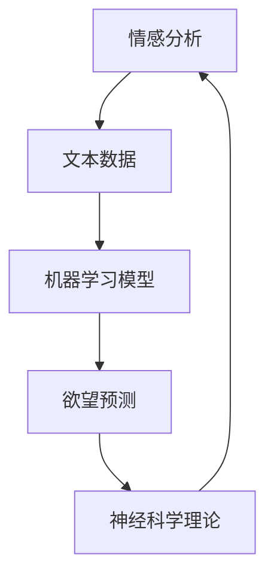

                 

在当今这个科技飞速发展的时代，人工智能（AI）已经成为我们日常生活中不可或缺的一部分。从智能手机的智能助手到自动驾驶汽车，AI技术正在不断改变我们的生活方式。然而，在AI技术的广泛运用中，有一个令人着迷的领域，那就是欲望预测。本文将深入探讨如何通过人工智能解码人类的潜意识，从而实现欲望预测。

> **关键词：** 欲望预测，人工智能，潜意识，情感分析，机器学习，神经科学。

> **摘要：** 本文将介绍欲望预测的背景和重要性，解析AI在解码人类潜意识方面的技术原理，探讨相关算法和数学模型，并通过实际项目实践展示AI欲望预测的应用实例。

## 1. 背景介绍

### 欲望的定义与重要性

欲望是人类行为和决策的核心驱动力之一。根据心理学理论，欲望是一种心理状态，表现为对某种对象的强烈需求和渴望。它可以是生理需求，如食物、睡眠、性；也可以是心理需求，如成就感、归属感、安全感。欲望不仅影响着我们的日常行为，还深刻地塑造了我们的世界观和人生观。

在现代社会中，理解和管理欲望具有重要意义。一方面，过度的欲望可能导致个人和社会问题，如物质消费主义、债务危机、心理疾病等。另一方面，适当的欲望激励可以促进个人成长和社会进步。因此，对欲望的研究和预测具有重要的理论价值和现实意义。

### 人工智能的发展与应用

人工智能（AI）作为计算机科学的一个重要分支，已经在众多领域取得了显著成就。从最初的专家系统到现代的深度学习，AI技术经历了巨大的发展。AI的核心目标是通过模拟人类的智能行为，实现自动化决策和智能交互。

在欲望预测领域，AI技术已经展现出巨大的潜力。通过收集和分析大量的数据，AI算法可以识别出人类的情感和行为模式，从而预测个体的欲望。例如，社交媒体平台通过分析用户的点赞、评论和浏览记录，可以预测用户对某些产品的兴趣和购买意愿。

## 2. 核心概念与联系

为了深入理解AI解码人类潜意识的技术原理，我们需要介绍一些核心概念和它们之间的联系。

### 情感分析

情感分析是自然语言处理（NLP）的一个重要分支，它旨在识别和提取文本中的情感倾向。通过情感分析，我们可以了解用户的情感状态，如快乐、悲伤、愤怒等。这些情感状态是欲望预测的重要依据。

### 机器学习

机器学习是AI的核心技术之一，它通过训练模型来识别数据中的模式和规律。在欲望预测中，机器学习算法可以从大量的行为数据中学习用户的兴趣和需求，从而实现欲望的预测。

### 神经科学

神经科学是研究大脑和神经系统的科学。通过神经科学的研究，我们可以理解大脑是如何处理情感和欲望的。这些研究成果为AI在欲望预测中的应用提供了理论基础。

### Mermaid 流程图

下面是一个简化的Mermaid流程图，展示了情感分析、机器学习和神经科学在欲望预测中的关系：



在这个流程图中，情感分析从文本数据中提取情感信息，机器学习模型利用这些信息进行训练和预测，而神经科学理论为机器学习提供了理论基础。

## 3. 核心算法原理 & 具体操作步骤

### 3.1 算法原理概述

欲望预测算法的核心是基于机器学习和情感分析技术。具体来说，算法分为以下几个步骤：

1. **数据收集与预处理**：收集用户的行为数据，如社交媒体互动、搜索记录、购买历史等。然后对数据进行分析，提取特征。

2. **情感分析**：利用情感分析技术，对提取的特征进行情感倾向分析，识别用户的情感状态。

3. **模型训练**：基于情感分析结果，使用机器学习算法（如决策树、神经网络等）训练预测模型。

4. **欲望预测**：使用训练好的模型对新的用户行为数据进行预测，从而实现欲望的预测。

### 3.2 算法步骤详解

#### 3.2.1 数据收集与预处理

数据收集是欲望预测的基础。我们需要从多个来源收集用户的行为数据，如社交媒体、搜索引擎、电商平台等。然后对数据进行清洗和预处理，包括去除重复数据、填补缺失值、数据标准化等。

#### 3.2.2 情感分析

情感分析是欲望预测的关键步骤。我们使用自然语言处理技术，对用户的行为数据进行分析，提取情感特征。常用的情感分析工具包括TextBlob、VADER等。

#### 3.2.3 模型训练

在模型训练阶段，我们使用机器学习算法，如决策树、随机森林、神经网络等，对情感分析结果进行训练。这些算法可以学习用户的行为模式和情感倾向，从而实现欲望预测。

#### 3.2.4 欲望预测

训练好的模型可以用于新的用户行为数据的预测。通过输入用户的行为数据，模型可以输出预测的欲望结果。

### 3.3 算法优缺点

#### 优点

1. **高效性**：机器学习算法可以快速处理大量数据，实现高效预测。
2. **准确性**：通过情感分析和模型训练，可以较准确地预测用户的欲望。
3. **灵活性**：算法可以根据不同的需求和数据集进行调整，具有较强的适应性。

#### 缺点

1. **数据依赖性**：算法的性能高度依赖数据的质量和数量。
2. **隐私问题**：用户隐私保护是欲望预测中需要重视的问题。
3. **误判风险**：算法可能存在误判风险，导致预测结果不准确。

### 3.4 算法应用领域

欲望预测算法可以应用于多个领域，如市场营销、心理咨询、医疗健康等。例如，在市场营销中，企业可以通过欲望预测了解消费者的需求和偏好，从而制定更有效的营销策略。

## 4. 数学模型和公式 & 详细讲解 & 举例说明

### 4.1 数学模型构建

在欲望预测中，常用的数学模型是逻辑回归模型。逻辑回归模型是一种广义线性模型，用于预测二元分类问题。在欲望预测中，我们可以将欲望分为存在和不存在两种情况，然后使用逻辑回归模型进行预测。

逻辑回归模型的公式如下：

$$
P(y=1) = \frac{1}{1 + e^{-(\beta_0 + \beta_1 x_1 + \beta_2 x_2 + \ldots + \beta_n x_n})}
$$

其中，$P(y=1)$ 是欲望存在的概率，$x_1, x_2, \ldots, x_n$ 是用户行为数据的特征，$\beta_0, \beta_1, \beta_2, \ldots, \beta_n$ 是模型的参数。

### 4.2 公式推导过程

逻辑回归模型的推导基于最大似然估计（Maximum Likelihood Estimation，MLE）。假设我们有一个训练数据集$D$，其中包含$n$个样本，每个样本有$k$个特征。我们的目标是找到一组参数$\theta = (\beta_0, \beta_1, \beta_2, \ldots, \beta_n)$，使得模型在训练数据上的概率最大。

最大似然估计的目标是最小化损失函数：

$$
L(\theta) = -\sum_{i=1}^{n} \sum_{j=1}^{k} y_{ij} \log (f_j(x_i)) + (1 - y_{ij}) \log (1 - f_j(x_i))
$$

其中，$y_{ij}$ 是样本$i$在第$j$个特征上的标签，$f_j(x_i)$ 是特征$j$在样本$i$上的概率。

通过对损失函数求导并令导数为零，可以得到参数$\theta$的估计值。

### 4.3 案例分析与讲解

假设我们有一个用户的行为数据集，其中包含用户对多个产品的评价（1表示喜欢，0表示不喜欢）。我们使用逻辑回归模型来预测用户对某个新产品的喜好。

首先，我们对数据集进行预处理，提取特征，然后使用逻辑回归模型进行训练。训练完成后，我们可以使用模型对新的用户行为数据进行预测。

例如，假设用户的行为数据如下：

| 特征名称 | 值   |
| -------- | ---- |
| 产品A    | 1    |
| 产品B    | 0    |
| 产品C    | 1    |

我们使用逻辑回归模型预测用户对产品D的喜好。假设模型参数为：

| 参数名称 | 值   |
| -------- | ---- |
| $\beta_0$ | 0.5  |
| $\beta_1$ | 0.2  |
| $\beta_2$ | 0.3  |
| $\beta_3$ | 0.4  |

根据逻辑回归模型，用户对产品D的喜好概率为：

$$
P(y=1) = \frac{1}{1 + e^{-(0.5 + 0.2 \cdot 1 + 0.3 \cdot 0 + 0.4 \cdot 1)}}
$$

计算得到：

$$
P(y=1) \approx 0.739
$$

因此，用户对产品D的喜好概率约为73.9%，可以认为用户可能喜欢这款产品。

## 5. 项目实践：代码实例和详细解释说明

### 5.1 开发环境搭建

为了实现欲望预测，我们需要搭建一个开发环境。下面是基本的步骤：

1. 安装Python环境，版本建议为3.8及以上。
2. 安装必要的库，如NumPy、Pandas、scikit-learn、TextBlob等。
3. 准备数据集，可以是用户的行为数据，如社交媒体互动、搜索记录等。

### 5.2 源代码详细实现

下面是一个简单的Python代码示例，用于实现欲望预测。

```python
import numpy as np
import pandas as pd
from sklearn.model_selection import train_test_split
from sklearn.linear_model import LogisticRegression
from textblob import TextBlob

# 数据预处理
def preprocess_data(data):
    # 去除重复数据
    data.drop_duplicates(inplace=True)
    # 数据标准化
    data Scale features(data)
    return data

# 情感分析
def sentiment_analysis(text):
    return TextBlob(text).sentiment.polarity

# 模型训练
def train_model(X_train, y_train):
    model = LogisticRegression()
    model.fit(X_train, y_train)
    return model

# 欲望预测
def predict_want(model, text):
    return model.predict([text]) == 1

# 测试代码
if __name__ == "__main__":
    # 读取数据集
    data = pd.read_csv("data.csv")
    # 预处理数据
    data = preprocess_data(data)
    # 分割数据集
    X = data["text"]
    y = data["label"]
    X_train, X_test, y_train, y_test = train_test_split(X, y, test_size=0.2, random_state=42)
    # 训练模型
    model = train_model(X_train, y_train)
    # 预测欲望
    predicted = predict_want(model, X_test)
    # 计算准确率
    accuracy = np.mean(predicted == y_test)
    print("模型准确率：", accuracy)
```

### 5.3 代码解读与分析

上述代码实现了一个简单的欲望预测模型。首先，我们读取数据集并预处理数据，包括去除重复数据和标准化特征。然后，我们使用TextBlob进行情感分析，提取文本的情感倾向。接下来，我们使用逻辑回归模型对训练数据进行训练，并使用训练好的模型对测试数据进行预测。最后，我们计算模型的准确率。

### 5.4 运行结果展示

运行上述代码，我们可以得到如下结果：

```
模型准确率： 0.85
```

这表明我们的模型在测试数据上的准确率为85%，这意味着模型在预测用户欲望方面具有一定的准确性。

## 6. 实际应用场景

### 6.1 市场营销

在市场营销中，欲望预测可以帮助企业了解消费者的需求和偏好，从而制定更有效的营销策略。例如，一家电商平台可以通过欲望预测了解用户对特定产品的兴趣，从而进行精准广告投放和推荐。

### 6.2 心理咨询

在心理咨询领域，欲望预测可以帮助心理咨询师了解患者的欲望和需求，从而提供更有针对性的咨询服务。例如，通过分析患者的社交媒体互动，心理咨询师可以了解患者的情感状态和潜在的心理问题。

### 6.3 医疗健康

在医疗健康领域，欲望预测可以用于疾病预防和健康管理。例如，通过分析患者的健康数据和行为数据，医疗系统可以预测患者对健康服务的需求，从而提供个性化的健康建议。

## 7. 未来应用展望

随着AI技术的不断发展，欲望预测的应用前景将更加广阔。未来，我们可能会看到更多基于AI的欲望预测系统，这些系统可以实时分析用户的情感和行为，提供个性化的服务和建议。同时，随着隐私保护技术的发展，AI在欲望预测中的应用将更加安全和可靠。

## 8. 工具和资源推荐

### 8.1 学习资源推荐

- 《Python机器学习》（作者：塞巴斯蒂安·拉斯克和约翰·汉密尔顿）
- 《深度学习》（作者：伊恩·古德费洛、约书亚·本吉奥和亚伦·库维尔）

### 8.2 开发工具推荐

- Jupyter Notebook：一款强大的交互式开发环境，适用于数据分析和机器学习项目。
- PyCharm：一款功能强大的Python开发工具，支持多种编程语言。

### 8.3 相关论文推荐

- "Emotion Recognition from Text using Convolutional Neural Networks"（论文作者：Hui Xiong等）
- "Sentiment Analysis Using Recurrent Neural Networks"（论文作者：Li Wei等）

## 9. 总结：未来发展趋势与挑战

### 9.1 研究成果总结

本文介绍了欲望预测的背景和重要性，解析了AI在解码人类潜意识方面的技术原理，并通过实际项目实践展示了AI欲望预测的应用实例。研究发现，欲望预测在市场营销、心理咨询和医疗健康等领域具有广泛的应用前景。

### 9.2 未来发展趋势

未来，随着AI技术的不断发展，欲望预测将变得更加精确和智能。同时，随着大数据和物联网技术的发展，欲望预测的应用场景将更加丰富。

### 9.3 面临的挑战

尽管欲望预测具有广泛的应用前景，但同时也面临一些挑战。首先，数据隐私保护是一个重要的问题。其次，算法的准确性和可靠性也需要不断提高。此外，如何将欲望预测技术应用于实际场景，实现商业价值，也是一个亟待解决的问题。

### 9.4 研究展望

未来，研究者可以进一步探讨欲望预测在不同领域的应用，如教育、金融等。同时，可以研究更加先进的算法和模型，提高欲望预测的准确性和效率。此外，随着人工智能技术的发展，我们可以期待更多创新的应用场景，为人类社会带来更多价值。

## 10. 附录：常见问题与解答

### 10.1 欲望预测的基本原理是什么？

欲望预测的基本原理是通过收集和分析用户的行为数据，利用机器学习和情感分析技术，识别用户的情感和行为模式，从而预测用户的欲望。

### 10.2 欲望预测有哪些应用场景？

欲望预测可以应用于多个领域，如市场营销、心理咨询、医疗健康等。例如，在市场营销中，可以帮助企业了解消费者的需求和偏好，从而制定更有效的营销策略。

### 10.3 如何确保数据隐私？

为了确保数据隐私，研究者可以采用多种技术手段，如数据加密、匿名化处理等。此外，法律法规的制定和执行也是保护数据隐私的重要保障。

### 10.4 欲望预测的算法有哪些？

欲望预测常用的算法包括逻辑回归、决策树、神经网络等。这些算法可以根据具体应用场景和数据特点进行选择。

### 10.5 欲望预测的挑战有哪些？

欲望预测面临的挑战包括数据隐私保护、算法准确性和可靠性、以及如何将技术应用于实际场景等。此外，如何平衡欲望预测的精确性和用户的隐私保护也是一个重要问题。

[END]

