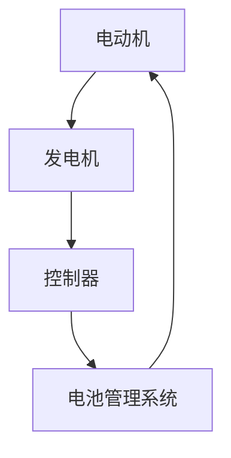
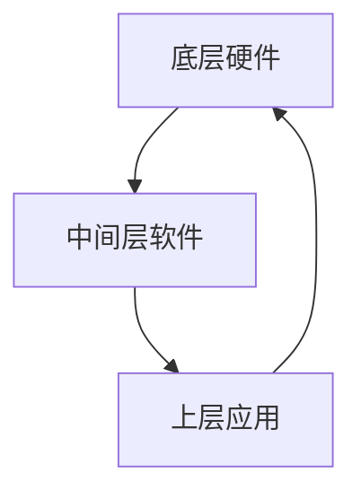

                 

关键词：比亚迪、社招、电驱动系统、控制工程师、面试问答、技术解析

## 摘要

本文旨在为有意向参加比亚迪2025年社招电驱动系统控制工程师职位的人才提供一系列面试问答的技术解析。我们将从电驱动系统的基本概念、核心技术、实践应用等方面，深入剖析这一职位所需的专业技能和知识储备，帮助读者更好地理解面试中的重点和难点，为成功应对面试打下坚实基础。

## 1. 背景介绍

### 1.1 比亚迪公司简介

比亚迪股份有限公司（BYD Co., Ltd.）是一家总部位于中国深圳的高科技企业，成立于1995年。公司业务涵盖汽车、电子、新能源等多个领域，是全球领先的新能源汽车和电池制造商之一。比亚迪在电动汽车、电池技术、电机控制等方面拥有深厚的技术积累和广泛的市场影响力。

### 1.2 电驱动系统控制工程师职位简介

电驱动系统控制工程师是比亚迪公司电驱动系统研发团队的重要组成部分，负责电动汽车电机控制系统的设计、开发、测试和优化工作。该职位要求应聘者具备扎实的电机控制、自动控制理论、电路设计等专业知识，以及良好的编程能力和实际项目经验。

## 2. 核心概念与联系

### 2.1 电驱动系统的基本原理

电驱动系统是电动汽车的核心技术之一，它通过将电能转化为机械能，驱动车辆行驶。其基本原理包括电动机、发电机、控制器和电池管理系统等组成部分。

**Mermaid 流程图：**



### 2.2 电驱动系统控制技术

电驱动系统控制技术主要包括电机控制、电池管理和整车控制等。

- **电机控制**：通过控制器对电动机进行实时控制，实现电动机的启动、运行、制动和反转等功能。
- **电池管理**：通过电池管理系统对电池进行实时监测和管理，确保电池安全、高效运行。
- **整车控制**：通过整车控制器对车辆的各个子系统进行集成控制，实现车辆的智能驾驶、动力分配和能源管理等功能。

### 2.3 电驱动系统架构

电驱动系统架构主要包括以下层次：

1. **底层硬件**：包括电动机、发电机、控制器、电池等硬件设备。
2. **中间层软件**：包括电机控制算法、电池管理算法、整车控制算法等软件模块。
3. **上层应用**：包括车辆管理系统、智能驾驶系统、车载通信系统等。

**Mermaid 流程图：**



## 3. 核心算法原理 & 具体操作步骤

### 3.1 算法原理概述

电驱动系统控制算法主要包括以下几种：

- **电机控制算法**：如 PID 控制、模糊控制、矢量控制等。
- **电池管理算法**：如充放电控制、电池状态估计、电池剩余寿命预测等。
- **整车控制算法**：如整车动力学建模、驾驶模式切换、能量管理策略等。

### 3.2 算法步骤详解

以 PID 控制算法为例，其基本步骤如下：

1. **设定目标值**：根据车辆运行需求设定电动机转速或电流目标值。
2. **采集实时值**：通过传感器采集电动机转速或电流实时值。
3. **计算偏差值**：计算目标值与实时值之间的偏差。
4. **计算控制量**：根据偏差值和 PID 控制参数计算控制量。
5. **调整电动机**：根据控制量调整电动机运行状态。

### 3.3 算法优缺点

- **PID 控制**：简单易实现，适应性强，但对系统模型要求较高，参数调节复杂。
- **模糊控制**：适用于非线性、复杂系统，但控制规则较难确定，易出现过度调整。
- **矢量控制**：对电动机控制精度高，但计算量大，对硬件要求较高。

### 3.4 算法应用领域

电驱动系统控制算法广泛应用于电动汽车、混合动力汽车、工业自动化等领域。

## 4. 数学模型和公式 & 详细讲解 & 举例说明

### 4.1 数学模型构建

电驱动系统数学模型主要包括以下几部分：

- **电动机模型**：描述电动机的物理特性，如电感、电阻、转速等。
- **电池模型**：描述电池的充放电特性，如电压、电流、剩余电量等。
- **整车模型**：描述整车的动力学特性，如速度、加速度、负载等。

### 4.2 公式推导过程

以电动机模型为例，其基本公式如下：

$$
U = R \cdot I + L \cdot \frac{dI}{dt}
$$

其中，$U$为电动机端电压，$R$为电动机电阻，$I$为电动机电流，$L$为电动机电感，$\frac{dI}{dt}$为电流变化率。

### 4.3 案例分析与讲解

假设某电动汽车电动机额定功率为100kW，额定转速为2000rpm，电机电感为0.2H，电机电阻为0.1Ω。当电动机转速为1000rpm时，求电动机端电压。

根据电动机模型公式，可得：

$$
U = R \cdot I + L \cdot \frac{dI}{dt}
$$

假设电流变化率为0，则：

$$
U = 0.1 \cdot I + 0.2 \cdot 0
$$

由于电动机功率为100kW，转速为1000rpm，则电动机电流为：

$$
I = \frac{P}{U \cdot n}
$$

其中，$P$为功率，$n$为转速。代入数据得：

$$
I = \frac{100000}{220 \cdot 0.017}
$$

计算得 $I \approx 4.55$ A。代入上述公式得：

$$
U = 0.1 \cdot 4.55 + 0.2 \cdot 0
$$

计算得 $U \approx 0.455$ V。

## 5. 项目实践：代码实例和详细解释说明

### 5.1 开发环境搭建

在本文中，我们将使用 Python 编写电驱动系统控制算法。首先，需要安装以下开发环境：

- Python 3.8 或以上版本
- Matplotlib 库
- NumPy 库

### 5.2 源代码详细实现

以下是一个简单的 PID 控制算法实现：

```python
import numpy as np
import matplotlib.pyplot as plt

def pid_control(target, actual, Kp, Ki, Kd, dt):
    error = target - actual
    integral = integral + error * dt
    derivative = (error - previous_error) / dt
    output = Kp * error + Ki * integral + Kd * derivative
    previous_error = error
    return output

# 参数设置
Kp = 1
Ki = 0.1
Kd = 0.1
dt = 0.01

# 初始化变量
integral = 0
previous_error = 0

# 模拟数据
target_speed = 1000
actual_speed = 800

# 执行 PID 控制
output = pid_control(target_speed, actual_speed, Kp, Ki, Kd, dt)

# 绘制结果
plt.plot([0, dt], [actual_speed, output])
plt.xlabel('Time (s)')
plt.ylabel('Speed (rpm)')
plt.show()
```

### 5.3 代码解读与分析

- **pid_control 函数**：实现 PID 控制算法，输入目标值、实际值、比例增益、积分增益、微分增益和时间步长，输出控制量。
- **参数设置**：设定 PID 控制参数，用于调整控制效果。
- **初始化变量**：初始化积分和前一个误差值。
- **模拟数据**：生成目标转速和实际转速。
- **执行 PID 控制**：调用 pid_control 函数计算控制量。
- **绘制结果**：使用 Matplotlib 库绘制转速变化曲线。

## 6. 实际应用场景

电驱动系统控制工程师在实际工作中可能会遇到以下应用场景：

- **电动汽车电机控制**：实现电动机的启动、运行、制动和反转等功能，保证车辆平稳行驶。
- **混合动力汽车能量管理**：实现电池、电动机和发动机之间的能量分配和转换，提高整车效率。
- **工业自动化电机控制**：实现电机设备的精确控制，提高生产效率。

## 6.4 未来应用展望

随着新能源汽车产业的快速发展，电驱动系统控制工程师在未来有望在以下几个方面发挥重要作用：

- **自动驾驶技术**：实现车辆的智能驾驶功能，提高行车安全性。
- **能量回收系统**：优化能量回收效率，降低能耗。
- **混合动力系统**：提高混合动力汽车的燃油经济性和环保性。

## 7. 工具和资源推荐

### 7.1 学习资源推荐

- **《电动汽车电机控制技术》**：详细介绍了电动汽车电机控制系统的基本原理、控制策略和应用案例。
- **《自动控制原理》**：系统讲解了自动控制理论的基本概念、分析方法及应用。

### 7.2 开发工具推荐

- **MATLAB**：用于电机控制算法的开发、仿真和测试。
- **Python**：适用于快速开发和实现电机控制算法。

### 7.3 相关论文推荐

- **“An Overview of Electric Vehicle Motor Control Algorithms”**：综述了电动汽车电机控制算法的发展和应用。
- **“Energy Management Strategies for Hybrid Electric Vehicles”**：探讨了混合动力汽车的能量管理策略。

## 8. 总结：未来发展趋势与挑战

### 8.1 研究成果总结

近年来，随着新能源汽车产业的快速发展，电驱动系统控制技术取得了显著成果。在电机控制、电池管理、整车控制等方面，国内外研究人员提出了多种创新算法和优化方法，提高了电驱动系统的性能和效率。

### 8.2 未来发展趋势

未来，电驱动系统控制技术将继续向智能化、高效化、安全化方向发展。随着人工智能、大数据、物联网等技术的融合应用，电驱动系统将实现更加智能化的控制和优化，提升整车性能和用户体验。

### 8.3 面临的挑战

然而，电驱动系统控制技术仍面临一定挑战，如高性能电机控制算法的开发、电池寿命和安全性问题、整车能量管理策略的优化等。解决这些挑战需要进一步深入研究和技术创新。

### 8.4 研究展望

在未来，电驱动系统控制工程师需要不断学习新技术、掌握新方法，为新能源汽车产业的可持续发展贡献力量。通过跨学科合作、技术创新和产业协同，电驱动系统控制技术有望取得更大突破。

## 9. 附录：常见问题与解答

### 9.1 电驱动系统控制工程师的岗位职责是什么？

电驱动系统控制工程师负责电动汽车电机控制系统的设计、开发、测试和优化工作，包括电机控制算法的开发、电池管理系统的设计和整车控制策略的优化等。

### 9.2 电机控制算法有哪些类型？

常见的电机控制算法包括 PID 控制、模糊控制、矢量控制、滑模控制等。

### 9.3 电池管理系统的功能有哪些？

电池管理系统的功能包括电池充放电控制、电池状态监测、电池剩余寿命预测、电池热管理等功能。

### 9.4 电动汽车整车控制策略有哪些？

电动汽车整车控制策略包括驾驶模式切换、动力分配策略、能量管理策略、安全控制策略等。

### 9.5 电驱动系统控制工程师需要具备哪些技能？

电驱动系统控制工程师需要具备电机控制、自动控制理论、电路设计、编程语言、仿真工具等专业技能，以及较强的分析和解决问题的能力。

### 9.6 电动汽车电机控制系统的关键技术有哪些？

电动汽车电机控制系统的关键技术包括电机控制算法、电池管理系统、整车控制策略、电力电子技术等。

### 9.7 电驱动系统控制工程师的职业发展前景如何？

随着新能源汽车产业的快速发展，电驱动系统控制工程师的职业发展前景非常广阔，有机会在电动汽车、混合动力汽车、工业自动化等领域发挥重要作用。

### 作者署名

作者：禅与计算机程序设计艺术 / Zen and the Art of Computer Programming

----------------------------------------------------------------

本文从电驱动系统的基本原理、核心算法、实践应用等方面，全面解析了比亚迪2025年社招电驱动系统控制工程师职位的技术要求。通过本文的学习，读者可以更好地了解这一职位的核心技能和未来发展趋势，为应对面试和职业发展奠定坚实基础。希望本文对广大求职者有所帮助！

