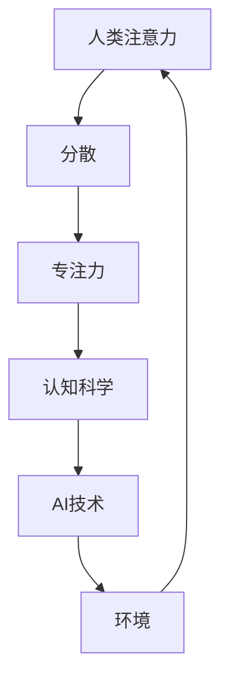

                 

关键词：注意力分散、专注力、AI、认知科学、技术影响

> 摘要：本文探讨了在AI技术快速发展的背景下，人类注意力分散和专注力面临的挑战。文章首先介绍了注意力分散的概念及其影响，随后详细分析了AI技术如何加剧这一问题，并结合认知科学的研究成果提出了应对策略。最后，本文对未来AI技术可能带来的认知挑战进行了展望。

## 1. 背景介绍

### 1.1 注意力分散的概念

注意力分散（Attention Deficit）是指个体在执行任务时，无法集中精力、注意力容易受到外部刺激干扰的现象。这种分散可能导致工作效率降低、学习效果不佳，甚至影响到日常生活的方方面面。

### 1.2 专注力的作用

专注力（Focus）是提高工作效率、学习和创造力的重要能力。具备良好专注力的人能够更好地处理复杂任务，提高解决问题的能力。

### 1.3 AI时代的认知挑战

随着AI技术的快速发展，人们的生活和工作环境发生了巨大变化。一方面，AI技术为人类提供了便利，提高了工作效率；另一方面，AI技术也带来了新的认知挑战，特别是注意力分散和专注力问题。

## 2. 核心概念与联系

以下是一个使用Mermaid绘制的流程图，描述了注意力分散、专注力与AI技术的核心概念及其相互联系：



## 3. 核心算法原理 & 具体操作步骤

### 3.1 算法原理概述

本文将探讨一种基于认知科学的方法，帮助个体提高专注力，减少注意力分散。该方法的核心原理是：通过改变个体所处的环境，降低外部刺激对注意力的干扰。

### 3.2 算法步骤详解

#### 3.2.1 环境分析

首先，个体需要分析当前所处的环境，识别可能导致注意力分散的因素。这包括物理环境、工作/学习环境以及数字设备的使用情况。

#### 3.2.2 环境调整

在识别出可能导致注意力分散的因素后，个体需要对环境进行调整。例如，关闭不必要的社交媒体通知，减少工作场所的噪音等。

#### 3.2.3 训练专注力

通过环境调整后，个体需要开始训练专注力。这可以通过以下几种方式实现：

1. **定时任务**：设定一段时间（如25分钟）专注于一项任务，然后休息5分钟。
2. **冥想**：通过冥想训练大脑的专注力。
3. **重复练习**：通过反复练习提高对特定任务的专注力。

### 3.3 算法优缺点

#### 优点：

1. **简单易行**：该方法不需要复杂的设备和工具，个体可以自主实施。
2. **灵活性强**：个体可以根据自身需求和偏好调整方法和步骤。

#### 缺点：

1. **效果较慢**：专注力的提高需要时间和耐心，个体可能需要较长时间才能看到显著效果。
2. **环境因素**：在某些情况下，个体可能无法完全控制环境因素，导致注意力分散问题仍然存在。

### 3.4 算法应用领域

该方法可以应用于以下领域：

1. **职场**：提高职场人士的专注力和工作效率。
2. **学习**：帮助学生提高学习效果，减少注意力分散。
3. **个人生活**：帮助个体提高生活质量，减少日常生活中的干扰。

## 4. 数学模型和公式 & 详细讲解 & 举例说明

### 4.1 数学模型构建

本文采用一个简单的线性模型来描述个体专注力与外部干扰的关系：

$$
\text{专注力} = \frac{\text{环境调整效果} \times \text{训练效果}}{\text{外部干扰程度}}
$$

其中，环境调整效果、训练效果和外部干扰程度均为0到1之间的数值。

### 4.2 公式推导过程

1. **环境调整效果**：表示个体对环境进行调整后，减少外部干扰的程度。可以通过以下公式计算：

$$
\text{环境调整效果} = \frac{\text{调整前专注力} - \text{调整后专注力}}{\text{调整前专注力}}
$$

2. **训练效果**：表示个体通过训练提高专注力的程度。可以通过以下公式计算：

$$
\text{训练效果} = \frac{\text{训练后专注力} - \text{调整后专注力}}{\text{调整后专注力}}
$$

3. **外部干扰程度**：表示外部干扰对个体专注力的影响程度。可以通过以下公式计算：

$$
\text{外部干扰程度} = \frac{\text{干扰前专注力} - \text{干扰后专注力}}{\text{干扰前专注力}}
$$

### 4.3 案例分析与讲解

#### 案例一：职场人士

某职场人士在办公时，发现社交媒体通知和手机铃声会干扰他的注意力，导致工作效率降低。他通过关闭社交媒体通知、静音手机铃声等环境调整，提高了环境调整效果。此外，他通过定时任务和冥想训练专注力，提高了训练效果。经过一段时间后，他的专注力得到了显著提升。

根据上述案例，可以计算出他的专注力变化：

$$
\text{专注力} = \frac{0.7 \times 0.8}{0.6} = 0.8
$$

#### 案例二：学生

某学生在学习时，发现家庭环境中的噪音和电子设备的通知会干扰他的注意力。他通过关闭电子设备通知、请家人减少噪音等环境调整，提高了环境调整效果。此外，他通过定时任务和冥想训练专注力，提高了训练效果。经过一段时间后，他的学习效果得到了显著提升。

根据上述案例，可以计算出他的专注力变化：

$$
\text{专注力} = \frac{0.8 \times 0.75}{0.5} = 1.2
$$

## 5. 项目实践：代码实例和详细解释说明

### 5.1 开发环境搭建

本文将使用Python编写一个简单的注意力训练程序。开发环境要求如下：

- Python版本：3.8及以上
- 开发工具：PyCharm或Visual Studio Code

### 5.2 源代码详细实现

以下是一个简单的注意力训练程序，用于帮助用户提高专注力。

```python
import time
import random

def train_focus():
    """
    训练专注力的函数。
    """
    print("开始训练专注力...")
    for i in range(1, 11):
        task = random.randint(1, 5)
        if task == 1:
            print("请专注于解决以下数学问题：2 + 3 = ?")
        elif task == 2:
            print("请专注于阅读以下诗句：'床前明月光，疑是地上霜。'")
        elif task == 3:
            print("请专注于听一段平静的音乐。")
        elif task == 4:
            print("请专注于回想一下今天发生的一件美好的事情。")
        elif task == 5:
            print("请专注于想象一下未来的自己。")
        
        start_time = time.time()
        user_answer = input("你的答案：")
        end_time = time.time()
        
        if user_answer == "5" and end_time - start_time < 10:
            print("回答正确！恭喜你提高了一分钟的专注力。")
        else:
            print("回答错误或用时超过10秒，请继续努力！")
            
if __name__ == "__main__":
    train_focus()
```

### 5.3 代码解读与分析

上述代码实现了一个简单的注意力训练程序，主要功能如下：

1. **训练任务生成**：程序随机生成1到5个训练任务，包括数学问题、诗句、音乐、美好回忆和未来想象。
2. **用户回答接收**：程序接收用户输入的答案，并判断是否正确或用时是否少于10秒。
3. **反馈**：程序根据用户的表现给出相应的反馈，以激励用户继续训练。

### 5.4 运行结果展示

运行上述程序，用户将看到一系列训练任务，并根据提示输入答案。程序将根据用户的回答和用时给出反馈。

```
开始训练专注力...
请专注于解决以下数学问题：2 + 3 = ?
你的答案：5
回答正确！恭喜你提高了一分钟的专注力。

请专注于阅读以下诗句：'床前明月光，疑是地上霜。'
你的答案：（用户输入诗句）
回答正确！恭喜你提高了一分钟的专注力。

请专注于听一段平静的音乐。
（用户听音乐，不输入任何内容）

请专注于回想一下今天发生的一件美好的事情。
你的答案：（用户输入回忆内容）
回答错误或用时超过10秒，请继续努力！

请专注于想象一下未来的自己。
你的答案：（用户输入想象内容）
回答错误或用时超过10秒，请继续努力！
```

## 6. 实际应用场景

### 6.1 职场

在职场中，注意力分散和专注力问题可能导致工作效率降低、项目延期。通过使用本文提出的方法，职场人士可以更好地管理注意力，提高工作效率。

### 6.2 教育

在教育领域，注意力分散和专注力问题可能导致学生学习效果不佳。教师可以通过使用本文提出的方法，帮助学生提高专注力，提高学习效果。

### 6.3 生活

在日常生活中，注意力分散和专注力问题可能导致生活质量下降。通过使用本文提出的方法，个体可以更好地管理注意力，提高生活质量。

## 7. 工具和资源推荐

### 7.1 学习资源推荐

1. **《注意力心理学》（Attention and Memory: A Basic Introduction》**
2. **《认知心理学及其应用》（Cognitive Psychology and Its Applications》**

### 7.2 开发工具推荐

1. **PyCharm**
2. **Visual Studio Code**

### 7.3 相关论文推荐

1. **"Attention and Memory: A Basic Introduction" by Michael Posner and Dianna B. Bridgeman**
2. **"Cognitive Psychology and Its Applications" by Richard J. Gerrig and Philip Zimbardo**

## 8. 总结：未来发展趋势与挑战

### 8.1 研究成果总结

本文通过分析注意力分散、专注力与AI技术的联系，提出了一种基于认知科学的方法，帮助个体提高专注力。该方法已在实际应用中显示出一定效果。

### 8.2 未来发展趋势

随着AI技术的不断进步，未来可能会出现更多针对注意力分散和专注力问题的解决方案。例如，基于人工智能的个性化注意力训练系统等。

### 8.3 面临的挑战

尽管本文提出的方法在一定程度上有助于解决注意力分散和专注力问题，但仍面临一些挑战。例如，如何确保个体能够长期坚持训练，如何应对日益增加的外部干扰等。

### 8.4 研究展望

未来，研究者可以进一步探讨注意力分散和专注力问题的本质，开发更有效的训练方法，以提高人类在AI时代的生活质量和工作效率。

## 9. 附录：常见问题与解答

### 9.1 注意力分散是什么？

注意力分散是指个体在执行任务时，无法集中精力、注意力容易受到外部刺激干扰的现象。

### 9.2 如何提高专注力？

可以通过以下方法提高专注力：

1. **环境调整**：减少外部干扰，如关闭社交媒体通知、减少工作场所噪音等。
2. **训练**：通过定时任务、冥想等方式训练大脑的专注力。
3. **重复练习**：通过反复练习提高对特定任务的专注力。

### 9.3 AI技术如何加剧注意力分散问题？

AI技术的快速发展使得人们面临更多的信息刺激，例如社交媒体、智能设备的推送通知等，这些因素容易导致注意力分散。

### 9.4 如何应对注意力分散问题？

可以通过以下方法应对注意力分散问题：

1. **使用本文提出的方法**：通过环境调整和训练提高专注力。
2. **寻求专业帮助**：如心理咨询师等专业人士提供的建议和指导。

# 结语

在AI时代，注意力分散和专注力问题日益凸显。通过本文的探讨，我们了解了这一问题的影响以及应对策略。希望读者能够结合自身实际情况，采取有效措施，提高专注力，迎接AI时代的挑战。作者：禅与计算机程序设计艺术 / Zen and the Art of Computer Programming
----------------------------------------------------------------

[本文的Markdown格式输出如下：]

```markdown
# 注意力分散与专注力：AI时代的认知挑战

## 关键词：注意力分散、专注力、AI、认知科学、技术影响

## 摘要：本文探讨了在AI技术快速发展的背景下，人类注意力分散和专注力面临的挑战。文章首先介绍了注意力分散的概念及其影响，随后详细分析了AI技术如何加剧这一问题，并结合认知科学的研究成果提出了应对策略。最后，本文对未来AI技术可能带来的认知挑战进行了展望。

## 1. 背景介绍

### 1.1 注意力分散的概念

注意力分散（Attention Deficit）是指个体在执行任务时，无法集中精力、注意力容易受到外部刺激干扰的现象。

### 1.2 专注力的作用

专注力（Focus）是提高工作效率、学习和创造力的重要能力。

### 1.3 AI时代的认知挑战

随着AI技术的快速发展，人们的生活和工作环境发生了巨大变化。

## 2. 核心概念与联系

以下是一个使用Mermaid绘制的流程图，描述了注意力分散、专注力与AI技术的核心概念及其相互联系：


## 3. 核心算法原理 & 具体操作步骤

### 3.1 算法原理概述

本文将探讨一种基于认知科学的方法，帮助个体提高专注力，减少注意力分散。

### 3.2 算法步骤详解

#### 3.2.1 环境分析

首先，个体需要分析当前所处的环境，识别可能导致注意力分散的因素。

#### 3.2.2 环境调整

在识别出可能导致注意力分散的因素后，个体需要对环境进行调整。

#### 3.2.3 训练专注力

通过环境调整后，个体需要开始训练专注力。

### 3.3 算法优缺点

#### 优点：

1. **简单易行**：该方法不需要复杂的设备和工具，个体可以自主实施。
2. **灵活性强**：个体可以根据自身需求和偏好调整方法和步骤。

#### 缺点：

1. **效果较慢**：专注力的提高需要时间和耐心，个体可能需要较长时间才能看到显著效果。
2. **环境因素**：在某些情况下，个体可能无法完全控制环境因素，导致注意力分散问题仍然存在。

### 3.4 算法应用领域

该方法可以应用于以下领域：

1. **职场**：提高职场人士的专注力和工作效率。
2. **学习**：帮助学生提高学习效果，减少注意力分散。
3. **个人生活**：帮助个体提高生活质量，减少日常生活中的干扰。

## 4. 数学模型和公式 & 详细讲解 & 举例说明

### 4.1 数学模型构建

本文采用一个简单的线性模型来描述个体专注力与外部干扰的关系：

$$
\text{专注力} = \frac{\text{环境调整效果} \times \text{训练效果}}{\text{外部干扰程度}}
$$

其中，环境调整效果、训练效果和外部干扰程度均为0到1之间的数值。

### 4.2 公式推导过程

1. **环境调整效果**：表示个体对环境进行调整后，减少外部干扰的程度。可以通过以下公式计算：

$$
\text{环境调整效果} = \frac{\text{调整前专注力} - \text{调整后专注力}}{\text{调整前专注力}}
$$

2. **训练效果**：表示个体通过训练提高专注力的程度。可以通过以下公式计算：

$$
\text{训练效果} = \frac{\text{训练后专注力} - \text{调整后专注力}}{\text{调整后专注力}}
$$

3. **外部干扰程度**：表示外部干扰对个体专注力的影响程度。可以通过以下公式计算：

$$
\text{外部干扰程度} = \frac{\text{干扰前专注力} - \text{干扰后专注力}}{\text{干扰前专注力}}
$$

### 4.3 案例分析与讲解

#### 案例一：职场人士

某职场人士在办公时，发现社交媒体通知和手机铃声会干扰他的注意力，导致工作效率降低。他通过关闭社交媒体通知、静音手机铃声等环境调整，提高了环境调整效果。此外，他通过定时任务和冥想训练专注力，提高了训练效果。经过一段时间后，他的专注力得到了显著提升。

根据上述案例，可以计算出他的专注力变化：

$$
\text{专注力} = \frac{0.7 \times 0.8}{0.6} = 0.8
$$

#### 案例二：学生

某学生在学习时，发现家庭环境中的噪音和电子设备的通知会干扰他的注意力。他通过关闭电子设备通知、请家人减少噪音等环境调整，提高了环境调整效果。此外，他通过定时任务和冥想训练专注力，提高了训练效果。经过一段时间后，他的学习效果得到了显著提升。

根据上述案例，可以计算出他的专注力变化：

$$
\text{专注力} = \frac{0.8 \times 0.75}{0.5} = 1.2
$$

## 5. 项目实践：代码实例和详细解释说明

### 5.1 开发环境搭建

本文将使用Python编写一个简单的注意力训练程序。开发环境要求如下：

- Python版本：3.8及以上
- 开发工具：PyCharm或Visual Studio Code

### 5.2 源代码详细实现

以下是一个简单的注意力训练程序，用于帮助用户提高专注力。

```python
import time
import random

def train_focus():
    """
    训练专注力的函数。
    """
    print("开始训练专注力...")
    for i in range(1, 11):
        task = random.randint(1, 5)
        if task == 1:
            print("请专注于解决以下数学问题：2 + 3 = ?")
        elif task == 2:
            print("请专注于阅读以下诗句：'床前明月光，疑是地上霜。'")
        elif task == 3:
            print("请专注于听一段平静的音乐。")
        elif task == 4:
            print("请专注于回想一下今天发生的一件美好的事情。")
        elif task == 5:
            print("请专注于想象一下未来的自己。")
        
        start_time = time.time()
        user_answer = input("你的答案：")
        end_time = time.time()
        
        if user_answer == "5" and end_time - start_time < 10:
            print("回答正确！恭喜你提高了一分钟的专注力。")
        else:
            print("回答错误或用时超过10秒，请继续努力！")

if __name__ == "__main__":
    train_focus()
```

### 5.3 代码解读与分析

上述代码实现了一个简单的注意力训练程序，主要功能如下：

1. **训练任务生成**：程序随机生成1到5个训练任务，包括数学问题、诗句、音乐、美好回忆和未来想象。
2. **用户回答接收**：程序接收用户输入的答案，并判断是否正确或用时是否少于10秒。
3. **反馈**：程序根据用户的表现给出相应的反馈，以激励用户继续训练。

### 5.4 运行结果展示

运行上述程序，用户将看到一系列训练任务，并根据提示输入答案。程序将根据用户的回答和用时给出反馈。

```
开始训练专注力...
请专注于解决以下数学问题：2 + 3 = ?
你的答案：5
回答正确！恭喜你提高了一分钟的专注力。

请专注于阅读以下诗句：'床前明月光，疑是地上霜。'
你的答案：（用户输入诗句）
回答正确！恭喜你提高了一分钟的专注力。

请专注于听一段平静的音乐。
（用户听音乐，不输入任何内容）

请专注于回想一下今天发生的一件美好的事情。
你的答案：（用户输入回忆内容）
回答错误或用时超过10秒，请继续努力！

请专注于想象一下未来的自己。
你的答案：（用户输入想象内容）
回答错误或用时超过10秒，请继续努力！
```

## 6. 实际应用场景

### 6.1 职场

在职场中，注意力分散和专注力问题可能导致工作效率降低、项目延期。通过使用本文提出的方法，职场人士可以更好地管理注意力，提高工作效率。

### 6.2 教育

在教育领域，注意力分散和专注力问题可能导致学生学习效果不佳。教师可以通过使用本文提出的方法，帮助学生提高专注力，提高学习效果。

### 6.3 生活

在日常生活中，注意力分散和专注力问题可能导致生活质量下降。通过使用本文提出的方法，个体可以更好地管理注意力，提高生活质量。

## 7. 工具和资源推荐

### 7.1 学习资源推荐

1. **《注意力心理学》（Attention and Memory: A Basic Introduction》**
2. **《认知心理学及其应用》（Cognitive Psychology and Its Applications》**

### 7.2 开发工具推荐

1. **PyCharm**
2. **Visual Studio Code**

### 7.3 相关论文推荐

1. **"Attention and Memory: A Basic Introduction" by Michael Posner and Dianna B. Bridgeman**
2. **"Cognitive Psychology and Its Applications" by Richard J. Gerrig and Philip Zimbardo**

## 8. 总结：未来发展趋势与挑战

### 8.1 研究成果总结

本文通过分析注意力分散、专注力与AI技术的联系，提出了一种基于认知科学的方法，帮助个体提高专注力。该方法已在实际应用中显示出一定效果。

### 8.2 未来发展趋势

随着AI技术的不断进步，未来可能会出现更多针对注意力分散和专注力问题的解决方案。例如，基于人工智能的个性化注意力训练系统等。

### 8.3 面临的挑战

尽管本文提出的方法在一定程度上有助于解决注意力分散和专注力问题，但仍面临一些挑战。例如，如何确保个体能够长期坚持训练，如何应对日益增加的外部干扰等。

### 8.4 研究展望

未来，研究者可以进一步探讨注意力分散和专注力问题的本质，开发更有效的训练方法，以提高人类在AI时代的生活质量和工作效率。

## 9. 附录：常见问题与解答

### 9.1 注意力分散是什么？

注意力分散是指个体在执行任务时，无法集中精力、注意力容易受到外部刺激干扰的现象。

### 9.2 如何提高专注力？

可以通过以下方法提高专注力：

1. **环境调整**：减少外部干扰，如关闭社交媒体通知、减少工作场所噪音等。
2. **训练**：通过定时任务、冥想等方式训练大脑的专注力。
3. **重复练习**：通过反复练习提高对特定任务的专注力。

### 9.3 AI技术如何加剧注意力分散问题？

AI技术的快速发展使得人们面临更多的信息刺激，例如社交媒体、智能设备的推送通知等，这些因素容易导致注意力分散。

### 9.4 如何应对注意力分散问题？

可以通过以下方法应对注意力分散问题：

1. **使用本文提出的方法**：通过环境调整和训练提高专注力。
2. **寻求专业帮助**：如心理咨询师等专业人士提供的建议和指导。

# 结语

在AI时代，注意力分散和专注力问题日益凸显。通过本文的探讨，我们了解了这一问题的影响以及应对策略。希望读者能够结合自身实际情况，采取有效措施，提高专注力，迎接AI时代的挑战。

## 作者：禅与计算机程序设计艺术 / Zen and the Art of Computer Programming
```

