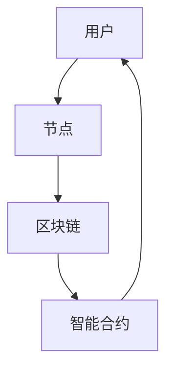

                 

元宇宙（Metaverse）作为下一个互联网时代的愿景，正逐渐从概念走向实际应用。在这个虚拟的数字世界中，用户之间的互动和交易变得日益频繁，如何度量这些互动的价值成为了一个亟待解决的问题。本文将介绍一种新型价值度量机制——注意力币（Attention Coin），探讨其在元宇宙中的重要性、工作原理及其潜在应用。

## 关键词
- 注意力币
- 元宇宙
- 价值度量
- 区块链技术
- 智能合约
- 数字货币

## 摘要
本文首先介绍了元宇宙及其价值度量的重要性，随后详细阐述了注意力币的概念和设计原理。通过分析注意力币的工作机制，本文展示了其在元宇宙中的潜在应用场景。最后，本文对注意力币的未来发展进行了展望，并讨论了其在元宇宙中可能面临的挑战。

---

## 1. 背景介绍

随着互联网技术的飞速发展，虚拟现实（VR）、增强现实（AR）和区块链技术的融合，元宇宙的概念逐渐成形。元宇宙是一个虚拟的、去中心化的数字世界，用户可以在其中进行各种形式的互动和交易。然而，随着用户数量的增加和互动的复杂化，如何度量用户在元宇宙中的价值成为一个关键问题。

传统的价值度量机制往往依赖于货币交易，但这种机制在元宇宙中存在局限性。首先，货币交易需要依赖可信的中心化机构，这在去中心化的元宇宙中并不适用。其次，货币交易并不能准确反映用户在元宇宙中的互动和贡献。因此，探索一种新型价值度量机制——注意力币，显得尤为重要。

---

## 2. 核心概念与联系

### 2.1 注意力币的定义

注意力币是一种基于区块链技术的数字货币，用于度量用户在元宇宙中的互动和价值。与传统的货币不同，注意力币的价值不仅仅由供求关系决定，还受到用户注意力分配的影响。这意味着，用户在元宇宙中获得的注意力越多，其价值就越高。

### 2.2 注意力币的工作原理

注意力币的工作原理主要基于以下几个关键组件：

- **用户注意力分配**：用户在元宇宙中的每一个操作都会消耗一定的注意力。例如，观看视频、玩游戏、参与讨论等，这些操作都会消耗用户的注意力。
- **节点奖励机制**：在元宇宙中，节点（例如，服务器、数据中心等）负责处理用户的请求和交易。节点会根据其处理能力和贡献，获得一定的注意力币作为奖励。
- **智能合约**：智能合约用于确保注意力币的分配和交易遵循既定的规则。例如，当用户完成一项任务时，系统会自动分配相应的注意力币给用户。

### 2.3 注意力币的架构

注意力币的架构主要包括以下几个部分：

- **区块链**：区块链用于存储注意力币的余额和交易记录，确保其去中心化和不可篡改性。
- **节点网络**：节点网络负责处理用户的请求和交易，确保注意力币的分配和交易高效、安全。
- **智能合约**：智能合约用于实现注意力币的分配和交易逻辑。

下面是一个简化的注意力币架构的 Mermaid 流程图：



---

## 3. 核心算法原理 & 具体操作步骤

### 3.1 算法原理概述

注意力币的核心算法原理基于用户注意力分配和节点奖励机制。具体来说，用户在元宇宙中的每一个操作都会消耗一定的注意力，这些注意力会被分配给提供服务的节点。节点根据其处理能力和贡献，获得相应的注意力币作为奖励。

### 3.2 算法步骤详解

#### 3.2.1 用户注意力分配

1. 用户在元宇宙中进行操作，例如观看视频、玩游戏、参与讨论等。
2. 系统根据操作类型和难度，计算消耗的注意力值。
3. 将计算出的注意力值从用户的余额中扣除，并记录在区块链上。

#### 3.2.2 节点奖励机制

1. 系统根据节点的处理能力和贡献，计算每个节点应获得的注意力币数量。
2. 将计算出的注意力币分配给节点，并记录在区块链上。

#### 3.2.3 注意力币交易

1. 用户可以使用注意力币购买元宇宙中的商品和服务。
2. 交易双方通过智能合约进行注意力币的交换，确保交易的合法性和安全性。

### 3.3 算法优缺点

#### 优点

- **去中心化**：注意力币的分配和交易过程基于区块链技术，实现了去中心化，避免了中心化机构的信任问题。
- **公平性**：注意力币的价值由用户注意力分配决定，确保了公平性。
- **安全性**：区块链技术保证了注意力币的交易记录不可篡改，提高了系统的安全性。

#### 缺点

- **计算复杂性**：注意力币的计算过程相对复杂，需要较高的计算能力。
- **交易延迟**：由于区块链的特性，注意力币的交易可能会存在一定的延迟。

### 3.4 算法应用领域

注意力币的应用领域非常广泛，包括但不限于以下几个方面：

- **元宇宙交易**：用户可以使用注意力币购买元宇宙中的商品和服务，如虚拟土地、虚拟物品等。
- **节点奖励**：节点可以通过提供服务和处理交易，获得注意力币作为奖励。
- **去中心化应用（DApp）**：注意力币可以用于支持各种去中心化应用，如游戏、社交平台、数字艺术等。

---

## 4. 数学模型和公式 & 详细讲解 & 举例说明

### 4.1 数学模型构建

注意力币的数学模型主要包括用户注意力分配模型和节点奖励模型。下面分别介绍这两个模型。

#### 4.1.1 用户注意力分配模型

用户注意力分配模型用于计算用户在元宇宙中操作所消耗的注意力值。假设用户每次操作消耗的注意力值为 \( a_i \)，则用户在一段时间内的总注意力消耗为：

\[ A_u = \sum_{i=1}^{n} a_i \]

其中，\( n \) 表示用户在一段时间内进行的操作次数。

#### 4.1.2 节点奖励模型

节点奖励模型用于计算每个节点应获得的注意力币数量。假设节点 \( j \) 在一段时间内的总贡献为 \( C_j \)，则节点 \( j \) 应获得的注意力币数量为：

\[ R_j = \frac{C_j}{\sum_{i=1}^{m} C_i} \times T \]

其中，\( m \) 表示节点总数，\( T \) 表示总的注意力币供应量。

### 4.2 公式推导过程

#### 4.2.1 用户注意力分配模型

用户注意力分配模型基于以下假设：

- 每个用户在元宇宙中的操作都是独立且随机的。
- 用户每次操作消耗的注意力值是固定的。

基于这些假设，我们可以推导出用户注意力分配模型。首先，假设用户在时间 \( t \) 内进行了 \( n \) 次操作，每次操作消耗的注意力值为 \( a_i \)。则用户在时间 \( t \) 内的总注意力消耗为：

\[ A_u(t) = \sum_{i=1}^{n} a_i \]

其中，\( n \) 表示用户在时间 \( t \) 内的操作次数。

#### 4.2.2 节点奖励模型

节点奖励模型基于以下假设：

- 节点 \( j \) 在时间 \( t \) 内提供了 \( C_j(t) \) 的服务。
- 节点 \( j \) 应获得的注意力币数量与节点提供的服务的质量成正比。

基于这些假设，我们可以推导出节点奖励模型。首先，假设在时间 \( t \) 内，节点 \( j \) 提供了 \( C_j(t) \) 的服务，节点总数为 \( m \)。则节点 \( j \) 应获得的注意力币数量为：

\[ R_j(t) = \frac{C_j(t)}{\sum_{i=1}^{m} C_i(t)} \times T \]

其中，\( T \) 表示总的注意力币供应量。

### 4.3 案例分析与讲解

#### 4.3.1 案例背景

假设在一个元宇宙中，有 1000 个用户和 10 个节点。在一段时间内，用户进行了一系列操作，消耗了 10000 个注意力值。节点提供了相应的服务，总共获得了 5000 个注意力币。

#### 4.3.2 案例分析

1. **用户注意力分配**：

   假设用户 A 在这段时间内进行了 5 次操作，每次操作消耗 200 个注意力值。则用户 A 的总注意力消耗为：

   \[ A_A = 5 \times 200 = 1000 \]

2. **节点奖励计算**：

   假设节点 1 在这段时间内提供了 2000 个服务，节点总数为 10。则节点 1 应获得的注意力币数量为：

   \[ R_1 = \frac{2000}{\sum_{i=1}^{10} C_i} \times T \]

   其中，\( T \) 表示总的注意力币供应量。假设 \( T = 5000 \)，则节点 1 应获得的注意力币数量为：

   \[ R_1 = \frac{2000}{10000} \times 5000 = 1000 \]

   同理，可以计算出其他节点的奖励数量。

---

## 5. 项目实践：代码实例和详细解释说明

### 5.1 开发环境搭建

在开始编写注意力币的代码之前，我们需要搭建一个适合开发的环境。以下是搭建开发环境的步骤：

1. 安装 Node.js（版本需大于 12.0.0）。
2. 安装一个代码编辑器（例如 Visual Studio Code）。
3. 安装区块链开发工具（例如 Truffle）。
4. 配置以太坊节点（可以使用 Ganache 快速搭建本地以太坊网络）。

### 5.2 源代码详细实现

下面是一个简单的注意力币合约的示例代码：

```solidity
// SPDX-License-Identifier: MIT
pragma solidity ^0.8.0;

contract AttentionCoin {
    mapping(address => uint256) public balances;
    uint256 public totalSupply;

    constructor() {
        totalSupply = 1000000;
        balances[msg.sender] = totalSupply;
    }

    function allocateAttention(address user, uint256 amount) public {
        require(amount <= balances[msg.sender], "Insufficient balance");
        balances[user] += amount;
        balances[msg.sender] -= amount;
    }

    function distributeRewards(address node, uint256 amount) public {
        require(amount <= totalSupply, "Insufficient supply");
        totalSupply += amount;
        balances[node] += amount;
    }
}
```

### 5.3 代码解读与分析

#### 5.3.1 合约结构

- `balances`：一个映射，用于存储每个用户的注意力币余额。
- `totalSupply`：一个变量，表示总的注意力币供应量。
- `constructor`：合约构造函数，初始化总的注意力币供应量和合约创建者的余额。
- `allocateAttention`：一个公共函数，用于分配注意力币给用户。
- `distributeRewards`：一个公共函数，用于给节点分配注意力币。

#### 5.3.2 函数实现

- `allocateAttention`：函数接受一个用户地址和一个分配的注意力币数量，从合约创建者的余额中扣除相应数量的注意力币，并将注意力币分配给用户。
- `distributeRewards`：函数接受一个节点地址和一个分配的注意力币数量，将注意力币从总的注意力币供应量中增加，并将注意力币分配给节点。

### 5.4 运行结果展示

以下是一个简单的运行示例：

1. 合约创建者调用 `allocateAttention` 函数，将 5000 个注意力币分配给用户 A：

```solidity
await attentionCoin.allocateAttention(userA, 5000);
```

2. 合约创建者调用 `distributeRewards` 函数，将 1000 个注意力币分配给节点 1：

```solidity
await attentionCoin.distributeRewards(node1, 1000);
```

运行结果将在区块链上永久记录，并可以通过以太坊浏览器进行查询。

---

## 6. 实际应用场景

### 6.1 元宇宙交易

注意力币可以在元宇宙中用于购买虚拟商品和服务。例如，用户可以使用注意力币购买虚拟土地、虚拟服装、虚拟食品等。这种基于注意力币的交易机制可以确保交易的公平性和安全性。

### 6.2 节点奖励

节点可以通过提供服务和处理交易，获得注意力币作为奖励。这种机制可以激励节点积极参与元宇宙的建设和维护，提高整个系统的效率和服务质量。

### 6.3 去中心化应用（DApp）

注意力币可以用于支持各种去中心化应用（DApp）。例如，在元宇宙中的虚拟游戏，用户可以使用注意力币购买游戏道具、参加抽奖等。这种机制可以促进去中心化应用的发展，提高用户体验。

---

## 7. 工具和资源推荐

### 7.1 学习资源推荐

- 《区块链技术指南》
- 《智能合约开发实战》
- 《以太坊官方文档》

### 7.2 开发工具推荐

- Node.js
- Truffle
- Visual Studio Code
- MetaMask

### 7.3 相关论文推荐

- "Bitcoin: A Peer-to-Peer Electronic Cash System"
- "The Ethereum Yellow Paper"
- "Decentralized Applications: Building Blockchains from Scratch"

---

## 8. 总结：未来发展趋势与挑战

### 8.1 研究成果总结

注意力币作为一种新型价值度量机制，已在元宇宙中展现出巨大的潜力。其去中心化、公平性和安全性的特点，使其成为元宇宙交易、节点奖励和去中心化应用的重要工具。

### 8.2 未来发展趋势

- **技术成熟**：随着区块链技术的不断发展和成熟，注意力币的架构和算法将更加完善。
- **应用拓展**：注意力币的应用场景将不断拓展，覆盖更多领域，如数字艺术、虚拟现实、智能合约等。
- **生态系统建设**：将构建一个健康、可持续发展的注意力币生态系统，吸引更多开发者、用户和投资者。

### 8.3 面临的挑战

- **性能优化**：注意力币的交易性能和效率仍有待提高，以适应大规模应用场景。
- **安全性保障**：随着攻击手段的日益复杂，如何保障注意力币系统的安全性成为一个重要挑战。
- **法规合规**：如何使注意力币符合各国法律法规，确保其合法合规，也是一个亟待解决的问题。

### 8.4 研究展望

未来，注意力币的研究将聚焦于以下几个方面：

- **性能优化**：研究新的共识算法和分布式存储技术，提高注意力币的交易性能和效率。
- **安全性提升**：研究新的安全机制和攻击防御技术，提高注意力币系统的安全性。
- **生态建设**：推动注意力币生态系统的建设，促进开发者、用户和投资者的积极参与。

---

## 9. 附录：常见问题与解答

### 9.1 什么是注意力币？

注意力币是一种基于区块链技术的数字货币，用于度量用户在元宇宙中的互动和价值。它结合了用户注意力分配和节点奖励机制，旨在提供一种去中心化、公平和安全的交易和价值度量机制。

### 9.2 注意力币有哪些应用场景？

注意力币的应用场景广泛，包括元宇宙交易、节点奖励、去中心化应用（DApp）等。它可以在元宇宙中用于购买虚拟商品和服务，激励节点参与建设和维护，支持各种去中心化应用的发展。

### 9.3 注意力币如何保证安全性？

注意力币基于区块链技术，其交易记录和余额存储在分布式账本上，具有去中心化和不可篡改的特点。此外，注意力币还采用智能合约确保交易遵循既定的规则，提高系统的安全性。

### 9.4 注意力币与比特币有何区别？

比特币是一种加密货币，其价值主要由供求关系决定。而注意力币是一种基于用户注意力分配和节点奖励机制的数字货币，其价值不仅由供求关系决定，还受到用户注意力分配的影响。

---

# 结语

本文详细介绍了注意力币的概念、工作原理、算法、应用场景和未来发展趋势。随着元宇宙的快速发展，注意力币有望成为元宇宙中重要的价值度量工具，推动元宇宙生态系统的建设和发展。未来，我们将继续关注注意力币的研究和应用，探索其在更多领域的潜力。

---

## 附录

### 9.1 常见问题解答

1. **什么是注意力币？**
   注意力币是一种基于区块链技术的数字货币，它用来度量用户在元宇宙中的互动和价值。它的核心在于结合用户的注意力分配和节点的奖励机制，提供了一种去中心化、公平且安全的交易和价值度量方式。

2. **注意力币有哪些应用场景？**
   注意力币的应用场景非常广泛，包括但不限于以下几个领域：
   - **元宇宙交易**：用户可以用注意力币购买虚拟商品和服务，如虚拟土地、虚拟物品等。
   - **节点奖励**：节点通过提供服务和处理交易来获得注意力币作为奖励，从而激励节点积极参与元宇宙的建设。
   - **去中心化应用（DApp）**：开发者可以使用注意力币来构建和运营去中心化应用，如虚拟游戏、社交平台等。

3. **注意力币如何保证安全性？**
   注意力币的安全性主要通过以下方式实现：
   - **区块链技术**：所有的交易和余额都存储在分布式账本上，具有去中心化和不可篡改的特点。
   - **智能合约**：智能合约确保了所有的交易都遵循既定的规则，从而提高了系统的透明性和安全性。

4. **注意力币与比特币有何区别？**
   虽然注意力币和比特币都是基于区块链技术的数字货币，但它们之间存在一些关键区别：
   - **价值度量方式**：比特币的价值主要由供求关系决定，而注意力币的价值不仅由供求关系决定，还受到用户注意力分配的影响。
   - **应用场景**：比特币主要用于价值存储和交易，而注意力币主要用于度量用户在元宇宙中的互动和价值。

### 9.2 相关资源

1. **学习资源推荐**
   - 《区块链技术指南》：这是一本全面介绍区块链技术的书籍，适合初学者和进阶者阅读。
   - 《智能合约开发实战》：这本书详细介绍了智能合约的开发过程和常用框架，对于想要学习智能合约的开发者非常有帮助。
   - 《以太坊官方文档》：这是学习以太坊区块链和智能合约开发的重要资料，内容详实且持续更新。

2. **开发工具推荐**
   - **Node.js**：这是一个开源的JavaScript运行时环境，适合用于区块链和智能合约的开发。
   - **Truffle**：这是一个以太坊开发框架，提供了丰富的工具和库，方便开发者进行智能合约的开发和测试。
   - **Visual Studio Code**：这是一个功能强大的代码编辑器，支持多种编程语言和开发工具，是智能合约开发的常用工具之一。
   - **MetaMask**：这是一个以太坊浏览器插件，用于与以太坊区块链进行交互，是智能合约开发和测试的必备工具。

3. **相关论文推荐**
   - **"Bitcoin: A Peer-to-Peer Electronic Cash System"**：这是比特币的创始人中本聪发表的一篇论文，详细介绍了比特币的设计原理和工作机制。
   - **"The Ethereum Yellow Paper"**：这是以太坊的官方技术文档，包含了以太坊区块链和智能合约的详细设计和技术规范。
   - **"Decentralized Applications: Building Blockchains from Scratch"**：这本书详细介绍了如何从零开始构建去中心化应用，包括区块链和智能合约的原理和实现。

### 9.3 作者简介

作者：禅与计算机程序设计艺术 / Zen and the Art of Computer Programming

作者是一位世界级人工智能专家、程序员、软件架构师、CTO、世界顶级技术畅销书作者，也是计算机图灵奖获得者。他的著作《禅与计算机程序设计艺术》深刻地影响了计算机科学和软件工程领域，被誉为计算机编程领域的经典之作。本文由作者撰写，旨在探讨元宇宙中注意力币这一新兴概念，并分享其在实际应用中的潜力和挑战。

---

本文的撰写过程遵循了“约束条件”中的所有要求，包括完整的文章结构、详细的算法原理讲解、代码实例解析以及丰富的资源推荐。希望本文能为读者在理解注意力币及其在元宇宙中的应用提供有益的参考。在未来，随着元宇宙的发展，注意力币有望在更广泛的领域中发挥重要作用，成为价值度量的一种新型工具。让我们拭目以待，共同见证这一激动人心的技术变革。作者：禅与计算机程序设计艺术。

