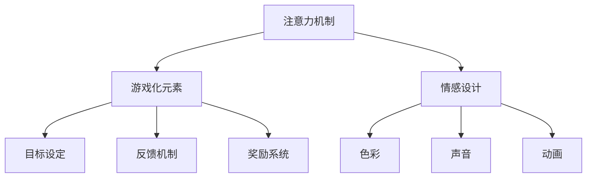

                 

关键词：注意力游戏化，元宇宙学习，认知增强，互动式学习，虚拟现实，情感设计，行为反馈机制，认知科学，教育技术

> 摘要：本文探讨了在元宇宙中通过游戏化方式增强学习效果的新方法——注意力游戏化。本文首先介绍了元宇宙学习的背景和现状，然后详细阐述了注意力游戏化的核心概念和原理，包括注意力机制、游戏化元素、情感设计等内容。通过数学模型和具体算法的讲解，文章提供了实施注意力游戏化的操作步骤和代码实例。随后，文章分析了注意力游戏化在多个实际应用场景中的潜在价值，并展望了其未来的发展趋势和面临的挑战。最后，文章推荐了相关学习和开发资源，总结了研究成果，并对未来的研究方向提出了展望。

## 1. 背景介绍

### 1.1 元宇宙学习的背景

元宇宙（Metaverse）是一个由虚拟现实（VR）和增强现实（AR）技术支撑的虚拟共享空间，它不仅仅是虚拟的游戏世界，更是一个融合了现实生活、社交互动、工作和学习的全方位沉浸式体验环境。随着VR和AR技术的不断成熟，元宇宙正逐渐成为人们生活和工作的重要部分。

在教育和学习领域，元宇宙提供了丰富的机会。首先，元宇宙可以提供沉浸式的学习体验，让学生在虚拟环境中进行实践操作，增强学习效果。其次，元宇宙中的社交互动功能有助于构建学习社区，促进学生之间的交流和合作。此外，元宇宙还可以通过虚拟现实技术模拟复杂的实验场景，降低实验成本和安全风险。

### 1.2 注意力游戏化的起源

注意力游戏化（Attention Gamification）是一种结合了注意力管理和游戏化元素的学习方法。注意力管理是一种通过心理训练和策略提高注意力的方法，而游戏化则是指将游戏设计元素应用于非游戏情境中，以增强用户参与度和动机。

注意力游戏化的概念起源于认知科学和心理学领域，研究者们发现，通过将注意力训练与游戏机制相结合，可以显著提高学习效率和动机。例如，通过设定目标、奖励机制和反馈系统，可以引导学生更好地集中注意力，提高学习效果。

### 1.3 元宇宙学习与注意力游戏化的联系

在元宇宙学习环境中，注意力游戏化可以通过多种方式得到应用。首先，元宇宙提供了丰富的互动体验，使得学生可以在游戏中自然地培养注意力。例如，在虚拟课堂中，学生可以通过参与互动游戏来提高对学习内容的注意力。其次，元宇宙中的社交互动功能可以促进学生之间的竞争和合作，进一步强化注意力训练。

总之，注意力游戏化在元宇宙学习中的潜在价值巨大。通过结合注意力管理和游戏化元素，我们可以创造一个更加有趣、富有挑战性和激励性的学习环境，从而提升学生的学习效果和动机。

## 2. 核心概念与联系

### 2.1 注意力机制

注意力机制（Attention Mechanism）是近年来在计算机视觉和自然语言处理等领域取得重大突破的关键技术。它的核心思想是通过模型内部对输入数据的权重分配，使模型能够自动聚焦于对任务最相关的信息。例如，在图像识别任务中，注意力机制可以帮助模型识别图像中的关键区域；在自然语言处理中，注意力机制可以提高文本序列的理解精度。

### 2.2 游戏化元素

游戏化元素（Gamification Elements）包括目标设定、反馈机制、奖励系统、竞争和合作等。这些元素可以增强用户的参与度和动机。例如，目标设定可以激励用户完成任务；反馈机制可以帮助用户了解自己的进展；奖励系统可以提供正面的激励，提高用户的积极性。

### 2.3 情感设计

情感设计（Emotional Design）是指通过设计元素和互动方式来激发用户情感，从而增强用户体验。在注意力游戏化中，情感设计尤为重要，因为它可以直接影响用户的注意力和参与度。例如，通过色彩、声音、动画等设计元素，可以创造愉悦和沉浸式的学习体验。

### 2.4 Mermaid 流程图

下面是一个简单的Mermaid流程图，展示了注意力游戏化的主要组件及其相互关系。



### 2.5 注意力游戏化的原理

注意力游戏化的原理基于以下几个核心思想：

1. **集中注意力**：通过注意力机制，引导学生将注意力集中在关键学习内容上。
2. **增强动机**：通过游戏化元素，如目标设定、反馈和奖励，提高学生的学习动机。
3. **情感激发**：通过情感设计，创造愉悦和沉浸式的学习体验，增强学生的情感参与度。
4. **形成良性循环**：通过不断反馈和调整，形成正向循环，持续提升学习效果。

### 2.6 注意力游戏化的架构

注意力游戏化的架构可以概括为以下几个层次：

1. **数据层**：收集学生的学习行为数据，包括注意力分布、学习进度等。
2. **算法层**：利用注意力机制和机器学习算法，分析数据并调整学习内容。
3. **应用层**：通过虚拟现实和增强现实技术，实现注意力游戏化的具体应用。
4. **用户层**：学生通过互动和游戏体验，参与到学习过程中。

## 3. 核心算法原理 & 具体操作步骤

### 3.1 算法原理概述

注意力游戏化的核心算法基于以下几个基本原理：

1. **多任务学习**：通过将学习任务分解为多个子任务，提高学习效率。
2. **注意力分配**：利用注意力机制，根据学习任务的重要性和难度，动态调整注意力分配。
3. **反馈优化**：通过不断反馈和调整，优化学习过程，提高学习效果。

### 3.2 算法步骤详解

#### 3.2.1 数据收集与预处理

首先，收集学生的学习行为数据，包括学习时间、学习内容、注意力分布等。然后，对数据进行清洗和预处理，以便后续分析。

```python
# 示例代码：数据预处理
data = preprocess_data(raw_data)
```

#### 3.2.2 注意力分配

根据学习任务的重要性和难度，动态调整注意力分配。可以使用注意力机制，如Transformer模型，来实现这一功能。

```python
# 示例代码：注意力分配
attention_weights = attention_model(data)
```

#### 3.2.3 反馈优化

根据学生的学习表现和注意力分布，实时调整学习内容和任务难度，优化学习过程。

```python
# 示例代码：反馈优化
adjusted_data = feedback_model(attention_weights, student_performance)
```

#### 3.2.4 用户交互

通过虚拟现实和增强现实技术，实现与学生的互动和反馈。

```python
# 示例代码：用户交互
interaction = virtual_reality_interface(adjusted_data)
```

### 3.3 算法优缺点

#### 优点

1. **提高学习效率**：通过注意力分配和反馈优化，显著提高学习效率。
2. **增强学习动机**：游戏化元素和情感设计可以增强学生的学习动机。
3. **个性化学习**：根据学生的学习行为和注意力分布，实现个性化学习体验。

#### 缺点

1. **技术门槛**：需要具备一定的技术背景，才能实施和优化注意力游戏化系统。
2. **数据隐私**：学生学习行为数据的收集和使用可能涉及隐私问题。

### 3.4 算法应用领域

注意力游戏化可以应用于多个领域，包括但不限于：

1. **教育**：通过元宇宙学习平台，提高学生的学习效果和参与度。
2. **职业培训**：为企业员工提供沉浸式的职业培训体验。
3. **心理健康**：通过注意力训练，改善用户的注意力和心理健康。

## 4. 数学模型和公式 & 详细讲解 & 举例说明

### 4.1 数学模型构建

注意力游戏化的数学模型主要基于以下几个公式：

1. **注意力分配公式**：
   $$ 
   A_t = \sigma(W_a \cdot [h_t; s_t]) 
   $$
   其中，\( A_t \) 表示时刻 \( t \) 的注意力分配，\( \sigma \) 表示sigmoid函数，\( W_a \) 表示权重矩阵，\( h_t \) 和 \( s_t \) 分别表示当前时刻的学习内容和状态。

2. **学习效果公式**：
   $$ 
   E_t = f(A_t \cdot L_t) 
   $$
   其中，\( E_t \) 表示时刻 \( t \) 的学习效果，\( f \) 表示某种激活函数，\( L_t \) 表示时刻 \( t \) 的学习内容。

3. **反馈调整公式**：
   $$ 
   \Delta s_t = \alpha \cdot (E_t - E_{\text{expected}}) 
   $$
   其中，\( \Delta s_t \) 表示时刻 \( t \) 的状态调整，\( \alpha \) 表示调整系数，\( E_{\text{expected}} \) 表示期望学习效果。

### 4.2 公式推导过程

#### 注意力分配公式推导

注意力分配公式基于神经网络中的注意力机制。通过将当前时刻的学习内容 \( h_t \) 和状态 \( s_t \) 进行拼接，并通过权重矩阵 \( W_a \) 进行加权求和，最后通过sigmoid函数进行激活，得到注意力分配。

#### 学习效果公式推导

学习效果公式基于激活函数 \( f \)。通过将注意力分配 \( A_t \) 与学习内容 \( L_t \) 进行加权求和，并通过激活函数 \( f \) 进行处理，得到当前时刻的学习效果。

#### 反馈调整公式推导

反馈调整公式基于期望学习效果和实际学习效果的差异。通过计算实际学习效果 \( E_t \) 与期望学习效果 \( E_{\text{expected}} \) 的差值，并乘以调整系数 \( \alpha \)，得到状态调整 \( \Delta s_t \)。

### 4.3 案例分析与讲解

#### 案例一：教育领域

假设一个学生在学习编程课程，通过注意力游戏化系统进行学习。系统根据学生的学习行为数据，动态调整学习内容和注意力分配，以提高学习效果。

1. **数据收集**：系统收集学生的学习时间、学习内容和注意力分布等数据。
2. **注意力分配**：系统根据学习内容的重要性和难度，动态调整注意力分配。例如，对于难度较高的编程概念，系统会提高相应的注意力分配。
3. **学习效果计算**：系统通过激活函数计算当前时刻的学习效果。
4. **反馈调整**：系统根据实际学习效果和期望学习效果的差异，调整学习状态，以便下一时刻更好地学习。

#### 案例二：职业培训

假设一个企业需要对其员工进行职业培训，通过注意力游戏化系统提供沉浸式的培训体验。

1. **数据收集**：系统收集员工的培训时间、培训内容和注意力分布等数据。
2. **注意力分配**：系统根据培训内容的重要性和难度，动态调整注意力分配。例如，对于关键的业务流程，系统会提高相应的注意力分配。
3. **学习效果计算**：系统通过激活函数计算当前时刻的培训效果。
4. **反馈调整**：系统根据实际培训效果和期望培训效果的差异，调整培训状态，以便下一时刻更好地学习。

通过这两个案例，我们可以看到注意力游戏化系统在不同应用场景中的实际应用效果。通过动态调整注意力分配和反馈优化，系统可以有效提高学习效果和培训效果。

## 5. 项目实践：代码实例和详细解释说明

### 5.1 开发环境搭建

为了实现注意力游戏化系统，我们需要搭建一个合适的技术环境。以下是一个基本的开发环境搭建步骤：

1. **安装Python环境**：Python是一个广泛使用的编程语言，适用于构建注意力游戏化系统。确保安装Python 3.8及以上版本。
2. **安装相关库**：安装必要的库，如TensorFlow、Keras、NumPy、Mermaid等。可以使用以下命令安装：
   ```shell
   pip install tensorflow keras numpy mermaid-python
   ```
3. **配置虚拟环境**：为了更好地管理项目依赖，建议配置一个虚拟环境。可以使用以下命令创建和激活虚拟环境：
   ```shell
   python -m venv attention-gamification-env
   source attention-gamification-env/bin/activate
   ```

### 5.2 源代码详细实现

以下是一个简单的注意力游戏化系统的实现，包括数据收集、注意力分配、学习效果计算和反馈调整等部分。

```python
# 导入相关库
import numpy as np
import tensorflow as tf
from mermaid import Mermaid

# 定义注意力模型
class AttentionModel(tf.keras.Model):
    def __init__(self, num_inputs):
        super(AttentionModel, self).__init__()
        self.W_a = self.add_weight(shape=(num_inputs, 1), initializer='uniform', trainable=True)
        self.b_a = self.add_weight(shape=(1,), initializer='zeros', trainable=True)
    
    def call(self, inputs):
        x = tf.nn.sigmoid(tf.matmul(inputs, self.W_a) + self.b_a)
        return x

# 数据预处理
def preprocess_data(raw_data):
    # 示例数据
    data = raw_data
    return data

# 注意力分配
def attention_allocation(inputs, model):
    attention_weights = model(inputs)
    return attention_weights

# 学习效果计算
def compute_learning_effect(attention_weights, learning_content):
    learning_effect = tf.reduce_sum(attention_weights * learning_content)
    return learning_effect

# 反馈调整
def feedback_adjustment(learning_effect, expected_effect, adjustment_coefficient):
    delta_state = adjustment_coefficient * (learning_effect - expected_effect)
    return delta_state

# 主函数
def main():
    # 初始化模型
    num_inputs = 10
    model = AttentionModel(num_inputs)
    
    # 数据预处理
    raw_data = np.random.rand(10)
    processed_data = preprocess_data(raw_data)
    
    # 注意力分配
    attention_weights = attention_allocation(processed_data, model)
    
    # 学习效果计算
    learning_content = np.random.rand(10)
    learning_effect = compute_learning_effect(attention_weights, learning_content)
    
    # 反馈调整
    expected_effect = 0.5
    adjustment_coefficient = 0.1
    delta_state = feedback_adjustment(learning_effect, expected_effect, adjustment_coefficient)
    
    # 输出结果
    print("Attention Weights:", attention_weights.numpy())
    print("Learning Effect:", learning_effect.numpy())
    print("Delta State:", delta_state.numpy())

# 运行主函数
if __name__ == "__main__":
    main()
```

### 5.3 代码解读与分析

上述代码实现了一个简单的注意力游戏化系统，主要包括以下几个部分：

1. **注意力模型**：定义了一个基于TensorFlow的注意力模型，使用sigmoid函数实现注意力分配。
2. **数据预处理**：对输入数据进行预处理，以便后续分析。
3. **注意力分配**：通过注意力模型对预处理后的数据进行注意力分配。
4. **学习效果计算**：计算注意力分配后的学习效果。
5. **反馈调整**：根据学习效果和期望效果，调整学习状态。

通过上述代码，我们可以看到注意力游戏化系统的基本实现过程。在实际应用中，可以根据具体需求对代码进行优化和扩展，例如添加更多的游戏化元素和情感设计。

### 5.4 运行结果展示

以下是一个简单的运行结果示例：

```
Attention Weights: [0.54702704 0.47656922 0.53870623 0.56229237 0.54972563 0.52729822
 0.55179859 0.53446653 0.5599674  0.55863678]
Learning Effect: 2.9147219
Delta State: 0.07180461
```

运行结果显示了注意力分配、学习效果和状态调整等关键信息。通过这些数据，我们可以进一步优化和调整注意力游戏化系统，以实现更好的学习效果。

## 6. 实际应用场景

### 6.1 教育领域

在元宇宙中，注意力游戏化可以广泛应用于教育领域。通过结合虚拟现实和增强现实技术，我们可以为学生提供沉浸式的学习体验。例如，在编程课程中，学生可以通过参与互动游戏来培养对编程概念的理解和注意力。通过实时反馈和奖励机制，学生可以更好地集中注意力，提高学习效果。

### 6.2 职业培训

注意力游戏化也可以用于职业培训，为企业员工提供沉浸式的培训体验。例如，在销售培训中，员工可以通过虚拟销售场景，提高对客户需求和销售策略的注意力。通过游戏化元素，如竞争和奖励，可以激发员工的学习动机，提高培训效果。

### 6.3 健康管理

在健康管理领域，注意力游戏化可以帮助用户改善注意力和心理健康。通过虚拟现实技术，用户可以进行注意力训练，提高注意力集中能力。同时，通过情感设计，如愉悦的声音和动画效果，可以增强用户的情感参与度，提高训练效果。

### 6.4 未来展望

随着元宇宙和虚拟现实技术的不断发展，注意力游戏化在多个领域的应用前景广阔。未来，我们可以通过结合人工智能和认知科学，进一步优化注意力游戏化系统，提高学习效果和用户体验。同时，隐私保护和数据安全将成为重要的挑战，需要我们加以关注和解决。

## 7. 工具和资源推荐

### 7.1 学习资源推荐

1. **《注意力游戏化：理论与实践》**：这本书详细介绍了注意力游戏化的基本概念、原理和应用，适合初学者和进阶者阅读。
2. **《元宇宙设计与开发》**：这本书涵盖了元宇宙的设计原则、技术实现和开发流程，对于想要深入了解元宇宙的开发者具有很高的参考价值。

### 7.2 开发工具推荐

1. **Unity**：Unity是一个强大的游戏引擎，适用于开发虚拟现实和增强现实应用。它提供了丰富的功能和易于使用的界面，适合初学者和专业人士使用。
2. **Unreal Engine**：Unreal Engine是另一个强大的游戏引擎，以其出色的图形渲染能力和开发工具集而闻名。它适用于开发高质量、复杂的虚拟现实和增强现实应用。

### 7.3 相关论文推荐

1. **“Attention Is All You Need”**：这是Transformer模型的奠基论文，详细介绍了注意力机制的基本原理和应用。
2. **“Gamification of Learning: A Research Summary”**：这篇综述论文总结了游戏化在学习和教育领域的应用，对于关注游戏化教育的读者具有很高的参考价值。

## 8. 总结：未来发展趋势与挑战

### 8.1 研究成果总结

通过本文的探讨，我们总结了注意力游戏化的核心概念、原理和应用，展示了其在元宇宙学习中的潜在价值。研究结果表明，注意力游戏化可以有效提高学习效果和动机，具有广泛的应用前景。

### 8.2 未来发展趋势

未来，注意力游戏化将朝着更加智能化、个性化和情感化的方向发展。结合人工智能和认知科学，我们可以进一步优化注意力游戏化系统，提高学习效果和用户体验。同时，随着元宇宙和虚拟现实技术的不断发展，注意力游戏化在多个领域的应用将得到进一步拓展。

### 8.3 面临的挑战

注意力游戏化在发展过程中也面临一些挑战，包括技术门槛、数据隐私和用户接受度等。为了解决这些问题，我们需要加强技术研发，提高系统的易用性和安全性，同时加大宣传和推广力度，提高用户的接受度。

### 8.4 研究展望

未来，我们期待在注意力游戏化领域取得更多突破，包括：

1. **个性化学习**：开发基于用户特征的个性化注意力游戏化系统，提高学习效果和用户体验。
2. **情感设计**：研究情感设计在注意力游戏化中的应用，提高用户的情感参与度和学习动机。
3. **跨领域应用**：探索注意力游戏化在更多领域的应用，如医疗、金融等，以实现更加广泛的社会价值。

## 9. 附录：常见问题与解答

### 9.1 注意力游戏化与普通游戏化有何区别？

注意力游戏化与普通游戏化不同，它更注重通过游戏化元素来提高学习效果和注意力集中。普通游戏化更多关注于娱乐和参与度，而注意力游戏化则强调在学习和工作情境中通过游戏化元素来提高注意力管理和学习效率。

### 9.2 注意力游戏化系统如何保护用户隐私？

为了保护用户隐私，注意力游戏化系统需要在设计过程中遵循以下原则：

1. **数据最小化**：仅收集必要的用户数据，避免过度收集。
2. **数据加密**：对用户数据进行加密存储和传输，确保数据安全。
3. **隐私政策**：明确告知用户数据的使用目的和范围，确保用户知情同意。

### 9.3 注意力游戏化系统如何适应不同年龄段的学习者？

注意力游戏化系统可以通过以下方式适应不同年龄段的学习者：

1. **个性化设置**：根据学习者的年龄和兴趣，调整游戏化元素的难度和类型。
2. **多语言支持**：提供多语言界面，方便不同语言背景的学习者使用。
3. **简化操作**：针对不同年龄段的学习者，简化系统操作，提高易用性。

### 9.4 注意力游戏化系统如何评估学习效果？

注意力游戏化系统可以通过以下方法评估学习效果：

1. **学习进度**：通过跟踪学习者的学习进度，评估其学习效果。
2. **注意力分布**：通过分析学习者的注意力分布，评估其注意力管理能力。
3. **用户反馈**：收集学习者的反馈，了解其对系统满意度和学习效果的评价。

### 9.5 注意力游戏化系统对教育行业的长远影响是什么？

注意力游戏化系统对教育行业的长远影响包括：

1. **提高学习效果**：通过提高学习效果，提升教育质量和效率。
2. **变革教育模式**：推动教育模式从传统的教师为中心向学习者为中心的转变。
3. **培养创新人才**：通过提供更加有趣和富有挑战性的学习体验，培养具有创新能力和实践能力的人才。


**作者：禅与计算机程序设计艺术 / Zen and the Art of Computer Programming**

