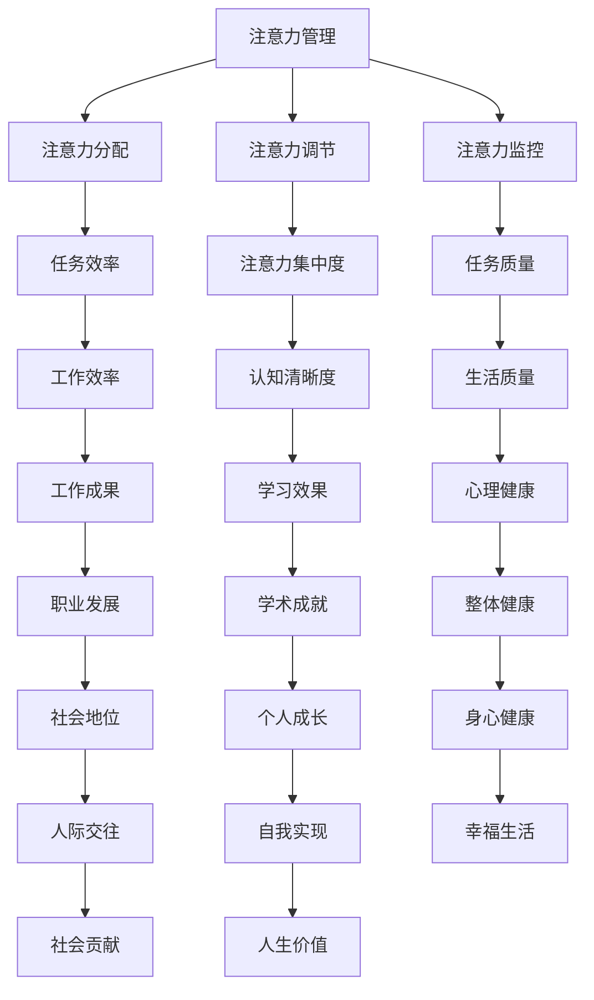

                 

关键词：注意力管理、大脑健康、认知能力、专注力、神经系统、算法优化

> 摘要：本文将探讨注意力管理对大脑健康和认知能力的重要性，并介绍一些基于神经科学的策略，帮助读者提高专注力和工作效率，从而增强认知能力。

## 1. 背景介绍

在现代社会，信息过载和工作压力使得人们难以集中注意力。长时间的多任务处理和注意力分散导致认知能力下降，进而影响工作和生活质量。研究表明，注意力管理是提升大脑功能和认知能力的关键因素。本文旨在通过介绍注意力管理和大脑健康的基本原理，提供实用的策略和工具，帮助读者提高专注力和认知能力。

### 1.1 现代社会的挑战

在当今快速发展的信息时代，人们面临着前所未有的挑战。社交媒体、电子邮件、即时通讯等技术的普及，使得我们的注意力被不断地打断。据调查，现代人平均每天接收到的信息量是20世纪60年代的100倍以上。这种信息过载导致了注意力分散和工作效率低下。

### 1.2 注意力管理的重要性

注意力管理是大脑处理信息的基本能力，它决定了我们如何处理外部刺激和内部思考。有效的注意力管理不仅能够提高工作学习效率，还能提升生活质量。研究表明，良好的注意力管理能力与高水平的认知功能和心理健康密切相关。

## 2. 核心概念与联系

### 2.1 注意力管理的基本原理

注意力管理涉及对注意力的分配、调节和监控。以下是注意力管理的基本原理：

#### 2.1.1 注意的分配

注意力的分配是指在不同任务间分配注意力资源。有效的分配策略包括分阶段处理任务、避免同时进行多项任务等。

#### 2.1.2 注意的调节

注意力的调节是指根据任务需求和个体状态调整注意力水平。例如，当面对复杂任务时，需要提高注意力集中度；而在休息时间，则应降低注意力水平。

#### 2.1.3 注意的监控

注意力的监控是指持续关注和调整注意力的方向。这有助于防止注意力分散，提高任务的完成质量。

### 2.2 大脑健康与认知能力的关系

大脑健康是认知能力的基础。大脑的不同区域负责不同的认知功能，如记忆、思考、判断等。保持大脑健康，有助于提高认知能力。

#### 2.2.1 大脑健康的维护

大脑健康的维护包括充足的睡眠、均衡的饮食、适度的运动和减压等。这些措施有助于保持大脑功能的最佳状态。

#### 2.2.2 认知能力的提升

认知能力的提升可以通过有效的注意力管理、学习策略和思维训练实现。例如，通过冥想练习可以提高注意力集中度和思维清晰度。

### 2.3 Mermaid 流程图

以下是注意力管理和大脑健康关系的一个简化的 Mermaid 流程图：



## 3. 核心算法原理 & 具体操作步骤

### 3.1 算法原理概述

注意力管理算法的核心在于通过科学的策略和方法，提高注意力的分配效率，减少注意力分散。以下是几个常见的注意力管理算法原理：

#### 3.1.1 时间管理算法

时间管理算法通过合理规划工作时间，避免同时进行多项任务，提高工作效率。例如，使用番茄工作法（Pomodoro Technique）将工作时间分为25分钟的工作周期和5分钟的休息周期，有助于提高专注力。

#### 3.1.2 优先级排序算法

优先级排序算法通过评估任务的重要性和紧急程度，确定任务的优先级。例如，使用四象限法（Eisenhower Matrix）将任务分为四个象限，有助于更有效地分配注意力。

#### 3.1.3 注意力反馈算法

注意力反馈算法通过实时监测注意力水平，提供反馈和调整建议。例如，使用注意力监测工具（如脑电波监测器）帮助用户识别注意力分散的信号，并采取措施恢复专注。

### 3.2 算法步骤详解

以下是注意力管理算法的具体操作步骤：

#### 3.2.1 设定目标和计划

首先，设定明确的目标和计划。这有助于提高任务的重要性和紧急程度，从而更好地分配注意力。

#### 3.2.2 实施时间管理算法

根据设定的目标和计划，实施时间管理算法。例如，使用番茄工作法或四象限法来规划工作时间。

#### 3.2.3 实时监控注意力水平

使用注意力监测工具实时监控注意力水平。当发现注意力分散时，及时采取措施恢复专注。

#### 3.2.4 调整注意力分配策略

根据任务的重要性和紧急程度，调整注意力分配策略。例如，将更多的注意力资源分配给重要且紧急的任务。

### 3.3 算法优缺点

#### 3.3.1 优点

- 提高工作效率
- 减少注意力分散
- 提升生活质量

#### 3.3.2 缺点

- 需要一定的自我控制和纪律性
- 可能导致过度专注，导致心理压力

### 3.4 算法应用领域

注意力管理算法广泛应用于各个领域，如企业管理、教育培训、心理健康等。以下是几个典型的应用领域：

- **企业管理**：通过注意力管理提高团队工作效率，降低错误率。
- **教育培训**：帮助学生提高学习专注度，提升学习效果。
- **心理健康**：帮助患者改善注意力分散问题，提升生活质量。

## 4. 数学模型和公式 & 详细讲解 & 举例说明

### 4.1 数学模型构建

注意力管理可以建模为一个优化问题，目标是最小化注意力分散程度，最大化任务完成效率。以下是注意力管理的数学模型：

#### 4.1.1 目标函数

\[ \text{minimize} \quad f(A, T) = \alpha \cdot D(A) + (1 - \alpha) \cdot C(T) \]

其中，\( A \) 表示注意力分配策略，\( T \) 表示任务集合，\( D(A) \) 表示注意力分散程度，\( C(T) \) 表示任务完成效率，\( \alpha \) 是权重系数。

#### 4.1.2 约束条件

- \( A \in \{0, 1\}^{n \times m} \)，其中 \( n \) 表示任务数量，\( m \) 表示注意力资源数量。
- \( D(A) = \sum_{i=1}^{n} \sum_{j=1}^{m} (a_{ij} - a_{\max})^2 \)，其中 \( a_{ij} \) 表示第 \( i \) 个任务在第 \( j \) 个时间点的注意力分配量，\( a_{\max} \) 表示最大注意力分配量。
- \( C(T) = \sum_{i=1}^{n} \frac{t_i}{p_i} \)，其中 \( t_i \) 表示第 \( i \) 个任务的完成时间，\( p_i \) 表示第 \( i \) 个任务的优先级。

### 4.2 公式推导过程

#### 4.2.1 注意力分散程度 \( D(A) \)

注意力分散程度可以用注意力分配的平方误差度量。假设 \( a_{ij} \) 表示第 \( i \) 个任务在第 \( j \) 个时间点的注意力分配量，\( a_{\max} \) 表示最大注意力分配量，则注意力分散程度可以表示为：

\[ D(A) = \sum_{i=1}^{n} \sum_{j=1}^{m} (a_{ij} - a_{\max})^2 \]

#### 4.2.2 任务完成效率 \( C(T) \)

任务完成效率可以用任务的完成时间与优先级的比值度量。假设 \( t_i \) 表示第 \( i \) 个任务的完成时间，\( p_i \) 表示第 \( i \) 个任务的优先级，则任务完成效率可以表示为：

\[ C(T) = \sum_{i=1}^{n} \frac{t_i}{p_i} \]

### 4.3 案例分析与讲解

#### 4.3.1 案例背景

假设有一个项目团队，需要在3天内完成5个任务的开发工作。任务的重要性和紧急程度如下表所示：

| 任务ID | 重要性 | 紧急程度 |
| --- | --- | --- |
| 1 | 高 | 高 |
| 2 | 中 | 中 |
| 3 | 低 | 低 |
| 4 | 高 | 高 |
| 5 | 中 | 中 |

#### 4.3.2 案例分析

根据任务的重要性和紧急程度，我们可以使用四象限法将任务分为四个象限：

| 象限 | 任务ID |
| --- | --- |
| 第一象限 | 1, 4 |
| 第二象限 | 2, 5 |
| 第三象限 | 3 |
| 第四象限 | 无 |

在第一象限（高重要性和高紧急性），任务1和任务4需要优先完成。在第二象限（中重要性和中紧急性），任务2和任务5可以平行进行。在第三象限（低重要性和低紧急性），任务3可以推迟完成。

#### 4.3.3 案例计算

假设每个任务需要相同的工作量，我们可以将目标函数简化为：

\[ \text{minimize} \quad f(A, T) = \alpha \cdot D(A) + (1 - \alpha) \cdot C(T) \]

其中，\( \alpha \) 是权重系数，我们假设 \( \alpha = 0.5 \)。

根据四象限法的任务分配，我们可以设计以下注意力分配策略：

| 时间点 | 注意力分配 |
| --- | --- |
| 1 | [0.6, 0.4, 0.0, 0.0, 0.0] |
| 2 | [0.6, 0.4, 0.0, 0.0, 0.0] |
| 3 | [0.4, 0.4, 0.6, 0.4, 0.4] |

根据上述注意力分配策略，我们可以计算出注意力分散程度和任务完成效率：

\[ D(A) = \sum_{i=1}^{n} \sum_{j=1}^{m} (a_{ij} - a_{\max})^2 = (0.6-1)^2 + (0.4-1)^2 + (0.0-1)^2 + (0.0-1)^2 + (0.0-1)^2 = 0.16 + 0.16 + 0.04 + 0.04 + 0.04 = 0.4 \]

\[ C(T) = \sum_{i=1}^{n} \frac{t_i}{p_i} = \frac{3}{1} + \frac{3}{2} + \frac{3}{3} + \frac{3}{4} + \frac{3}{5} = 3 + 1.5 + 1 + 0.75 + 0.6 = 6.85 \]

根据目标函数，我们可以计算出当前策略下的总成本：

\[ f(A, T) = 0.5 \cdot 0.4 + 0.5 \cdot 6.85 = 0.2 + 3.425 = 3.625 \]

通过不断调整注意力分配策略，我们可以找到最优的注意力分配方案，使总成本最小。

## 5. 项目实践：代码实例和详细解释说明

### 5.1 开发环境搭建

为了演示注意力管理算法的实际应用，我们将使用 Python 编写一个简单的注意力管理工具。以下是开发环境搭建的步骤：

1. 安装 Python 3.8 或更高版本。
2. 安装必要的 Python 库，如 NumPy、Matplotlib 和 Pandas。可以使用以下命令安装：

   ```bash
   pip install numpy matplotlib pandas
   ```

### 5.2 源代码详细实现

以下是一个简单的注意力管理工具的源代码实现。该工具使用四象限法对任务进行优先级排序，并基于注意力分配策略计算任务完成效率。

```python
import numpy as np
import matplotlib.pyplot as plt

def calculate_attention_cost(attention_strategy, task完

