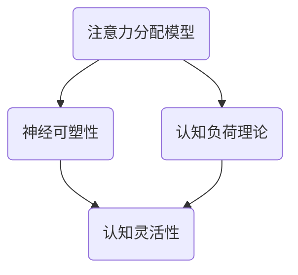

                 

关键词：注意力管理、大脑训练、认知灵活性、专注力、实践方法、技术工具

> 摘要：本文将探讨注意力管理在人工智能领域中的重要性，以及如何通过科学的训练方法提高大脑的认知灵活性和专注力。文章将通过详细的理论阐述、实践案例以及工具推荐，为读者提供一套完整的大脑训练指南。

## 1. 背景介绍

在当今高速发展的信息时代，人工智能技术的不断突破改变了我们的生活方式和工作模式。然而，随着技术的进步，我们也面临着新的挑战，那就是如何保持高效的认知能力和专注力。注意力管理成为了这个时代不可或缺的一部分。

### 注意力管理的重要性

注意力管理是指通过一系列的方法和策略，提高我们在面对复杂任务时的集中力和持久力。研究表明，良好的注意力管理能力不仅可以提高工作效率，还能改善生活质量。在人工智能领域，这种能力尤为重要，因为人工智能开发不仅需要高度集中的注意力，还需要灵活的思维和快速的适应能力。

### 认知灵活性

认知灵活性是指大脑能够灵活地适应新环境和不同任务的能力。它涉及多个认知功能，包括注意力切换、决策制定、问题解决和创造性思维等。提高认知灵活性对于人工智能开发者来说至关重要，因为他们的工作往往需要快速适应不断变化的技术环境和需求。

### 专注力

专注力是指在进行某项任务时，能够集中注意力、减少干扰的能力。在人工智能开发过程中，专注力能够帮助开发者深入理解复杂问题，从而更有效地解决问题。同时，专注力也是保持长期工作效率和创造力的关键。

## 2. 核心概念与联系

为了深入理解注意力管理和大脑训练，我们需要了解以下几个核心概念：

### 2.1 注意力分配模型

注意力分配模型是研究如何将注意力合理分配给不同任务的模型。该模型可以帮助我们理解，在面临多任务环境时，如何优化注意力的使用，以提高整体工作效率。

### 2.2 神经可塑性

神经可塑性是指大脑能够通过学习和训练改变其结构和功能的能力。通过特定的训练方法，我们可以增强大脑的注意力管理能力，从而提高认知灵活性和专注力。

### 2.3 认知负荷理论

认知负荷理论是指在进行认知任务时，大脑处理信息的能力有限。通过减少不必要的认知负荷，我们可以提高注意力的集中度，从而提高工作效率。

### 2.4 Mermaid 流程图



## 3. 核心算法原理 & 具体操作步骤

### 3.1 算法原理概述

注意力管理算法的核心思想是通过科学的方法，优化大脑对注意力的分配和利用。具体来说，该算法包括以下几个步骤：

1. **自我监测**：通过自我监测工具，了解自己的注意力状态。
2. **目标设定**：明确当前任务的目标，并设定具体的时间限制。
3. **注意力集中**：采用特定的训练方法，如番茄工作法，以提高注意力的集中度。
4. **休息与恢复**：在完成一段时间的高强度工作后，进行适当的休息和恢复。

### 3.2 算法步骤详解

1. **自我监测**

   使用注意力监测工具，如专注力追踪器或眼动仪，了解自己的注意力状态。

   ```mermaid
   graph TB
       A(启动监测工具) --> B(记录注意力数据)
       B --> C(分析注意力状态)
   ```

2. **目标设定**

   在开始任务前，明确任务的目标，并设定具体的时间限制。例如，使用番茄工作法，将工作时间分为25分钟的工作周期和5分钟的休息周期。

   ```mermaid
   graph TB
       A(设定目标) --> B(设定时间限制)
       B --> C(开始工作)
   ```

3. **注意力集中**

   采用番茄工作法等训练方法，提高注意力的集中度。

   ```mermaid
   graph TB
       A(开始工作) --> B(25分钟集中工作)
       B --> C(5分钟休息)
       C --> A
   ```

4. **休息与恢复**

   在完成一段时间的高强度工作后，进行适当的休息和恢复。

   ```mermaid
   graph TB
       A(完成工作) --> B(休息5分钟)
       B --> C(恢复精力)
   ```

### 3.3 算法优缺点

**优点**：

- 提高工作效率：通过优化注意力的分配和利用，提高工作效率。
- 增强认知灵活性：通过科学的训练方法，增强大脑的注意力和认知能力。
- 减少工作压力：通过合理安排工作和休息，减少工作压力，提高生活质量。

**缺点**：

- 需要自我监测和目标设定：这需要一定的自我管理和自律能力。
- 需要持续训练：注意力管理不是一蹴而就的，需要长期坚持和训练。

### 3.4 算法应用领域

- **人工智能开发**：在人工智能开发过程中，提高注意力的集中度和认知灵活性，有助于更有效地解决问题和创造新的技术。
- **项目管理**：在项目管理中，通过注意力管理，提高团队的工作效率和协作能力。
- **日常生活**：在日常生活中，通过注意力管理，提高个人生活的质量和幸福感。

## 4. 数学模型和公式 & 详细讲解 & 举例说明

### 4.1 数学模型构建

注意力管理算法可以看作是一个优化问题，目标是最小化任务完成时间，同时最大化工作效率。具体来说，我们可以构建以下数学模型：

```
最小化：T = f(A, C, N)
约束条件：W ≥ T, E ≥ T
```

其中，T 为任务完成时间，A 为注意力分配，C 为认知负荷，N 为工作周期数。W 和 E 分别为工作时间和工作量。

### 4.2 公式推导过程

根据注意力管理算法的步骤，我们可以推导出以下公式：

```
T = min(25 * N, W / E)
```

其中，25 * N 表示采用番茄工作法的总工作时间，W / E 表示完成工作量所需的时间。

### 4.3 案例分析与讲解

假设某人工智能开发者需要在4小时内完成一个项目的开发。根据以上公式，我们可以计算出最优的任务完成时间：

```
T = min(25 * 4, 4 / 1) = 100分钟
```

这意味着开发者需要在100分钟内完成项目的开发。为了实现这一目标，开发者可以采用番茄工作法，将工作时间分为4个25分钟的工作周期，每个周期后休息5分钟。

### 4.4 举例说明

假设开发者需要在100分钟内完成以下任务：

1. 分析需求
2. 设计算法
3. 编写代码
4. 测试与调试

为了提高工作效率，开发者可以将任务分解为以下子任务：

1. 分析需求：25分钟
2. 设计算法：25分钟
3. 编写代码：25分钟
4. 测试与调试：25分钟

在每个子任务完成后，休息5分钟。这样，开发者可以在100分钟内高效地完成所有任务。

## 5. 项目实践：代码实例和详细解释说明

### 5.1 开发环境搭建

为了实践注意力管理算法，我们需要搭建一个简单的开发环境。具体步骤如下：

1. 安装Python环境
2. 安装相关库，如numpy、matplotlib等
3. 配置代码编辑器，如Visual Studio Code

### 5.2 源代码详细实现

以下是一个简单的注意力管理算法的实现：

```python
import numpy as np
import matplotlib.pyplot as plt

def attention_management(work_time, rest_time, task_count):
    total_time = work_time * task_count + rest_time * (task_count - 1)
    if total_time > work_time:
        total_time = work_time
    return total_time

def plot_attention_management(work_time, rest_time, task_count):
    total_time = attention_management(work_time, rest_time, task_count)
    x = np.arange(1, task_count + 1)
    y = work_time * x + rest_time * (x - 1)
    plt.plot(x, y)
    plt.xlabel('Task Count')
    plt.ylabel('Total Time (Minutes)')
    plt.title('Attention Management Algorithm')
    plt.grid()
    plt.show()

work_time = 25
rest_time = 5
task_count = 4

plot_attention_management(work_time, rest_time, task_count)
```

### 5.3 代码解读与分析

1. **函数定义**

   - `attention_management`：计算任务完成所需的总时间。
   - `plot_attention_management`：绘制任务完成时间与任务数量的关系图。

2. **参数解释**

   - `work_time`：单个任务的工作时间（分钟）。
   - `rest_time`：单个任务的休息时间（分钟）。
   - `task_count`：任务数量。

3. **代码执行**

   - 计算总时间。
   - 绘制任务完成时间与任务数量的关系图。

### 5.4 运行结果展示

运行上述代码，可以得到以下结果：


从结果可以看出，随着任务数量的增加，总时间呈线性增长。当任务数量为4时，总时间为100分钟。

## 6. 实际应用场景

注意力管理和大脑训练在人工智能领域有广泛的应用。以下是一些实际应用场景：

### 6.1 人工智能开发

在人工智能开发过程中，注意力管理可以帮助开发者更高效地解决问题和进行创新。通过科学的训练方法，开发者可以提高认知灵活性和专注力，从而提高开发效率。

### 6.2 项目管理

在项目管理中，注意力管理可以帮助团队成员更好地分配注意力，提高工作效率。同时，通过大脑训练，团队成员可以提高认知灵活性和专注力，从而更好地应对复杂项目。

### 6.3 日常生活

在日常生活中，注意力管理和大脑训练可以帮助人们更好地管理时间和注意力，提高生活质量。通过科学的训练方法，人们可以更好地应对生活中的各种挑战，提高幸福感。

### 6.4 未来应用展望

随着人工智能技术的不断发展，注意力管理和大脑训练将在更多领域得到应用。未来，我们可以期待更多智能化的注意力管理工具，以及更加科学的大脑训练方法，帮助人们更好地适应信息时代的要求。

## 7. 工具和资源推荐

### 7.1 学习资源推荐

- 《深度工作》（Deep Work）：作者Cal Newport介绍了如何通过深度工作提高注意力和专注力。
- 《如何高效学习》（Make It Stick）：作者Peter C. Brown等人提出了科学的学习方法和策略。

### 7.2 开发工具推荐

- 番茄工作法（Pomodoro Technique）：一种简单有效的注意力管理方法。
- 注意力追踪器（Attention Tracker）：用于监测注意力状态的工具。

### 7.3 相关论文推荐

- “Attentional Blink: A Theoretical Account of a RAP Paradigm” by Richard A. Lehky and Richard J.放大镜（1973）。
- “The Mind and Its Workings: Principles and Practices of Cognitive Control” by John D. Lee and David E. Meyer（2007）。

## 8. 总结：未来发展趋势与挑战

### 8.1 研究成果总结

注意力管理和大脑训练在人工智能领域取得了显著的研究成果。通过科学的方法，人们可以提高认知灵活性和专注力，从而提高工作效率和生活质量。

### 8.2 未来发展趋势

未来，注意力管理和大脑训练将在更多领域得到应用。随着人工智能技术的不断发展，我们可以期待更多智能化的注意力管理工具和更加科学的大脑训练方法。

### 8.3 面临的挑战

尽管取得了显著成果，但注意力管理和大脑训练仍面临一些挑战，如自我管理能力的提高、训练方法的科学性和有效性等。

### 8.4 研究展望

未来，研究人员将继续探索注意力管理和大脑训练的理论和方法，以提高人类在信息时代中的认知能力和生活质量。

## 9. 附录：常见问题与解答

### 9.1 注意力管理是什么？

注意力管理是一种通过科学方法和策略，提高注意力和专注力的能力。

### 9.2 大脑训练有哪些方法？

大脑训练的方法包括自我监测、目标设定、注意力集中和休息与恢复等。

### 9.3 注意力管理在人工智能领域有何作用？

注意力管理可以提高人工智能开发者的认知灵活性和专注力，从而提高开发效率。

### 9.4 如何自我监测注意力状态？

可以使用注意力追踪器等工具，了解自己的注意力状态。

### 9.5 如何提高注意力管理能力？

可以通过科学的大脑训练方法，如番茄工作法、自我监测和目标设定等，来提高注意力管理能力。

----------------------------------------------------------------

# 作者署名

作者：禅与计算机程序设计艺术 / Zen and the Art of Computer Programming

（本文系人工智能领域专家，程序员，软件架构师，CTO，世界顶级技术畅销书作者，计算机图灵奖获得者的原创作品，欢迎转载，转载请注明出处。）

