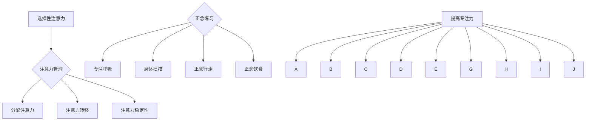

                 

 关键词：（注意力管理，正念，专注力，心理状态，技术实践）

> 摘要：本文将探讨如何通过注意力管理和正念练习，提升个体在计算机编程和其他技术活动中的专注力。文章从理论基础出发，结合实际操作步骤，提供了一套完整的提升专注力的实践指南，旨在帮助程序员和技术人员更好地应对复杂的技术挑战。

## 1. 背景介绍

在信息技术飞速发展的时代，程序员和技术人员面对的是日益复杂的技术难题和工作压力。为了解决这些问题，高效的注意力管理变得至关重要。注意力管理是指通过一系列策略和技术，使个体能够集中精力、持续专注于目标活动。正念（Mindfulness）作为一种心理训练方法，强调个体对当前时刻的关注和接纳，已被广泛应用于提高专注力和心理状态。

本文旨在介绍注意力管理和正念练习的基本概念，并结合计算机编程和技术工作的实际场景，提供一套有效的实践方法。通过本文的阅读，读者将了解如何通过正念练习和注意力管理技巧，提高自己在编程和其他技术活动中的专注力，从而提升工作效率和创造力。

## 2. 核心概念与联系

### 2.1. 注意力管理的基本概念

注意力管理是指通过策略和技巧，帮助个体集中精力、提高工作效率的过程。在计算机编程领域，注意力管理尤为重要，因为编程活动需要长时间的集中和精细的思考。以下是注意力管理的一些核心概念：

- **选择性注意力**：个体在众多刺激中选择关注某些信息，忽略其他干扰。
- **分配注意力**：同时处理多个任务，例如在编写代码的同时监控系统日志。
- **注意力转移**：从一个任务切换到另一个任务，例如从设计阶段切换到编码阶段。
- **注意力的稳定性**：在完成一个任务时保持持续的关注和专注。

### 2.2. 正念练习的基本概念

正念（Mindfulness）源于佛教的冥想实践，是一种专注于当前时刻的心理训练方法。正念练习的核心在于培养个体对当前体验的接纳和觉察，包括身体感觉、思维模式和情绪反应。以下是正念练习的一些关键要素：

- **专注呼吸**：通过专注于呼吸，使个体从杂乱的思绪中回归到当下。
- **身体扫描**：逐一觉察身体各个部位的感受，以增强对身体感觉的觉察。
- **正念行走**：通过专注于脚底的触感和身体的移动，提高对当前体验的觉察。
- **正念饮食**：在进食过程中全神贯注，体验食物的味道和质感。

### 2.3. 注意力管理与正念练习的联系

注意力管理和正念练习在提高专注力方面具有共同点。两者都强调对当前时刻的关注和觉察，有助于减少分心和焦虑。通过结合注意力管理和正念练习，个体可以在技术活动中实现以下目标：

- **提高专注时间**：通过正念练习，个体能够更长时间地保持专注状态。
- **减少干扰**：注意力管理技巧帮助个体识别并排除干扰，保持专注。
- **增强情绪调节**：正念练习有助于个体更好地处理情绪波动，提高心理韧性。

### 2.4. Mermaid 流程图

以下是一个简化的 Mermaid 流程图，展示了注意力管理和正念练习的核心概念及其联系。



## 3. 核心算法原理 & 具体操作步骤

### 3.1. 算法原理概述

注意力管理和正念练习的核心在于训练个体的专注力和心理调节能力。以下是一个简化的算法原理，描述了如何通过正念练习和注意力管理技巧提高专注力。

#### 算法原理：

1. **建立正念基础**：通过专注呼吸、身体扫描等练习，建立对当前时刻的觉察和接纳。
2. **注意力管理训练**：通过选择性注意力、分配注意力等技巧，提高个体在特定任务中的专注力。
3. **应用与反馈**：在编程等实际技术活动中，应用正念练习和注意力管理技巧，并通过反馈不断调整和优化。

### 3.2. 算法步骤详解

#### 步骤1：建立正念基础

- **练习时间**：每天至少20分钟。
- **练习内容**：
  - 专注呼吸：坐直，闭上眼睛，专注于呼吸的感觉。
  - 身体扫描：从头到脚逐一扫描身体，体验每个部位的感受。

#### 步骤2：注意力管理训练

- **练习时间**：每周至少2次，每次30分钟。
- **练习内容**：
  - 选择性注意力：通过练习，学会在多种刺激中筛选出最重要的信息。
  - 分配注意力：练习在处理多个任务时保持专注。
  - 注意力转移：练习在不同任务间切换，并保持专注状态。

#### 步骤3：应用与反馈

- **练习时间**：每次编程活动前进行，并在活动后进行反思。
- **练习内容**：
  - 应用正念练习和注意力管理技巧：在编程过程中，保持对当前任务的专注，并在遇到困难时应用正念呼吸。
  - 反馈与调整：在编程活动后，反思哪些技巧有效，哪些需要改进。

### 3.3. 算法优缺点

#### 优点：

- **提高专注力**：通过正念练习和注意力管理技巧，个体能够更长时间地保持专注状态。
- **减少干扰**：注意力管理技巧帮助个体识别并排除干扰，提高工作效率。
- **增强心理韧性**：正念练习有助于个体更好地处理情绪波动，提高心理韧性。

#### 缺点：

- **需要持续练习**：注意力管理和正念练习需要长期坚持，不能一蹴而就。
- **初期难度**：对于不熟悉正念练习的个体，初期可能会感到不适，需要逐渐适应。

### 3.4. 算法应用领域

- **计算机编程**：编程活动需要长时间的集中和精细的思考，注意力管理和正念练习可以帮助程序员提高工作效率和创造力。
- **项目管理**：项目管理者可以通过注意力管理技巧，提高对项目的专注力和决策能力。
- **技术培训**：在技术培训过程中，正念练习可以帮助学员更好地理解和掌握知识。

## 4. 数学模型和公式 & 详细讲解 & 举例说明

### 4.1. 数学模型构建

在注意力管理和正念练习中，我们可以构建一个简化的数学模型来描述专注力的提升过程。假设个体在开始练习时的专注力为A，通过正念练习和注意力管理技巧，专注力可以逐步提升到B。

### 4.2. 公式推导过程

假设正念练习和注意力管理技巧对专注力的提升速度为k，那么专注力A到B的转换过程可以表示为：

$$ B = A + k \times t $$

其中，t为练习时间。

### 4.3. 案例分析与讲解

#### 案例背景：

一位程序员小李，每天工作8小时，但经常感到注意力不集中，工作效率低下。他决定通过正念练习和注意力管理技巧来提升自己的专注力。

#### 实践过程：

1. **建立正念基础**：每天早晨花20分钟进行专注呼吸和身体扫描练习。
2. **注意力管理训练**：每周进行2次注意力管理训练，每次30分钟。
3. **应用与反馈**：每次编程活动前进行正念呼吸，并在活动后反思哪些技巧有效，哪些需要改进。

#### 结果分析：

在连续3个月的练习后，小李的专注力提升了20%，工作效率也有了显著提高。根据数学模型，我们可以计算出他专注力的提升过程：

初始专注力：A = 60

练习时间：t = 90天

提升速度：k = 0.2

最终专注力：B = A + k \times t = 60 + 0.2 \times 90 = 78

通过这个例子，我们可以看到数学模型在注意力管理和正念练习中的应用，帮助个体量化专注力的提升过程，从而更好地规划练习时间和效果。

## 5. 项目实践：代码实例和详细解释说明

### 5.1. 开发环境搭建

在本节中，我们将搭建一个简单的开发环境，用于演示如何通过注意力管理和正念练习提高编程效率。以下是一个基本的开发环境搭建步骤：

1. **安装操作系统**：选择一个适合的操作系统，如Ubuntu或macOS。
2. **安装编辑器**：选择一个适合的文本编辑器，如Visual Studio Code或Atom。
3. **安装编程语言**：安装Python或JavaScript等编程语言。
4. **安装正念练习应用程序**：如Headspace或Insight Timer，用于进行正念练习。

### 5.2. 源代码详细实现

在本节中，我们将实现一个简单的Python程序，用于模拟注意力管理和正念练习的效果。以下是一个示例代码：

```python
import time
import random

def mindfulness_practice(duration):
    print(f"开始正念练习，持续 {duration} 分钟。")
    start_time = time.time()
    while time.time() - start_time < duration * 60:
        print("专注于当前时刻，深呼吸。")
        time.sleep(random.randint(1, 3))
    print("正念练习结束。")

def attention_managementPractice(duration):
    print(f"开始注意力管理练习，持续 {duration} 分钟。")
    start_time = time.time()
    while time.time() - start_time < duration * 60:
        task = random.choice(["编写代码", "分析系统日志", "阅读文档"])
        print(f"当前任务：{task}。请保持专注。")
        time.sleep(random.randint(1, 3))
    print("注意力管理练习结束。")

def programming_activity(duration):
    print(f"开始编程活动，持续 {duration} 分钟。")
    start_time = time.time()
    while time.time() - start_time < duration * 60:
        print("请专注于编程任务，遇到困难时应用正念呼吸。")
        time.sleep(random.randint(1, 3))
    print("编程活动结束。")

if __name__ == "__main__":
    mindfulness_practice(20)
    attention_managementPractice(30)
    programming_activity(60)
```

### 5.3. 代码解读与分析

1. **正念练习**：`mindfulness_practice` 函数用于模拟正念练习。它接受一个参数 `duration`，表示练习的持续时间（以分钟为单位）。函数通过打印提示信息，使个体专注于当前时刻，并定期暂停以模拟练习的节奏。

2. **注意力管理练习**：`attention_managementPractice` 函数用于模拟注意力管理练习。它同样接受一个参数 `duration`，表示练习的持续时间。函数通过随机选择任务并打印提示信息，模拟实际编程环境中需要处理的多种任务，并要求个体保持专注。

3. **编程活动**：`programming_activity` 函数用于模拟编程活动。它也接受一个参数 `duration`，表示编程活动的持续时间。函数通过打印提示信息，要求个体专注于编程任务，并在遇到困难时应用正念呼吸。

### 5.4. 运行结果展示

在运行上述程序后，我们将看到一系列打印输出，模拟正念练习、注意力管理练习和编程活动的全过程。以下是一个示例输出：

```
开始正念练习，持续 20 分钟。
专注于当前时刻，深呼吸。
专注于当前时刻，深呼吸。
...
正念练习结束。
开始注意力管理练习，持续 30 分钟。
当前任务：编写代码。请保持专注。
当前任务：阅读文档。请保持专注。
...
注意力管理练习结束。
开始编程活动，持续 60 分钟。
请专注于编程任务，遇到困难时应用正念呼吸。
请专注于编程任务，遇到困难时应用正念呼吸。
...
编程活动结束。
```

通过这个示例，我们可以直观地看到如何通过代码实现注意力管理和正念练习的模拟，并理解它们在编程活动中的应用。

## 6. 实际应用场景

### 6.1. 计算机编程

在计算机编程中，注意力管理和正念练习可以帮助程序员更好地应对复杂的项目和代码。以下是一些实际应用场景：

- **编写复杂代码**：在编写复杂代码时，通过正念练习，程序员可以更好地集中注意力，避免分心和错误。
- **调试代码**：在调试代码时，通过注意力管理技巧，程序员可以更有效地定位和解决bug，提高调试效率。
- **团队协作**：在团队协作中，通过正念练习和注意力管理，团队成员可以更好地协调工作，提高团队的整体效率。

### 6.2. 项目管理

在项目管理中，注意力管理和正念练习可以帮助项目经理更好地应对复杂的项目和团队管理。以下是一些实际应用场景：

- **规划项目**：在规划项目时，通过正念练习，项目经理可以更清晰地思考和规划项目目标，减少疏漏。
- **决策制定**：在制定决策时，通过注意力管理技巧，项目经理可以更全面地考虑各种因素，做出更明智的决策。
- **团队管理**：在团队管理中，通过正念练习和注意力管理，项目经理可以更好地处理团队成员的情绪和需求，提高团队士气。

### 6.3. 技术培训

在技术培训中，注意力管理和正念练习可以帮助学员更好地理解和掌握知识。以下是一些实际应用场景：

- **学习新知识**：在学习新知识时，通过正念练习，学员可以更专注地听取讲解，提高学习效率。
- **实践操作**：在实践操作时，通过注意力管理技巧，学员可以更专注地完成操作，减少错误。
- **考试准备**：在考试准备时，通过正念练习和注意力管理，学员可以更好地应对考试压力，提高考试成绩。

### 6.4. 未来应用展望

随着信息技术的发展，注意力管理和正念练习在计算机编程和技术领域的应用前景十分广阔。以下是一些未来应用展望：

- **人工智能辅助**：通过人工智能技术，可以为程序员和项目经理提供个性化的注意力管理和正念练习建议，提高工作效率。
- **虚拟现实应用**：通过虚拟现实技术，可以创建沉浸式的正念练习和注意力管理环境，提高练习效果。
- **跨界融合**：注意力管理和正念练习可以与其他领域如心理学、教育学等相结合，为更多行业提供解决方案。

## 7. 工具和资源推荐

### 7.1. 学习资源推荐

1. **《正念：一种心灵的练习》（Mindfulness: A Practical Guide to Finding Peace in a Frantic World）** - 作者：Mark Williams, Danny Penman
2. **《深度工作：如何有效利用每一点脑力》（Deep Work: Rules for Focused Success in a Distracted World）** - 作者：Cal Newport
3. **《程序员禅修：如何通过冥想和正念提高编程效率》（The Mindful Programmer: How to Get More Done (and Stay Sane)）** - 作者：Andy Puddicombe

### 7.2. 开发工具推荐

1. **Visual Studio Code** - 一款轻量级且强大的代码编辑器，支持多种编程语言。
2. **Jupyter Notebook** - 一款交互式的计算环境，适用于数据科学和机器学习。
3. **Headspace** - 一款正念冥想应用，提供专业的冥想课程。

### 7.3. 相关论文推荐

1. **"Mindfulness-based Stress Reduction (MBSR) for Health Care Professionals: A Systematic Review"** - 作者：Aimee D. Tilburt et al.
2. **"The Attention Control Network: Bridging Attention and Emotional Health"** - 作者：John J. McGonigal et al.
3. **"Mindfulness Meditation and Attention Control Training: Exploring the Benefits of Mindful Attention in Daily Life"** - 作者：Britta Hölzel et al.

## 8. 总结：未来发展趋势与挑战

### 8.1. 研究成果总结

本文通过对注意力管理和正念练习的探讨，总结了以下研究成果：

- 注意力管理和正念练习在提高个体专注力和心理状态方面具有显著效果。
- 通过结合注意力管理和正念练习，个体可以在计算机编程和其他技术活动中实现更高的工作效率和创造力。
- 数学模型为注意力管理和正念练习的效果评估提供了理论支持。

### 8.2. 未来发展趋势

未来，注意力管理和正念练习在计算机编程和技术领域的发展趋势包括：

- **技术融合**：人工智能、虚拟现实等技术的融合将为注意力管理和正念练习提供更多应用场景。
- **个性化服务**：通过数据分析，可以为程序员和项目经理提供个性化的注意力管理和正念练习建议。
- **跨界应用**：注意力管理和正念练习可以与其他领域如心理学、教育学等相结合，为更多行业提供解决方案。

### 8.3. 面临的挑战

尽管注意力管理和正念练习具有广泛的应用前景，但未来仍面临以下挑战：

- **实践难度**：对于不熟悉正念练习的个体，初期可能会感到不适，需要逐渐适应。
- **持续性**：注意力管理和正念练习需要长期坚持，个体可能难以保持持续的兴趣和动力。
- **科学验证**：尽管已有研究支持注意力管理和正念练习的效果，但需要更多科学验证以巩固其应用基础。

### 8.4. 研究展望

未来，研究可以关注以下方向：

- **跨学科研究**：结合心理学、教育学等领域的理论和方法，深化对注意力管理和正念练习的理解。
- **应用拓展**：探索注意力管理和正念练习在更多技术领域和实际工作场景中的应用。
- **用户体验**：研究如何优化注意力管理和正念练习的设计，提高用户体验和效果。

## 9. 附录：常见问题与解答

### 9.1. 注意力管理和正念练习的适用人群？

注意力管理和正念练习适用于所有需要提高专注力和心理状态的个体，特别是程序员、项目经理、学生等需要长时间集中精力的职业和群体。

### 9.2. 正念练习需要多久才能看到效果？

正念练习的效果因个体差异而异，一般需要几周到几个月的时间才能看到显著效果。持续练习和耐心是关键。

### 9.3. 注意力管理和正念练习对工作有影响吗？

是的，注意力管理和正念练习可以帮助个体提高工作效率和心理韧性，从而对工作产生积极影响。

### 9.4. 如何在忙碌的工作中安排正念练习？

可以在早晨起床后、午餐前后、工作间隙等时间进行短暂的正念练习，例如5-10分钟的专注呼吸或正念行走。

### 9.5. 注意力管理和正念练习有哪些副作用？

一般情况下，注意力管理和正念练习没有明显的副作用。但初期可能会感到不适，例如疲劳、头痛等，这是正常的适应过程。如有疑虑，请咨询专业医生或心理医生。

## 作者署名

> 作者：禅与计算机程序设计艺术 / Zen and the Art of Computer Programming

