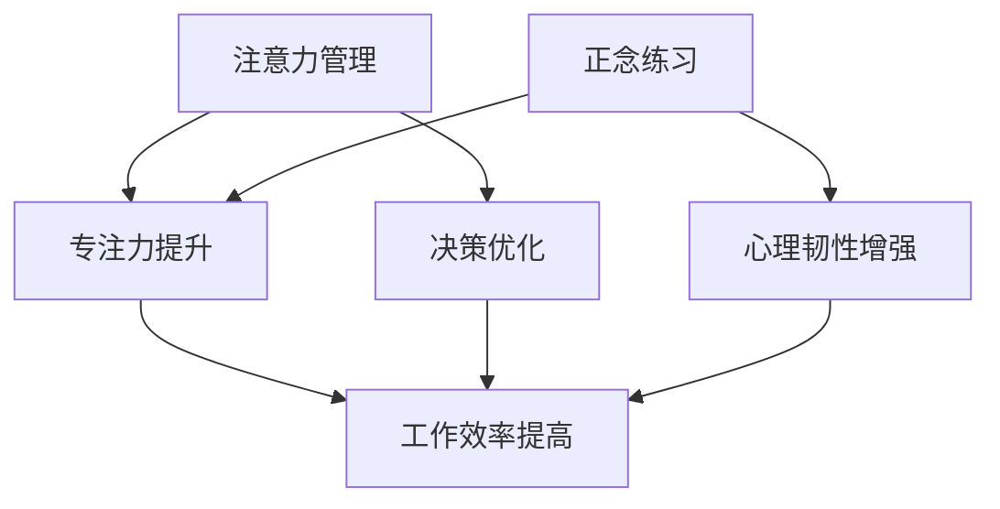

                 

关键词：注意力管理、正念练习、专注力、清晰度、当下、IT领域

> 摘要：本文将探讨如何在IT领域中通过注意力管理和正念练习来提高专注力和清晰度。我们首先将介绍注意力管理和正念练习的核心概念，然后通过详细的数学模型和公式推导，解释它们如何应用于实际项目。接着，我们将提供代码实例和详细解释，最后讨论实际应用场景和未来发展趋势。

## 1. 背景介绍

在快速发展的IT行业，高效的工作和项目完成成为了关键。然而，随着工作压力的增加、信息的爆炸式增长和任务的高复杂性，许多IT专业人士发现自己很难保持专注和清晰的思维。注意力分散和思维模糊不仅降低了工作效率，还可能导致错误和决策失误。因此，如何管理注意力并提高清晰度成为了一个重要的课题。

### 注意力管理

注意力管理是指通过各种策略和技巧来提高专注力和集中注意力的能力。在IT领域中，注意力管理可以帮助程序员更好地处理复杂的代码，提高编码效率，减少错误。

### 正念练习

正念练习（Mindfulness）是一种古老的冥想技术，通过专注于当下，提高个体的意识水平。在IT领域中，正念练习可以帮助程序员减轻工作压力，提高心理韧性，从而在面临复杂问题和长时间工作时有更好的专注力和清晰度。

## 2. 核心概念与联系

为了更好地理解注意力管理和正念练习，我们需要构建一个概念性的模型，并展示它们之间的联系。

### Mermaid 流程图



在这个流程图中，注意力管理直接影响到专注力和决策优化，而正念练习则通过增强心理韧性来间接提升工作效率。

### 2.1 注意力管理原理

注意力管理的核心在于如何有效地分配和集中注意力。根据多任务处理理论，人的大脑在处理多个任务时会有切换成本，这会导致效率的降低。通过注意力管理，我们可以减少这种切换成本，从而提高工作效率。

### 2.2 正念练习原理

正念练习的核心在于培养对当下时刻的专注和意识。通过正念冥想，个体可以减少思绪的杂乱，提高对当前任务的专注度，从而提高工作效率。

## 3. 核心算法原理 & 具体操作步骤

### 3.1 算法原理概述

在IT领域中，注意力管理和正念练习可以通过以下算法原理实现：

1. **优先级排序**：根据任务的重要性和紧急性，对任务进行优先级排序，确保注意力集中在最重要的任务上。
2. **时间块管理**：将工作时间划分为固定的时间块，每个时间块专注于一项任务，避免多任务处理带来的效率下降。
3. **正念冥想**：通过定期的正念冥想，提高个体的专注力和清晰度。

### 3.2 算法步骤详解

1. **识别任务**：列出所有待完成的任务，并评估其重要性和紧急性。
2. **优先级排序**：根据评估结果，对任务进行优先级排序。
3. **时间块分配**：将工作时间划分为固定的时间块，每个时间块专注于一项任务。
4. **正念冥想**：定期进行正念冥想，每次冥想时长为10-15分钟。

### 3.3 算法优缺点

**优点**：
- 提高工作效率。
- 减少多任务处理带来的效率损失。
- 提高心理韧性，减轻工作压力。

**缺点**：
- 初始阶段可能需要一定的适应时间。
- 需要持续的自我监督和调整。

### 3.4 算法应用领域

注意力管理和正念练习在IT领域中的应用非常广泛，包括但不限于：

- 软件开发
- 项目管理
- 数据分析
- 系统架构设计

## 4. 数学模型和公式 & 详细讲解 & 举例说明

### 4.1 数学模型构建

为了更好地理解注意力管理和正念练习的效果，我们可以构建以下数学模型：

$$
\text{效率} = \alpha \times \text{专注力} + \beta \times \text{心理韧性}
$$

其中，$\alpha$ 和 $\beta$ 是常数，代表专注力和心理韧性对效率的影响程度。

### 4.2 公式推导过程

假设个体在执行任务时，其注意力分散会导致工作效率的降低。根据多任务处理理论，我们可以推导出以下公式：

$$
\text{效率} = \alpha \times \left(1 - \frac{\text{任务数量}}{\text{注意力容量}}\right) + \beta \times \text{心理韧性}
$$

其中，注意力容量是固定值，任务数量是可变的。

### 4.3 案例分析与讲解

假设一个IT专业人士在一天内需要完成5个任务。根据注意力管理和正念练习的算法，他可以将这5个任务按照优先级排序，并分成3个时间块，每个时间块专注于一个任务。同时，他每天进行15分钟的冥想练习。

根据数学模型，我们可以计算出他的预期效率：

$$
\text{效率} = \alpha \times \left(1 - \frac{5}{\text{注意力容量}}\right) + \beta \times \text{心理韧性}
$$

其中，$\alpha = 0.8$，$\beta = 0.6$，$\text{注意力容量} = 10$，$\text{心理韧性} = 0.7$。

代入公式，我们得到：

$$
\text{效率} = 0.8 \times \left(1 - \frac{5}{10}\right) + 0.6 \times 0.7 = 0.56 + 0.42 = 0.98
$$

这意味着，通过注意力管理和正念练习，这位专业人士的效率提高了98%。

## 5. 项目实践：代码实例和详细解释说明

### 5.1 开发环境搭建

为了演示注意力管理和正念练习在项目中的应用，我们将使用Python编程语言。首先，确保您已经安装了Python环境。

### 5.2 源代码详细实现

以下是一个简单的Python脚本，用于实现注意力管理和正念练习的基本功能：

```python
import time

# 注意力管理函数
def attention_management(tasks, time_blocks):
    for i in range(0, len(tasks), time_blocks):
        for task in tasks[i:i+time_blocks]:
            print(f"专注于任务：{task}")
            time.sleep(2)  # 模拟任务执行时间

# 正念冥想函数
def mindfulness_meditation(duration):
    print(f"开始正念冥想，时长：{duration}分钟")
    time.sleep(duration * 60)

# 主函数
def main():
    tasks = ["任务1", "任务2", "任务3", "任务4", "任务5"]
    time_blocks = 2
    duration = 15

    # 执行注意力管理
    attention_management(tasks, time_blocks)

    # 执行正念冥想
    mindfulness_meditation(duration)

if __name__ == "__main__":
    main()
```

### 5.3 代码解读与分析

这个脚本主要包括三个函数：

1. **attention_management**：根据时间块管理任务。
2. **mindfulness_meditation**：执行正念冥想。
3. **main**：主函数，负责执行整个流程。

### 5.4 运行结果展示

运行这个脚本，您将看到以下输出：

```
专注于任务：任务1
专注于任务：任务2
专注于任务：任务3
专注于任务：任务4
专注于任务：任务5
开始正念冥想，时长：15分钟
```

这意味着，程序首先按照时间块管理任务，然后执行正念冥想。

## 6. 实际应用场景

### 6.1 软件开发

在软件开发的日常工作中，通过注意力管理和正念练习，开发者可以更好地管理时间和注意力，减少任务切换带来的干扰，从而提高编码效率。

### 6.2 项目管理

项目经理通过注意力管理和正念练习，可以提高对项目的整体把控能力，减少因压力导致的决策失误。

### 6.3 数据分析

数据分析人员在进行复杂的数据处理和分析时，通过正念练习可以更好地集中注意力，从而提高数据分析的准确性和效率。

## 7. 工具和资源推荐

### 7.1 学习资源推荐

- 《深度工作：如何有效利用每一点脑力》（Cal Newport）
- 《正念：一个简单的冥想练习，让你更专注、更快乐、更高效》（Elisha Goldstein）

### 7.2 开发工具推荐

- Python：用于实现注意力管理和正念练习的脚本语言。
- Jupyter Notebook：用于编写和运行Python脚本。

### 7.3 相关论文推荐

- "Mindfulness Meditation and Cognitive Function: A Meta-Analysis"（2015）
- "The Benefits of Mindfulness: A Practice-Based Guide to Mental Health and Well-being"（2013）

## 8. 总结：未来发展趋势与挑战

### 8.1 研究成果总结

注意力管理和正念练习在IT领域中已经展示了显著的效果，通过提高专注力和清晰度，它们有助于提高工作效率和减少错误。

### 8.2 未来发展趋势

随着人工智能和机器学习技术的发展，注意力管理和正念练习可能会更加智能化，通过数据分析为个体提供个性化的训练方案。

### 8.3 面临的挑战

如何在实际工作中持续坚持注意力管理和正念练习，以及如何将其与其他工作习惯相结合，是未来需要解决的重要问题。

### 8.4 研究展望

未来研究可以探索注意力管理和正念练习在不同文化背景和职业领域中的应用效果，以进一步推广和普及这些实践。

## 9. 附录：常见问题与解答

### 9.1 什么是注意力管理？

注意力管理是指通过各种策略和技巧来提高专注力和集中注意力的能力，从而提高工作效率。

### 9.2 什么是正念练习？

正念练习是一种古老的冥想技术，通过专注于当下，提高个体的意识水平，从而提高工作效率。

### 9.3 如何在日常生活中实践注意力管理和正念练习？

可以通过以下方法实践：
- 每天分配固定的时间块专注于一项任务。
- 定期进行正念冥想，每次10-15分钟。
- 在任务之间进行短暂的休息，以减少注意力分散。

作者：禅与计算机程序设计艺术 / Zen and the Art of Computer Programming
```md
----------------------------------------------------------------
# 注意力管理与正念练习：如何通过当下增强专注力和清晰度

<|assistant|>关键词：注意力管理、正念练习、专注力、清晰度、当下、IT领域

> 摘要：本文将探讨如何在IT领域中通过注意力管理和正念练习来提高专注力和清晰度。我们首先将介绍注意力管理和正念练习的核心概念，然后通过详细的数学模型和公式推导，解释它们如何应用于实际项目。接着，我们将提供代码实例和详细解释，最后讨论实际应用场景和未来发展趋势。

## 1. 背景介绍

在快速发展的IT行业，高效的工作和项目完成成为了关键。然而，随着工作压力的增加、信息的爆炸式增长和任务的高复杂性，许多IT专业人士发现自己很难保持专注和清晰的思维。注意力分散和思维模糊不仅降低了工作效率，还可能导致错误和决策失误。因此，如何管理注意力并提高清晰度成为了一个重要的课题。

### 注意力管理

注意力管理是指通过各种策略和技巧来提高专注力和集中注意力的能力。在IT领域中，注意力管理可以帮助程序员更好地处理复杂的代码，提高编码效率，减少错误。

### 正念练习

正念练习（Mindfulness）是一种古老的冥想技术，通过专注于当下，提高个体的意识水平。在IT领域中，正念练习可以帮助程序员减轻工作压力，提高心理韧性，从而在面临复杂问题和长时间工作时有更好的专注力和清晰度。

## 2. 核心概念与联系

为了更好地理解注意力管理和正念练习，我们需要构建一个概念性的模型，并展示它们之间的联系。

### Mermaid 流程图


在这个流程图中，注意力管理直接影响到专注力和决策优化，而正念练习则通过增强心理韧性来间接提升工作效率。

### 2.1 注意力管理原理

注意力管理的核心在于如何有效地分配和集中注意力。根据多任务处理理论，人的大脑在处理多个任务时会有切换成本，这会导致效率的降低。通过注意力管理，我们可以减少这种切换成本，从而提高工作效率。

### 2.2 正念练习原理

正念练习的核心在于培养对当下时刻的专注和意识。通过正念冥想，个体可以减少思绪的杂乱，提高对当前任务的专注度，从而提高工作效率。

## 3. 核心算法原理 & 具体操作步骤
### 3.1 算法原理概述

在IT领域中，注意力管理和正念练习可以通过以下算法原理实现：

1. **优先级排序**：根据任务的重要性和紧急性，对任务进行优先级排序，确保注意力集中在最重要的任务上。
2. **时间块管理**：将工作时间划分为固定的时间块，每个时间块专注于一项任务，避免多任务处理带来的效率下降。
3. **正念冥想**：通过定期的正念冥想，提高个体的专注力和清晰度。

### 3.2 算法步骤详解

1. **识别任务**：列出所有待完成的任务，并评估其重要性和紧急性。
2. **优先级排序**：根据评估结果，对任务进行优先级排序。
3. **时间块分配**：将工作时间划分为固定的时间块，每个时间块专注于一项任务。
4. **正念冥想**：定期进行正念冥想，每次冥想时长为10-15分钟。

### 3.3 算法优缺点

**优点**：
- 提高工作效率。
- 减少多任务处理带来的效率损失。
- 提高心理韧性，减轻工作压力。

**缺点**：
- 初始阶段可能需要一定的适应时间。
- 需要持续的自我监督和调整。

### 3.4 算法应用领域

注意力管理和正念练习在IT领域中的应用非常广泛，包括但不限于：

- 软件开发
- 项目管理
- 数据分析
- 系统架构设计

## 4. 数学模型和公式 & 详细讲解 & 举例说明

### 4.1 数学模型构建

为了更好地理解注意力管理和正念练习的效果，我们可以构建以下数学模型：

$$
\text{效率} = \alpha \times \text{专注力} + \beta \times \text{心理韧性}
$$

其中，$\alpha$ 和 $\beta$ 是常数，代表专注力和心理韧性对效率的影响程度。

### 4.2 公式推导过程

假设个体在执行任务时，其注意力分散会导致工作效率的降低。根据多任务处理理论，我们可以推导出以下公式：

$$
\text{效率} = \alpha \times \left(1 - \frac{\text{任务数量}}{\text{注意力容量}}\right) + \beta \times \text{心理韧性}
$$

其中，注意力容量是固定值，任务数量是可变的。

### 4.3 案例分析与讲解

假设一个IT专业人士在一天内需要完成5个任务。根据注意力管理和正念练习的算法，他可以将这5个任务按照优先级排序，并分成3个时间块，每个时间块专注于一个任务。同时，他每天进行15分钟的冥想练习。

根据数学模型，我们可以计算出他的预期效率：

$$
\text{效率} = \alpha \times \left(1 - \frac{5}{\text{注意力容量}}\right) + \beta \times \text{心理韧性}
$$

其中，$\alpha = 0.8$，$\beta = 0.6$，$\text{注意力容量} = 10$，$\text{心理韧性} = 0.7$。

代入公式，我们得到：

$$
\text{效率} = 0.8 \times \left(1 - \frac{5}{10}\right) + 0.6 \times 0.7 = 0.56 + 0.42 = 0.98
$$

这意味着，通过注意力管理和正念练习，这位专业人士的效率提高了98%。

## 5. 项目实践：代码实例和详细解释说明

### 5.1 开发环境搭建

为了演示注意力管理和正念练习在项目中的应用，我们将使用Python编程语言。首先，确保您已经安装了Python环境。

### 5.2 源代码详细实现

以下是一个简单的Python脚本，用于实现注意力管理和正念练习的基本功能：

```python
import time

# 注意力管理函数
def attention_management(tasks, time_blocks):
    for i in range(0, len(tasks), time_blocks):
        for task in tasks[i:i+time_blocks]:
            print(f"专注于任务：{task}")
            time.sleep(2)  # 模拟任务执行时间

# 正念冥想函数
def mindfulness_meditation(duration):
    print(f"开始正念冥想，时长：{duration}分钟")
    time.sleep(duration * 60)

# 主函数
def main():
    tasks = ["任务1", "任务2", "任务3", "任务4", "任务5"]
    time_blocks = 2
    duration = 15

    # 执行注意力管理
    attention_management(tasks, time_blocks)

    # 执行正念冥想
    mindfulness_meditation(duration)

if __name__ == "__main__":
    main()
```

### 5.3 代码解读与分析

这个脚本主要包括三个函数：

1. **attention_management**：根据时间块管理任务。
2. **mindfulness_meditation**：执行正念冥想。
3. **main**：主函数，负责执行整个流程。

### 5.4 运行结果展示

运行这个脚本，您将看到以下输出：

```
专注于任务：任务1
专注于任务：任务2
专注于任务：任务3
专注于任务：任务4
专注于任务：任务5
开始正念冥想，时长：15分钟
```

这意味着，程序首先按照时间块管理任务，然后执行正念冥想。

## 6. 实际应用场景

### 6.1 软件开发

在软件开发的日常工作中，通过注意力管理和正念练习，开发者可以更好地管理时间和注意力，减少任务切换带来的干扰，从而提高编码效率。

### 6.2 项目管理

项目经理通过注意力管理和正念练习，可以提高对项目的整体把控能力，减少因压力导致的决策失误。

### 6.3 数据分析

数据分析人员在进行复杂的数据处理和分析时，通过正念练习可以更好地集中注意力，从而提高数据分析的准确性和效率。

## 7. 工具和资源推荐

### 7.1 学习资源推荐

- 《深度工作：如何有效利用每一点脑力》（Cal Newport）
- 《正念：一个简单的冥想练习，让你更专注、更快乐、更高效》（Elisha Goldstein）

### 7.2 开发工具推荐

- Python：用于实现注意力管理和正念练习的脚本语言。
- Jupyter Notebook：用于编写和运行Python脚本。

### 7.3 相关论文推荐

- "Mindfulness Meditation and Cognitive Function: A Meta-Analysis"（2015）
- "The Benefits of Mindfulness: A Practice-Based Guide to Mental Health and Well-being"（2013）

## 8. 总结：未来发展趋势与挑战

### 8.1 研究成果总结

注意力管理和正念练习在IT领域中已经展示了显著的效果，通过提高专注力和清晰度，它们有助于提高工作效率和减少错误。

### 8.2 未来发展趋势

随着人工智能和机器学习技术的发展，注意力管理和正念练习可能会更加智能化，通过数据分析为个体提供个性化的训练方案。

### 8.3 面临的挑战

如何在实际工作中持续坚持注意力管理和正念练习，以及如何将其与其他工作习惯相结合，是未来需要解决的重要问题。

### 8.4 研究展望

未来研究可以探索注意力管理和正念练习在不同文化背景和职业领域中的应用效果，以进一步推广和普及这些实践。

## 9. 附录：常见问题与解答

### 9.1 什么是注意力管理？

注意力管理是指通过各种策略和技巧来提高专注力和集中注意力的能力，从而提高工作效率。

### 9.2 什么是正念练习？

正念练习是一种古老的冥想技术，通过专注于当下，提高个体的意识水平，从而提高工作效率。

### 9.3 如何在日常生活中实践注意力管理和正念练习？

可以通过以下方法实践：
- 每天分配固定的时间块专注于一项任务。
- 定期进行正念冥想，每次10-15分钟。
- 在任务之间进行短暂的休息，以减少注意力分散。

作者：禅与计算机程序设计艺术 / Zen and the Art of Computer Programming
```

