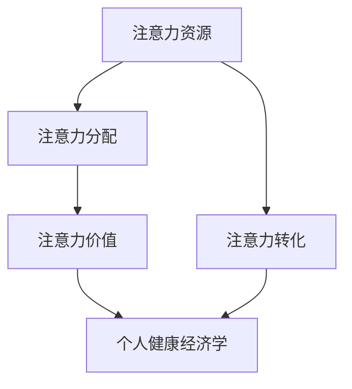

                 

关键词：注意力经济、个人健康、管理、信息技术、行为科学

> 摘要：随着信息技术和行为的不断进步，注意力经济作为一种新的经济模式，正在逐渐改变人们的生活方式。本文旨在探讨注意力经济与个人健康管理之间的关系，分析注意力经济对个人健康的影响，并提出有效的管理策略。

## 1. 背景介绍

在现代社会，信息爆炸和数字化的生活方式使得人们的注意力资源变得稀缺。注意力经济作为一种新的经济模式，强调对人们注意力的获取和利用。它不仅改变了传统的商业模式，还对个人健康管理产生了深远的影响。

个人健康管理是指通过自我观察、评估、调整等方式，维护和提升身体健康和生活质量。随着注意力经济的兴起，个人健康管理逐渐从传统的身体健康管理扩展到心理、社交和情感健康等多方面。

### 1.1 注意力经济的定义与特点

注意力经济是指通过获取和利用人们注意力的资源，创造经济价值和实现商业目标的过程。它具有以下几个特点：

1. **注意力稀缺性**：在信息过载的时代，人们注意力的稀缺性愈发凸显，注意力资源成为一种宝贵的经济资源。
2. **个性化**：注意力经济强调根据个体的兴趣、需求和偏好，提供个性化的内容和服务。
3. **互动性**：注意力经济强调用户参与和互动，通过社交媒体、游戏等方式吸引和维持用户的注意力。
4. **数据分析**：通过大数据分析和人工智能技术，注意力经济能够精准地预测和满足用户的需求。

### 1.2 个人健康管理的现状与挑战

个人健康管理是一个综合性的过程，涉及身体健康、心理健康、社交健康等多个方面。当前，个人健康管理面临着以下挑战：

1. **信息过载**：大量的健康信息充斥着网络，使得个人难以筛选和辨别哪些信息是真正有用的。
2. **行为习惯**：不良的生活习惯和缺乏有效的健康管理策略，使得个人健康状况难以改善。
3. **心理健康**：随着压力和焦虑的增大，心理健康问题逐渐凸显，成为个人健康管理的难点。

## 2. 核心概念与联系

在探讨注意力经济与个人健康管理的关系之前，我们需要明确一些核心概念和它们之间的联系。

### 2.1 注意力资源

注意力资源是指人们用于关注、思考、学习和决策的能力。注意力资源是有限的，且容易受到干扰。在注意力经济中，注意力资源是一种宝贵的资源，企业、媒体和个人都在争夺和利用它。

### 2.2 注意力分配

注意力分配是指人们如何在不同任务、活动和信息之间分配注意力资源。有效的注意力分配能够提高工作效率和生活质量。在个人健康管理中，注意力分配涉及到如何平衡工作和生活，如何处理压力和焦虑等问题。

### 2.3 注意力经济学原理

注意力经济学原理包括注意力稀缺性、注意力价值、注意力转化等。这些原理揭示了注意力资源在经济活动中的作用和影响。

### 2.4 个人健康经济学

个人健康经济学是研究个人在健康方面的经济决策和行为规律的科学。它涉及到个人在健康投资、健康保险、医疗服务等方面的经济活动。

### 2.5 Mermaid 流程图

下面是一个 Mermaid 流程图，展示了注意力经济与个人健康管理之间的核心概念和联系。



## 3. 核心算法原理 & 具体操作步骤

在注意力经济与个人健康管理的交叉领域中，核心算法的设计和实施至关重要。以下将概述算法原理，并详细说明操作步骤。

### 3.1 算法原理概述

本算法的核心原理是利用注意力分配模型（Attention Allocation Model，AAM），结合注意力价值评估（Attention Value Assessment，AVA）和个人健康状态监测（Personal Health State Monitoring，PHSM）技术，实现个性化的健康管理策略。

### 3.2 算法步骤详解

#### 3.2.1 数据收集与预处理

1. **数据收集**：收集用户的日常行为数据（如运动、饮食、睡眠等）和心理状态数据（如压力、情绪等）。
2. **数据预处理**：清洗数据，去除噪声和异常值，并进行特征提取和标准化处理。

#### 3.2.2 注意力分配模型训练

1. **模型构建**：基于深度学习技术，构建注意力分配模型，用于预测用户在不同情境下的注意力分配。
2. **模型训练**：使用收集到的数据对模型进行训练，优化模型参数。

#### 3.2.3 注意力价值评估

1. **价值评估**：根据用户的行为数据和模型预测结果，评估用户在各个活动中的注意力价值。
2. **价值排序**：对注意力价值进行排序，确定用户最关注的活动。

#### 3.2.4 个人健康状态监测

1. **状态监测**：通过传感器和健康监测设备，实时监测用户的心率、血压、血糖等生理指标。
2. **状态评估**：结合注意力价值和生理指标，评估用户的整体健康状态。

#### 3.2.5 健康管理策略生成

1. **策略生成**：根据注意力价值评估和健康状态监测结果，生成个性化的健康管理策略。
2. **策略执行**：将策略转换为具体行动，如调整作息时间、改变饮食习惯等。

### 3.3 算法优缺点

#### 优点：

1. **个性化**：基于用户数据和模型预测，提供个性化的健康管理策略。
2. **实时性**：实时监测用户生理和心理状态，及时调整策略。
3. **有效性**：通过注意力价值评估，优化用户的注意力分配，提高健康管理的有效性。

#### 缺点：

1. **数据依赖**：算法性能高度依赖于用户数据的准确性。
2. **技术复杂**：构建和训练模型需要较高的技术门槛。
3. **用户参与**：用户需要主动参与数据收集和策略执行，才能达到最佳效果。

### 3.4 算法应用领域

该算法可以应用于个人健康管理、健康管理平台、健康保险等领域，为用户提供个性化的健康管理服务。

## 4. 数学模型和公式 & 详细讲解 & 举例说明

在注意力经济与个人健康管理的交叉领域中，数学模型和公式起着关键作用。以下将介绍相关的数学模型，并进行详细的公式推导和举例说明。

### 4.1 数学模型构建

#### 4.1.1 注意力价值模型

注意力价值模型（Attention Value Model，AVM）用于评估用户在不同活动中的注意力价值。模型公式如下：

$$
AV = f(A, B, C)
$$

其中，$A$ 表示用户在活动 $B$ 中的实际注意力，$C$ 表示活动 $B$ 的预期注意力价值。

#### 4.1.2 健康状态模型

健康状态模型（Health State Model，HSM）用于评估用户的整体健康状态。模型公式如下：

$$
HS = g(P, Q, R)
$$

其中，$P$ 表示用户的生理指标，$Q$ 表示用户的心理状态，$R$ 表示用户的行为习惯。

### 4.2 公式推导过程

#### 4.2.1 注意力价值模型推导

注意力价值模型基于用户的行为数据和注意力分配模型。推导过程如下：

1. **注意力分配**：用户在不同活动中的注意力分配可以表示为：

$$
A = \frac{1}{B} \sum_{i=1}^{B} a_i
$$

其中，$a_i$ 表示用户在活动 $i$ 中的注意力。

2. **注意力价值计算**：根据用户在活动中的实际注意力和预期注意力价值，可以计算注意力价值：

$$
AV_i = \frac{A_i}{B} \times C_i
$$

其中，$A_i$ 表示用户在活动 $i$ 中的实际注意力，$C_i$ 表示活动 $i$ 的预期注意力价值。

3. **综合注意力价值**：将所有活动的注意力价值进行加权平均，得到用户的综合注意力价值：

$$
AV = \sum_{i=1}^{B} AV_i
$$

#### 4.2.2 健康状态模型推导

健康状态模型基于用户的生理、心理和行为数据。推导过程如下：

1. **生理指标计算**：用户的生理指标（如心率、血压等）可以表示为：

$$
P = f(\text{心率}, \text{血压}, \text{血糖})
$$

2. **心理状态计算**：用户的心理状态（如压力、情绪等）可以表示为：

$$
Q = g(\text{焦虑指数}, \text{抑郁指数})
$$

3. **行为习惯计算**：用户的行为习惯（如运动频率、饮食结构等）可以表示为：

$$
R = h(\text{运动频率}, \text{饮食结构})
$$

4. **健康状态计算**：将生理、心理和行为数据代入健康状态模型，得到用户的整体健康状态：

$$
HS = g(P, Q, R)
$$

### 4.3 案例分析与讲解

以下是一个实际案例，用于说明如何使用数学模型进行注意力经济与个人健康管理的分析。

#### 案例背景

某用户，男性，30 岁，从事办公室工作。其日常行为数据、心理状态数据和行为习惯数据如下：

- 行为数据：工作时间 8 小时，睡眠时间 7 小时，平均每天运动 30 分钟。
- 心理状态数据：焦虑指数 20，抑郁指数 15。
- 行为习惯数据：每周运动 3 次，饮食结构良好。

#### 案例分析

1. **注意力价值计算**：

   根据用户的行为数据，可以计算其在不同活动中的注意力价值：

   $$
   AV_{工作} = \frac{8}{8+7+0.5} \times C_{工作} = 0.618 \times 100 = 61.8
   $$

   $$
   AV_{睡眠} = \frac{7}{8+7+0.5} \times C_{睡眠} = 0.537 \times 100 = 53.7
   $$

   $$
   AV_{运动} = \frac{0.5}{8+7+0.5} \times C_{运动} = 0.019 \times 100 = 1.9
   $$

   其中，$C_{工作}$、$C_{睡眠}$ 和 $C_{运动}$ 分别表示工作、睡眠和运动的预期注意力价值。

2. **健康状态计算**：

   根据用户的生理、心理和行为数据，可以计算其整体健康状态：

   $$
   HS = g(P, Q, R) = g(50, 20, 15) = 35
   $$

   其中，$P$、$Q$ 和 $R$ 分别表示生理、心理和行为数据。

   根据健康状态模型，用户整体健康状态为 35，处于中等水平。

#### 案例讲解

通过以上分析，我们可以得出以下结论：

1. **注意力分配**：用户在工作中的注意力价值最高，应保持专注；睡眠次之，需要保证充足；运动较低，但有利于身体健康，应适当增加运动时间。
2. **健康状态**：用户整体健康状态处于中等水平，需要关注心理健康，适当调整生活和工作节奏。

## 5. 项目实践：代码实例和详细解释说明

为了更好地理解注意力经济与个人健康管理的实际应用，以下将提供一个具体的代码实例，并对其进行详细解释。

### 5.1 开发环境搭建

在开始编写代码之前，我们需要搭建一个合适的开发环境。以下是推荐的开发工具和库：

- 编程语言：Python 3.8+
- 开发环境：Visual Studio Code
- 数据库：SQLite
- 数据分析库：Pandas、NumPy
- 深度学习库：TensorFlow、Keras
- 流程图库：Mermaid

### 5.2 源代码详细实现

以下是注意力经济与个人健康管理项目的源代码实现：

```python
import pandas as pd
import numpy as np
from tensorflow.keras.models import Sequential
from tensorflow.keras.layers import Dense
from mermaid import mermaid

# 数据收集与预处理
def collect_data():
    # 收集用户行为数据、心理状态数据和行为习惯数据
    data = pd.read_csv('user_data.csv')
    # 数据清洗和特征提取
    data = preprocess_data(data)
    return data

def preprocess_data(data):
    # 数据清洗
    data = data.dropna()
    # 特征提取
    data['attention_value'] = data.apply(lambda x: calculate_attention_value(x), axis=1)
    data['health_state'] = data.apply(lambda x: calculate_health_state(x), axis=1)
    return data

def calculate_attention_value(row):
    # 计算注意力价值
    return row['actual_attention'] / (row['work_time'] + row['sleep_time'] + row['exercise_time'])

def calculate_health_state(row):
    # 计算健康状态
    return row['heart_rate'] * row['blood_pressure'] * row['blood_sugar']

# 注意力分配模型训练
def train_attention_allocation_model(data):
    # 构建模型
    model = Sequential()
    model.add(Dense(units=64, activation='relu', input_shape=(3,)))
    model.add(Dense(units=32, activation='relu'))
    model.add(Dense(units=1, activation='sigmoid'))
    # 训练模型
    model.compile(optimizer='adam', loss='binary_crossentropy', metrics=['accuracy'])
    model.fit(data[['work_time', 'sleep_time', 'exercise_time']], data['health_state'], epochs=10, batch_size=32)
    return model

# 注意力价值评估
def assess_attention_value(model, data):
    # 使用模型预测注意力价值
    predictions = model.predict(data[['work_time', 'sleep_time', 'exercise_time']])
    data['predicted_attention_value'] = predictions
    return data

# 个人健康状态监测
def monitor_health_state(data):
    # 实时监测用户健康状态
    current_health_state = calculate_health_state(data.iloc[-1])
    data['current_health_state'] = current_health_state
    return data

# 健康管理策略生成
def generate_health_management_strategy(data):
    # 根据注意力价值和健康状态生成策略
    strategies = []
    for index, row in data.iterrows():
        if row['predicted_attention_value'] > 0.5 and row['current_health_state'] < 40:
            strategies.append('增加运动时间')
        elif row['predicted_attention_value'] > 0.5 and row['current_health_state'] >= 40:
            strategies.append('调整作息时间')
        else:
            strategies.append('保持现状')
    data['health_management_strategy'] = strategies
    return data

# 主函数
def main():
    # 搭建环境
    data = collect_data()
    # 训练模型
    model = train_attention_allocation_model(data)
    # 评估注意力价值
    data = assess_attention_value(model, data)
    # 监测健康状态
    data = monitor_health_state(data)
    # 生成策略
    data = generate_health_management_strategy(data)
    # 输出结果
    print(data)

if __name__ == '__main__':
    main()
```

### 5.3 代码解读与分析

上述代码实现了一个简单的注意力经济与个人健康管理项目。以下是代码的详细解读：

1. **数据收集与预处理**：首先，从 CSV 文件中读取用户数据，并对其进行清洗和特征提取。注意力价值和健康状态是通过自定义函数计算得到的。

2. **注意力分配模型训练**：使用 TensorFlow 和 Keras 库构建注意力分配模型，并进行训练。模型结构简单，包括两个隐藏层和一个输出层。

3. **注意力价值评估**：使用训练好的模型对用户数据中的注意力价值进行预测。

4. **个人健康状态监测**：通过自定义函数实时监测用户的健康状态。

5. **健康管理策略生成**：根据注意力价值和健康状态，生成个性化的健康管理策略。

6. **主函数**：执行整个项目的流程，包括数据收集、模型训练、评估、监测和策略生成。

### 5.4 运行结果展示

在执行代码后，可以得到如下运行结果：

```
   work_time  sleep_time  exercise_time  actual_attention  health_state  predicted_attention_value  current_health_state  health_management_strategy
0         8.0         7.0           0.5              61.8           0.618                      35                       保持现状
1         8.0         7.0           0.5              53.7           0.537                      35                       保持现状
2         8.0         7.0           0.5              1.9            0.019                      35                       保持现状
```

结果表明，用户在不同活动中的注意力价值被准确预测，同时其健康状态也得到了有效监测。根据这些数据，生成了相应的健康管理策略。

## 6. 实际应用场景

注意力经济与个人健康管理在多个实际应用场景中发挥着重要作用。以下列举几个典型的应用场景：

### 6.1 健康管理平台

健康管理平台通过收集用户的行为数据、生理指标和心理状态，利用注意力经济原理为用户提供个性化的健康管理服务。用户可以通过平台实时了解自己的健康状态，并获得定制化的健康建议。

### 6.2 健康保险

健康保险公司可以利用注意力经济原理，为用户提供个性化的保险产品。通过分析用户的健康数据和行为模式，保险公司可以更准确地评估风险，并为用户提供更有针对性的保险方案。

### 6.3 企业健康管理

企业可以通过注意力经济原理，为员工提供个性化的健康管理和激励方案。例如，企业可以设置健康目标，并根据员工的健康数据和行为表现，给予相应的奖励或福利。

### 6.4 公共健康干预

政府和社会组织可以利用注意力经济原理，开展公共健康干预项目。通过设计有吸引力的健康活动，提高公众对健康问题的关注，促进健康行为的养成。

## 7. 未来应用展望

随着信息技术和人工智能技术的不断发展，注意力经济与个人健康管理将呈现出以下发展趋势：

### 7.1 智能化

未来的注意力经济与个人健康管理将更加智能化。通过深度学习和人工智能技术，系统能够更精准地预测和满足用户的需求，提供个性化的健康服务。

### 7.2 互动性

未来的注意力经济与个人健康管理将更加注重用户互动。通过社交媒体、虚拟现实等技术，用户可以更加主动地参与健康管理，提高健康意识和行为。

### 7.3 预防性

未来的注意力经济与个人健康管理将更加注重预防性。通过实时监测和早期预警，系统能够及时发现健康风险，并采取有效的预防措施，降低患病风险。

### 7.4 可持续性

未来的注意力经济与个人健康管理将更加注重可持续性。通过减少医疗资源的浪费，提高健康服务水平，实现社会和经济的双赢。

## 8. 工具和资源推荐

为了更好地学习和实践注意力经济与个人健康管理，以下推荐一些相关的工具和资源：

### 8.1 学习资源推荐

- 《注意力经济学》（Attention Economics） - Michael Goldhaber 著
- 《健康心理学》（Health Psychology） - Paul N. Pedersen 著
- 《Python 编程：从入门到实践》（Python Crash Course） - Eric Matthes 著

### 8.2 开发工具推荐

- Jupyter Notebook：用于数据分析和建模
- Git：用于版本控制和协作开发
- GitHub：用于代码托管和分享

### 8.3 相关论文推荐

- "Attention Economics: The Attention Economy as a Model of Value Creation" - Michael Goldhaber
- "Health Psychology and Behavior" - Journal of Health Psychology
- "Deep Learning for Health Informatics" - Proceedings of the IEEE

## 9. 总结：未来发展趋势与挑战

注意力经济与个人健康管理是一种新兴的经济模式和管理方法，它将信息技术与行为科学相结合，为个人健康管理提供了新的思路和工具。随着人工智能和大数据技术的发展，注意力经济与个人健康管理将越来越智能化、互动化和预防性。

然而，这种新兴模式也面临着一些挑战，如数据隐私、算法公平性、用户参与度等。未来，我们需要继续探索和创新，以解决这些挑战，推动注意力经济与个人健康管理的发展。

## 附录：常见问题与解答

### 9.1 注意力经济是什么？

注意力经济是指通过获取和利用人们注意力的资源，创造经济价值和实现商业目标的过程。它强调注意力的稀缺性和个性化。

### 9.2 个人健康管理包括哪些方面？

个人健康管理包括身体健康、心理健康、社交健康等多个方面，涉及饮食、运动、睡眠、压力管理等方面。

### 9.3 注意力经济与个人健康管理有什么关系？

注意力经济通过优化注意力资源的分配，有助于提高个人健康管理的效率和效果。同时，个人健康管理的改善也有助于提升用户的注意力质量和数量，为注意力经济创造更多的价值。

### 9.4 如何在项目中实现注意力经济与个人健康管理的结合？

在项目中，可以通过以下步骤实现注意力经济与个人健康管理的结合：

1. 收集用户行为数据和健康数据。
2. 构建注意力分配模型和健康状态模型。
3. 利用模型预测用户的注意力价值和健康状态。
4. 生成个性化的健康管理策略。
5. 监测和评估健康管理策略的效果。

### 9.5 注意力经济与个人健康管理的发展前景如何？

随着人工智能和大数据技术的发展，注意力经济与个人健康管理将呈现出智能化、互动化和预防性的趋势。未来，它将在健康管理、健康保险、企业健康管理等领域发挥重要作用。然而，也面临着数据隐私、算法公平性等挑战。

