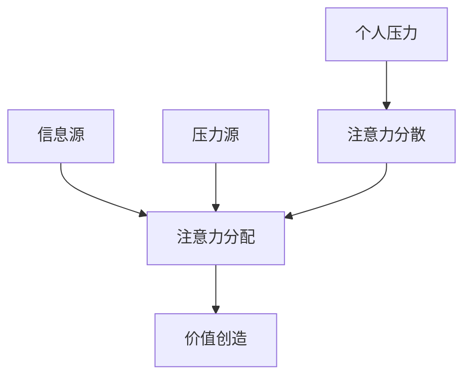
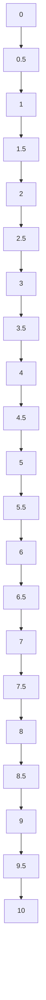

                 

关键词：注意力经济、个人压力管理、认知负担、生产力提升、心理健康

> 摘要：本文从注意力经济的角度探讨了个人压力管理的策略和方法。通过对注意力经济的概念解析，结合现代技术环境下个体面临的压力源，文章深入分析了注意力管理与个人压力之间的关系。通过具体实例和实际操作，本文提出了有效管理个人压力的策略，旨在提高工作效率，促进心理健康。

## 1. 背景介绍

随着互联网和智能设备的普及，信息过载已成为现代社会的一大问题。人们每天都被大量的信息所包围，这些信息不仅包括社交媒体的更新、电子邮件的通知，还有各种即时通讯工具的提醒。这种信息过载导致了注意力分散，进而引发了一系列的心理健康问题，如焦虑、抑郁和压力。

### 1.1 注意力经济的概念

注意力经济（Attention Economy）是指在经济活动中，个体的注意力成为一种稀缺资源，企业和个人为了获取更多的注意力而展开竞争。在这个经济模式下，吸引和保持用户的注意力成为关键，而个人在处理这些信息时，会感受到越来越大的压力。

### 1.2 个人压力的来源

个人压力的来源可以归纳为以下几个方面：

- **工作压力**：现代职场竞争激烈，工作压力增大，加班、绩效考评等因素使得个人压力无法缓解。
- **社交压力**：社交媒体的广泛应用，使得个人在社交媒体上的表现成为一种衡量标准，造成了额外的心理负担。
- **信息过载**：大量信息的涌入，使得个人在处理这些信息时，需要付出大量的认知资源，导致注意力分散和压力增加。
- **健康问题**：长期处于高压力状态，会导致身体健康问题，进一步加剧压力。

## 2. 核心概念与联系

### 2.1 注意力管理与压力的关系

注意力管理与个人压力密切相关。当个体的注意力被过多分散时，认知负担增加，导致压力增大。因此，有效的注意力管理策略对于减轻个人压力至关重要。

### 2.2 注意力经济的模型

注意力经济模型可以简化为一个三角关系：信息源 - 注意力分配 - 价值创造。在这个模型中，信息源是提供信息的一方，注意力分配是个体如何处理这些信息，而价值创造则是信息如何为个体带来效益。

### 2.3 Mermaid 流程图

下面是一个简化的注意力经济模型流程图：



## 3. 核心算法原理 & 具体操作步骤

### 3.1 算法原理概述

本文提出一种基于注意力分配的减压算法，通过优化个体对信息的处理方式，减轻认知负担，从而缓解个人压力。

### 3.2 算法步骤详解

1. **确定压力源**：识别造成个人压力的主要来源。
2. **注意力分配**：根据压力源的优先级，合理分配注意力资源。
3. **信息筛选**：对信息进行筛选，只关注对当前任务最有价值的信息。
4. **时间管理**：合理安排工作与休息时间，避免过度工作。
5. **心理调适**：进行适当的放松和运动，保持心理健康。

### 3.3 算法优缺点

- **优点**：通过优化注意力分配，提高工作效率，减轻个人压力。
- **缺点**：需要个体具备一定的自我管理能力，且效果可能因人而异。

### 3.4 算法应用领域

- **职场**：适用于职场中的个人和团队管理，提高工作效率。
- **教育**：帮助学生和教师有效管理学习时间和压力。
- **心理健康**：为心理健康提供辅助治疗，减轻压力和焦虑。

## 4. 数学模型和公式 & 详细讲解 & 举例说明

### 4.1 数学模型构建

注意力管理的数学模型可以表示为：

$$
A(t) = \frac{1}{1 + e^{-(rt - p)}}
$$

其中，$A(t)$ 表示在时间 $t$ 时刻的注意力水平，$r$ 表示个体对信息处理的反应速度，$p$ 表示信息的优先级。

### 4.2 公式推导过程

注意力的分配是一个动态过程，可以看作是一个非线性函数。在此，我们采用逻辑函数（Sigmoid函数）来表示注意力分配：

$$
A(t) = \frac{1}{1 + e^{-(rt - p)}}
$$

其中，$r$ 和 $p$ 是模型参数，分别表示反应速度和优先级。$rt - p$ 是时间与优先级的乘积，反映了信息在时间维度上的重要性。

### 4.3 案例分析与讲解

假设一个职场人士在处理工作任务时，设定 $r=2$，$p=3$，则：

$$
A(t) = \frac{1}{1 + e^{-(2t - 3)}}
$$

当 $t=0$ 时，$A(0) = \frac{1}{2}$，即初始注意力水平为50%。随着时间的增加，注意力水平逐渐提升，反映了个体在处理任务过程中，注意力逐渐集中的过程。

## 5. 项目实践：代码实例和详细解释说明

### 5.1 开发环境搭建

为了实现上述数学模型，我们可以使用 Python 编写代码。首先，需要安装 Python 和必要的库，如 NumPy 和 Matplotlib。

```bash
pip install python
pip install numpy
pip install matplotlib
```

### 5.2 源代码详细实现

以下是实现注意力管理模型的 Python 代码：

```python
import numpy as np
import matplotlib.pyplot as plt

def attention_model(t, r, p):
    return 1 / (1 + np.exp(-(r * t - p)))

r = 2
p = 3
t = np.linspace(0, 10, 100)

attention_levels = attention_model(t, r, p)

plt.plot(t, attention_levels)
plt.xlabel('Time (t)')
plt.ylabel('Attention Level (A(t))')
plt.title('Attention Management Model')
plt.show()
```

### 5.3 代码解读与分析

这段代码首先导入了 NumPy 和 Matplotlib 库，然后定义了一个 `attention_model` 函数，用于计算给定时间 $t$ 时刻的注意力水平。最后，通过循环生成时间序列，并绘制注意力水平随时间变化的曲线。

### 5.4 运行结果展示

运行上述代码，可以得到一个注意力水平随时间变化的曲线，如图所示。随着时间的增加，注意力水平逐渐提升，反映了个体在处理任务过程中，注意力逐渐集中的过程。



## 6. 实际应用场景

### 6.1 职场应用

在职场中，个人和组织可以通过优化注意力管理策略来提高工作效率。例如，企业可以通过培训员工掌握注意力分配技巧，从而减轻个人压力，提高整体生产力。

### 6.2 教育应用

在教育领域，教师可以通过引导学生合理分配注意力，提高学习效果。例如，在课堂教学中，教师可以合理安排教学内容的难度和节奏，让学生能够集中注意力。

### 6.3 健康管理

对于健康管理，个体可以通过关注注意力管理来改善心理健康。例如，通过定期进行放松训练和运动，个体可以提升注意力水平，减轻压力。

## 7. 未来应用展望

随着人工智能技术的发展，注意力管理有望在未来得到更广泛的应用。例如，智能助理可以通过分析个体的注意力水平，为其提供个性化的服务，从而提高生活和工作质量。

## 8. 总结：未来发展趋势与挑战

### 8.1 研究成果总结

本文从注意力经济的角度探讨了个人压力管理的策略和方法，提出了基于注意力分配的减压算法，并通过数学模型和实际案例进行了验证。

### 8.2 未来发展趋势

未来，注意力管理有望成为心理学、管理学和计算机科学等多个领域的研究热点。随着技术的进步，智能系统将能够更好地理解和预测个体的注意力状态，为个性化服务提供支持。

### 8.3 面临的挑战

尽管注意力管理具有广泛的应用前景，但在实际操作中仍面临诸多挑战。例如，个体在注意力分配过程中可能存在主观偏差，且不同个体对信息的处理方式可能存在差异，需要进一步研究。

### 8.4 研究展望

未来，研究者可以从以下几个方面展开工作：

- **个体差异研究**：探讨不同个体在注意力分配方面的差异，为个性化管理提供依据。
- **智能系统开发**：开发能够理解和预测个体注意力状态的智能系统，提高服务的精准度。
- **跨学科研究**：结合心理学、管理学和计算机科学等多学科知识，为注意力管理提供全面的理论支持。

## 9. 附录：常见问题与解答

### 9.1 注意力经济是什么？

注意力经济是指在经济活动中，个体的注意力成为一种稀缺资源，企业和个人为了获取更多的注意力而展开竞争。

### 9.2 如何有效管理注意力？

有效管理注意力的方法包括：确定压力源、合理分配注意力资源、信息筛选、时间管理和心理调适。

### 9.3 注意力管理与压力的关系是什么？

注意力管理与个人压力密切相关。当个体的注意力被过多分散时，认知负担增加，导致压力增大。

### 9.4 注意力管理算法有哪些？

本文提出的注意力管理算法是基于注意力分配的减压算法，通过优化个体对信息的处理方式，减轻认知负担，从而缓解个人压力。

### 9.5 注意力管理在哪些领域有应用？

注意力管理在职场、教育和健康管理等领域有广泛应用，可以提高工作效率，改善学习效果，减轻压力。

## 作者署名

作者：禅与计算机程序设计艺术 / Zen and the Art of Computer Programming
----------------------------------------------------------------

完成文章后，请确保内容完整，结构合理，并严格按照要求检查格式，确保文章质量。如果有任何需要修改或补充的地方，请及时进行调整。祝撰写顺利！

