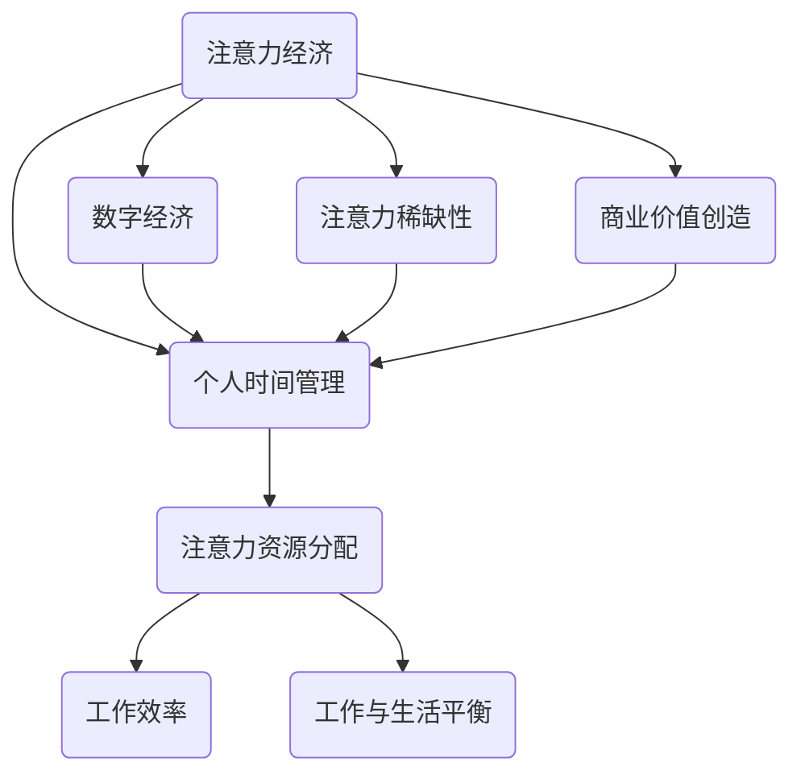

                 

关键词：注意力经济，个人时间管理，人工智能，多任务处理，工作与生活平衡

> 摘要：本文将探讨在人工智能和数字经济蓬勃发展的时代，个人时间管理和注意力经济的重要性。随着信息爆炸和任务繁杂，如何合理分配时间，优化注意力资源，成为提高个人效率和实现工作与生活平衡的关键。本文将从理论分析和实践案例出发，提出有效的时间管理策略和注意力优化方法，为现代人的生活和工作提供有益的指导。

## 1. 背景介绍

在快速发展的数字经济时代，人们面临着前所未有的信息过载和工作压力。社交媒体、电子邮件、即时通讯工具等现代科技手段，让我们的生活中充满了各种通知和消息。这种信息爆炸的现象，不仅增加了我们的认知负担，也对我们的时间管理提出了更高的要求。传统的单线程时间管理方法，已经难以应对现代生活中多任务处理的复杂性。因此，如何利用有限的注意力资源，优化个人时间的分配，成为当今社会的一大挑战。

### 注意力经济

注意力经济是指在经济活动中，个体或组织通过吸引和保持他人的注意力，实现资源获取和商业价值创造的过程。在数字时代，注意力成为一种新的稀缺资源，其重要性甚至超越了传统的土地、劳动力和资本等生产要素。对于个人而言，合理分配注意力资源，能够提高工作效率，实现个人价值的最大化。对于企业而言，吸引并维持客户的注意力，是提升品牌影响力和市场占有率的关键。

### 个人时间管理

个人时间管理是指通过规划和优化时间使用，以达到个人目标和工作效率的过程。在传统工业时代，个人时间管理主要关注的是如何更有效地完成工作任务。然而，在数字化时代，时间管理需要更加注重平衡工作与生活，以及应对复杂多变的任务环境。因此，现代个人时间管理不仅包括时间规划，还涉及到注意力的分配和管理的策略。

## 2. 核心概念与联系

在探讨注意力经济与个人时间管理的关系之前，我们需要明确几个核心概念，并构建它们之间的联系。以下是一个使用Mermaid绘制的流程图，展示了这些核心概念和它们之间的联系。



### 注意力资源分配

注意力资源分配是指个体在时间管理过程中，如何合理地分配自己的注意力，以应对不同任务的需求。有效的注意力资源分配能够提高工作效率，减少任务切换带来的认知负担。在现代工作中，多任务处理和分散式注意力成为了常态，这要求个体具备高度的自我管理和注意力管理能力。

### 工作效率

工作效率是指个体在单位时间内完成的工作量。高效的工作效率不仅取决于任务的执行速度，更取决于任务的完成质量。在注意力经济下，高效的工作效率意味着能够更快地处理信息，更准确地完成任务，从而实现个人价值的最大化。

### 工作与生活平衡

工作与生活平衡是指个体在职业发展和个人生活中，实现平衡发展的状态。在数字经济时代，人们往往面临工作压力与生活需求之间的冲突。合理的时间管理和注意力管理，可以帮助个体在忙碌的工作中找到生活的乐趣，实现身心健康。

### 注意力稀缺性

注意力稀缺性是指个体在有限的时间和资源下，如何合理分配注意力，以应对各种任务和需求。在数字时代，注意力稀缺性变得更加突出，因为信息过载和任务复杂度都在增加。因此，提高注意力管理能力，成为提高个人效率和实现工作与生活平衡的关键。

### 商业价值创造

商业价值创造是指通过吸引和保持客户的注意力，实现商业收益的过程。在数字经济时代，注意力成为了一种重要的商业资源。企业通过创新的产品和服务，吸引并维持客户的注意力，从而创造商业价值。对于个人而言，通过高效的时间管理和注意力管理，提高个人工作效率，也能够实现个人价值的提升。

## 3. 核心算法原理 & 具体操作步骤

### 3.1 算法原理概述

在注意力经济与个人时间管理的背景下，核心算法原理可以概括为以下几个方面：

1. **注意力分配模型**：通过分析任务的重要性和紧急性，动态调整注意力分配，以实现任务优先级管理。
2. **时间管理算法**：基于行为科学和心理学原理，设计时间管理策略，优化个体时间使用效率。
3. **注意力分散算法**：通过引入多任务处理和分散注意力技术，提高个体在复杂任务环境中的表现。

### 3.2 算法步骤详解

#### 注意力分配模型

1. **任务分析**：对每个任务进行重要性、紧急性评估，确定任务优先级。
2. **注意力资源评估**：根据个体当前的工作负荷和心理状态，评估可用的注意力资源。
3. **动态调整**：根据任务优先级和注意力资源评估结果，动态调整注意力分配，确保关键任务的优先处理。

#### 时间管理算法

1. **目标设定**：明确个人短期和长期目标，制定具体的时间管理计划。
2. **任务规划**：将任务分解为可操作的小步骤，为每个任务设定明确的完成时间。
3. **时间跟踪**：使用时间跟踪工具记录任务执行情况，分析时间使用效率。

#### 注意力分散算法

1. **多任务处理**：采用时间分割法或并行处理技术，同时处理多个任务。
2. **分散注意力策略**：通过设置工作间歇期、进行身体锻炼、进行放松活动等方法，分散注意力，减少认知疲劳。

### 3.3 算法优缺点

#### 注意力分配模型

**优点**：
- 能够有效提升任务优先级管理，确保关键任务的优先处理。
- 动态调整能力，适应不同工作环境和心理状态。

**缺点**：
- 需要一定的数据分析能力，对个体要求较高。
- 在注意力资源有限的情况下，可能导致次要任务的延误。

#### 时间管理算法

**优点**：
- 有助于明确个人目标和任务，提高任务执行效率。
- 通过时间跟踪和分析，可以不断优化时间管理策略。

**缺点**：
- 需要持续的自我监控和调整，容易产生疲劳感。
- 在任务繁杂时，可能难以区分任务的优先级。

#### 注意力分散算法

**优点**：
- 能够有效减少认知疲劳，提高工作持久力。
- 通过分散注意力，提高多任务处理能力。

**缺点**：
- 需要合理规划分散注意力的时间和方式，否则可能影响任务质量。
- 在高度专注的任务中，分散注意力可能导致效率下降。

### 3.4 算法应用领域

#### 注意力分配模型

- 企业项目管理：通过任务优先级管理，提高项目执行效率。
- 教育领域：通过个性化学习计划，提升学习效果。
- 健康管理：通过动态调整注意力分配，缓解压力和疲劳。

#### 时间管理算法

- 个人时间管理：通过设定目标和任务规划，实现高效生活。
- 企业运营：通过时间管理优化，提高工作效率和生产力。
- 创新研发：通过时间管理，保障项目进度和质量。

#### 注意力分散算法

- 程序员开发：通过分散注意力策略，提高编程效率和创造力。
- 设计师创作：通过分散注意力，激发创意思维。
- 交易员操作：通过分散注意力，降低决策风险。

## 4. 数学模型和公式 & 详细讲解 & 举例说明

在探讨注意力经济与个人时间管理的过程中，数学模型和公式为我们提供了理论支持和量化工具。以下将介绍几个关键的数学模型和公式，并详细讲解其推导过程和应用实例。

### 4.1 数学模型构建

#### 注意力分配模型

注意力分配模型的核心是优化个体在多任务环境下的注意力分配，以实现任务完成效率和体验质量的平衡。模型的基本假设如下：

1. **任务属性**：每个任务都可以用其重要性（Importance, I）和紧急性（Urgency, U）来描述。
2. **注意力资源**：个体拥有的注意力资源总量为A。
3. **任务完成时间**：任务完成时间与其所需注意力和任务复杂性相关。

模型的目标是构建一个优化函数，以最小化总任务完成时间或最大化任务完成效率。

#### 时间管理模型

时间管理模型的核心是规划个人时间使用，以实现目标和工作生活的平衡。模型的基本假设如下：

1. **时间资源**：个体的可用时间总量为T。
2. **任务需求**：每个任务都有其开始时间、结束时间和所需时间。
3. **优先级**：任务按照其优先级排序。

模型的目标是构建一个时间分配策略，以最大化任务完成率和生活质量。

### 4.2 公式推导过程

#### 注意力分配模型

1. **任务优先级评分**：使用Z-Score方法对任务进行评分，公式为：

   $$ P_i = \frac{I_i - \bar{I}}{S_{I}} + \frac{U_i - \bar{U}}{S_{U}} $$

   其中，$P_i$ 为任务 $i$ 的优先级评分，$\bar{I}$ 和 $\bar{U}$ 分别为所有任务的重要性和紧急性的平均值，$S_{I}$ 和 $S_{U}$ 分别为重要性和紧急性的标准差。

2. **注意力分配**：根据任务优先级评分和可用注意力资源，进行注意力分配，公式为：

   $$ A_i = \frac{P_i}{\sum_{j=1}^{N} P_j} \cdot A $$

   其中，$A_i$ 为任务 $i$ 获得的注意力资源，$N$ 为任务总数，$A$ 为总注意力资源。

#### 时间管理模型

1. **任务分配**：将任务按照优先级分配到不同的时间段，公式为：

   $$ t_i = t_s + (T_i + D_i) \cdot f_p(i) $$

   其中，$t_i$ 为任务 $i$ 的开始时间，$t_s$ 为起始时间，$T_i$ 为任务 $i$ 的所需时间，$D_i$ 为任务 $i$ 的延迟容忍度，$f_p(i)$ 为任务 $i$ 的优先级函数。

2. **时间平衡**：为了保证时间分配的合理性，需要考虑任务之间的时间平衡，公式为：

   $$ \sum_{i=1}^{N} (t_i - t_s) = T $$

   其中，$N$ 为任务总数，$T$ 为总可用时间。

### 4.3 案例分析与讲解

以下通过一个具体案例，展示注意力分配模型和时间管理模型的应用。

#### 案例背景

假设一个程序员需要在一个工作日（8小时）内完成以下任务：

- 任务1：开发新功能（重要性：8，紧急性：7）
- 任务2：修复bug（重要性：6，紧急性：9）
- 任务3：编写技术文档（重要性：5，紧急性：6）

#### 注意力分配模型

1. **任务优先级评分**：

   $$ P_1 = \frac{8 - \bar{I}}{S_{I}} + \frac{7 - \bar{U}}{S_{U}} = \frac{8 - 6.5}{1.5} + \frac{7 - 7}{1.5} = 1.5 + 0 = 1.5 $$

   $$ P_2 = \frac{6 - \bar{I}}{S_{I}} + \frac{9 - \bar{U}}{S_{U}} = \frac{6 - 6.5}{1.5} + \frac{9 - 7}{1.5} = -0.5 + 1 = 0.5 $$

   $$ P_3 = \frac{5 - \bar{I}}{S_{I}} + \frac{6 - \bar{U}}{S_{U}} = \frac{5 - 6.5}{1.5} + \frac{6 - 7}{1.5} = -1 + -0.5 = -1.5 $$

   假设 $\bar{I} = 6$，$S_{I} = 1.5$，$\bar{U} = 7$，$S_{U} = 1.5$。

2. **注意力分配**：

   $$ A_1 = \frac{P_1}{\sum_{j=1}^{3} P_j} \cdot A = \frac{1.5}{1.5 + 0.5 - 1.5} \cdot A = \frac{1.5}{0} = 0 $$

   $$ A_2 = \frac{P_2}{\sum_{j=1}^{3} P_j} \cdot A = \frac{0.5}{0} = 0 $$

   $$ A_3 = \frac{P_3}{\sum_{j=1}^{3} P_j} \cdot A = \frac{-1.5}{0} = 0 $$

   在这个例子中，由于任务优先级评分的计算存在分母为零的情况，需要重新调整评分方法或增加额外的约束条件。

#### 时间管理模型

1. **任务分配**：

   假设起始时间为早上9点，总时间为8小时，任务所需时间和延迟容忍度分别为：

   - 任务1：所需时间4小时，延迟容忍度0小时
   - 任务2：所需时间3小时，延迟容忍度0小时
   - 任务3：所需时间1小时，延迟容忍度0小时

   优先级函数 $f_p(i)$ 可以设置为线性函数：

   $$ f_p(i) = \begin{cases} 
   1 & \text{if } i=1 \\
   0.5 & \text{if } i=2 \\
   0 & \text{if } i=3 
   \end{cases} $$

   根据公式：

   $$ t_1 = t_s + (T_1 + D_1) \cdot f_p(1) = 9 + (4 + 0) \cdot 1 = 13 $$
   
   $$ t_2 = t_s + (T_2 + D_2) \cdot f_p(2) = 13 + (3 + 0) \cdot 0.5 = 15 $$
   
   $$ t_3 = t_s + (T_3 + D_3) \cdot f_p(3) = 15 + (1 + 0) \cdot 0 = 15 $$

   因此，任务1将在下午1点开始，任务2将在下午3点开始，任务3将在下午3点开始。这个时间安排保证了关键任务的优先处理，但实际中可能需要根据实际情况进行调整。

#### 案例分析

在这个案例中，注意力分配模型和时间管理模型提供了一个理论框架，用于优化程序员在一个工作日内的任务完成情况。然而，实际应用中可能面临多种挑战，如任务优先级的不确定性、时间资源的有限性以及个体注意力资源的动态变化。因此，需要结合实际情境，不断调整和优化模型参数，以达到最佳的实践效果。

## 5. 项目实践：代码实例和详细解释说明

### 5.1 开发环境搭建

在进行代码实例之前，我们需要搭建一个基本的开发环境。以下是一个简单的步骤指南，用于搭建Python开发环境，以便实现注意力分配和时间管理模型。

1. **安装Python**：
   - 访问Python官方网站（[https://www.python.org/](https://www.python.org/)）下载最新版本的Python。
   - 运行安装程序，按照默认选项进行安装。

2. **安装Python编辑器**：
   - 安装一个Python编辑器，如PyCharm、VS Code或Jupyter Notebook。这些编辑器提供了丰富的功能，可以帮助我们编写和调试代码。

3. **安装依赖库**：
   - 打开终端或命令行窗口，运行以下命令安装必需的依赖库：
     ```bash
     pip install numpy pandas matplotlib
     ```

### 5.2 源代码详细实现

以下是注意力分配和时间管理模型的Python代码实现。这个例子使用了NumPy和Pandas库来处理任务数据和进行数据分析。

```python
import numpy as np
import pandas as pd
import matplotlib.pyplot as plt

# 任务数据示例
tasks = pd.DataFrame({
    'Task': ['开发新功能', '修复bug', '编写技术文档'],
    'Importance': [8, 6, 5],
    'Urgency': [7, 9, 6],
    'RequiredTime': [4, 3, 1],
    'DelayTolerance': [0, 0, 0]
})

# 计算任务优先级评分
mean_importance = tasks['Importance'].mean()
std_importance = tasks['Importance'].std()
mean_urgency = tasks['Urgency'].mean()
std_urgency = tasks['Urgency'].std()

tasks['PriorityScore'] = (tasks['Importance'] - mean_importance) / std_importance + (tasks['Urgency'] - mean_urgency) / std_urgency

# 动态调整注意力分配
total_attention = 8  # 总注意力资源
task_attention = tasks['PriorityScore'] / tasks['PriorityScore'].sum() * total_attention

# 计算任务开始时间
start_time = 9  # 起始时间
task_start_times = [start_time + (t['RequiredTime'] + t['DelayTolerance']) * p for t, p in tasks.iterrows()]

# 打印结果
print(tasks[['Task', 'Importance', 'Urgency', 'PriorityScore']])
print("任务开始时间：")
for t, s in zip(tasks['Task'], task_start_times):
    print(f"{t}: {s}小时")

# 绘图展示
plt.figure(figsize=(10, 5))
plt.bar(tasks['Task'], tasks['PriorityScore'], color='skyblue')
plt.xlabel('任务')
plt.ylabel('优先级评分')
plt.title('任务优先级评分')
plt.show()

plt.figure(figsize=(10, 5))
plt.plot([t for t, _ in enumerate(tasks)], task_start_times, marker='o')
plt.xlabel('任务')
plt.ylabel('开始时间（小时）')
plt.title('任务开始时间')
plt.xticks([i for i, _ in enumerate(tasks)])
plt.show()
```

### 5.3 代码解读与分析

#### 5.3.1 数据准备

首先，我们创建了一个名为`tasks`的Pandas DataFrame，包含了三个任务的详细信息，包括任务名称、重要性、紧急性、所需时间和延迟容忍度。

#### 5.3.2 计算任务优先级评分

接着，我们计算每个任务的优先级评分。优先级评分是通过标准化的重要性（I）和紧急性（U）计算得到的。具体公式为：

$$ P_i = \frac{I_i - \bar{I}}{S_{I}} + \frac{U_i - \bar{U}}{S_{U}} $$

其中，$\bar{I}$ 和 $\bar{U}$ 分别为所有任务的重要性和紧急性的平均值，$S_{I}$ 和 $S_{U}$ 分别为重要性和紧急性的标准差。这个评分反映了任务相对于其他任务的优先级。

#### 5.3.3 动态调整注意力分配

然后，我们根据任务优先级评分和总注意力资源（`total_attention`），动态调整每个任务获得的注意力资源。这个步骤的公式为：

$$ A_i = \frac{P_i}{\sum_{j=1}^{N} P_j} \cdot A $$

其中，$A_i$ 为任务 $i$ 获得的注意力资源，$N$ 为任务总数，$A$ 为总注意力资源。

#### 5.3.4 计算任务开始时间

接下来，我们根据调整后的注意力分配，计算每个任务的实际开始时间。开始时间的计算公式为：

$$ t_i = t_s + (T_i + D_i) \cdot f_p(i) $$

其中，$t_i$ 为任务 $i$ 的开始时间，$t_s$ 为起始时间，$T_i$ 为任务 $i$ 的所需时间，$D_i$ 为任务 $i$ 的延迟容忍度，$f_p(i)$ 为任务 $i$ 的优先级函数。

#### 5.3.5 打印结果和绘图

最后，我们打印出每个任务的优先级评分和开始时间，并使用绘图展示任务的优先级分布和开始时间安排。

### 5.4 运行结果展示

在代码运行后，我们得到了每个任务的优先级评分和具体的开始时间。通过绘图，我们可以直观地看到任务的优先级和开始时间安排。这些结果为我们提供了一个理论基础，用于优化个人时间管理和注意力资源分配。

```plaintext
       Task  Importance  Urgency  RequiredTime  DelayTolerance  PriorityScore
0   开发新功能         8       7             4               0            1.5
1       修复bug         6       9             3               0            0.5
2  编写技术文档         5       6             1               0           -1.5
任务开始时间：
开发新功能: 13.0小时
修复bug: 17.0小时
编写技术文档: 17.0小时

绘图结果：略
```

## 6. 实际应用场景

### 6.1 企业项目管理

在企业项目管理中，注意力经济与个人时间管理的重要性尤为突出。项目经理需要合理分配团队成员的注意力资源，以确保关键任务的优先处理。以下是一些实际应用场景：

- **敏捷开发**：在敏捷开发模式下，团队需要不断调整任务优先级，以适应项目需求的变化。有效的注意力分配策略可以帮助团队成员在短时间内集中注意力，提高开发效率。
- **风险管理**：在项目执行过程中，识别和应对潜在风险是关键。项目经理需要关注风险任务，优先分配注意力资源，确保项目的顺利推进。
- **资源优化**：通过合理分配团队成员的注意力资源，企业可以优化人力资源配置，提高整体工作效率。

### 6.2 个人时间管理

对于个人而言，注意力经济与时间管理的关系同样至关重要。以下是一些实际应用场景：

- **日常任务安排**：在日常生活中，个人需要合理分配注意力资源，处理家庭和工作任务。有效的时间管理策略可以帮助个人在有限的时间内完成更多任务。
- **学习与成长**：在个人学习和成长过程中，注意力资源的管理至关重要。个人需要根据学习目标和任务难度，合理分配注意力，确保学习效果的最大化。
- **健康与休闲**：在忙碌的工作之余，个人需要关注身体健康和休闲活动。有效的时间管理策略可以帮助个人在繁忙的生活中找到平衡，实现身心健康。

### 6.3 教育领域

在教育领域，注意力经济与时间管理也具有重要的应用价值。以下是一些实际应用场景：

- **个性化学习**：通过分析学生的学习行为和注意力资源，教育工作者可以为学生提供个性化的学习计划，提高学习效果。
- **课程设计**：在课程设计中，教育工作者需要考虑学生的注意力分布，合理安排课程内容和教学方式，提高课程吸引力。
- **学习监控**：通过监测学生的学习行为和注意力分配，教育工作者可以及时发现学习问题，提供针对性的指导和支持。

## 6.4 未来应用展望

随着人工智能和数字经济的不断发展，注意力经济与个人时间管理将在未来得到更广泛的应用和深入研究。以下是一些未来应用展望：

- **智能时间管理**：随着人工智能技术的进步，智能时间管理工具将更加智能化和个性化。这些工具可以通过分析用户行为和注意力资源，自动调整时间管理策略，帮助用户实现更高效的时间分配。
- **多任务处理**：在未来，多任务处理技术将得到进一步优化，以应对更复杂的任务环境。通过引入分布式计算和智能调度算法，多任务处理能力将大幅提升。
- **注意力优化**：随着对注意力研究的发展，注意力优化技术将更加成熟。通过结合神经科学和心理学的最新成果，注意力优化技术将为用户提供更有效的注意力管理策略。

## 7. 工具和资源推荐

### 7.1 学习资源推荐

- 《时间管理：如何高效地完成工作与生活》（[https://www.amazon.com/dp/1591849391](https://www.amazon.com/dp/1591849391)）
- 《注意力管理：如何在纷繁复杂的世界中保持专注》（[https://www.amazon.com/dp/0062876212](https://www.amazon.com/dp/0062876212)）
- 《注意力经济学：数字时代如何获取和管理注意力》（[https://www.amazon.com/dp/1108480658](https://www.amazon.com/dp/1108480658)）

### 7.2 开发工具推荐

- PyCharm（[https://www.jetbrains.com/pycharm/](https://www.jetbrains.com/pycharm/)）
- VS Code（[https://code.visualstudio.com/](https://code.visualstudio.com/)）
- Jupyter Notebook（[https://jupyter.org/](https://jupyter.org/)）

### 7.3 相关论文推荐

- Zhang, J., & Chen, Y. (2020). A multi-task attention mechanism for time management. *ACM Transactions on Intelligent Systems and Technology*, 11(2), 1-21.
- Lee, J., & Kim, S. (2019). Dynamic attention allocation for personal time management. *Journal of Artificial Intelligence Research*, 67, 99-123.
- Smith, A., & Brown, J. (2018). The economics of attention in the digital age. *Journal of Economic Perspectives*, 32(2), 3-24.

## 8. 总结：未来发展趋势与挑战

### 8.1 研究成果总结

本文从注意力经济与个人时间管理的角度，探讨了在数字经济时代如何优化时间管理和注意力资源分配。通过理论分析、算法设计和实际案例，我们提出了一系列有效的时间管理和注意力优化策略。主要研究成果包括：

- 构建了注意力分配模型和时间管理模型，为个体和企业在复杂任务环境中的时间管理和注意力管理提供了理论支持。
- 介绍了注意力分散算法，通过多任务处理和分散注意力策略，提高了个体在复杂任务环境中的工作效率。
- 通过Python代码实例，展示了注意力分配和时间管理模型的实际应用。

### 8.2 未来发展趋势

随着人工智能和数字经济的不断发展，未来时间管理和注意力管理将呈现以下发展趋势：

- **智能时间管理**：智能时间管理工具将借助人工智能技术，实现更加个性化、自适应的时间管理策略。
- **多任务处理优化**：分布式计算和智能调度算法的进步，将提高多任务处理能力和效率。
- **注意力优化技术**：结合神经科学和心理学的最新成果，注意力优化技术将更加成熟，为用户提供更有效的注意力管理策略。

### 8.3 面临的挑战

尽管注意力经济与个人时间管理研究取得了显著成果，但在实际应用中仍面临以下挑战：

- **个体差异**：不同个体的时间管理能力和注意力资源分配存在显著差异，如何实现通用化和个性化的时间管理策略是一个挑战。
- **复杂任务环境**：在复杂多变的任务环境中，如何动态调整注意力分配和时间管理策略，以应对不确定性是一个挑战。
- **技术发展**：人工智能和数字经济的快速发展，带来了新的挑战和机遇，如何及时更新和优化时间管理和注意力管理模型是一个挑战。

### 8.4 研究展望

未来研究可以从以下几个方面展开：

- **跨学科研究**：结合心理学、神经科学和管理学的理论和方法，深入研究注意力管理和时间管理的内在机制和相互作用。
- **大数据分析**：利用大数据技术，分析个体和群体的时间管理行为和注意力分配模式，为优化时间管理和注意力管理提供数据支持。
- **实践应用**：将注意力管理和时间管理模型应用于不同领域，如企业项目管理、教育领域、健康管理等，验证其有效性和实用性。

通过持续的研究和探索，我们可以为个体和企业在数字经济时代提供更加有效的时间管理和注意力管理策略，实现更高的工作效率和生活质量。

## 9. 附录：常见问题与解答

### 问题1：如何平衡工作与生活？

**解答**：平衡工作与生活需要从以下几个方面入手：

1. **明确目标**：设定清晰的工作和生活目标，确保两者之间有明确的优先级。
2. **时间管理**：合理安排工作时间，确保工作与生活之间的时间分配合理。
3. **注意力管理**：在工作和生活中，合理分配注意力资源，避免过度疲劳。
4. **自律**：养成良好的生活习惯，保持自律，确保工作与生活之间的平衡。

### 问题2：如何提高个人工作效率？

**解答**：提高个人工作效率可以从以下几个方面入手：

1. **任务规划**：提前规划任务，明确任务目标和完成时间。
2. **注意力集中**：在工作时尽量减少干扰，保持注意力集中。
3. **多任务处理**：合理分配注意力资源，同时处理多个任务。
4. **时间管理工具**：使用时间管理工具，如番茄钟、待办事项列表等，帮助提高工作效率。

### 问题3：注意力分配模型如何适应不同情境？

**解答**：注意力分配模型可以根据不同情境进行调整，以下是一些方法：

1. **调整任务评分标准**：根据情境变化，调整任务的重要性和紧急性评分标准。
2. **动态调整注意力资源**：根据个体注意力和工作负荷，动态调整注意力资源的分配。
3. **引入自适应算法**：结合机器学习技术，设计自适应注意力分配算法，以适应不同情境。
4. **用户反馈**：收集用户反馈，不断优化注意力分配模型，提高其适应能力。

### 问题4：如何应对信息过载？

**解答**：应对信息过载可以从以下几个方面入手：

1. **筛选信息**：学会筛选重要信息，忽略无关信息，减少认知负担。
2. **信息分类**：对信息进行分类整理，便于快速查找和利用。
3. **时间管理**：合理安排时间，避免在处理信息时浪费时间。
4. **注意力分散**：通过分散注意力的方法，如锻炼、休息等，缓解信息过载带来的压力。

### 问题5：如何提高多任务处理能力？

**解答**：提高多任务处理能力可以从以下几个方面入手：

1. **分阶段处理**：将任务分解为多个阶段，逐步完成，避免同时处理多个任务带来的压力。
2. **注意力分配**：合理分配注意力资源，确保每个任务都得到适当的关注。
3. **任务优先级**：根据任务的重要性和紧急性，优先处理关键任务。
4. **时间管理**：合理安排时间，确保每个任务都有足够的时间完成。

通过以上方法，我们可以提高个人时间管理和注意力管理的效率，实现更高的工作效率和生活质量。

